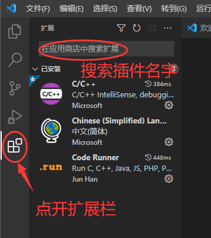
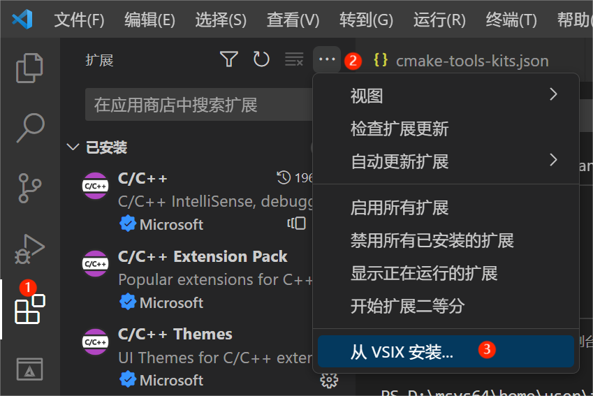
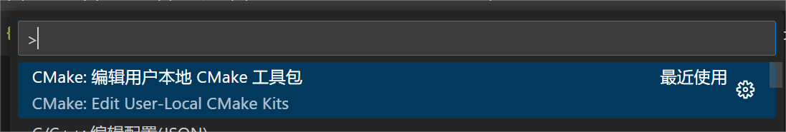
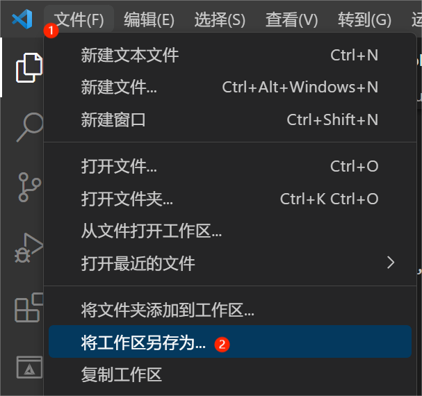
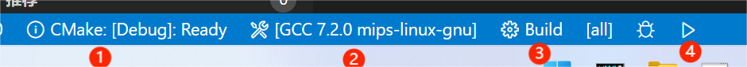
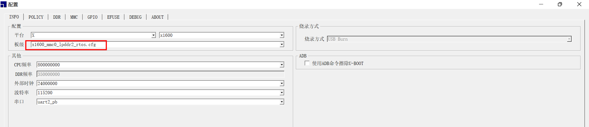
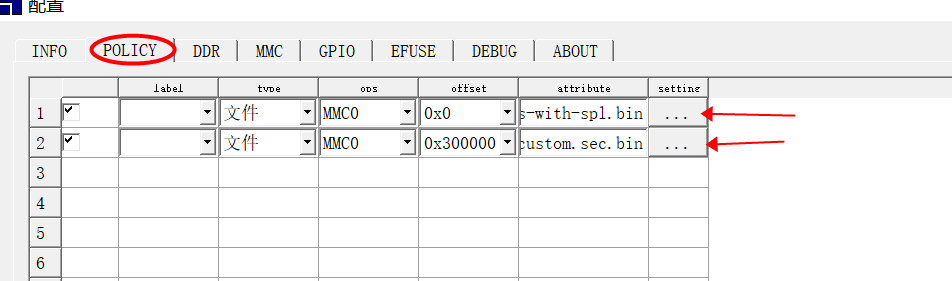

## 目录介绍

### 主目录部分

```c
-bash$ tree -L 1
  .
 ├── cmake               - sdk cmake 编译环境
 ├── CMakeLists.txt      - sdk 主 cmake 文件
 ├── custom.cmake        - 在该文件中添加用户 section 的目录
 ├── elgDemo0            - 使用用例，参考该目录下 CMakeLists.txt 编写新用例
 ├── elgDemo1            - 使用用例，参考该目录下 CMakeLists.txt 编写新用例
 ├── elgDemo2            - 使用用例，参考该目录下 CMakeLists.txt 编写新用例
 ├── host-tools          - 用于打包二进制文件的系统工具
 ├── platform            - 平台库，头文件，freertos，系统 base section bin
 ├── linux_vs            - linux vscode 开发配置文件
 ├── windows_vs          - windows vscode 开发配置文件
 └── prebuilts           - 编译器
  
  8 directories, 2 files
```

### 自定义模块目录

```c
.
├── CMakeLists.txt     - 该模块 cmake 文件， 参考该文件编写新用例
├── foo.c              - 用例文件
├── import       - 该目录下编写 import.txt 文件，将使用的系统函数定义在该文件中（后续可能会被移除，不再需要）
│   └── import.txt
└── main.c             - 用例文件

```

自定义模块 CMakeLists.txt 文件， 其中基本形式如下，必须定义变量
+ LOCAL_SECTION_TYPE:  参考 section.json 文件定义编译模块的section 类型
+ LOCAL_SECTION_TARGET: 用户自定义模块名称
+ LOCAL_IMPORT_FILE： import.txt 文件路径
+ 添加文件
+ include(secgen) ：在文件最后需要 include secgen。

```c
cat CMakeLists.txt
cmake_minimum_required(VERSION 3.8.1)
PROJECT (elgDemo)

# LOCAL_XX is must set for each section
add_library(elgfoo STATIC  foo.c)
set(LOCAL_SECTION_TYPE    "section1")
set(LOCAL_SECTION_TARGET elgDemo.elf)
set(LOCAL_IMPORT_FILE ${CMAKE_CURRENT_SOURCE_DIR}/import/import.txt)

set(SRC_FILE main.c)
add_executable(${LOCAL_SECTION_TARGET} ${SRC_FILE})
target_link_libraries(${LOCAL_SECTION_TARGET}  elgfoo)
target_compile_options(${LOCAL_SECTION_TARGET} PRIVATE -O0 -g0)

# include section binary generate cmake
include(secgen)

```


## linux 平台开发

### 1.基于命令行 Cmake 构建

使用下面命令编译，编译并打包所有 custom.cmake 文件中添加的用户模块以及RTOS系统的基础section文件platform/image/section.bin，产生名为 custom.sec.bin 的二进制文件。
可使用 cmake 参数 -DMERGE_BASE_SECTION=OFF, 只打包 custom.cmake 中模块

```c
cd  sdk/manhattan-sdk_username_linux/   //  进入sdk的目录下
    
mkdir build
cd build
cmake -DCMAKE_TOOLCHAIN_FILE=../cmake/mips.cmake ..
make
make install DESTDIR=install
 
```


### 2.基于 vscode 集成开发环境

**注：建议 linux 使用 ubuntu 20.04 以上版本**

注：保证 cmake 版本 在 VERSION 3.8.1 之上，可以使用最新的 cmake 版本。同时不要使用提供的工具链中的camke 不然会在vscode中进行报错。

具体流程如下：

 1. 下载 vscode 集成开发环境  并安装插件

    [下载地址]: https://code.visualstudio.com/

    

    安装插件：安装C/C++和Code Runner插件，用来提供C/C++代码高亮和编译运行C/C++代码。安装 camke 和camke tools 来配置cmake。阅读英文不便的情况 也包含中文插件。

    

       如果是一些内网的情况下可以选择 VSIX 安装：

    [下载地址]: https://marketplace.visualstudio.com/

    进入之后通过搜索插件名字进行下载，选择路径和版本，版本选择上尽可能贴近最新版本。下载后按照下述图片进行安装。

    

    

    

 2. 使用 vscode 打开 sdk 工程

    所打开的目录层为 manhattan-sdk_username_linux ，username  视具体情况而定
    这个文件夹内拷贝 外面的 linux_vscode 中的四个文件到 .vscode文件夹内 setting.json、c_cpp_properties.json 、launch.json、cmake-tools-kits.json

    ```shell
    前提： cd manhattan-sdk_username_linux 
    mkdir .vscode
    cp linux_vs/* .vscode 
    
    ```

    

    注：cmake 路径需要进行修改  在setting.json  中  cmake.cmakePath。

    **说明：**针对编译器包，在 vscode 中按下 ctrl+shift+p, 在弹出的输入框输入 cmake: edit user-local cmake kits 点击进入，将.vscode 文件夹中的 cmake-tools-kits.json 全部复制到 刚刚打开的文件内，两者文件名字是一样的。后续开发过程也可以在 cmake-tools-kits.json (快捷键打开的文件) 内填入不同的编译器包。

    

    

    

 3. 保存工作区

    点击 vscode 左上角 文件 ---> 将工作区另存为--->选择默认文件夹保存，重新启动 vscode。

    

 3. 运行编译工程

    根据图片顺序进行点击操作

    

    

    点击1 cmake 部分根据需求选择合适的参数，然后点击右侧 2 的位置选择合适的编译器包，也可以自主添加编译器包。 点击3 build 的位置 进行编译工程并进行运行cmake，点击右侧 4 部分的按钮选择需要调试的模块进行按需求调试即可。

    

### 3. 烧录

烧录工具：选择 linux 版本烧录工具

使用 ：

1. 拷贝板级文件到烧录工具的文件内，板级文件在sdk/manhattan-sdk_username_linux/host-tools 内 x1600_mmc0_lpddr2_rtos.cfg将其拷贝到烧录工具目录下的 configs --> x1600 文件下，打开烧录工具，点击配置选项，点击板级下拉按钮选择刚刚添加的板级名字。

	2. 将 install/usr/local/images/ 下的文件烧录并运行， 其中 custom.sec.bin 默认烧录地址是 3M 位置






