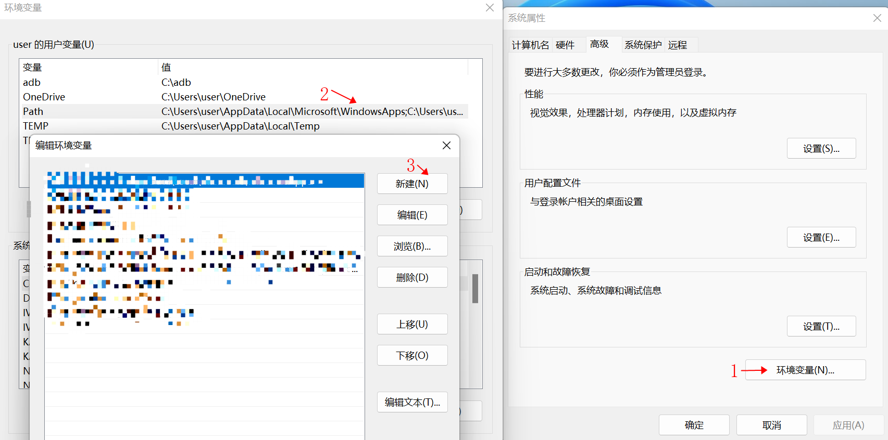
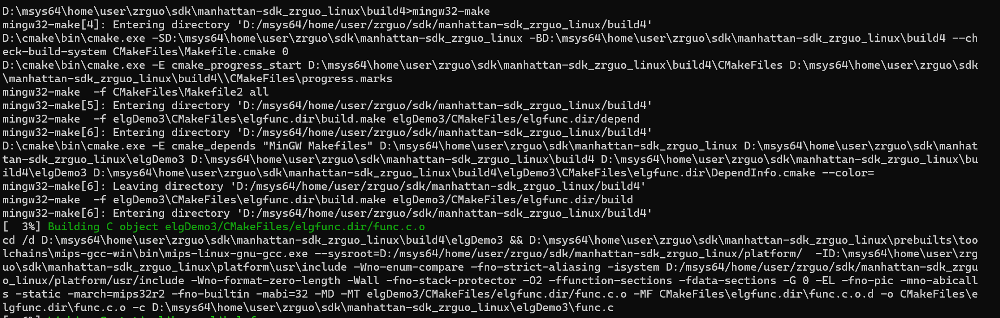
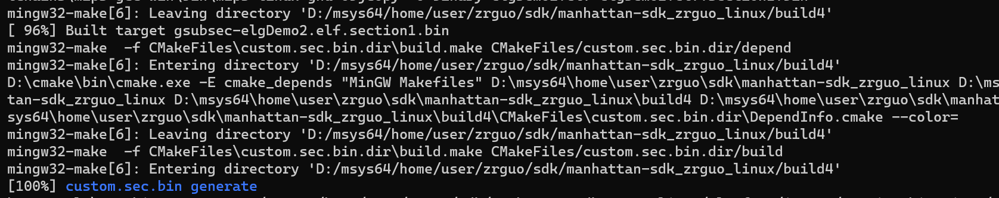

## 目录介绍

### 主目录部分

```c
-bash$ tree -L 1
  .
 ├── cmake               - sdk cmake 编译环境
 ├── CMakeLists.txt      - sdk 主 cmake 文件
 ├── custom.cmake        - 在该文件中添加用户 section 的目录
 ├── elgDemo0            - 使用用例，参考该目录下 CMakeLists.txt 编写新用例
 ├── elgDemo1            - 使用用例，参考该目录下 CMakeLists.txt 编写新用例
 ├── elgDemo2            - 使用用例，参考该目录下 CMakeLists.txt 编写新用例
 ├── host-tools          - 用于打包二进制文件的系统工具
 ├── platform            - 平台库，头文件，freertos，系统 base section bin
 ├── linux_vs            - linux vscode 开发配置文件
 ├── windows_vs          - windows vscode 开发配置文件
 └── prebuilts           - 编译器
  
  8 directories, 2 files
```

### 自定义模块目录

```c
.
├── CMakeLists.txt     - 该模块 cmake 文件， 参考该文件编写新用例
├── foo.c              - 用例文件 
├── import       - 该目录下编写 import.txt 文件，将使用的系统函数定义在该文件中（后续可能会被移除，不再需要）
│   └── import.txt
└── main.c             - 用例文件

```

自定义模块 CMakeLists.txt 文件， 其中基本形式如下，必须定义变量

+ LOCAL_SECTION_TYPE:  参考 section.json 文件定义编译模块的section 类型
+ LOCAL_SECTION_TARGET: 用户自定义模块名称
+ LOCAL_IMPORT_FILE： import.txt 文件路径
+ 添加文件
+ include(secgen) ：在文件最后需要 include secgen。

```c
cat CMakeLists.txt
cmake_minimum_required(VERSION 3.8.1)
PROJECT (elgDemo)

# LOCAL_XX is must set for each section
add_library(elgfoo STATIC  foo.c)
set(LOCAL_SECTION_TYPE    "section1")
set(LOCAL_SECTION_TARGET elgDemo.elf)
set(LOCAL_IMPORT_FILE ${CMAKE_CURRENT_SOURCE_DIR}/import/import.txt)

set(SRC_FILE main.c)
add_executable(${LOCAL_SECTION_TARGET} ${SRC_FILE})
target_link_libraries(${LOCAL_SECTION_TARGET}  elgfoo)
target_compile_options(${LOCAL_SECTION_TARGET} PRIVATE -O0 -g0)

# include section binary generate cmake
include(secgen)

```


## windows 平台开发

**注：window 环境建议在window 10或window 11版本，配置环境过程中路径尽量避免使用中文路径**

### 1.基于命令行

**环境搭建：**

1. MSYS2 软件

   **MSYS2**是与mingw-w64配套的**命令行环境**，它为windows提供了类似linux的命令和**包管理器**`pacman`，可以直接在命令行查找、安装和卸载各种第三方库和开发工具。

   a. 下载安装MSYS2软件

   [下载地址]: https://www.msys2.org/

     选择合适安装路径，点击下一步进行安装。

   b. 使用pacman安装编译器 

   ​	打开 MSYS2 软件 下载安装完成后会有6个子环境，使用 msys2\UCRT64 均可，输入 pacman -Syu 同步更新所有工具，然后输入 pacman -S mingw-w64-ucrt-x86_64-toolchain 安装 mingw-w64 工具链。中间出现询问按下回车。

   c. 添加环境变量

   ```
    D:\MSYS64\USR\BIN   以下整个路径可以直接复制，需要修改安装在哪个盘，且提供参考是D盘
    D:\msys64\mingw64\bin 
   ```

   ​	加入环境变量方式：Win+S搜索path，选择**修改系统环境变量**，点开**环境变量**，然后在用户变量（只对当前用户起效）或者系统变量（对所有用户起效）中找到path变量，双击修改即可，或者进行添加，将其路径添加到环境变量中。 或者可以按win键直接搜索环境变量。

   ​	

   ​	

   ​	执行完成后，如果一切正常，打开windows 中的 powershell 。如若是windows 11 可以在桌面右击鼠标点击终端打开， 或者 点击我的电脑 任何目录下，空白处右击终端打开即可。windows 10 采用 win + r 输入powershell 。打开命令行，输入gcc --version显示gcc的版本，如果显示错误，请重新设置环境变量。

   

2.  CMAKE 软件

**注**：cmake  需要在Windows中下载，不要使用 msys2 中的。

下载过程选择 下载路径，点击下一步。cmake 在安装过程选择添加 path 的选项，未选择就需要找到cmake下  bin 的路径 将其添加到 Windows 的环境变量内。

[下载地址]: https://cmake.org/download/

环境变量的问题：尽量要将下载后cmake 的环境变量向上提高优先级，可以提高到所有设置环境变量的最上方，不然可能会导致 msys2中的cmake 会覆盖下载的camke 导致编译不过。

3. mips 交叉编译工具 

```
windows 交叉编译工具路径：prebuilts/toolchains/mips-gcc-win
```


**编译：**

首先将 sdk 目录存放到 msys64\home\username 下，username 由用户自行创建。其次打开 windows 中的 powershell ，cd 进入到manhattan-sdk_username_linux 中，然后根据下述步骤进行编译运行。

```c
cd  sdk/manhattan-sdk_username_linux  username 根据实际目录有所变化，该目录与readme 同级
mkdir build
cd build
cmake -DCMAKE_TOOLCHAIN_FILE=../cmake/mips.cmake -G “MinGW Makefiles” ..
mingw32-make
mingw32-make install DESTDIR=install 

cmake 如果报出错误说明是 cmake 的环境变量有问题或者未使用下载的cmake
```



出现 100%  编译成功




### 2.基于 vscode 集成开发环境开发

**建议 vscode 使用最新版本，并且使用 vscdode 开发时需要将标题 1 基于命令行版本的配置完成**

注：保证 cmake 版本 在 VERSION 3.8.1 之上，可以使用最新的 cmake 版本。同时不要使用工具链中的camke 不然会在vscode中报错，导致编译不过。

1. 下载 vscode 集成开发环境，并安装插件

   [下载地址]: https://code.visualstudio.com/

   选择合适的 windows 版本进行下载安装，选择合适路径，点击下一步。

   安装插件：安装C/C++和Code Runner插件，用来提供C/C++代码高亮和编译运行C/C++代码。安装 camke 和camke tools 来配置cmake。阅读英文不便的情况 也包含中文插件。

   安装方式一：网络允许的情况下直接搜索插件名字，点击安装。

   

   安装方式二：如果是一些内网的情况下可以选择 VSIX 安装：

   [下载vsix文件地址]: https://marketplace.visualstudio.com/

   ​	进入之后通过搜索插件名字进行下载，选择路径和版本，版本选择上尽可能贴近最新版本。下载后按照下述图片进行安装。

   

   

2. 使用 vscode 打开 sdk 工程

   所打开的目录层为 manhattan-sdk_username_linux ，username  视具体情况而定。
   拷贝 linux_vscode 中的四个文件到 .vscode文件夹内 : setting.json、c_cpp_properties.json 、launch.json、cmake-tools-kits.json

   ```shell
   使用 vscode 命令行 ctrl + j 点击终端，进入 manhattan-sdk_username_linux 目录层
   mkdir .vscode
   cp windows_vs/* .vscode
   ```

   **说明：**针对编译器包，在 vscode 中按下 ctrl+shift+p, 在弹出的输入框输入 cmake: edit user-local cmake kits 点击进入，将.vscode 文件夹中的 cmake-tools-kits.json 全部复制到 刚刚打开的文件内，两者文件名字是一样的。后续开发过程也可以在cmake-tools-kits.json (快捷键打开的文件) 内填入不同的编译器包。

   

   注：cmake 路径需要进行修改  在setting.json  中  cmake.cmakePath。
   		msys2的路径 如果跟参考不一致也是需要进行修改，建议安装在D盘下。
   		环境变量：根据优先级由高到低进行添加。
               	D:\cmake\bin   			camke路径			以下仅此提供参考路径，具体根据实际进行修改。
   ​		D:\MSYS64\USR\BIN     		 msys64 路径
   ​		D:\Microsoft VS Code\bin。	 vscode 路径
   ​		D:\msys64\mingw64\bin。		mingw64路径


3. 保存工作区

   点击 vscode 左上角 文件 ---> 将工作区另存为--->选择默认文件夹保存，在自动创建好的文件内 setting 中加入下面一行代码，保存，重新启动 vscode。

   ```json
   "settings": {"cmake.generator": "MinGW Makefiles"}
   ```

   

4. 运行编译工程
   根据图片顺序进行点击操作

   

   点击1 cmake 部分根据需求选择合适的参数，然后点击右侧 2 的位置选择合适的编译器包，也可以自主添加编译器。 点击build 3 的位置 进行编译工程并进行运行cmake，点击右侧 4 部分的按钮选择需要调试的模块进行按需求调试即可。


## 3.烧录


烧录工具：选择 windows 版本烧录工具

使用 ：

  		1. 拷贝板级文件到烧录工具的文件内，板级文件在sdk/manhattan-sdk_username_linux/host-tools 内 x1600_mmc0_lpddr2_rtos.cfg
  	   将其拷贝到烧录工具目录下的 configs --> x1600 文件下，打开烧录工具，点击配置选项，点击板级下拉按钮选择刚刚添加的板级名字。
  		2. 将 install/usr/local/images/ 下的文件烧录并运行， 其中 custom.sec.bin 默认烧录地址是 3M 位置


交互工具：

windows 下与开发板进行交互的工具，使用常见的串口工具即可 例如：MobaXterm 或者 SecureCRT 等, 波特率115200，端口可以通过 我的电脑->管理->端口  查看


