# SDK Project Download

The SDK source code projects for the development boards are released to the public via Baidu Netdisk. This section will explain how to download the latest source code projects and extract the related zip files, with download links included in the text.

## SDK Download

X2660 Baidu Netdisk download link: [https://pan.baidu.com/s/1g0PA-bfX0E6hbDmUSmMG4Q?pwd=wnv2](https://pan.baidu.com/s/1g0PA-bfX0E6hbDmUSmMG4Q?pwd=wnv2)

Extraction code: wnv2

X2670, X2670M, X2600, X2600E Baidu Netdisk download link: [https://pan.baidu.com/s/1T4Fh3G2FvIgY4QNgFQN6Mw?pwd=8zgb](https://pan.baidu.com/s/1T4Fh3G2FvIgY4QNgFQN6Mw?pwd=8zgb)

Extraction code: 8zgb

Taking X2660 as an example, the directory under X2660 is shown in Figure 1-1

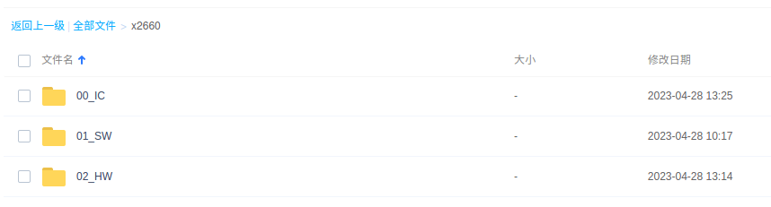

Figure 1-1

Under the directory 00_IC, there is a chip data manual for the development board; under 01_SW, there are SDK software packages and pre-compiled default demo images; under 02_HW, there are hardware schematics for the X2660 Halley V1.1 development board.

This section primarily discusses the download of the software package; users can choose to download other materials as needed. Here we select the latest SDK software package for download, as shown in Figure 1-2. If there is a newer version available, please choose the most recent one.

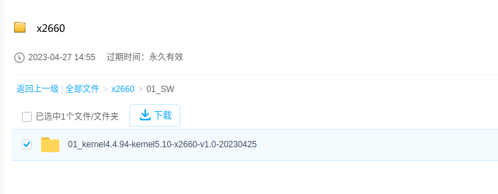

Figure 1-2

## Buildroot Download

The X26xx halley software development platform requires the use of Buildroot to provide the most basic file system. Therefore, you need to download the modified Buildroot project made by Ingenic.

baidu Netdisk download link: <https://pan.baidu.com/s/1e57Ze_WXoOHGFN6xhcNLkQ>

Extraction code: gx42

Similarly, choose the latest project for download here. *(It is particularly important to prioritize downloading dl-xxxx. If you do not download this compressed package, although it will be downloaded online during compilation, it may be slow or error-prone due to poor network conditions. Prioritizing the download of this package can avoid potential issues caused by the network. It is recommended to download the latest compressed package by date.)*

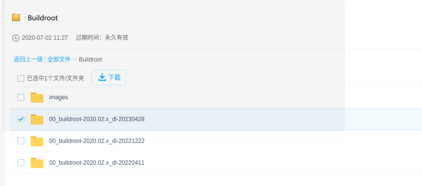 

Figure 1-3

## Project Decompression

1. Take the compressed package file in the downloaded SDK project directory, for example x2670, and copy the

ingenic-linux-kernel4.4.94-kernel5.10-x2600-v2.0-20230906.tar.bz2 file to a newly created directory.

2. Copy the `dl.tar.bz2` from the downloaded Buildroot project directory to the newly created directory mentioned above. The SDK project usually includes the Buildroot project, but if not, you need to download and extract it separately.

3. Execute the commands to extract:

```
$ tar -xf ingenic-linux-kernel4.4.94-kernel5.10-x2670-v1.0-20230609.tar.bz2
$ tar -xf dl.tar.bz2 -C ./buildroot/
```

# SDK Introduction

## Overall Project Structure

The X26xx Halley software development platform, developed by Ingenic, is a distribution and development platform for the Linux system that supports the compilation of C and CPP files. It also supports the compilation of static libraries, dynamic libraries, and executable files. This software development platform can also quickly and easily integrate and add third-party applications and library files. The project supports overall compilation, individual module compilation, and selective compilation. The project directory of this software development platform is shown in Figure 2-1.

| Project Structure |                                 |
| ---------------- | -------------------------------- |
| build            | Compilation rules and documentation for the entire project |
| buildroot        | buildroot source code, providing the most basic file system |
| development      | Software libraries under development       |
| device           | Board-level configuration information   |
| docs             | Documentation and SDK user manual        |
| external         | Third-party software packages          |
| frameworks       | Middleware software libraries          |
| kernel           | Kernel source code                 |
| packages         | Applications                       |
| prebuilts        | Compilation toolchain               |
| tools            | OTA upgrade tools                  |
| u-boot           | U-Boot source code                |

## Documentation Explanation

The purpose of this document is to help developers quickly understand how to compile the SDK and burn the program. If users need a more in-depth understanding of the X26xx Halley's peripheral modules and application development, they can refer to the other documents released with the X26xx Halley. Please refer to Table 1 for the description of each document.

Table 1

| Document Name | Description of Document Content |
| --- | --- |
| 01_Software Platform Rapid Development Guide | Help developers quickly understand the compilation and burning of platform software, as well as testing |
| 02_Uboot Development Manual | U-boot configuration compilation, kernel loading, and file system mounting |
| 03_Linux Kernel Development Manual | Configuration compilation of each kernel driver module, and location of corresponding driver source code in the kernel structure |
| 04_Platform Application Development Manual | Buildroot configuration compilation, addition and compilation of user applications, and debugging methods for applications |

# SDK Compilation

## Overall Compilation

This section mainly introduces the method of quickly compiling the entire SDK project. The specific compilation steps are as follows:

1. Set environment variables

Execute the following command in the project directory:

```c
$ source build/envsetup.sh
``` 

2. Choose the device

Execute the command in the project directory:

```c
$ lunch 
```

After the command execution is completed, different configuration options will be displayed. Please select the corresponding number according to the configuration of the development board, for example, X2660 halley.v10. It is also important to distinguish the storage types of the development board, such as nand, nor, and msc. For explanations of the various options in the lunch configuration, please refer to the interpretation of Table 2. If you need to use a configuration, simply select its corresponding number. In this document, the X2660halley.v10_nand_4.4.94-eng configuration is used for demonstration purposes.

Table 2

|  |  |
| --- | --- |
| Configuration Option Name | Configuration Description |
| X2660halley.v10_nand_4.4.94-eng | Applies to compiling kernel version 4.4.94 with nand boot for the X2660 halley v1.0 development board |
| X2660halley.v10_nor_4.4.94-eng | Applies to compiling kernel version 4.4.94 with nor boot for the X2660 halley v1.0 development board |
| X2660halley.v10_nand_4.4.94_ota-eng | Applies to compiling kernel version 4.4.94 for OTA upgrades on the X2660 halley v1.0 development board |
| X2660halley.v10_nand_5.10-eng | Applies to compiling kernel version 5.10 with nand boot for the X2660 halley v1.0 development board |
| X2660halley.v10_nor_5.10-eng | Applies to compiling kernel version 5.10 with nor boot for the X2660 halley v1.0 development board |
| X2660halley.v11_nand_4.4.94-eng | Applies to compiling kernel version 4.4.94 with nand boot for the X2660 halley v1.1 development board |
| X2660halley.v11_nor_4.4.94-eng | Applies to compiling kernel version 4.4.94 with nor boot for the X2660 halley v1.1 development board |
| X2660halley.v11_nand_4.4.94_ota-eng | Applies to compiling kernel version 4.4.94 for OTA upgrades on the X2660 halley v1.1 development board |
| X2660halley.v11_nand_5.10-eng | Applies to compiling kernel version 5.10 with nand boot for the X2660 halley v1.1 development board |
| X2660halley.v11_nor_5.10-eng | Applies to compiling kernel version 5.10 with nor boot for the X2660 halley v1.1 development board |

3. Project Compilation

Execute `make` in the project directory, or use `make MAKE_JLEVEL=8` or `make -j8` for multi-threaded compilation.

```c
$ make -j8 
```

Note: Due to the different performance of machines, the compilation time will also vary. It usually takes more than 2 hours.

The overall compilation work of the project has been completed. The specific output of the compilation results is as follows:

① The project directory /out/product/x2660halley.v10_nand_4.4.94-eng/image generates kernel, system.ubifs, and uboot images.

② The project directory /out/product/x2660halley.v10_nand_4.4.94-eng/obj are the intermediate files generated during the compilation process of buildroot, kernel, uboot, packages, etc.

4. Project clean

```c
$ make clean 
```

## Individual Compilation

This section mainly introduces how to compile uboot, kernel, buildroot, and modules separately, and finally also introduces how to package the file system image. Before compiling individual modules, you need to set environment variables and select the device. For specific operations, please refer to the relevant descriptions in Section 2.1. If the current terminal has been set, there is no need to reset it. (*Note that the prerequisite for individual compilation is that the project has been compiled as a whole*)

### Compile uboot

1. Method to clear uboot compilation results: execute the command in the project directory:

```c
$ make uboot-clean 
```

2. To compile uboot, execute the following command in the project directory:

```c
$ make uboot 
```

### Compile the kernel

1. The method to clear the kernel compilation results is to execute the command in the project directory:

```c
$ make kernel-clean 
```

2. The method to configure the kernel is to execute the command in the project directory:

```c
$ make kernel-menuconfig 
```

3. Method to compile the kernel: execute the command in the project directory:

```c
$ make kernel -j8 
```

### Compiling buildroot

1. The method to clear the intermediate files of buildroot compilation is to execute the command in the project directory:

```c
$ make buildroot-clean 
$ make buildroot-distclean 
```

2. The method of configuring buildroot is to execute the command in the project directory:

```c
$ make buildroot-menuconfig 
```

3. Method to compile buildroot: execute the command in the project directory:

```c
$ make buildroot -j8 
```

4. After making local modifications to buildroot, you can compile it by executing the following command in the project directory:

```c
$ make buildroot-rebuild 
```

5. After modifying some third-party libraries or kernel tool software, such as opencv and i2c-tools_4.1, you can compile them separately by executing the built-in commands of buildroot.

```c
$ make buildroot-opencv-rebuild
$ make buildroot-i2c-tools-rebuild 
```

The third-party software contained in the buildroot project is located in the buildroot/packages directory, and the compilation output is located in /out/product/x26xx_halley/obj/buildroot-intermediate/build.

6. Support for other commands in buildroot can be queried through the help option, and execute the command under the project directory:

```c
$ make buildroot-help 
```

### Compile Modules

This project supports the compilation and clean operation of individual modules. After initializing the project's compilation system, there are two methods for compiling a single module: the general module compilation method using the `mma` command, and directly using the `make` command in the project directory. Before compiling an individual module, ensure that the environment variables in the current terminal have been set, as detailed in Section 2.1.

#### Compiling Modules with mma Command

The `mma` command is a general method for compiling individual modules and does not distinguish whether the module is for the host or target. The specific usage of this command is as follows:

1. Navigate to the directory of the module you want to compile, which contains a Build.mk file.

2. Execute the `mma` command; this module and any modules it depends on will be compiled.

#### Target-side Module Compilation

Target-side module compilation is performed in the project directory, and the command format is as follows:

```c
$ make $(LOCAL_MODULE) 
```

Command usage example, taking the project directory /packages/example/App/v4l2-h264dec as an example, the module assigns LOCAL_MODULE in its Build.mk file as: v4l2-h264dec. To compile the module separately, you only need to execute the command in the project directory:

```c
$ make v4l2-h264dec
```

The compiled executable file will eventually be directly installed in the corresponding path of the file system, and you can find the corresponding executable file according to the final installation path after compilation.

#### Target side module clean

Target side module clean can be performed under the project directory, and the command format is:

```c
$ make $(LOCAL_MODULE)-clean 
```

Command usage example, taking the project directory /packages/example/App/v4l2-h264dec module as an example, the module assigns LOCAL_MODULE in its Build.mk file: v4l2-h264dec. To clean the module independently, you only need to execute the command in the project directory:

```c
$ make v4l2-h264dec-clean
```

### Compile File System Image

The method for compiling a file system image separately is to execute the command in the project directory:

```c
　$ make systemimage 
```

After the command is executed, the system image willAfter the command is executed, the system image will project directory /out/product the system image will be regenerated in the project directory /out/product/X26xx-Halley/image.

### Pack File System Image

Pack File System Image, compiles the output files into the final file system image for burning to the development board. To pack the file system image, execute the following command in the project directory:

```c
$ make post-image 
```

The final file system image is output in the engineering directory /out/product/X26xx-Halley/image.

# Using the Burning Tool

This section focuses on the use of the USB burning tool that accompanies this development platform. This USB burning tool can be used in ubuntu12.04, windowsXP and Windows7 or above, which all support 32-bit and 64-bit. This development guide only focuses on using the USB burning tool under ubuntu for the corresponding burning demonstration.

To download the latest burning tool, enter the command in the project directory:

```c
wget ftp://ftp.ingenic.com.cn/DevSupport/Tools/USBBurner/cloner-latest-ubuntu.tar.gz

wget ftp://ftp.ingenic.com.cn/DevSupport/Tools/USBBurner/cloner-latest-windows.zip
```

Unzip the burn tool package:

```c
tar -zxvf cloner-latest-ubuntu.tar.gz
```

After unzipping, enter the corresponding burn-in tool directory to prepare for the burning of uboot, kernel, and rootfs. Before starting the burn-in, ensure that the development board's two USB ports are connected to the PC.

**Note: The actual version of the burn-in tool may differ from the document, please refer to the SDK release for accuracy.**

The supported burn-in configurations are shown in the table below:

| | |
| --- | --- |
| **Burn-in Configuration** | **Description** |
| **X2600_mmc0_ddr3_linux.cfg** | Default eMMC boot burn-in configuration for X2600 |
| **X2600_sfc_nand_ddr3_linux.cfg** | Default Nand boot configuration for X2600 |
| **X2600_sfc_nand_ota_ddr3_linux.cfg** | Default Nand OTA feature configuration for X2600 |
| **X2600_sfc_nor_ddr3_linux.cfg** | Default Nor boot burn-in configuration for X2600 |
| **X2600_sfc_nor_dtb_ddr3_linux.cfg** | Default Nor boot burn-in configuration for X2600 |
| **X2600e_mmc0_ddr3l_linux.cfg** | Default eMMC boot burn-in configuration for X2600e |
| **X2600e_sfc_nand_ddr3l_linux.cfg** | Default Nand boot configuration for X2600e |
| **X2600e_sfc_nand_dtb_ddr3l_linux.cfg** | Default Nand boot configuration for X2600e |
| **X2600e_sfc_nand_ota_ddr3l_linux.cfg** | Default Nand OTA feature configuration for X2600e |
| **X2600e_sfc_nor_ddr3l_linux.cfg** | Default Nor boot burn-in configuration for X2600e |
| **X2600e_sfc_nor_dtb_ddr3l_linux.cfg** | Default Nor boot burn-in configuration for X2600e |
| **X2660_mmc0_ddr3_linux.cfg** | Default eMMC boot burn-in configuration for X2660 |
| **X2660_sfc_nand_ddr3_linux.cfg** | Default Nand boot configuration for X2660 |
| **X2660_sfc_nand_dtb_ddr3_linux.cfg** | Default Nand boot configuration for X2660 |
| **X2660_sfc_nand_ota_ddr3_linux.cfg** | Default Nand OTA feature configuration for X2660 |
| **X2660_sfc_nor_ddr3_linux.cfg** | Default Nor boot burn-in configuration for X2660 |
| **X2660_sfc_nor_dtb_ddr3_linux.cfg** | Default Nor boot burn-in configuration for X2660 |
| **X2670_mmc0_ddr3_linux.cfg** | Default eMMC boot burn-in configuration for X2670 |
| **X2670_sfc_nand_ddr3_linux.cfg** | Default Nand boot configuration for X2670 |
| **X2670_sfc_nand_ota_ddr3_linux.cfg** | Default Nand OTA feature configuration for X2670 |
| **X2670_sfc_nor_ddr3_linux.cfg** | Default Nor boot burn-in configuration for X2670 |
| **X2670_sfc_nor_dtb_ddr3_linux.cfg** | Default Nor boot burn-in configuration for X2670 |
| **X2670m_sfc_nand_ddr3_linux.cfg** | Default Nand boot configuration for X2670M |
| **X2670m_sfc_nand_ota_ddr3_linux.cfg** | Default Nand OTA feature configuration for X2670M |
| **X2670m_sfc_nor_ddr3_linux.cfg** | Default Nor boot burn-in configuration for X2670M |

## Burning SFC Nand

The specific method for burning SFC Nand is as follows:

1. Enter the directory of the burning tool and execute the command:

```c
$ ./cloner 
```

2. After the command execution is completed, a graphical interface software will be launched. First, proceed with the corresponding configuration by clicking on Config.

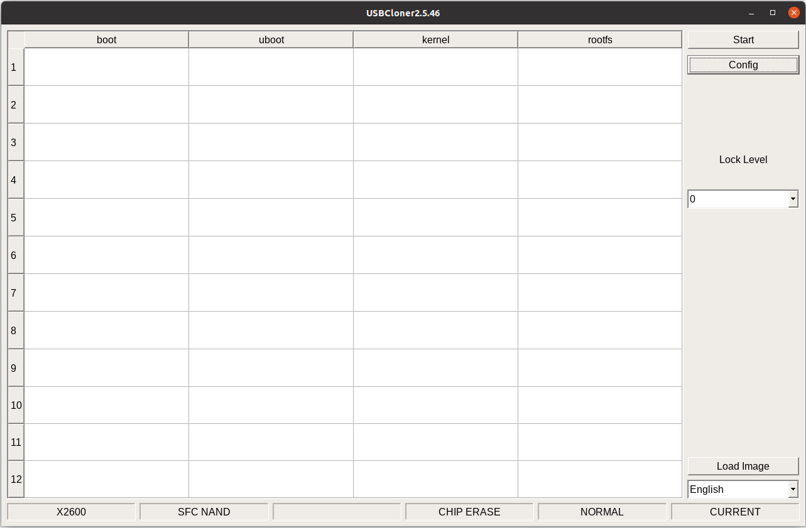

Figure 4-1

3. For basic information configuration, click on INFO to enter the basic configuration settings. Taking the X2660 halley v1.0 development board as an example, select X2600 for the Platform and choose X2660_sfc_nand_ddr3_linux.cfg for the Board. For details, refer to Figure 4-2.

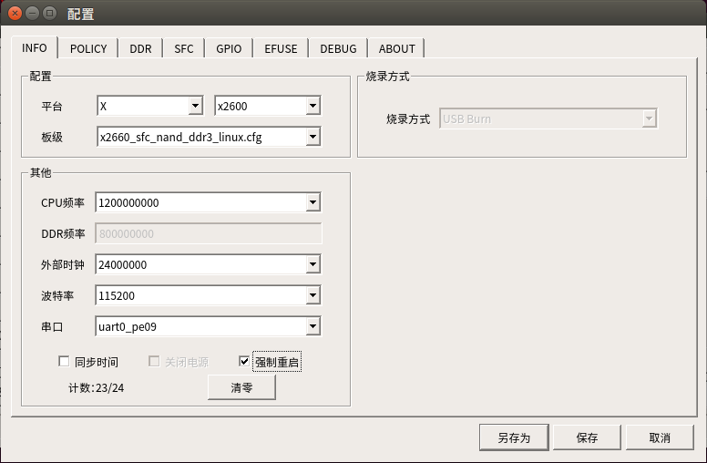

Figure 4-2

4. Configure Image File Paths, Access the POLICY section for relevant configurations. Sequentially set the paths for the uboot, kernel, and rootfs image files (named as uboot, kernel, system.ubifs respectively) by clicking on their respective setting buttons to choose the files. Configuration guidance can be found in Figure 4-3.

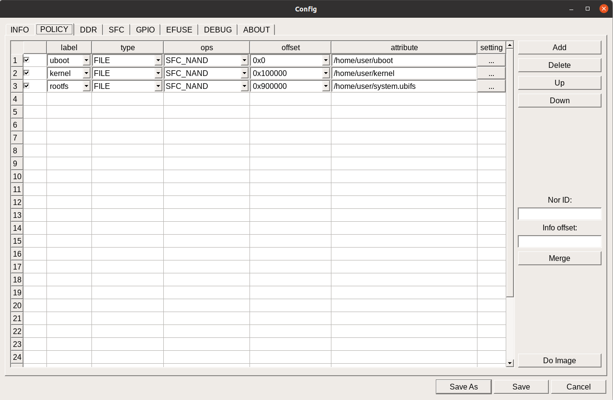

Figure 4-3

5. After setting, click Save to save the configuration and prepare for burning.
6. Click the Start button on the main interface of the burning tool.
7. The development board enters the burning state. Press the BOOT_SEL1 button on the development board first, then press the RST_N button. After the blue indicator light is lit, release the RST_N and BOOT_SEL1 buttons separately.
8. Wait for the burning tool to complete all burning tasks to 100%, as shown in Figure 4-4.

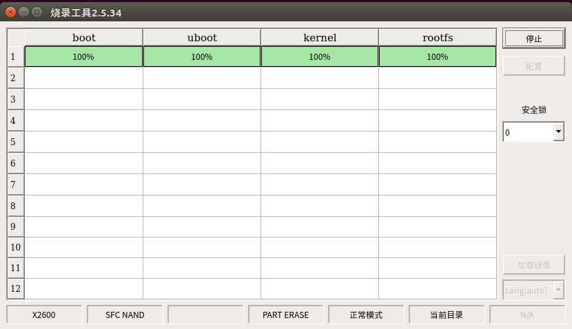

Figure 4-4

## Burning SFC Nor

The primary distinction between burning SFC Nor and SFC Nand lies in the differences in their configuration settings. Below are the detailed steps for configuring SFC Nor:

1. Basic Information Configuration, Click on 'INFO' to enter the basic configuration information interface. Set 'Platform' to 'X2600' and select 'X2660_sfc_nor_ddr3_linux.cfg' for 'Board.' For specifics, refer to Figure 4-5.

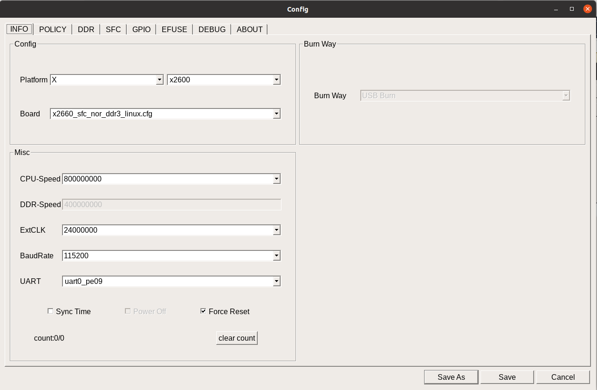

Figure 4-5

2. Set the path for the image files as shown in Figure 4-5. To configure, click on POLICY and proceed with the settings. Sequentially set the paths for uboot, kernel, and rootfs image files. To select a file, simply click on the corresponding setting. For reference on configuration, see Figure 4-6.

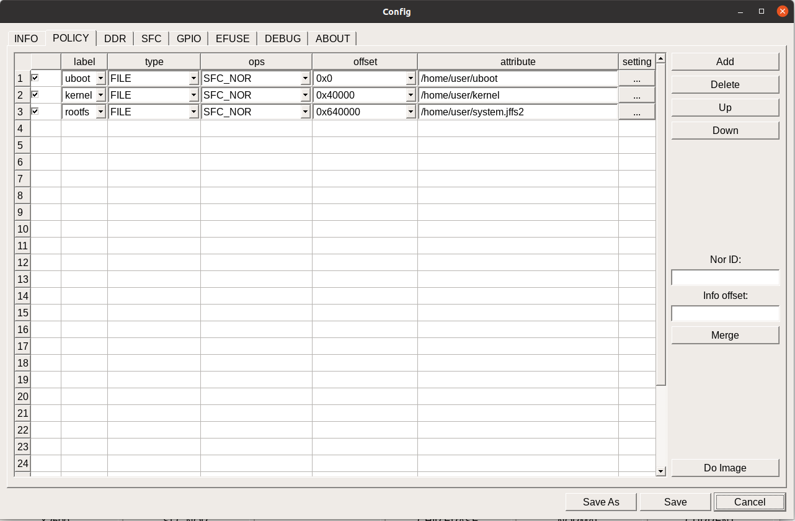

Figure 4-6

3. SFC configuration, because the burning tool supports many kinds of flash, you need to solve the problem of ID conflict according to the model of the on-board nor flash before burning. Click norinfo, according to the name to find the ID of the corresponding on-board nor flash and browse whether there is any red conflict, if there is a conflict, choose to delete the other. Refer to Figure 4-7 for the configuration interface.


Figure 4-7

4. Click Save to save the configuration after the setting is completed, and prepare for burning.

5. click the Start button on the main interface of the burning tool.

6. the development board into the burning state, first press the development board's BOOT_SEL1 button, and then press the RST_N button, to be the blue indicator light, and then release the RST_N and BOOT_SEL1 button respectively.

7. wait for the burn tool each burn to 100%, as shown in Figure 4-4.

## Burning SD Card

This section mainly describes how to burn the image file to the SD card through the USB burning tool, and how to start from the SD card.

Since the X26xx-Halley platform does not support SD cards, we take the X2660 EVB platform as an example.

The main difference between burning an SD card and burning Nand lies in the configuration differences. The specific configurations are:

1. Configuration of basic information: Click INFO to enter the basic configuration information. For the Platform, select X2600, and for the Board, choose X2600_mmc0_ddr3_linux.cfg. For details, refer to Figure 4-8.

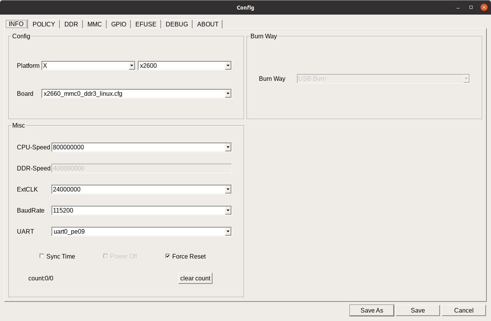

Figure 4-8

2. Configure the image file path, click POLICY to make the corresponding configuration. Set the paths for uboot, kernel, and rootfs image files in order (the file names are uboot, kernel, system.ext2), and click their corresponding settings to select the files. The configuration can be referenced in Figure 4-9. It is important to note that different storage media use different file system formats, and all need to re-lunch and recompile before compilation.

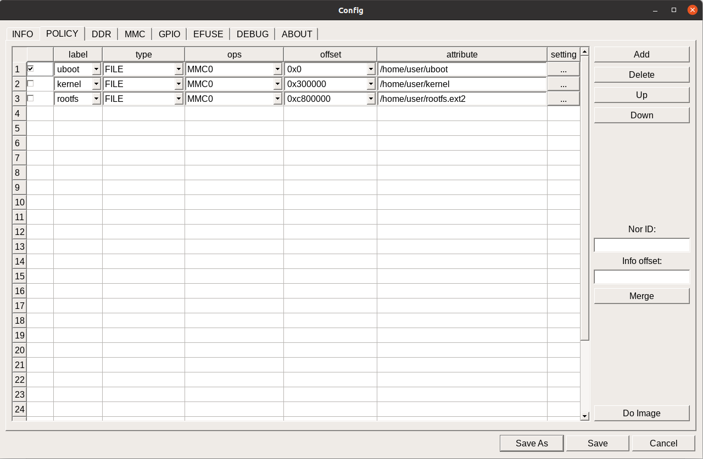

Figure 4-9

3. MMC option configuration, as shown in Figure 4-10.


Figure 4-10

4. After completing the settings, click Save to save the configuration and prepare for burning.

5. Click the Start button on the main interface of the burning tool.

6. The development board enters the burn state; press the BOOT_SEL1 button on the development board, then press the RST_N button. After the blue indicator light is on, release the RST_N and BOOT_SEL1 buttons respectively.

7. Wait for the burning tool to burn each item to 100%, as shown in Figure 4-4.

8. After burning is complete, start from the SD card: first press the BOOT_SEL0 button on the development board, then press the RST_N button. After the blue indicator light is on, release the RST_N and BOOT_SEL0 buttons respectively.

## Burning eMMC

Taking the X2600e halley development board as an example

The specific method of burning emmc is as follows:

1. Configuration of basic information: click INFO to enter the basic configuration information, select X2600 for Platform, and choose X2600e_mmc0_ddr3l_linux.cfg for Board. For details, refer to Figure 4-11.

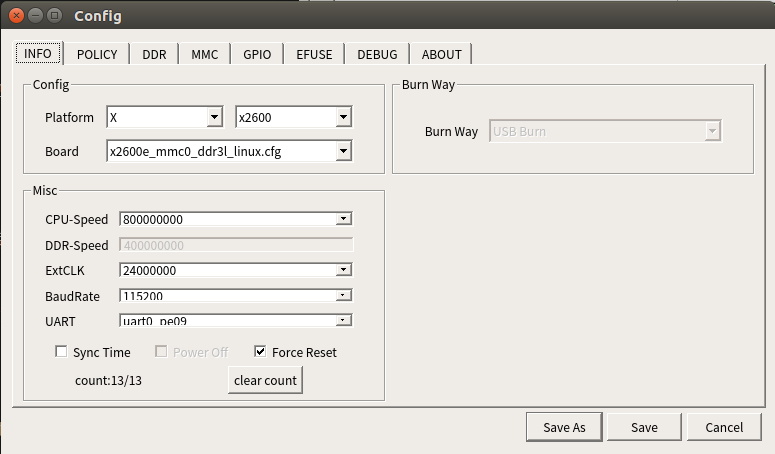

Figure 4-11

2. Configure the image file path, click on POLICY to make the corresponding configuration. Set the paths for uboot, kernel, and rootfs image files in order (the filenames are uboot, kernel, system.ubifs), and click on their corresponding settings to select the files. The configuration can be referenced in Figure 4-12. It is important to note that different storage media use different file system formats, and all need to be re-lunch configured before compilation.

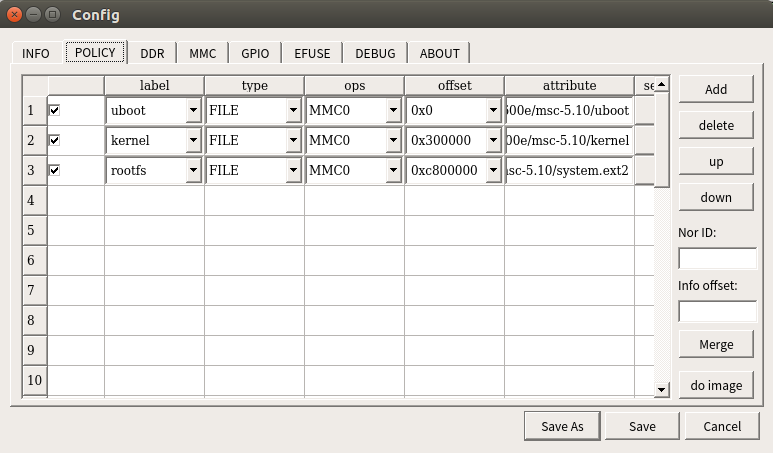

Figure 4-12

3. MMC option configuration, as shown in Figure 4-13.

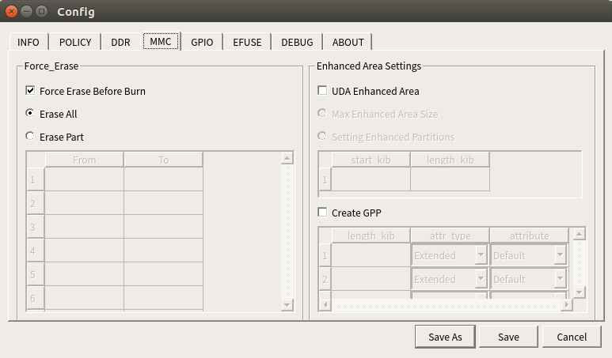

Figure 4-13

4. After completing the settings, click Save to save the configuration and prepare for burning.

5. Click the Start button on the main interface of the burning tool.

6. The development board enters the burning state; press the USB_BOOT button on the development board first, followed by the RST button. Wait until the blue indicator light is on, then release the RST and USB_BOOT buttons respectively.

7. Wait for the burning tool to complete each burning process up to 100%, as shown in Figure 4-4.

8. After burning is complete, boot from EMMC: Press the EMMC_BOOT button on the development board first, then press the RST button. Wait until the blue indicator light is on, then release the RST and EMMC_BOOT buttons respectively.

## Erase Options of the Burning Tool

The erase options of this burning tool include full erase and partial erase. Full erase must be selected when burning for the first time. If you only want to burn a specific file subsequently, you can remove this option. The related configuration interface is shown in Figure 4-14.

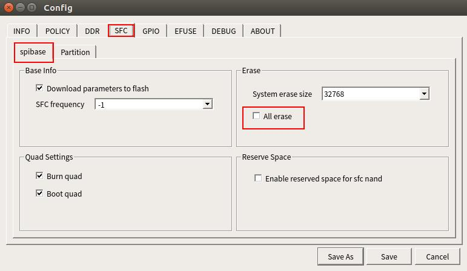

Figure 4-14

## Other Configurations

### Configuring Serial Ports

Serial ports are one of the most important tools in the development process. Before using serial port debugging, you need to configure the serial port environment:

1. Install serial port tools on Ubuntu by executing the command:

```c
$ sudo apt-get install minicom 
```

2. Serial Port Internet Tool Setup

To configure Minicom, enter the command in the PC terminal:

```c
$ sudo minicom -s 
```

3. After executing the command, the following interface will appear:

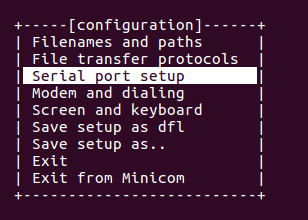

4. Select "Serial port setup" and press Enter to enter the serial port configuration. Use the input letter to select the option you need to modify, as shown in the following figure:

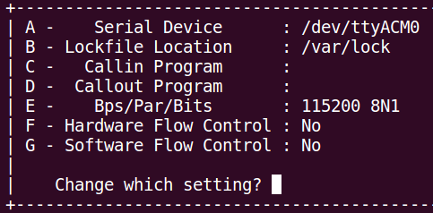


Instructions for Configuration Options: 1、**Serial Device**: This should be selected according to the actual device name, typically ttyUSBx or ttyACMx. 2、**Option E**: Specifically, this configures the baud rate to 115200, with 8 data bits, no parity bit, and 1 stop bit. 3、**Options F and G**: Hardware and software flow control options must be set to No.

After configuration, press Enter to return to the previous screen, choose "Save setup as dfl" to save the configuration, and then select "Exit from minicom" to exit the program.

5. Usage of Serial Port Tools:

Enter the command under Terminal:

```c
$ sudo minicom 
```

### Secure Burning

Refer to the **USBCloner Burning Tool Instruction Manual.pdf**

### SN Burning

Refer to the **USBCloner Burning Tool Instruction Manual.pdf**

# X26xx Halley Platform Board-Level Differences

## Board-Level Differences
| X26xx Halley Board-Level Differences |
|  |  |  |  |  |
| --- | --- | --- | --- | --- |
| Board Model | WiFi | Efuse | DMIC | Speaker |
| X2660 HALLEY V1.0 | 1. Internal rtc clock 2. Power pin PE01 | Powered by GPIO PE06 | 1. Supports channels 1 and 2 2. DMIC recording pin shares with Bluetooth UART1 pin, not usable simultaneously | Amplifier enable pin PE05 |
| X2660 HALLEY V1.1 | 1. External rtc clock 2. Power pin PE00 | Powered by GPIO PE01 | 1. Supports channels 1 and 2 2. DMIC recording pin shares with Bluetooth UART1 pin, not usable simultaneously | Amplifier enable pin PC14 |
| X2670 HALLEY V1.0 | 1. External rtc clock 2. Power pin PE01 3. Added WiFi_VDDIO enable pin PC06 | Directly powered | 1. Supports channels 1, 2, and 4 2. DMIC recording pin shares with Bluetooth UART1 pin and WiFi_VDDIO enable pin, not usable simultaneously | Amplifier enable pin PC14 |
| X2670M HARE V1.0 | 1. External rtc clock 2. Power pin PE01 3. Added WiFi_VDDIO enable pin PC06 | Directly powered | 1. Supports channels 1, 2, and 4 2. DMIC recording pin shares with Bluetooth UART1 pin and WiFi_VDDIO enable pin, not usable simultaneously | Amplifier enable pin PC14 |
| X2600 HALLEY V1.0 | 1. External rtc clock 2. Power pin PE00 3. Added WiFi_VDDIO enable pin PC06 | Directly powered | 1. Supports channels 1, 2, and 4 2. DMIC recording pin shares with WiFi_VDDIO enable pin, not usable simultaneously | Amplifier enable pin PC14 |

# FAQ

## How to Import the Executable Program Module

A:There are ways to import the program, such as adb, tftp, etc. For details, please refer to <<04_Application Development Manual>>.

## Building the Kernel Failed

```c
/home/xxx/X26xx/kernel/kernel-4.4.94 is not clean, please run 'make mrproper'

in the '/home/xxxX26xx/kernel/kernel-4.4.94' directory.

/home/xxx/X26xx/kernel/kernel-4.4.94/Makefile:1003: recipe for target 'prepare3' failed

make[2]: \*\*\* [prepare3] Error 1

make[2]: Leaving directory '/home/xxx/X26xx/out/product/X26xxhalley.v10_nand_4.4.94-eng/obj/kernel-intermediate'

Makefile:150: recipe for target 'sub-make' failed

make[1]: \*\*\* [sub-make] Error 2
```

The above phenomenon usually occurs when a configuration is made in the kernel directory by executing `make menuconfig`, and then compiling commands are executed in the project directory. The solution at this time:

1. Go to the kernel directory and execute the command.

```c
$　make distclean
```

2. Navigate back to the top-level directory of the project, execute `lunch` to select the board configuration, and then run the command to compile the kernel.

```c
$　make kernel -j8
```

Note: All compilation configurations of this SDK can be performed at the top-level directory of the project. For specific details, please refer to relevant sections in this document. It is not recommended to perform configurations in individual directories.

## USB Burning Failure

Try burning again with a different typeC cable or USB port. If it still fails, send an email to support@ingenic.com.

## Program Execution or Linking Failure During Compilation

Ensure that the compiler uses gcc version 7.2.0 (Ingenic Linux-Release5.1.4.1-Default(xburst2(fp64)+glibc2.29+Go language) 2022.08-08 10:51:21). You can check by running mips-linux-gnu-gcc -v.

```c
Using built-in specs.

COLLECT_GCC=mips-linux-gnu-gcc

COLLECT_LTO_WRAPPER=/home/jzguo/X26xx/prebuilts/toolchains/mips-gcc720-glibc229/bin/../libexec/gcc/mips-linux-gnu/7.2.0/lto-wrapper

Target: mips-linux-gnu

Configured with: /home/users/ylli/ingenic_toolchain/project/src/gcc-7-2017.11/configure --build=i686-pc-linux-gnu --host=i686-pc-linux-gnu --target=mips-linux-gnu --enable-threads --disable-libmudflap --disable-libssp --disable-libstdcxx-pch --with-arch-32=mips32r2 --with-arch-64=mips64r2 --with-float=hard --with-mips-plt --enable-extra-sgxxlite-multilibs --with-gnu-as --with-gnu-ld

..................................... --with-build-time-tools=/home/toolchains/release/install/opt/codesourcery/mips-linux-gnu/bin --with-build-time-tools=/home/users/ylli/ingenic_toolchain/project/install/opt/codesourcery/mips-linux-gnu/bin --with-private=default_option_mglibc_mfp64 SED=sed

Thread model: posix

gcc version 7.2.0 (Ingenic Linux-Release5.1.4.1-Default(xburst2(fp64)+glibc2.29+Go language) 2022.08-08 10:51:21)
```

If the above phenomena do not occur, try setting up the compilation environment variables and selecting the board level with lunch. Refer to the content of the SDK compilation section in this document.
