# Abstract

X26xx Halley software platform is a Linux system release and development platform developed by Ingenic. The platform guides compilation through Build.mk file. It supports the following functions.

* Support for compiling c files, cpp files
* Support compilation of dynamic libraries, static libraries
* Support the compilation of executable bin file
* Support for adding third-party applications and libraries
* Support for separate compilation of modules

## Introduction to directory structure

The directory structure of the platform is as shown in the figure below.

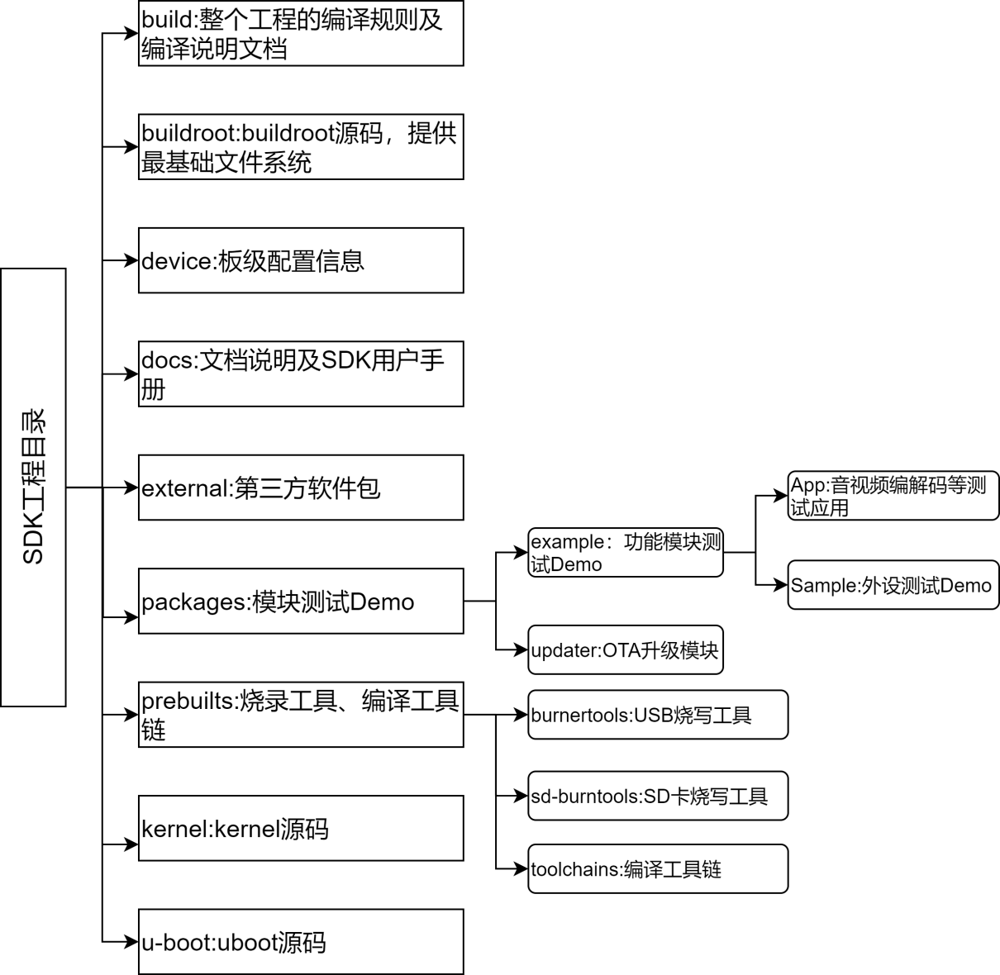

Figure 1-1 X26xx Halley platform directory structure

## Special attention

**All content in this document is based on X26xx Halley platform's X2660-Halley development board, and developers can refer to their actual downloaded code.**

# Introduction to compilation configuration and commands of Ingenic Platform

The compilation configuration of the platform is mainly explained by taking buildroot as an example.

## Default configuration of Ingenic Platform

## Default configuration in Buildroot

The X26xx Halley software platform provides several default configurations for use with different storage media. The default configurations are stored in buildroot/configs/. Here is a list of the default configurations corresponding to board level X2660 Halley, X2670 Halley, X2670m Hare, X2600 Halley and X2600E Halley using different storage media.

```c
x2660_halley_linux_defconfig
x2660_halley_nor_defconfig
x2670_halley_linux_defconfig
x2670_halley_nor_defconfig
x2670m_hare_linux_defconfig
x2670m_hare_nor_defconfig
x2600_halley_linux_defconfig
x2600_halley_nor_defconfig
x2600e_halley_linux_defconfig
x2600e_halley_nor_defconfig
```

### Custom configuration in Buildroot

The default configuration in Buildroot provides some commonly used tools and settings, but it cannot meet all users' needs. Users can customize their configurations according to their own requirements.

For example, if you want to add a ffmpeg tool in buildroot, take X2660 Halley v1.0 as an example and follow these steps.

1. Enter X2660 Halley engineering directory.
2. Execute make buildroot-menuconfig. 
3. Press “/” to enter search mode, input ffmpeg in the search box. The results are as shown below:

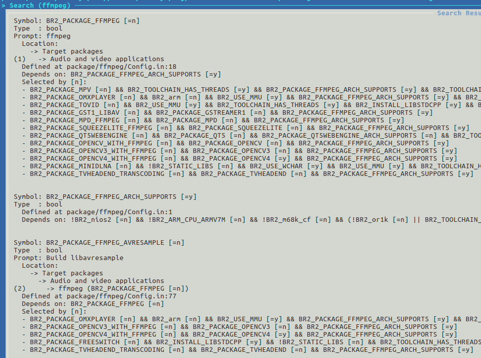

4. According to the Location prompt in the search results, go to Target packages/Audio and video applications/Configuration items (or press 1), then check and enter ffmpeg. Select the desired functions according to your needs.
5. Save and exit.

## Vendor configuration in Buildroot

The vendor configuration of Ingenic in Buildroot refers to some configurations under Ingenic package in Buildroot configuration, as shown below:


Figure 2-1 Ingenic Manufacturer Configuration

### system config for rootfs configuration

In X26xx Halley platform, some system configurations can be made to system config for rootfs. The main configuration items are as follows:

Table 2-1 Configurable items of rootfs from Kingsoft

|  |  |
| --- | --- |
| **Configurables** | **instructions** |
| enable adb service | Open adb service |
| set DNS server | Open DNS service |
| cache dns |  |
| mount user data: mount_ubifs.sh userdata /usr/data/ | Power on and mount user data partition |
| mount user data: mount mmcblk0p7 to /usr/data/ | Turn on and mount mmc user data partition |
| mount storage: mount mmcblk0p9 to /storage/ | Power on and mount mmc storage partition |
| enable sd burn | Open SD card burning function |
| enable rootlogin when using open ssh | Log in to the system as an administrator. |
| Enable USB Composite Gadgets | |

As shown in the figure below.


Figure 2-2 Rootfs optional configuration content in Juzheng vendor configuration

The specific configuration method is as follows:

1. Enter X26xx-Halley engineering directory.
2. Execute make buildroot-menuconfig to configure Ingenic packages/system configuration for rootfs/choose what needs to be configured.
3. Save and exit.

### Wifi configuration

In the X26xx Halley platform, you can configure WIFI. The following are some of the contents that can be configured for WIFI.

Table 2-2 Configurable items of WIFIs produced by Ingenic.

|  |  |
| --- | --- |
| **Configurables** | **Explanation** |
| common wifi device | Select a common WIFI. |
| select wifi chip | Select model of WIFI chip. |
| wpa_supplicant.conf file path | Set wpa_supplicant.conf file path |
| hostapd.conf file path | Set hostapd.conf file path |
| hostap interface | Set hostap interface name |
| wifi auto startup | Whether to automatically start WIFI |
| Wifi uses AP mode | Configure whether to use hotspot mode for WIFI |
| wifi mac address | Set MAC address of WIFI |
| wifi mac address path | Configure MAC address file path |

As shown in the figure below:


Figure 2-3 WiFi optional configuration items in Ingenic manufacturer settings  

The method of configuring WiFi is as follows:

1. Enter X26xx Halley engineering directory.
2. Execute make buildroot-menuconfig.
3. Configure Ingenic packages/wifi/.
4. Select items you want to configure.
5. Save and exit.

### Bluetooth configuration

In the X26xx Halley platform, you can configure whether Bluetooth supports BSA Server and select which Bluetooth chip to use. The specific configuration method is as follows.

1. Enter X26xx Halley engineering directory.
2. Execute make buildroot-menuconfig.
3. Configure Ingenic packages/bluetooth. The path of configuration options is shown in the figure below.


Figure 2-5 The configuration path of Bluetooth in Ingenic Manufacturer Configuration

## Compile command

### Compilation rules

Before compiling, first complete initialization of the compilation tool chain and configuration. Execute the following instructions to initialize the compilation tool chain.

```c
 source build/envsetup.sh
```

Then execute these instructions to load the compiled configuration.

```c
lunch
```

After execution, some available configurations will be listed. The X2660 Halley configuration is as shown in the figure below:

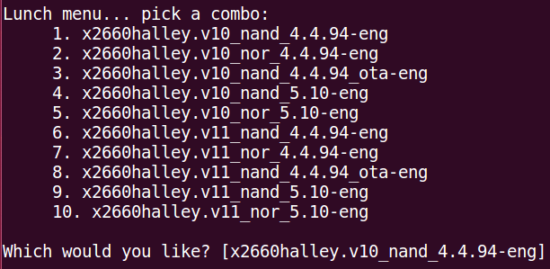

X2670 Halley is configured as shown in the figure below:

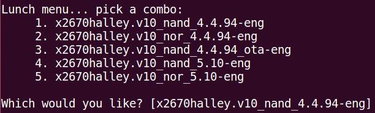

X2670M Hare is configured as shown in the figure below:

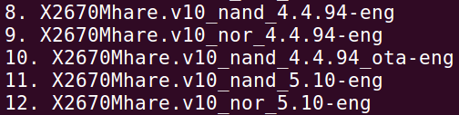

X2600 Halley is configured as shown in the figure below:

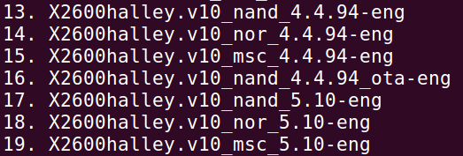

X2600E Halley is configured as shown in the figure below:

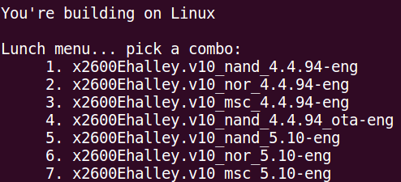

Please refer to <<X26xx-Halley Software Platform Quick Development Guide>> for configuration selection.

The following are some commonly used commands compiled by the platform. Enter the root directory of X26xx Halley software platform, and execute these instructions to compile corresponding contents.

Table 2-4 Compilation commands for the X26xx Halley platform.

|  |  |
| --- | --- |
| **Compile command** | **Explanation** |
| make |Overall compilation project |
| make buildroot | Compile buildroot separately |
| make buildroot-menuconfig | Configure buildroot |
| make buildroot-clean | Clear some files generated by buildroot compilation |
| make buildroot-distclean | Clean up all files generated by buildroot compilation, including downloaded libraries |
| make buildroot- | Compile software packages in buildroot |
| make kernel | Compile kernel separately |
| make kernel-menuconfig | Configure kernel |
| make kernel-clean | Clear some files generated by kernel compilation |
| make kernel-distclean | Completely remove files generated by kernel compilation |
| make uboot | Compile uboot separately |
| make uboot-menuconfig | Configure uboot |
| make uboot-clean | Clear some files generated by uboot compilation |
| make uboot-distclean | Completely remove files generated by uboot compilation |
| make (module name) | Compile modules separately |

### Compiled generated files

After compilation is completed, an out directory will be generated with a structure as follows:

```c
product
└── X26xxhalley // Board Support Package
    ├── image // Generated target files (uboot, kernel, file system)
    ├── obj // Intermediate and target files generated during module compilation (before stripping)
    ├── sysroot // File system (before stripping)
    └── system // File system (includes stripped modules)  
```

After compiling buildroot separately, the rootfs will be stored in obj/buildroot-intermediate/images/. After executing "make" to compile it as a whole, the generated rootfs is moved to image directory.

### Method of compiling modules separately

The compilation rules of a single module are as follows. Execute in the top-level directory of the project:

```c
make $(LOCAL_MODULE)  
```

That is, make "module name" can compile a single module separately. Take v4l2-h264dec test module under packages/example/App/v4l2-h264dec as an example. The LOCAL_MODULE (in Build.mk) of this module is assigned to v4l2-h264dec. You can execute the command below to compile the v4l2-h264dec module separately:

```c
make v4l2-h264dec
```

### Method of compiling buildroot package separately

In the buildroot/packages directory of X26xx Halley platform, there are some available packages. When you need to use these packages, they can be compiled as follows.

```c
make buildroot-<packname>
```

If you want to compile ffmpeg in buildroot/packages/, execute these instructions.

```c
make buildroot-ffmpeg
```

### Method of compiling after module content changes

After the module is compiled, if you modify the content of the module again, using a separate compilation method for modules may cause changes not to be updated in the final generated file system. The most effective way is to delete intermediate files produced by compiling the module and then recompile the module.

Below, we take v4l2-h264dec module as an example to introduce how to compile modules after content changes.

1. After the module content has been changed, you need to delete the intermediate files in the out directory before compiling. v4l2-h264dec generates an intermediate file in the path: out/product/X26xxHalley/obj/DEPANNER/v4l2-h264dec-intermediate, delete the directory prefixed with v4l2-h264dec, delete the directory prefixed with v4l2-h264dec, delete the directory prefixed with v4l2-h264dec. h264dec as a prefix, and delete the directories prefixed with v4l2-h264dec.
2. Execute the instructions to compile the module separately. That is: make v4l2-h264dec.
3. Execute the make command to update the generated content to the system image under out/product/X26xxHalley/image/.

Note: The path of intermediate files generated by software packages under "packages" is generally in out/product/X26xxHalley/obj/DEPANNER/ or out/product/X26xxHalley/obj/packages/example/App/. The path of software package generation under buildroot/ is generally in out/product/X26xxHalley/obj/buildroot-intermediate/build/.

# Introduction to Ingenic Platform Application

Ingenic Platform Application refers to some applications developed by Ingenic. As shown in the table below.

Table 3-1 Application of Ingenic Platform

|  |  |
| --- | --- |
| **Platform applications** | **Explanation** |
| v4l2-h264dec | H264 decoding |

## v4l2-h264dec

### Function introduction

v4l2-h264dec is used to decode VPU h264. It can be used to convert h264 format files to nv12, nv21 format files.

Source code path: packages/example/App/v4l2-h264enc/src

The software flow chart is as follows:

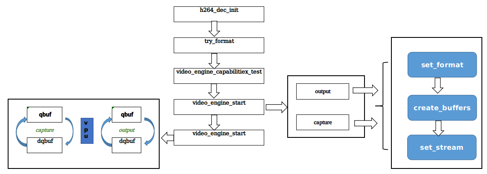

Figure 3-4 Application flow chart of V4l2-h264dec software on Ingenic platform.

### Usage

### Module compilation

Enter the root directory of X2660-Halley platform and execute these instructions to compile modules.

```c
make v4l2-h264dec

make
```

After module compilation is completed, an executable file v4l2-h264dec will be generated and stored in the out/product/x2660Halley/system/usr/bin directory.

#### Module usage

Execute these instructions on X2660 Halley development board to run modules for h246 decoding nv12 format data.

```c
v4l2_h264dec -t nv12 -v /dev/video2 -f filename.h264 -w 1280 -h 720
```

Parameters:

 -t specifies output file format

 -v specifies Felix's device node

 -f specifies h264 file

 -w specifies the width of h264 file

 -h specifies height of h264 file

Test results:

Check whether the LCD screen displays normally

# Add and remove applications to a target file system

## x26xxhalley_base.mk Introduction

x26xxhalley_base.mk is used to configure modules for project compilation. It is located under device/x26xxhalley (Board Support Package) directory. The macro PRODUCT_MODULES in this file can be used to add or remove common modules for project compilation. There are also default configurations for different file systems and storage media in this file, which can be customized according to your needs.

## Introduction to rootfs-overlay folder

The rootfs-overlay folder is in device/x26xxhalley (board level) / directory. The files under this folder will be replaced with those of the same name in the file system when compiling and generating a file system, so that you can customize your own file system.

# Import and run an application on a development board

## Use adb tools to import applications

### Configure adb tools

In X26xx Halley platform, you can directly configure and install adb tools. The method is as follows:

1. Enter X26xx Halley project directory.
2. Execute make buildroot-menuconfig.
3. Configure Ingenic packages/system config for rootfs/enable adb service as shown in the figure below:


Figure 5-1 Path to configure adb tool in Buildroot

Install adb tool on PC (take Ubuntu 16.04 as an example):

The installation command is as follows:

```c
sudo apt-get install adb  
```

After installation, execute adb version to check the version of adb. If it displays normal information about the version, then the installation is successful.

### Usage of ADB tool

1. Transfer files to development board.

adb push local path (the path of a file to be transmitted from PC to development board) target path (the path where the file is stored on the development board).

2. Download files from development board to PC.

adb pull target path (the file's path on the development board) local path (where to save the file on the PC end).

3. Common adb commands:

Table 5-1 Common adb commands

|  |  |
| --- | --- |
| **Common adb commands** | Explanation |
| adb help | View adb command help |
| adb devices | View device |
| adb shell | Enter terminal |
| adb kill-server | Stop service |
| adb start-server | Open Service |
| adb push local path target path | Upload files to device. |
| adb pull target path local path | Download files from device to PC. |

## Use sshd to import applications

### Configure sshd tool

1. Enter X26xx Halley project directory.
2. Execute make buildroot-menuconfig.
3. Configure Target packages/Networking applications/openssh as shown in the figure below:


Figure 5-2 Path of configuring sshd tool in Buildroot

### Usage of sshd tool

Before using sshd tool, please make sure that the development board and host can ping each other.

sshd (Secure Shell) service uses SSH protocol to remotely open other host shells. When used, it opens a shell service on the development board through PC. The command for logging in to the development board is as follows.

```c
ssh-X remote host user@remote host ip
```

If the username logged in on the development board is root, and the IP address is 192.168.4.49, then the login method is as follows:

```c
ssh -X root@192.168.4.49
```

The default login password is 123456, which can be set in buildroot. The method is as follows.

1. Enter X26xx Halley project directory.
2. Execute make buildroot-menuconfig.
3. Configure System configuration/Enable root login with password/Root password.

As shown in the figure below, this is a successful login instruction operation.


Figure 5-3 Screenshot of successful login to development board using ssh tool.

## Use telnetd to import applications

The telnetd service has been added to the configuration file and no further configuration is required.

### Telnetd usage

1. Enter X26xx Halley project directory.
2. Execute make kernel-menuconfig.

Select configuration in kernel, as shown below:

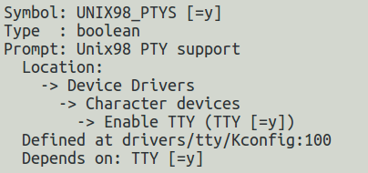

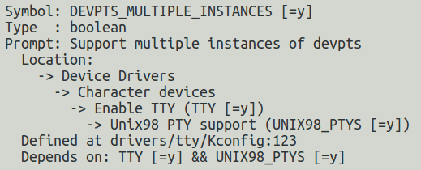

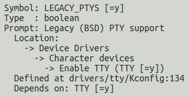

1. Execute make buildroot-menuconfig

Modify busybox configuration in Buildroot:

Path: buildroot/package/busybox/ingenic/busybox-1.31.1-config

CONFIG_FEATURE_DEVPTS=y

Before using telnet tool, please make sure that the development board and host can ping each other.

Modify /etc/password file, remove the bit of root user control password login. That is to say, the root user can log in normally without a password.

root::0:0:root:/root:/bin/sh

The telnet command is usually used for remote login. The method of use is as follows:

telnet [parameters] [host]

The optional parameters are as follows:

 -8 Allows use of 8-character data, including input and output.

 -a Try to automatically log in to a remote system.

 -b <host alias> Use an alias to specify a remote host name.

 -d Start debugging mode.

 -E Removes escape characters.

 -f This parameter has the same effect as specifying "-F".

 -F When using Kerberos V5 authentication, add this parameter to upload local host's authentication data to remote host.

 -k <domain> When Kerberos authentication is used, add this parameter to make the remote host use a specified domain name instead of its own.

 -K Does not automatically log in to remote host.

 -l <username> specifies a user name to log in on remote host.

 -L allows output of 8-bit character data.

 -n <log file> specifies information about a log file.

 -r Use a user interface similar to rlogin.

 -x If your host supports data encryption, use it.

When logging in to a host with username root and IP address 10.1.223.81, execute as follows:

```c
telnet 10.1.223.81
```

Then enter your username and password as prompted.

As shown in the figure below, this is a successful login instruction operation.

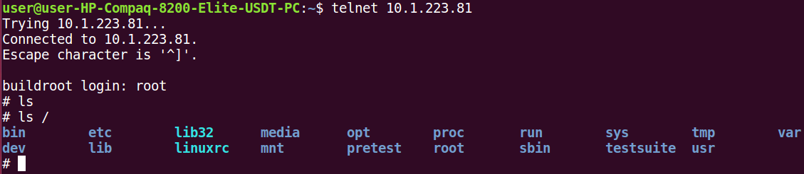

## Use tftp to import applications

### Configure tftp tool

1. Enter X26xx Halley project directory.
2. Execute make buildroot-menuconfig.
3. Configure Target package/Networking applications/dnsmasq/tftp support as shown in the figure below:

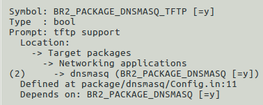

Figure 5-5 Path to configure tftp tool in Buildroot

### tftp tool usage

Before using tftp tool, please make sure that the development board and host can ping each other.

1. Download file

The development board acts as a client and uses the command below to download files to the development board:

```c
tftp -g -l <target file name> -r <source file name> <server address>
```

If you want to download a file named A.txt from server side and rename it as B.txt on development board, use this command:

```c 
 tftp -g -l B.txt -r A.txt 192.168.4.50
```

2. Upload file

When uploading a file from the development board (client) to Server, use the command below:

```c
tftp -p -r <target file name> -l <source file name> <server address>
```

If you want to upload file C.txt from development board to Server's tftp root target and rename it as D.txt, use this command:

```c
tftp -p -r D.txt -l C.txt 192.168.4.50
```

3. Parameter description

 -l is an abbreviation of "local", followed by a source file name that exists in Client, or a renamed file after downloading Client;

 -r is an abbreviation for "remote", followed by Server, which refers to the source file name in the root directory of a PC tftp server or the renamed file after uploading to Server.

 -g is an abbreviation of "get", used when downloading a file.

 -p is an abbreviation of "put", used when uploading a file.

## Use lrzsz to import applications

### Configure lrzsz tool

1. Enter X26xx Halley engineering directory.
2. Execute make buildroot-menuconfig.
3. Configure Target package/Networking applications/lrzsz as shown in the figure below:

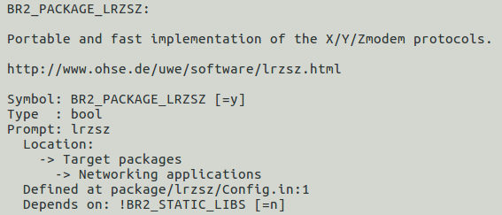

Figure 5-6 Path of configuring lrzsz tool in Buildroot

### Use lrzsz tool (minicom)

1. sz command (send file)

eg: sz filename (the file to be transmitted will open in minicom by default)

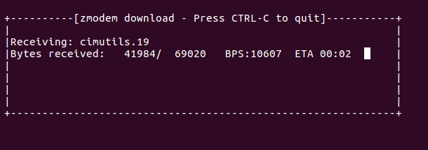

Figure 5-7 Sending file screenshots using lrzsz tool.  

2. rz command (receive file)

* First input rz:

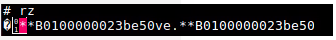

Figure 5-8 rz command of lrzsz tool

* Press Ctrl+A+Z, and then press S (Send File)


Figure 5-9 Minicom configuration screenshot when using lrzsz tool.

* Select zmodem and enter file selection interface.

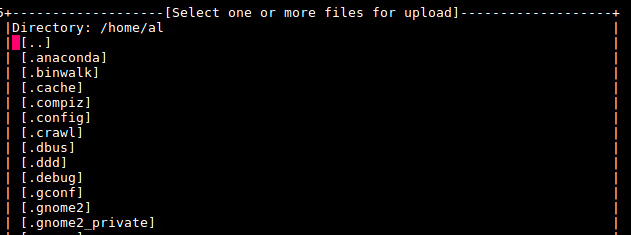

Figure 5-10 Screenshot of file selection page when using lrzsz tool.

* Use up and down keys or PageUp/

Figure 5-11 Select file screenshot when using lrzsz tool.

Note: For more detailed operation parameters, use (--help) to view.

# Introduction to platform compilation rules (general)

The platform needs to include different core macros when compiling modules. For example, if you want to use the printf function, you need to include the stdio.h header file. The core macros needed for adding different modules are different. This article introduces several methods of compiling different types of modules.

## Create a platform app

### Compile core macros

Table 6-1 Platform Application Core Compile Macros

|  |  |
| --- | --- |
| **Compile core macros** | **Explanation** |
| BUILD_EXECUTABLE | Compile and generate an executable bin file |
| BUILD_SHARED_LIBRARY | Compile and generate a dynamic library |
| BUILD_STATIC_LIBRARY | Compile and generate a static library |

### Commonly used compilation interface macros

The interface macro is used to configure compiled parameters. The commonly-used interface macros are shown in the table below.

Table 6-2 Platform Application Interface Macro.

|  |  |
| --- | --- |
| **Interface macro** | **Explanation** |
| LOCAL_MODULE | Module name |
| LOCAL_MODULE_TAGS | Module development mode |
| LOCAL_SRC_FILES | Source file |
| LOCAL_LDLIBS | Link parameters |
| LOCAL_CFLAGS | C compilation parameters |
| LOCAL_CPPFLAGS | CPP compilation parameters |
| LOCAL_C_INCLUDES | Compile required header files |
| LOCAL_MODULE_PATH | Specify the copy path of the target file, and do not define this macro to copy it to the default path |
| LOCAL_SHARED_LIBRARIES | Other dynamic libraries required for compilation of this module, which are generated by other modules in the project. |
| LOCAL_STATIC_LIBRARIES | Other static libraries required for compilation of this module, which is generated by other modules in the project. |
| LOCAL_DEPANNER_MODULES | This module's compilation depends on other modules (generated libraries, header files and so on). Here is the name of the dependent module. |

### Compilation example

1. Executable bin file.
2. This example is the project packages/example/App/cimutils/Build.mk.

```c
LOCAL_PATH := $(my-dir)
# build cimutils
include $(CLEAR_VARS)
LOCAL_MODULE=cimutils
LOCAL_MODULE_TAGS:= optional
LOCAL_SRC_FILES:= main.c \
 convert_soft.c \
 process_picture/saveraw.c \
 process_picture/savebmp.c \
 process_picture/savejpeg.c \
 lcd/framebuffer.c \
 v4l2/v4l2.c \
 v4l2enc/v4l2_jpegenc.c \
 cim/cim_fmt.c \
 cim/video.c \
 cim/process.c \
 cim/convert.c

LOCAL_LDLIBS := -lc -lstdc++ -ljpeg
LOCAL_C_INCLUDES:= include
LOCAL_DEPANNER_MODULES := CameraDemo.sh
include $(BUILD_EXECUTABLE)
```

1. Generate dynamic libraries
2. This example for the project external/tinyalsa/Build.mk

```
LOCAL_PATH := $(my-dir)
include $(CLEAR_VARS)

LOCAL_MODULE := libtinyalsa
LOCAL_MODULE_TAGS :=optional
LOCAL_SRC_FILES := pcm.c \
 mixer.c 

LOCAL_EXPORT_C_INCLUDE_FILES:=include/tinyalsa/asoundlib.h
LOCAL_CFLAGS := -Wa,-mips32r2 -O2 -G 0 -Wall -fPIC -shared
 
include $(BUILD_SHARED_LIBRARY)
```

1. Note: The paths of static libraries and dynamic libraries are by default stored in system's usr/lib. Executable programs are by default stored in system's usr/bin.
2. For other details, please refer to build/core/envsetup.mk file under the project or above out directory introduction.

## Import third-party applications

 When adding a third-party module, first ensure that the module can be compiled normally and then add it to platform. When placing a third-party function module, it is recommended to place it in external directory and refer to each Build.mk file under external directory when writing the Build.mk file of the added module, so as to guide its compilation.

### Third-party application core macros

Table 6-3 Third-party application core macros

|  |  |
| --- | --- |
| **Compile core macros** | **Explanation** |
| BUILD_THIRDPART | Compile third-party modules |

### Common interface macros for third-party applications

The interface macro is used to configure compiled parameters. The commonly-used interface macros are shown in the table below.

Table 6-4 Third-party application interface macro.

|  |  |
| --- | --- |
| **Interface macro** | **Explanation** |
| LOCAL_MODULE | Module name |
| LOCAL_MODULE_TAGS | Module development mode |
| LOCAL_MODULE_GEN_BINARY_FILES | The executable program generated by a module (must contain path) |
| LOCAL_MODULE_GEN_STATIC_FILES | Static library file generated by module (with path) |
| LOCAL_MODULE_GEN_SHARED_FILES | Dynamic library file generated by module (with path) |
| LOCAL_MODULE_PATH | Specify the copy path of the target file. If this macro is not defined, it will be copied to the default path |
| LOCAL_MODULE_CONFIG_FILES | Files generated after module configuration |
| LOCAL_MODULE_CONFIG | Method of module configuration |
| LOCAL_MODULE_COMPILE | Method of compiling modules |
| LOCAL_MODULE_COMPILE_CLEAN | The clean method of module |
| LOCAL_EXPORT_C_INCLUDE_FILES | The exported file of a module is used by other modules |
| LOCAL_EXPORT_C_INCLUDE_DIRS | The module exports a directory, and files under this directory are used by other modules |
| LOCAL_DEPANNER_MODULES | This module's compilation depends on other modules (generated libraries, header files and so on). Here is the name of the dependent module. |

### Compilation example

1. This example is for project packages/example/App/linphone-desktop/Build.mk.

```
LOCAL_PATH := $(my-dir)
include $(CLEAR_VARS)

LOCAL_MODULE=linphone-desktop
LOCAL_DEPANNER_MODULES:=isp
LOCAL_MODULE_TAGS:=optional
LOCAL_MODULE_GEN_BINRARY_FILES=OUTPUT/no-ui/bin/linphonec
LOCAL_MODULE_GEN_SHARED_FILES=OUTPUT/no-ui/lib/libavcodec.so \
                            OUTPUT/no-ui/lib/libavcodec.so.53 \
                            ... \
                            OUTPUT/no-ui/lib/libxml2.so.2

LOCAL_MODULE_CONFIG_FILES:= Makefile

LOCAL_MODULE_CONFIG:=./prepare.py \
 -L -dv \ 
......

 -DENABLE_INGENIC_VIDEOOUT=ON 

LOCAL_MODULE_COMPILE=make -j$(MAKE_JLEVEL); mkdir -p $(TOP_DIR)/$(LOCAL_PATH)/OUTPUT/no-ui/data/linphone

LOCAL_MODULE_COMPILE_CLEAN=./prepare.py -c

include $(BUILD_THIRDPART)
```

## Add a module for copying files

In the development process, it is often necessary to copy some libraries and header files without any modification from one path to another target path. For this purpose, a prebuild mechanism has been added to the platform compilation system.  

### Compile core macros

Table 6-5 Copy Module Core Macro

|  |  |
| --- | --- |
| **Interface macro** | **Explanation** 
| BUILD_PREBUILT | Copy one file at a time. |
| BUILD_MULTI_COPY | Copy multiple files at a time. |

### Common interface macros

The interface macro is used to configure compiled parameters. The commonly-used interface macros are shown in the table below.

Table 6-6 Copy module interface macro.

|  |  |
| --- | --- |
| **Interface macro** | **Explanation** |
| LOCAL_MODULE | Module name |
| LOCAL_MODULE_TAGS | Module development mode |
| LOCAL_MODULE_CLASS | Which prebuild mode DIR/FILES does this module belong to |
| LOCAL_MODULE_PATH | File (folder) copy target path |
| LOCAL_COPY_FILES | Source file |
| LOCAL_MODULE_DIR | Source folder |

### Compilation example

1. Copy a single file

This example is for engineering packages/example/App/cimutils/Build.mk.

```
# copy the LOCAL_SRC_FILES
include $(CLEAR_VARS)

LOCAL_MODULE := CameraDemo.sh

LOCAL_MODULE_TAGS := optional

LOCAL_MODULE_PATH := $(TARGET_FS_BUILD)/$(TARGET_TESTSUIT_DIR)/CameraDemo 

LOCAL_COPY_FILES := CameraDemo.sh:CameraDemo.sh

include $(BUILD_PREBUILT)
```

Among them, LOCAL_COPY_FILES := CameraDemo.sh:CameraDemo.sh uses ":" to separate. The name before is the copied file name (which can include a path and must have a target filename), while the one after is the local file name (including a path).

2. Copy multiple files

This example is for project external/android/include/Build.mk.

```
LOCAL_PATH := $(my-dir)

# copy include

include $(CLEAR_VARS)

LOCAL_MODULE := android-include

LOCAL_MODULE_TAGS :=optional

LOCAL_MODULE_PATH :=$(OUT_DEVICE_INCLUDE_DIR)

LOCAL_MODULE_CLASS := DIR

LOCAL_MODULE_DIR := android-include 

include $(BUILD_MULTI_COPY)
```

## Generate modules by command

After creating a module directory, run autotouchmk in this directory and select the type of modules to be added (including executable modules, third-party modules, copy modules, static library modules, dynamic library modules).

After running autotouchmk command, there will be a prompt as follows:
```
This command is used to generate a common template. Specific content needs to be edited.

Host module or device module (A:host B:device):

**************************************************

Please select device target type you want to build

A:execute 

B:thirdpart 

C:static library 

D:shared library 

E:prebuilt 

F:multi copy 
```

Executable module: Input A; Third-party module: Input B; Static library module: Input C; Dynamic library module: Input D; Copy module: Input E; Multiple copy module: Input F;

Then a Build.mk file will be generated in the current directory. The self-generated Build.mk lists all basic macros that are commonly used, and assigns values to them according to needs. Those not needed can remain unchanged. For most of the macros in the self-generated Build.mk, there is no assigned value; users need to assign values based on their own needs.

### Generate a copy module example

Execute autotouchmk in a directory where you need to create compilation modules, and then there will be such prompts.
```
This command is used to generate the commonly used template, specific content need to edit

Host module or device module(A:host B :device):

**************************************************

Please select device target type you want to build

 A:execute

 B :thirdpart

 C:static library

 D:shared library

 E:prebuilt

 F:multi copy

Input module :E

We select the E option and create the replication module. The generated content is as follows.

LOCAL_PATH := $(my-dir)

include $(CLEAR_VARS)

LOCAL_MODULE = #name of the module:

LOCAL_MODULE_TAGS := optional #Development mode of module ,userdebug,eng,optional

LOCAL_MODULE_PATH := $(TARGET_FS_BUILD)/ #which directory the target file copy

LOCAL_MODULE_CLASS:=

LOCAL_MODULE_DIR := #src module dir

LOCAL_COPY_FILES :=

include $(BUILD_PREBUILT)
```

## File system overlay rootfs

The X26xx Halley platform provides a rootfs-overlay mechanism for modifying content in generated file systems. The rootfs-overlay is a folder located under device/X26xxhalley (board level). When there are files with the same name as those in the file system, they will be replaced by files from the current directory.

## Make root file system

X26xx Halley platform supports the creation of various types of file systems. By configuring the parameters of a file system, you can create different file systems. Here are some specific methods for creating file systems.

### JFFS2 file system creation

1. Enter X26xx Halley project directory.
2. Execute make buildroot-menuconfig.
3. Configure Filesystem images/jffs2 root filesystem/.  

As shown in the figure below, this is a reference configuration for jffs2 file system:

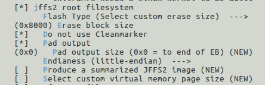

Figure 6-1 Reference configuration of JFFS2 file system

After configuration, execute make command in project directory to compile. The compiled files will be stored under out/product/X26xxhalley/image/.

### ubifs file system creation

1. Enter X26xx Halley project directory.
2. Execute make buildroot-menuconfig.
3. Configure Filesystem images/ubifs root filesystem.

The reference configuration of ubifs file system is shown in the figure below:

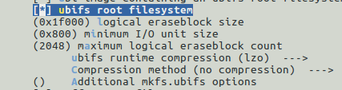

Figure 6-2 Reference configuration of UBIFS file system

After configuration, execute make command in project directory to compile. The compiled files will be stored under out/product/X26xxhalley/image/.

### Ext4 file system creation

1. Enter X26xx Halley project directory.
2. Execute make buildroot-menuconfig.
3. Configure Filesystem images/ext2/3/4 root filesystem.

The reference configuration of ext4 file system is as follows:


Figure 6-3 Reference configuration of Ext4 file system

After configuration, execute make command in project directory to compile. The compiled files will be stored under out/product/X26xxhalley/image/.

## Debugging with gdb command line tool

### GDB tool configuration

1. Enter X26xx Halley engineering directory.
2. Execute make buildroot-menuconfig.
3. Configuration Target packages/Debugging, profiling and benchmark/gdb as shown in the figure below:


Figure 7-1 Configuration path of gdb in buildroot

### gdb local debugging

Use gdb to debug. When compiling an executable program, you need to add -g option. Then execute the instructions below to enter gdb debugging mode.

gdb executable file name.

The debugging interface is as shown in the figure below.

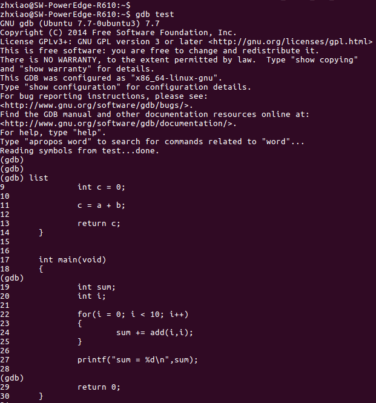

Figure 7-2 GDB local debugging interface

### gdbserver + gdb remote debugging

In many cases, it is necessary to repeatedly debug an application, especially complex programs. When debugging with GDB method, due to the limited resources of embedded systems, it cannot be directly debugged on the target system. Usually, gdb + gdbserver are used for debugging. The gdbserver runs in the target system and the gdb runs on the host machine.

#### Installation of gdbserver

GDBServer can be compiled from source code, and GDB's source code is provided in X26xx Halley. In buildroot/dl/gdb/.

X26xx Halley also provides a compiled gdbserver. Users only need to copy this gdbserver file to the development board, and its path is as follows:

```c
prebuilts/toolchains/mips-gcc720-glibc229/mips-linux-gnu/libc/mfp64/usr/lib/bin
```

#### gdbserver + gdb debugging method

Execute these instructions on a target board:

```c 
gdbserver <Host IP>:<Port> <Program to be debugged>
```

The port number can be set freely.

Run these commands on your host machine:

```c
mips-linux-gnu-gdb <The executable program to be debugged>
```

Then it will enter gdb debugging interface, and then execute instructions.

```c
target remote <Target board IP>:<port number>
```

The executable program must be the same as that running on the target board, and the port number must also be the same.

As shown in the figure below, this is a screenshot of debugging process using gdbserver + gdb.
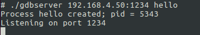

Figure 7-3 The target board waits for connection after executing instructions


Figure 7-4 Host machine enters gdb debugging interface and connects to target board

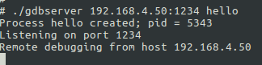

Figure 7-5 Successful connection between target board and host machine

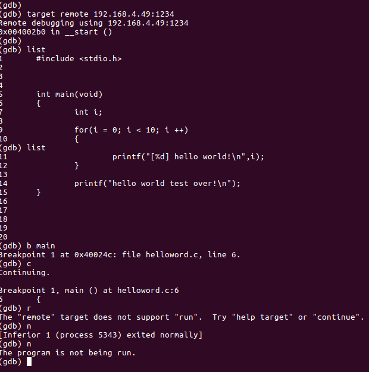

Figure 7-6 Host machine debugging


Figure 7-7 Print debugging information on target board

### GDB debugging uses commands

1. Run command

**run**: abbreviated as r, its function is to execute a program. When encountering breakpoints, the program will stop running at the breakpoint and wait for user input of next command.

**continue (abbreviated c)**: Continue execution to next breakpoint or end of run.

**next (abbreviated as n)**: single-step tracking program. When encountering a function call, it does not enter this function body; The main difference between this command and step is that when step encounters user-defined functions, it will step into the function to run, while next directly calls the function without entering its body.

**step (abbreviated as s)**: single-step debugging, if there is a function call, enter the function; unlike command n, which does not enter the called functions.

**until**: This command can run a program until it exits from the loop body when you are tired of single-stepping in a loop.

**until + line number**: run to a certain line, not just used for breaking out of loops.

**finish**: Run the program until the current function completes and returns, print out the stack address and return value as well as parameter values when it returns.

**Call function (parameters)**: Call a visible function in the program and pass "parameters", such as: call gdb_test(55).

**quit**: abbreviated as q, exit gdb.

**1. Set breakpoints**

break n (abbreviated b n): Set a breakpoint at line number n

b fn1 if a > b : condition breakpoint setting

break func (abbreviated as b): Set a breakpoint at the entry point of function func().

delete breakpoint n: deletes the nth breakpoint

Disable breakpoint n: Pause at breakpoint number n

enable breakpoint n: Enable breakpoint number n

clear line n: clears breakpoint on line n

info b (info breakpoints) : Show current program breakpoint settings

Delete Breakpoints: Clear all breakpoints

**2. View source code**

list : abbreviated as l, its function is to list the source code of a program by default.

list line number: will display 10 lines of code before and after current file centered on "line number".

List function name: It will display the source code of the function where "function name" is located, such as list main.

list : Without parameters, it will continue with the output of the last list command.

**3. Print expression**

Print expression: abbreviated as p, where "expression" can be any valid expression currently being tested by a program. For example, if you are debugging a C language program, then "expression" can be any valid C language expression, including numbers, variables and even function calls.

Print A: The value of integer A will be displayed.

print ++a will add 1 to the value of a and display it.

Print Name: Displays the value of string name

print gdb_test(22): will call gdb_test() function with integer 22 as a parameter.

print gdb_test(a): will call gdb_test() function with variable a as parameter.

Display expression: It will be very useful when running step by step. After setting an expression with the "display" command, it will output the set expression and value immediately after each instruction is executed. For example: display a.

Watch expression: Set a monitoring point, once the value of the "expression" being monitored changes, gdb will forcefully terminate the program under debugging. For example: watch a.

whatis : Query variable or function.

info function: query function.

Expand info locals: Show all variables on current stack page.

**4. View running information**

where/bt : The current running stack list

bt backtrace shows current call stack

up/down changes depth of stack display

set args parameters: specify runtime parameters

show args: view set parameters

Info Program: View whether a process is running, its PID and reason for being suspended.

**5. Split window**

layout: used to divide windows, can view code and test at the same time

layout src: display source code window

layout asm: Show disassembly window

layout regs: Show source code/disassembly and CPU register window

Layout split: Show source code and decompiler windows

Ctrl + L: Refresh window

Debug with VSCode integrated development environment

vccode installation and use

VScode official installation package download:[https://code.visualstudio.com/Download]

VScode official installation reference document: [https://code.visualstudio.com/docs/setup/linux]

VScode official debugging usage reference document: [https://code.visualstudio.com/docs/cpp/cpp-debug]

VScode official debugging configuration reference document: [https://code.visualstudio.com/docs/cpp/launch-json-reference]

### Debugging environment setup and project compilation

In the top-level directory of X26xx Halley project, you can use the following command to configure cross-debugging

make <ProjectName>-vscode PRO=<ProjectName>

The <ProjectName> can be any name, for the sake of memorization the board level name is usually used as the ProjectName.

After the command is executed, a <ProjectName>.code-workspace will be created in the current directory.

After entering the project directory, execute the following command to enter the workspace (please make sure vscode is installed successfully before executing the command)

code <ProjectName>.code-workspace

After the command is executed, you will enter the vscode visual debugging phase.

In the interface of the source file to be compiled, click the green "△" pattern on the upper left, or click Run in the menu bar and select StartDebugging to compile and debug the file. As shown in the figure below.


Figure 7-8 screenshot of vscode interface

In X26xx Halley software engineering top-level directory, you can clear project configuration information by using this command.

make <ProjectName>-clean PRO=<ProjectName>

### Start debugging

F5 to start debugging, you can set breakpoints through F9, F11 single-step, etc. to debug the program.