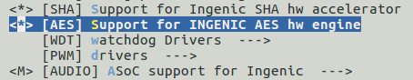

# AES encryption and decryption driver interface

## Module Function Introduction

* aes symmetric encryption hardware module
* Rijdael_fips_197 Standard
* supports 128/192/256 CBC/ECB encryption and decryption

## Drive source code location

Location of driver source code:

***module_drivers/drivers/crypto/ingenic-aes.c***

## Device tree configuration

Location of device tree:

Kernel DTS file path:

***module_driver/dts/x2600.dtsi***

AES controller definition:

```c
aes: aes@0x13430000 {

    compatible = "ingenic,aes";

    reg = <0x13430000 0x10000>;

    interrupt-parent = <&core_intc>;

    interrupts = <IRQ\_AES>;

    status = "ok";

};
```

### Default configuration of device tree

The default build of the device tree will produce an AES device.

### Device tree custom configuration

Users can disable AES devices according to actual needs, and configure this node as disabled in `board.dts`.

```c
&aes {

    status = "disabled";

};  
```

## Kernel compilation configuration

Compilation options: CRYPTO_DEV_INGENIC_AES, configuration as follows:

```
Symbol: CRYPTO_USER_API_SKCIPHER [=n]

Type  : tristate

Prompt: User-space interface for symmetric key cipher algorithms

  Location:

  -> Cryptographic API (CRYPTO [=y])

   Defined at crypto/Kconfig:1616

   Depends on: CRYPTO [=y] && NET [=y] 

   Selects: CRYPTO_BLKCIPHER [=y] && CRYPTO_USER_API [=y]


Symbol: CRYPTO_DEV_INGENIC_AES [=n]

Type : tristate

Prompt: Support for INGENIC AES hw engine

 Location:

 -> Cryptographic API (CRYPTO [=y])

 -> Hardware crypto devices (CRYPTO_HW [=n])

Prompt: [AES] Support for INGENIC AES hw engine

 Location:

 -> Ingenic device-drivers Configurations

 Defined at drivers/crypto/Kconfig:311

 Depends on: CRYPTO [=y] && CRYPTO_HW [=n] && (MACH_XBURST [=y] || MACH_XBURST2 [=n])

 Selects: CRYPTO_AES [=y] && CRYPTO_BLKCIPHER2 [=y] && CRYPTO_AES [=y] && CRYPTO_BLKCIPHER2 [=y]
```

### Default compile configuration of kernel

The kernel defaults to not having an AES driver configured.

### Kernel custom compile configuration

Users can configure the AES driver according to their actual needs, and the configuration interface is as follows:



## Device Node Generation

After successful loading of the driver, the following nodes are generated:

/sys/bus/platform/drivers/aes


## Application Instructions

Test application path:

***packages/example/security_utils/aes/***

```
├── aes.c
├── CMakeLists.txt
├── gen_key_base.c
├── include
│   ├── aes.h
│   ├── bignum.h
│   ├── gen_key_base.h
│   └── keys.h
└── main.c
```

Test method:

aes_test in_file out_file key_file op(en:1 de:0)

* int_file: encrypt/decrypt source data
* out_file: result data
* key_file: key
* op 1 encryption, 0 decryption

Related test data:

***packages/example/security_utils/test_data/aes_test/***

```
├── aes_test_data.txt
├── aes_test_en.txt
└── key.txt
```

* key.txt: key data
* aes_test_en.txt: this data is the result data
* aes_test_data.txt: this data is the data to be tested

Usage example:

```
# aes_test aes_test_data.txt encrypt.txt key.txt 1

# aes_test encrypt.txt decrypt.txt key.txt 0

# cat aes_text_data.txt

123456789011111

# cat decrypt.txt

123456789011111
```
