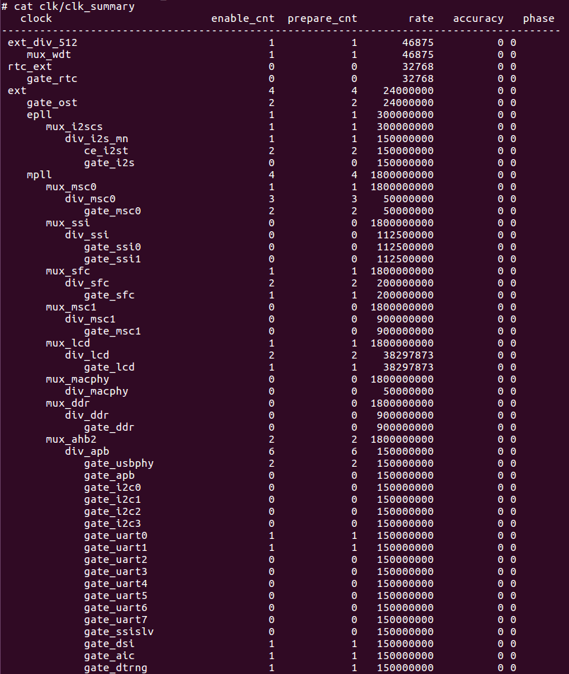
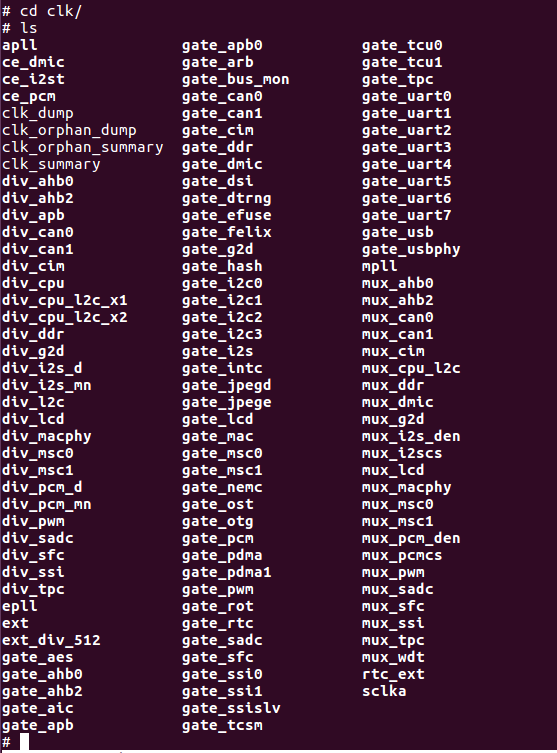
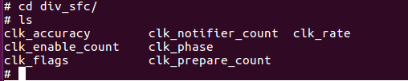

# CPM Clock Power Reset Interface

## Module Function Introduction

The CPM module is used for clock and power management. It includes: clock control, pll control, power control, reset control.

CPM driver is mainly responsible for clock power management of system and module, including multipliers, dividers, clock switches, clock source selection.

## Drive source code location

The location of the source code for the kernel-4.4.94 driver is:

***module_drivers/drivers/clk/ingenic-v2***

```
├── clk-bus.c
├── clk-bus.h
├── clk.c
├── clk-div.c
├── clk-div.h
├── clk.h
├── clk-m300.c
├── clk-pll.h
├── clk-pll-v0.c
├── clk-pll-v0.h
├── clk-pll-v1.c
├── clk-pll-v1.h
├── clk-pll-v2.c
├── clk-pll-v2.h
├── clk-rtc.c
├── clk-rtc.h
├── clk-x1000.c
├── clk-x1600.c
├── clk-x2000.c
├── clk-x2000-v12.c
├── clk-x2500.c
├── clk-x2580.c
├── clk-x2600.c
├── Kconfig
├── Makefile
├── power-gate.c
└── power-gate.h
```

The location of the source code for the kernel-5.10 driver is:

***module_drivers/drivers/clk/ingenic-v2***

```
├── clk-bus.c
├── clk-bus.h
├── clk.c
├── clk-div.c
├── clk-div.h
├── clk.h
├── clk-m300.c
├── clk-pll.c
├── clk-pll.h
├── clk-pll-v1.c
├── clk-pll-v1.h
├── clk-pll-v2.c
├── clk-pll-v2.h
├── clk-x1600.c
├── clk-x2000.c
├── clk-x2500.c
├── clk-x2600.c
├── Kconfig
├── Makefile
├── power-gate.c
└── power-gate.h
```

## Device tree configuration

Location of device tree:

***module_drivers/dts/x2600.dtsi***

Device tree description:

```c
clock: clock-controller@0x10000000 {

    compatible = "ingenic,x2600-clocks";

    reg = <0x10000000 0x100>;

    clocks = <&extclk>, <&rtcclk>;

    clock-names = "ext", "rtc_ext";

    #clock-cells = <1>;

    little-endian;

};

extclk: extclk {

    compatible = "ingenic,fixed-clock";

    clock-output-names ="ext";

    #clock-cells = <0>;

    clock-frequency = <24000000>;

};

rtcclk: rtcclk {

    compatible = "ingenic,fixed-clock";

    clock-output-names ="rtc_ext";

    #clock-cells = <0>;

    clock-frequency = <32768>;

};
```

### Default configuration of device tree

The default compiled device tree will generate clock, extclk, rtcclk devices. Configure the frequency of extclk as 24MHz:

```c
extclk: extclk {

    clock-frequency = <24000000>;

};
```

### Device tree custom configuration

## Kernel compilation configuration

### Default compile configuration of kernel

Using the CPM driver kernel does not require adding special configurations, only relying on the CONFIG_SOC_X2600 configuration option for SOC, and related codes are in: ***module_drivers/drivers/clk/ingenic-v2/***

### Kernel custom compile configuration

## Device Node Generation

1. The generated device node is in:

```c
/sys/devices/platform/10000000.clock-controller

mount -t debugfs none /mnt
```

2. Mount debugfs to /mnt, and you can view the frequency and status of each clock under /mnt/clk.

```c
mount -t debugfs none /mnt
```

* 1. cat clk_summary can view all clock's parent-child relationship, enable status, frequency and so on:



* 2. Under /mnt/clk, each folder represents a clock. mux_xxx controls the selection of the clock source, div_xxx controls the frequency division of the clock, and gate_xxx controls the switch of the clock. pd_mem_xxx controls the power switch status of each module's memory. power_xxx controls the power switch status of the module.



3. Enter a clock's folder, and run "cat clk_rate" to check the clock frequency.



## Application Instructions

### The use of clocks

The clock information has already been defined in the ***module_drivers/drivers/clk/ingenic-v2*** path of the SDK. After the kernel is started, it will associate the clock information in a tree form. Users can use it in the following way (take TCU as an example).

The description of TCU node in ***module_drivers/dts/x2600.dtsi*** is as follows:

```
tcu0: tcu0@0x13630000 {

    compatible = "ingenic,tcu";

    reg = <0x13630000 0x10000>;

    interrupt-parent = <&core_intc>;

    interrupt-names = "tcu_int0";

    interrupts = <IRQ_TCU0>;

    interrupt-controller;

    clocks = <&clock CLK_GATE_TCU0>;

    clock-names = "gate_tcu0";

    status = "disable";

};

tcu1: tcu1@0x13640000 {

    compatible = "ingenic,tcu";

    reg = <0x13640000 0x10000>;

    interrupt-parent = <&core_intc>;

    interrupt-names = "tcu_int1";

    interrupts = <IRQ_TCU1>;

    interrupt-controller;

    clocks = <&clock CLK_GATE_TCU1>;

    clock-names = "gate_tcu1";

    status = "disable";

};
```

Among them, "clocks" and "clock-name" are kernel keywords used to obtain clock information.

The TCU probe function will get the clock information of the TCU, which is used to control the switch of the clock of the TCU device.

```c
tcu->clk = of_clk_get(pdev->dev.of_node,0);

if(!tcu->clk){

    dev_err(&pdev->dev,"get clk from dts err\n");

    goto err_mfd_add;

}
```

Enable gate clock:

```c
clk_prepare_enable(tcu->clk);
```
