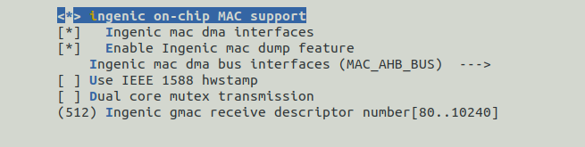

# GMAC 100 Gigabit Ethernet Controller Interface

## Module Function Introduction

RMII Reduced Media Independent Interface is another implementation of IEEE 802.3u standard besides MII interface. RMII supports bus interface speeds of 10 megabits and 100 megabits.

## Driver source code location

Location of kernel driver code:

***module_drivers/drivers/net/ethernet/ingenic***

├── ethtool.c

├── ingenic_mac.c

├── ingenic_mac.h

├── Kconfig

├── Makefile

├── readme

├── synopGMAC_Dev.c

├── synopGMAC_Dev.h

├── synopGMAC_plat.c

└── synopGMAC_plat.h

## Device tree configuration

Location of the device tree:

***module_drivers/dts/x2600.dtsi***

Network card controller definition:

```c
mac0: mac@0x134b0000 {

 compatible = "ingenic,x2600-mac";

 reg = <0x134b0000 0x1000>;

 interrupt-parent = <&core_intc>;

 interrupts = <IRQ_MAC>;

 ingenic,rst-ms = <10>;

};
```

RMII configuration reference is as follows:

```c
& mac0 {

pinctrl-names = "default", "reset ";

pinctrl-0 = <& mac0_rmii_p0_normal>, <& mac0_rmii_p1_normal>, <& mac0_phy_clk>;

pinctrl-1 = <& mac0_rmii_p0_rst>, <& mac0_rmii_p1_normal>, <& mac0_phy_clk>;

status = "okay ";

ingenic,rst-gpio = <&gpc 13 GPIO_ACTIVE_LOW INGENIC_GPIO_NOBIAS>;

ingenic,rst-ms = <10>;

ingenic,mac-mode = <RMII>;

ingenic,mode-reg = <0xb00000e4>;

ingenic,phy-clk-freq = <50000000>;

};
```

### Default configuration of device tree

x2600_Halley_V1.* series development boards support single network card MAC0.

The device tree properties are as follows:

|  |  |
| --- | --- |
| **Property name** | **Explanation** |
| **ingenic, rst-gpio** |Define GPIO reset |
| **ingenic, rst-ms** |Define reset time |
| **ingenic, rst-delay-ms** |After reset, delay time is set. No operation on phy during delay period |
| **ingenic,mac-mode** |RMII |
| **ingenic,mode-reg** | |
| **ingenic,phy-clk-freq** |If you use the chip to supply phy working clock, you need to configure the frequency of phy chip working clock. |

**Note:**

1. According to the development board design, change the reset GPIO of the corresponding PHY for the MAC device, the effective level of the reset and the time required for the reset.

## Kernel compilation configuration

The kernel configuration is INGENIC_MAC, and the configuration description is as follows:

```
Symbol: INGENIC_MAC [=y]

Type : tristate

Defined at module_drivers/drivers/net/ethernet/ingenic/Kconfig:1

Prompt: on-chip MAC support by ingenic

Location:

-> Ingenic device-drivers Configurations

-> [GMAC] (Ethernet) Drivers

Selects: CRC32 [=y] && MII [=y]
```

### Kernel default compilation configuration

The kernel default configuration GMAC driver, and the configuration interface is as follows:



### Kernel Custom Build Configuration

|  |  |
| --- | --- |
| **Configurable options** | **Configuration description** |
| **Ingenic gmac receive descriptor number [80..10240]** |gmac controller receives the number of data packets in the cache. The larger the cache, the lower the packet loss rate when it is full. After testing, setting 8192 can avoid packet loss at the controller layer. When running, the dynamic memory of one network card will use 16M-32M. |

## Module kernel differences

None

## Device node generation

After the driver loading is successful, ifconfig -a will show eth0 or eth1.

## Application usage instructions

1. Execute the ifconfig -a command to view supported network devices. If eth0 or eth1 appears, it indicates that the network card has been loaded successfully.

```
# ifconfig -a

 eth0      Link encap:Ethernet  HWaddr 1E:01:7F:E6:D3:26

 BROADCAST MULTICAST MTU:1500 Metric:1

 RX packets: 0 errors: 0 dropped: 0 overruns: 0 frame: 0

 TX packets: 0 errors: 0 dropped: 0 overruns: 0 carrier: 0

 collisions:0 txqueuelen:1000

 RX bytes: 0 (0.0 B) TX bytes: 0 (0.0 B)

 lo        Link encap:Local Loopback

 LOOPBACK MTU:65536 Metric:1

 RX packets: 0 errors: 0 dropped: 0 overruns: 0 frame: 0

 TX packets: 0 errors: 0 dropped: 0 overruns: 0 carrier: 0

 collisions:0 txqueuelen:1

 RX bytes: 0 (0.0 B) TX bytes: 0 (0.0 B)
```

2. Configure network IP

```
# ifconfig eth0 IP                /Configure eth0 or eth1 according to the actual selected network port/
```

3. Use ping command to check network connection

```
# ping IP -I eth0                /Through the -I option, you can specify the network interface used by the ping command/
```

### Network performance testing

Find a computer with 100 Mbps Ethernet functionality, connect it directly with a network cable, and use the iperf3 command to test. The computer acts as a server, and the development board acts as a client.

* Execute commands on the computer end

```
# iperf3 -s
```

* Test one-way transmission performance

```
# iperf3 -c 192.168.4.105 -u -b 1000M -l 65507 -t 10
```

* Test unidirectional reception performance

```
# iperf3 -c 192.168.4.105 -u -b 1000M -l 65507 -t 10 -R
```

* Methods to improve network performance at the application layer

The following methods are used according to specific application scenarios. If settings are unreasonable, it will affect test results.

```
# sysctl -w net.core.rmem_default=10485760
```

* Increase the cache of the network core layer. This setting uses 10M memory, and does not use dual-port bridge.

```
# sysctl -w net.core.rmem_max=10485760
```

* Increase the cache of the network core layer received.

Specify the CPU core that the kernel handles to receive network protocol stack, and specify it after which can avoid the performance instability caused by the unbalanced use of two cores due to the dynamic switching process of the kernel.

```
# echo 0 > /proc/irq/55/smp_affinity_list
```

* Specify cpu0 to process data received by gmac

```
# echo 1 > /proc/irq/63/smp_affinity_list
```

* Specify cpu1 to process data received by gmac0, interrupt number of gmac0 is 55.

```
# sysctl -w net.core.netdev_max_backlog=4000
```

* Increasing the length of data packet buffering during the transfer process can reduce data jitter but consume more memory.

```
echo 2 > /sys/class/net/eth0/queues/rx-0/rps_cpus
```

* Specify cpu1 to process data packets received by eth0. Input 1 for cpu0, 2 for cpu1, and 3 for cpu0-1.
