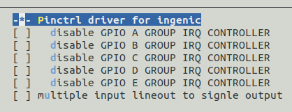

# GPIO General Purpose Input/Output interface

## Module Function Introduction

GPIOs are generally fixed when designing development boards. Some GPIOs can only be used as device reuse function pins, while others serve as ordinary input/output and interrupt detection functions. For fixed device reuse function pins, they are defined in the following files.

***module_drivers/dts/x2600-pinctrl.dtsi***

In module_drivers/dts/"board level".dts, according to driver configuration, the corresponding device function pins are selected. The kernel's GPIO driver is based on the GPIO subsystem and it is very convenient for GPIO control.

## Drive source code location

Location of driver source code

***module_drivers/drivers/pinctrl***

## Device tree configuration

The device tree is at the following location:

***module_drivers/dts/x2600-pinctrl.dtsi***

Some GPIO configurations are as follows:

```c
&pinctrl {
    uart0_pin: uart0-pin {

            uart0_pd: uart0-pd {

                ingenic,pinmux = <&gpc 21 24>;

                ingenic,pinmux-funcsel = <PINCTL_FUNCTION1>;

            };
    };

    uart1_pin: uart1-pin {

        ……

    };

    uart2_pin: uart2-pin {

        ……

    };

    uart3_pin: uart3-pin {

        ……
    };

    ……

}
```

### Default configuration of device tree

The board-level device tree, such as x2660_halley_v1.0.dts, specifies the default configuration of each GPIO.

### Device tree custom configuration

#### Configure pincfg property

When GPIO is reused as a device function, it can be specified by "ingenic,pincfg" for additional attributes of a certain pin.

* Pull-up
* pull-down
* high-impedance
* drive capability
* SCHMITT
* SLEW_RATE

Among them, X26xx does not support **filter** setting.

|  |  |
| --- | --- |
| PINCTL_CFG_BIAS_DISABLE | Close polarized voltage |
| PINCTL_CFG_BIAS_HIGH_IMPEDANCE | Set high impedance |
| PINCTL_CFG_BIAS_PULL_DOWN | Set dropdown |
| PINCTL_CFG_BIAS_PULL_PIN_DEFAULT | Set default pull up |
| PINCTL_CFG_BIAS_PULL_UP | Pull up. |
| PINCTL_CFG_DRIVE_STRENGTH | Set drive capability |
| PINCTL_CFG_FILTER | Set filter function |
| PINCTL_CFG_INPUT_SCHMITT_ENABLE | Enable Schmidt input |
| PINCTL_CFG_SLEW_RATE | Set conversion rate |

Among them, pincfgs can be one of the following forms:

```c
#define PINCTL_CFG_BIAS_DISABLE 1

#define PINCTL_CFG_BIAS_HIGH_IMPEDANCE 2

#define PINCTL_CFG_BIAS_PULL_DOWN 3

#define PINCTL_CFG_BIAS_PULL_PIN_DEFAULT 4

#define PINCTL_CFG_BIAS_PULL_UP 5

#define PINCTL_CFG_DRIVE_STRENGTH 9

#define PINCTL_CFG_FILTER 10

#define PINCTL_CFG_INPUT_SCHMITT_ENABLE 11

#define PINCTL_CFG_SLEW_RATE 17
```

```c
PINCFG_PACK(PINCTL_CFG_DRIVE_STRENGTH, 7) # value: 0 ～ 7

PINCFG_PACK(PINCTL_CFG_BIAS_DISABLE,1)

PINCFG_PACK(PINCTL_CFG_PULL_DOWN, 1) # 使能下拉

PINCFG_PACK(PINCTL_CFG_PULL_UP, 1) # 使能上拉

PINCFG_PACK(PINCTL_CFG_INPUT_SCHMITT_ENABLE, 1)

PINCFG_PACK(PINCTL_CFG_SLEW_RATE, 1)
```

Specific grammar:

```c
ingenic,pincfg = <gpio_group start_pin end_pin pincfgs>
```

For example:

```c
mac0_rgmii_p1_normal: mac0-rgmii-p1-normal {

    ingenic,pinmux = <&gpc 2 5>, <&gpc 10 10>, <&gpc 12 15>;

    ingenic,pinmux-funcsel = <PINCTL_FUNCTION1>;

    ingenic,pincfg = <&gpc 2 5 PINCFG_PACK(PINCTL_CFG_DRIVE_STRENGTH, 4)>,

    <&gpc 10 10 PINCFG_PACK(PINCTL_CFG_DRIVE_STRENGTH, 4)>,

    <&gpc 12 15 PINCFG_PACK(PINCTL_CFG_DRIVE_STRENGTH, 4)>;

};
```

#### Configure gpio properties

|  |  |
| --- | --- |
| INGENIC_GPIO_NOBIAS | Close polarized voltage |
| INGENIC_GPIO_PULLEN | Enable pull-up |
| INGENIC_GPIO_PULLUP | Pull up. |
| INGENIC_GPIO_PULLDOWN | Pull down |
| INGENIC_GPIO_HIZ | high resistance |
| INGENIC_GPIO_DS_* | Driving ability |
| INGENIC_GPIO_SLEW_RATE | Conversion rate |
| INGENIC_GPIO_SCHMITT | Schmidt characteristics |

When defining a normal GPIO, you can also configure the properties of the GPIO. Specifically as follows:

```c
#define INGENIC_GPIO_BIAS_MASK 0x7

#define INGENIC_GPIO_BIAS_SFT 0

#define INGENIC_GPIO_NOBIAS (0 << INGENIC_GPIO_BIAS_SFT)

#define INGENIC_GPIO_PULLEN (1 << INGENIC_GPIO_BIAS_SFT)

#define INGENIC_GPIO_PULLUP (2 << INGENIC_GPIO_BIAS_SFT)

#define INGENIC_GPIO_PULLDOWN (3 << INGENIC_GPIO_BIAS_SFT)

#define INGENIC_GPIO_HIZ (4 << INGENIC_GPIO_BIAS_SFT)

#define INGENIC_GPIO_DS_SFT 3

#define INGENIC_GPIO_DS_MSK 0x7

#define INGENIC_GPIO_DS_0 (0 << INGENIC_GPIO_DS_SFT)

#define INGENIC_GPIO_DS_1 (1 << INGENIC_GPIO_DS_SFT)

#define INGENIC_GPIO_DS_2 (2 << INGENIC_GPIO_DS_SFT)

#define INGENIC_GPIO_DS_3 (3 << INGENIC_GPIO_DS_SFT)

#define INGENIC_GPIO_DS_4 (4 << INGENIC_GPIO_DS_SFT)

#define INGENIC_GPIO_DS_5 (5 << INGENIC_GPIO_DS_SFT)

#define INGENIC_GPIO_DS_6 (6 << INGENIC_GPIO_DS_SFT)

#define INGENIC_GPIO_DS_7 (7 << INGENIC_GPIO_DS_SFT)

#define INGENIC_GPIO_SLEW_RATE_SFT 6

#define INGENIC_GPIO_SLEW_RATE (1 << INGENIC_GPIO_SLEW_RATE_SFT)

#define INGENIC_GPIO_SCHMITT_SFT 7

#define INGENIC_GPIO_SCHMITT (1 << INGENIC_GPIO_SCHMITT_SFT)
```

Specific grammar:

```c
xxxx,xx-gpio = <gpio_group pin polarity gpiocfs>
```

Among them, "gpio" and "gpios" are kernel keywords. When defining gpio, you need to add "-gpio" or "-gpios" at the end. These suffixes will be used when using kernel api to get gpio number.

When multiple attributes need to be applied to a certain GPIO, you can use either value or. For example, configure GPIO as pull-up, SCHMITT, drive capability set to 6.

```c
ingenic,lcd-pwm-gpio = <&gpc 1 GPIO_ACTIVE_LOW (INGENIC_GPIO_PULLUP | INGENIC_GPIO_SCHMITT | INGENIC_GPIO_DS_6 )>;
```

Define a generic GPIO example:

```c
bt_power {

    compatible = "ingenic,bt_power";

    ingenic,reg-on-gpio = <&gpc 1 GPIO_ACTIVE_LOW INGENIC_GPIO_NOBIAS>;

    ingenic,wake-gpio = <&gpd 14 GPIO_ACTIVE_LOW INGENIC_GPIO_NOBIAS>;

    status = "okay";

};
```

#### System Sleep GPIO Configuration

During system hibernation, the GPIO configuration for each development board is different. To reduce system hibernation power consumption, GPIO needs to be configured such as input pull-down or output high ground.

In the board.dts file, you can configure the following gpio attributes for each gpio group to keep the system in the corresponding state during hibernation. For example, configure the pin of PA group (0 - 10) as pull-up state, and (11 - 15) as output high

```c
&gpa {

    ingenic,gpio-sleep-pullup = <0 1 2 3 4 5 6 7 8 9 10>;

    ingenic,gpio-sleep-pulldown = <>;

    ingenic,gpio-sleep-hiz = <>;

    ingenic,gpio-sleep-low = <>;

    ingenic,gpio-sleep-high = <11 12 13 14 15>;

 };
```

Configure the following properties according to actual situation:

```c
 /* Board Sleep GPIO configuration. */

 /* <0 1 2 3 .... 31>, set one of the pin to state.*/

&gpa {

    ingenic,gpio-sleep-pullup = <>;

    ingenic,gpio-sleep-pulldown = <>;

    ingenic,gpio-sleep-hiz = <>;

    ingenic,gpio-sleep-low = <>;

    ingenic,gpio-sleep-high = <>;

};

&gpb {

    ingenic,gpio-sleep-pullup = <>;

    ingenic,gpio-sleep-pulldown = <>;

    ingenic,gpio-sleep-hiz = <>;

    ingenic,gpio-sleep-low = <>;

    ingenic,gpio-sleep-high = <>;

};

&gpc {

    ingenic,gpio-sleep-pullup = <>;

    ingenic,gpio-sleep-pulldown = <>;

    ingenic,gpio-sleep-hiz = <>;

    ingenic,gpio-sleep-low = <>;

    ingenic,gpio-sleep-high = <>;

};

&gpd {

    ingenic,gpio-sleep-pullup = <>;

    ingenic,gpio-sleep-pulldown = <>;

    ingenic,gpio-sleep-hiz = <>;

    ingenic,gpio-sleep-low = <>;

    ingenic,gpio-sleep-high = <>;

};
```

## Kernel compilation configuration

Kernel configuration GPIOLIB,kernel 4.4.94 configuration description is as follows:

```
Symbol: GPIOLIB [=y]

Type : boolean

Prompt: GPIO Support

 Location:

 -> Device Drivers

 Defined at drivers/gpio/Kconfig:34

 Depends on: ARCH_WANT_OPTIONAL_GPIOLIB [=n] || ARCH_REQUIRE_GPIOLIB [=y]

 Selected by: BCM47XX [=n] && <choice> || ARCH_REQUIRE_GPIOLIB [=y] || PINCTRL_AT91 [=n] && PINCTRL [=y] && OF [=y] && ARCH_AT91 || PINCTRL_AT91PIO4 [=n] && PINCTRL [=y] && OF [=y] && ARCH_AT91


Symbol: ARCH_REQUIRE_GPIOLIB [=y]

Type : boolean

Defined at drivers/gpio/Kconfig:23

Selects: GPIOLIB [=y]

Selected by: GPIO_TXX9 [=n] || MIPS_ALCHEMY [=n] && <choice> || AR7 [=n] && <choice> || ATH79 [=n] && <choice> || BCM63XX [=n] && <choice> || MACH_INGENIC [=n] && <choice> || MACH_XBURST [=n] &


Symbol: ARCH_WANT_OPTIONAL_GPIOLIB [=n]

Type : boolean

Defined at drivers/gpio/Kconfig:13

Selected by: BCM47XX [=n] && <choice>


Symbol: GPIOLIB_IRQCHIP [=n]

Type : boolean

Defined at drivers/gpio/Kconfig:59

Depends on: GPIOLIB [=y]

Selects: IRQ_DOMAIN [=y]

Selected by: PINCTRL_AT91 [=n] && PINCTRL [=y] && OF [=y] && ARCH_AT91 || PINCTRL_AT91PIO4 [=n] && PINCTRL [=y] && OF [=y] && ARCH_AT91 || PINCTRL_AMD [=n] && PINCTRL [=y] && GPIOLIB [=y] || PI
```

The kernel5.10 configuration for GPIOLIB is as follows:

```
Symbol: GPIOLIB [=y]

 Type : bool

 Defined at drivers/gpio/Kconfig:14

 Prompt: GPIO Support

 Location:

 (1) -> Device Drivers

 Selected by [y]:

 - PINCTRL_INGENIC_V2 [=y] && OF [=y] && (MIPS [=y] || COMPILE_TEST [=n])

 Selected by [n]:

 - MACH_INGENIC [=n]


Symbol: ARCH_REQUIRE_GPIOLIB [=ARCH_REQUIRE_GPIOLIB]

 Type : unknown

 Selected by [y]:

 - MACH_XBURST2 [=y] && <choice>

 Selected by [n]:

 - MACH_XBURST [=n] && <choice>


Symbol: GPIOLIB_FASTPATH_LIMIT [=512]

 Type : integer

 Range : [32 512]

 Defined at drivers/gpio/Kconfig:25

 Prompt: Maximum number of GPIOs for fast path

 Depends on: GPIOLIB [=y]

 Location:

 -> Device Drivers

 (2) -> GPIO Support (GPIOLIB [=y])


Symbol: GPIOLIB_IRQCHIP [=y]

 Type : bool

 Defined at drivers/gpio/Kconfig:46

 Depends on: GPIOLIB [=y]

 Selects: IRQ_DOMAIN [=y]

 Selected by [y]:

 - PINCTRL_INGENIC_V2 [=y] && OF [=y] && (MIPS [=y] || COMPILE_TEST [=n])

 Selected by [n]:

 - PINCTRL_AT91 [=n] && PINCTRL [=y] && OF [=y] && ARCH_AT91
```

### Default compile configuration of kernel

Kernel 4.4.94 defaultly configures GPIO driver, and its configuration interface is as follows:



The default configuration of GPIO driver in kernel5.10 is as follows:

### Kernel custom compile configuration

Users can customize GPIO compilation configurations according to actual needs.

## Version Differences

The differences between kernel 4.4.94 and kernel 5.10 are mainly reflected in the default configuration section of the kernel, where kernel 5.10 no longer provides a function to disable GPIO interrupt groups through menuconfig.

## Device Node Generation

Under the premise of exporting a GPIO node in the kernel, you can operate the /sys/class/gpio node to control GPIO input and output. The node path is:

```
/sys/class/gpio/
```

## GPIO number calculation explanation

In the /sys/class/gpio directory of the development board system, find the gpiochipXX directory as shown in the figure below:


Enter the gpiochip0 folder to view the content of the label file, as shown in the figure below:


Check the content in ngpio, as shown below:


Therefore, it can be determined that the reference pin of this group of GPIO pins is 0. The same principle applies to other GPIO groups.

If you want to operate pin 10 of gpioc group, then the corresponding GPIO number is 64 + 10 = 74.

### GPIO Import and Export Instructions

"export": The user space can request the kernel to export a GPIO control to the user space by writing its number to this file. For example, if the kernel code does not apply for GPIO 19:

```
echo 19 > export
```

"gpio19" node will be created for GPIO #19.

"unexport": The opposite operation of exporting to user space. For example:

```
echo 19 > unexport
```

The "gpio19" node exported by the "export" file will be removed.

### GPIO properties

The path of the GPIO signal (taking GPIO 42 as an example):

```
/sys/class/gpio/gpio42
```

And has the following read/write properties:

```
/sys/class/gpio/gpio42/direction

/sys/class/gpio/gpio42/value

/sys/class/gpio/gpio42/edge

/sys/class/gpio/gpio42/active_low
```

* direction:

Reads get "in" or "out". This value usually runs writes.

When writing to "out", its pin's default output is low level. To ensure trouble-free operation, the voltage value of "low" or "high" should be written to the configuration of GPIO as the initial output value.

**Note**: If the kernel does not support changing the direction of GPIO, or if the kernel code does not explicitly allow user space to reconfigure the direction of GPIO when exporting, then this property will not exist.

* value:

Read to get a value of 0 (low level) or 1 (high level). If the GPIO is configured as an output, this value allows write operations. Any non-zero value is considered high level.

If the pin can be configured as an interrupt signal, and if the interrupt generation mode has been configured (see "edge" description), you can use a polling operation (poll(2)) on this file, and the polling operation will return when any interrupt is triggered. If you use the polling operation (poll(2)), set the POLLPRI and POLLERR in events. If you use the polling operation (select(2)), set the file descriptor you expect in the exceptfds. After the polling operation (poll(2)) returns, you can either read the beginning of the sysfs file through the lseek(2) operation, or you can close the file and reopen it to read the data.

* edge:

The strings "none", "rising", "falling", or "both" are read and written to this file, which can be used to select the trigger mode. This will cause polling operations (select(2)) in the "value" file to return. This file only exists when this pin can be configured as an interrupt input pin.

* active_low:

Read to get 0 (false) or 1 (true). Writing any non-zero value can flip this property's (read/write) value. It already exists or is set by "edge" property after that.

## Application Instructions

### dump_gpio file

A file is provided under the path /sys/devices/platform/apb/13601000.pinctrl for a quick view of gpio functions. Users can cat the dump_gpio file to check whether the corresponding gpio function has the expected functionality, achieving the purpose of fast debugging, as shown in the figure below:


