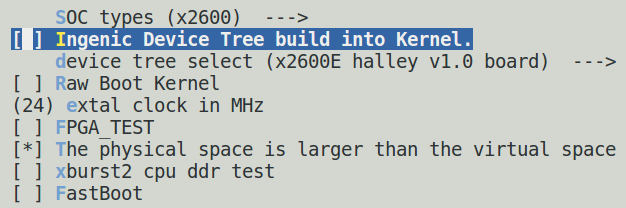
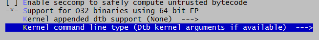

# Introduction to Kernel Development

This document is for Ingenic series chips, Kernel x.x standard kernel platform. It mainly explains the basic structure of the kernel, compilation of the kernel, configuration and pruning of device tree and driver.

## Kernel Basic Structure

The controller of Ingenic series chips has been adapted to the driver layer in Kernel x.x, and all used driver interfaces have also adopted the standard driver interface of the kernel. Users can perform secondary development based on the standard application interface without worrying about the specific implementation at the bottom level.

The kernel basic compatible structure diagram is as follows:


Figure 1-1 Kernel driver adapter structure diagram

## Kernel development process

Kernel development can be divided into two types of development. One is based on the SDK development environment provided by Ingenic, and the other type is based on the source code directory development process.

### Based on Ingenic SDK kernel development process (recommended to use)

In general, a complete SDK package will be downloaded first. The basic development environment is set up according to the instructions and then compiled as a whole **(note: this step is very important)**. This process will do some basic configuration for the kernel. The flow chart is as follows:


Figure 1-2 Kernel development flow chart

After ensuring that all of the above work is completed, you can execute the following command to configure at the top level of SDK when you need to reconfigure the kernel or modify the kernel and need to be recompiled.

```
$ make kernel-menuconfig # Configure the kernel

$ make kernel # Compile the kernel
```

Taking x2660 halley v1.0 as an example, after executing this command, a file will be generated.

***out/product/x2660halley.v10_nand_x.x.x-eng/obj/kernel-intermediate/arch/mips/boot/uImage***, this file is the final kernel image that needs to be burned.

Based on the development process of Ingenic SDK, the source code and compiled intermediate files are separated. The intermediate files will be generated in the ***out/product/x2660halley.v10_nand_x.x.x-eng/obj/kernel-intermediate*** directory, including the .config file for the kernel.

**Note:**

1. The development process of using Ingenic SDK requires ensuring that the source code directory is not contaminated, which means you cannot use traditional make xxx_defconfig to configure and compile the kernel in the source code directory. Otherwise, an error will be reported. At this time, you can execute it under the kernel source code directory:

```
$ make distclean

$ make mrproper
```

2. All commands using make kernel-xxx actually execute:

```
$ make -C out/product/productName/obj/kernel-intermediate xxx
```

In the actual development process, you can try replacing xxx in make kernel-xxx with the make command supported by the kernel.

3. x2660halley.v10_x.x in the nand_x.x.x-eng is a unified writing method. if kernel-4.4.94 is used, it needs to be modified to ***x2660halley.v10_nand_4.4.94-eng***. if kernel-5.10 is used, it needs to be modified to ***x2660halley.v10_nand_5.10-eng***

### Based on kernel source code development process

The development process based on kernel source code is that both modified and compiled target files are generated in the kernel directory. All commands of this development process are executed in the kernel directory.

```
$ cd kernel

$ make board_cfg_defconfig

$ make uImage
```

Execute the following commands when kernel reconfiguration needs to be modified:

```c
$ make menuconfig

$ make uImage

$ ls arch/mips/boot/uImage is the generated target file
```

After executing these commands, an arch/mips/boot/uImage file will be generated in the kernel source code directory. This is the final image to be burned. board_cfg can be found in the arch/mips/configs directory.

## Kernel default configuration

All kernel configuration files for development boards are stored in ***arch/mips/configs/***.

The configuration files included in X26xx_halley are as follows:

| **Configuration file** | **Explanation** |
| **x2660_halley_v1.0_defconfig** | Used for x2660_halley_v1.0 development board, main storage is configured to start with nand/nor |
| **x2660_halley_v1.1_defconfig** | For x2660_halley_v1.1 development board, main storage configuration for nand/nor booting |
| **x2670_halley_v1.0_defconfig** | For x2670_halley_v1.0 development board, main storage configuration for nand/nor booting |
| **x2600e_halley_v1.0_defconfig** | For x2600e_halley_v1.0 development board, configuration for booting from NAND/NOR/EMMC main storage |

Table 1 X26xx_halley Kernel Configuration Table

## Device tree configuration

devicetree is used to describe chip and board resources on development boards, with two main usage methods. One method directly compiles it together with the kernel, while the other method compiles it separately, stores it separately, and informs uboot of its storage location through parameters.

By default, use direct compilation of the kernel. The specific differences can be referred to in the following content.

### Device Tree File Introduction

The configuration file of device tree is mainly stored in module_drivers/dts directory. The composition of dts is generally defined at soc level and board level.


Chart 1-3 dts structure schematic diagram

X26xx_halley platform involves devicetree files as follows:

| **dts file** | **Document Description** |
| **x2660_halley_v1.0.dts** | Development board configuration for X2660 Halley V1.0 series. When customizing development board configurations, this file needs to be modified |
| **x2660_halley_v1.1.dts** | Development board configuration for X2660 Halley V1.1 series. When customizing development board configurations, this file needs to be modified |
| **x2670_halley_v1.0.dts** | Development board configuration for X2670 Halley V1.0 series. When customizing development board configurations, this file needs to be modified |
| **x2600e_halley_v1.0.dts** | The development board configuration for X2600e Halley V1.0 series. When customizing the development board configuration, you need to modify this file |
| **x2600.dtsi** | The basic configuration of the X2600 SOC chip does not need to be modified by customers. |
| **x2600-pinctrl.dtsi** | X2600 GPIO function configuration, customers generally do not need to modify. |
| **X26xx_halley_lcd/X2660_HALLEY_MIPI_LCD_FW050.dtsi** |Screen profile |
| **X26xx_halley_lcd/X2660_HALLEY_RGB_LCD_HC050IG.dtsi** |Screen profile |

### Kernel Builtin Device Tree (Default Usage)

Refer to how the platform uses by default.

### Compile device tree separately

Separate compilation and use of device trees require multi-faceted support

1. Modify u-boot to support loading devicetree.
2. Modify kernel configuration to support compiling out devicetree binary files separately.
3. Modify burning tools to support burning devicetree binary files.

#### Modify uboot configuration

The configuration file needs to be modified, such as: ***u-boot/include/configs/x2660_halley.h***

1. Add device tree support /* Device Tree Configuration */

```c
/* Device Tree Configuration */

#define CONFIG_OF_LIBFDT 1

#define IMAGE_ENABLE_OF_LIBFDT 1

#define CONFIG_LMB
```

2. Modify kernel boot parameters and startup commands

**nand start:**

```c
#define CONFIG\_BOOTARGS BOOTARGS\_COMMON "ip=off init=/linuxrc ubi.mtd=3 root=ubi0:rootfs ubi.mtd=4 rootfstype=ubifs rw

#define CONFIG\_BOOTCOMMAND "set uImage 0x80600000; set dtb 0x83000000; sfcnand read 0x100000 0x400000 $(uImage); sfcnand read 0x900000 0x20000 $(dtb); bootm $(uImage) - ${dtb}"
```

**Note:** It needs to be modified according to the actual partition situation.

#### Modify kernel configuration

At the top of SDK, execute make kernel-menuconfig and remove **INGNEIC_BUILTIN_DTB** configuration.

Its configuration is as follows:

```c
There is no help available for this option.

 Symbol: INGENIC_BUILTIN_DTB [=n]

 Type : boolean

 Prompt: Ingenic Device Tree build into Kernel.

 Location:

 -> Machine selection

 -> SOC Type Selection

 Defined at arch/mips/xburst2/Kconfig:74

 Depends on: MACH_XBURST2 [=n]

 Selects: BUILTIN_DTB [=y]
```

After removing options, the interface is as follows:



Chart 1-4

#### Compile dtb files

Execute at top level of SDK

```c
 $make kernel-dtbs
```

will generate files in the ***out/product/x2660halley.v10_nand_x.x.x.x-eng/obj/kernel-intermediate/*** directory
***arch/mips/boot/dts/ingenic/x2660_halley_v1.0.dtb***

This file is the final one that needs to be burned as a devicetree binary.

#### burn dtb files

1. **Burn Nand DTB files**

**Note:** When burning dtb files to the reserved partition on the device tree, it should be consistent with the configuration of bootcmd and bootargs.


Chart 1-5 Nand DTB burning

### Passing kernel parameters through the device tree

There are multiple ways to pass kernel bootargs, and here we only introduce how to use dts files to pass kernel parameters.

#### Modify device tree

Define chosen node, bootargs in the node as cmdline passed to kernel.

Example: ***arch/mips/boot/dts/ingenic/X2660_halley_v1.0.dts***

```c
/ {

	compatible = "img,x2660-halley-board-v1.0", "ingenic,x2660";

	chosen {

	bootargs = "console=ttyS0,115200 mem=128M@0x0ip=off init=/linuxrc ubi.mtd=3

	root=ubi0:rootfs ubi.mtd=4 rootfstype=ubifs rw";

	};

};
```

#### Modify kernel configuration

After configuring the kernel to select MIPS_CMDLINE_FROM_DTB, it will parse bootargs in dts files and ignore bootargs passed from uboot.

**Note:** During startup, U-Boot interprets the chosen node in the dtb (Device Tree Blob), if it is not defined, then U-Boot will create a default chosen node.

```c
Symbol: MIPS_CMDLINE_FROM_DTB [=y]

Type : boolean

Prompt: Dtb kernel arguments if available

Location:

-> Kernel type

-> Kernel command line type (<choice> [=y])

Defined at arch/mips/Kconfig:2858

Depends on: <choice> && USE_OF [=y]
```

After selection, refer to the image below.


