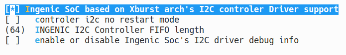
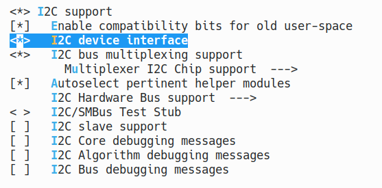

# SMB I2C interface

## Module Function Introduction

The SMB bus is a two-wire serial interface consisting of a serial data line (SDA) and a serial clock (SCL) that carry information between devices connected to the bus. Each device has a unique address and can act as a "transmitter" or "receiver" according to the function of the device. When performing data transmission, the device can also be regarded as a master or a slave. A master device is a device that initializes/terminates data transfer on the bus and generates a clock signal to allow the transfer. During this time, any addressed device is considered a slave device. The SMB controller is software-controlled. It acts as a master or slave. However, it does not support simultaneous operation as a master and slave.

The i2c controller is for SMB. The interfaces supported by SMB are i2c and support 100 Kb/s and 400 Kb/s. The I2C interface can be connected to the pmu and camera through the i2c interface for configuration.

## Drive source code location

Location of driver source code:

***module_drivers/drivers/i2c/busses/i2c-ingenic.c***

## Device tree configuration

Location of device tree:

***module_drivers/dts/x2600.dtsi***

i2c controller description:

```c
i2c0: i2c@0x10050000 {

    compatible = "ingenic,x2600-i2c";

    reg = <0x10050000 0x1000>;

    interrupt-parent = <&core_intc>;

    interrupts = <IRQ_I2C0>;

    #address-cells = <1>;

    #size-cells = <0>;

    status = "disabled";

};

i2c1: i2c@0x10051000 {

    compatible = "ingenic,x2600-i2c";

    reg = <0x10051000 0x1000>;

    interrupt-parent = <&core_intc>;

    interrupts = <IRQ_I2C1>;

    #address-cells = <1>;

    #size-cells = <0>;

    status = "disabled";

};

i2c2: i2c@0x10052000 {

    compatible = "ingenic,x2600-i2c";

    reg = <0x10052000 0x1000>;

    interrupt-parent = <&core_intc>;

    interrupts = <IRQ_I2C2>;

    #address-cells = <1>;

    #size-cells = <0>;

    status = "disabled";

};

i2c3: i2c@0x10053000 {

    compatible = "ingenic,x2600-i2c";

    reg = <0x10053000 0x1000>;

    interrupt-parent = <&core_intc>;

    interrupts = <IRQ_I2C3>;

    #address-cells = <1>;

    #size-cells = <0>;

    status = "disabled";

};
```

### Default configuration of device tree

The device tree of x2660 and x2670 default compilation will generate i2c-adapter2 devices and i2c-adapter3 devices, while the device tree of x2600e default compilation will generate i2c-adapter0 devices and i2c-adapter1 devices.

### Device tree custom configuration

Users can open or close a certain i2c adapter device according to actual needs, and attach corresponding i2c-client devices under the i2c-adapter node of the device tree. For example:

***module_drivers/dts/x2660_halley_lcd/X2660_HALLEY_MIPI_LCD_FW050.dtsi***

```c
&i2c2{

    status = "okay";

    clock-frequency = <100000>;

    pinctrl-names = "default";

    pinctrl-0 = <&i2c2_pb>;

    goodix@0x14{

        compatible = "goodix,gt9xx"; /* do not modify */

        reg = <0x14>; /* do not modify */

        interrupt-parent = <&gpc>; /* INT pin */

        interrupts = <9>;

        reset-gpios = <&gpc 17 GPIO_ACTIVE_LOW INGENIC_GPIO_NOBIAS>; /* RST pin */

        irq-gpios = <&gpc 18 IRQ_TYPE_EDGE_FALLING INGENIC_GPIO_NOBIAS>; /* INT pin */

        goodix,driver-send-cfg = <1>;

        touchscreen-size-x = <1280>;

        touchscreen-size-y = <720>;

        goodix,slide-wakeup = <0>;

        goodix,type-a-report = <1>;

        goodix,resume-in-workqueue = <0>;

        goodix,int-sync = <1>;

        goodix,swap-x2y = <0>;

        goodix,auto-update-cfg = <0>;

        goodix,power-off-sleep = <0>;

        goodix,pen-suppress-finger = <0>;

        irq-flags = <2>; /* 1 rising, 2 falling */

        pinctrl-names = "default", "int-output-high", "int-output-low", "int-input";

        pinctrl-0 = <&touchscreen_default>;

        pinctrl-1 = <&touchscreen_int_out_high>;

        pinctrl-2 = <&touchscreen_int_out_low>;

        pinctrl-3 = <&touchscreen_int_input>;

        goodix,cfg-group0 = [

        00 D0 02 00 05 0A 05 00 01 08 28

        05 50 32 03 05 00 00 00 00 00 00

        00 00 00 00 00 87 28 09 17 15 31

        0D 00 00 02 9B 03 25 00 00 00 00

        00 03 64 32 00 00 00 0F 36 94 C5

        02 07 00 00 04 9B 11 00 7B 16 00

        64 1C 00 50 25 00 42 2F 00 42 00

        00 00 00 00 00 00 00 00 00 00 00

        00 00 00 00 00 00 00 00 00 00 00

        00 00 00 00 00 00 00 00 00 00 00

        00 00 12 10 0E 0C 0A 08 06 04 02

        FF FF FF FF FF 00 00 00 00 00 00

        00 00 00 00 00 00 00 00 00 00 26

        24 22 21 20 1F 1E 1D 00 02 04 06

        08 0A 0C FF FF FF FF FF FF FF FF

        FF FF FF 00 00 00 00 00 00 00 00

        00 00 00 00 00 00 00 00 CF 01];

    };

};
```

## Kernel compilation configuration

The kernel configuration for I2C_INGENIC is as follows:

```
Symbol: I2C_INGENIC [=y]

Type : boolean

Prompt: Ingenic SoC based on Xburst arch's I2C controler Driver support

 Location:

 -> Device Drivers

 -> I2C support

 -> I2C support (I2C [=y])

 -> I2C Hardware Bus support

 Prompt: Ingenic SoC based on Xburst arch's I2C controler Driver support

 Location:

 -> Ingenic device-drivers Configurations

 -> [I2C] Master Drivers

 Defined at drivers/i2c/busses/Kconfig
```

### Default compile configuration of kernel

The kernel default configuration for I2C controller driver is as follows:




### Kernel custom compile configuration

1. Users can remove the driver of I2C controller according to actual needs.

2. The device node can be exported to /dev in user space, configure I2C_CHARDEV as follows:

```
Symbol: I2C_CHARDEV [=y]

Type : tristate

Prompt: I2C device interface

 Location:

 -> Device Drivers

 -> I2C support

 -> I2C support (I2C [=y])

 Defined at module_drivers/drivers/i2c/Kconfig

 Depends on: I2C [=y]
```

The configuration interface is as follows:



## Kernel version differences

None

## GPIO simulate i2c

1. Firstly, two sets of unused GPIO need to be selected to simulate sda and scl
2. Custom configuration in device tree

```c
i2c@0 {

    compatible = "i2c-gpio";

    gpios = <&gpc 31 GPIO_ACTIVE_LOW INGENIC_GPIO_NOBIAS>,/* sda */

    <&gpc 30 GPIO_ACTIVE_LOW INGENIC_GPIO_NOBIAS>;/* scl */

    //i2c-gpio,sda-open-drain;

    //i2c-gpio,scl-open-drain;

    i2c-gpio,delay-us = <2>; /* ~100 kHz */

    #address-cells = <1>;

    #size-cells = <0>;

};
```

3. Select in kernel custom compilation configuration


Configuration instructions:

```
Symbol: I2C_GPIO [=y]

Type : tristate

Prompt: GPIO-based bitbanging I2C

 Location:

 -> Device Drivers

 -> I2C support

 -> I2C support (I2C [=y])

 -> I2C Hardware Bus support

 Defined at drivers/i2c/busses/Kconfig
```

## Device Node Generation

After opening the I2C_CHARDEV option, corresponding nodes will be generated under /dev:

```
ls /dev/i2c-*

i2c-0 i2c-2 i2c-3
```

## Application Instructions

The LCD touch screen function is controlled and data transmission through I2C

### Test methods

Execute command:

```
ts_test
```

Serial port print data:

```
# ts_test
29.433205:    380    696     27
29.444827:    380    696     27
29.455421:    380    696     27
29.466231:    380    696     27
29.476970:    380    696     27
29.487586:    379    695     27
29.498317:    378    689     27
29.508938:    374    664     27
29.519684:    368    626     27
29.530380:    358    582     27
29.541101:    348    542     27
29.551899:    338    513     27
29.562535:    330    496     27
29.571951:    323    485     27
29.582599:    317    476      0
30.398091:    375    756     21
30.409589:    375    756     21
30.420289:    375    756     21
30.430923:    373    753     21
```

### Common i2c communication kernel prompts:

|  |  |
| --- | --- |
| **Error message** | **Explanation** |
| I2C_TXABRT_ABRT_7B_ADDR_NOACK | Under 7bit addressing, slave did not return ACK|
| I2C_TXABRT_ABRT_10ADDR1_NOACK | Under 10-bit addressing, no response after sending the first byte. |
| I2C_TXABRT_ABRT_10ADDR2_NOACK | Under 10-bit addressing, no response after sending the second byte. |
| I2C_TXABRT_ABRT_XDATA_NOACK | After the address is determined, but slave does not respond to subsequent data |
| I2C_TXABRT_ABRT_GCALL_NOACK | i2c broadcast addressing, slave did not respond |
| I2C_TXABRT_ABRT_GCALL_READ | After I2C broadcast addressing, perform a read operation. |
| I2C_TXABRT_ABRT_HS_ACKD | The main device is in high-speed mode and confirmed |
| I2C_TXABRT_SBYTE_ACKDET | The main device has sent a byte and the start byte is confirmed |
| I2C_TXABRT_ABRT_HS_NORSTRT | Restart is not available, but users want to send data in high-speed mode. |
| I2C_TXABRT_SBYTE_NORSTRT | Restart is unavailable, but user sent a start byte. |
| I2C_TXABRT_ABRT_10B_RD_NORSTRT | Restart is unavailable, but master device sends read command under 10-bit addressing. |
| I2C_TXABRT_ABRT_MASTER_DIS | The current main device is unavailable, and the user performs operations on the main device |
| I2C_TXABRT_ARB_LOST | Lost arbitration |
| I2C_TXABRT_SLVFLUSH_TXFIFO | When receiving data from a device, there is already some data in the FIFO. |
| I2C_TXABRT_SLV_ARBLOST | When sending data, the device loses the bus. |
| I2C_TXABRT_SLVRD_INTX | When the main device needs to send data, it enters a read data state |
