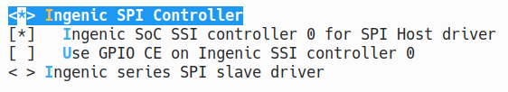
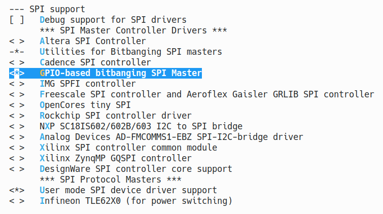
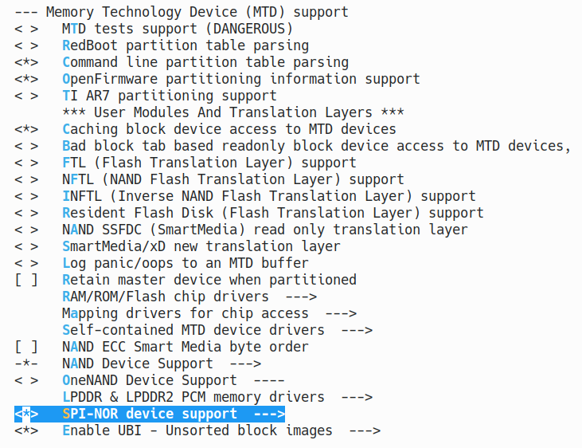
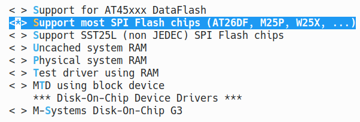
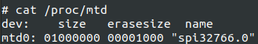
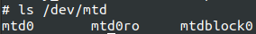
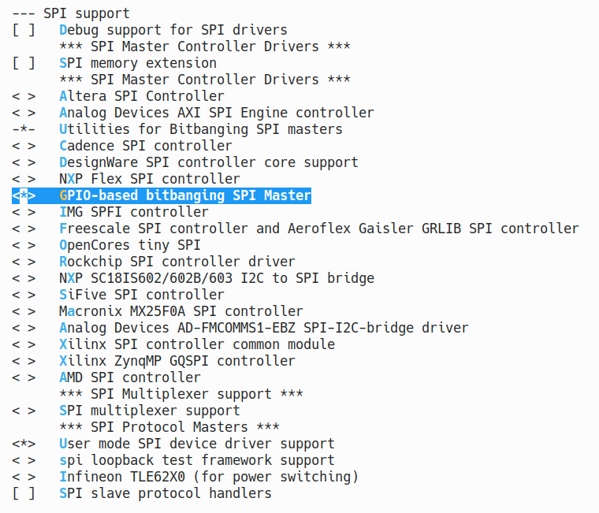
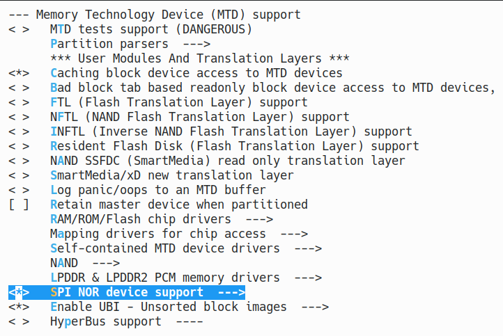
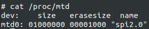
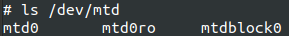

# SSI SPI interface

## Module Function Introduction

SSI is a full-duplex synchronous serial interface that can be connected to various external analog-to-digital (A/D) converters, audio and telecommunication decoders, as well as other protocols using serial data transmission. The X26xx series SOC supports Motorola's Serial Peripheral Interface (SPI) protocol.

* GPIO function description

|  |  |  |
| --- | --- | --- |
| **Name** | **I/O** | **Description** |
| **SSI_CLK** | Output | Serial bit-rate clock |
| **SSI_CE0** | Output | Firstslaveselectenable |
| **SSI_DT** | Output | Transmitdata(serialdataout) |
| **SSI_DR** | Input | Receivedata(serialdatain) |

* GPIO interface

|  |  |  |
| --- | --- | --- |
|SSI0 | PB00-03 | FUNCTION0 |
|SSI0 | PD00-02 PD05 | FUNCTION2 |
|SSI1 | PC15-18 | FUNCTION2 |
|SSI1 | PC25-27 PC30 | FUNCTION1 |

## Drive source code location

Location of driver source code:

***module_drivers/drivers/spi***

```
├── ingenic_spi.c
├── ingenic_spi.h
```

## Device tree configuration

Location of device tree:

***module_drivers/dts/x2600.dtsi***

SPI Controller Description:

```c
spi0: spi0@0x10043000 {

	compatible = "ingenic,x2600-spi";

	reg = <0x10043000 0x1000>;

	interrupt-parent = <&core_intc>;

	interrupts = <IRQ_SSI0>;

	dmas = <&pdma INGENIC_DMA_TYPE(INGENIC_DMA_REQ_SSI0_TX)>,

	<&pdma INGENIC_DMA_TYPE(INGENIC_DMA_REQ_SSI0_RX)>;

	dma-names = "tx", "rx";

	#address-cells = <1>;

	#size-cells = <0>;

	status = "disable";

};

spi1: spi1@0x10044000 {

	compatible = "ingenic,x2600-spi";

	reg = <0x10044000 0x1000>;

	interrupt-parent = <&core_intc>;

	interrupts = <IRQ_SSI1>;

	dmas = <&pdma INGENIC_DMA_TYPE(INGENIC_DMA_REQ_SSI1_TX)>,

	<&pdma INGENIC_DMA_TYPE(INGENIC_DMA_REQ_SSI1_RX)>;

	dma-names = "tx", "rx";

	#address-cells = <1>;

	#size-cells = <0>;

	status = "disable";

};
```

### Default configuration of device tree

The SPI controller device is disabled by default in the device tree because several sets of SPI function pins are occupied by other modules.

### Device tree custom configuration

Users can open SPI controller devices according to actual needs, for example:

```c
&spi0 {

	status = "ok";

	pinctrl-names = "default";

	pinctrl-0 = <&spi0_pb>;

	spi-max-frequency = <54000000>;

	num-cs = <2>;

	/* cs-gpios = <0>, <0>; */

	/*cs-gpios = <&gpa 27 GPIO_ACTIVE_HIGH INGENIC_GPIO_NOBIAS>, <&gpa 27 GPIO_ACTIVE_HIGH INGENIC_GPIO_NOBIAS>;*/

	ingenic,chnl = <0>;

	ingenic,allow_cs_same = <1>;

	ingenic,bus_num = <0>;

	ingenic,has_dma_support = <0>; /*选择dma，需要配置pdma通道*/

	ingenic,spi-src-clk = <1>;/*0.ext; 1.ssi*/

	/* Add SPI interface device */

	spidev: spidev@0 {

		compatible = "rohm,dh2228fv";

		reg = <0>;

		spi-max-frequency = <10000000>;

	};

};
```

The meanings of some attributes are as follows:

|  |  |
| --- | --- |
| spi-max-frequency | SPI controller maximum working frequency |
| ingenic,chnl | spi number |
| ingenic,has_dma_support | Whether to use DMA, 1 indicates using DMA |
| ingenic,spi-src-clk | Device clock source selection |
| num-cs | How many pins does a controller have? |


### Use GPIO to simulate SPI protocol

To meet some special protocol requirements, we can also use bitbang-based GPIO to simulate SPI function.

Add the spi-gpio node as follows under the device tree root node:

The method to add in the middle device tree is as follows:

```c
/ {

	spi_gpio {

		status = "okay";

		compatible = "spi-gpio";

		#address-cells = <1>;

		#size-cells = <0>;

		gpio-sck = <&gpb 28 GPIO_ACTIVE_LOW INGENIC_GPIO_NOBIAS>;

		gpio-miso = <&gpb 29 GPIO_ACTIVE_LOW INGENIC_GPIO_NOBIAS>;

		gpio-mosi = <&gpb 30 GPIO_ACTIVE_LOW INGENIC_GPIO_NOBIAS>;

		cs-gpios = <&gpb 31 GPIO_ACTIVE_LOW INGENIC_GPIO_NOBIAS>;

		num-chipselects = <1>;

		/* clients */

		spidev1: spidev1@0 {

			status = "disable";

			compatible = "rohm,dh2228fv";

			reg = <0>;

			spi-max-frequency = <500000>;

		};

	};

}
```

Note: According to the description in the "Documentation/devicetree/bindings/spi/spi-gpio.yaml" file, the original attributes "gpio-sck", "gpio-miso" and "gpio-mosi" have been discarded in kernel5.10, but the actual kernel 5.10 still retains the analysis of the original attributes, and it is recommended to use new devicetree attributes.

## Kernel compilation configuration

The kernel configuration for INGENIC_SPI is as follows:

```
 Symbol: INGENIC_SPI [=y]

 Type : tristate

 Prompt: Ingenic SPI Controller

 Location:

 -> Ingenic device-drivers Configurations

 -> [SPI] Master/Slave Drivers

 Defined at module_drivers/drivers/spi/Kconfig:1

 Depends on: MACH_XBURST [=n] || MACH_XBURST2 [=y]

 Selects: SPI_BITBANG [=y]
 ```

### Default compile configuration of kernel

The kernel defaults to opening SPI controller drivers

### Kernel custom compile configuration

Users can open SPI controller compilation according to actual needs. The configuration interface is as follows:



### Use GPIO to simulate SPI protocol

To meet some special protocol requirements, we can also use bitbang-based GPIO to simulate SPI function.

```
Device Drivers --->

 [*] SPI support --->

 -*- Utilities for Bitbanging SPI masters

 <*> GPIO-based bitbanging SPI Master

 <*> User mode SPI device driver support /*向用户提供设备设备节点*/

 -> Ingenic device-drivers Configurations

-> [SPI] Master/Slave Drivers

< > Ingenic SPI Controller /*去掉ingenic ssi控制器配置*/
```

## Device Node Generation

Drive loaded successfully log

```
[ 0.298196] INGENIC SSI Controller for SPI channel 0 driver register
```

Generate device nodes:

```
/dev/spidev0.0
```

When using GPIO to simulate SPI protocol, device nodes spidev%d.%d* are generated, for example:

```
/dev/spidev32766.0
```

## Application Instructions

The kernel's SPI driver is based on the SPI subsystem architecture

* Applications can be tested using spi_demo
* The spi interface can be manipulated in kernel space via the spi driver
* The spi interface can be manipulated in user space via spi_ioc_transfer

### Test spi read and write

#### Source code location

The kernel4.4.94 application is located at the following location:

***Documentation/spi/spidev_test.c***

The kernel5.10 program is located at the following location:

***tools/spi/spidev_test.c***

#### Test methods

1. Hardware connection, short-circuit SSI0_DT and SSI0_DR pins

```
# ./spi_test --help

./spi_test: unrecognized option '--help'

Usage: ./spi_test [-DsbdlHOLC3]

-D --device device to use (default /dev/spidev1.1)

-s --speed max speed (Hz)

-d --delay delay (usec)

-b --bpw bits per word

-l --loop loopback

-H --cpha clock phase

-O --cpol clock polarity

-L --lsb least significant bit first

-C --cs-high chip select active high

-3 --3wire SI/SO signals shared

-v --verbose Verbose (show tx buffer)

-p Send data (e.g. "1234xdexad")

-N --no-cs no chip select

-R --ready slave pulls low to pause

-2 --dual dual transfer

-4 --quad quad transfer
```

2. Execute `spidev_test -D /dev/spidev0.0`

#### Test results

```
# ./spi_test -D /dev/spidev0.0

spi mode: 0x0

bits per word: 8

max speed: 500000 Hz (500 KHz)

RX | FF FF FF FF FF FF 40 00 00 00 00 95 FF FF FF FF FF FF FF FF FF FF FF FF FF FF FF FF FF FF F0 0D | ......@......................�.
```

### Test spi nor flash

For SPI interface NOR Flash, there is already a corresponding driver supported in the kernel. If you want to use it, all you need to do is configure it correctly. When using the SPI interface NOR Flash driver, GPIO should be used to simulate the SPI protocol.

#### kernel4.4.94 version operation

##### Device tree configuration

Device tree location:

***module_drivers/dts/x2660_halley_v1.0.dts***

You need to add a node for NOR flash in spi_gpio:

```c
spi_gpio {

	status = "okay";

	compatible = "spi-gpio";

	#address-cells = <1>;

	#size-cells = <0>;

	gpio-sck = <&gpe 16 GPIO_ACTIVE_LOW INGENIC_GPIO_NOBIAS>;

	gpio-miso = <&gpe 18 GPIO_ACTIVE_LOW INGENIC_GPIO_NOBIAS>;

	gpio-mosi = <&gpe 17 GPIO_ACTIVE_LOW INGENIC_GPIO_NOBIAS>;

	cs-gpios = <&gpe 21 GPIO_ACTIVE_LOW INGENIC_GPIO_NOBIAS>;

	num-chipselects = <1>;

	/* clients */

	m25p80 {

		compatible = "m25p80";

		reg = <0>;

		spi-max-frequency = <1000000>;

	};

};
```

##### Kernel compilation configuration

1. Compile drivers/spi/spi-gpio.c

Location: Device Drivers > SPI support

 Select GPIO-based bitbanging SPI Master, as shown in the figure below:



2. Compile drivers/mtd/spi-nor/spi-nor.c

Location: Device Drivers > Memory Technology Device (MTD) support

 Select SPI-NOR device support, as shown in the figure below:



3. Compile ***drivers/mtd/devices/m25p80.c***

Location: Device Drivers > Memory Technology Device (MTD) support > Self-contained MTD device module_drivers/drivers.

 Select Support most SPI Flash chips (AT26DF, M25P, W25X, ...), as shown in the figure below:



##### test

1. Ensure that the nor flash hardware is properly connected;
2. Search in drivers/mtd/spi-nor/spi-nor.c according to the model of the nor flash, see if there are corresponding models supported. If not, you need to configure the corresponding parameters:

```c
static const struct flash_info spi_nor_ids[] = {

	/* Atmel -- some are (confusingly) marketed as "DataFlash" */

	{ "at25fs010", INFO(0x1f6601, 0, 32 * 1024, 4, SECT_4K) },

	{ "at25fs040", INFO(0x1f6604, 0, 64 * 1024, 8, SECT_4K) },

	...........

	{ "xm25qh128c", INFO(0x204018, 0, 4 * 1024, 4096, SECT_4K)},

	...........

	/* GigaDevice */

	{ "gd25q32", INFO(0xc84016, 0, 64 * 1024, 64, SECT_4K) },

	{ "gd25q64", INFO(0xc84017, 0, 64 * 1024, 128, SECT_4K) },

	{ "gd25q128", INFO(0xc84018, 0, 64 * 1024, 256, SECT_4K) },

	...........

	{ },

};
```

3. Recompile the kernel and burn it; if you see the following information, it means that the addition is successful:

```
[1.571673] m25p80 spi32766.0: xm25qh128c (16384 Kbytes)
```

The model of nor flash demonstrated here is xm25qh128c, with a size of 16MB. The specific printing information is identical to the parameters configured in the struct flash_info spi_nor_ids[] structure in the spi-nor.c file;

5. After entering the root file system, you can execute the following command to further confirm, if a new mtd partition is added, it means that the addition is successful, where mtd0 is the partition corresponding to the newly added nor flash



At the same time, corresponding device nodes are also generated in the/dev directory. Here, three device nodes are exemplified: mtd0, mtd0ro, and mtdblock0. Among them, mtd0 and mtd0ro are character device nodes. The difference is that mtd0 is read-write, mtd0ro is read-only, and mtdblock0 is block device node, which is read-write, as shown in the following figure:



6. Next, commands such as flash_erase and mtd_debug can be used to read and write the character device node mtd0 generated by nor flash. At the same time, operations such as formatting, mounting, file system reading and writing can also be performed on the block device node mtdblock0. We will not demonstrate this here.

#### kernel5.10 version operation

##### Device tree configuration

Device tree location:

***module_drivers/dts/x2660_halley_v1.0.dts***

You need to add a node for NOR flash in spi_gpio:

```c
spi_gpio {

	status = "okay";

	compatible = "spi-gpio";

	#address-cells = <1>;

	#size-cells = <0>;

	sck-gpios = <&gpe 16 GPIO_ACTIVE_HIGH INGENIC_GPIO_NOBIAS>;

	miso-gpios = <&gpe 18 GPIO_ACTIVE_HIGH INGENIC_GPIO_NOBIAS>;

	mosi-gpios = <&gpe 17 GPIO_ACTIVE_HIGH INGENIC_GPIO_NOBIAS>;

	cs-gpios = <&gpe 21 GPIO_ACTIVE_HIGH INGENIC_GPIO_NOBIAS>;

	num-chipselects = <1>;

	/* clients */

	m25p80 {

		compatible = "m25p80";

		reg = <0>;

		spi-max-frequency = <1000>;

		#address-cells = <1>;

		#size-cells = <1>;

	};

};
```

It is recommended to use "GPIO_ACTIVE_HIGH" in gpio references. Otherwise, nor flash cannot be recognized and mtd devices cannot be registered.

##### Kernel compilation configuration

1. Compile ***drivers/spi/spi-gpio.c***

Location: Device Drivers > SPI support

 Select GPIO-based bitbanging SPI Master, as shown in the figure below:



2. Compile ***drivers/mtd/spi-nor/core.c***

Location: Device Drivers > Memory Technology Device (MTD) support

 Select SPI-NOR device support, as shown in the figure below:



Since kernel5.10 merged spi-nor.c and m25p80.c files from kernel4.4.94 into core.c, you only need to select SPI-NOR device support in kernel5.10.

##### test

1. Make sure that the nor flash hardware has been connected;
2. The chip information of most nor flash manufacturers has been defined under the drivers/mtd/spi-nor/path. Users can confirm whether the corresponding nor flash information contains the corresponding chip according to the actual nor flash type. Currently, the manufacturer information includes:

```
atmel.c esmt.c fujitsu.c intel.c

spansion.c winbond.c xmc.c catalyst.c

eon.c everspin.c gigadevice.c ssi.c

macronix.c micron-st.c sst.c xilinx.c
```

3. Recompile the kernel and burn it;
4. if you see the following information, it means that the addition is successful:

```
spi-nor spi2.0: found XM25QH128C, expected m25p80

spi-nor spi2.0: XM25QH128C (16384 Kbytes)
```

The model of nor flash demonstrated here is xm25qh128c, with a size of 16MB. The specific printing information is identical to the parameters configured in the struct flash_info xmc_parts[] structure in the xmc.c file;

5. After entering the root file system, you can execute the following command to further confirm. If a new mtd partition is added, it indicates that the addition was successful. Here, mtd0 is the corresponding partition for the newly added nor flash.



At the same time, corresponding device nodes are also generated in the/dev directory. Here, three device nodes are exemplified: mtd0, mtd0ro, and mtdblock0. Among them, mtd0 and mtd0ro are character device nodes. The difference is that mtd0 is read-write, mtd0ro is read-only, and mtdblock0 is block device node, which is read-write, as shown in the following figure:



6. Next, commands such as flash_erase and mtd_debug can be used to read and write the character device node mtd0 generated by nor flash. At the same time, operations such as formatting, mounting, file system reading and writing can also be performed on the block device node mtdblock0. We will not demonstrate this here.


