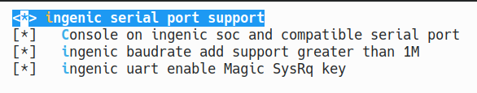

# UART serial port

## Module Function Introduction

Universal Asynchronous Receiver/Transmitter (UART) serial port. There are four UARTs: All UARTs use the same programming model. Each serial port can operate in interrupt-based mode or DMA-based mode. The Universal Asynchronous Receiver/Transmitter (UART) is compatible with 16550 industry standards and can be used as a slow infrared asynchronous interface that conforms to the Infrared Data Association (IrDA) serial infrared specification 1.1.

## Drive source code location

Location of driver source code:

***module_drivers/drivers/tty/serial/ingenic_uart.h***

***module_drivers/drivers/tty/serial/ingenic_uart.c***

## Device tree configuration

Location of device tree:

***module_drivers/dts/x2600.dtsi***

UART controller description:

```c
uart0: serial@0x10030000 {

    compatible = "ingenic,8250-uart";

    reg = <0x10030000 0x100>;

    reg-shift = <2>;

    interrupt-parent = <&core_intc>;

    interrupts = <IRQ_UART0>;

    status = "disabled";

    dmas = <&pdma INGENIC_DMA_TYPE(INGENIC_DMA_REQ_UART0_TX)>,

    <&pdma INGENIC_DMA_TYPE(INGENIC_DMA_REQ_UART0_RX)>;

    dma-names = "tx", "rx";

    #address-cells = <1>;

    #size-cells = <0>;

};

uart1: serial@0x10031000 {

    compatible = "ingenic,8250-uart";

    reg = <0x10031000 0x100>;

    reg-shift = <2>;

    interrupt-parent = <&core_intc>;

    interrupts = <IRQ_UART1>;

    status = "disabled";

    dmas = <&pdma INGENIC_DMA_TYPE(INGENIC_DMA_REQ_UART1_TX)>,

    <&pdma INGENIC_DMA_TYPE(INGENIC_DMA_REQ_UART1_RX)>;

    dma-names = "tx", "rx";

};

uart2: serial@0x10032000 {

    compatible = "ingenic,8250-uart";

    reg = <0x10032000 0x100>;

    reg-shift = <2>;

    interrupt-parent = <&core_intc>;

    interrupts = <IRQ_UART2>;

    status = "disabled";

    dmas = <&pdma INGENIC_DMA_TYPE(INGENIC_DMA_REQ_UART2_TX)>,

    <&pdma INGENIC_DMA_TYPE(INGENIC_DMA_REQ_UART2_RX)>;

    dma-names = "tx", "rx";

};

uart3: serial@0x10033000 {

    compatible = "ingenic,8250-uart";

    reg = <0x10033000 0x100>;

    reg-shift = <2>;

    interrupt-parent = <&core_intc>;

    interrupts = <IRQ_UART3>;

    status = "disabled";

    dmas = <&pdma INGENIC_DMA_TYPE(INGENIC_DMA_REQ_UART3_TX)>,

    <&pdma INGENIC_DMA_TYPE(INGENIC_DMA_REQ_UART3_RX)>;

    dma-names = "tx", "rx";

};

uart4: serial@0x10034000 {

    compatible = "ingenic,8250-uart";

    reg = <0x10034000 0x100>;

    reg-shift = <2>;

    interrupt-parent = <&core_intc>;

    interrupts = <IRQ_UART4>;

    status = "disabled";

    dmas = <&pdma INGENIC_DMA_TYPE(INGENIC_DMA_REQ_UART4_TX)>,

    <&pdma INGENIC_DMA_TYPE(INGENIC_DMA_REQ_UART4_RX)>;

    dma-names = "tx", "rx";

};

uart5: serial@0x10035000 {

    compatible = "ingenic,8250-uart";

    reg = <0x10035000 0x100>;

    reg-shift = <2>;

    interrupt-parent = <&core_intc>;

    interrupts = <IRQ_UART5>;

    status = "disabled";

    dmas = <&pdma INGENIC_DMA_TYPE(INGENIC_DMA_REQ_UART5_TX)>,

    <&pdma INGENIC_DMA_TYPE(INGENIC_DMA_REQ_UART5_RX)>;

    dma-names = "tx", "rx";

};

uart6: serial@0x10036000 {

    compatible = "ingenic,8250-uart";

    reg = <0x10036000 0x100>;

    reg-shift = <2>;

    interrupt-parent = <&core_intc>;

    interrupts = <IRQ_UART6>;

    status = "disabled";

    dmas = <&pdma INGENIC_DMA_TYPE(INGENIC_DMA_REQ_UART6_TX)>,

    <&pdma INGENIC_DMA_TYPE(INGENIC_DMA_REQ_UART6_RX)>;

    dma-names = "tx", "rx";

};

uart7: serial@0x10037000 {

    compatible = "ingenic,8250-uart";

    reg = <0x10037000 0x100>;

    reg-shift = <2>;

    interrupt-parent = <&core_intc>;

    interrupts = <IRQ_UART7>;

    status = "disabled";

    dmas = <&pdma INGENIC_DMA_TYPE(INGENIC_DMA_REQ_UART7_TX)>,

    <&pdma INGENIC_DMA_TYPE(INGENIC_DMA_REQ_UART7_RX)>;

    dma-names = "tx", "rx";

};
```

### Default configuration of device tree

In the board-level device tree, the default compilation will produce uart0 and uart1 devices. The descriptions are as follows:

```c
&uart0 {

    status = "okay";

    pinctrl-names = "default";

    pinctrl-0 = <&uart0_pe>;

};

&uart1 {

    status = "okay";

    pinctrl-names = "default";

    pinctrl-0 = <&uart1_pc>;

};
```

### Device tree custom configuration

Users can open or close a serial port device according to actual needs.

## Kernel compilation configuration

The kernel configuration for SERIAL_INGENIC_UART is as follows:

```
CONFIG_SERIAL_INGENIC_UART:

 If you have a machine based on a xbrust mips soc you can

 enable its onboard serial port by enabling this option.

 Symbol: SERIAL_INGENIC_UART [=y]

 Type : tristate

 Defined at module_drivers/drivers/tty/serial/Kconfig

 Prompt: ingenic serial port support

 Location:

 -> Ingenic device-drivers Configurations

 -> [UART] Drivers

 Selects: SERIAL_CORE [=y]
```

### Default compile configuration of kernel

The kernel defaults to configuring UART drivers, and the configuration interface is as follows:



### Kernel custom compile configuration

Users can remove the configuration of this driver according to actual needs.

## Kernel version differences

## Device Node Generation

After the driver is loaded successfully, a corresponding device node will be generated:

```
# ls /dev/ttyS*

ttyS0 ttyS1
```
