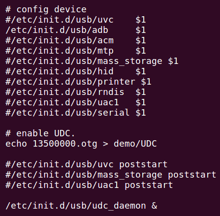

# USB OTG Controller Interface

## Module Function Introduction

The Universal Serial Bus (USB) is an emerging and gradually replacing other interface standards for data communication. It was jointly formulated by computer companies such as Intel, Compaq, Digital, IBM, Microsoft, NEC and Northern Telecom in 1995, and has gradually formed industry standards.

USB bus as a high-speed serial bus, its high transmission speed can meet the application environment requirements of high-speed data transmission, and the bus also has the advantages of simple power supply (bus power supply), convenient installation and configuration (support plug and play and hot plug), simple expansion port (through the hub can expand up to 127 peripherals), diversified transmission mode (4 transmission modes), and the advantages of good compatibility (backward compatibility after product upgrade).

The USB OTG controller enables serial data exchange between a USB host and multiple portable peripheral devices that can be accessed simultaneously.

The x26xx series chip has two USB controllers and supports USB functions.

## Drive source code location

Location of driver source code:

***drivers/usb/dwc2***

```
├── core.c
├── core.h
├── core_intr.c
├── debugfs.c
├── debug.h
├── gadget.c
├── hcd.c
├── hcd_ddma.c
├── hcd.h
├── hcd_intr.c
├── hcd_queue.c
├── hw.h
├── Kconfig
├── Makefile
├── pci.c
├── platform.c
```

## Device tree configuration

Location of device tree:

***module_driver/dts/x2600.dtsi***

Device tree description:

otg Controller Configuration:

```c
otg: otg@0x13500000 {
    compatible = "ingenic,x2600-dwc2-hsotg";
    reg = <0x13500000 0x40000>;
    interrupt-parent = <&core_intc>;
    interrupts = <IRQ_OTG>;
    clocks = <&clock CLK_GATE_OTG>;
    clock-names = "gate_otg";
    ingenic,usbphy=<&otg_phy>;

    g-rx-fifo-size = <1096>;
    g-np-tx-fifo-size = <512>;
    g-tx-fifo-size = <16 16 16 128 256 256 512 768>;
    status = "okay";
#ifdef CONFIG_USB_DWC2_EXT_ID_PIN
    external-id-pin;
#endif
#ifdef CONFIG_USB_DWC2_FORCE_FULL_SPEED
    force-full-speed;
#endif
};

usb: usb@0x13540000 {
    compatible = "ingenic,x2600-dwc2-hsotg";
    reg = <0x13540000 0x40000>;
    interrupt-parent = <&core_intc>;
    interrupts = <IRQ_USB>;
    clocks = <&clock CLK_GATE_USB>;
    clock-names = "gate_usb";
    ingenic,usbphy=<&usb_phy>;
    g-rx-fifo-size = <1096>;
    g-np-tx-fifo-size = <512>;
    g-tx-fifo-size = <16 16 16 128 256 256 512 768>;
    dr_mode = "host";
    status = "okay";
};
```

phy Controller Configuration:

```c
otg_phy: otg_phy {
    #address-cells = <1>;
    #size-cells = <1>;
    compatible = "ingenic,usbphy0-x2600";
    reg = <0x10000000 0x1000 0x10078000 0x1000  0x13500000 0x40000>;
#ifdef CONFIG_USB_DWC2_EXT_VBUS_DETECT
    external-vbus-detect;
#endif
};

usb_phy: usb_phy {
    #address-cells = <1>;
    #size-cells = <1>;
    compatible = "ingenic,usbphy1-x2600";
    reg = <0x10000000 0x1000 0x10078400 0x1000>;
    external-vbus-detect;
    disable-sw-switch-id;
};
```

### Device Tree Configuration Description

|  |  |  |  |  |  |
| --- | --- | --- | --- | --- | ---
| Pathway Configuration | Controller Name | Controller address | Phy name | Phy address | Function |
| Pathway One |otg |0x13500000 |otg_phy |0x10078000 |General usb function, support otg function. |
| Pathway Two |usb |0x13540000 |usb_phy |0x10078400 |General USB function |

### Default configuration of device tree

The default compiled device tree will generate otg and otg_phy devices, for example configured as follows in x2660_halley.dts:

```c
&otg {

    dr_mode = "otg"; // host,peripheral,otg

    device-using-dma = <1>;

    status = "okay";

};

&usb {

    dr_mode = "host"; // host,peripheral,otg

    device-using-dma = <1>;

    status = "okay";

};

&otg_phy {

    status = "okay";

};

&usb_phy {

    status = "okay";

};
```

### Device tree custom configuration

Users can close this node according to their actual needs, or configure as follows:

|  |  |
| --- | --- |
| **Property name** | **Explanation** |
| ingenic,id-dete-gpio | Configure USB for detecting ID changes on GPIO. |
| ingenic,vbus-dete-gpio | Configure USB for plug and play GPIO detection. |
| Ingenic,drvvbus-gpio | Configure USB for GPIO control of VBUS |

## Kernel compilation configuration

Different configurations need to be selected according to different functions of USB. The USB composite function can support multiple device functions at the same time.

USB as host:

|  |  |
| --- | --- |
| **Support functions** | **Explanation** |
| **mass storage** | As a host, it can identify large-capacity storage devices. |
| **usb camera** | As a host, it can identify USB camera devices. |
| **hid** | As a host, it can recognize human-computer interaction devices such as mice.. |
| **cdrom** | As a host, it can identify CD-ROM drive devices. |

USB as a device:

|  |  |
| --- | --- |
| **Support functions** | **Explanation** |
| **mass storage** | USB as a large-capacity storage device |
| **adb (Android Debug Bridge)** | Used for USB debug debugging function |
| **hid** | USB as a human-computer interaction device such as mouse and keyboard |
| **uvc (USB Video Class)** | USB as a video device |
| **uac1.0 (USB Audio Class 1.0)** | usb as audio class device |
| **printer** | usb as a printer device |
| **rndis** | usb as a network card device |
| **serial** | USB as a serial device. |

### Default compile configuration of kernel

USB host supports mass storage, usb camera, hid, rndis and cdrom by default.

USB device composite supports mass storage, adb, hid, uvc, rndis, printer, uac1.0 and mtp at the same time by default.

Table 1 USB Host Function Support Status

|  |  |  |  |
| --- | --- | --- | --- |
| Function type | Is kernel-4.4.94-deconfig a default configuration? | Is kernel-5.10-defconfig a default configuration? | Does X26xx halley board support this function |
| Mass storage | YES | YES | YES |
| Usb camera | YES | YES | YES |
| hid | YES | YES | YES |
| rndis | YES | YES | YES |
| cdrom | YES | YES | YES |

Table 2 USB Device Function Support Status

|  |  |  |  |
| --- | --- | --- | --- |
| Function type | Is kernel-4.4.94-defconfig a default configuration? | Is kernel-5.10-defconfig a default configuration? | Does X26xxhalley board support this function |
| Mass storage | YES | YES | YES |
| adb | YES | YES | YES |
| hid | YES | YES | YES |
| uvc | NO | NO | NO |
| rndis | YES | YES | YES |
| printer | YES | YES | YES |
| Uac1.0 | YES | YES | YES |
| mtp | YES | YES | YES |
| cdrom | NO | NO | NO |

### Kernel custom compile configuration

#### USB controller mode configuration

You can configure the USB controller to host only, device only, or otg mode through kernel configuration or device tree. The configuration method is as follows:

Set USB controller to host-only mode through kernel configuration:

```
Symbol: USB_DWC2_HOST [=n]

Type : boolean

Prompt: Host only mode

Location:

 -> Device Drivers

 -> USB support (USB_SUPPORT [=y])

 -> DesignWare USB2 DRD Core Support (USB_DWC2 [=y])

 -> DWC2 Mode Selection (<choice> [=y])

Defined at drivers/usb/dwc2/Kconfig:24

Depends on: <choice> && (USB [=y]=y || USB_DWC2 [=y]=m && USB [=y]
```

Set USB controller to device-only mode through kernel configuration:

```
Symbol: USB_DWC2_PERIPHERAL [=n]

Type : boolean

Prompt: Gadget only mode

Location:

 -> Device Drivers

 -> USB support (USB_SUPPORT [=y])

 -> DesignWare USB2 DRD Core Support (USB_DWC2 [=y])

 -> DWC2 Mode Selection (<choice> [=y])

Defined at drivers/usb/dwc2/Kconfig:34

Depends on: <choice> && (USB_GADGET [=y]=y || USB_GADGET [=y]=USB_DWC2 [=y])
```

Set USB controller to otg mode through kernel configuration:

```
Symbol: USB_DWC2_DUAL_ROLE [=y]

Type : boolean

Prompt: Dual Role mode

Location:

 -> Device Drivers

 -> USB support (USB_SUPPORT [=y])

 -> DesignWare USB2 DRD Core Support (USB_DWC2 [=y])

 -> DWC2 Mode Selection (<choice> [=y])

Defined at drivers/usb/dwc2/Kconfig:43

Depends on: <choice> && (USB [=y]=y && USB_GADGET [=y]=y || USB_DWC2 [=y]=m && USB [=y] && USB_GADGET [=y]
```

Or configure USB controller mode in device tree, for example x2660_halley_v1.0.dts:

Configuration of x2660_halley_v1.0.dts in kernel-4.4.94:

 &otg {

    dr_mode = "otg"; // host,peripheral,otg

    device-using-dma = <1>;

    status = "okay";

};

&usb {

    dr_mode = "host"; // host,peripheral,otg

    device-using-dma = <1>;

    status = "okay";

};

#### USB host kernel configuration

##### USB host Mass Storage

(1) VFAT (Windows-95) fs support

```
Symbol: VFAT_FS [=y]

Type : tristate

Prompt: VFAT (Windows-95) fs support

Location:

-> File systems

-> DOS/FAT/NT Filesystems

Defined at fs/fat/Kconfig:60

Depends on: BLOCK [=y]

Selects: FAT_FS [=y]
```

(2) Codepage 437 (United States, Canada)

```
Symbol: NLS_CODEPAGE_437 [=y]

Type : tristate

Prompt: Codepage 437 (United States, Canada)

Location:

-> File systems

-> Native language support (NLS [=y])

Defined at fs/nls/Kconfig:39

Depends on: NLS [=y]
```

(3) NLS ISO 8859-1 (Latin 1; Western European Languages)

```
Symbol: NLS_ISO8859_1 [=y]

Type : tristate

Prompt: NLS ISO 8859-1 (Latin 1; Western European Languages)

Location:

-> File systems

-> Native language support (NLS [=y])

Defined at fs/nls/Kconfig:318

Depends on: NLS [=y]
```

(4) SCSI disk support

```
Symbol: BLK_DEV_SD [=y]

Type : tristate

Prompt: SCSI disk support

Location:

-> Device Drivers

-> SCSI device support

Defined at drivers/scsi/Kconfig:73

Depends on: SCSI [=y]
```

(5) USB Mass Storage support

```
Symbol: USB_STORAGE [=y]

Type : tristate

Prompt: USB Mass Storage support

Location:

-> Device Drivers

-> USB support (USB_SUPPORT [=y])

-> Support for Host-side USB (USB [=y])

Defined at drivers/usb/storage/Kconfig:8

Depends on: USB_SUPPORT [=y] && USB [=y] && SCSI [=y]
```

##### USB host camera

```
Symbol: USB_VIDEO_CLASS [=y]

Type : tristate

Prompt: USB Video Class (UVC)

Location:

-> Device Drivers

-> Multimedia support (MEDIA_SUPPORT [=y])

-> Media USB Adapters (MEDIA_USB_SUPPORT [=y])

Defined at drivers/media/usb/uvc/Kconfig:1

Depends on: USB [=y] && MEDIA_SUPPORT [=y] && MEDIA_USB_SUPPORT [=y] && MEDIA_CAMERA_SUPPORT [=y] && VIDEO_V4L2 [=y]

Selects: VIDEOBUF2_VMALLOC [=n]
```

##### USB host hid mouse

(1) USB HIDBP Mouse (simple Boot) support

```
Symbol: USB_MOUSE [=y]

Type : tristate

Prompt: USB HIDBP Mouse (simple Boot) support

Location:

-> Device Drivers

-> HID support

-> USB HID support

-> USB HID Boot Protocol module_drivers/drivers

Defined at drivers/hid/usbhid/Kconfig:66

Depends on: USB_HID [=n]! =y && EXPERT [=y] && USB [=y] && INPUT [=y]
```

(2) Mouse interface

```
Symbol: INPUT_MOUSEDEV [=y]

Type: tristate

Prompt: Mouse interface

Location:

-> Device Drivers

-> Input device support

-> Generic input layer (needed for keyboard, mouse, ...) (INPUT [=y])

Defined at drivers/input/Kconfig:95

Depends on: !UML && INPUT [=y]
```

##### USB host rndis

(1) USB Network Adapters

```
Symbol: USB_USBNET [=y]

Type : tristate

Prompt: Multi-purpose USB Networking Framework

Location:

-> Device Drivers

-> Network device support (NETDEVICES [=y])

-> USB Network Adapters (USB_NET_DRIVERS [=y])

Defined at drivers/net/usb/Kconfig:121

Depends on: NETDEVICES [=y] && USB_NET_DRIVERS [=y]

Selects: MII [=y]

Selected by: USB_NET_RNDIS_WLAN [=n] && NETDEVICES [=y] && WLAN [=y] && USB [=y] && CFG80211 [=y]
```

(2) Multi-purpose USB Networking Framework

```
Symbol: USB_NET_RNDIS_HOST [=y]
Type : tristate
Defined at drivers/net/usb/Kconfig:398
Prompt: Host for RNDIS and ActiveSync devices
Depends on: NETDEVICES [=y] && USB_NET_DRIVERS [=y] && USB_USBNET [=y]
Location:
-> Device Drivers
-> Network device support (NETDEVICES [=y])
-> USB Network Adapters (USB_NET_DRIVERS [=y])
-> Multi-purpose USB Networking Framework (USB_USBNET [=y])
Selects: USB_NET_CDCETHER [=y]
Selected by [n]:
-USB_NET_RNDIS_WLAN [=n] && NETDEVICES [=y] && WLAN [=n] && USB [=y] && CFG80211 [=y]
```

##### USB host cdrom

(1) ISO 9660 CD-ROM file system support.

```
Symbol: ISO9660_FS [=y]

Type : tristate

Prompt: ISO 9660 CDROM file system support

Location:

-> File systems

(1)-> CD-ROM/DVD Filesystems

Defined at fs/isofs/Kconfig:1

Depends on: BLOCK [=y]
```

(2) Microsoft Joliet CDROM extensions

```
Symbol: JOLIET [=y]

Type : boolean

Prompt: Microsoft Joliet CDROM extensions

Location:

-> File systems

-> CD-ROM/DVD Filesystems

-> ISO 9660 CDROM file system support (ISO9660_FS [=y])

Defined at fs/isofs/Kconfig:17

Depends on: BLOCK [=y] && ISO9660_FS [=y]

Selects: NLS [=y]
```

(3) SCSI CDROM support

```
Symbol: BLK_DEV_SR [=y]

Type : tristate

Prompt: SCSI CDROM support

Location:

-> Device Drivers

(1)-> SCSI device support

Defined at drivers/scsi/Kconfig:129

Depends on: SCSI [=y]
```

(4) SCSI generic support

```
Symbol: CHR_DEV_SG [=y]

Type : tristate

Prompt: SCSI generic support

Location:

-> Device Drivers

(1)-> SCSI device support

Defined at drivers/scsi/Kconfig:152

Depends on: SCSI [=y]
```

#### USB gadget kernel configuration

##### USB device mass storage

```
Symbol: USB_CONFIGFS_MASS_STORAGE [=y]

Type : boolean

Prompt: Mass storage

Location:

-> Device Drivers

-> USB support (USB_SUPPORT [=y])

-> USB Gadget Support (USB_GADGET [=y])

-> USB Gadget Drivers (<choice> [=y])

-> USB functions configurable through configfs (USB_CONFIGFS [=y])

Defined at drivers/usb/gadget/Kconfig:338

Depends on: <choice> && USB_CONFIGFS [=y] && BLOCK [=y]

Selects: USB_F_MASS_STORAGE [=y]
```

##### USB device adb

```
Symbol: USB_CONFIGFS_F_FS [=y]

Type : boolean

Prompt: Function filesystem (FunctionFS)

Location:

-> Device Drivers

-> USB support (USB_SUPPORT [=y])

-> USB Gadget Support (USB_GADGET [=y])

-> USB Gadget Drivers (<choice> [=y])

-> USB functions configurable through configfs (USB_CONFIGFS [=y])

Defined at drivers/usb/gadget/Kconfig:362

Depends on: <choice> && USB_CONFIGFS [=y]

Selects: USB_F_FS [=y]
```

##### USB device hid

```
Symbol: USB_CONFIGFS_F_HID [=y]

Type : boolean

Prompt: HID function

Location:

-> Device Drivers

-> USB support (USB_SUPPORT [=y])

-> USB Gadget Support (USB_GADGET [=y])

-> USB Gadget Drivers (<choice> [=y])

-> USB functions configurable through configfs (USB_CONFIGFS [=y])

Defined at drivers/usb/gadget/Kconfig:419

Depends on: <choice> && USB_CONFIGFS [=y]

Selects: USB_F_HID [=n]
```

#####  USB device ncm

Symbol: USB_CONFIGFS_NCM [=y]

Type  : bool

Defined at drivers/usb/gadget/Kconfig:279

Prompt: Network Control Model (CDC NCM)

Depends on: USB_SUPPORT [=y] && USB_GADGET [=y] && USB_CONFIGFS [=y] && NET [=y]

Location:

-> Device Drivers

-> USB support (USB_SUPPORT [=y])

-> USB Gadget Support (USB_GADGET [=y])

-> USB Gadget functions configurable through configfs (USB_CONFIGFS [=y])

Selects: USB_U_ETHER [=y] && USB_F_NCM [=n] && CRC32 [=y]

##### USB device remote NDIS

```
Symbol: USB_CONFIGFS_RNDIS [=y]

Type : boolean

Prompt: RNDIS

Location:

-> Device Drivers

-> USB support (USB_SUPPORT [=y])

-> USB Gadget Support (USB_GADGET [=y])

-> USB Gadget Drivers (<choice> [=y])

-> USB functions configurable through configfs (USB_CONFIGFS [=y])

Defined at drivers/usb/gadget/Kconfig:297

Depends on: <choice> && USB_CONFIGFS [=y] && NET [=y]

Selects: USB_U_ETHER [=n] && USB_F_RNDIS [=n]
```

##### USB device serial

(1) Generic serial bulk in/out

```
Symbol: USB_CONFIGFS_SERIAL [=y]

Type : boolean

Prompt: Generic serial bulk in/out

Location:

-> Device Drivers

-> USB support (USB_SUPPORT [=y])

-> USB Gadget Support (USB_GADGET [=y])

-> USB Gadget Drivers (<choice> [=y])

-> USB functions configurable through configfs (USB_CONFIGFS [=y])

Defined at drivers/usb/gadget/Kconfig:241

Depends on: <choice> && USB_CONFIGFS [=y] && TTY [=y]

Selects: USB_U_SERIAL [=n] && USB_F_SERIAL [=n]
```

(2) Abstract Control Model (CDC ACM)

```
Symbol: USB_CONFIGFS_ACM [=y]

Type : boolean

Prompt: Abstract Control Model (CDC ACM)

Location:

-> Device Drivers

-> USB support (USB_SUPPORT [=y])

-> USB Gadget Support (USB_GADGET [=y])

-> USB Gadget Drivers (<choice> [=y])

-> USB functions configurable through configfs (USB_CONFIGFS [=y])

Defined at drivers/usb/gadget/Kconfig:250

Depends on: <choice> && USB_CONFIGFS [=y] && TTY [=y]

Selects: USB_U_SERIAL [=n] && USB_F_ACM [=n]
```

(3) Object Exchange Model (CDC OBEX)

```
Symbol: USB_CONFIGFS_OBEX [=y]

Type : boolean

Prompt: Object Exchange Model (CDC OBEX)

Location:

-> Device Drivers

-> USB support (USB_SUPPORT [=y])

-> USB Gadget Support (USB_GADGET [=y])

-> USB Gadget Drivers (<choice> [=y])

-> USB functions configurable through configfs (USB_CONFIGFS [=y])

Defined at drivers/usb/gadget/Kconfig:260

Depends on: <choice> && USB_CONFIGFS [=y] && TTY [=y]

Selects: USB_U_SERIAL [=n] && USB_F_OBEX [=n]
```

##### USB device printer

```
Symbol: USB_CONFIGFS_F_PRINTER [=y]

Type : boolean

Prompt: Printer function

Location:

-> Device Drivers

-> USB support (USB_SUPPORT [=y])

-> USB Gadget Support (USB_GADGET [=y])

-> USB Gadget Drivers (<choice> [=y])

-> USB functions configurable through configfs (USB_CONFIGFS [=y])

Defined at drivers/usb/gadget/Kconfig:469

Depends on: <choice> && USB_CONFIGFS [=y]

Selects: USB_F_PRINTER [=y]
```

##### USB device uac1.0

```
Symbol: USB_CONFIGFS_F_UAC1 [=y]

Type : boolean

Prompt: Audio Class 1.0

Location:

-> Device Drivers

-> USB support (USB_SUPPORT [=y])

-> USB Gadget Support (USB_GADGET [=y])

-> USB Gadget Drivers (<choice> [=y])

-> USB functions configurable through configfs (USB_CONFIGFS [=y])

Defined at drivers/usb/gadget/Kconfig:402

Depends on: <choice> && USB_CONFIGFS [=y] && SND [=y]

Selects: USB_LIBCOMPOSITE [=y] && SND_PCM [=y] && USB_F_UAC1 [=y]
```

#### USB legacy kernel configuration

##### USB device serial

Symbol: USB_G_SERIAL [=y]

Type : tristate

Prompt: Serial Gadget (with CDC ACM and CDC OBEX support)

Location:

-> Device Drivers

-> USB support (USB_SUPPORT [=y])

-> USB Gadget Support (USB_GADGET [=y])

-> USB Gadget Drivers (<choice> [=y])

Defined at drivers/usb/gadget/legacy/Kconfig:260

Depends on: <choice> && TTY [=y]

Selects: USB_U_SERIAL [=y] && USB_F_ACM [=y] && USB_F_SERIAL [=y] && USB_F_OBEX [=y] && USB_LIBCOMPOSITE [=y]

##### **USB device uvc**

```
Symbol: USB_G_WEBCAM [=y]

Type : tristate

Prompt: USB Webcam Gadget

Location:

-> Device Drivers

-> USB support (USB_SUPPORT [=y])

-> USB Gadget Support (USB_GADGET [=y])

-> USB Gadget Drivers (<choice> [=y])

Defined at drivers/usb/gadget/legacy/Kconfig:471

Depends on: <choice> && VIDEO_DEV [=y]

Selects: USB_LIBCOMPOSITE [=y] && VIDEOBUF2_VMALLOC [=y] && USB_F_UVC [=y] && USB_DWC2_HIGHWIDTH_FIFO [=y]
```

#### USB Gadget Descriptor Configuration

hid and serial do not support composite devices, so you need to manually modify the configuration.

The USB composite and related function descriptor configuration path is as follows:

development/usb-gadget/usb-gadget-scripts/

```
 └── usb
    ├── acm
    ├── adb
    ├── keyboard
    ├── mass_storage
    ├── mouse
    ├── mtp
    ├── mtp_daemon
    ├── printer
    ├── rndis
    ├── serial
    ├── uac1
    ├── udc_daemon
    ├── usb_wakeup
    └── uvc
```

## Application Instructions

### USB host

#### USB host Mass Storage

1. Insert U disk and pop up print information

```
[46.070034] usb 1-1: new high-speed USB device number 2 using dwc2

[46.296250] usb 1-1: New USB device found, idVendor=0951, idProduct=1666

[46.303202] usb 1-1: New USB device strings: Mfr=1, Product=2, SerialNumber=3

[46.310592] usb 1-1: Product: DataTraveler 3.0

[46.315185] usb 1-1: Manufacturer: Kingston

[46.319508] usb 1-1: SerialNumber: 60A44C413C4EB211A98A00A0

[46.325821] usb-storage 1-1:1.0: USB Mass Storage device detected

[46.342363] scsi host0: usb-storage 1-1:1.0

[47.726378] scsi 0:0:0:0: Direct-Access Kingston DataTraveler 3.0 PMAP PQ: 0 ANSI: 6

[47.736215] sd 0:0:0:0: [sda] 30277632 512-byte logical blocks: (15.5 GB/14.4 GiB)

[47.752538] sd 0:0:0:0: [sda] Write Protect is off

[47.759990] sd 0:0:0:0: [sda] No Caching mode page found

[47.765648] sd 0:0:0:0: [sda] Assuming drive cache: write through

[47.780215] sda: sda1

[47.789136] sd 0:0:0:0: [sda] Attached SCSI removable disk
```

2. Mounting a USB drive to a file system

```
# mount -t vfat /dev/sda1 mnt/
```

3. Enter /mnt to interact with data

#### USB host camera

1. Camera inserted and recognized successfully

```
[56.560037] usb 1-1: new high-speed USB device number 2 using dwc2

[56.910300] usb 1-1: New USB device found, idVendor=058f, idProduct=5608

[56.917231] usb 1-1: New USB device strings: Mfr=3, Product=1, SerialNumber=0

[56.924635] usb 1-1: Product: USB 2.0 Camera

[56.929114] usb 1-1: Manufacturer: Alcor Micro, Corp.

[56.939481] uvcvideo: Found UVC 1.00 device USB 2.0 Camera (058f:5608)

[56.949251] input: USB 2.0 Camera as /devices/platform/ahb2/13500000.otg/usb1/1-1/1-1:1.0/input/input0
```

2. Photo test

```
usage: uvcview [-d <device>] [-c <count>]

--help -H print this message

--print_formats -F print video device info

--device -d , video device, default is /dev/video0

--width -w grab width

--height -h grab height

--count -c set the count to grab

--rate -r frame sample rate(fps)

--yuv -y use yuyv input format

--timeout -t select timeout

--match -m do picture match test

--perf -p do performance test
```

**Note:**/dev/vidio5 is a standard video node generated by usb camera.

```
# ./grab -w 640 -h 480 -d /dev/video5 -y -c 3
```

3. Generate an image

```
p-0.jpg　p-１.jpg　p-２.jpg
```

#### USB host hid mouse

1. Insert mouse device to controller

```
[23.240032] usb 1-1: new low-speed USB device number 2 using dwc2

[23.453954] usb 1-1: New USB device found, idVendor=046d, idProduct=c077

[23.460890] usb 1-1: New USB device strings: Mfr=1, Product=2, SerialNumber=0

[23.468252] usb 1-1: Product: USB Optical Mouse

[23.473168] usb 1-1: Manufacturer: Logitech

[23.483619] input: Logitech USB Optical Mouse as /devices/platform/ahb2/13500000.otg/usb1/1-1/1-1:1.0/0003:046D:C077.0001/input/input2

[23.499237] hid-generic 0003:046D:C077.0001: input,hidraw0: USB HID v1.11 Mouse [Logitech USB Optical Mouse] on usb-13500000.otg-1/input0
```

1. Move mouse to trigger event after executing capture event procedure

```
# cd /testsuite/usb_test/usb_host/getevent_test/

# ./getevent_test 0

/dev/input/mouse0

evdev version: 0.0.0

name:

features: relative reserved unknown unknown unknown unknown unknown unknown unknown

/dev/input/mouse0: open, fd = 3

Sun Mar 1 16:38:18 2020.000000 type 0x0011; code 0x000e; value 0x00000000; Led

[125.626285] random: nonblocking pool is initialized

Wed Dec 25 06:26:16 2019.000000 type 0x0011; code 0x000e; value 0x00000000; Led

Thu Dec 26 00:59:52 2019.000000 type 0x0011; code 0x000e; value 0x00000000; Led

Mon Dec 23 18:27:20 2019.000000 type 0x0011; code 0x000e; value 0x00000000; Led

Thu Dec 26 00:55:36 2019.000000 type 0x0011; code 0x000e; value 0x00000000; Led

Wed Dec 25 06:47:36 2019.000000 type 0x0011; code 0x000e; value 0x00000000; Led

Tue Dec 24 12:31:04 2019.000000 type 0x0011; code 0x000e; value 0x00000000; Led

Wed Dec 25 06:47:36 2019.000000 type 0x0011; code 0x000e; value 0x00000000; Led

Mon Dec 23 18:10:16 2019.000000 type 0x0011; code 0x000e; value 0x00000000; Led

....

....

....
```

#### USB host rndis

1. Insert USB network card device to controller

```
[1843.410034] usb 2-1: new high-speed USB device number 5 using dwc2

[1843.620356] usb 2-1: New USB device found, idVendor=1a40, idProduct=0101

[1843.627288] usb 2-1: New USB device strings: Mfr=0, Product=1, SerialNumber=0

[1843.634689] usb 2-1: Product: USB2.0 HUB

[1843.639454] hub 2-1:1.0: USB hub found

[1843.646003] hub 2-1:1.0: 4 ports detected

[1844.040036] usb 2-1.3: new high-speed USB device number 6 using dwc2

[1844.141426] usb 2-1.3: New USB device found, idVendor=0fe6, idProduct=9900

[1844.148538] usb 2-1.3: New USB device strings: Mfr=1, Product=2, SerialNumber=3

[1844.156122] usb 2-1.3: Product: USB 10/100 LAN

[1844.160740] usb 2-1.3: Manufacturer: CoreChips

[1844.165333] usb 2-1.3: SerialNumber: 00E099059B46

[1844.172548] cdc_ether 2-1.3:2.0 eth0: register 'cdc_ether' at usb-13540000.usb-1.3, CDC Ethernet Device, 00:e0:99:05:9b:46
```

2. Check USB network card information on development board

```
# ifconfig -a

....

....

eth0 Link encap:Ethernet HWaddr 00:E0:99:05:9B:46

BROADCAST MULTICAST MTU:1500 Metric:1

RX packets:0 errors:0 dropped:0 overruns:0 frame:0

TX packets:0 errors:0 dropped:0 overruns:0 carrier:0

collisions:0 txqueuelen:1000

RX bytes:0 (0.0 B) TX bytes:0 (0.0 B)....

....
```

3. Configure USB network card IP on development board

```
# ifconfig usb0 192.168.4.251 up

eth0 Link encap:Ethernet HWaddr 00:0E:C6:FA:54:FA

inet addr:192.168.4.251 Bcast:192.168.4.255 Mask:255.255.255.0

inet6 addr: fe80::20e:c6ff:fefa:54fa/64 Scope:Link

UP BROADCAST RUNNING MULTICAST MTU:1500 Metric:1

RX packets:30 errors:0 dropped:0 overruns:0 frame:0

TX packets:34 errors:0 dropped:0 overruns:0 carrier:0

collisions:0 txqueuelen:1000

RX bytes:2926 (2.8 KiB) TX bytes:3356 (3.2 KiB)
```

4. Configure USB network card IP on PC

```
# sudo ifconfig eno1 192.168.4.252 up

eno1 Link encap: Ethernet Hardware Address 9c:8e:99:de:df:1e

inet Address: 192.168.4.252 Broadcast: 192.168.4.255 Mask: 255.255.255.0

UP BROADCAST RUNNING MULTICAST MTU:1500 Hop: 1

Received Packets: 1179470 Error: 7 Discards: 0 Overload: 0 Frames: 5

Send Packet: 276650 Error: 0 Drop: 0 Overload: 0 Carrier: 0

Collision: 0 Send Queue Length: 1000

Bytes received: 851127307 (851.1MB) Bytes sent: 38706156 (38.7MB)

Interruption: 20 Memory:fe500000-fe520000
```

5. Develop board-end test network card

```
# ping 192.168.4.252

PING 192.168.4.252 (192.168.4.252): 56 data bytes

64 bytes from 192.168.4.252: seq=0 ttl=64 time=0.538 ms

64 bytes from 192.168.4.252: seq=1 ttl=64 time=0.520 ms

64 bytes from 192.168.4.252: seq=2 ttl=64 time=0.571 ms

64 bytes from 192.168.4.252: seq=3 ttl=64 time=0.536 ms

....

....
```

6. Test network card on PC

```
# ping 192.168.4.251

PING 192.168.4.251 (192.168.4.251) 56(84) bytes of data.

64 bytes from 192.168.4.251: icmp_seq=1 ttl=64 time=0.728 ms

64 bytes from 192.168.4.251: icmp_seq=2 ttl=64 time=0.419 ms

64 bytes from 192.168.4.251: icmp_seq=3 ttl=64 time=0.421 ms

64 bytes from 192.168.4.251: icmp_seq=4 ttl=64 time=0.454 ms

64 bytes from 192.168.4.251: icmp_seq=5 ttl=64 time=0.426 ms

64 bytes from 192.168.4.251: icmp_seq=6 ttl=64 time=0.450 ms

64 bytes from 192.168.4.251: icmp_seq=7 ttl=64 time=0.449 ms

....

....
```

#### USB host cdrom

1. Insert USB optical drive device to controller

```
# [61192.659785] usb 2-1: new high-speed USB device number 3 using dwc2

[61192.864785] usb 2-1: New USB device found, idVendor=0e8d, idProduct=1887

[61192.871745] usb 2-1: New USB device strings: Mfr=1, Product=2, SerialNumber=3

[61192.879121] usb 2-1: Product: Portable Super Multi Drive

[61192.884866] usb 2-1: Manufacturer: Hitachi-LG Data Storage Inc

[61192.890926] usb 2-1: SerialNumber: K0SMAHC3451

[61192.901854] usb-storage 2-1:1.0: USB Mass Storage device detected

[61192.922011] scsi host1: usb-storage 2-1:1.0

[61193.927502] scsi 1:0:0:0: CD-ROM think plusUltraslimDVD 1.01 PQ: 0 ANSI: 0

[61193.959517] sr 1:0:0:0: [sr0] scsi3-mmc drive: 24x/24x writer dvd-ram cd/rw xa/form2 cdda tray

[61193.970802] sr 1:0:0:0: Attached scsi generic sg0 type 5
```

2. Mounting a CD-ROM drive to a file system

```
# mkdir /mnt/cdrom

# mount -t iso9660 -o ro /dev/sr0 /mnt/cdrom
```

3. Enter /mnt/cdrom and read data

### USB device

Enable USB Device Function

Open USB boot script

```
vi /etc/init.d/S90usb
```


Cancel Feature Annotation on Demand

#### USB device mass storage

1. Make a disk

```
# dd if=/dev/zero of=fat32.img bs=1k count=2048

# mkfs.vfat fat32.img
```

2. Associate the disk drive with the usb

```
# echo fat32.img > /sys/kernel/config/usb_gadget/demo/functions/mass_storage.0/lun.0/file
```

3. After completion, it will pop up a drive letter on PC and support hot plug

#### USB device adb

After it is started, you can directly start adb function without any configuration.

#### USB device uvc

1. pc end recognition device

```
$ dmesg

[2187560.274157] usb 2-1.5: new high-speed USB device number 19 using ehci-pci

[2187560.371029] usb 2-1.5: New USB device found, idVendor=18d1, idProduct=d002

[2187560.371033] usb 2-1.5: New USB device strings: Mfr=1, Product=2, SerialNumber=3

[2187560.371035] usb 2-1.5: Product: composite-demo

[2187560.371037] usb 2-1.5: Manufacturer: ingenic

[2187560.371039] usb 2-1.5: SerialNumber: 0123456789ABCDEF

[2187560.394857] uvcvideo: Found UVC 1.00 device composite-demo (18d1:d002)

[2187560.403005] input: composite-demo as /devices/pci0000:00/0000:00:1d.0/usb2/2-1/2-1.5/2-1.5:1.0/input/input141
```

2. The development board executes test programs

How to use webcam_gadget:

```
Usage: webcam_gadget [options]

Available options are

-b Use bulk mode

-d Do not use any real V4L2 capture device

-h Print this help screen and exit

-i images dir for [uvc-WxH.jpg uvc-WxH.yuv]

-m Streaming mult for ISOC (B /w 0 and 2)

-n Number of Video buffers (B /w 2 and 32)

-o <IO method> Select UVC IO method:

0 = MMAP

1 = USER_PTR

-s <speed> Select USB bus speed (B /w 0 and 2)

0 = Full Speed (FS)

1 = High Speed (HS)

2 = Super Speed (SS)

-t Streaming burst (B /w 0 and 15)

-u device UVC Video Output device

-v device V4L2 Video Capture device

-e device HELIX Video Capture device
```

Camera dynamic test:

example:

```
# ./webcam_gadget -u /dev/video12 -v /dev/video4 -e /dev/video0
```

PC-end testing tools:

linux os:

Video tools: xawtv

Video tools: cheese webcam booth

Windows OS:

Video tools: amcap

Mobile:

APP: usb webcam

**Note:*** Please use legacy configuration for Huawei mobile phones.

#### USB device hid

1. pc end recognition device

```
$ dmesg

[2180880.531376] usb 2-1.5: new high-speed USB device number 115 using ehci-pci

[2180880.628285] usb 2-1.5: New USB device found, idVendor=18d1, idProduct=d002

[2180880.628292] usb 2-1.5: New USB device strings: Mfr=1, Product=2, SerialNumber=3

[2180880.628304] usb 2-1.5: Product: composite-demo

[2180880.628307] usb 2-1.5: Manufacturer: ingenic

[2180880.628309] usb 2-1.5: SerialNumber: 0123456789ABCDEF

[2180880.635882] input: ingenic composite-demo as /devices/pci0000:00/0000:00:1d.0/usb2/2-1/2-1.5/2-1.5:1.0/0003:18D1:D002.006C/input/input126

[2180880.691853] hid-generic 0003:18D1:D002.006C: input,hidraw3: USB HID v1.01 Keyboard [ingenic composite-demo] on usb-0000:00:1d.0-1.5/input0
```

2. The development board executes test programs

```
# cd /testsuite/usb_test/usb_gadget/hid_gadget_test
```

simulate usb keyboard

```
# ./hid_gadget_test /dev/hidg0 keyboard
```

simulated usb mouse

```
# ./hid_gadget_test /dev/hidg1 mouse
```

#### USB device ncm

1. Host side recognizes the ncm device

* Host-side awareness device information:

```
 $ dmesg

[3441418.912760] usb 1-9: new high-speed USB device number 86 using xhci_hcd

[3441419.069204] usb 1-9: New USB device found, idVendor=18d1, idProduct=d002, bcdDevice= 1.00

[3441419.069209] usb 1-9: New USB device strings: Mfr=1, Product=2, SerialNumber=3

[3441419.069213] usb 1-9: Product: composite-demo

[3441419.069216] usb 1-9: Manufacturer: ingenic

[3441419.069219] usb 1-9: SerialNumber: 0123456789ABCDEF

[3441419.093626] cdc_ncm 1-9:1.0: MAC-Address: 3a:8d:bb:87:e8:f4

[3441419.094246] cdc_ncm 1-9:1.0 usb0: register 'cdc_ncm' at usb-0000:00:14.0-9, CDC NCM, 3a:8d:bb:87:e8:f4

[3441419.164108] cdc_ncm 1-9:1.0 enx3a8dbb87e8f4: renamed from usb0

[3441419.247977] cdc_ncm 1-9:1.0 enx3a8dbb87e8f4: 425 mbit/s downlink 425 mbit/s uplink
```

```
$ ifconfig -a

enx3a8dbb87e8f4: flags=4099<UP,BROADCAST,MULTICAST>  mtu 1500
        ether 3a:8d:bb:87:e8:f4  txqueuelen 1000  (以太网)
        RX packets 0  bytes 0 (0.0 B)
        RX errors 0  dropped 0  overruns 0  frame 0
        TX packets 0  bytes 0 (0.0 B)
        TX errors 0  dropped 0 overruns 0  carrier 0  collisions 0
```

2. Host-side configuration of usb network card device ip:

```
$ sudo ifconfig enx3a8dbb87e8f4 192.168.4.99 up
```

3. Configure the ip on the ncm device side:

```
$ sudo ifconfig usb0 192.168.4.100 up
```

4. Host-side ping device

```
$ ping 192.168.4.100

 PING 192.168.4.100 (192.168.4.100) 56(84) bytes of data.

 64 bytes from 192.168.4.100: icmp_seq=1 ttl=64 time=0.034 ms

 64 bytes from 192.168.4.100: icmp_seq=2 ttl=64 time=0.034 ms

 64 bytes from 192.168.4.100: icmp_seq=3 ttl=64 time=0.031 ms
```

5. device pinging host

```
$ ping 192.168.4.99

 PING 192.168.4.99 (192.168.4.99) 56(84) bytes of data.

 64 bytes from 192.168.4.99: icmp_seq=1 ttl=64 time=0.034 ms

 64 bytes from 192.168.4.99: icmp_seq=2 ttl=64 time=0.034 ms

 64 bytes from 192.168.4.99: icmp_seq=3 ttl=64 time=0.031 ms
```

#### USB device remote NDIS

1. Host side recognizes the rndis device

* Host-side awareness device information:

```
 $ dmesg

 识别信息：

 [2188325.480982] usb 2-1.5: new high-speed USB device number 21 using ehci-pci

 [2188325.577912] usb 2-1.5: New USB device found, idVendor=18d1, idProduct=d002

 [2188325.577919] usb 2-1.5: New USB device strings: Mfr=1, Product=2, SerialNumber=3

 [2188325.577930] usb 2-1.5: Product: composite-demo

 [2188325.577932] usb 2-1.5: Manufacturer: ingenic

 [2188325.577934] usb 2-1.5: SerialNumber: 0123456789ABCDEF

 [2188325.586180] rndis_host 2-1.5:1.0 usb0: register 'rndis_host' at usb-0000:00:1d.0-1.5, RNDIS device, 52:ea:19:19:5f:69

 [2188325.650205] rndis_host 2-1.5:1.0 enp0s29u1u5: renamed from usb0

 [2188325.670351] IPv6: ADDRCONF(NETDEV_UP): enp0s29u1u5: link is not ready
```

```
$ ifconfig -a

 enp0s29u1u5 Link encap:Ethernet HWaddr 52:ea:19:19:5f:69

 UP BROADCAST RUNNING MULTICAST MTU:1500 Metric:1

 RX packets:0 errors:0 dropped:0 overruns:0 frame:0

 TX packets:0 errors:0 dropped:0 overruns:0 carrier:0

 collisions:0 txqueuelen:1000

 RX bytes:0 (0.0 B) TX bytes:0 (0.0 B)
```

2. Host-side configuration of usb network card device ip:

```
$ sudo ifconfig enx3a8dbb87e8f4 192.168.4.99 up
```

3. Configure the ip on the ncm device side:

```
$ sudo ifconfig usb0 192.168.4.100 up
```

4. Host-side ping device

```
$ ping 192.168.4.100

 PING 192.168.4.100 (192.168.4.100) 56(84) bytes of data.

 64 bytes from 192.168.4.100: icmp_seq=1 ttl=64 time=0.034 ms

 64 bytes from 192.168.4.100: icmp_seq=2 ttl=64 time=0.034 ms

 64 bytes from 192.168.4.100: icmp_seq=3 ttl=64 time=0.031 ms
```

5. device pinging host

```
$ ping 192.168.4.99

 PING 192.168.4.99 (192.168.4.99) 56(84) bytes of data.

 64 bytes from 192.168.4.99: icmp_seq=1 ttl=64 time=0.034 ms

 64 bytes from 192.168.4.99: icmp_seq=2 ttl=64 time=0.034 ms

 64 bytes from 192.168.4.99: icmp_seq=3 ttl=64 time=0.031 ms
```


#### USB device serial

1. pc end recognition device

```
$ dmesg

Device information:

[263657.347638] usb 2-1.7: new high-speed USB device number 56 using ehci-pci

[263657.460495] usb 2-1.7: New USB device found, idVendor=18d1, idProduct=d002

[263657.460498] usb 2-1.7: New USB device strings: Mfr=1, Product=2, SerialNumber=3

[263657.460499] usb 2-1.7: Product: composite-demo

[263657.460500] usb 2-1.7: Manufacturer: ingenic

[263657.460501] usb 2-1.7: SerialNumber: img,x2660-halley-board

[263898.619118] usbserial_generic 2-1.7:1.0: The "generic" usb-serial driver is only for testing and one-off prototypes.

[263898.619121] usbserial_generic 2-1.7:1.0: Tell linux-usb@vger.kernel.org to add your device to a proper driver.

[263898.619124] usbserial_generic 2-1.7:1.0: generic converter detected

[263898.620255] usb 2-1.7: generic converter now attached to ttyUSB0
```

2. Configure USB Serial's VID and PID on PC end

```
$ echo 0x18d1 0xd002 > /sys/bus/usb-serial/module_drivers/drivers/generic/new_id
```

3. Development board and PC interaction test

PC-end test:

**Note:** ttyUSB* corresponds to a USB serial device.

```
$ echo 1111111111 > /dev/ttyUSB1

$ cat /dev/ttyUSB1
```

Development board testing:

```
# cat /dev/ttyGS0

# echo 222 > /dev/ttyGS0
```

#### USB device printer

1. pc end recognition device

```
$ dmesg
```

Equipment Information:

```
usblp 2-1.7:1.4: usblp0: USB Bidirectional printer dev 38 if 4 alt 0 proto 2 vid 0x18D1 pid 0xD002
```

2. Development board and PC interaction test

Development board testing:

```
# cd /testsuite/usb_test/usb_gadget/prn_example/

# ./prn_example -read_data

# cat data_file | ./prn_example -write_data
```

PC-end test:

```
$ echo 111 > /dev/usb/lp0

$ cat /dev/usb/lp0
```

#### USB device uac1.0

1. pc end recognition device

```
$ aplay -l

Sound Card Information:

card 1: compositedemo [composite-demo], device 0: USB Audio [USB Audio]

Subdevices: 1/1

Subdevice #0: subdevice #0
```

2. The development board executes the test program, and on the PC side selects the USB sound card device to play audio.

**Note:** Configure speaker audio channels, where sound card 1 is a USB sound card device.

Development board execution:

```
# arecord -f dat -t wav -D hw:1,0 | aplay -D hw:0,0 &
```

pc end execution:

```
$ aplay -D hw:1,0 test.wav
```

3. On the PC end, choose USB sound card device for recording on the development board and playing audio on the PC end.

**Note:** Configure speaker audio channels, where sound card 1 is a USB sound card device.

Development board execution:

```
# arecord -f dat -t wav -D hw:0,0 | aplay -D hw:1,0 &
```

pc end execution:

```
$ arecord -f dat -t wav -D hw:1,0 | aplay -D hw:0,0
```

#### USB device serial

1. pc end recognition device

```
$ dmesg

Equipment Information:

[2189021.818872] usb 2-1.5: new high-speed USB device number 25 using ehci-pci

[2189021.915645] usb 2-1.5: New USB device found, idVendor=0525, idProduct=a4a7

[2189021.915651] usb 2-1.5: New USB device strings: Mfr=1, Product=2, SerialNumber=0

[2189021.915655] usb 2-1.5: Product: Gadget Serial v2.4

[2189021.915659] usb 2-1.5: Manufacturer: Linux 4.4.94 with 13500000.otg

[2189021.922892] cdc_acm 2-1.5:2.0: ttyACM0: USB ACM device
```

2. send messages to each other

pc end:

```
$ echo 1111111111 > /dev/ttyACM0

$ cat /dev/ttyACM0
```

Development board side:

```
# cat ttyGS0

# echo 2222 > ttyGS0
```

### USB eye diagram adjustment

X26xx USB IP follows the USB 2.0 specification and supports multiple test modes, including Test_J mode, Test_K mode, Test_SE0_NAK mode, Test_Packet mode and Test_Force_Enable mode.

As a device for eye diagram testing, it needs to use USB official test software tool HSETT to enter test_Packet test mode.

As a host for eye diagram test, you need to configure otg controller register HPRT [16,13] bit and enter test_Packet test mode.

The available table below adjusts eye diagrams to obtain the best signal quality. The USB PHY Port 0 registers are mapped to a bus base address of 0x10078000 and the USB PHY Port 1 registers are mapped to a bus base address of 0x10078400.

|  |  |  |  |
| --- | --- | --- | --- |
| Addr | Bit region | Default | Description |
| 0x18 | [7:3] |5'b10110 | 45ohm HS ODT value tuning & FS/LS driver strength tuning5'b11111: smallest HS ODT value & largest FS/LS drive strength and fastest FS/LS slew rate.5'b10000: biggest HS ODT value & smallest FS/LS drive strength and slowest FS/LS slew rate. |
| 0x30 | [3] | 1'b1 |Tx HS pre-emphasize strength configure, 3'b111 represents the strongest and 3'b000 the weakest. |
| | [6:4] | 5'b10101 | HS eye height tuning3'b000 : 400mv3'b001 : 362mv3'b010 : 350mv3'b011 : 387.5mv3'b100 : 412.5mv3'b101 : 425mv3'b110 : 437.5mv3'b111 : 450mv (default) |

## Caution

### Modify usb gadget configuration

Modify the default supported gadget device and configure the profile path as follows:

```
development/usb-gadget/usb-gadget-scripts/S90usb
```

When using a certain function, other functions need to be commented with '#':

**Note:** hid and serial can only be used separately. They do not support composite devices

```
#/etc/init.d/usb/printer $1

#/etc/init.d/usb/uvc $1

/etc/init.d/usb/adb $1

#/etc/init.d/usb/acm $1

#/etc/init.d/usb/mtp $1

#/etc/init.d/usb/mass_storage $1

#/etc/init.d/usb/keyboard $1

#/etc/init.d/usb/mouse $1

#/etc/init.d/usb/rndis $1

#/etc/init.d/usb/uac1 $1

#/etc/init.d/usb/serial $1
```
