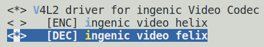

# VPU Felix video decoding processing unit

## Module Function Introduction

Felix is an H.264 video decoder that decodes H.264 format video data to NV12 format.

## Drive source code location

Location of driver source code:

***module_drivers/drivers/media/platform/ingenic-vcodec/felix/***
```
├── felix_drv.c
├── felix_drv.h
├── felix_ops.c
├── felix_ops.h
├── libh264
└── Makefile
```

## Device tree configuration

Location of device tree:

***module_drivers/dts/x2600.dtsi***

Felix controller description:

```c
felix: felix@0x13300000 {

    compatible = "ingenic,x2600-felix";

    reg = <0x13300000 0x100000>;

    interrupt-parent = <&core_intc>;

    interrupts = <IRQ_FELIX>;

    status = "disabled";

};
```

### Default configuration of device tree

The default build of the device tree will produce a felix device:

```
&felix {

    status = "okay";

};
```

### Device tree custom configuration

Users can disable Felix devices according to actual needs and set this node as disabled:

```
&felix {

    status = "disaled";

};
```

## Kernel compilation configuration

The kernel configuration for VIDEO_INGENIC_VCODEC is as follows:

The kernel configuration of Kernelx.x.x is as follows:
```
Symbol: VIDEO_INGENIC_VCODEC [=y]

Type : tristate

Prompt: V4L2 driver for ingenic Video Codec

 Location:

 -> Ingenic device-drivers Configurations

 -> [VPU] Drivers

 Defined at module_drivers/drivers/media/platform/ingenic-vcodec/Kconfig:1

 Depends on: (SOC_X2000 [=n] || SOC_M300 [=n] || SOC_X2100 [=n] || SOC_X2600 [=y]) && VIDEO_DEV [=y] && VIDEO_V4L2 [=y]

 Selects: V4L2_MEM2MEM_DEV [=y] && VIDEOBUF2_DMA_CONTIG_INGENIC [=y] && VIDEOBUF2_DMA_CONTIG [=y]
```

```
Symbol: INGENIC_FELIX [=y]

Type : tristate

Prompt: [DEC] ingenic video felix

 Location:

 -> Ingenic device-drivers Configurations

 -> [VPU] Drivers

 -> V4L2 driver for ingenic Video Codec (VIDEO_INGENIC_VCODEC [=y])

 Defined at module_drivers/drivers/media/platform/ingenic-vcodec/Kconfig:29

 Depends on: (SOC_X2000 [=n] || SOC_M300 [=n] || SOC_X2100 [=n] || SOC_X2600 [=y]) && VIDEO_INGENIC_VCODEC [=y]
```

### Default compile configuration of kernel

The kernel opens Felix driver by default, and the configuration interface is as follows:



### Kernel custom compile configuration

Users can remove the configuration of this driver according to actual needs.

## Kernel version differences

## Device Node Generation

After successful loading of the driver, the following nodes are generated:

Felix's device node:

```
/dev/video2
```

## Application Instructions

### v4l2-h264dec

h264 decoding test reference example program in IMPP library
