# 内存检测工具

> 阅读须知：
> 
> 文档介绍的工具除debugger外大部分存在于debug-tools库其中分支“ingenic-dev”存放工具源代码，分支“ingenic-master”存放编译完成的二进制程序,存放在sdk的“external/debug-tools”目录下。

# valgrind

> 阅读须知：
> 
> 本章节内容将介绍valgrind工具，本章节的内容基于release\_3.19.0版本，和网上内容可能存在差异，release\_3.19.0版本要求glibc版本为2.34，所以release\_3.19.0版本仅支持编译工具链的glibc版本大于2.34时可用。

## 简介

valgrind 是一套 Linux 下，开放源代码的动态调试工具集合，能够检测内存管理错误、线程 BUG 等，valgrind 由内核（core）以及基于内核的其他调试工具组成。内核类似于一个框架（framework），它模拟了一个 CPU 环境，并提供服务给其他工具；而其他工具则类似于插件 (plug-in)，利用内核提供的服务完成各种特定的内存调试任务。

valgrind 包括的工具如下：

1.  Memcheck是一个内存错误检测器。 它可以帮助您使程序，尤其是那些用C和C ++编写的程序更加正确。
    
2.  Cachegrind是缓存和分支预测分析器。 它可以帮助您使程序运行得更快。
    
3.  Callgrind是一个生成缓存分析器的调用图。 它与Cachegrind有一些重叠，但也收集了Cachegrind没有的一些信息。
    
4.  Helgrind是一个线程错误检测器。 它可以帮助您使多线程程序更正确。
    
5.  DRD也是线程错误检测器。 它与Helgrind类似，但使用不同的分析技术，因此可能会发现不同的问题。
    
6.  Massif是一个堆分析器。 它可以帮助您使程序使用更少的内存。
    
7.  DHAT是一种不同类型的堆分析器。 它可以帮助您了解块寿命，块利用率和布局效率低下的问题。
    
8.  SGcheck是一种实验工具，可以检测堆栈和全局数组的溢出。 它的功能与Memcheck的功能互补：SGcheck发现Memcheck无法解决的问题，反之亦然。
    
9.  BBV是一个实验性的SimPoint基本块矢量生成器。 它对进行计算机体系结构研究和开发的人很有用。
    

## 下载

在https://sourceware.org/pub/valgrind/中下载所需的版本

## 编译安装

```powershell
$ tar –xf valgrind-3.19.0.tar.bz2
$ cd valgrind-3.19.0
$ ./autogen.sh        // 运行自动生成配置文件脚本
$ export CC=/path/to/mips-linux-gnu-gcc     // 配置编译所用编译器
$ export CXX=/path/to/mips-linux-gnu-g++
$ export CPP=/path/to/mips-linux-gnu-cpp
$ ./configure  --prefix={最终产物绝对路径} --host=mipsel-linux-gnu       // 运行配置脚本生成makefile文件，可以--help查看配置项，自行按需配置，比如修改编译工具、修改安装路径等
$ make
$ make install        // 安装生成可执行文件，可执行文件的路径由参数--prefix指定；若不加参数--prefix指定，仅使用默认配置，则会自动关联

```

## 制作文件系统镜像

在执行完make install后，--prefix指定的目录结构如下图所示。

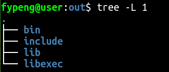

libexec目录中为valgrind运行所需的库文件，需要将libexec中的内容放在文件系统中的合适位置，将bin下的可执行程序放进文件系统的bin目录，然后重新打包镜像。

## 运行

开发板启动后，需要在开发板上配置valgrind运行所需的库路径。

```shell
export VALGRIND_LIB={valgrind库文件所在路径}
```

执行valgrind --version，运行成功显示以下内容

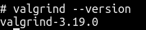

## 问题解决

在执行“valgrind --tool=memcheck --leak-check=full  ./xxxx”命令开始debug时可能遇到以下问题（主要是x1600系列芯片）。

问题一：

valgrind需要未经过strip的ld.so.1库文件，通过buildroot编译出的默认是strip过的，解决方法是，在工具链目录中查找ld.so.1文件，一般在“mips-linux-gnu/libc/lib/ld.so.1”路径下的就是，替换开发板中的ld.so.1文件即可，如果“mips-linux-gnu/libc/lib/”路径下没有，在sdk顶层目录out下搜索查找即可。

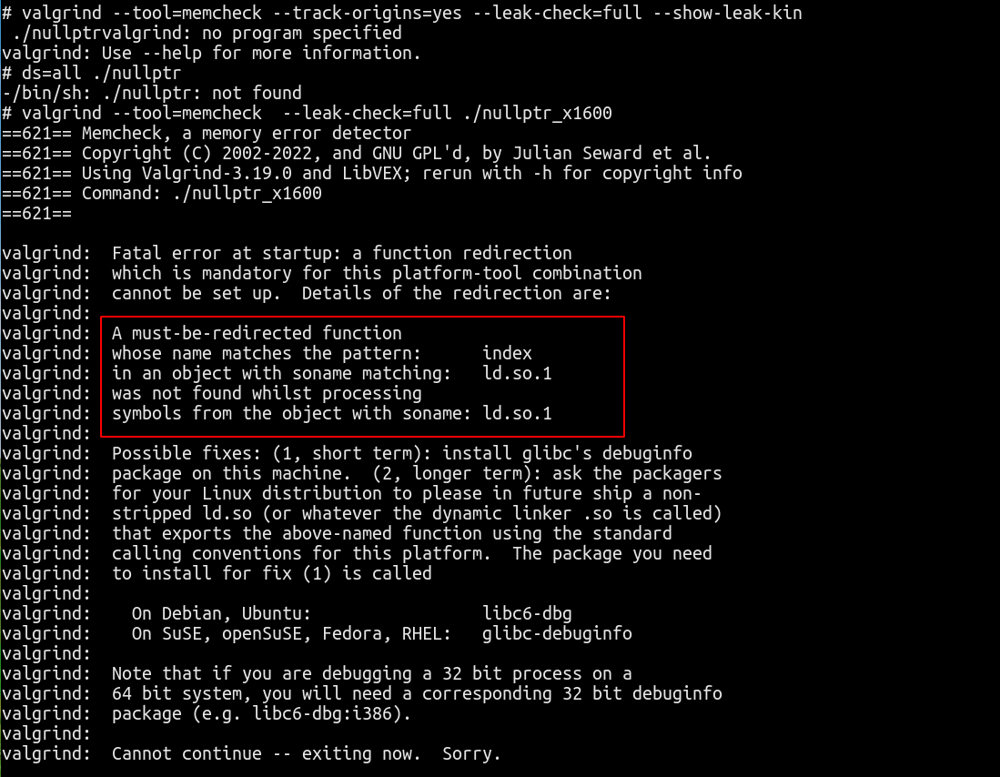

问题二：

valgrind运行需要大量内存，需要确保有充足的内存，建议使用ddr大于128MB的芯片。

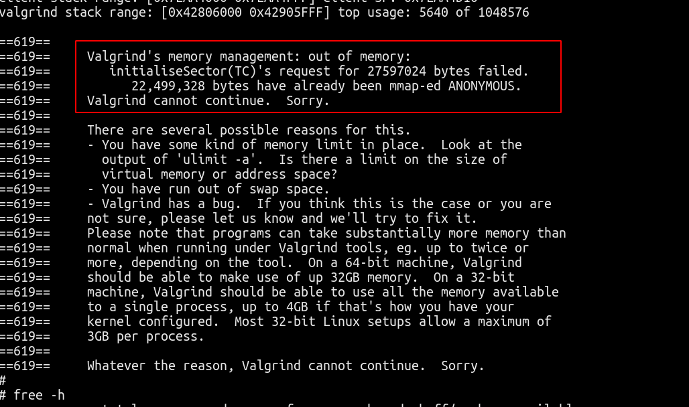

## DEMO运行结果解析

### 空指针访问

```c
#include <stdio.h>

int main(int argc, char * argv [ ])
{	
	int *p = NULL;

    printf("address [0x%p]\r\n", p);
	*p = 0;
	
    return 0;
}
```

运行指令：valgrind --tool=memcheck --track-origins=yes --leak-check=full --show-leak-kin

ds=all ./nullptr

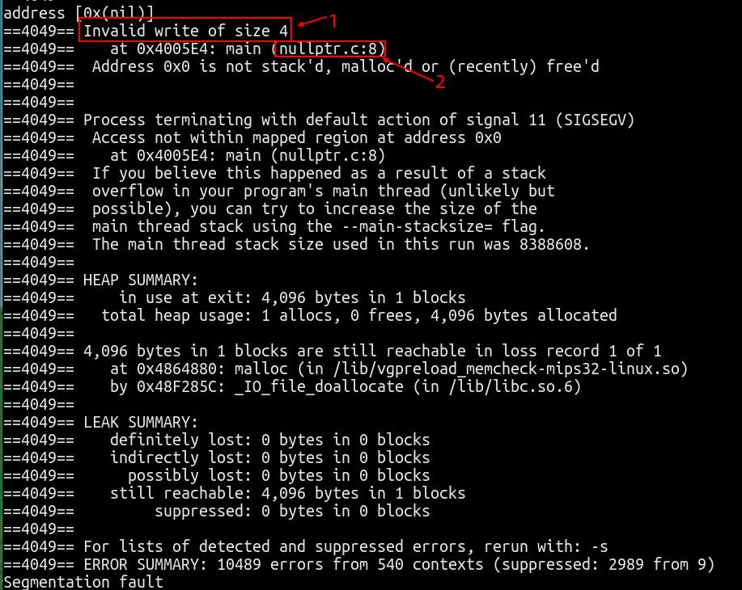

1.  非法写操作4字节
    
2.  在main函数中，在nullptr.c文件的第8行
    

综合含义为：在main函数（nullptr.c文件第8行）中存在4个字节的非法写操作

### 野指针访问

```c
#include <stdio.h>
#include <stdlib.h>

int main(int argc, char * argv [ ])
{	
	int *p = NULL;

	p = malloc(4);
	if (p == NULL)
	{
		perror("malloc failed");
	}
    printf("address [0x%p]\r\n", p);
	free(p);
	*p = 0;
	
    return 0;
}
```

运行指令：valgrind --tool=memcheck  --leak-check=full ./wildptr

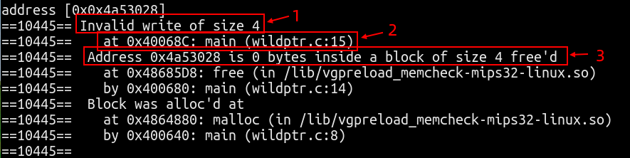

1.  非法写操作4字节
    
2.  在main函数中，在wildptr.c文件中的第15行
    
3.  地址0x4a53028是大小为4的空闲块内的0个字节
    

综合以上log信息的含义为：存在4个字节的非法写操作，在main函数（wildptr.c文件的第15行），地址0x4a53028是大小为4字节在main函数中（wildptr.c文件的第14行）释放过的内存块，该内存在main函数中（wildptr.c文件的第14行）申请的。

### 内存越界访问

```c
#include <stdio.h>
#include <stdlib.h>

int main(int argc, char * argv [ ])
{	
	int *p = NULL;

	p = malloc(4);
	if (p == NULL)
	{
		perror("malloc failed");
	}
    printf("address [0x%p]\r\n", p);
	p[4] = 0;
	free(p);
	
    return 0;
}

```

运行指令：valgrind --tool=memcheck  --leak-check=full ./overmem

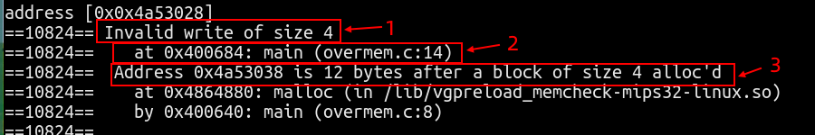

1.  非法写操作4字节
    
2.  在main函数中，在overmem.c文件中的第14行
    
3.  地址0x4a53038是alloc的4字节块的后面第12字节地址处
    

综合以上log信息含义为：在main函数（overmem.c文件的第8行）中申请了4字节大小的内存块，在运行到main函数（overmem.c文件的第14行）时出现了访问4字节内存块后第12字节位置的内存越界行为。

### 内存泄露

```c
#include <stdio.h>
#include <stdlib.h>

int main(int argc, char * argv [ ])
{	
	int *p = NULL;

	p = malloc(4);
	if (p == NULL)
	{
		perror("malloc failed");
	}
    printf("address [0x%p]\r\n", p);

    return 0;
}

```

运行指令：valgrind --tool=memcheck  --leak-check=full ./leakmem

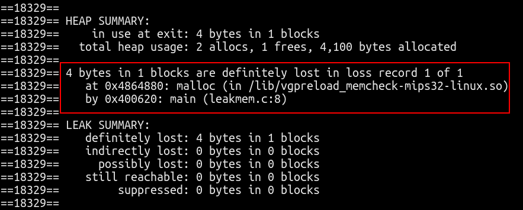

图中的log信息意思为：在main函数（leakmem.c文件的第8行）中使用malloc申请了4字节的内存块未释放。

### 重复释放

```c
#include <stdio.h>
#include <stdlib.h>

int main(int argc, char * argv [ ])
{	
	int *p = NULL;

	p = malloc(4);
	if (p == NULL)
	{
		perror("malloc failed");
	}
    printf("address [0x%p]\r\n", p);
	free(p);
	free(p);
	
    return 0;
}
```

运行指令：valgrind --tool=memcheck  --leak-check=full ./refree

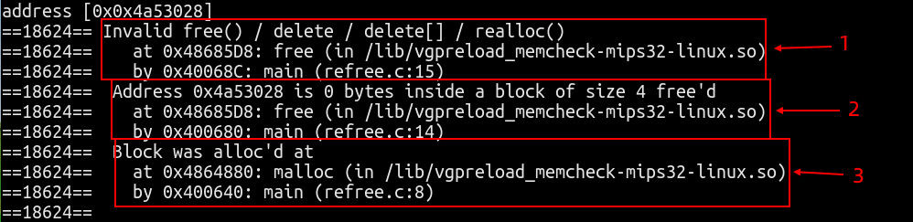

1.  非法释放内存操作，在main函数中（refree.c文件的第15行）
    
2.  释放内存，0x4a53028是4字节内存块的第0个字节
    
3.  内存在main函数中（refree.c文件的第8行）被申请、
    

综合以上log信息的含义为：在main函数（refree.c文件的第8行）中申请了4字节的内存块，在main函数（refree.c文件的第14行）中释放了该内存块，在main函数（refree.c文件的第15行）中再次释放了该内存块。

### 释放操作不匹配

```c
#include <stdio.h>
#include <stdlib.h>

int main(int argc, char * argv [ ])
{
        int *p = NULL;
                                        
        p = (int*)malloc(sizeof(int));
        if (p == NULL)
        {
                perror("malloc failed");
        }
        printf("address [0x%p]\r\n", p);
        delete p;

        return 0;
}

```

运行指令：valgrind --tool=memcheck  --leak-check=full ./nolink

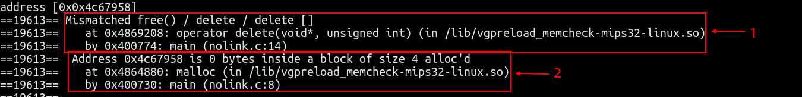

1.  在main函数中，为匹配的释放内存操作
    
2.  地址0x4c67958是alloc的4自己内存块的第0字节
    

综合以上log信息的含义为：在main函数（nolink.c文件的第8行）中使用malloc申请了4字节的内存块，在main函数（nolink.c文件的第14行）中使用了delete操作释放内存和malloc不匹配。

# dmalloc

## 简介

dmalloc是一个简单易用的C/C++内存leak检查工具，以一个运行库的方式发布。dmalloc能够检查出直到程序运行结束还没有释放的内存，并且能够精确指出在哪个源文件的第几行。

## 下载

下载最新的dmalloc代码在[https://dmalloc.com/releases/](https://dmalloc.com/releases/)地址，选择最新的下载即可。

## 编译

将下载后的压缩包进行解压：

```powershell
$ tar -xvf dmalloc-5.6.5.tgz
$ cd dmalloc-5.6.5
$ ./configure --prefix={输出文件绝对路径} --host=mipsel-linux-gnu --enable-cxx --enable-threads
$ make
$ make install
$ cd {输出文件绝对路径}
$ tree
.
├── bin
│   └── dmalloc    //需要在开发板上执行，配置环境变量使用
├── include
│   └── dmalloc.h  //在需要检测内存的文件中引入该头文件
└── lib
    ├── libdmalloc.a   //编译待测试的可执行程序时需要链接该库
    └── libdmallocth.a //编译待测试的可执行程序时需要链接该库

3 directories, 4 files

```

## 使用方法

```c
#include <stdio.h>
#include <stdlib.h>
#include <string.h>                    
#include <dmalloc.h>    //引入dmalloc头文件

int main(int argc, char **argv)
{
  char *string;
  
  printf("in dmalloc\n");
  
  string = (char*)malloc(sizeof(char));
  string = (char*)malloc(sizeof(int*));

  return 0;
}

```

编译可执行程序：

```powershell
$ mips-linux-gnu-gcc -O0 -g -DDMALLOC_FUNC_CHECK dmalloc_test.c -L{输出文件绝对路径}/lib  -ldmalloc -ldmallocth  -I {输出文件绝对路径}/include/ -o dmalloc_test
```

## 运行

将输出文件目录下的dmalloc可执行程序和编译好的待测试程序dmalloc\_test添加到开发板。

```powershell
# ./dmalloc -b -l logfile -i 100 low
export DMALLOC_OPTIONS=debug=0x4e48503,inter=100,log=logfile //在终端执行该内容
# export DMALLOC_OPTIONS=debug=0x4e48503,inter=100,log=logfile
# ./dmalloc_test
in dmalloc
# ls -l

```

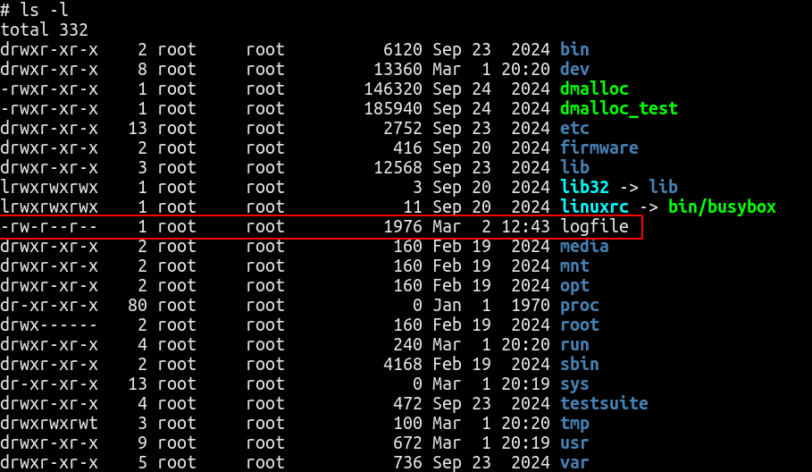

## log文件内容解析

```powershell
# cat logfile
```

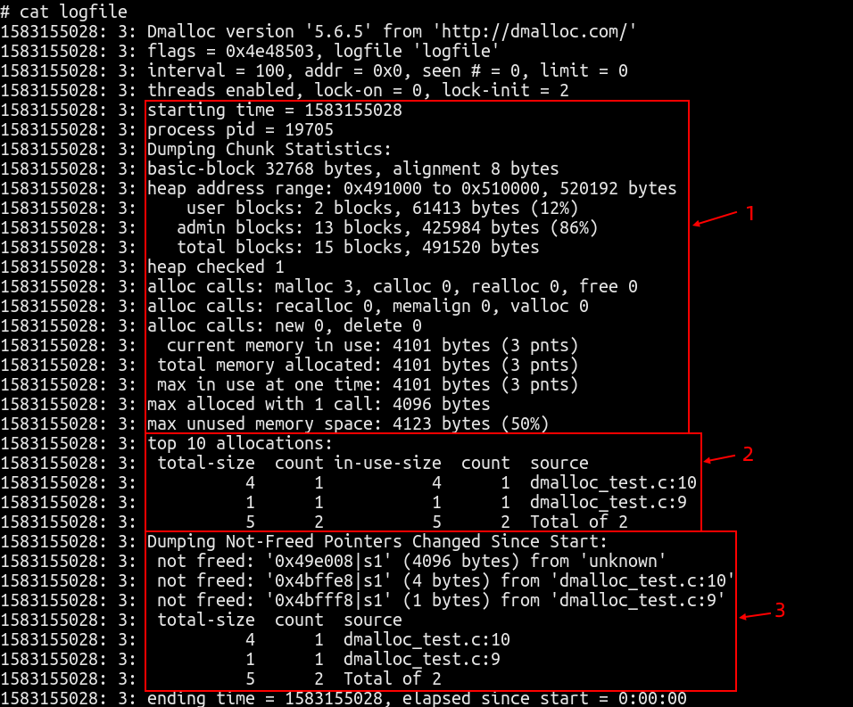

1.  程序基础信息
    
2.  申请的内存大小，从大到小排序，前10项内存信息
    
3.  截止程序结束，未释放的内存
    

从上图可以看到，程序在dmalloc\_test.c的第9行申请了1字节内存，在dmalloc\_test.c的第10行申请了4字节内存，以上申请的内存在程序结束时均未释放，存在内存泄露问题。

# memwatch

## 简介

memwatch主要是C的内存泄漏检测器。使用C预处理器，memwatch用自己可以记录分配过程的函数，替代项目中所有对ANSI C内存分配函数的调用。尽量不要在C++中使用memwatch，C++ 允许各个类拥有自己的内存管理，如果使用不当，memwatch 使用的预处理器方法可能会对此类类声明造成严重破坏。可以定位到申请内存的代码，没有调用栈。

## 下载

代码下载：[https://github.com/linkdata/memwatch](https://github.com/linkdata/memwatch)

可以直接使用 “git clone  [https://github.com/linkdata/memwatch.git](https://github.com/linkdata/memwatch.git)” 下载代码，只需要memwatch.c和memwatch.h文件。

## 编译

```powershell
mips-linux-gnu-g++ -g -O0 -DMEMWATCH  memwatch.c memwatch_test.c -o memwatch_test

在编译可执行程序时，添加-DMEMWATCH以及编译memwatch.c即可。
监测文件中需要include memwatch.h头文件
```

## 使用方法

```c
#include <iostream>
#include <mcheck.h>
#include <stdlib.h>
#include "./memwatch.h"
using namespace std;

int main()
{
    int *p1=new int;
    int *p2=new int;
    int *p3=(int*)malloc(sizeof(int));
    int *p4=(int*)malloc(sizeof(int));  // line 12

    printf("in memwatch test\n");                  
    delete p1;
    free(p3);
    return 0;
}

```

编译成可执行程序：

```c
mips-linux-gnu-g++ -g -O0 -DMEMWATCH  memwatch.c memwatch_test.c -o memwatch_test
```

## 运行

```c
 ./memwatch_test
```

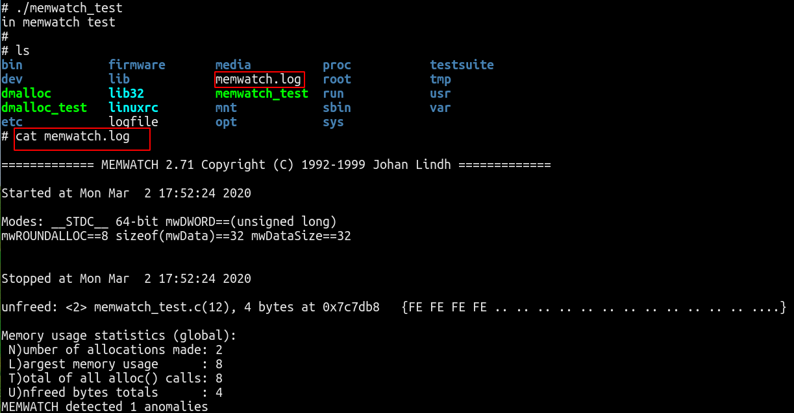

## log文件内容解析

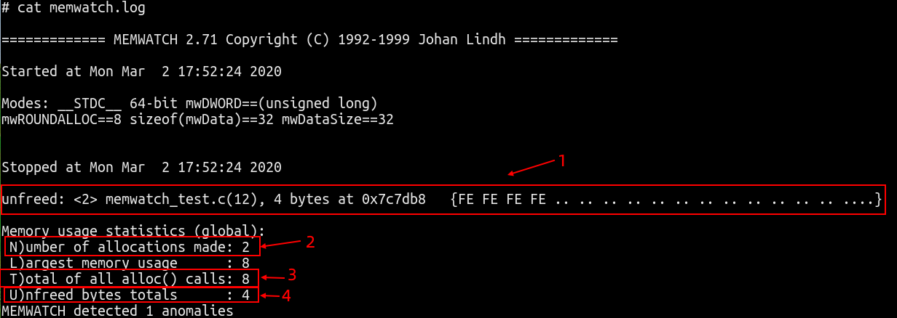

1.  memwatch\_test.c文件的第12行申请的4字节内存未释放
    
2.  申请了2次内存
    
3.  所有alloc总计申请了8字节内存
    
4.  未fred内存总计4字节
    

结合测试demo源码来看，memwatch只能用来监测c语言中的内存申请和释放函数，对于c++的new和delete无能为力。

# debugger

> 阅读须知：debugger的编译目前只能使用mips-gcc720-glibc229的工具链，其他工具链可能暂时存在问题。

## 简介

Android系统自带一个实用的程序异常退出的诊断daemon debuggerd，debuggerd对于内存泄露是能为力的。此进程可以侦测到程序崩溃，并将崩溃时的进程状态信息输出到文件和串口中，以供开发人员分析调试使用。

Debuggerd的数据被保存在板子的/tmp/tombstone/目录下，共可保存10个文件，当超过10个时，会覆盖重写最早生产的文件。串口中，则直接用DEBUG的tag，输出logcat信息。 Linux kernel有自己的一套signal机制，在应用程序崩溃时，通常系统内核都会发送signal到出问题的进程，以通知进程出现什么异常，这些进程可以捕获这些signal并对其做相应的处理。通常对于程序异常信号的处理，就是退出。android在此机制上实现了一个更实用的功能：拦截这些信号，dump进程信息以供调试。

## 编译

Manhattan工程里默认存在该工具，在目录“external/debugger”中就是完整的工具源码。

```powershell
$ cd ./external/debugger     //cd 到源码目录
$ mm   //执行mm编译即可
```

## 使用方法

将编译打包好的debugger文件系统烧录进开发板后，在开发板串口进入shell命令行后执行以下内容：

```powershell
# export LD_PRELOAD=/usr/lib/libdebugger.so   //添加预加载动态库
# debuggerd &  //运行debugger守护者进程
```

至此已做好前期准备工作。

## 运行

```c
#include <stdio.h>                      

int main(int argc, char * argv [ ])
{
        int *p = NULL;

        printf("address [0x%p]\r\n", p);
        *p = 0;

        return 0;
}

```

测试使用以上代码，在执行到第8行处会存在段错误。

将编译好的可执行代码放进开发板中执行：

```powershell
# ./nullptr_229
address [0x(nil)]
[1]+  Stopped (signal)           ./nullptr_229[ 8536.039383] 
do_page_fault(): sending SIGSEGV to nullptr_229 for invalid write access to 00000000
# 
[ 8536.052329] epc = 004005c4 in nullptr_229[400000+1000]
[ 8536.057889] ra  = 004005c0 in nullptr_229[400000+1000]
[ 8536.063365] 

[1]+  Segmentation fault         ./nullptr_229

```

程序异常退出。

## log文件内容解析

log文件存放与文件系统的“/tmp/tombstones/”目录，可以使用cat进程查看。

文件内容较多，挑选重点内容做讲解。

```plaintext
*** *** *** *** *** *** *** *** *** *** *** *** *** *** *** ***
pid: 8511, tid: 8511, name: nullptr_229  >>> ./nullptr_229 <<<
signal 11 (SIGSEGV), code 1 (SEGV_MAPERR), fault addr (nil)
 zr 00000000  at 00000001  v0 00000000  v1 004006f0
 a0 77b10e2c  a1 00000081  a2 ffffffff  a3 00000000
 t0 00000000  t1 00000003  t2 00000001  t3 72646461
 t4 00000008  t5 00000000  t6 00000000  t7 00000000
 s0 00000000  s1 004005f0  s2 00000000  s3 00000000
 s4 00cf651c  s5 778454a8  s6 ffffffff  s7 00000000
 t8 00000003  t9 779fa000  k0 fbad2a84  k1 00000000
 gp 77b16e30  sp 7feac2b8  s8 7feac2b8  ra 004005c0
 hi 00000000  lo 00000000 bva 00000000 epc 004005c4

以上内容记录了异常程序的基本信息，以及异常退出的信号，从fault addr (nil)可以直接看出是因为访问null地址导致的异常，记录异常时的寄存器值，重点关注epc的值，epc的值记录了发生异常的程序地址。
.......

backtrace:
    #00 pc 000005c4  /nullptr_229 (main+52)
    记录了异常点位于基于main函数的基地址偏移52的位置，即0x004005c4

........

memory map: (fault address prefixed with --->)
--->Fault address falls at 00000000 before any mapped regions
该处提示异常地址0000不属于以下任何映射的地址空间
    00400000-400fff r-x     4096  /nullptr_229
    00410000-410fff rw-     4096  /nullptr_229
    0091b000-93bfff rwx   135168  [heap]
    7771f000-77744fff r-x   155648  /lib/libgcc_s.so.1
    77745000-77754fff ---    65536  /lib/libgcc_s.so.1
    77755000-77755fff rw-     4096  /lib/libgcc_s.so.1
    77756000-777b6fff r-x   397312  /lib/libm-2.29.so
    777b7000-777c5fff ---    61440  /lib/libm-2.29.so
    777c6000-777c6fff r--     4096  /lib/libm-2.29.so
    777c7000-777c7fff rw-     4096  /lib/libm-2.29.so
    777c8000-77968fff r-x  1708032  /usr/lib/libstdc++.so.6.0.24
    77969000-77978fff ---    65536  /usr/lib/libstdc++.so.6.0.24
    77979000-77984fff r--    49152  /usr/lib/libstdc++.so.6.0.24
    77985000-77987fff rw-    12288  /usr/lib/libstdc++.so.6.0.24
    77988000-77989fff rw-     8192  
    7798a000-77afafff r-x  1511424  /lib/libc-2.29.so
    77afb000-77b0afff ---    65536  /lib/libc-2.29.so
    77b0b000-77b0dfff r--    12288  /lib/libc-2.29.so
    77b0e000-77b10fff rw-    12288  /lib/libc-2.29.so
    77b11000-77b12fff rw-     8192  
    77b13000-77b14fff r-x     8192  /usr/lib/libdebugger.so
    77b15000-77b23fff ---    61440  /usr/lib/libdebugger.so
    77b24000-77b24fff rw-     4096  /usr/lib/libdebugger.so
    77b25000-77b48fff r-x   147456  /lib/ld-2.29.so
    77b53000-77b56fff rw-    16384  
    77b57000-77b57fff r--     4096  [vvar]
    77b58000-77b58fff r-x     4096  [vdso]
    77b59000-77b59fff r--     4096  /lib/ld-2.29.so
    77b5a000-77b5afff rw-     4096  /lib/ld-2.29.so
    7fe8c000-7feacfff rwx   135168  [stack]
Tombstone written to: /tmp/tombstones/tombstone_01
```

至此我们可以确定程序异常的原因是访问了null地址，导致的段错误异常，且该异常位置在main函数的52偏移处，通过对可执行程序的反汇编得到以下内容：

```plaintext
00400590 <main>:
  400590:       27bdffd8        addiu   sp,sp,-40
  400594:       afbf0024        sw      ra,36(sp)
  400598:       afbe0020        sw      s8,32(sp)
  40059c:       03a0f025        move    s8,sp
  4005a0:       afc40028        sw      a0,40(s8)
  4005a4:       afc5002c        sw      a1,44(s8)
  4005a8:       afc00018        sw      zero,24(s8)
  4005ac:       8fc50018        lw      a1,24(s8)
  4005b0:       3c020040        lui     v0,0x40
  4005b4:       244406e0        addiu   a0,v0,1760
  4005b8:       0c1001d0        jal     400740 <printf@plt>
  4005bc:       00000000        nop
  4005c0:       8fc20018        lw      v0,24(s8)
  4005c4:       ac400000        sw      zero,0(v0)         
  4005c8:       00001025        move    v0,zero
  4005cc:       03c0e825        move    sp,s8
  4005d0:       8fbf0024        lw      ra,36(sp)
  4005d4:       8fbe0020        lw      s8,32(sp)
  4005d8:       27bd0028        addiu   sp,sp,40
  4005dc:       03e00008        jr      ra
  4005e0:       00000000        nop

```

4005c4地址处所对应的汇编指令导致异常的发生，该行指令的含义是“将0存储到v0寄存器所指向的地址中”，通过对比源码可以定位到是第8行存在问题。

# mtrace
> 注意事项：目前sdk发布版本较多，并不是所有编译工具链都具备该功能，开发者可使用“find -name libc_malloc_debug.so”看能否找到该库文件，找到该库文件即表示支持该功能。

## 简介
mtrace是GNU Glibc自带的一个内存追踪函数，它会在每个内存申请函数malloc/realloc/calloc的位置记录下信息，并在每个内存释放的位置记录下free的内存信息，其中包含有内存申请的地址，内存申请的大小，释放内存的地址，释放内存的大小。但是只能定位到malloc层面，无法记录上层调用栈。

## 使用方法

在需要检测的文件中引入头文件mcheck.h，在需要检测的区间调用mtrace开始监测函数和muntrace停止监测函数。

mtrace的使用需要配合libc_malloc_debug.so库，该库默认存在于编译工具链的源码目录，默认不会自动拷贝进文件系统目录中，可以在编译工具链的源码目录使用“find -name libc_malloc_debug.so”查找该库的具体位置。
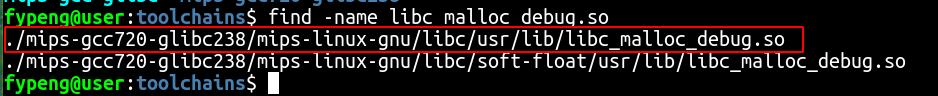

> 如果缺少该库，将无法生成log文件。

 libc/usr/lib/libc_malloc_debug.so是一个软连接文件，需要将对应的真实文件传输到开发板中。

 开发板上系统启动后执行：
 ```shell
export LD_PRELOAD={库路径}/libc_malloc_debug.so.0
 ```

## 运行

 ```c
#include <stdio.h>
#include <mcheck.h>              

int main() {
    printf("in %s\n", __FILE__);
    mtrace();

    int *p = malloc(4);

    int *q = malloc(8);

    free(p);

    muntrace();
    return 0;
}
 ```

 编译：
 ```shell
 $ mips-linux-gnu-gcc -O0 -g mtrace_demo1.c -o mtrace_demo1
 ```
 > 编译时注意两点，首先要保证O0编译，不要开编译优化，其次需要加-g选项，这是为了后面调试时做地址转换。

运行：
 ```shell
 # ./mtrace_demo1
 # ls
bin           lib32         mtrace_demo1  sbin          var
dev           linuxrc       opt           sys
etc           media         proc          testsuite
firmware      mnt           root          tmp
lib           mtrace.log    run           usr

 ```
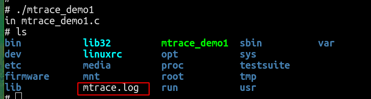

成功的话会生成mtrace.log文件

## log文件内容解析

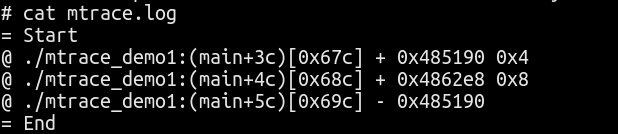

Start到End之间就是函数mtrace到函数muntrace之间追踪的内容。

```shell
     
@ ./mtrace_demo1:(main+3c)[0x67c] + 0x485190 0x4
./mtrace_demo1：可执行程序名
(main+3c)[0x67c]：异常地址，即main函数偏移3c处
+：表示申请内存  -表示释放内存
0x485190：申请到的地址信息
0x4：表示申请的内存大小

```

根据log信息可以看出存在内存泄露且地址为0x4862e8，在main函数的4c偏移处。

## 快速定位内存泄露方法
将上述的log文件拿到pc端，执行以下命令：
```shell
$ mtrace ./mtrace_demo1 ./mtrace.log
```
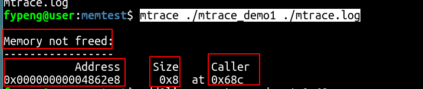

提示存在未释放内存，地址为0x00000000004862e8，大小为0x8，申请内存的位置为main+4c，即基于main函数地址的0x4c偏移处。

通过objdump反汇编可执行程序确定main函数的地址为00400640，则实际申请地址为0x40068c。

使用addr2line确定具体的行号：
```shell
mips-linux-gnu-addr2line -e mtrace_demo1 0x40068c

```

确定具体的内存申请位置在mtrace_demo1.c文件的第10行。

# AddressSanitizer

> 注意事项：目前sdk发布版本较多，并不是所有编译工具链都具备该功能，开发者可使用“find -name libasan.so.5”看能否找到该库文件，找到该库文件即表示支持该功能。

## 简介
ASAN（AddressSanitizer的缩写）是一款面向C/C++语言的内存错误问题检查工具，可以检测如下内存问题：

*   使用已释放内存（野指针）
*   堆内存越界（读写）
*   栈内存越界（读写）
*   全局变量越界（读写）
*   函数返回局部变量
*   内存泄漏

ASAN工具主要由两部分组成：

*    运行时库
    运行时库（libasan.so.x）会接管malloc和``free函数。malloc执行完后，已分配内存的前后（称为“红区”）会被标记为“中毒”状态，而释放的内存则会被隔离起来（暂时不会分配出去）且也会被标记为“中毒”状态。

*   编译器插桩模块
    加了ASAN相关的编译选项后，代码中的每一次内存访问操作都会被编译器修改为如下方式：
    
编译前:
```c
*address = ...;  // or: ... = *address;

```

编译后：
```c
if (IsPoisoned(address)) {
  ReportError(address, kAccessSize, kIsWrite);
}
*address = ...;  // or: ... = *address;
```

## 使用方法

在编译可执行程序时添加“-fsanitize=address”和“-ggdb”选项。

AddressSanitizer的使用需要配合libasan.so.5库，该库默认存在于编译工具链的源码目录，默认不会自动拷贝进文件系统目录中，可以在编译工具链的源码目录使用“find -name libasan.so.5”查找该库的具体位置。
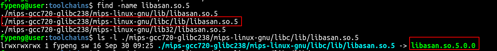

将libasan.so.5.0.0文件传输到开发板中。

在开发板执行以下内容：
```shell
export LD_PRELOAD={库路径}/libasan.so.5.0.0
```

## 运行

```c
#include <stdio.h>

int main()
{
    int a[2] = {1, 0};
    int b = a[2];     

    return 0;
}
```
上述代码存在越界访问错误，然而和其他的内存访问错误所不同的是，它并不会造成崩溃，即使是强大的 valgrind 也无法告诉我们具体问题在哪里。

编译成可执行程序：
```shell
$ mips-linux-gnu-gcc -fsanitize=address -ggdb -o sanitize_demo sanitize_demo.c
```
将可执行程序放入开发板中运行

## log结果分析

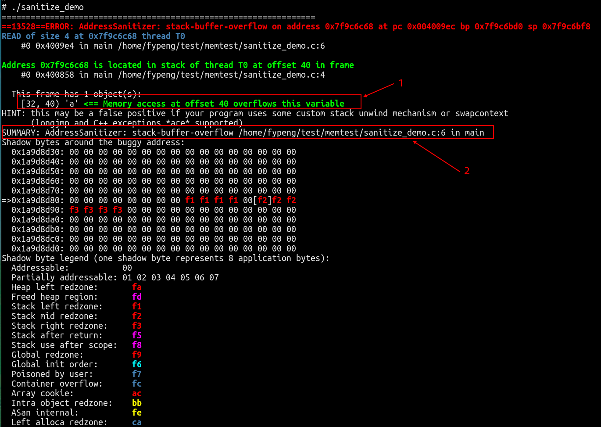

1. a变量内存访问溢出
2. 栈buffer访问溢出，在sanitize_demo.c文件第6行

综合起来就是，在sanitize_demo.c文件第6行a变量存在栈内存访问溢出问题。


