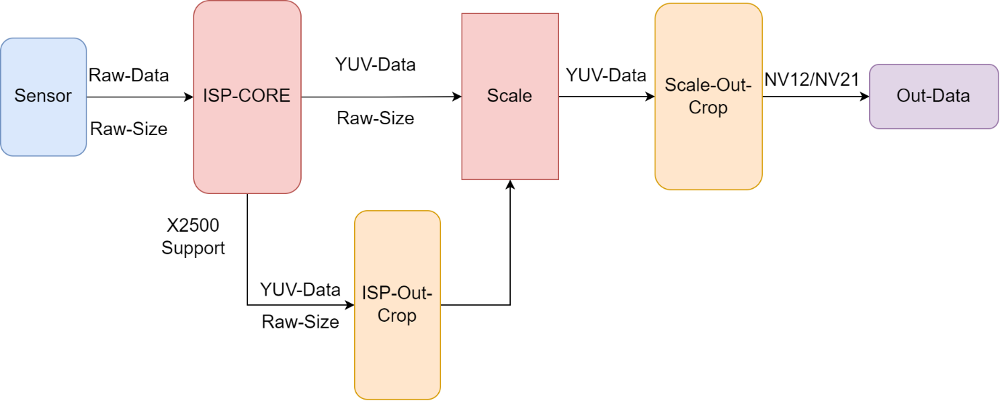
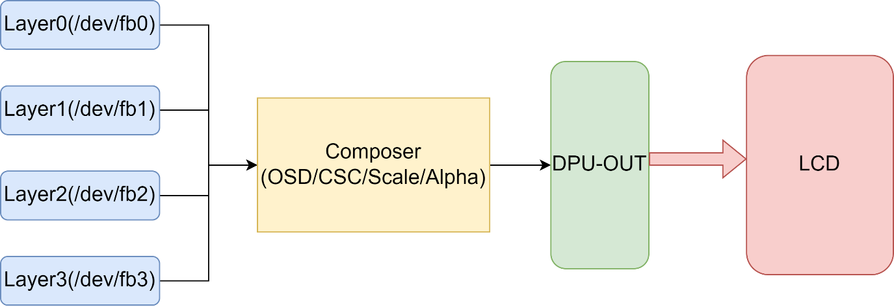
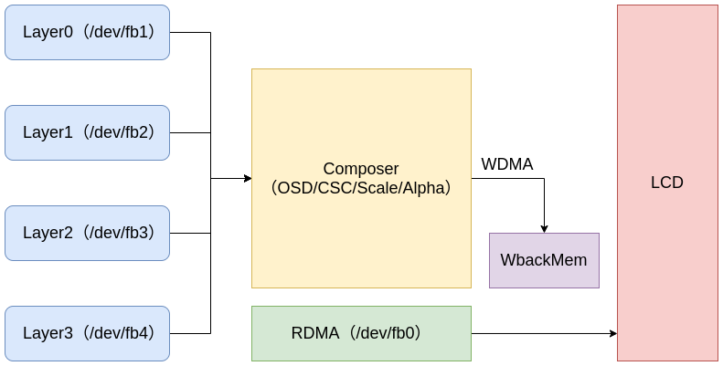
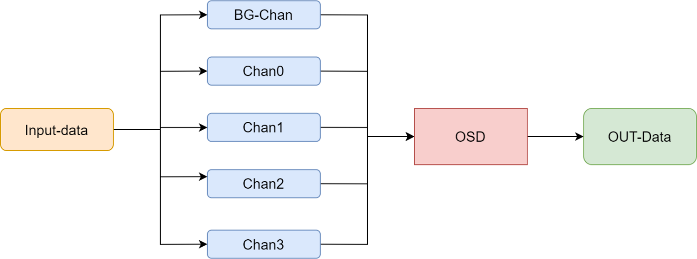
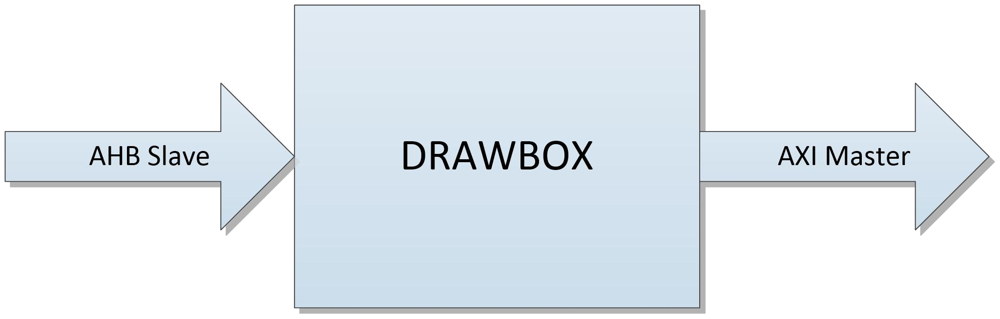

**君正®**

*
Copyright © Ingenic Semiconductor Co. Ltd 2022. All rights reserved.

**Release history**


| Date      | Revision | Change         |
| --------- | -------- | -------------- |
| Jan.2022  | 1.00     | First release  |
| Dec.2022  | 2.00     | Second release |
| Jul. 2023 | 3.00     | Third release  |
| Oct. 2024 | 4.00     | Fourth release |

[TOC]


# 1 Camera模块

Camera模块实现摄像头数据采集，X2000/X2500芯片平台可支持输出NV12/NV21格式。X2000/X2500芯片平台的视频采集模块,在驱动实现方式上均是基于V4L2框架，下表列出各视频节点和Sensor的对应关系。

|              |              |                      |
| ------------ | ------------ | -------------------- |
| Sensor N     | 设备节点     | 输出格式             |
| Sensor0      | /dev/video3  | RAW/YUV(未经ISP处理) |
| /dev/video4  | NV12/NV21    |
| /dev/video5  | NV12/NV21    |
| /dev/video6  | NV12/NV21    |
| Sensor1      | /dev/video7  | RAW/YUV(未经ISP处理) |
| /dev/video8  | NV12/NV21    |
| /dev/video9  | NV12/NV21    |
| /dev/video10 | NV12/NV21    |
| Sensor2(DVP) | /dev/video13 |                      |

需要注意的是，X2500 ISP最大输出分辨率为 3840x2160，X2000 ISP最大输出分辨率为2048x2048。

X2600芯片平台可支持输出YUV422、RGB565、RGB888。X2600芯片平台的视频采集模块，在驱动实现方式上也是基于V4L2框架，DVP摄像头对应的视频节点为/dev/video11。需要注意的是X2600 ISP最大输出分辨率为2047x2047。

## 1.1 Camera模块相关API介绍

### 1.1.1 打开视频输入节点

【函数原型】

 IHAL_CameraHandle_t* IHal_CameraOpen(IHAL_INT8* videoname);

【功能描述】

打开一个视频输入节点

【API参数说明】

|           |              |           |
| --------- | ------------ | --------- |
| 参数      | 描述         | 输入/输出 |
| videoname | 视频节点路径 | 输入      |

【返回值】

成功: Camera Handle

失败: NULL

【注意事项】

无。

### 1.1.2 关闭视频输入节点

【函数原型】

 IHAL_INT32 IHal_CameraClose(IHAL_CameraHandle_t* handle);

【功能描述】

 关闭一个已打开的视频输入节点。

【API参数说明】

|        |            |           |
| ------ | ---------- | --------- |
| 参数   | 描述       | 输入/输出 |
| handle | Camera句柄 | 输入      |

【返回值】

成功: 0

失败: 非0

【注意事项】

无。

### 1.1.3 设置节点参数

【函数原型】

 IHAL_INT32 IHal_CameraSetParams(IHAL_CameraHandle_t* handle,

IHAL_CAMERA_PARAMS* params);

【功能描述】

 设置handle对应节点的视频参数，主要是图像宽高和像素格式等。

【API参数说明】


|        |              |           |
| ------ | ------------ | --------- |
| 参数   | 描述         | 输入/输出 |
| handle | Camera句柄   | 输入      |
| params | 图像参数结构 | 输入      |

【ISP输出参数说明】


|                       |                                                                |
| --------------------- | -------------------------------------------------------------- |
| 参数                  | 描述                                                           |
| imageWidth            | ISP输出图像宽度                                                |
| imageHeight           | ISP输出图像高度                                                |
| imageFmt              | ISP输出像素格式                                                |
| imageFmtStr           | 图像像素格式字符串，当imageFmtStr不为NULL时，以imageFmtStr为主 |
| wdr_enable            | 是否开启WDR                                                    |
| bin_select            | 是否指定BIN文件，不指定则使用默认文件路径                      |
| crop_posx             | ISP-CORE输出裁剪起始X坐标                                      |
| crop_posy             | ISP-CORE输出裁剪起始Y坐标                                      |
| crop_width            | ISP-CORE输出裁剪宽度                                           |
| crop_height           | ISP-CORE输出裁剪高度                                           |
| scale_out_crop_posx   | 缩放输出裁剪起始坐标X                                          |
| scale_out_crop_posy   | 缩放输出裁剪起始坐标Y                                          |
| scale_out_crop_width  | 缩放输出裁剪宽度                                               |
| scale_out_crop_height | 缩放输出裁剪高度                                               |
| binpath               | 指定BIN文件的路径(64Byte)                                      |

【返回值】

成功: 0

失败: 非0

【注意事项】

无。

### 1.1.4 设置ISP控制参数

【函数原型】

 IHAL_INT32 IHal_CameraSetControlParams(IHAL_CameraHandle_t* handle,

IHAL_CAMERA_CONTROL_CMD cmd, IHAL_UINT32 value);

【功能描述】

 设置handle对应节点的视频控制参数，如白平衡、自动曝光等参数。

【参数说明】


|        |                       |           |
| ------ | --------------------- | --------- |
| 参数   | 描述                  | 输入/输出 |
| handle | Camera句柄            | 输入      |
| cmd    | 要设置的参数对应的CMD | 输入      |
| value  | 参数值                | 输入      |

【返回值】

成功: 0

失败: 非0

【注意事项】

设置ISP控制参数必须在Camera开流之后进行设置，即在IHal_CameraStart()之后进行调用。

### 1.1.5 获取ISP控制参数

【函数原型】

 IHAL_INT32 IHal_CameraGetControlParams(IHAL_CameraHandle_t* handle,

IHAL_CAMERA_CONTROL_CMD cmd,IHAL_UINT32 *value);

【功能描述】

 获取handle对应节点的视频控制参数，如白平衡、自动曝光等参数。

【参数说明】


|        |                       |           |
| ------ | --------------------- | --------- |
| 参数   | 描述                  | 输入/输出 |
| handle | Camera句柄            | 输入      |
| cmd    | 要获取的参数对应的CMD | 输入      |
| value  | 参数值                | 输出      |

【返回值】

成功: 0

失败: 非0

### 1.1.6 创建Buffer

【函数原型】

 IHAL_INT32 IHal_CameraCreateBuffers(IHAL_CameraHandle_t* handle,

IMPP_BUFFER_TYPE type,IHAL_INT32 num_buffers);

【功能描述】

 创建camera的数据buffer。

【参数说明】


|             |                                                                                                                                                                         |           |
| ----------- | ----------------------------------------------------------------------------------------------------------------------------------------------------------------------- | --------- |
| 参数        | 描述                                                                                                                                                                    | 输入/输出 |
| handle      | Camera句柄                                                                                                                                                              | 输入      |
| type        | 需要创建buffer的类型，通常有三种类型：IMPP_INTERNAL_BUFFER：内部Buffer；IMPP_EXT_DMABUFFER：外部的dma-buf。IMPP_EXT_USERBUFFER：外部的用户空间buffer,此用户空间Buffer。 | 输入      |
| num_buffers | 需要创建buffer的个数                                                                                                                                                    | 输入      |

【返回值】

成功: 创建buffer的个数

失败: -1

### 1.1.7 设置共享Buffer

【函数原型】

 IHAL_INT32 IHal_CameraSetBuffers(IHAL_CameraHandle_t* handle,

IHAL_INT32 index, IMPP_BufferInfo_t *sharebuf);

【功能描述】

 设置camera的数据缓冲buffer，该API用于camera使用外部数据Buffer时调用，需要在camera开始前调用，且只需要调用一次。

【参数说明】


|          |                    |           |
| -------- | ------------------ | --------- |
| 参数     | 描述               | 输入/输出 |
| handle   | Camera句柄         | 输入      |
| index    | buffer的序号       | 输入      |
| sharebuf | 内存共享描述结构体 | 输入      |

【返回值】

成功: 0

失败: 非0

### 1.1.8 获取共享Buffer

【函数原型】

 IHAL_INT32 IHal_GetCameraBuffers(IHAL_CameraHandle_t* handle,

IHAL_INT32 index, IMPP_BufferInfo_t *sharebuf);

【功能描述】

 获取camera的数据buffer，该API主要用于将camera的内部申请的buffer和其他模块的共享(如编码器)，从而实现数据的零拷贝。

【参数说明】


|          |                    |           |
| -------- | ------------------ | --------- |
| 参数     | 描述               | 输入/输出 |
| handle   | Camera句柄         | 输入      |
| index    | buffer的序号       | 输入      |
| sharebuf | 内存共享描述结构体 | 输出      |

【返回值】

成功: 0

失败: 非0

### 1.1.9 开启视频流输出

【函数原型】

 IHAL_INT32 IHal_CameraStart(IHAL_CameraHandle_t* handle);

【功能描述】

 开启Camera节点视频流输出。

【参数说明】


|        |            |           |
| ------ | ---------- | --------- |
| 参数   | 描述       | 输入/输出 |
| handle | Camera句柄 | 输入      |

【返回值】

成功: 0

失败: 非0

### 1.1.10 停止视频流输出

【函数原型】

 IHAL_INT32 IHal_CameraStop(IHAL_CameraHandle_t* handle);

【功能描述】

 Camera节点停止流输出。

【参数说明】


|        |            |           |
| ------ | ---------- | --------- |
| 参数   | 描述       | 输入/输出 |
| handle | Camera句柄 | 输入      |

【返回值】

成功: 0

失败: 非0

### 1.1.11 等待Camera数据

【函数原型】

 IHAL_INT32 IHal_Camera_WaitBufferAvailable(IHAL_CameraHandle_t* handle,

IHAL_INT32 impp_wait);

【功能描述】

 等待Camera-buffer为可用状态，即图像数据已填充完成。

【参数说明】


|           |                                                                     |           |
| --------- | ------------------------------------------------------------------- | --------- |
| 参数      | 描述                                                                | 输入/输出 |
| handle    | Camera句柄                                                          | 输入      |
| impp_wait | 等待类型，阻塞等待（IMPP_WAIT_FOREVER）和非阻塞等待（IMPP_NO_WAIT） | 输入      |

【返回值】

成功: 0

失败: 非0

### 1.1.12 获取Camera数据Buffer

【函数原型】

 IHAL_INT32 IHal_CameraDeQueueBuffer(IHAL_CameraHandle_t* handle,

IMPP_BufferInfo_t *buf);

【功能描述】

 Camera-Buffer出队列，从camera驱动获取一个已填充的数据buffer到应用层。

【参数说明】


|         |                      |           |
| ------- | -------------------- | --------- |
| 参数    | 描述                 | 输入/输出 |
| handle  | Camera句柄           | 输入      |
| bufinfo | Camera数据buffer描述 | 输出      |

【返回值】

成功: 0

失败: 非0

### 1.1.13 释放Camera数据Buffer

【函数原型】

IHAL_INT32 IHal_CameraQueuebuffer(IHAL_CameraHandle_t* handle,

IMPP_BufferInfo_t *buf);

【功能描述】

 Camera-Buffer入队列，应用层使用完buffer后，将Buffer放回camera驱动。

【参数说明】


|        |                      |           |
| ------ | -------------------- | --------- |
| 参数   | 描述                 | 输入/输出 |
| handle | Camera句柄           | 输入      |
| buf    | Camera数据buffer信息 | 输入      |

【返回值】

成功: 0

失败: 非0

### 1.1.14 设置Antiflicker模式及使能或禁用

【函数原型】

IHAL_INT32 IHal_CameraAntiflickerSet(IHAL_CameraHandle_t *handle,IHAL_INT32 freq,

​													IHAL_CameraAntiflickerMode_t mode,IHAL_INT32 enable);

【功能描述】

设置Antiflicker模式及其使能或禁用。

【参数说明】


|        |                 |           |
| ------ | --------------- | --------- |
| 参数   | 描述            | 输入/输出 |
| handle | Camera句柄      | 输入      |
| freq   | 灯光闪烁频率    | 输入      |
| mode   | Antiflicker模式 | 输入      |
| enable | 使能位（0或1）  | 输入      |

【返回值】

成功: 0

失败: 非0

## 1.2 ISP缩放裁剪属性说明

Camera模块可支持摄像头图像裁剪和缩放，X2000仅支持缩放后的裁剪（Scale-Out-Crop）；X2500支持ISP输出的裁剪（crop）和缩放输出的裁剪（Scale-Out-Crop）。裁剪属性可通过在设置参数时进行相应的配置。缩放裁剪的底层硬件工作流程如图所示:



图2-1 ISP裁剪缩放

## 1.3 使用DMA-BUF的内存共享

Camera模块可支持DMA-BUF的导入和导出。导出，将Camera申请的Buffer导出为fd,用于和其它模块的内存共享，从而达到零拷贝的目的。导入，将外部的dma-buf的fd作为Camera模块的数据buffer，也能达到内存共享的目的。

举例一，将Camera模块buffer导出给其它模块使用：

```
IHAL_CameraHandle_t *handle = IHal_CameraOpen("/dev/video4");

int ret = IHal_CameraSetParams(handle,&params);

/* 这里Camera申请内部buffer,用于后续的导出共享 */
ret = IHal_CameraCreateBuffers(handle,IMPP_INTERNAL_BUFFER,2);
/* 导出dma-buffer  */
for(int i = 0; i < 2; i++){
        ret = IHal_GetCameraBuffers(camera_handle,i,&share);
		printf(“fd = %d size = %d \r\n”,share.fd,share.size);
        ret = IHal_Codec_SetSrcBuffer(handle,i,&share);
}
```

举例二，其它模块将dma-buf导入Camera模块：

```
HAL_CameraHandle_t *handle = IHal_CameraOpen("/dev/video4");

int ret = IHal_CameraSetParams(handle,&params);

/* 这里Camera申请外部DMA-buffer,后续的导出共享 */
ret = IHal_CameraCreateBuffers(handle,IMPP_EXT_DMABUFFER,2);
/* 导入dma-buffer  */
for(int i = 0; i < 2; i++){
        IHal_Rot_SrcDmaBufGet(rot_handle,&share,i);
        ret = IHal_CameraSetBuffers(camera_handle,i,&share);
        printf(“fd = %d size = %d \r\n”,share.fd,share.size);
}
```

需要注意的是，IHal_CameraDeQueueBuffer，从Camera获取数据buffer并占据使用权，在未使用完之前不能调用IHal_CameraQueuebuffer，在使用完之后，必须调用IHal_CameraQueuebuffer，将buffer使用权给到Camera。

## 1.4 使用示例

Camera测试程序位于SDK根目录下：

development/Ingenic-Mpp/test/camera-example

 代码功能说明：


|                  |                                            |
| ---------------- | ------------------------------------------ |
| 代码文件         | 功能                                       |
| camera_example.c | 拍摄一张图片并保存，默认图像像素格式是NV12 |

# 2 Display模块（DPU Direct-out）

Display模块，结合驱动的设计实现了对framebuffer操作的封装，便于开发者使用。Display模块分为RDMA模式和Composer模式，RDMA模式只支持单层显示，且只能显示RGB格式，适用于较为简单的应用场景；Composer模式，最大可支持四层图像的叠加、两层图像的缩放(任意两层)，其中0层和1层可支持YUV数据和RGB数据，第2层和3层只支持RGB数据。Composer模式下可支持的格式具体为:


|     |                                               |
| --- | --------------------------------------------- |
| YUV | NV12 / NV21                                   |
| RGB | RGB888 / ARGB888 / RGB555 / ARGB1555 / RGB565 |

内核默认配置为Composer模式，如需要使用RDMA模式，需要对设备树进行相应的修改。具体修改方式可参考内核开发相关文档。

Composer模式下，硬件DPU的工作示意：



## 2.1 Display模块API介绍

### 2.1.0 说明

带SampleFB的API与带SimpleFB的API的区别：
    1、带SampleFB的适用于WIP驱动和不带WIP的驱动，带SimpleFB的API使用与WIP驱动
    2、带SampleFB的API通过sysfs节点更改配置相关信息，而带SimpleFB的API直接在Kernel里PANDISPLAY进行更改

### 2.1.1 Framebuffer初始化

【函数原型】

IHal_SampleFB_Handle_t* IHal_SampleFB_Init(IHal_SampleFB_Attr *attr);

【功能描述】

初始化一个设备节点，对应DPU的一个Layer。

【参数说明】


|      |          |           |
| ---- | -------- | --------- |
| 参数 | 描述     | 输入/输出 |
| attr | 属性参数 | 输入      |

【返回值】

成功: handle

失败: NULL

【注意事项】 

无。

### 2.1.2 Framebuffer反初始化

【函数原型】

IHAL_INT32 IHal_SampleFB_DeInit(IHal_SampleFB_Handle_t *handle);

【功能描述】

反初始化一个设备节点，对应DPU的一个Layer。

【参数说明】


|        |                  |           |
| ------ | ---------------- | --------- |
| 参数   | 描述             | 输入/输出 |
| handle | 需要关闭的handle | 输入      |

【返回值】

成功:0

失败: 非0

【注意事项】 

无。

### 2.1.3 获取Framebuffer-MEM信息

【函数原型】

IHAL_INT32 IHal_SampleFB_GetMem(IHal_SampleFB_Handle_t *handle,

IMPP_BufferInfo_t *buf);

【功能描述】

获取FB的MEM信息，可获取到Buffer的物理地址、虚拟地址以及大小。

【参数说明】


|        |            |           |
| ------ | ---------- | --------- |
| 参数   | 描述       | 输入/输出 |
| handle | handle     | 输入      |
| buf    | Buffer信息 | 输出      |

【返回值】

成功:0

失败: 非0

【注意事项】 

无。

### 2.1.4 更新数据显示

【函数原型】

IHAL_INT32 IHal_SampleFB_Update(IHal_SampleFB_Handle_t *handle,

IMPP_BufferInfo_t *buffer);

【功能描述】

更新数据显示，通常在将数据写到Buffer后，需要调用。

【参数说明】


|        |            |           |
| ------ | ---------- | --------- |
| 参数   | 描述       | 输入/输出 |
| handle | handle     | 输入      |
| buf    | Buffer信息 | 输入      |

【返回值】

成功:0

失败: 非0

【注意事项】 

无。

### 2.1.5 设置显示源数据大小

【函数原型】

IHAL_INT32 IHal_SampleFB_SetSrcFrameSize(IHal_SampleFB_Handle_t *handle,

IHAL_INT32 width, IHAL_INT32 height);

【功能描述】

设置源数据大小，若源数据大小和目标大小不一致，则会进行缩放。

【参数说明】


|        |            |           |
| ------ | ---------- | --------- |
| 参数   | 描述       | 输入/输出 |
| handle | handle     | 输入      |
| width  | 源数据宽度 | 输入      |
| height | 源数据高度 | 输入      |

【返回值】

成功:0

失败: 非0

【注意事项】 

无。

### 2.1.6 设置FrameBuffer源图像Stride大小

【函数原型】

IHAL_INT32 IHal_SampleFB_SetSrcStrideSize(IHal_SampleFB_Handle_t *handle, 

IHAL_INT32 stride, IHAL_INT32 uv_stride);

【功能描述】

设置FrameBuffer源图像Stride大小

【参数说明】


|           |        |           |
| --------- | ------ | --------- |
| 参数      | 描述   | 输入/输出 |
| handle    | handle | 输入      |
| stride    | 宽度   | 输入      |
| uv_stride | 宽度   | 输入      |

【返回值】

成功:0

失败: 非0

【注意事项】 

无。

### 2.1.7 设置源FrameBuffer裁剪信息

【函数原型】

IHAL_INT32 IHal_SampleFB_SetSrcCrop(IHal_SampleFB_Handle_t *handle, 

IHAL_INT32 crop_x, IHAL_INT32 crop_y,

IHAL_INT32 crop_w, IHAL_INT32 crop_h);

【功能描述】

设置源FrameBuffer裁剪信息。

【参数说明】


|        |            |           |
| ------ | ---------- | --------- |
| 参数   | 描述       | 输入/输出 |
| handle | handle     | 输入      |
| crop_x | 起始坐标X  | 输入      |
| crop_y | 起始坐标Y  | 输入      |
| crop_w | 裁剪的宽度 | 输入      |
| crop_h | 裁剪的高度 | 输入      |

【返回值】

成功:0

失败: 非0

【注意事项】 

无。

### 2.1.8 设置显示的目标大小

【函数原型】

IHAL_INT32 IHal_SampleFB_SetTargetFrameSize(IHal_SampleFB_Handle_t *handle,

IHAL_INT32 width, IHAL_INT32 height);

【功能描述】

设置显示目标大小，若目标大小和源数据大小不一致，则会进行缩放。

【参数说明】


|        |          |           |
| ------ | -------- | --------- |
| 参数   | 描述     | 输入/输出 |
| handle | handle   | 输入      |
| width  | 目标宽度 | 输入      |
| height | 目标高度 | 输入      |

【返回值】

成功:0

失败: 非0

【注意事项】 

无。

### 2.1.9 设置显示目标位置

【函数原型】

IHAL_INT32 IHal_SampleFB_SetTargetPos(IHal_SampleFB_Handle_t *handle,

IHAL_INT32 posx, IHAL_INT32 posy);

【功能描述】

设置显示目标位置。

【参数说明】


|        |                |           |
| ------ | -------------- | --------- |
| 参数   | 描述           | 输入/输出 |
| handle | handle         | 输入      |
| posx   | 目标位置横坐标 | 输入      |
| posy   | 目标位置纵坐标 | 输入      |

【返回值】

成功:0

失败: 非0

【注意事项】 

无。

### 2.1.10 设置图层叠加顺序

【函数原型】

IHAL_INT32 IHal_SampleFB_SetZorder(IHal_SampleFB_Handle_t *handle,

FB_Composer_Zorder_t order);

【功能描述】

设置图层叠加顺序。

【参数说明】


|        |          |           |
| ------ | -------- | --------- |
| 参数   | 描述     | 输入/输出 |
| handle | handle   | 输入      |
| order  | 叠加顺序 | 输入      |

【返回值】

成功:0

失败: 非0

【注意事项】 

无。

### 2.1.11 设置FrameBuffer的全局alpha

【函数原型】

IHAL_INT32 IHal_SampleFB_SetAlpha(IHal_SampleFB_Handle_t *handle, IHAL_INT32 alpha);

【功能描述】

设置FrameBuffer的全局alpha

【参数说明】


|        |        |           |
| ------ | ------ | --------- |
| 参数   | 描述   | 输入/输出 |
| handle | handle | 输入      |
| alpha | 全局alpha值，0 ~ 255，全透明 ~ 不透明. | 输入 |

【返回值】

成功:0

失败: 非0

【注意事项】 

无。


### 2.1.12 等待Vsync同步信号

【函数原型】

IHAL_INT32 IHal_SampleFB_WaitForVsync(IHal_SampleFB_Handle_t *handle, int *vsync);

【功能描述】

等待Vsync同步信号

【参数说明】


|        |        |           |
| ------ | ------ | --------- |
| 参数   | 描述   | 输入/输出 |
| handle | handle | 输入      |
| vsync | 填充的sync类型，是否需要等vsync，默认0 | 输入 |

【返回值】

成功:0

失败: 非0

【注意事项】 
为了防止软件和硬件使用相同的buffer，应用程序需要WaitForVsync成功返回之后，再调用Update 进行显示更新。例如:
```c
While(1) {
    _updateFrameBuffer(i + 1);
    _WaitForVsync(); //实际是上一帧刷新完成.
    _Update(i + 1);  // PanDisplay
}
```

### 2.1.13 获取FrameBuffer 有多少个帧Buffer.

【函数原型】

IHAL_INT32 IHal_SampleFB_GetBufferNumbers(IHal_SampleFB_Handle_t *handle);

【功能描述】

获取FrameBuffer 有多少个帧Buffer.

【参数说明】


|        |        |           |
| ------ | ------ | --------- |
| 参数   | 描述   | 输入/输出 |
| handle | handle | 输入      |

【返回值】

Buffer的个数

【注意事项】 

无。

### 2.1.14 更新参数设置

【函数原型】

IHAL_INT32 IHal_SampleFB_CompRestart(IHal_SampleFB_Handle_t *handle);

【功能描述】

重启Composer，更新参数设置。

【参数说明】


|        |        |           |
| ------ | ------ | --------- |
| 参数   | 描述   | 输入/输出 |
| handle | handle | 输入      |

【返回值】

成功:0

失败: 非0

【注意事项】 

无。

### 2.1.15 使能或禁用对应的Layer

【函数原型】

IHAL_INT32 IHal_SampleFB_Layer_Enable(IHal_SampleFB_Handle_t *handle, int enable);

【功能描述】

使能或禁用对应的Layer。

【参数说明】


|        |                |           |
| ------ | -------------- | --------- |
| 参数   | 描述           | 输入/输出 |
| handle | handle         | 输入      |
| enable | 使能位（0或1） | 输入      |

【返回值】

成功:0

失败: 非0

【注意事项】 

无。

### 2.1.16 Simple接口Framebuffer初始化

【函数原型】

IHal_SampleFB_Handle_t *IHal_SimpleFB_Init(IHal_SampleFB_LayerAttr_t *attr);

【功能描述】

初始化一个设备节点

【参数说明】


|      |          |           |
| ---- | -------- | --------- |
| 参数 | 描述     | 输入/输出 |
| attr | 属性参数 | 输入      |

【返回值】

成功: handle

失败: NULL

【注意事项】 

无。

### 2.1.17 Simple接口Framebuffer反初始化

【函数原型】

IHAL_INT32 IHal_SimpleFB_DeInit(IHal_SampleFB_Handle_t *handle);

【功能描述】

反初始化一个设备节点。

【参数说明】


|        |                  |           |
| ------ | ---------------- | --------- |
| 参数   | 描述             | 输入/输出 |
| handle | 需要关闭的handle | 输入      |

【返回值】

成功:0

失败: 非0

【注意事项】 

无。

### 2.1.18 Simple接口更新数据显示

【函数原型】

IHAL_INT32 IHal_SimpleFB_UpdateWithAttr(IHal_SampleFB_Handle_t *handle, IMPP_BufferInfo_t *buffer, IHal_SampleFB_LayerAttr_t *attr);

【功能描述】

刷新Framebuffer数据的同时更改属性

【参数说明】


|        |                   |           |
| ------ | ----------------- | --------- |
| 参数   | 描述              | 输入/输出 |
| handle | handle            | 输入      |
| buf    | Buffer信息        | 输入      |
| attr   | framebuffer的属性 | 输入      |

【返回值】

成功:0

失败: 非0

【注意事项】 

无。

## 2.2 Display模块使用流程

```
IHal_SampleFB_Attr fb_attr;
memset(&fb_attr, 0, sizeof(IHal_SampleFB_Attr));
sprintf(&fb_attr.node[0],"%s","/dev/fb0");
fb_attr.mode = Composer_Mode;
fb_attr.frame_width = 720;
fb_attr.frame_height = 1280;
fb_attr.alpha = 255;
fb_attr.frame_fmt    = IMPP_PIX_FMT_NV12;   /* 指定Layer格式 */
IHal_SampleFB_Handle_t *fb0_handle = IHal_SampleFB_Init(&fb_attr);
if(!fb0_handle){
	printf("init error");
    return -1;
}

/* 设置源图像大小 */
IHal_SampleFB_SetSrcFrameSize(fb0_handle,720,1280);
/* 设置目标图像大小，如果和源图像大小不等，则会进行缩放 */
IHal_SampleFB_SetTargetFrameSize(fb0_handle,720,1280);
/* 指定显示起始位置 */
IHal_SampleFB_SetTargetPos(fb0_handle,0,0);
/* 指定Layer的叠加顺序 */
IHal_SampleFB_SetZorder(fb0_handle,Order_0);
/* 动态调整的参数需要配合IHal_SampleFB_CompRestart()更新配置. */
IHal_SampleFB_CompRestart(fb0_handle);

IMPP_BufferInfo_t fb0_buf;
/* 获取Framebuffer Mem信息，主要为物理地址，虚拟地址，Buffer大小 */
IHal_SampleFB_GetMem(fb0_handle,&fb0_buf);
/* 填充framebuffer后，更新显示 */
/* 去初始化 */
IHal_SampleFB_Update(fb0_handle,&fb0_buf);

/* 去初始化 */
IHal_SampleFB_DeInit(fb0_handle);
```

## 2.3 使用示例

Display测试程序位于SDK根目录下：

development/Ingenic-Mpp/test/display-example

 代码功能说明：


|                               |                                           |
| ----------------------------- | ----------------------------------------- |
| 代码文件                      | 功能                                      |
| sample_lcd_comp_test.c        | 通过LCD两层缩放并显示Camera的图像         |
| sample_lcd_comp_usrptr_test.c | 通过LCD两层缩放并显示双路Camera图像数据   |
| sample_lcd_pic_test.c         | 将一张指定格式的图片显示在屏上            |
| simple_lcd_comp_test.c        | 使用Simple接口通过LCD两层显示Camera的图像 |
| simple_lcd_comp_local_alpha_test.c | 使用Simple接口在屏上显示一张图片，显示图片时局部透明度显示 |
| simple_lcd_pic_test.c         | 使用Simple接口将一张指定格式的图片显示在屏上 |

# 3 DPU模块（DPU RDMA+Composer）

DPU模块用于OSD图像叠加功能，OSD图像叠加功能是通过Composer模式实现的，因此还需将Layer使能并导出至少两个，两层以上的叠加需要更多的导出。Composer模式最大可支持四层图像的叠加、两层图像的缩放（任意两层），其中0层和1层可支持YUV数据和RGB数据，第2层和第3层只支持RGB数据。Composer模式下可支持的格式具体为:


|     |                                               |
| --- | --------------------------------------------- |
| YUV | NV12 / NV21                                   |
| RGB | RGB888 / ARGB8888/ RGB555 / ARGB1555 / RGB565 |

内核默认配置为Composer模式，使用DPU模块时需要将其配置成RDMA模式，具体的修改方式可参考内核开发相关文档。

DPU模块支持将Composer输出的图像数据通过WDMA写回至memory，写回格式具体支持为：


|     |                                     |
| --- | ----------------------------------- |
| YUV | 不支持                              |
| RGB | ARGB8888 / RGB555 / RGB565 / RGB888 |

DPU模块OSD图像叠加功能的硬件工作示意图：



[注]：

1. WDMA : Write back DMA。
2. RDMA : Read DMA

## 3.1 DPU模块API介绍

### 3.1.1 初始化DPU模块

【函数原型】

IHal_Dpu_Handle_t* IHal_Dpu_Init(IHal_Dpu_InitStruct_t *init);

【功能描述】

DPU功能初始化。

【参数说明】


|      |            |           |
| ---- | ---------- | --------- |
| 参数 | 描述       | 输入/输出 |
| init | 初始化参数 | 输入      |

【返回值】

成功: DPU handle

失败: NULL

【注意事项】 

无。

### 3.1.2 去初始化DPU模块

【函数原型】

IHAL_INT32 IHal_Dpu_Deinit(IHal_Dpu_Handle_t *handle);

【功能描述】

DPU功能去初始化。

【参数说明】


|        |            |           |
| ------ | ---------- | --------- |
| 参数   | 描述       | 输入/输出 |
| handle | DPU handle | 输入      |

【返回值】

成功: 0

失败: 非0

【注意事项】 

无。

### 3.1.3 获取RDMA的Buffer数量

【函数原型】  
 IHAL_INT32 IHal_Dpu_RDMA_Get_BufferNums(IHal_Dpu_Handle_t* handle);

【功能描述】

获取用于屏幕显示的Buffer数量 (RDMA的buffer数量)。

【参数说明】


|        |            |           |
| ------ | ---------- | --------- |
| 参数   | 描述       | 输入/输出 |
| handle | DPU handle | 输入      |

【返回值】

成功: RDMA的Buffer数量

失败: -1

【注意事项】 

无。

### 3.1.4 获取RDMA的帧Buffer

【函数原型】

I IHAL_INT32 IHal_Dpu_RDMA_GetFrame(IHal_Dpu_Handle_t* handle,

IMPP_BufferInfo_t *buf);

【功能描述】

从RDMA获取帧Buffer，可获取到帧Buffer的物理地址、虚拟地址以及大小等。

【参数说明】


|        |              |           |
| ------ | ------------ | --------- |
| 参数   | 描述         | 输入/输出 |
| handle | DPU handle   | 输入      |
| buf    | 帧Buffer信息 | 输出      |

【返回值】

成功: 0

失败: 非0

【注意事项】 

无。

### 3.1.5 将帧Buffer归还给RDMA硬件，用于上屏显示

【函数原型】

IHAL_INT32 IHal_Dpu_RDMA_PutFrame(IHal_Dpu_Handle_t* handle, IMPP_BufferInfo_t *buf);

【功能描述】

将帧Buffer归还给RDMA硬件，用于上屏显示。

【参数说明】


|        |              |           |
| ------ | ------------ | --------- |
| 参数   | 描述         | 输入/输出 |
| handle | DPU handle   | 输入      |
| buf    | 帧Buffer信息 | 输入      |

【返回值】

成功: 0

失败: 非0

【注意事项】 

无。

### 3.1.6 设置输出数据Buffer

【函数原型】

IHAL_INT32 IHal_Dpu_Composer_Set_WbackBuffers(IHal_Dpu_Handle_t* handle,

IMPP_BufferInfo_t *buf,IHAL_INT32 index);

【功能描述】

设置DPU(OSD/CSC)输出数据Buffer，支持DMA-Buf。

【参数说明】


|        |              |           |
| ------ | ------------ | --------- |
| 参数   | 描述         | 输入/输出 |
| handle | DPU handle   | 输入      |
| buf    | Buffer信息   | 输入      |
| index  | Buffer的编号 | 输入      |

【返回值】

成功: 0

失败: 非0

【注意事项】 

无。

### 3.1.7 DPU进行图像处理

【函数原型】

IHAL_INT32 IHal_Dpu_Composer_Process(IHal_Dpu_Handle_t* handle,

IHal_Dpu_FrameDesc_t *frame);

【功能描述】

DPU(OSD/CSC)进行一次图像处理，更新Composer配置。

【参数说明】


|        |            |           |
| ------ | ---------- | --------- |
| 参数   | 描述       | 输入/输出 |
| handle | DPU handle | 输入      |
| frame  | 帧描述符   | 输入      |

【返回值】

成功: 0

失败: 非0

【注意事项】 

无。

### 3.1.8 获取输出数据

【函数原型】

IHAL_INT32 IHal_Dpu_Composer_GetFrame(IHal_Dpu_Handle_t* handle, 

IMPP_FrameInfo_t *frame);

【功能描述】

获取DPU处理输出数据，获取后模块则没有该buffer的使用权。Writeback使能时，可以获取composer叠加后的数据。

【参数说明】


|        |              |           |
| ------ | ------------ | --------- |
| 参数   | 描述         | 输入/输出 |
| handle | DPU handle   | 输入      |
| frame  | 输出数据描述 | 输出      |

【返回值】

成功: 0

失败: 非0

【注意事项】 

无。

### 3.1.9 释放输出数据

【函数原型】

IHAL_INT32 IHal_Dpu_Composer_ReleaseFrame(IHal_Dpu_Handle_t* handle,

IMPP_FrameInfo_t *frame);

【功能描述】

释放输出数据，writeback使能时，将frame的使用权交还给硬件。（与IHal_Dpu_Composer_GetFrame() 配套使用）

【参数说明】


|        |              |           |
| ------ | ------------ | --------- |
| 参数   | 描述         | 输入/输出 |
| handle | DPU handle   | 输入      |
| frame  | 输出数据描述 | 输入      |

【返回值】

成功: 0

失败: 非0

【注意事项】 

无。

## 3.2 使用示例

DPU测试程序位于SDK根目录下：

development/Ingenic-Mpp/test/display-example

 代码功能说明：


|                                   |                                               |
| --------------------------------- | --------------------------------------------- |
| 代码文件                          | 功能                                          |
| dpu_osd_test.c                    | DPU用于OSD图像叠加功能并循环地改变DPU输入信息 |
| dpu_camera_test.c                 | 一路Camera数据经缩放到叠加到另一路Camera数据  |
| camera_pic_dpu_osd_switch_order.c | 每2s互换Camera与图片的Order                   |

# 4 Rotater模块

Rotater模块支持图像的0、90、180、270度的旋转，支持上下翻转和左右镜像，需要注意的是，旋转和翻转镜像不能同时操作，如需旋转+翻转或旋转+镜像，则需要分两步进行。

不同芯片平台支持的格式如下：


|          |                                              |                               |
| -------- | -------------------------------------------- | ----------------------------- |
| 芯片平台 | 输入格式                                     | 输出格式                      |
| X2000    | BGRA8888/BGR888/RGB565/RGB555/ARGB1555/YUV422 | BGRA8888/RGB565/RGB555/YUV422 |
| X2500    | NV12/RAW8/RGB565/ARGB8888                    | NV12/RAW8/RGB565/ARGB8888     |

需要注意的是X2500输入和输出格式必须保持一致。

## 4.1 Rotater模块API介绍

### 4.1.1 创建图像旋转通道

【函数原型】

IHal_Rot_Handle_t* IHal_Rot_CreateChan(IHal_Rot_ChanAttr_t *attr);

【功能描述】

创建图像旋转通道，最多可创建4个独立通道。

【参数说明】


|      |          |           |
| ---- | -------- | --------- |
| 参数 | 描述     | 输入/输出 |
| attr | 属性参数 | 输入      |

【返回值】

成功: handle

失败: NULL

【注意事项】 

图像旋转模块，可支持共享buffer，从而做到数据的零拷贝，在通道创建时需要指定SRC和DST Buffer的类型。

### 4.1.2 销毁图像旋转通道

【函数原型】

IHAL_INT32 IHal_Rot_DestroyChan(IHal_Rot_Handle_t *handle);

【功能描述】

销毁图像旋转通道。

【参数说明】


|        |            |           |
| ------ | ---------- | --------- |
| 参数   | 描述       | 输入/输出 |
| handle | Rot handle | 输入      |

【返回值】

成功: 0

失败: 非0

【注意事项】 

无。

### 4.1.3 获取源数据共享Buffer

【函数原型】

IHAL_INT32 IHal_Rot_SrcDmaBufGet(IHal_Rot_Handle_t *handle,

IMPP_BufferInfo_t *share, IHAL_INT32 index);

【功能描述】

获取Rotater通道源数据的共享Buffer。

【参数说明】


|        |                |           |
| ------ | -------------- | --------- |
| 参数   | 描述           | 输入/输出 |
| handle | Rot handle     | 输入      |
| share  | 共享Buffer信息 | 输出      |
| index  | Buffer编号     | 输入      |

【返回值】

成功: 0

失败: 非0

【注意事项】 

此API须在通道创建时指定源Buffer为内部的(IMPP_INTERNAL_BUFFER)。

### 4.1.4 获取输出数据共享Buffer

【函数原型】

IHAL_INT32 IHal_Rot_DstDmaBufGet(IHal_Rot_Handle_t *handle,

IMPP_BufferInfo_t *share, IHAL_INT32 index);

【功能描述】

获取Rotater通道输出数据的共享Buffer。

【参数说明】


|        |                |           |
| ------ | -------------- | --------- |
| 参数   | 描述           | 输入/输出 |
| handle | Rot handle     | 输入      |
| share  | 共享Buffer信息 | 输出      |
| index  | Buffer编号     | 输入      |

【返回值】

成功: 0

失败: 非0

【注意事项】 

此API须在通道创建时指定输出Buffer为内部的 (IMPP_INTERNAL_BUFFER)。

### 4.1.5 设置源数据共享Buffer

【函数原型】

IHAL_INT32 IHal_Rot_SetExtSrcBuffer(IHal_Rot_Handle_t *handle,

IMPP_BufferInfo_t *share, IHAL_INT32 index);

【功能描述】

设置Rotater通道源数据的共享Buffer。

【参数说明】


|        |                |           |
| ------ | -------------- | --------- |
| 参数   | 描述           | 输入/输出 |
| handle | Rot handle     | 输入      |
| share  | 共享Buffer信息 | 输入      |
| index  | Buffer编号     | 输入      |

【返回值】

成功: 0

失败: 非0

【注意事项】 

此API须在通道创建时指定输输入Buffer为外部的 (IMPP_EXT_DMABUFFER / 

IMPP_EXT_USERBUFFER)，建议使用dma-buf，USERBUFFER方式，需要保证对应的物理地址的连续性。

### 4.1.6 设置输出数据共享Buffer

【函数原型】

IHAL_INT32 IHal_Rot_SetExtDstBuffer(IHal_Rot_Handle_t *handle,

IMPP_BufferInfo_t *share, IHAL_INT32 index);

【功能描述】

设置Rotater通道输出数据的共享Buffer。

【参数说明】


|        |                |           |
| ------ | -------------- | --------- |
| 参数   | 描述           | 输入/输出 |
| handle | Rot handle     | 输入      |
| share  | 共享Buffer信息 | 输入      |
| index  | Buffer编号     | 输入      |

【返回值】

成功: 0

失败: 非0

【注意事项】 

此API须在通道创建时指定输出Buffer为外部的 (IMPP_EXT_DMABUFFER / 

IMPP_EXT_USERBUFFER)，建议使用dma-buf，USERBUFFER方式，需要保证对应的物理地址的连续性。

### 4.1.7 对一帧图像数据进行图像旋转处理

【函数原型】

IHAL_INT32 IHal_Rot_ProcessFrame(IHal_Rot_Handle_t *handle,

IMPP_FrameInfo_t *frame, IHal_Rot_ProcessType_t process_type,

IHAL_INT32 angle);

【功能描述】

对一帧图像数据进行图像旋转处理。

【参数说明】


|              |                          |           |
| ------------ | ------------------------ | --------- |
| 参数         | 描述                     | 输入/输出 |
| handle       | Rot handle               | 输入      |
| frame        | 需要处理的src-frame信息  | 输入      |
| process_type | 操作类型：旋转/翻转/镜像 | 输入      |
| angle        | 旋转角度                 | 输入      |

【返回值】

成功: 0

失败: 非0

【注意事项】 

若src是外部buffer，则必须先设置共享才能使用，且需填充size和index。

### 4.1.8 获取输出数据

【函数原型】

IHAL_INT32 IHal_Rot_GetFrame(IHal_Rot_Handle_t *handle, IMPP_FrameInfo_t *dst);

【功能描述】

获取输出buffer（一帧图像旋转处理后的图像数据），获取后模块则没有该buffer的使用权

【参数说明】


|        |                          |           |
| ------ | ------------------------ | --------- |
| 参数   | 描述                     | 输入/输出 |
| handle | Rot handle               | 输入      |
| dst    | 输出Buffer信息（帧信息） | 输出      |

【返回值】

成功: 0

失败: 非0

【注意事项】 

无。

### 4.1.9 释放输出数据

【函数原型】

IHAL_INT32 IHal_Rot_ReleaseFrame(IHal_Rot_Handle_t *handle, IMPP_FrameInfo_t *dst);

【功能描述】

释放输出Buffer（一帧图像旋转处理后的图像数据），将buffer使用权给到rotater模块

【参数说明】


|        |            |           |
| ------ | ---------- | --------- |
| 参数   | 描述       | 输入/输出 |
| handle | Rot handle | 输入      |
| dst    | 帧信息     | 输出      |

【返回值】

成功: 0

失败: 非0

【注意事项】   
 无。

## 4.2 Rotater的DMA-BUF内存共享

示例1，导入外部dma-buf作为src:

```
IHal_Rot_ChanAttr_t attr;
attr.sWidth = input_param.width;
attr.sHeight = input_param.height;
attr.srcBufType = IMPP_EXT_DMABUFFER;      /* 指定SRC-Buffer为外部DMA-BUF */
attr.dstBufType = IMPP_INTERNAL_BUFFER;
attr.numSrcBuf = 3;
attr.numDstBuf = 2;
attr.srcFmt = fmt;						 /* X2500不需要设置dstFmt */
rot_handle = IHal_Rot_CreateChan(&attr);
if(!rot_handle){
	printf("rot handle create error\r\n");
}
IMPP_BufferInfo_t share;
/* 将外部dma-buf设置到Rotater */
for(int i = 0; i < attr.numSrcBuf; i++){
	IHal_GetCameraBuffers(cam_handle,i,&share);
    IHal_Rot_SetExtSrcBuffer(rot_handle,&share,i);
}
```

当SRC使用外部dma-buf时,调用 IHal_Rot_ProcessFrame函数，需求确保srcframe的dma-buf的fd是已经被设置到Rotater模块。

示例2，将Rotater的src导出，并共享给其它模块:

```
IHal_Rot_ChanAttr_t attr;
attr.sWidth = input_param.width;
attr.sHeight = input_param.height;
attr.srcBufType = IMPP_INTERNAL_BUFFER;      /* 指定SRC-Buffer为外部DMA-BUF */
attr.dstBufType = IMPP_INTERNAL_BUFFER;
attr.numSrcBuf = 3;
attr.numDstBuf = 2;
attr.srcFmt = fmt;							 /* X2500不需要设置dstFmt */
rot_handle = IHal_Rot_CreateChan(&attr);
if(!rot_handle){
	printf("rot handle create error\r\n");
}
IMPP_BufferInfo_t share;
/* 将外部dma-buf设置到Rotater */
for(int i = 0; i < attr.numSrcBuf; i++){
	IHal_Rot_SrcDmaBufGet(rot_handle,&share,i);
    IHal_CameraSetBuffers(camera_handle,i,&share);
}
```

## 4.3 使用示例

Rotater测试程序位于SDK根目录下：

development/Ingenic-Mpp/test/img2D-example

 代码功能说明：


|                             |                                                                                    |
| --------------------------- | ---------------------------------------------------------------------------------- |
| 代码文件                    | 功能                                                                               |
| rotate_test_x2000.c         | 输入一张图片进行图像旋转操作并输出保存，X2500不适用                                |
| rotate_test_x2500.c         | 输入一张图片进行图像旋转操作并输出保存，仅X2500适用                                |
| cam_rotate_test.c           | 将Camera的视频旋转90度后显示在LCD上，仅X2500适用                                   |
| dual_cam_rot_display_test.c | 一路Camera旋转90度后显示在上半屏、一路Camera旋转180度后显示在下半屏，仅X2500适用。 |

# 5 Codec模块

IMPP Codec模块主要完成视频的硬件编解码，X2000、X2500、X2600平台均已支持，但是平台间硬件编解码能力上存在差异。


|          |                             |            |
| -------- | --------------------------- | ---------- |
| 芯片平台 | 支持的编解码类型            | 最大性能   |
| X2000    | H264/JPEG                   | 1080@30fps |
| X2500    | H264/H265/JPEG (不支持解码) | 4K@30fps   |
| X2600    | H264DEC/JPEG                |            |

## 5.1 Codec模块API介绍

### 5.1.1 初始化Codec模块

【函数原型】

IHAL_INT32 IHal_CodecInit(void);

【功能描述】

Codec模块初始化，需要在创建Codec通道之前调用。

【参数说明】

无。

【返回值】

成功: 0

失败: 非0

【注意事项】 

无。

### 5.1.2 反初始化Codec模块

【函数原型】

IHAL_INT32 IHal_CodecDeInit(void);

【功能描述】

Codec模块反初始化

【参数说明】

无。

【返回值】

成功: 0

失败: 非0

【注意事项】 

无。

### 5.1.3 创建编解码通道

【函数原型】

 IHal_CodecHandle_t* IHal_CodecCreate(CODEC_TYPE type);

【功能描述】

 创建一个编码解码能力(通道)。

【参数说明】


|      |                                                                            |           |
| ---- | -------------------------------------------------------------------------- | --------- |
| 参数 | 描述                                                                       | 输入/输出 |
| type | 要创建的Codec类型：H264_ENC, H264_DEC,H265_ENC,H265_DEC,JPEG_ENC,JPEG_DEC, | 输入      |

【返回值】

成功: Codec_Handle

失败: NULL

【注意事项】

不同的芯片，所支持的硬件编解码能力有所不同，X2000/M300/X2100支持H264/JPEG的编解码；X2500支持H264/H265/JPEG编码。

### 5.1.4 销毁编解码通道

【函数原型】

 IHAL_INT32 IHal_CodecDestroy(IHal_CodecHandle_t *handle);

【功能描述】

 销毁一个编码解码能力(通道)。

【参数说明】


|        |           |           |
| ------ | --------- | --------- |
| 参数   | 描述      | 输入/输出 |
| handle | Codec句柄 | 输入      |

【返回值】

成功: 0

失败: 非0

【注意事项】 

无。

### 5.1.5 设置编解码器参数

【函数原型】

 IHAL_INT32 IHal_Codec_SetParams(IHal_CodecHandle_t *handle,

IHal_CodecParam *param);

【功能描述】

 设置编解码的参数，如编码图像的宽高，RC模式，比特率等；该函数需要在编码开始前调用一次。

【参数说明】
|        |                    |           |
| ------ | ------------------ | --------- |
| 参数   | 描述               | 输入/输出 |
| handle | Codec句柄          | 输入      |
| param  | 需要设置的参数结构 | 输入      |

【返回值】

成功: 0

失败: 非0

【注意事项】  
X2600/X2500/X2000编码器可配置的参数是有差异的，具体可参考下方的列表：  
|              |              |    
| ------------ | ------------ |   
|X2600 JPEG-Enc|参数范围|　　
|quality       |0~100         |
|src_width     |64~3840       |
|src_height    |64~2160|
|src_fmt       |按照芯片编码器支持格式配置  

|              |              |    
| ------------ | ------------ |   
|X2500 JPEG-Enc|参数范围|　　
|nitialQp       |0~51         |
|src_width     |64~3840       |
|src_height    |64~2160|  
|enc_width     |64~3840|
|enc_height    |64~2160| 
|src_fmt       |按照芯片编码器支持格式配置| 

|              |              |    
| ------------ | ------------ |   
|X2500 H264/H265 Enc|参数范围  |
|rc_mode 　　　　　 | CBR/VBR/CAPPED_VBR/CAPPED_QUALITY|                 
|target_bitrate| 根据需求设置，码率越高视频质量越好、内存消耗越大,(单位Kbps) |             
|max_bitrate   |根据需求设置，码率越高视频质量越好、内存消耗越大,(单位Kbps) |             
|gop_len       |根据需求设置 |             
|initial_Qp    | 0~51|             
|mini_Qp       | 0~51|             
|max_Qp        | 0~51|             
|level         |H265:10/20/21/30/31/40/41/50/52/60/62  |
|              |H264:10/13/20/22/30/32/40/42/50/52/60/62 |             
|maxPSNR       | 30~50|             
|freqIDR       |根据需求设   置|                                                                                          
|frameRateNum  | |             
|frameRateDen  | |             
|src_width     |64~3840       |
|src_height    |64~2160|  
|enc_width     |64~3840|
|enc_height    |64~2160| 
|src_fmt       |按照芯片编码器支持格式配置|

|              |              |    
| ------------ | ------------ |   
|X2000 H264Enc|参数范围  |
|rc_mode　　　　|CBR/VBR/CAPPED_VBR|
|max_bitrate|根据需求设置，码率越高视频质量越好、内存消耗越大,(单位Kbps) | 
|gop_len||
|initial_Qp   | 0~51|
|mini_Qp      | 0~51|
|max_Qp       | 0~51|
|IFrameQp     | 0~51|
|PFrameQp     | 0~51|
|freqIDR
|frameRateNum
|frameRateDen
|src_width    |64~2048|
|src_height   |64~2048|
|src_fmt       |按照芯片编码器支持格式配置|

|              |              |    
| ------------ | ------------ |   
|X2000 JPEG-Enc|参数范围|　　
|quality       |0~100         |
|src_width    |64~2048|
|src_height   |64~2048|
|src_fmt       |按照芯片编码器支持格式配置 

### 5.1.6 获取编解码器参数

【函数原型】

 IHAL_INT32 IHal_Codec_GetParams(IHal_CodecHandle_t *handlte,

IHal_CodecParam *param);

【功能描述】

 获取编解码的参数。

【参数说明】


|        |                  |           |
| ------ | ---------------- | --------- |
| 参数   | 描述             | 输入/输出 |
| handle | Codec句柄        | 输入      |
| param  | 被设置的参数结构 | 输出      |

【返回值】

成功: 0

失败: 非0

【注意事项】 

无。

### 5.1.7 启动编解码器

【函数原型】

 IHAL_INT32 IHal_Codec_Start(IHal_CodecHandle_t *handle);

【功能描述】

 Codec开始工作。

【参数说明】


|        |           |           |
| ------ | --------- | --------- |
| 参数   | 描述      | 输入/输出 |
| handle | Codec句柄 | 输入      |

【返回值】

成功: 0

失败: 非0

【注意事项】

无。

### 5.1.8 停止编解码器

【函数原型】

 IHAL_INT32 IHal_Codec_Stop(IHal_CodecHandle_t *handle);

【功能描述】

 Codec停止工作。

【参数说明】


|        |           |           |
| ------ | --------- | --------- |
| 参数   | 描述      | 输入/输出 |
| handle | Codec句柄 | 输入      |

【返回值】

成功: 0

失败: 非0

【注意事项】 

无。

### 5.1.9 创建源数据Buffer

【函数原型】

 IHAL_INT32 IHal_Codec_CreateSrcBuffers(IHal_CodecHandle_t *handle,

IMPP_BUFFER_TYPE buftype, IHAL_INT32 create_num);

【功能描述】

创建编解码源数据缓冲buffer。

【参数说明】


|            |                                                                                                                                               |           |
| ---------- | --------------------------------------------------------------------------------------------------------------------------------------------- | --------- |
| 参数       | 描述                                                                                                                                          | 输入/输出 |
| handle     | Codec句柄                                                                                                                                     | 输入      |
| buftype    | Buffer类型：IMPP_INTERNAL_BUFFER：内部Buffer；IMPP_EXT_DMABUFFER：外部的dma-buf。IMPP_EXT_USERBUFFER：外部的用户空间buffer,此用户空间Buffer。 | 输入      |
| create_num | 需要创建buffer的个数，最大值3个超过最大值，则默认为3。                                                                                        | 输入      |

【返回值】

成功: 创建buffer的实际个数

失败: -1

【注意事项】 

通常建议实际应用时，编码器采用外部dma-buf，内部buffer通常用于测试。

### 5.1.10 设置源数据Buffer

【函数原型】

 IHAL_INT32 IHal_Codec_SetSrcBuffer(IHal_CodecHandle_t *handle,

int index, IMPP_BufferInfo_t *sharebuf);

【功能描述】

 设置Codec源数据buffer，该函数用导入外部的buffer(如camera的数据buffer)作为编解码的源数据，在编码开始工作之前进行设置；通常编解码器更加的适用dma-buf这类能够保证物理上连续的地址空间。

【参数说明】


|          |            |           |
| -------- | ---------- | --------- |
| 参数     | 描述       | 输入/输出 |
| handle   | Codec句柄  | 输入      |
| index    | Buffer序号 | 输入      |
| sharebuf | Buf信息    | 输入      |

【返回值】

成功: 0

失败: 非0

【注意事项】 

无。

### 5.1.11 获取源数据共享Buffer

【函数原型】

IHAL_INT32 IHal_Codec_GetSrcBuffer(IHal_CodecHandle_t *handle, int index,

IMPP_BufferInfo_t *sharebuf);

【功能描述】

 当编解码器源数据使用内部buffer时，可以调用此函数将buffer导出，用于和其他模块的共享。

【参数说明】


|          |            |           |
| -------- | ---------- | --------- |
| 参数     | 描述       | 输入/输出 |
| handle   | Codec句柄  | 输入      |
| index    | Buffer序号 | 输入      |
| Sharebuf | Buf信息    | 输出      |

【返回值】

成功: 0

失败: 非0

【注意事项】

通常建议编码器使用外部dma-buf，即作为dma-buf的消费者。

### 5.1.12 创建输出数据Buffer

【函数原型】

 IHAL_INT32 IHal_Codec_CreateDstBuffer(IHal_CodecHandle_t *handle,

IMPP_BUFFER_TYPE buftype, IHAL_INT32 create_num);

【功能描述】

 创建编码器的输出数据buffer。

【参数说明】


|            |                                                                                                                                               |           |
| ---------- | --------------------------------------------------------------------------------------------------------------------------------------------- | --------- |
| 参数       | 描述                                                                                                                                          | 输入/输出 |
| handle     | Codec句柄                                                                                                                                     | 输入      |
| buftype    | Buffer类型：IMPP_INTERNAL_BUFFER：内部Buffer；IMPP_EXT_DMABUFFER：外部的dma-buf。IMPP_EXT_USERBUFFER：外部的用户空间buffer,此用户空间Buffer。 | 输入      |
| create_num | 需要创建buffer的个数，最大值3个，超过最大值，则默认为3。                                                                                      | 输入      |

【返回值】

成功: 实际创建buffer的个数

失败: -1

【注意事项】

编码器由于码流数据较小，一般不需要进行内存共享，因此编码时只支持创建内部buffer。

### 5.1.13 设置输出数据Buffer

【函数原型】

 IHAL_INT32 IHal_Codec_SetDstBuffer(IHal_CodecHandle_t *handle,

int index, IMPP_BufferInfo_t *sharebuf);

【功能描述】

 设置Codec输出数据buffer，该函数用导入外部的buffer（如显示模块）作为编解码的输出缓冲，在编解码器开始工作之前进行设置；通常编解码器更加的适用dma-buf这类能够保证物理上连续的地址空间。

【参数说明】


|          |            |           |
| -------- | ---------- | --------- |
| 参数     | 描述       | 输入/输出 |
| handle   | Codec句柄  | 输入      |
| index    | Buffer序号 | 输入      |
| sharebuf | Buf信息    | 输入      |

【返回值】

成功: 0

失败: 非0

【注意事项】

此API不适用编码器。

### 5.1.14 获取输出共享Buffer

【函数原型】

 IHAL_INT32 IHal_Codec_GetDstBuffer(IHal_CodecHandle_t *handle,

int index, IMPP_BufferInfo_t *sharebuf);

【功能描述】

 获取编解码的输出buffer，用于和其他模块的共享；如在解码时，可以将解码的输出buffer用于DPU显示。

【参数说明】


|          |            |           |
| -------- | ---------- | --------- |
| 参数     | 描述       | 输入/输出 |
| handle   | Codec句柄  | 输入      |
| index    | Buffer序号 | 输入      |
| sharebuf | Buffer信息 | 输出      |

【返回值】

成功: 0

失败: 非0

【注意事项】

此API不适用编码器。

### 5.1.15 放入源数据Buffer

【函数原型】

 IHAL_INT32 IHal_Codec_QueueSrcBuffer(IHal_CodecHandle_t *handle,

IMPP_BufferInfo_t *buf);

【功能描述】

 将Codec的源数据buffer放入队列，在源数据填充完毕后需要通过此函数将buffer给到编解码器。

【参数说明】


|        |           |           |
| ------ | --------- | --------- |
| 参数   | 描述      | 输入/输出 |
| handle | Codec句柄 | 输入      |
| buf    | Buf信息   | 输入      |

【返回值】

成功: 0

失败: 非0

【注意事项】 

调用此API必须先等待buffer可用。

### 5.1.16 等待源数据Buffer

【函数原型】

 IHAL_INT32 IHal_Codec_WaitSrcAvailable(IHal_CodecHandle_t* handle,

IHAL_INT32 wait_type);

【功能描述】

 等待Codec的源数据buffer可用。

【参数说明】


|           |                                                                |           |
| --------- | -------------------------------------------------------------- | --------- |
| 参数      | 描述                                                           | 输入/输出 |
| handle    | Codec句柄                                                      | 输入      |
| wait_type | 等待类型，非阻塞等待和阻塞等待。IMPP_WAIT_FOREVER IMPP_NO_WAIT | 输入      |

【返回值】

成功: 0

失败: 非0

【注意事项】

无。

### 5.1.17 获取源数据Buffer

【函数原型】

 IHAL_INT32 IHal_Codec_DequeueSrcBuffer(IHal_CodecHandle_t *handle,

IMPP_BufferInfo_t *buf);

【功能描述】

 将源数据Buffer出队列，当Codec使用完毕后，需要调用此函数将buffer出队列并继续填充源数据。

【参数说明】


|        |                 |           |
| ------ | --------------- | --------- |
| 参数   | 描述            | 输入/输出 |
| handle | Codec句柄       | 输入      |
| buf    | Codecbuffer信息 | 输出      |

【返回值】

成功: 0

失败: 非0

【注意事项】

无。

### 5.1.18 放入输出数据Buffer

【函数原型】

 IHAL_INT32 IHal_Codec_QueueDstBuffer(IHal_CodecHandle_t *handle,

IHAL_CodecStreamInfo_t *buf);

【功能描述】

 将Codec的输出缓冲buffer放入队列，当应用使用完输出buffer后，需要调用此接口归还buffer到Codec。

【参数说明】


|        |                    |           |
| ------ | ------------------ | --------- |
| 参数   | 描述               | 输入/输出 |
| handle | Codec句柄          | 输入      |
| buf    | 编解码器输出流信息 | 输入      |

【返回值】

成功: 0

失败: 非0

【注意事项】

无。

### 5.1.19 等待输出数据Buffer

【函数原型】

 IHAL_INT32 IHal_Codec_WaitDstAvailable(IHal_CodecHandle_t* handle,

IHAL_INT32 wait_type);

【功能描述】

 等待编解码器输出buffer可用，例如在编码时，就是等待可用的码流输出。

【参数说明】


|           |                                                                |           |
| --------- | -------------------------------------------------------------- | --------- |
| 参数      | 描述                                                           | 输入/输出 |
| handle    | Codec句柄                                                      | 输入      |
| wait_type | 等待类型，非阻塞等待和阻塞等待。IMPP_WAIT_FOREVER IMPP_NO_WAIT | 输入      |

【返回值】

成功: 0

失败: 非0

【注意事项】

无。

### 5.1.20 获取输出数据Buffer

【函数原型】

 IHAL_INT32 IHal_Codec_DequeueDstBuffer(IHal_CodecHandle_t *handle,

IHAL_CodecStreamInfo_t *buf);

【功能描述】

 将Codec的输出数据buffer出队列，如当编码完成后，应用可以通过此接口获取到一帧码流数据。

【参数说明】


|        |                 |           |
| ------ | --------------- | --------- |
| 参数   | 描述            | 输入/输出 |
| handle | Codec句柄       | 输入      |
| buf    | Codecbuffer信息 | 输出      |

【返回值】

成功: 0

失败: 非0

【注意事项】

无。

### 5.1.21 设置控制参数

【函数原型】

IHAL_INT32 IHal_Codec_Control(IHal_CodecHandle_t *handle,

IHal_CodecControlParam_t *param);

【功能描述】

设置编解码器的控制参数。

【参数说明】


|        |                  |           |
| ------ | ---------------- | --------- |
| 参数   | 描述             | 输入/输出 |
| handle | Codec句柄        | 输入      |
| param  | 编解码器控制参数 | 输入      |

【返回值】

成功: 0

失败: 非0

【注意事项】

无。

### 5.1.22 设置ROI编码

【函数原型】

IHAL_INT32 IHal_EncoderRoiSet(IHal_CodecHandle_t *handle, IHAL_EncoderRoiAttr *attr);

【功能描述】

​	设置ROI编码。

【参数说明】


|        |           |           |
| ------ | --------- | --------- |
| 参数   | 描述      | 输入/输出 |
| handle | Codec句柄 | 输入      |
| attr   | ROI属性   | 输入      |

【返回值】

成功: 0

失败: 非0

【注意事项】

无。

## 5.2 使用示例

Codec测试程序位于SDK根目录下：

development/Ingenic-Mpp/test/codec-example

 代码功能说明：


|                               |                                                              |
| ----------------------------- | ------------------------------------------------------------ |
| 代码文件                      | 功能                                                         |
| camera_h264enc_test_v1.c      | 进行单路摄像头数据的h264编码，并保存码流数据     |
| camera_h265enc_test_v1.c      | 进行单路摄像头数据的h265编码，并保存码流数据，仅X2500支持 |
| file_jpegenc_x2000_test.c     | 对一张NV12格式或NV21格式的图片进行JPEG编码，适用于x2000         |
| file_jpegenc_x2500_test.c     | 对一张NV12格式或NV21格式或NV16格式的图片进行JPEG编码，仅适用X2500   |
| file_jpegenc_x2600_test.c     | 对一张指定格式的图片进行JPEG编码，仅适用X2600                |
| camera_jpegenc_test.c         | 单路摄像头数据的jpeg编码，并保存jpg图片                      |
| dual_camera_h264enc_test_v1.c | 双路视频的h264编码                                           |
| dual_camera_h264enc_h265enc.c | 一路h264编码，一路h265编码；该代码仅适用于X2500              |
| h264dec_test.c                | 将一个H264编码的码流文件进行解码（NV12格式）并通过LCD进行显示（通过共享Buffer的方式显示） |
| h264dec_test_fb_memcpy.c      | 将一个H264编码的码流文件进行解码（NV12格式）并通过LCD进行显示（通过将H264解码输出的数据拷贝到FrameBuffer中的方式进行显示） |
| h264dec_test_thread.c         | 将一个H264编码的码流文件进行解码（NV12格式）并通过LCD以NV12格式进行显示（通过共享Buffer的方式进行显示，新增了一个线程进行处理） |
| h264dec_convert_tile420_to_nv12_test.c | 将一个H264编码的码流文件解码成TILE420格式然后在将其转为NV12格式并通过LCD进行显示 |
| jpegdec_test.c                | 将一张 JPEG 文件解码为 NV12 格式并输出保存                   |
| jpegdec_x2600_test.c          | 将一张JPEG文件解码为指定格式并输出保存，适用于X2600     |

# 6 Audio模块

IMPP Audio模块支持音频数据的采集、播放、编码和解码，采集时音频处理方面支持AEC、AGC、NS、HPF，支持音频重采样。

## 6.1 Audio模块API介绍

### 6.1.1 创建音频输入通道

【函数原型】

 IHal_AudioHandle_t* IHal_AI_ChanCreate(IHal_AI_Attr_t *attr);

【功能描述】

 创建一个音频输入通道。

【参数说明】


|      |                  |           |
| ---- | ---------------- | --------- |
| 参数 | 描述             | 输入/输出 |
| Attr | 录音通道属性参数 | 输入      |

【返回值】

成功：Audio_Handle;

失败：IHAL_RNULL

【注意事项】

无。

### 6.1.2 销毁音频输入通道

【函数原型】

 IHAL_INT32 IHal_AI_ChanDestroy(IHal_AudioHandle_t *handle);

【功能描述】

 销毁音频输入通道。

【参数说明】


|        |              |           |
| ------ | ------------ | --------- |
| 参数   | 描述         | 输入/输出 |
| handle | Audio_handle | 输入      |

【返回值】

成功： 0

失败：非0

【注意事项】

无。

### 6.1.3 启动音频输入通道

【函数原型】

 IHAL_INT32 IHal_AI_ChanStart(IHal_AudioHandle_t *handle);

【功能描述】

 音频输入通道开始工作。

【参数说明】


|        |              |           |
| ------ | ------------ | --------- |
| 参数   | 描述         | 输入/输出 |
| handle | Audio_handle | 输入      |

【返回值】

成功： 0

失败：非0

【注意事项】

无。

### 6.1.4 停止音频输入通道

【函数原型】

 IHAL_INT32 IHal_AI_ChanStop(IHal_AudioHandle_t *handle);

【功能描述】

 音频输入通道停止工作。

【参数说明】


|        |              |           |
| ------ | ------------ | --------- |
| 参数   | 描述         | 输入/输出 |
| handle | Audio_handle | 输入      |

【返回值】

成功： 0

失败：非0

### 6.1.5 获取一帧音频输入数据

【函数原型】

IHAL_INT32 IHal_AI_GetBuffer(IHal_AudioHandle_t *handle,

IHal_AudioBuffer_t *buf, IHAL_INT32 wait);

【功能描述】

 获取一帧PCM数据。

【参数说明】


|        |                                           |           |
| ------ | ----------------------------------------- | --------- |
| 参数   | 描述                                      | 输入/输出 |
| handle | Audio_handle                              | 输入      |
| buf    | Buffer信息                                | 输出      |
| wait   | 等待类型(IMPP_NO_WAIT或IMPP_WAIT_FOREVER) | 输入      |

【返回值】

成功： 0

失败：非0

### 6.1.6 释放音频输入数据

【函数原型】

IHAL_INT32 IHal_AI_ReleaseBuffer(IHal_AudioHandle_t *handle, IHal_AudioBuffer_t *buf);

【功能描述】

 释放音频数据buffer。

【参数说明】


|        |              |           |
| ------ | ------------ | --------- |
| 参数   | 描述         | 输入/输出 |
| handle | Audio_handle | 输入      |
| buf    | Buffer信息   | 输入      |

【返回值】

成功： 0

失败：非0

### 6.1.7 设置录音音量

【函数原型】

IHAL_INT32 IHal_AI_SetVolume(IHal_AudioHandle_t *handle, IHAL_INT32 value);

【功能描述】

 设置录音音量。

【参数说明】


|        |               |           |
| ------ | ------------- | --------- |
| 参数   | 描述          | 输入/输出 |
| handle | Audio_handle  | 输入      |
| value  | 音量值(0-100) | 输入      |

【返回值】

成功： 0

失败：非0

### 6.1.8 获取录音音量

【函数原型】

IHAL_INT32 IHal_AI_GetVolume(IHal_AudioHandle_t *handle, IHAL_INT32 *value);

【功能描述】

 获取录音音量。

【参数说明】


|        |               |           |
| ------ | ------------- | --------- |
| 参数   | 描述          | 输入/输出 |
| handle | Audio_handle  | 输入      |
| value  | 音量值(0-100) | 输出      |

【返回值】

成功： 0

失败：非0

### 6.1.9 设置录音Gain

【函数原型】

IHAL_INT32 IHal_AI_SetGain(IHal_AudioHandle_t *handle, IHAL_INT32 value);

【功能描述】

设置录音Gain

【参数说明】


|        |              |           |
| ------ | ------------ | --------- |
| 参数   | 描述         | 输入/输出 |
| handle | Audio_handle | 输入      |
| value  | 增益值       | 输入      |

【返回值】

成功： 0

失败：非0

### 6.1.10 获取录音Gain

【函数原型】

IHAL_INT32 IHal_AI_GetGain(IHal_AudioHandle_t *handle, IHAL_INT32 *value);

【功能描述】

获取录音Gain

【参数说明】


|        |              |           |
| ------ | ------------ | --------- |
| 参数   | 描述         | 输入/输出 |
| handle | Audio_handle | 输入      |
| val    | 增益值       | 输出      |

【返回值】

成功： 0

失败：非0

### 6.1.11 使能回声消除

【函数原型】

IHAL_INT32 IHal_AI_EnableAec(IHal_AudioHandle_t *handle);

【功能描述】

 使能回声消除。

【参数说明】


|        |              |           |
| ------ | ------------ | --------- |
| 参数   | 描述         | 输入/输出 |
| handle | Audio_handle | 输入      |

【返回值】

成功： 0

失败：非0

### 6.1.12 关闭回声消除

【函数原型】

IHAL_INT32 IHal_AI_DisableAec(IHal_AudioHandle_t *handle);

【功能描述】

 关闭回声消除。

【参数说明】


|        |              |           |
| ------ | ------------ | --------- |
| 参数   | 描述         | 输入/输出 |
| handle | Audio_handle | 输入      |

【返回值】

成功： 0

失败：非0

### 6.1.13 单声道选择

【函数原型】

IHAL_INT32 IHal_AI_SingleChannelSet(IHal_AudioHandle_t *handle,

IHal_Audio_MonoType_t mono);

【功能描述】

 单声道录音时，指定哪个录音声道。

【参数说明】


|        |              |           |
| ------ | ------------ | --------- |
| 参数   | 描述         | 输入/输出 |
| handle | Audio_handle | 输入      |
| mono   | 声道选择     | 输入      |

【返回值】

成功： 0

失败：非0

### 6.1.14 使能自动增益

【函数原型】

IHAL_INT32 IHal_AI_EnableAgc(IHal_AudioHandle_t *handle, IHal_AudioAgcConfig_t *config);

【功能描述】

 使能录音自动增益。

【参数说明】


|        |              |           |
| ------ | ------------ | --------- |
| 参数   | 描述         | 输入/输出 |
| Handle | Audio_handle | 输入      |
| Config | 增益配置     | 输入      |

【返回值】

成功： 0

失败：非0

### 6.1.15 关闭自动增益

【函数原型】

IHAL_INT32 IHal_AI_DisableAgc(IHal_AudioHandle_t *handle);

【功能描述】

 关闭录音自动增益。

【参数说明】


|        |              |           |
| ------ | ------------ | --------- |
| 参数   | 描述         | 输入/输出 |
| Handle | Audio_handle | 输入      |

【返回值】

成功： 0

失败：非0

### 6.1.16 使能降噪

【函数原型】

IHAL_INT32 IHal_AI_EnableNs(IHal_AudioHandle_t *handle, int mode);

【功能描述】

 使能录音降噪。

【参数说明】


|        |              |           |
| ------ | ------------ | --------- |
| 参数   | 描述         | 输入/输出 |
| Handle | Audio_handle | 输入      |
| Mode   | 降噪模式     | 输入      |

【返回值】

成功： 0

失败：非0

### 6.1.17 关闭降噪

【函数原型】

IHAL_INT32 IHal_AI_DisableNs(IHal_AudioHandle_t *handle);

【功能描述】

 关闭录音降噪。

【参数说明】


|        |              |           |
| ------ | ------------ | --------- |
| 参数   | 描述         | 输入/输出 |
| Handle | Audio_handle | 输入      |

【返回值】

成功： 0

失败：非0

### 6.1.18 使能高通滤波

【函数原型】

IHAL_INT32 IHal_AI_EnableHpf(IHal_AudioHandle_t *handle, unsigned int cutoff_Freq);

【功能描述】

 使能录音高通滤波。

【参数说明】


|             |              |           |
| ----------- | ------------ | --------- |
| 参数        | 描述         | 输入/输出 |
| handle      | Audio_handle | 输入      |
| cutoff_Freq | 截止频率     | 输入      |

【返回值】

成功： 0

失败：非0

### 6.1.19 关闭高通滤波

【函数原型】

IHAL_INT32 IHal_AI_DisableHpf(IHal_AudioHandle_t *handle);

【功能描述】

 关闭录音高通滤波。

【参数说明】


|             |              |           |
| ----------- | ------------ | --------- |
| 参数        | 描述         | 输入/输出 |
| handle      | Audio_handle | 输入      |
| cutoff_Freq | 截止频率     | 输入      |

【返回值】

成功： 0

失败：非0

### 6.1.20 创建音频输出通道

【函数原型】

IHal_AudioHandle_t* IHal_AO_ChanCreate(IHal_AO_Attr_t *attr);

【功能描述】

 创建音频输出通道。

【参数说明】


|      |                  |           |
| ---- | ---------------- | --------- |
| 参数 | 描述             | 输入/输出 |
| attr | 音频输出通道属性 | 输入      |

【返回值】

成功： AudioHandle

失败：IHAL_RNULL

### 6.1.21 销毁音频输出通道

【函数原型】

IHAL_INT32 IHal_AO_ChanDestroy(IHal_AudioHandle_t *handle);

【功能描述】

 销毁音频输出通道。

【参数说明】


|        |              |           |
| ------ | ------------ | --------- |
| 参数   | 描述         | 输入/输出 |
| handle | Audio_handle | 输入      |

【返回值】

成功：0

失败：非0

### 6.1.22 启动音频输出通道

【函数原型】

IHAL_INT32 IHal_AO_ChanStart(IHal_AudioHandle_t* handle);

【功能描述】

 音频输出通道开始工作。

【参数说明】


|        |              |           |
| ------ | ------------ | --------- |
| 参数   | 描述         | 输入/输出 |
| handle | Audio_handle | 输入      |

【返回值】

成功：0

失败：非0

### 6.1.23 停止音频输出通道

【函数原型】

IHAL_INT32 IHal_AO_ChanStop(IHal_AudioHandle_t* handle);

【功能描述】

 音频输出通道停止工作。

【参数说明】


|        |              |           |
| ------ | ------------ | --------- |
| 参数   | 描述         | 输入/输出 |
| handle | Audio_handle | 输入      |

【返回值】

成功：0

失败：非0

### 6.1.24 写入音频输出数据

【函数原型】

IHAL_INT32 IHal_AO_ChanWriteData(IHal_AudioHandle_t *handle,

IHal_AudioFrm_t *frame, IHAL_INT32 waitblock);

【功能描述】

 音频输出通道写入一帧数据。

【参数说明】


|           |                                             |           |
| --------- | ------------------------------------------- | --------- |
| 参数      | 描述                                        | 输入/输出 |
| handle    | Audio_handle                                | 输入      |
| frame     | 写入的数据帧                                | 输入      |
| waitblock | 等待类型（IMPP_NO_WAIT或IMPP_WAIT_FOREVER） | 输入      |

【返回值】

成功：0

失败：非0

### 6.1.25 重启音频输出通道

【函数原型】

IHAL_INT32 IHal_AO_ChanReStart(IHal_AudioHandle_t* handle);

【功能描述】

 立即中断当前的播放状态，并清空缓冲区，等待新的数据写入。

【参数说明】


|        |              |           |
| ------ | ------------ | --------- |
| 参数   | 描述         | 输入/输出 |
| handle | Audio_handle | 输入      |

【返回值】

成功：0

失败：非0

### 6.1.26 暂停音频播放

【函数原型】

IHAL_INT32 IHal_AO_Pause(IHal_AudioHandle_t *handle);

【功能描述】

 暂停播放。

【参数说明】


|        |              |           |
| ------ | ------------ | --------- |
| 参数   | 描述         | 输入/输出 |
| handle | Audio_handle | 输入      |

【返回值】

成功：0

失败：非0

### 6.1.27 恢复音频播放

【函数原型】

IHAL_INT32 IHal_AO_Resume(IHal_AudioHandle_t *handle);

【功能描述】

 恢复音频播放。

【参数说明】


|        |              |           |
| ------ | ------------ | --------- |
| 参数   | 描述         | 输入/输出 |
| handle | Audio_handle | 输入      |

【返回值】

成功：0

失败：非0

### 6.1.28 刷新音频输出缓冲区

【函数原型】

IHAL_INT32 IHal_AO_BufferFlush(IHal_AudioHandle_t *handle);

【功能描述】

 等待缓冲区中所有数据被发送到硬件，防止缺失数据，可在停止播放前调用。

【参数说明】


|        |              |           |
| ------ | ------------ | --------- |
| 参数   | 描述         | 输入/输出 |
| handle | Audio_handle | 输入      |

【返回值】

成功：0

失败：非0

### 6.1.29 设置音频输出静音状态

【函数原型】

IHAL_INT32 IHal_AO_SetMute(IHal_AudioHandle_t *handle,IHAL_INT32 mute);

【功能描述】

 设置静音状态。

【参数说明】


|        |               |           |
| ------ | ------------- | --------- |
| 参数   | 描述          | 输入/输出 |
| handle | Audio_handle  | 输入      |
| mute   | 静音状态(0,1) | 输入      |

【返回值】

成功：0

失败：非0

### 6.1.30 获取音频输出静音状态

【函数原型】

IHAL_INT32 IHal_AO_GetMuteStatus(IHal_AudioHandle_t *handle,IHAL_INT32 *mute);

【功能描述】

 获取静音状态。

【参数说明】


|        |              |           |
| ------ | ------------ | --------- |
| 参数   | 描述         | 输入/输出 |
| handle | Audio_handle | 输入      |
| mute   | 静音状态     | 输出      |

【返回值】

成功：0

失败：非0

### 6.1.31 设置音频输出音量

【函数原型】

IHAL_INT32 IHal_AO_SetVolume(IHal_AudioHandle_t *handle,IHAL_INT32 value);

【功能描述】

 设置音频播放音量（软件调音量）。

【参数说明】


|        |               |           |
| ------ | ------------- | --------- |
| 参数   | 描述          | 输入/输出 |
| handle | Audio_handle  | 输入      |
| value  | 音量值(0-100) | 输入      |

【返回值】

成功：0

失败：非0

### 6.1.32 获取音频输出音量

【函数原型】

IHAL_INT32 IHal_AO_GetVolume(IHal_AudioHandle_t *handle, IHAL_INT32 *value);

【功能描述】

 获取音频播放音量（软件调音量）。

【参数说明】


|        |               |           |
| ------ | ------------- | --------- |
| 参数   | 描述          | 输入/输出 |
| handle | Audio_handle  | 输入      |
| value  | 音量值(0-100) | 输出      |

【返回值】

成功：0

失败：非0

### 6.1.33 设置放音Gain

【函数原型】

IHAL_INT32 IHal_AO_SetGain(IHal_AudioHandle_t *handle, IHAL_INT32 value);

【功能描述】

设置放音Gain

【参数说明】


|        |              |           |
| ------ | ------------ | --------- |
| 参数   | 描述         | 输入/输出 |
| handle | Audio_handle | 输入      |
| value  | 音量值(0-31) | 输入      |

【返回值】

成功：0

失败：非0

### 6.1.34 获取放音Gain

【函数原型】

IHAL_INT32 IHal_AO_GetGain(IHal_AudioHandle_t *handle, IHAL_INT32 *value);

【功能描述】

获取放音Gain

【参数说明】


|        |              |           |
| ------ | ------------ | --------- |
| 参数   | 描述         | 输入/输出 |
| handle | Audio_handle | 输入      |
| value  | 音量值(0-31) | 输出      |

【返回值】

成功：0

失败：非0

### 6.1.35 创建音频编码通道

【函数原型】

IHal_AudioEnc_Handle_t* IHal_AudioEnc_CreateChn(IHal_AudioEnc_Attr_t *attr);

【功能描述】

 创建音频编码通道，目前支持的音频编码类型：ADPCM、G711A、G711U、G726、AAC。

【参数说明】


|      |              |           |
| ---- | ------------ | --------- |
| 参数 | 描述         | 输入/输出 |
| attr | 音频编码属性 | 输入      |

【返回值】

成功：handle

失败：NULL

### 6.1.36 销毁音频编码通道

【函数原型】

IHAL_INT32 IHal_AudioEnc_DestroyChn(IHal_AudioEnc_Handle_t *handle);

【功能描述】

 销毁音频编码通道。

【参数说明】


|        |                      |           |
| ------ | -------------------- | --------- |
| 参数   | 描述                 | 输入/输出 |
| handle | Audio encoder handle | 输入      |

【返回值】

成功：0

失败：非0

### 6.1.37 发送原始数据

【函数原型】

IHAL_INT32 IHal_AudioEnc_PutFrame(IHal_AudioEnc_Handle_t *handle,

IHal_AudioStream_t *frame, IHAL_INT32 block);

【功能描述】

 写入原始数据到编码通道。

【参数说明】


|        |                                             |           |
| ------ | ------------------------------------------- | --------- |
| 参数   | 描述                                        | 输入/输出 |
| handle | Audio encoder handle                        | 输入      |
| frame  | 音频原始数据信息                            | 输入      |
| Block  | 阻塞状态（IMPP_NO_WAIT或IMPP_WAIT_FOREVER） | 输入      |

【返回值】

成功：0

失败：非0

### 6.1.38 获取编码数据

【函数原型】

IHAL_INT32 IHal_AudioEnc_GetStream(IHal_AudioEnc_Handle_t *handle,

IHal_AudioStream_t *stream, IHAL_INT32 block);

【功能描述】

 从编码器获取编码后的数据。

【参数说明】


|        |                                             |           |
| ------ | ------------------------------------------- | --------- |
| 参数   | 描述                                        | 输入/输出 |
| handle | Audio encoder handle                        | 输入      |
| stream | 编码数据信息                                | 输出      |
| block  | 阻塞状态（IMPP_NO_WAIT或IMPP_WAIT_FOREVER） | 输入      |

【返回值】

成功：0

失败：非0

### 6.1.39 释放编码数据

【函数原型】

IHAL_INT32 IHal_AudioEnc_ReleaseStream(IHal_AudioEnc_Handle_t *handle,

IHal_AudioStream_t *stream);

【功能描述】

 释放一帧编码后的音频输入数据。

【参数说明】


|        |                      |           |
| ------ | -------------------- | --------- |
| 参数   | 描述                 | 输入/输出 |
| handle | Audio encoder handle | 输入      |
| stream | 编码数据buffer信息   | 输入      |

【返回值】

成功：0

失败：非0

### 6.1.40 创建音频解码通道

【函数原型】

IHal_AudioDec_Handle_t* IHal_AudioDec_CreateChn(IHal_AudioDec_Attr_t *attr);

【功能描述】

 创建音频解码通道，目前支持ADPCM、G711A、G711U、G726、AAC。

【参数说明】


|      |              |           |
| ---- | ------------ | --------- |
| 参数 | 描述         | 输入/输出 |
| attr | 解码通道属性 | 输入      |

【返回值】

成功：handle

失败：NULL

### 6.1.41 销毁音频解码通道

【函数原型】

IHAL_INT32 IHal_AudioDec_DestroyChn(IHal_AudioDec_Handle_t *handle);

【功能描述】

 销毁一个音频解码器通道。

【参数说明】


|        |                      |           |
| ------ | -------------------- | --------- |
| 参数   | 描述                 | 输入/输出 |
| handle | Audio decoder handle | 输入      |

【返回值】

成功：0

失败：非0

### 6.1.42 发送压缩数据

【函数原型】

IHAL_INT32 IHal_AudioDec_PutStream(IHal_AudioDec_Handle_t *handle,

IHal_AudioStream_t *stream, IHAL_INT32 block);

【功能描述】

 发送音频压缩码流数据到音频解码器。

【参数说明】


|        |                                             |           |
| ------ | ------------------------------------------- | --------- |
| 参数   | 描述                                        | 输入/输出 |
| handle | Audio decoder handle                        | 输入      |
| stream | 音频压缩数据信息                            | 输入      |
| block  | 阻塞状态（IMPP_NO_WAIT或IMPP_WAIT_FOREVER） | 输入      |

【返回值】

成功：0

失败：非0

### 6.1.43 获取解码数据

【函数原型】

IHAL_INT32 IHal_AudioDec_GetFrame(IHal_AudioEnc_Handle_t *handle,

IHal_AudioStream_t *frame, IHAL_INT32 block);

【功能描述】

 从音频解码器获取一帧解码后的音频数据。

【参数说明】


|        |                                             |           |
| ------ | ------------------------------------------- | --------- |
| 参数   | 描述                                        | 输入/输出 |
| handle | Audio decoder handle                        | 输入      |
| frame  | PCM数据信息                                 | 输出      |
| block  | 阻塞状态（IMPP_NO_WAIT或IMPP_WAIT_FOREVER） | 输入      |

【返回值】

成功：0

失败：非0

### 6.1.44 释放解码数据

【函数原型】

IHAL_INT32 IHal_AudioDec_ReleaseFrame(IHal_AudioEnc_Handle_t *handle，

IHal_AudioStream_t *frame);

【功能描述】

 释放一帧解码后的音频数据。

【参数说明】


|        |                      |           |
| ------ | -------------------- | --------- |
| 参数   | 描述                 | 输入/输出 |
| handle | Audio decoder handle | 输入      |
| frame  | PCM数据buffer信息    | 输入      |

【返回值】

成功：0

失败：非0

### 6.1.45 重采样初始化

【函数原型】

IHal_Resampler_Handle_t* IHal_ResamlperInit(IHal_ResamplerAttr_t *attr);

【功能描述】

 初始化重采样通道。

【参数说明】


|      |            |           |
| ---- | ---------- | --------- |
| 参数 | 描述       | 输入/输出 |
| attr | 重采样属性 | 输入      |

【返回值】

成功：handle

失败：NULL

### 6.1.46 重采样反初始化

【函数原型】

IHAL_INT32 IHal_ResamlperDeInit(IHal_Resampler_Handle_t *handle);

【功能描述】

 反初始化重采样通道。

【参数说明】


|        |                  |           |
| ------ | ---------------- | --------- |
| 参数   | 描述             | 输入/输出 |
| handle | Resampler handle | 输入      |

【返回值】

成功：0

失败：非0

### 6.1.47 重采样处理

【函数原型】

IHAL_INT32 IHal_ResamlperProcess(IHal_Resampler_Handle_t* handle,IHAL_INT16* indata,

IHAL_INT16** outdata, IHAL_INT32 insize, IHAL_INT32* outsize);

【功能描述】

 重采样处理。

【参数说明】


|         |                  |           |
| ------- | ---------------- | --------- |
| 参数    | 描述             | 输入/输出 |
| handle  | Resampler handle | 输入      |
| indata  | 输入数据         | 输入      |
| outdata | 输出数据         | 输出      |
| insize  | 输入数据大小     | 输入      |
| outsize | 输出数据大小     | 输出      |

【返回值】

成功：0

失败：非0

### 6.1.48 设置重采样率

【函数原型】

IHAL_INT32 IHal_ResamlperSetRate(IHal_Resampler_Handle_t* handle,

IHAL_UINT32 in_samplerate, IHAL_UINT32 out_samplerate);

【功能描述】

 设置重采样率，用于修改通道参数。

【参数说明】


|                |                  |           |
| -------------- | ---------------- | --------- |
| 参数           | 描述             | 输入/输出 |
| handle         | Resampler handle | 输入      |
| in_samplerate  | 输入数据采样率   | 输入      |
| out_samplerate | 输出数据采样率   | 输入      |

【返回值】

成功：0

失败：非0

### 6.1.49 获取重采样率

【函数原型】

IHAL_INT32 IHal_ResamlperGetRate(IHal_Resampler_Handle_t* handle,

IHAL_UINT32 *in_samplerate,IHAL_UINT32 *out_samplerate);

【功能描述】

 获取通道采样率参数。

【参数说明】


|                |                  |           |
| -------------- | ---------------- | --------- |
| 参数           | 描述             | 输入/输出 |
| handle         | Resampler handle | 输入      |
| in_samplerate  | 输入数据采样率   | 输出      |
| out_samplerate | 输出数据采样率   | 输出      |

【返回值】

成功：0

失败：非0

### 6.1.50 设置重采样质量

【函数原型】

IHAL_INT32 IHal_ResamlperSetQuality(IHal_Resampler_Handle_t* handle,

IHAL_UINT32 target_quality);

【功能描述】

 设置重采样质量参数，用于参数修改。

【参数说明】


|                |                  |           |
| -------------- | ---------------- | --------- |
| 参数           | 描述             | 输入/输出 |
| handle         | Resampler handle | 输入      |
| target_quality | 质量参数(0-10)   | 输入      |

【返回值】

成功：0

失败：非0

## 6.2 使用示例

Audio测试程序位于SDK根目录下：

development/Ingenic-Mpp/test/audio_test

 代码功能说明：


|                  |                                                              |
| ---------------- | ------------------------------------------------------------ |
| 代码文件         | 功能                                                         |
| ai_test.c        | 录音，并保存为 pcm 文件                                      |
| ao_test.c        | 播放一个 pcm 音频文件                                        |
| ai_aenc_test.c   | 对输入的音频进行编码并保存为音频文件                         |
| ao_adec_test.c   | 对音频文件进行解码并播放，同时将解码后的音频数据保存为PCM音频文件 |
| aec_test.c       | 回声消除测试（X2500、X2600支持）                             |
| aec_test_x2000.c | 回声消除测试（X2000支持）                                    |
| resampler_test.c | 输入一个音频文件，对其进行重采样并输出保存                   |

# 7 IPU模块

IMPP IPU模块,支持OSD和CSC两大功能，该模块仅支持X2500芯片。

OSD功能示意：



## 7.1 IPU模块API介绍

### 7.1.1 创建格式转换通道

【函数原型】

IHal_CSC_Handle_t* IHal_CSC_ChanCreate(IHal_CSC_ChanAttr_t *attr);

【功能描述】

创建格式转换通道

【参数说明】


|      |                  |           |
| ---- | ---------------- | --------- |
| 参数 | 描述             | 输入/输出 |
| attr | 格式转换通道属性 | 输入      |

【返回值】

成功: handle

失败: NULL

【注意事项】 

无。

### 7.1.2 销毁格式转换通道

【函数原型】

IHAL_INT32 IHal_CSC_DestroyChan(IHal_CSC_Handle_t *handle);

【功能描述】

销毁格式转换通道

【参数说明】


|        |            |           |
| ------ | ---------- | --------- |
| 参数   | 描述       | 输入/输出 |
| handle | CSC handle | 输入      |

【返回值】

成功: 0

失败: 非0

【注意事项】 

无。

### 7.1.3 获取源数据共享Buffer

【函数原型】

IHAL_INT32 IHal_CSC_GetSrcBuf(IHal_CSC_Handle_t *handle,

IMPP_BufferInfo_t *buf, IHAL_INT32 index);

【功能描述】

获取源数据的dma-buf ，用于内存共享

【参数说明】


|        |                 |           |
| ------ | --------------- | --------- |
| 参数   | 描述            | 输入/输出 |
| handle | CSC-handle      | 输入      |
| buf    | 共享dma-buf信息 | 输出      |
| index  | buf-index       | 输入      |

【返回值】

成功: 0

失败: 非0

【注意事项】 

此API使用的前提是：创建CSC通道时，源数据不使用外部dma-buf。

### 7.1.4 获取输出数据共享Buffer

【函数原型】

IHAL_INT32 IHal_CSC_GetDstBuf(IHal_CSC_Handle_t *handle,

IMPP_BufferInfo_t *buf,IHAL_INT32 index);

【功能描述】

获取输出数据的dma-buf ，用于内存共享

【参数说明】


|        |                 |           |
| ------ | --------------- | --------- |
| 参数   | 描述            | 输入/输出 |
| handle | CSC-handle      | 输入      |
| buf    | 共享dma-buf信息 | 输出      |
| index  | buf-index       | 输入      |

【返回值】

成功: 0

失败: 非0

【注意事项】 

此API使用的前提是：创建CSC通道时，输出数据不使用外部dma-buf。

### 7.1.5 设置源数据共享Buffer

【函数原型】

IHAL_INT32 IHal_CSC_SetSrcExtBuf(IHal_CSC_Handle_t *handle,

IMPP_BufferInfo_t *buf, IHAL_INT32 index);

【功能描述】

设置格式转换通道源数据共享buffer，用于共享缓冲区。

【参数说明】


|        |                 |           |
| ------ | --------------- | --------- |
| 参数   | 描述            | 输入/输出 |
| handle | CSC-handle      | 输入      |
| buf    | 共享dma-buf信息 | 输入      |
| index  | buf-index       | 输入      |

【返回值】

成功: 0

失败: 非0

【注意事项】 

此API使用的前提是：创建CSC通道时，源数据必须使用外部dma-buf；参数buf的fd和size成员必须是有效的。

### 7.1.6 设置输出数据共享Buffer

【函数原型】

IHAL_INT32 IHal_CSC_SetDstExtBuf(IHal_CSC_Handle_t *handle,

IMPP_BufferInfo_t *buf, IHAL_INT32 index);

【功能描述】

设置格式转换通道输出数据共享buffer，用于共享缓冲区。

【参数说明】


|        |                 |           |
| ------ | --------------- | --------- |
| 参数   | 描述            | 输入/输出 |
| handle | CSC-handle      | 输入      |
| buf    | 共享dma-buf信息 | 输入      |
| index  | buf-index       | 输入      |

【返回值】

成功: 0

失败: 非0

【注意事项】 

此API使用的前提是：创建CSC通道时，输出数据必须使用外部dma-buf；参数buf的fd和size成员必须是有效的。

### 7.1.7 导入dma-buf

【函数原型】

IHAL_INT32 IHal_CSC_ImportDmaBuf(IHal_CSC_Handle_t *handle,

IMPP_BufferInfo_t *buffer);

【功能描述】

导入dma-buf，可以获取其物理地址。

【参数说明】


|        |            |           |
| ------ | ---------- | --------- |
| 参数   | 描述       | 输入/输出 |
| handle | CSC-handle | 输入      |
| buffer | 缓冲区信息 | 输出      |

【返回值】

成功: 0

失败: 非0

【注意事项】 

参数buffer的fd和size成员必须是有效的。API调用成功后，会填充参数buffer的物理地址字段。

### 7.1.8 格式转换处理

【函数原型】

IHAL_INT32 IHal_CSC_FrameProcess(IHal_CSC_Handle_t *handle,

IMPP_FrameInfo_t *frame);

【功能描述】

对输入的一帧图像数据进行格式转换处理。

【参数说明】


|        |             |           |
| ------ | ----------- | --------- |
| 参数   | 描述        | 输入/输出 |
| handle | CSC-handle  | 输入      |
| frame  | 源frame信息 | 输入      |

【返回值】

成功: 0

失败: 非0

【注意事项】 

如果frame是外部模块共享的dma-buf，那么必须调用相关API进行设置共享buffer。

### 7.1.9 获取格式转换输出数据

【函数原型】

IHAL_INT32 IHal_CSC_GetDstFrame(IHal_CSC_Handle_t *handle,

IMPP_FrameInfo_t *frame, IHAL_INT32 wait);

【功能描述】

获取格式转换后的数据。

【参数说明】


|        |                                             |           |
| ------ | ------------------------------------------- | --------- |
| 参数   | 描述                                        | 输入/输出 |
| handle | CSC-handle                                  | 输入      |
| frame  | 输出frame信息                               | 输出      |
| wait   | 等待类型（IMPP_NO_WAIT或IMPP_WAIT_FOREVER） | 输入      |

【返回值】

成功: 0

失败: 非0

【注意事项】 

无。

### 7.1.10 释放格式转换输出数据

【函数原型】

IHAL_INT32 IHal_CSC_ReleaseDstFrame(IHal_CSC_Handle_t *handle,

IMPP_FrameInfo_t *frame);

【功能描述】

释放输出buffer，将使用权给到CSC

【参数说明】


|        |                 |           |
| ------ | --------------- | --------- |
| 参数   | 描述            | 输入/输出 |
| handle | CSC-handle      | 输入      |
| frame  | 要释放frame信息 | 输入      |

【返回值】

成功: 0

失败: 非0

【注意事项】 

在输出数据使用完之后，需要调用此API。

### 7.1.11 刷新CSC通道Buffer的Cache

【函数原型】

IHAL_INT32 IHal_CSC_FlushCache(IHal_CSC_Handle_t *handle,

IPU_DmaBuf_SyncInfo_t *info);

【功能描述】

刷新CSC dma-buf的Cache缓存。

【参数说明】


|        |                          |           |
| ------ | ------------------------ | --------- |
| 参数   | 描述                     | 输入/输出 |
| handle | CSC-Handle               | 输入      |
| info   | 需要刷cache的dma-buf信息 | 输入      |

【返回值】

成功: 0

失败: 非0

【注意事项】 

当buffer需要被用户空间使用时，需要调用此API，来保证cache的一致。

### 7.1.12 创建OSD通道

【函数原型】

IHal_OSD_Handle_t* IHal_OSD_ChanCreate(IHal_OSD_ChanAttr_t *attr);

【功能描述】

创建OSD通道。

【参数说明】


|      |          |           |
| ---- | -------- | --------- |
| 参数 | 描述     | 输入/输出 |
| attr | 通道属性 | 输入      |

【返回值】

成功: OSD handle

失败: NULL

【注意事项】 

无。

### 7.1.13 销毁OSD通道

【函数原型】

IHAL_INT32 IHal_OSD_DestroyChan(IHal_OSD_Handle_t *handle);

【功能描述】

销毁OSD通道。

【参数说明】


|        |            |           |
| ------ | ---------- | --------- |
| 参数   | 描述       | 输入/输出 |
| handle | OSD-Handle | 输入      |

【返回值】

成功: 0

失败: 非0

【注意事项】 

无。

### 7.1.14 创建OSD通道的数据Buffer

【函数原型】

IHAL_INT32 IHal_OSD_CHx_BufCreate(IHal_OSD_Handle_t *handle,

IMPP_BufferInfo_t *buffer, IHAL_UINT32 size);

【功能描述】

为OSD相关通道创建buffer，默认导出了dma-buf，同时可得到物理地址和虚拟地址。

【参数说明】


|        |                   |           |
| ------ | ----------------- | --------- |
| 参数   | 描述              | 输入/输出 |
| handle | OSD-Handle        | 输入      |
| buffer | Buffer信息        | 输出      |
| size   | 创建Buffer 的大小 | 输入      |

【返回值】

成功: 0

失败: 非0

【注意事项】 

创建buffer时，内部是按照页对齐的，因此实际大小可能会大于size。

### 7.1.15 释放OSD通道数据Buffer

【函数原型】

IHAL_INT32 IHal_OSD_CHx_BufFree(IHal_OSD_Handle_t *handle,

IMPP_BufferInfo_t *buffer);

【功能描述】

释放OSD为OSD通道创建的buffer。

【参数说明】


|        |            |           |
| ------ | ---------- | --------- |
| 参数   | 描述       | 输入/输出 |
| handle | OSD-Handle | 输入      |
| buffer | Buffer信息 | 输入      |

【返回值】

成功: 0

失败: 非0

【注意事项】 

通道使用完，必须进行释放，否则会内存泄漏。

### 7.1.16 导入dma-buf

【函数原型】

IHAL_INT32 IHal_OSD_ImportDmaBuf(IHal_OSD_Handle_t *handle,

IMPP_BufferInfo_t *buffer);

【功能描述】

导入dma-buf，通过此API可获得外部共享dma-buf的物理地址，因为OSD在进行处理时参数需要直接填写物理地址。

【参数说明】


|        |            |           |
| ------ | ---------- | --------- |
| 参数   | 描述       | 输入/输出 |
| handle | OSD-Handle | 输入      |
| buffer | Buffer信息 | 输出      |

【返回值】

成功: 0

失败: 非0

【注意事项】 

物理地址的获取，API调用成功后，会填充参数buffer的物理地址字段。

### 7.1.17 OSD处理

【函数原型】

IHAL_INT32 IHal_OSD_ProcessFrame(IHal_OSD_Handle_t *handle,

IHal_OSD_FrameDesc_t *framedesc,IMPP_FrameInfo_t *out);

【功能描述】

进行一次OSD图像叠加操作。

【参数说明】


|           |                     |           |
| --------- | ------------------- | --------- |
| 参数      | 描述                | 输入/输出 |
| handle    | OSD-Handle          | 输入      |
| framedesc | OSD处理帧的描述信息 | 输入      |
| out       | OSD的输出           | 输出      |

【返回值】

成功: 0

失败: 非0

【注意事项】 

关于OSD输出，最终是输出到背景通道的，因此若要获取到输出的物理地址，以及dma-buf信息，可以通过out参数的index字段确定输出buffer，对应的背景通道buffer的编号。

### 7.1.18 刷新OSD通道Buffer的Cache

【函数原型】

IHAL_INT32 IHal_OSD_FlushCache(IHal_OSD_Handle_t *handle,

IPU_DmaBuf_SyncInfo_t *info);

【功能描述】

刷OSD dma-buf的cache 缓存。

【参数说明】


|        |                          |           |
| ------ | ------------------------ | --------- |
| 参数   | 描述                     | 输入/输出 |
| handle | OSD-Handle               | 输入      |
| info   | 需要刷cache的dma-buf信息 | 输入      |

【返回值】

成功: 0

失败: 非0

【注意事项】 

当buffer需要被用户空间使用时，需要调用此API，来保证cache的一致。

## 7.2 使用示例

IPU测试程序位于SDK根目录下：

development/Ingenic-Mpp/test/img2D-example

 代码功能说明：


|                                       |                                                                                            |
| ------------------------------------- | ------------------------------------------------------------------------------------------ |
| 代码文件                              | 功能                                                                                       |
| csc_test.c                            | 对一张NV12格式的图片进行颜色空间转换并输出保存                                             |
| osd_test.c                            | 将两张（或四张）图片叠加在一张NV12格式的背景图片上                                         |
| camera_csc_test.c                     | 将Camera输出的一帧数据进行颜色空间转换并输出保存                                           |
| camera_osd_enc_display.c              | 将背景图片与Camera视频进行叠加处理在LCD上显示并进行h264编码保存输出码流视频                |
| camera_pic_osd_display_test.c         | 将Camera输出的数据经裁剪缩放后与NV12图片进行叠加，叠加后在LCD上进行显示                    |
| camera_pic_rotater_csc_dpu_osd_test.c | 将Camera输出的图像数据旋转90度之后再转换成ARGB8888格式后与一张ARGB8888格式图片进行叠加显示 |

# 8 DrawBox模块

IMPP DrawBox模块的主要功能是在图像中画框。所画框数据以及图像相关数据从从CPU通过AHB控制总线传入drawbox模块进行处理画框，并写入AXI总线，示意图如下：



## 8.1 DrawBox模块API介绍

### 8.1.1 初始化DrawBox模块

【函数原型】

IHAL_INT32 IHal_DrawBox_Init(IHAL_INT32 ch);

【功能描述】

初始化DrawBox模块。

【参数说明】


|      |                 |           |
| ---- | --------------- | --------- |
| 参数 | 描述            | 输入/输出 |
| ch   | 通道号（0 - 1） | 输入      |

【返回值】

成功: 0

失败: 非0

【注意事项】 

无。

### 8.1.2 去初始化DrawBox模块

【函数原型】

IHAL_INT32 IHal_DrawBox_DeInit(IHAL_INT32 ch);

【功能描述】

去初始化DrawBox模块。

【参数说明】


|      |                 |           |
| ---- | --------------- | --------- |
| 参数 | 描述            | 输入/输出 |
| ch   | 通道号（0 - 1） | 输入      |

【返回值】

成功: 0

失败: 非0

【注意事项】 

无。

### 8.1.3 导入dma-buf，获取其物理地址

【函数原型】

IHAL_UINT32 IHal_DrawBox_ImportDmaBuf(IHAL_INT32 ch, IMPP_BufferInfo_t *buf);

【功能描述】

导入dma-buf。调用这个API可以获得dma-buf的paddr，因为DrawBox在进行处理时参数需要直接填写物理地址。

【参数说明】


|      |                 |           |
| ---- | --------------- | --------- |
| 参数 | 描述            | 输入/输出 |
| ch   | 通道号（0 - 1） | 输入      |
| buf  | Buffer信息      | 输入      |

【返回值】

成功: 物理地址

失败: 0

【注意事项】 

无。

### 8.1.4 DrawBox模块进行画框处理

【函数原型】

IHAL_INT32 IHal_DrawBox_Process(IHAL_INT32 ch, IHal_DrawBoxInfo_t *boxinfo);

【功能描述】

DrawBox模块进行画框处理。

【参数说明】


|         |                 |           |
| ------- | --------------- | --------- |
| 参数    | 描述            | 输入/输出 |
| ch      | 通道号（0 - 1） | 输入      |
| boxinfo | 画框信息        | 输入      |

【返回值】

成功: 0

失败: 非0

【注意事项】 

无。

## 8.2 使用示例

IPU测试程序位于SDK根目录下：

development/Ingenic-Mpp/test/img2D-example

 代码功能说明：


|                |                                                            |
| -------------- | ---------------------------------------------------------- |
| 代码文件       | 功能                                                       |
| drawbox_test.c | 在Camera数据上绘制4个半边框图形并通过LCD显示。仅2500支持。 |

