**君正®**


Copyright © Ingenic Semiconductor Co. Ltd 2020. All rights reserved.

**Release history**


| Date | Revision | Change |
| --- | --- | --- |
| Dec. 2022 | 1.00 | First release |
| Jan. 2023 | 2.00 | Second release |
| Jul. 2023 | 3.00 | Third release |
| Oct. 2024 | 4.00 | Fourth release |

[TOC]


# 1 用例目录结构介绍

 IMPP用例的路径为：**`工程顶层目录/development/Ingenic-Mpp/test`**。其目录结构如下：

```
xxx@xxx:xxx/development/Ingenic-Mpp/test$ tree -d
.
├── audio_test					# audio模块相关的用例
├── camera-example				# camera模块相关的用例
├── codec-example				# Codec模块相关的用例
├── display-example				# Display模块和DPU模块相关的测试用例
├── img2D-example				# IPU（CSC/OSD）、Rotator及DrawBox模块相关的测试用例
└── media-example
    ├── mp4v2					# mp4的用例
    │   └── include
    │       └── mp4v2
    └── rtsp					# rtsp的用例

10 directories
```

# 2 用例的编译

先在Ingenic-Mpp目录下执行**mm**命令，编译生成库文件（生成库文件的位置在lib目录下）并将头文件与库文件等安装到工程顶层的out目录下，以Hippo V1.2 kernel-4.4环境为例，则是安装到`工程顶层目录/out/product/hippo.v12_msc_4.4.94-eng`其子目录下，具体部分安装打印信息如图2-1所示。

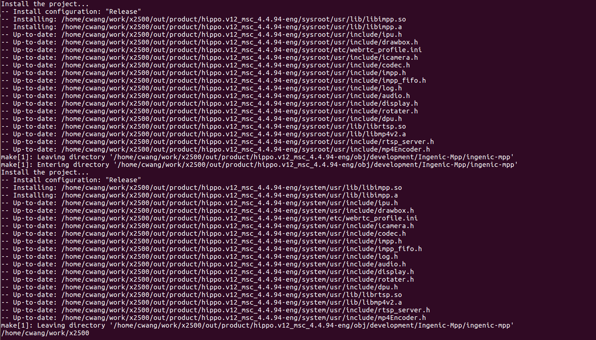图2-1 部分安装打印信息

然后再进入test目录下各模块相关用例目录下执行**mm**命令编译用例，其可执行程序生成的默认位置在`工程顶层目录/out/product/hippo.v12_msc_4.4.94-eng/system/testsuite/impp-example/`目录下（以Hippo V1.2 kernel-4.4环境为例），如图2-2所示（此处仅编译了img2D-example目录下的使用示例）。

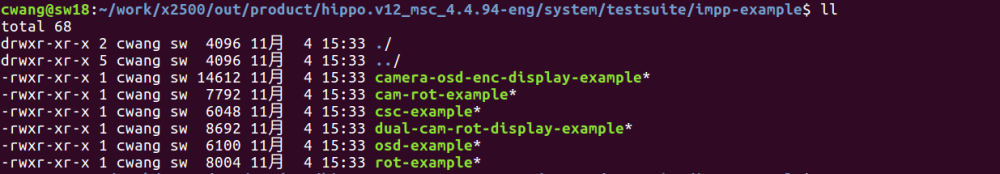图2-2 编译test/img2D-example目录下IPU模块和Rotater模块相关用例的结果

编译完用例之后可以在工程顶层目录下执行**make post-image**打包文件系统镜像（包括IMPP用例的可执行程序、库文件等），然后将生成的文件系统镜像文件烧录到开发板里，在开发板的`/testsuite/impp-example/`目录下存储着IMPP用例的可执行程序，如图2-3所示，`/usr/lib/`目录下存储着IMPP库文件，如图2-4所示。

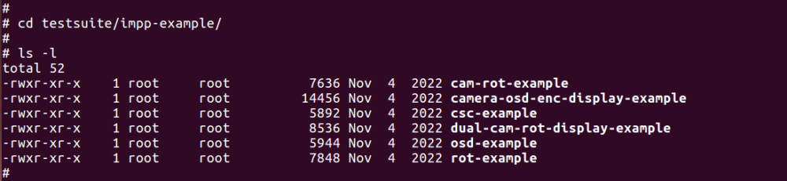图2-3 开发板中IMPP用例可执行程序的位置

图2-4 开发板中IMPP库文件的存储位置

如果需要在编译时将生成的可执行程序存储到当前路径下，则可以通过修改Build.mk文件实现，具体的修改方法参见图2-5所示（以Camera模块的使用示例为参考），通过**mm**命令编译的结果如图2-6所示。最后可以将生成的可执行程序push到开发板里进行运行。

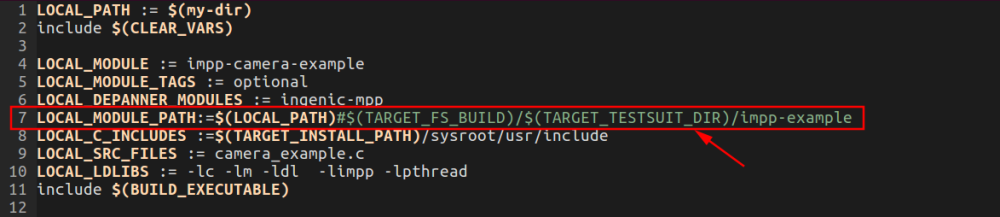图2-5 Build.mk的修改内容

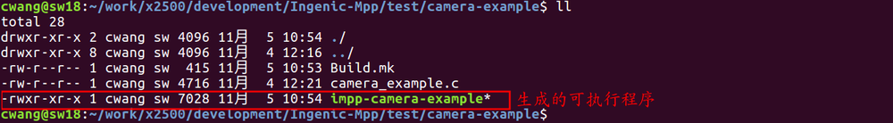图2-6 编译生成的可执行程序

# 3 audio_test目录下的使用示例

## 3.1 目录结构

```
xxx@xxx:xxx/development/Ingenic-Mpp/test/audio_test$ tree
.
├── aec_test.c					# 生成aec_test
├── aec_test_x2000.c			# 生成aec_test_x2000
├── ai_aenc_test.c				# 生成ai_aenc_test
├── ai_test.c					# 生成ai_test
├── ao_adec_test.c				# 生成ao_adec_test
├── ao_test.c					# 生成ao_test
├── Build.mk
└── resampler_test.c			# 生成resampler_test

0 directories, 8 files
```

## 3.2 ai_test使用示例

**ai_test用例的主要功能是录音并输出保存为一个pcm音频文件**。用例的使用可以通过 **./ai_test -h** 进行查看帮助信息，如下图3-2-1所示。需要注意的是，**X2500的AMIC支持 1(mono)、2(stereo) 通道，而X2000的AMIC仅支持 1(mono) 通道（受限于限制于ICODEC）。X2500与X2000的DMIC支持1/2/3/4通道进行录音，不支持设置录音音量值（用例代码内部已做处理）**。下面这个例子是通过AMIC以双声道16KHz采样频率进行录音，并将录音音量设置为80，输出的PCM音频文件保存为ai_test_save.pcm，如下图3-2-2和图3-2-3所示。

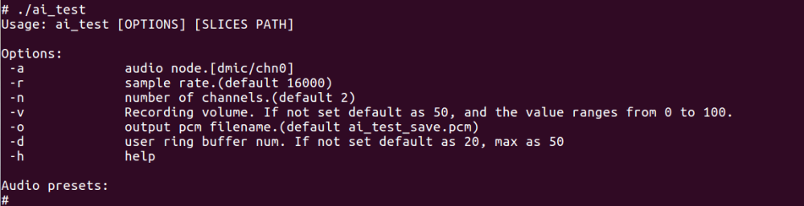图3-2-1 ai_test帮助信息

图3-2-2 上述例子的录音命令

图3-2-3 生成的PCM音频文件

## 3.3 ao_test使用示例

**ao_test使用示例的主要功能是播放一个PCM音频文件**。用例的使用可以通过 **./ao_test -h** 查看帮助信息，如下图3-3-1所示。下面这个例子是播放上述3.2中ai_test录制的PCM音频文件，通道数以及采样频率均不需设置（使用默认值），将放音音量设置为80，如下图3-3-2所示。

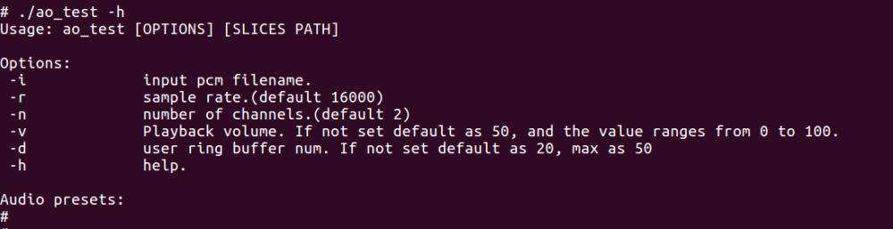图3-3-1 ao_test帮助信息

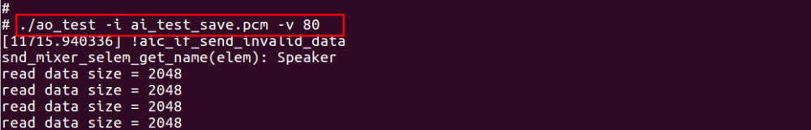图3-3-2 上述例子的录音命令

## 3.3 ai_aenc_test使用示例

**ai_aenc_test使用示例的主要功能是对输入的音频进行编码并保存为音频文件，编码格式支持adpcm、g711a、g711u、g726、aac-adts**。用例的使用可以通过 **./ai_aenc_test -h** 查看帮助信息，如下图3-4-1所示。ai_aenc_test用例是通过AMIC进行录音的，所以需要注意**X2500的AMIC支持 1(mono)、2(stereo) 通道，而X2000的AMIC仅支持 1(mono) 通道（受限于限制于ICODEC）**。下面这个例子是对输入的双声道16KHz采样频率的音频进行g711a编码，并输出保存文件为aenc_test.g711a，如下图3-4-2所示。

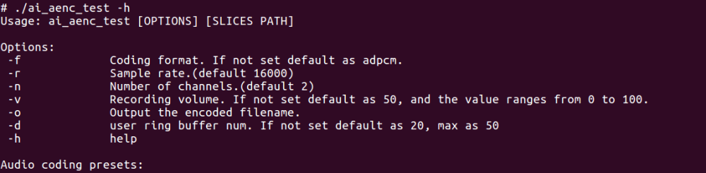图3-4-1 ai_aenc_test帮助信息

图3-4-2 上述例子的音频编码命令

## 3.4 ao_adec_test使用示例

**ao_adec_test使用示例的主要功能是对编码后的音频文件进行解码并播放，同时将解码后的音频数据保存为一个PCM音频文件**。用例的使用可以通过 **./ao_adec_test -h** 查看帮助信息，如下图3-5-1所示。下面的这个例子是解码上述3.4中ai_aenc_test编码后的音频文件，如下图3-5-2所示，解码后生成的PCM音频文件如图3-5-3所示。

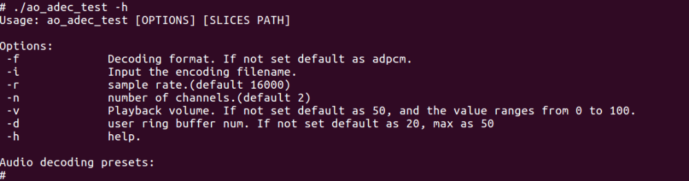图3-5-1 ao_adec_test帮助信息

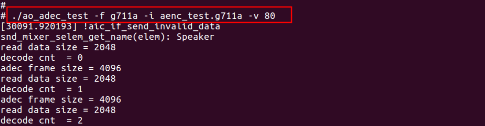图3-5-2 上述例子的音频解码命令

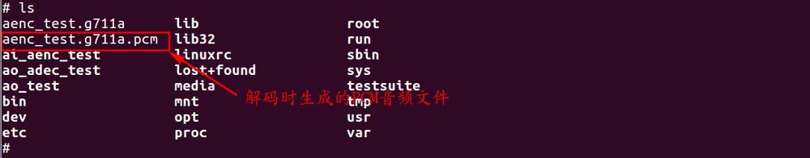图3-5-3 音频解码后生成的PCM音频文件

## 3.5 aec_tes_x2000使用示例

**aec_test_x2000使用示例的主要功能是回声消除，适用于X2000**。使用这个用例需要通过命令行传参，格式是 **./aec_test_x2000 times echofile** ，其中times表示获取一帧音频输入数据的次数，echofile表示需要播放的单声道16KHz采样频率的PCM音频。用例执行结束之后会生成一个单通道16KHz采样频率的PCM音频文件，文件名为aec_save.pcm，如果通过AMIC录取的音频与播放的音频一致，则生成的PCM音频文件是一段静音数据，如果音频不一致，则生成的PCM音频文件只有MIC录制的音频数据。需要注意的是，X2000在使用此功能时需要先配置内核，具体配置如下：

1. 将驱动文件sound/drivers/aloop.c中的module_init()修改成late_initcall()：

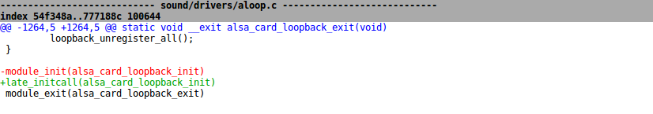图3-6-1 sound/drivers/aloop.c的修改内容

1. 通过make menuconfig配置编译成aloop：

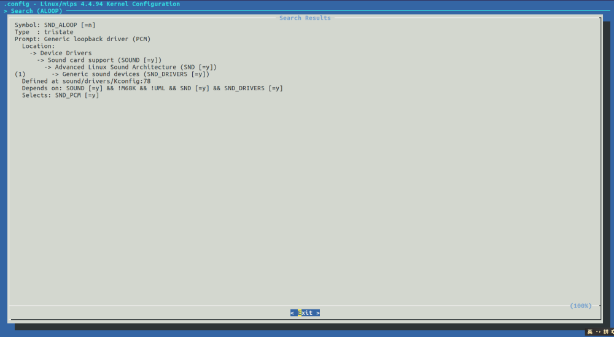图3-6-2 内核aloop配置说明

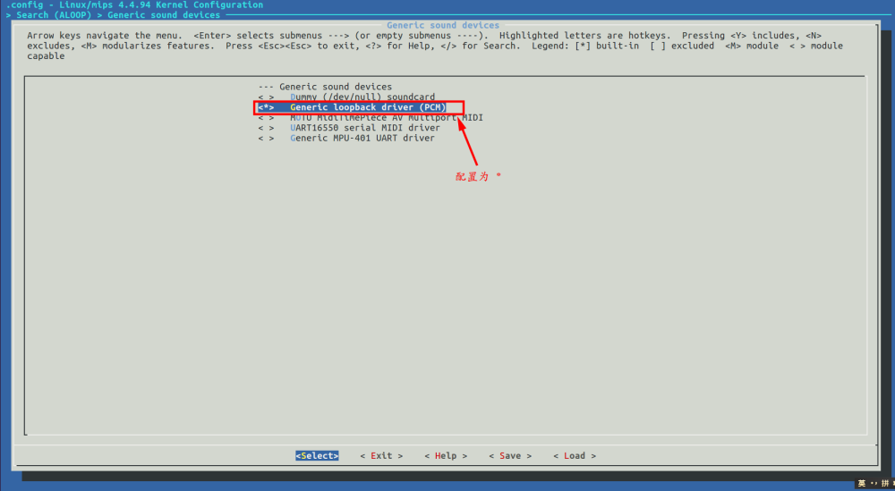图3-6-3 内核aloop驱动配置界面

内核配置完成之后，将编译生成的镜像文件烧录到开发板中，驱动加载成功之后在开发板启动过程中会有相关的打印信息，信息如下图3-6-4所示：

图3-6-4 aloop驱动加载成功的打印信息

回声消除的延迟时间可以通过修改ai.c文件（IMPP Audio Input的源文件，具体的路径为：**工程顶层目录/development/Ingenic-Mpp/src/audio**）进行配置，通过修改AEC_DELAY_MS宏配置其延迟时间（单位：ms），其默认是135ms，如下图3-6-5所示：

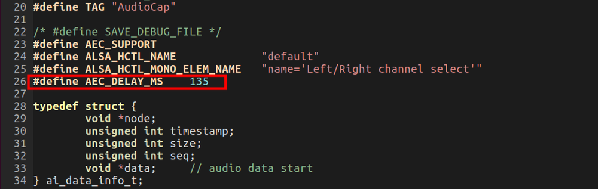图3-6-5 回声消除的延迟时间

修改完ai.c文件后需要重新编译生成库文件，生成的库文件可以push到开发板的/usr/lib目录下或通过将其打包到根文件系统镜像文件烧录到开发板中。

## 3.6 aec_test使用示例

**aec_test使用示例的主要功能是回声消除，适用于x2500**。使用这个用例需要通过命令行传参，格式是 **./aec_test times echofile** ，其中times表示获取一帧音频输入数据的次数，echofile表示需要播放的单声道16KHz采样频率的PCM音频。用例执行结束之后会生成一个单通道16KHz采样频率的PCM音频文件，文件名为aec_save.pcm。

回声消除的延迟时间可以通过修改ai.c文件（IMPP Audio Input的源文件，具体的路径为：**工程顶层目录/development/Ingenic-Mpp/src/audio**）进行配置，通过修改AEC_DELAY_MS宏配置其延迟时间（单位：ms），其默认是135ms，如下图3-7-1所示：

图3-7-1 回声消除的延迟时间

修改完ai.c文件后需要重新编译生成库文件，生成的库文件可以push到开发板的/usr/lib目录下或通过将其打包到根文件系统镜像文件烧录到开发板中。

## 3.7 resampler_test使用示例

**resampler_test使用示例的主要功能是对输入的音频文件进行重采样并输出保存音频文件**。使用这个用例需要通过命令行传参，格式为 **./resampler_test filename insamplerate outsamplerate outfile** ，其中filename是需要进行重采样的音频文件的文件名，insamplerate是源音频数据的采样频率，outsamplerate是输出音频数据的采样频率，outfile是重采样之后的音频文件的文件名。下面这个例子是将上述[3.2](#ai_test使用示例)中ai_test录制的音频文件重采样为32KHz采样频率，并输出保存为resampler_test_save_32000.pcm，如下图3-7-1所示。

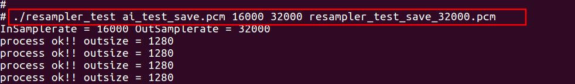图3-7-1 上述例子的音频重采样命令

# 4 camera-example目录下的使用示例

## 4.1 目录结构

```
xxx@xxx:xxx/development/Ingenic-Mpp/test/camera-example$ tree
.
├── Build.mk
└── camera_example.c					# 生成impp-camera-example

0 directories, 2 files
```

## 4.2 impp-camera-example使用示例

**impp-camera-example使用示例的主要功能是拍摄一张图片并保存，默认图像像素格式是NV12**。用例的使用可以通过 **./impp-camera-example -H** 查看帮助信息，如下图4-2-1所示。需要注意的是，**X2500 ISP最大输出分辨率是3840x2160，X2000 ISP最大输出分辨率是2048x2048**。下面这个例子是通过video4节点拍摄一张1920x1080分辨率的NV21格式的图片，并输出保存为camera_1920x1080_nv21.yuv，命令如下图4-2-2所示。

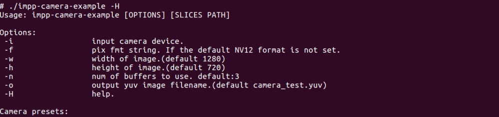图4-2-1 impp-camera-example帮助信息

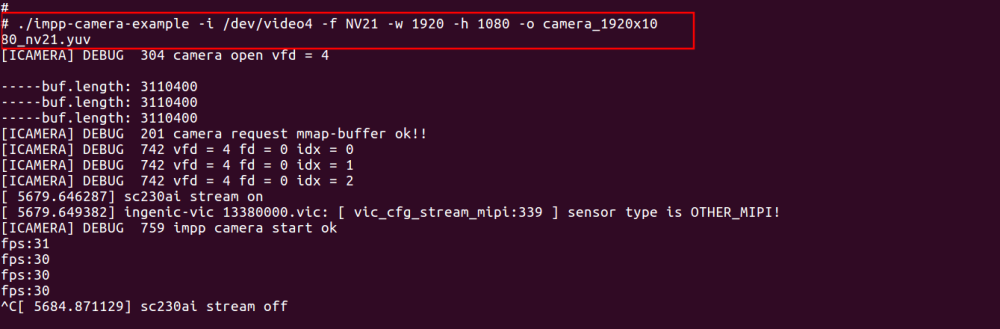图4-2-2 上述例子的取图命令

# 5 codec-example目录下的使用示例

## 5.1 目录结构

```
xxx@xxx:xxx/development/Ingenic-Mpp/test/codec-example$ tree
.
├── bs.h
├── Build.mk
├── camera_h264enc_test_v1.c				# 生成camera-h264enc
├── camera_h265enc_test_v1.c				# 生成camera-h265enc
├── camera_jpegenc_test.c					# 生成camera-jpegenc
├── dual_camera_h264enc_h265enc.c			# 生成dual-camera-h264enc-h265enc
├── dual_camera_h264enc_test_v1.c			# 生成dual-camera-h264enc
├── file_jpegenc_x2000_test.c				# 生成file-jpegenc-x2000-example
├── file_jpegenc_x2500_test.c				# 生成file-jpegenc-x2500-example
├── file_jpegenc_x2600_test.c				# 生成file-jpegenc-x2600-example
├── h264dec_convert_tile420_to_nv12_test.c  # 生成h264dec-convert-tile420-to-nv12-x2000-example
├── h264dec_test.c							# 生成h264dec-example 
├── h264dec_test_fb_memcpy.c                # 生成h264dec-example-fb-memcpy
├── h264dec_test_thread.c                   # 生成h264dec-example-thread
├── jpegdec_test.c							# 生成jpegdec-example
└── jpegdec_x2600_test.c					# 生成jpegdec-x2600-example

0 directories, 16 files
```

## 5.2 camera-h264enc使用示例

**camera-h264enc使用示例的主要功能是将单路摄像头数据进行H264编码，并保存输出码流数据**。用例的使用可以通过 **./camera-h264enc -H** 查看帮助信息，如下图5-2-1所示，其中通过`-f`选项指定输入原始数据的格式，可以指定的参数为：`NV12`、`NV21`、`YUV420P`、`I420`，如果不指定，则默认为NV12格式。下面这个这个例子是将video4节点输出的1920x1080分辨率的图像数据进行H264编码，并将输出的码流数据保存为camera_1920x1080_enc_out.h264，命令如下图5-2-2所示。生成的码流文件可以通过ffplay或vlc进行查看。以X2500为例，如果说在编码分辨率较大的数据时，出现下图5-2-3所示的错误时（保留内存不足导致的，也有可能是最大帧率设置的问题），可以优先尝试通过修改设备树扩大保留内存解决，如图5-2-4所示将保留内存扩大至64MiB。需要注意**X2500 H264编码3840x2160分辨率时需要将帧率设置到20fps以下，X2000最大支持1080P分辨率进行编码**。

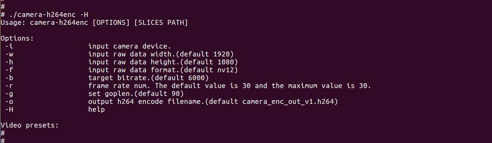图5-2-1 camera-h264enc帮助信息

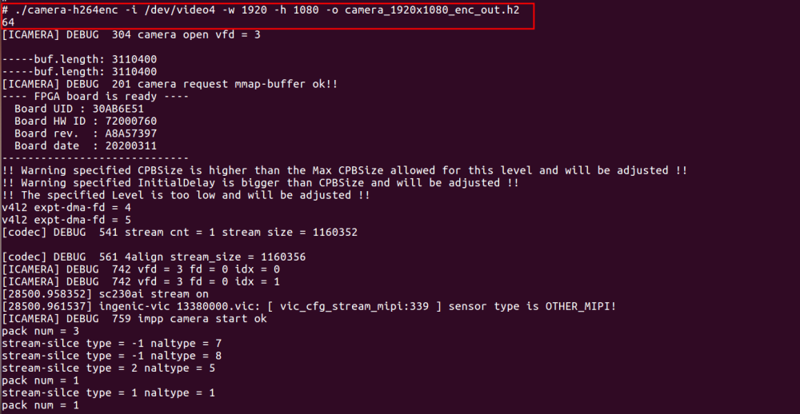图5-2-2 上述例子的编码命令

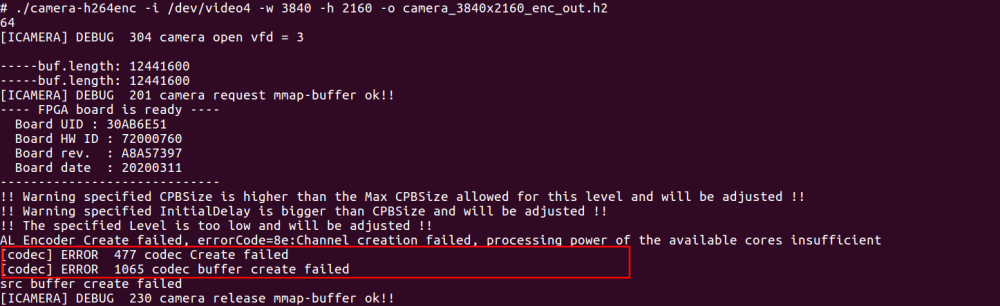图5-2-3 编码3840x2160分辨率时的报错信息

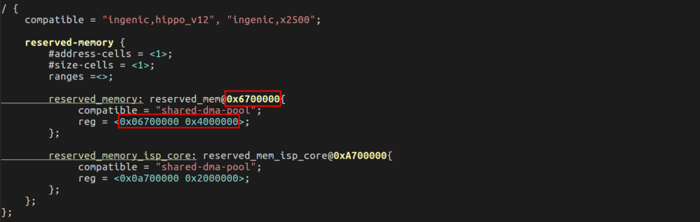图5-2-4 Hippo开发板将保留内存扩大至64MiB

## 5.3 camera-h265enc使用示例

**camera-h265enc使用示例的主要功能是将单路摄像头数据进行H265编码，并保存输出码流数据，仅X2500支持**。用例的使用可以通过 **./camera-h265enc -H** 查看帮助信息，如下图5-3-1所示，其中通过`-f`选项指定输入原始数据的格式，可以指定的参数为：`NV12`、`NV21`、`I420`，如果不指定，则默认为NV12格式。下面这个这个例子是以2M码率将video4节点输出的1920x1080分辨率的图像数据进行H265编码，并将输出的码流数据保存为camera_1920x1080_h265enc_out.h265，命令如下图5-3-2所示。生成的码流文件可以通过ffplay或vlc进行查看。如果说在编码分辨率较大的数据时出错，可参考5.2解决。

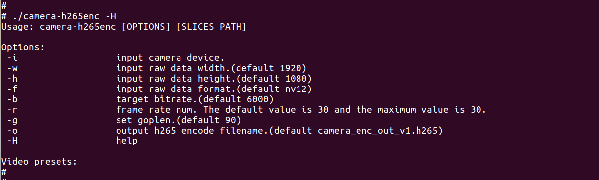图5-3-1 camera-h265enc帮助信息

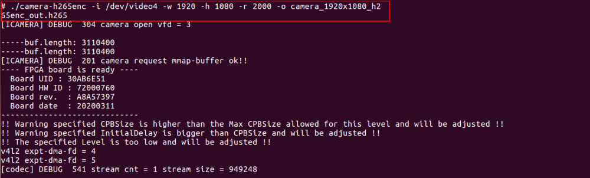图5-3-2 上述例子的编码命令

## 5.4 file-jpegenc-x2000-example使用示例

**file-jpegenc-x2000-example使用示例的主要功能是对一张NV12格式或NV21格式的图片进行JPEG编码，适用于x2000**。用例的使用可以通过 **./file-jpegenc-x2000-example -H** 查看帮助信息，如下图5-4-1所示，其中通过`-f`选项指定输入原始数据的格式，可以指定的参数为：`NV12`、`NV21`。下面这个例子是对一张1920x1080分辨率的NV12格式的图片进行JPEG编码，并将编码后的文件保存为file_1920x1080_jpegenc.jpg，命令如下图5-4-2所示。需要注意**X2000最大支持1080P分辨率进行JPEG编码**。

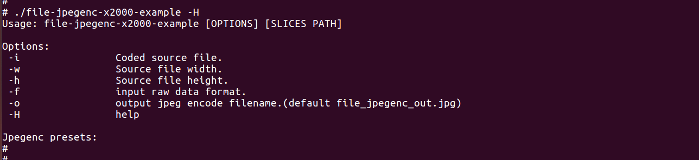图5-4-1 file-jpegenc-x2000-example帮助信息

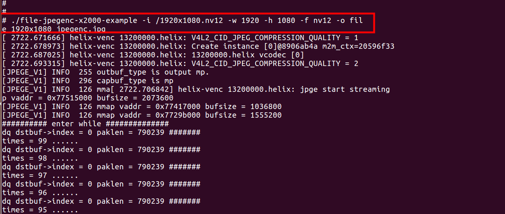图5-4-2 上述例子的编码命令

## 5.5 file-jpegenc-x2500-example使用示例

**file-jpegenc-x2500-example使用示例的主要功能是对一张NV12格式或NV21格式或NV16格式的图片进行JPEG编码，仅适用X2500**。用例的使用可以通过 **./file-jpegenc-x2500-example -H** 查看帮助信息，如下图5-5-1所示，其中通过`-f`选项指定输入原始数据的格式，可以指定的参数为：`NV12`、`NV21`、`NV16`。下面这个例子是对一张1920x1080分辨率的NV12格式的图片进行JPEG编码，并将编码后的文件保存为file_1920x1080_jpegenc.jpg，命令如下图5-5-2所示。

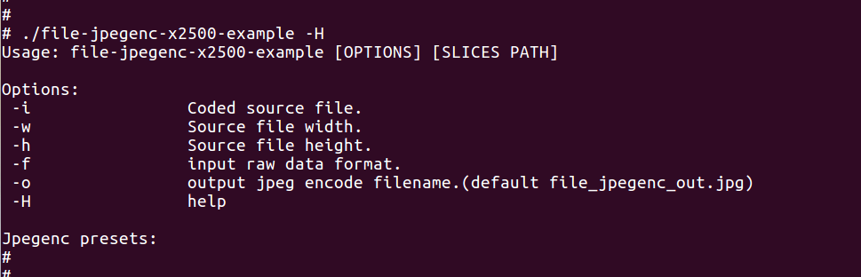图5-5-1 file-jpegenc-x2500-example帮助信息

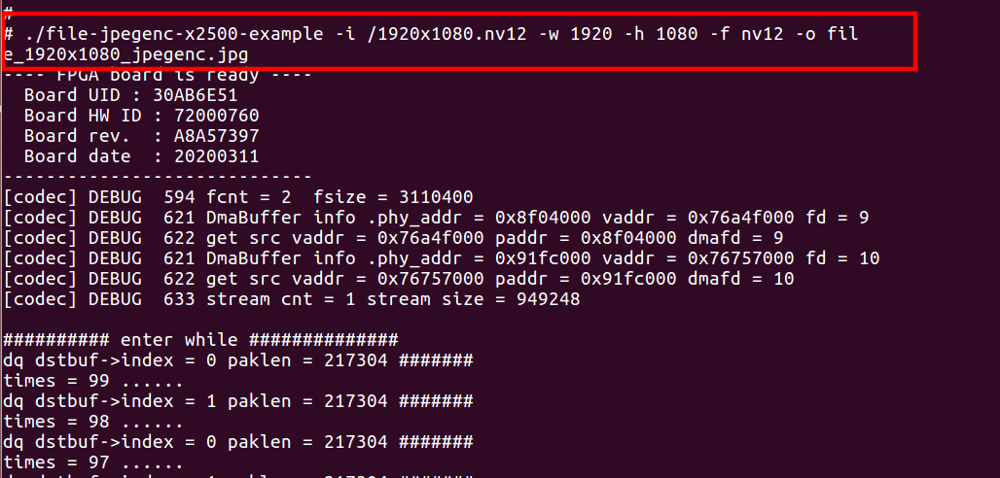图5-5-2 上述例子的编码命令

## 5.6 file-jpegenc-x2600-example使用示例

**file-jpegenc-x2600-example使用示例的主要功能是对一张指定格式的图片进行JPEG编码，适用于X2600**。用例的使用可以通过`./file-jpegenc-x2600-example -H`查看帮助信息，如下图5-6-1所示，其中通过`-f`选项指定输入原始数据的格式（图片格式），可以指定的参数为：`NV12`、`NV21`、`YUV444`、`YUYV`、`RGB888`、`RGBA8888`、`BGRA8888`、`GREY`。下面这个例子是对一张1280x720分辨率的NV12格式的图片进行JPEG编码，并将编码后的文件保存为file_1280x720_jpegenc.jpg，命令如下图5-6-2所示。

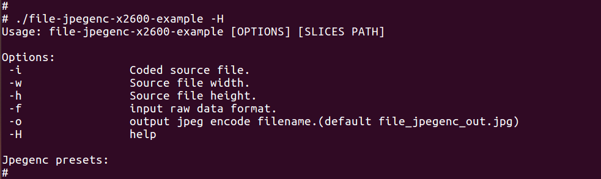图5-6-1 file-jpegenc-x2600-example帮助信息

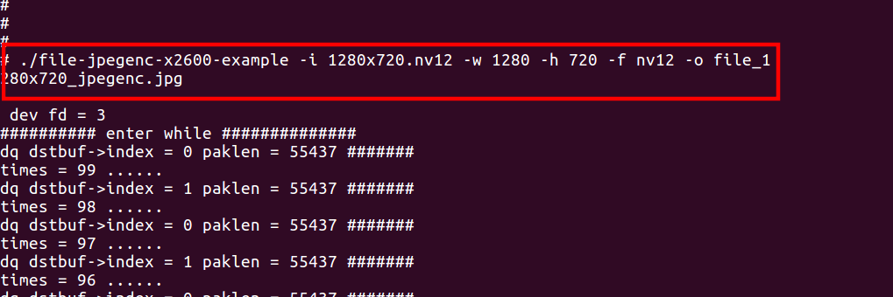图5-6-2 上述例子的编码命令

## 5.7 camera-jpegenc使用示例

**camera-jpegenc使用示例的主要功能是进行单路摄像头数据的JPEG编码，并保存输出jpg文件**。用例的使用可以通过 **./camera-jpegenc -H** 查看帮助信息，如下图5-7-1所示，其中通过`-f`选项指定的输入原始数据格式可以是以下参数：`NV12`、`NV21`、`NV16`、`YUV444`、`YUYV`、`RGB888`、`RGBA8888`、`BGRA8888`、`GREY`，如果不指定，则默认为NV12格式。下面这个例子是将video4节点输出的1920x1080分辨率的图像数据进行JPEG编码，并输出保存为camera_1920x1080_jpegenc.jpg，命令如下图5-7-2所示。需要注意**X2000最大支持1080P分辨率进行JPEG编码**。

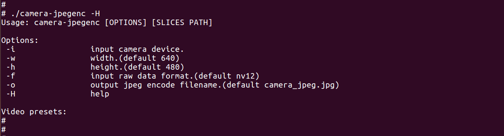图5-7-1 camera-jpegenc帮助信息

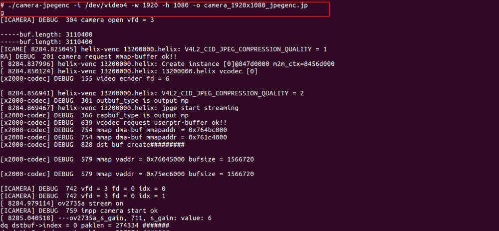图5-7-2 上述例子的编码命令

## 5.8 dual-camera-h264enc使用示例

**dual-camera-h264enc使用示例的主要功能是双路摄像头数据的H264编码**。用例的使用可以通过 **./dual-camera-h264enc -s** 查看帮助信息，如下图5-8-1所示，其中通过`-f`和`-F`选项指定的输入原始格式可以是以下格式参数：`NV12`、`NV21`、`YUV420P`、`I420`，如果不指定，则默认为NV12格式。下面的例子是将video4节点输出的1920x1080分辨率的图像数据进行H264编码，并将输出的码流数据保存为camera_1920x1080_h264enc.h264，将video8节点输出的1280x720分辨率的图像数据进行H264编码，并将输出的码流数据保存为camera_1280x720_h264enc.h264，命令如下图5-8-2所示。如果X2500出现如图5-8-3的报错信息，X2000出现如图5-8-4的报错信息，可以尝试通过修改设备树扩大保留内存解决。如图5-8-5所示将保留内存扩大至48MiB解决了在X2000中进行双路1920x1080分辨率的H264编码时出现了如图5-8-4所示的报错信息的问题。需要注意**X2500 H264编码3840x2160分辨率时需要将帧率设置到20fps以下，X2000最大支持1080P分辨率进行编码**。

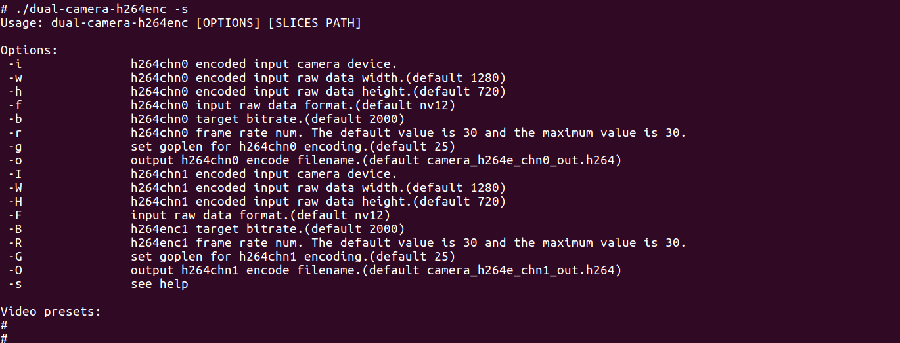图5-8-1 dual-camera-h264enc帮助信息

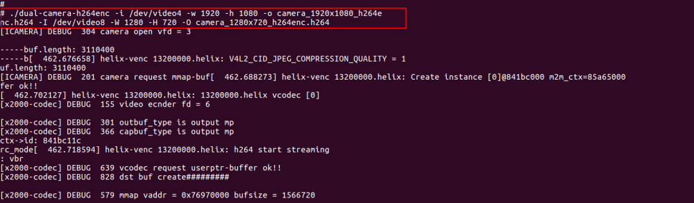图5-8-2 上述例子的编码命令

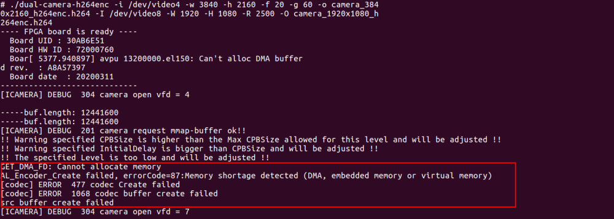图5-8-3 X2500报错信息

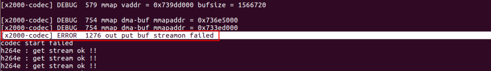图5-8-4 X2000报错信息

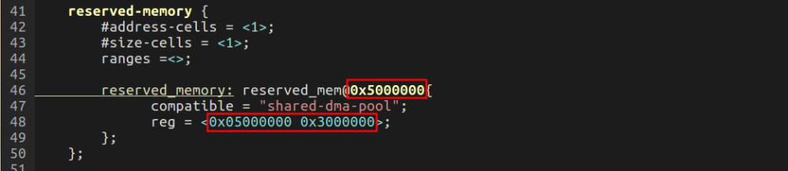图5-8-5 X2000将保留内存修改为48MiB

## 5.9 dual-camera-h264enc-h265enc使用示例

**dual-camera-h264enc-h265enc使用示例的主要功能是一路摄像头数据进行H264编码，一路摄像头数据进行H265编码， 并都输出保存码流数据**。需要注意本用例**仅适用于X2500**。用例可以通过 **./dual-camera-h264enc-h265enc -s** 查看帮助信息，如图5-9-1所示，其中通过`-f`和`-F`选项指定的输入原始格式可以是以下格式参数：`NV12`、`NV21`、`I420`，如果不指定，则默认为NV12格式。下面这个例子是将video4节点输出的1920x1080分辨率的图像数据进行H264编码，并将输出的码流数据保存为camera_1920x1080_h264enc.h264，将video5节点输出的1280x720分辨率的图像数据进行H265编码，并将输出的码流数据保存为camera_1280x720_h265enc.h265，命令如下图5-9-2所示。

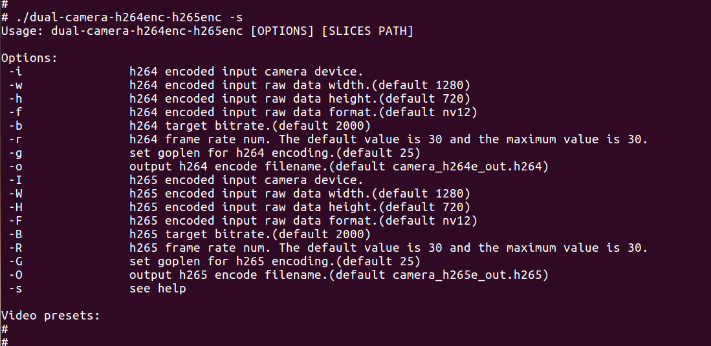图5-9-1 dual-camera-h264enc-h265enc帮助信息

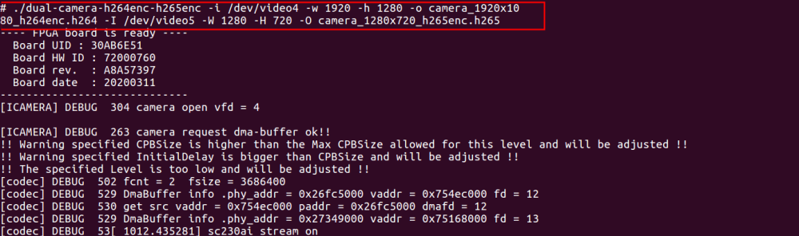图5-9-2 上述例子的执行命令

## 5.10 h264dec-example使用示例

**h264dec-example使用示例的主要功能是将一个H264编码的码流文件进行解码（NV12格式）并通过LCD进行显示（通过共享Buffer的方式显示）**。用例的使用可以通过 **./h264dec-example -h** 查看帮助信息，如下图5-10-1所示。用例在执行之前需要配置内核，具体的配置分别如图5-10-2和5-10-3所示。下面这个例子是对一个1280x720分辨率大小的H264编码的码流文件进行解码并通过`/dev/fb0`以NV12格式进行显示，命令如下图5-10-4所示。如果需要解码的文件的分辨率大于1280x720，则需要修改设备树进行配置layer-framesize，如下图5-10-5所示在解码1920x1072分辨率大小的H264编码码流文件时将Layer0的Max framesize修改成1920x1072用于LCD显示。需要注意此用例**适用于X2000、X2600**。

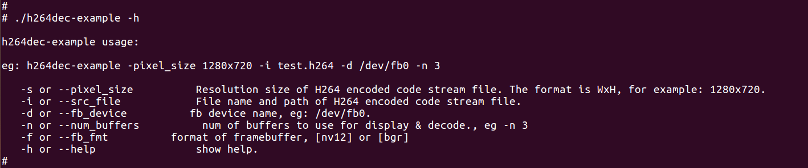图5-10-1 h264dec-example帮助信息

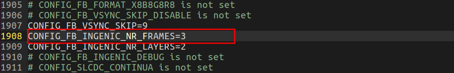图5-10-2 .config文件的配置内容

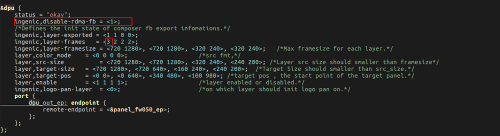图5-10-3 设备树的修改内容

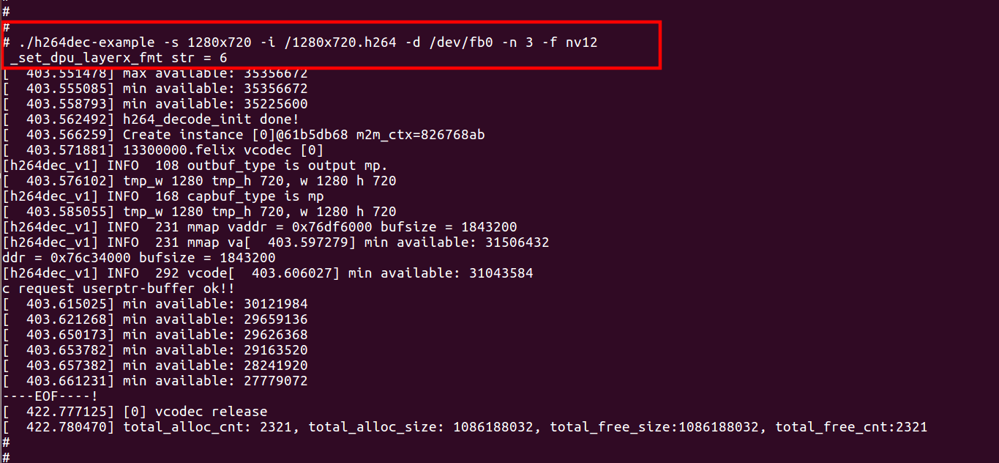图5-10-4 上述例子的解码命令

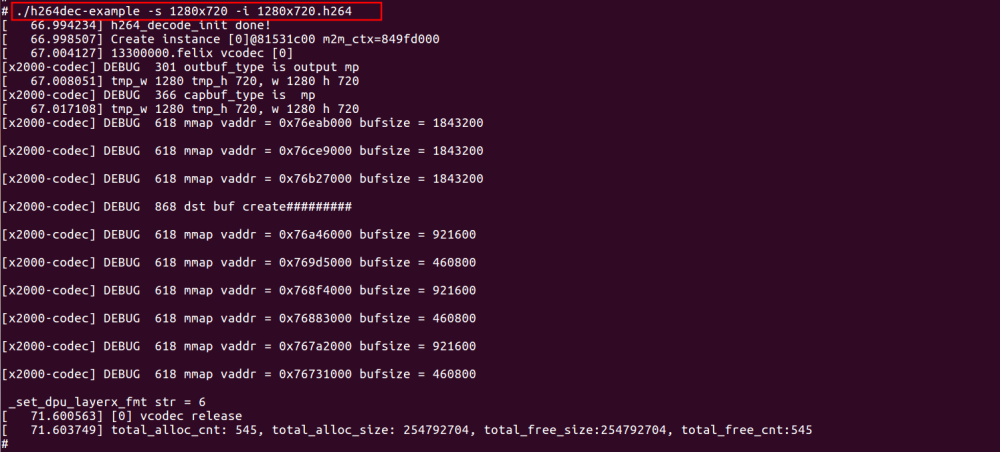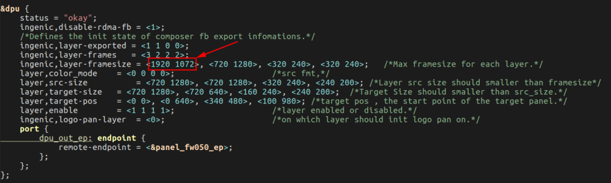图5-10-5 layer-framesize的配置

## 5.11 h264dec-example-fb-memcpy使用示例

**h264dec-example-fb-memcpy使用示例的主要功能是将一个H264编码的码流文件进行解码（NV12格式）并通过LCD进行显示（通过将H264解码输出的数据拷贝到FrameBuffer中的方式进行显示）**。用例的使用可以通过 **./h264dec-example-fb-memcpy -h** 查看帮助信息，如下图5-11-1所示。用例在执行之前需要配置内核，具体的配置分别如图5-11-2和5-11-3所示。下面这个例子是对一个1280x720分辨率大小的H264编码的码流文件进行解码并通过`/dev/fb0`以NV12格式进行显示，命令如下图5-11-4所示。如果需要解码的文件的分辨率大于1280x720，则需要修改设备树进行配置layer-framesize，如下图5-11-5所示在解码1920x1072分辨率大小的H264编码码流文件时将Layer0的Max framesize修改成1920x1072用于LCD显示。需要注意此用例**适用于X2000、X2600**。

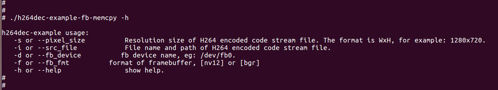图5-11-1 h264dec-example-fb-memcpy帮助信息

图5-11-2 .config文件的配置内容

图5-11-3 设备树的修改内容

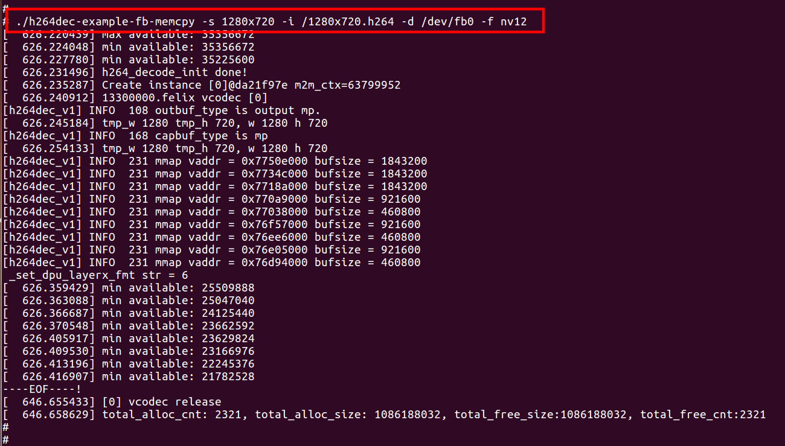图5-11-4 上述例子的解码命令

图5-11-5 layer-framesize的配置

## 5.12 h264dec-example-thread使用示例

**h264dec-example-thread使用示例的主要功能是将一个H264编码的码流文件进行解码（NV12格式）并通过LCD以NV12格式进行显示（通过共享Buffer的方式进行显示，相比于`h264dec-example`使用示例新增了一个线程进行处理）**。用例的使用可以通过 **./h264dec-example-thread -h** 查看帮助信息，如下图5-12-1所示。用例在执行之前需要配置内核，具体的配置分别如图5-12-2和5-12-3所示。下面这个例子是对一个1280x720分辨率大小的H264编码的码流文件进行解码并通过`/dev/fb0`以NV12格式进行显示，命令如下图5-12-4所示。如果需要解码的文件的分辨率大于1280x720，则需要修改设备树进行配置layer-framesize，如下图5-12-5所示在解码1920x1072分辨率大小的H264编码码流文件时将Layer0的Max framesize修改成1920x1072用于LCD显示。需要注意此用例**适用于X2000、X2600**。

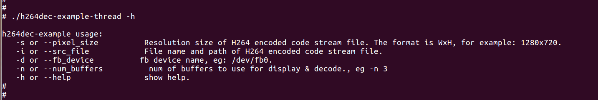图5-12-1 h264dec-example-thread帮助信息

图5-12-2 .config文件的配置内容

图5-12-3 设备树的修改内容

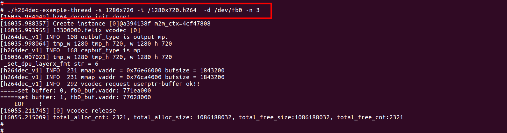图5-12-4 上述例子的解码命令

图5-12-5 layer-framesize的配置

## 5.13 h264dec-convert-tile420-to-nv12-x2000-example使用示例

**h264dec-convert-tile420-to-nv12-x2000-example使用示例的主要功能是将一个H264编码的码流文件解码成TILE420格式然后在将其转为NV12格式并通过LCD进行显示**。用例的使用可以通过 **./h264dec-convert-tile420-to-nv12-x2000-example -h** 查看帮助信息，如下图5-13-1所示。用例在执行之前需要配置内核，具体的配置分别如图5-13-2和5-13-3所示。下面这个例子是对一个1280x720分辨率大小的H264编码的码流文件进行解码并通过`/dev/fb0`以NV12格式进行显示，命令如下图5-13-4所示。如果需要解码的文件的分辨率大于1280x720，则需要修改设备树进行配置layer-framesize，如下图5-13-5所示在解码1920x1072分辨率大小的H264编码码流文件时将Layer0的Max framesize修改成1920x1072用于LCD显示。需要注意此用例**仅适用于X2000**。

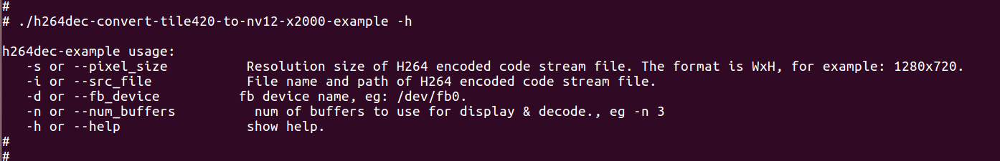图5-13-1 h264dec-convert-tile420-to-nv12-x2000-example帮助信息

图5-13-2 .config文件的配置内容

图5-13-3 设备树的修改内容

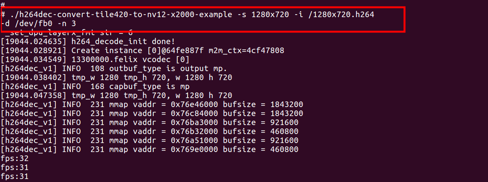图5-13-4 上述例子的解码命令

图5-13-5 layer-framesize的配置

## 5.14 jpegdec-example使用示例

**jpegdec-example使用示例的主要功能是将一张JPEG文件解码为NV12格式并输出保存**。用例的使用可以通过 **./jpegdec-example -h** 查看帮助信息，如下图5-14-1所示。下面这个例子是将一张分辨率为1280x720的jpeg图片解码为NV12格式并输出保存为1280x720.nv12，命令如下图5-14-2所示。需要注意的是此用例**适用于X2000**。

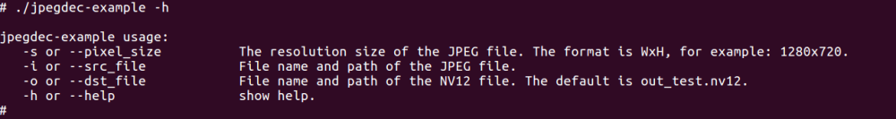图5-14-1 jpegdec-example帮助信息

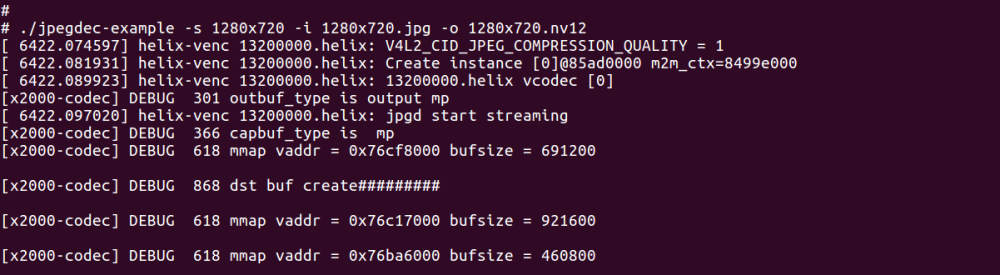图5-14-2 上述例子的解码命令

## 5.15 jpegdec-x2600-example使用示例

**jpegdec-x2600-example使用示例的主要功能是将一张JPEG文件解码为指定格式并输出保存，适用于X2600**。用例的使用可以通过`./jpegdec-x2600-example -h`查看帮助信息，如下图5-15-1，通过`-f`选项指定目标输出文件的格式，可以是以下格式：`NV12`、`NV21`、`YUV444`、`YUYV`、`RGB888`、`BGRA8888`。下面这个例子是将一张分辨率为1280x720的jpeg图片解码为NV12格式并输出保存为1280x720.nv12，命令如下图5-15-2所示。

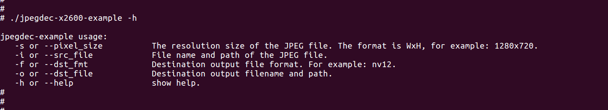图5-15-1 jpegdec-x2600-example帮助信息

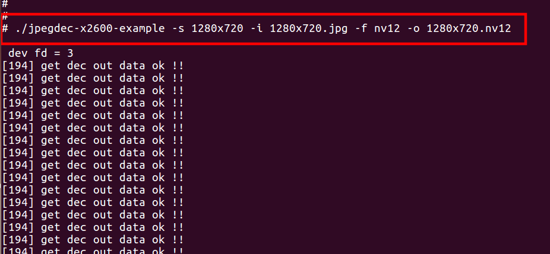图5-15-2 上述例子的解码命令

# 6 dispaly-example目录下的使用示例

## 6.1 目录结构

```
xxx@xxx:xxx/development/Ingenic-Mpp/test/display-example$ tree
.
├── Build.mk
├── camera_pic_dpu_osd_switch_order.c			# 生成camera-pic-dpu-osd-switch-order-example
├── dpu_camera_test.c							# 生成dpu-camera-example
├── dpu_osd_test.c								# 生成dpu-osd-example
├── sample_lcd_comp_test.c						# 生成display-comp-example
└── sample_lcd_comp_usrptr_test.c				# 生成display-usrptr-example
├── sample_lcd_pic_test.c                       # 生成display-pic-example
├── simple_lcd_comp_local_alpha_test.c          # 生成display-comp-local-alpha-example
├── simple_lcd_comp_test.c                      # 生成display-comp-extend-example
└── simple_lcd_pic_test.c                       # 生成display-pic-extend-example

0 directories, 10 files
```

## 6.2 内核配置说明

内核默认配置为Composer模式，如需要使用RDMA模式，需要对设备树进行相应的修改，如下图6-2-1所示。在使用DPU模块时，需要配置成RDMA模式，如果没有配置，则会出现如图6-2-2所示的错误。

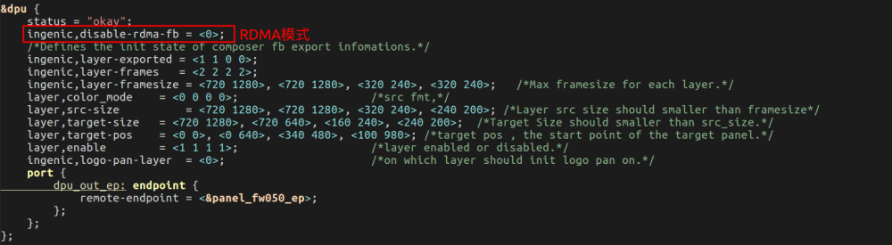图6-2-1 配置RDMA模式

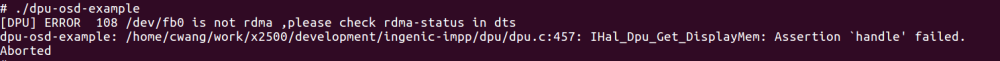图6-2-2 未修改设备树时使用DPU模块的报错信息

另外，如果使用的是源文件名以s**i**mple开头（带SimpleFB的API）的测试用例，则需要选择WIP的DPU驱动，具体配置方法参见下图6-2-3所示。

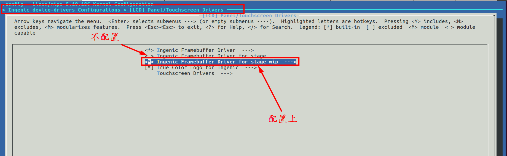图6-2-3 配置选择WIP的DPU驱动的方法

## 6.3 dpu-osd-example使用示例

**dpu-osd-example使用示例的主要功能是将一张640x480的NV12格式的图片缩放成320x240大小之后叠加到一张720x1280的BGRA8888格式的图片上，并循环的改变DPU输入信息（BGRA8888格式图片的裁剪信息、NV12格式图片的叠加起始坐标信息）**。本用例的使用需要在开发板的当前目录下存放两张图片，分别为ffmpeg_720x1280_bgra.rgb、640x480.nv12，如下图6-3-1所示。通过 **./dpu-osd-example** 运行程序之后，观察屏幕上的现象。

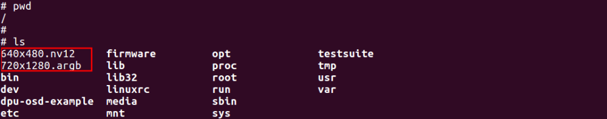图6-3-1 执行dpu-osd-example所需的文件

## 6.4 dpu-camera-example使用示例

**dpu-camera-example使用示例的主要功能是将一路Camera（video8）的数据经缩放后叠加到另一路Camera（video4）数据经裁剪放大后的图像数据上**。用例的使用通过 **./dpu-camera-example** 运行，运行之后观察屏幕上的现象。

## 6.5 camera-pic-dpu-osd-switch-order-example使用示例

**camera-pic-dpu-osd-switch-order-example使用示例的主要功能是每2s互换Camera（video4）与图片（640x480.rgb565）的Order**。用例的使用通过 **./camera-pic-dpu-osd-switch-order-example** 运行，运行之后观察屏幕上的现象会发现在将Camera的数据放到顶层之后屏幕会变暗，是因为在将其切换到顶层时降低了透明度。

## 6.6 display-comp-example使用示例

**display-comp-example使用示例的主要功能是基于Composer模式将Camera（video4）的数据显示在屏幕上，其中上半屏是将Camera数据缩放成720x640的大小进行显示，下半屏是将Camera的数据裁剪后缩放成720x640的大小进行显示**。用例的使用通过 ./display-example 运行，运行之后观察LCD上的现象。

## 6.7 display-usrptr-example使用示例

**display-usrptr-example使用示例是基于Composer模式将双路Camera数据显示在LCD上**。在使用此用例之前需要修改 .config 文件与设备树进行配置framebuffers，.config文件的修改内容如图6-7-1所示，设备树的修改内容如图6-7-2所示。用例的使用通过 **./display-usrptr-example** 运行，运行之后观察屏幕上的现象。

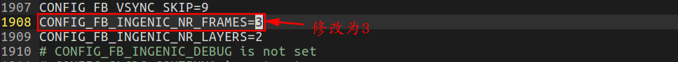图6-7-1 .config的修改内容

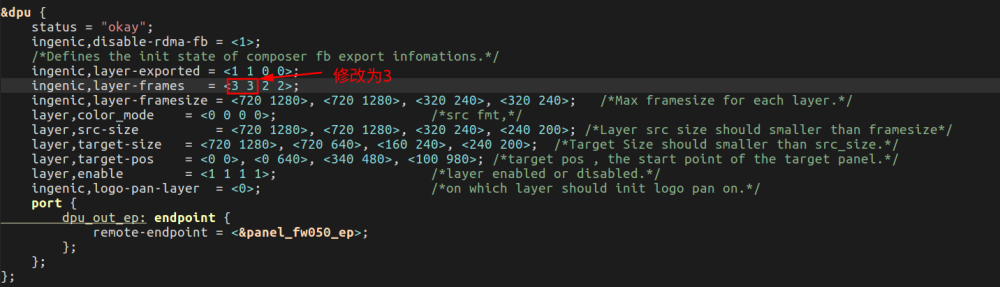图6-7-2 设备树的修改内容

## 6.8 display-pic-example使用示例

**display-pic-example使用使用的主要功能是将一张指定格式的图片显示在屏上**。用例的使用可以通过 **./display-pic-example -H** 查看帮助信息，如下图6-8-1所示，其中通过`-f`选项指定图片的格式，支持的格式参数如下：`BGR888`、`BGRA8888`、`RGB555`（rgb555le）、`RGB565`（rgb565le）、`YUYV`、`NV12`、`NV21`。下面这个例子是将一张720x1280分辨率大小的RGB555（RGB555LE）格式图片显示在`/dev/fb0`上，命令如下图6-8-2所示。

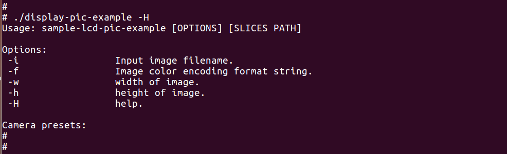图6-8-1 display-pic-example帮助信息

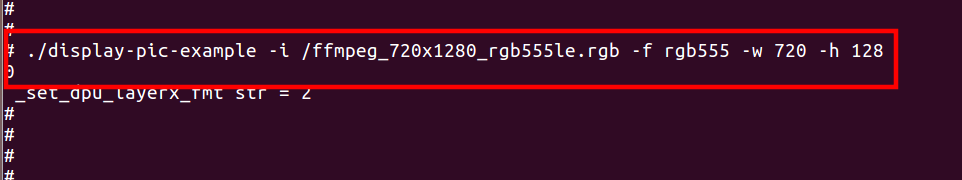图6-8-2 上述例子的命令

## 6.9 display-comp-extend-example使用示例

**display-comp-extend-example使用示例的主要功能是基于Composer模式将Camera的数据显示在屏幕上**。用例的使用通过 ./display-comp-extend-example 运行，运行之后观察LCD上的现象。

## 6.10 display-comp-local-alpha-example使用示例

**display-comp-local-alpha-example使用示例的主要功能是用于在屏上显示一张图片，显示图片时局部透明度显示**。在使用该用例时需要在`/storage`目录下存放一张名为`scale1.yuv`的NV12图片，该图片宽高为320x800，然后通过 ./display-comp-local-alpha-example 运行，运行之后观察LCD上的现象。

## 6.11 display-pic-extend-example使用示例

**display-pic-extend-example使用使用的主要功能是将一张指定格式的图片显示在屏上**。用例的使用可以通过 **./display-pic-extend-example -H** 查看帮助信息，如下图6-11-1所示，其中通过`-f`选项指定图片的格式，支持的格式参数如下：`BGR888`、`BGRA8888`、`RGB555`（rgb555le）、`RGB565`（rgb565le）、`YUYV`、`NV12`、`NV21`。下面这个例子是将一张720x1280分辨率大小的RGB555（RGB555LE）格式图片显示在`/dev/fb0`上，命令如下图6-11-2所示。

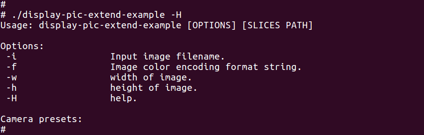图6-11-1 display-pic-extend-example帮助信息

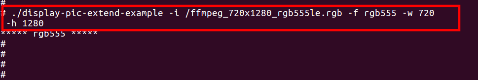图6-11-2 上述例子的命令

# 7 img2D-example目录下的使用示例

## 7.1 目录结构

```
cwang@sw18:~/work/x2000/development/Ingenic-Mpp/test/img2D-example$ tree
.
├── Build.mk
├── camera_csc_test.c							# 生成cam-csc-example
├── camera_osd_enc_display.c					# 生成camera-osd-enc-display-example
├── camera_pic_osd_display_test.c				# 生成cam-pic-osd-dispaly-example
├── camera_pic_rotater_csc_dpu_osd_test.c		# 生成cam-pic-rot-csc-dpu-osd-example
├── cam_rotate_test.c							# 生成cam-rot-example
├── csc_test.c									# 生成csc-example
├── drawbox_test.c								# 生成drawbox-example
├── dual_cam_rot_display_test.c					# 生成dual-cam-rot-display-example
├── osd_test.c									# 生成osd-example
├── rotate_test_x2000.c							# 生成rotator-x2000-example
└── rotate_test_x2500.c							# 生成rotator-x2500-example

0 directories, 12 files
```

## 7.2 csc-example使用示例

**csc-example使用示例的主要功能是对一张NV12格式的图片进行颜色空间转换，输出格式支持ABGR8888、ARGB8888、BGRA8888、BGRX8888、HSV、NV12、NV21、RGBA8888、RGBX8888**。用例的使用可以通过 **./csc-example -h** 查看帮助信息，如下图7-2-1所示。下面这个例子是将一张1280x720分辨率大小的NV12格式图片转换为ARGB8888格式，并将文件输出保存为csc_1280x720.argb，命令如下图7-2-2所示。如果在使用中出现了如图7-2-3所示的错误，则可以尝试通过扩大保留内存来解决，如图7-2-4所示将保留内存扩大到了64MiB。需要注意**此用例仅支持X2500使用**。

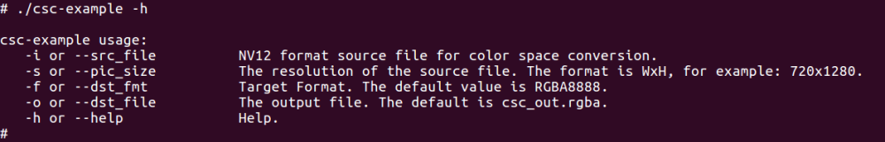图7-2-1 csc-example帮助信息

图7-2-2 上述例子的命令

图7-2-3 报错信息

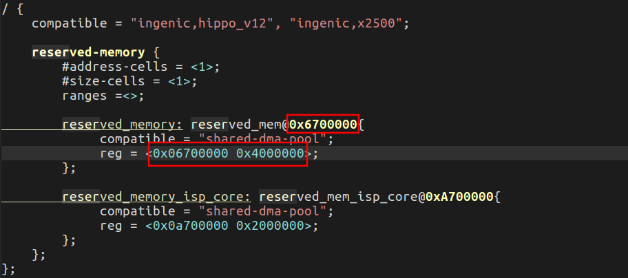图7-2-4 将保留内存扩大至64MiB

## 7.3 osd-example使用示例

**osd-example使用示例的主要功能是将两张图片叠加到一张NV12格式的背景图片上**。用例的使用需要在当前目录下存储3张图片，分别是一张3840x2160的NV12格式图片，文件名为osd_bg_3840x2160.nv12，一张1920x1080的RGBA8888格式图片，文件名为osd_ch0_1920x1080.rgba8888，一张64x64的BGRA8888格式图片，文件名为osd_ch1_64x64.bgra8888，如下图7-3-1所示。通过 **./osd-example** 运行程序后会在当前目录下生成一张NV12格式的图片，文件名为osd_out_3840x2160.nv12，如下图7-3-2所示。如果将程序中的四通道叠加使能（FOUR_CHANNELS_OSD_ENABLE），则还需要在当前目录下存储两张图片，分别是一张352x288的NV21格式图片，文件名为osd_ch2_352x288_colorbar.nv21，一张352x288的RGBA5551格式图片，文件名为osd_ch3_352x288.rgba5551。需要注意**此用例仅X2500适用**。

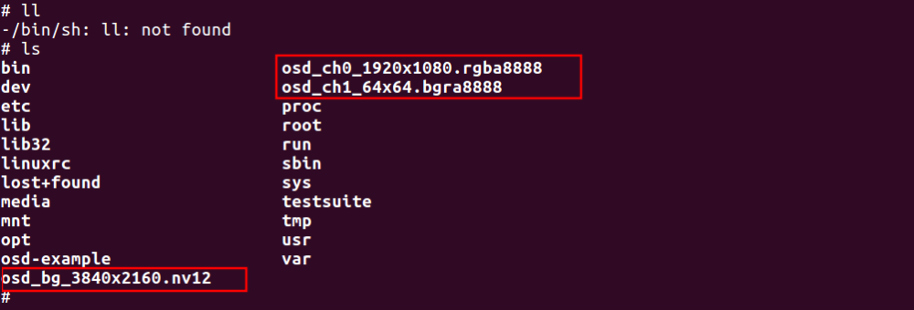图7-3-1 osd-example运行所需的图片

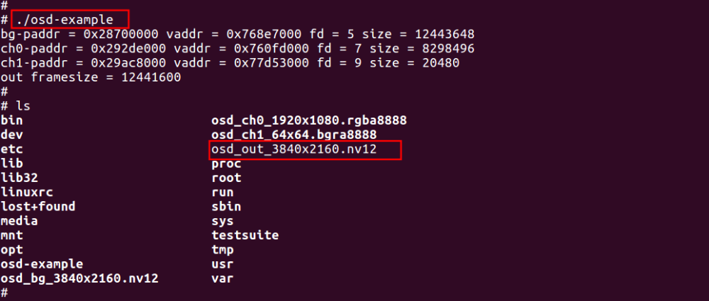图7-3-2 运行程序及生成的文件

## 7.4 rotator-x2500-example使用示例

**rotator-x2500-example使用示例的主要功能是对一张图片进行图像旋转操作并输出保存，仅X2500适用**。用例的使用可以通过 **./rotator-x2500-example -h** 查看帮助信息，如下图7-4-1所示。X2500 Rotator支持输入格式为NV12、RAW8、RGB565、ARGB8888，且输出格式同输入格式，旋转角度支持0°（angle0）、90°（angle90）、180°（angle180）、270°（angle270）、水平镜像（hflip）、垂直镜像（vflip）。下面这个例子是将一张1920x1080分辨率大小的ARGB8888格式图片旋转270°之后输出保存为1920x1080_rotate270.argb，命令如下图7-4-2所示。在使用时如果出现如下图7-4-3所示的错误，可以尝试通过扩大保留内存解决，如下图7-4-4所示将保留内存扩大至64MiB。

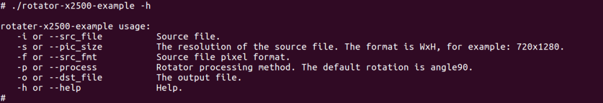图7-4-1 rotater-x2500-example帮助信息

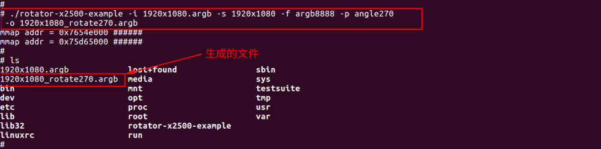图7-4-2上述例子的帮助信息

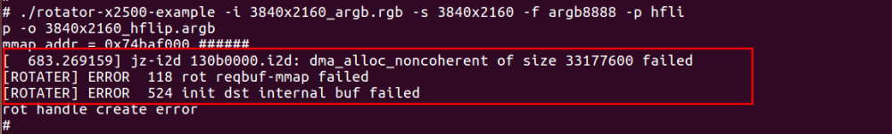图7-4-3 报错信息

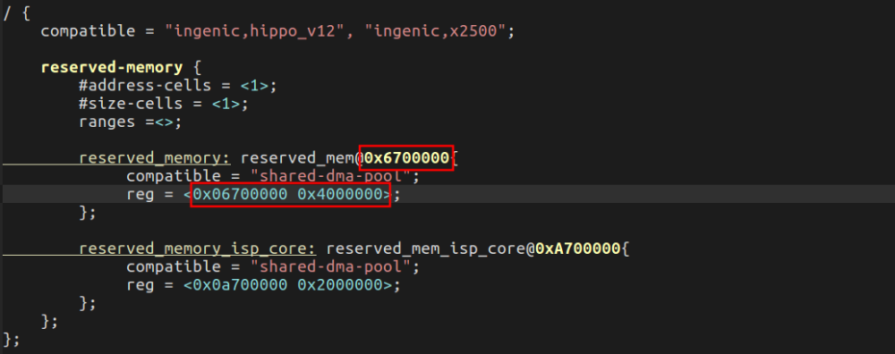图7-4-4 将保留内存扩大至64MiB

## 7.5 rotator-x2000-example使用示例

**rotator-x2000-example使用示例的主要功能是对一张图片进行图像旋转操作并输出保存，适用于X2000**。用例的使用可以通过 **./rotator-x2000-example -h** 查看帮助信息，如下图7-5-1所示。X2000 Rotator支持输入格式为BGR888、BGRA8888、RGB565、RGB555、ARGB1555、YUYV（YUYV422），支持输出格式为BGRA8888、RGB565、RGB555、YUYV（YUYV422），需要注意**不支持RGB和YUV格式的互相转换**。X2000 Rotator旋转角度支持0°（angle0）、90°（angle90）、180°（angle180）、270°（angle270）、水平镜像（hflip）、垂直镜像（vflip）。下面这个例子是将一张1920x1080分辨率大小的BGRA8888格式的图片旋转270°之后输出RGB565格式并保存为1920x1080_rotate270.rgb565，命令如下图7-5-2所示。需要注意的是**X2000 Rotator支持输入的图像大小为4x4 ~ 2047x2047，且输入格式BGR888实际是按照BGR32进行处理的，所以说在输入格式为BGR888时应输入一张BGR32格式的图片**。

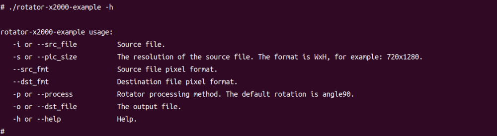图7-5-1 rotator-x2000-example帮助信息

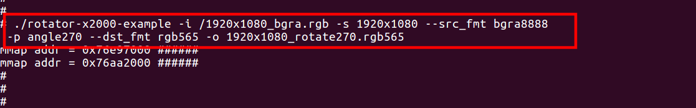图7-5-2 上述例子的图像旋转命令

## 7.6 cam-csc-example使用示例

**cam-csc-example使用示例的主要功能是将Camera输出的一帧数据进行颜色空间转换并输出保存文件，输出格式支持ABGR8888、ARGB8888、BGRA8888、BGRX8888、HSV、NV12、NV21、RGBA8888、RGBX8888**。用例的使用可以通过 **./cam-csc-example -h** 查看帮助信息，如下图7-6-1所示。下面这个例子是将Camera输出的1920x1080分辨率大小的图像数据转换成ARGB8888格式并输出保存为cam_1920x1080_csc_out.argb，如下图7-6-2所示。如果在使用中出现了如图7-6-3所示的报错，可以尝试通过减少Buffer个数或者扩大保留内存解决，如图7-6-4所示将保留内存扩大至64MiB。**仅X2500支持使用此用例**。

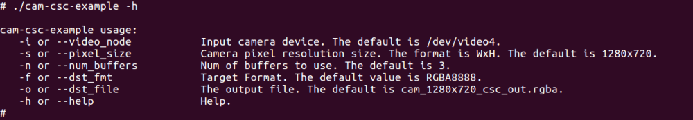图7-6-1 cam-csc-example帮助信息

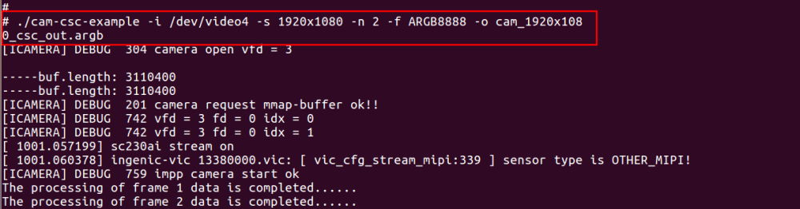图7-6-2 上述例子的命令

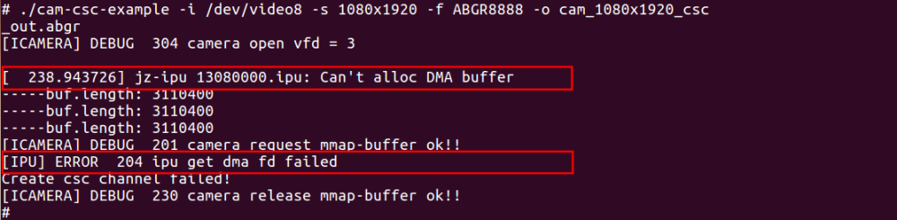图7-6-3 内存不足的报错信息

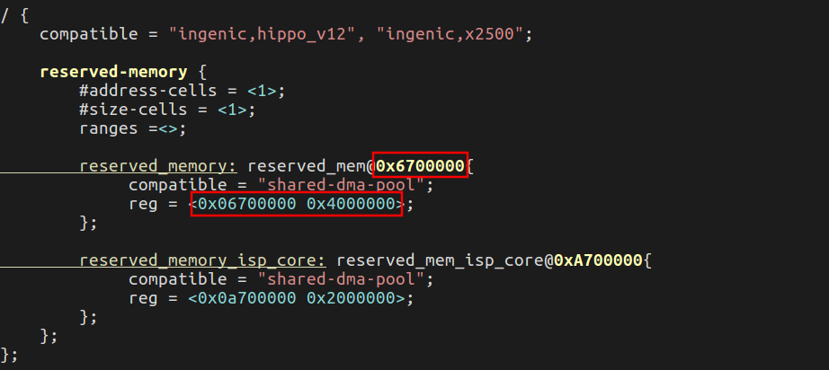图7-6-4 将保留内存扩大至64MiB

## 7.7 cam-pic-osd-display-example使用示例

**cam-pic-osd-display-example使用示例的主要功能是将Camera（video4）输出的数据经裁剪缩放后与720x1280分辨率大小的NV12格式图片进行叠加，叠加之后通过Display模块（Composer模式）在屏上进行显示**。用例的执行需要在当前目录下存储一张720x1280大小的NV12格式图片，文件名为720x1280.nv12。在执行此用例之前需要修改 .config 文件与设备树进行配置framebuffers，.config文件的修改内容如图7-7-1所示，设备树的修改内容如图7-7-2所示。用例的使用通过 **./cam-pic-osd-display-example** 运行，运行之后观察屏幕上的现象。**仅X2500支持使用此用例**。

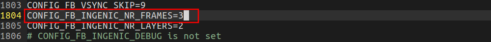图7-7-1 .config的修改内容

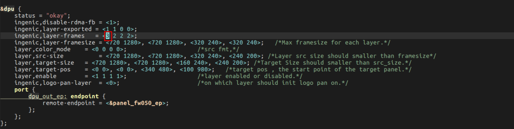图7-7-2 设备树的修改内容

## 7.8 camera-osd-enc-display-example使用示例

**camera-osd-enc-display-example使用示例的主要功能是将图片与Camera（video4）视频进行叠加处理，叠加后的数据在LCD上显示并进行H264编码保存输出码流视频**。用例的执行需要在/mnt/x2500目录下存储两张720x1280大小的RGBA8888格式的图片，文件名分别为720x1280-3.rgba、720x1280-2.rgba。用例执行之前需要将设备树中的dpu配置成Composer模式，并将framebuffers配置成2或3，如下图7-8-1和7-8-2所示。用例的使用通过 **./camera-osd-enc-display-example** 执行，运行之后观察屏幕上的现象。程序执行结束后会在/mnt/x2500目录下生成码流视频文件，文件名为osd_save.h264。**仅X2500支持使用此用例**。

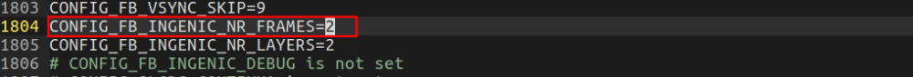图7-8-1 .config的修改内容

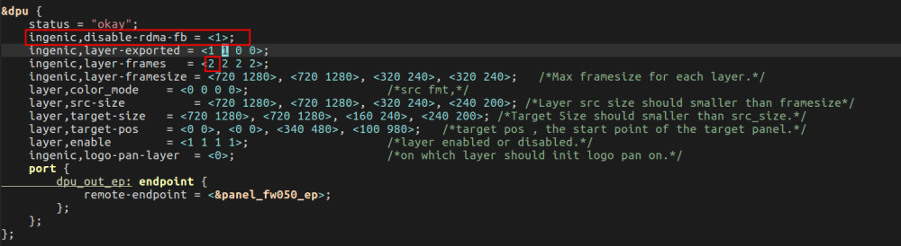图7-8-2 设备树的修改内容

## 7.9 cam-rot-example使用示例

**cam-rot-example使用示例的主要功能是将Camera（video4）输出的图像数据经Rotator旋转90°之后在LCD屏上进行显示（Composer模式）**。用例使用前需要将FrameBuffers配置成3，配置方法如下图7-9-1和7-9-2所示。用例的使用通过 **./cam-rot-example** 运行，运行之后观察屏幕上的现象。**仅X2500支持使用此用例**。

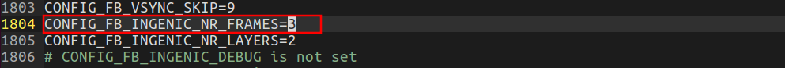图7-9-1 .config的修改内容

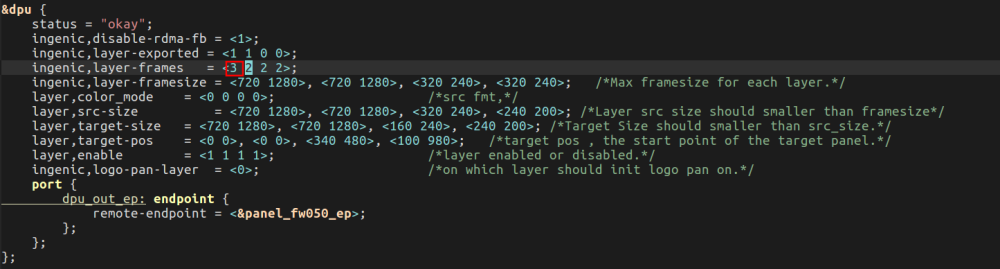图7-9-2 设备树的修改内容

## 7.10 dual-cam-rot-display-example使用示例

**dual-cam-rot-display-example使用示例的主要功能是将一路Camera（video4）数据经Rotator旋转90°之后显示在上半屏，一路Camera（video8）数据经Rotator旋转180°之后显示在下半屏**。使用前需要将FrameBuffers设置为3。用例的使用通过 **./dual-cam-rot-display-example** 运行，运行之后观察屏幕上的现象。**仅X2500支持使用此用例**。

## 7.11 cam-pic-rot-csc-dpu-osd-example使用示例

**cam-pic-rot-csc-dpu-osd-example使用示例的主要功能是将Camera（video4）输出的图像数据经Rotater旋转90°之后再经CSC转换成BGRA8888格式后与一张720x1280大小的BGRA8888格式图片经DPU进行叠加显示**。用例执行之前需要在当前目录下存储一张名为ffmpeg_720x1280_bgra.rgb图片，并且需要将FrameBuffers设置为3，否则会出现撕屏的现象。用例的使用可以通过 **./cam-pic-rot-csc-dpu-osd-example** 运行，运行之后观察屏幕上的现象。

## 7.12 drawbox-example使用示例

**drawbox-example使用示例的主要功能是在Camera的图像数据上绘制四个半边框图形并在LCD上进行显示**。用例使用之前需要修改内核进行配置FrameBuffers防止出现撕屏的现象，具体的修改如图7-12-1和7-12-2所示。用例可以通过 **./drawbox-example** 进行运行，运行之后屏幕上的边框内容如下图7-12-3所示。需要注意的是此用例**仅X2500支持**。

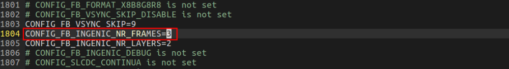图7-12-1 .config的修改内容

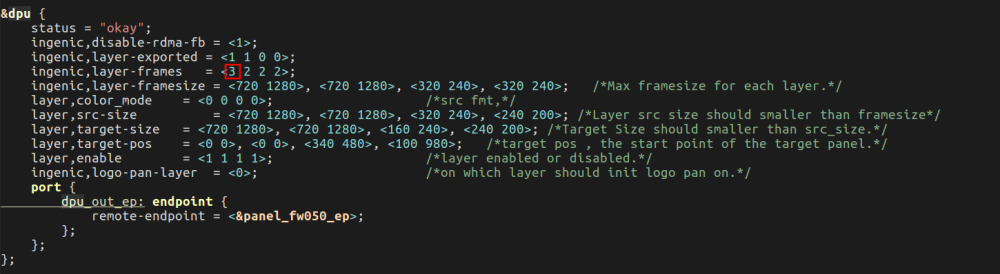图7-12-2 设备树的修改内容

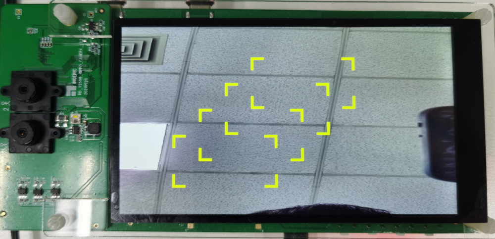图7-12-3 drawbox-example执行的效果

# 8 media-example目录下的使用示例

## 8.1 目录结构

```
xxx@xxx:xxx/development/Ingenic-Mpp/test/media-example$ tree -L 2  
.  
├── mp4v2  
│   ├── Build.mk  
│   ├── camera_mp4.cpp # 生成camera-mp4-recoder  
│   ├── include  
│   ├── libmp4v2.a  
│   ├── mp4Encoder.cpp  
│   └── mp4Encoder.h  
└── rtsp  
 ├── Build.mk  
 ├── camera_rtsp.c # 生成camera-rtsp  
 ├── librtsp.so  
 └── rtsp_server.h  

3 directories, 9 files
```

## 8.2 camera-mp4-recoder使用示例

**camera-mp4-recoder使用示例的主要功能是录制一个MP4视频**。用例的使用可以通过 **./camera-mp4-recoder -h** 查看帮助信息，如下图8-2-1所示。如下图8-2-2所示的例子是采用默认参数录制的一个mp4视频，即音频是通过AMIC（plug:cap_chn0）以双通道16KHz采样频率进行录音的并且音频的编码格式是AAC-ADIF，视频是通过video4节点进行录制的并通过Codec进行H264编码，生成的mp4文件名为test.mp4。如果X2500在录制较大分辨率的mp4视频时出现了如下图8-2-3所示的错误，可以通过扩大保留内存及减少Buffer个数（-n选项）尝试解决，如下图8-2-4所示将保留内存扩大至64MiB 。需要注意**X2500的AMIC支持 1(mono)、2(stereo) 通道，而X2000的AMIC仅支持 1(mono) 通道（受限于限制于ICODEC），且X2500 H264编码3840x2160分辨率时需要将帧率设置到20fps以下，X2000最大支持1080P分辨率进行H264编码**。

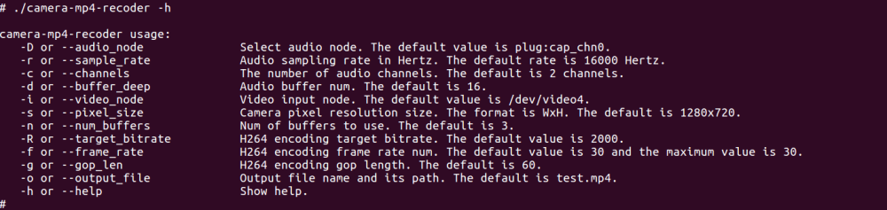图8-2-1 camera-mp4-recoder帮助信息

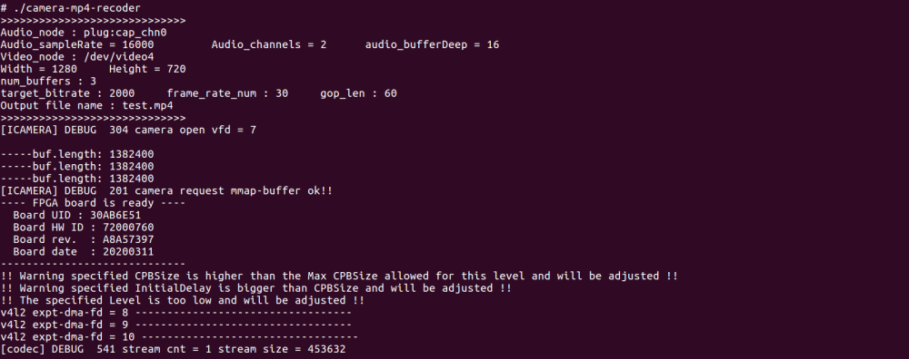图8-2-2 使用默认参数录制mp4视频

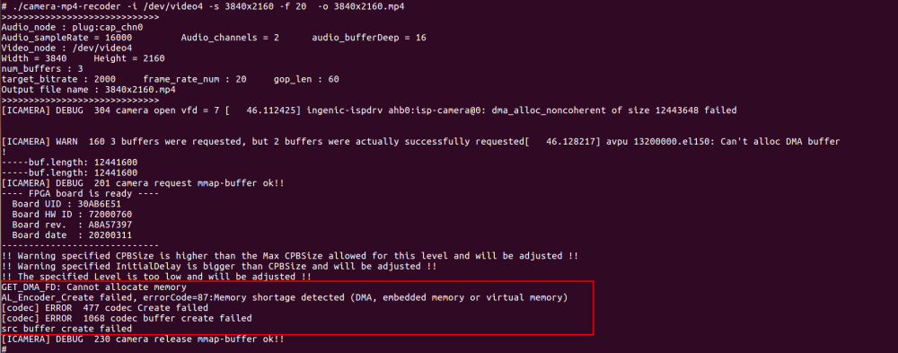图8-2-3 报错信息

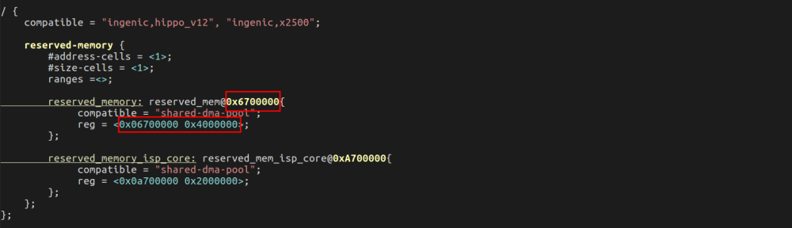图8-2-4 Hippo开发板将保留内存扩大至64MiB

## 8.3 camera-rtsp使用示例

**camera-rtsp使用示例的主要功能是通过RTSP服务器实时显示监控Camera**。用例的使用可以通过 **./camera-rtsp -h** 查看帮助信息，如下图8-3-1所示。在执行此用例之前需要给开发板连接网线并确定以太网卡的名称，以太网卡的名称可以通过 **ifconfig -a** 命令确定，如下图8-3-2所示。在执行用例时需要传入以太网卡的名称以及IP地址来配置开发板（RTSP Server）的IP，配置IP时需要确保开发板的IP地址与PC端能相互通信，如下图8-3-3所示的例子中仅配置开发板的IP地址，Camera、H264编码与端口号均采用默认参数。用例执行后可以在PC端通过ffplay进行查看，查看命令为 **ffplay rtsp://ipaddr:port/live/0/h264**，以此用例中配置的IP地址为例，查看命令为**ffplay rtsp://192.168.4.115:8888/live/0/h264**。如果X2500在执行时出现了如下图8-3-4所示的错误，可以通过扩大保留内存及减少Buffer个数（-n选项）尝试解决，如下图8-3-5所示将保留内存扩大至64MiB 。需要注意**X2500 H264编码3840x2160分辨率时需要将帧率设置到20fps以下，X2000最大支持1080P分辨率进行H264编码**。

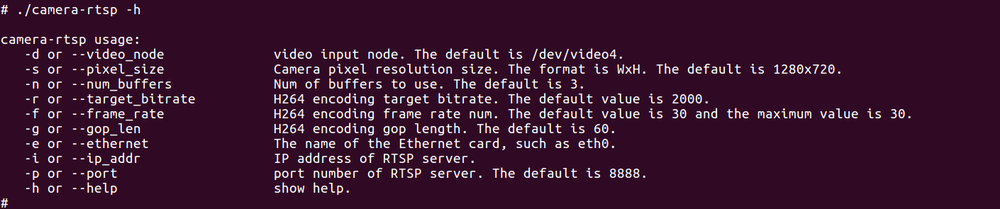图8-3-1 camera-rtsp帮助信息

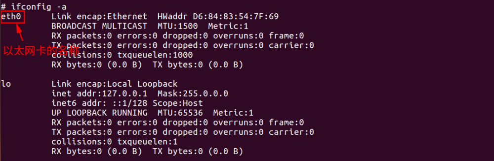图8-3-2 以太网卡的名称

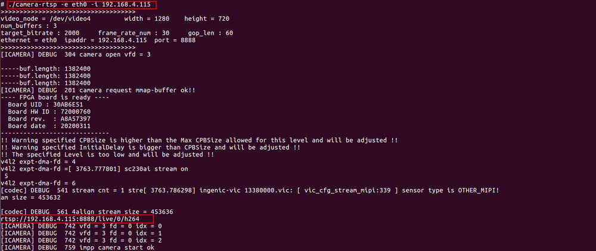图8-3-3 仅配置开发板的IP地址

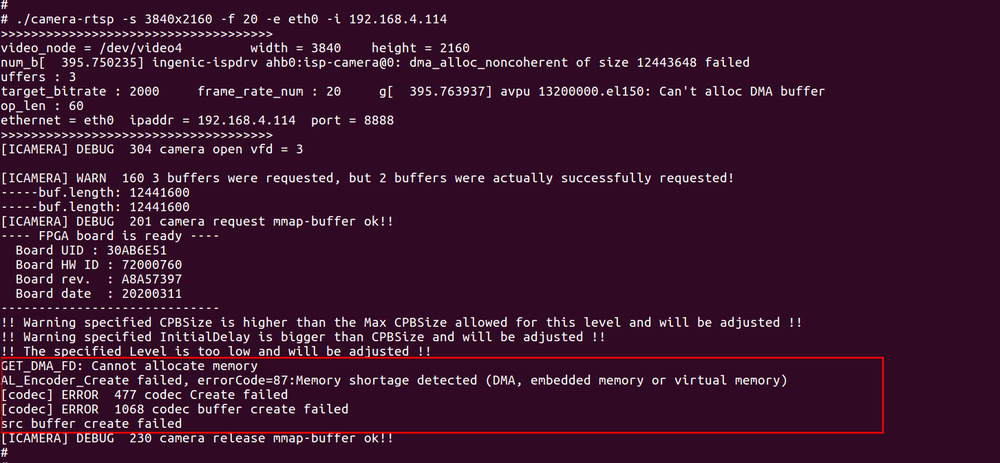图8-3-4 报错信息

图8-3-5 Hippo开发板将保留内存扩大至64MiB

