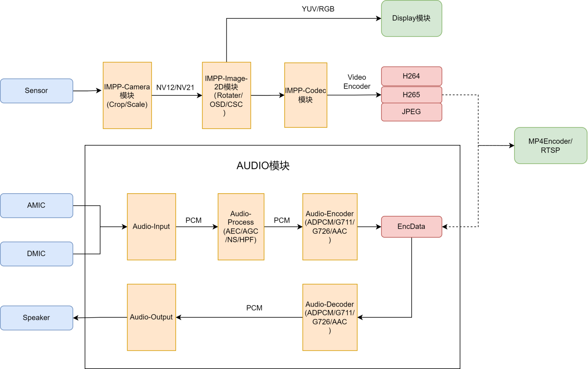

# IMPP简介

IMPP(Ingenic-Media-Process-Platform)，可进行音视频采集播放、音视频编解码以及图像的2D处理(旋转/透明叠加/格式转换)。

图 1-1 IMPP结构

IMPP主要包含：Camera模块、IPU模块(OSD/CSC)、Rotater模块(图像旋转)、Codec模块(视频编解码)、Display模块、DPU模块、Audio模块;各模块间可通过Dma-buf进行内存共享，实现零拷贝，从而提升效率。

X2000、X2500、X2600目前支持功能列表：

| 功能模块                                    | X2000/M300/X2100      | X2500         | X2600                 |
| ------------------------------------------- | --------------------- | ------------- | --------------------- |
| Audio模块(采集、播放、编码、解码、音频处理) | 所有API均支持         | 所有API均支持 | 所有API均支持         |
| Camera模块                                  | 不支持设置antifilcker | 所有API均支持 | 不支持设置antifilcker |
| Video-ENC模块(Codec)                        | 不支持设置ROI         | 所有API均支持 | 不支持设置ROI         |
| Display模块                                 | 所有API均支持         | 所有API均支持 | 所有API均支持         |
| DPU                                         | 所有API均支持         | 所有API均支持 | 所有API均支持         |
| Rotater模块                                 | 所有API均支持         | 所有API均支持 | 所有API均支持         |
| IPU(CSC/OSD)模块                            | 不支持                | 所有API均支持 | 不支持                |
| Drawbox模块                                 | 不支持                | 所有API均支持 | 不支持                |

# IMPP 开发文档

- [IMPP工程目录结构说明文档](IMPP工程目录结构说明文档.md)
- [IMPP-开发指南](IMPP开发指南.md)
- [IMPP用例使用说明文档](IMPP用例使用说明文档.md)