**君正®**

Copyright © Ingenic Semiconductor Co. Ltd 2021. All rights reserved.

**Release history**

| Date       | Revision | Change         |
| ---------- | -------- | -------------- |
| 2021.10.26 | 1.0      | First release  |
| 2022.12.2  | 2.0      | Second release |

# SDK工程下载

开发板配套的SDK源码工程均是通过百度网盘的方式进行对外发布。本节将讲述如何下载最新的源码工程以及解压相关的压缩包，文中附带下载链接。

## SDK下载

网盘下载链接: https://pan.baidu.com/s/1g5txFp6oEoO66aKwA2gIdw

提取码: svtt

网盘下载: 开发板的芯片数据手册、开发板的硬件原理图以及SDK软件包。这里主要讲述软件包的下载，其他资料用户可根据自己的需要自行选择下载。选择最新的SDK软件包进行下载。

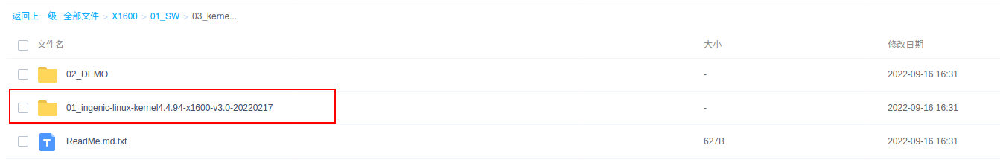

## Buildroot下载

Ｈalley6配套的软件开发平台需要使用Buildroot来提供最基础的文件系统，因此这里需要下载君正已经修改制作的Buildroot工程。

网盘下载链接： <https://pan.baidu.com/s/1e57Ze_WXoOHGFN6xhcNLkQ>

提取码: gx42

同样这里也选择最新的工程下载。*（特别需要注意的是dl-xxxx的版本号一定要和SDK的版本号相对应，原则上推荐都下载最新的）*

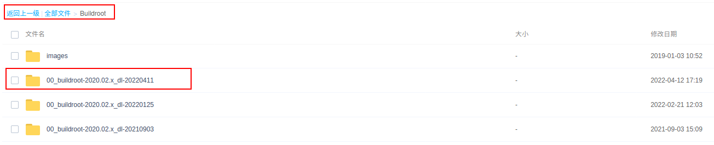

 图1-2

## 工程解压

1. 将下载完成的SDK工程目录中的ingenic-linux-kernel4.4.94-xx.tar.bz2文件拷贝到一个新建的目录下。
2. 将下载完成的Buildroot工程目录下的dl.tar.bz2拷贝到上述新建的目录下。在SDK工程中一般会带有Buildroot工程，如果没有需单独下载解压
3. 执行命令进行解压

```bash
$ tar -xf ingenic-linux-xx.tar.bz

$ tar -xf dl.tar.bz2 -C ./buildroot/
```

# SDK 简介

## 工程整体结构

Halley6配套的软件开发平台是君正开发的一套linux系统的发布、开发平台，平台的编译系统可支持c文件、cpp文件。同时可支持静态库、动态库以及可执行文件的编译生成。本软件开发平台还能够快速方便的集成、添加第三方应用和库文件。工程支持整体编译、模块的单独编译以及选择性编译。本软件开发平台的工程目录如下所示。

| 工程结构    |                                      |
| ----------- | ------------------------------------ |
| build       | 整个工程的编译规则和说明文档         |
| buildroot   | buildroot源码，提供最基础的文件系统  |
| development | 开发中的软件库                       |
| device      | 板级配置信息                         |
| docs        | 文档说明及SDK用户手册                |
| external    | 第三方软件包                         |
| frameworks  | 中间件软件库                         |
| kernel      | kernel源码                           |
| packages    | 应用程序                             |
| prebuilts   | 编译工具链                           |
| tools       | ota升级工具                          |
| u-boot      | uboot源码                            |

## 文档说明

本文档目的是为了帮助开发者快速的了解如何对SDK的编译以及程序的烧录，如果用户需要更加深入的了解Halley6的各个外设模块和应用开发，可以参考Halley6配套发布的其它文档。各文档的介绍说明请参考表1。

表1
| **文档名**                                                                 | **文档内容说明**                                                  |
| -------------------------------------------------------------------------- | ----------------------------------------------------------------- |
| Halley6软件平台快速开发指南                                                | 帮助开发者快速了解平台软件的编译和烧写以及测试                    |
| Halley6 uboot开发手册                                                      | U-boot的配置编译、内核加载以及文件系统的挂载                      |
| Halley6 内核开发手册                                                       | 各内核驱动模块的配置编译，以及相应驱动源码的在内核结构的位置      |
| Halley6 平台应用开发手册                                                   | Buildroot的配置编译、用户应用程序的添加和编译、应用程序的调试方法 |

# SDK 编译

## 整体编译

本节主要介绍快速对SDK工程进行整体编译的方法，编译步骤具体如下：

1、设置环境变量

在工程目录下执行命令：
```bash
$ source build/envsetup.sh
```

1. 选择device

在工程目录下执行命令：
```bash
$ lunch
```

命令执行结束后会显示不同的配置方案，请根据开发板的配置输入编号进行选择，例如Halley6.v10或Halley6.v20。同时需要注意区分开发板的存储类型，如nand、nor。关于lunch配置中的各选项的说明可参考表２的解读。在lunch后选择不同存储类型和版本号即可，本文档里以x1600halley6.v10_nand_4.4.94-eng 配置演示

表2
| **配置选项名称**                    | **配置说明**                                         |
| ----------------------------------- | ---------------------------------------------------- |
| x1600halley6.v10_nand_4.4.94-eng    | 适用于编译v10版本的开发板的kernel4.4.94版本nand启动       |
| x1600halley6.v10_nor_4.4.94-eng     | 适用于编译v10版本的开发板的kernel4.4.94版本nor启动        |
| x1600halley6.v10_msc_4.4.94-eng     | 适用于编译v10版本的开发板的kernel4.4.94版本msc启动        |
| x1600halley6.v10_nand_4.4.94_ota-eng| 适用于编译v10版本的开发板的kernel4.4.94版本nand OTA升级   |
| x1600halley6.v10_msc_4.4.94_ota-eng | 适用于编译v10版本的开发板的kernel4.4.94版本msc OTA升级    |

1. 工程编译

在工程目录下执行make或make MAKE_JLEVEL=8或make -j8（多线程编译)
```bash
$ make -j8
```

注意：由于机器性能的不同编译时长也会有差异，通常会在2小时以上。

至此，工程的整体编译工作已完成。编译结果的输出具体如下：

①　`工程目录/out/product/x1600halley6.v10_nand_4.4.94-eng/image`，生成kernel、system.ubifs、uboot镜像。

②　`工程目录/out/product/x1600halley6.v10_nand_4.4.94-eng/obj`是buildroot、kernel、uboot、packages等编译过程中的输出的中间文件。

2. 工程clean
```bash
$ make clean
```

## 单独编译

本节主要介绍如何对uboot、kernel、buildroot和模块的单独编译，最后还将介绍如何打包文件系统镜像。在进行模块单独编译前需要进行环境变量设置和device的选择，具体操作请参考2.1中的相关描述，如当前终端已经设置无须重新设置。（*需要注意的是单独编译的前提条件是工程已进行了整体编译*）

### 编译uboot

1. 清除uboot编译结果的方法，在工程目录下执行命令：
```bash
$ make uboot-clean
```

2. 编译uboot的方法，在工程目录下执行命令：
```bash
$ make uboot
```

### 编译kernel

1. 清除kernel编译结果的方法，在工程目录下执行命令：
```bash
$ make kernel-clean
```

2. 配置kernel的方法，在工程目录下执行命令：
```bash
$ make kernel-menuconfig
```

3. 编译kernel的方法，在工程目录下执行命令：
```bash
$ make kernel -j8
```

### 编译buildroot

1. 清除buildroot编译中间文件的方法，在工程目录下执行命令：
```bash
$ make buildroot-clean

$ make buildroot-distclean
```

2. 配置buildroot的方法，在工程目录下执行命令：
```bash
$ make buildroot-menuconfig
```

3. 编译buildroot的方法，在工程目录下执行命令：
```bash
$ make buildroot -j8
```

4. 局部修改buildroot后编译buildroot的方法，在工程目录下执行命令
```bash
$ make buildroot-rebuild
```
5. 在对一些第三方库或者是内核工具软件如，opencv和i2c-tools_4.1做出修改后可以通过执行buildroot内置的命令进行单独编译。
```bash
$ make buildroot-opencv-rebuild

$ make buildroot-i2c-tools-rebuild
```

buildroot工程所包含的第三方软件位于`工程目录/buildroot/packages`目录下，编译输出位于`工程目录/out/product/x1600halley6.v10_nor_4.4.94-eng/obj/buildroot-intermediate/build`。

6. 关于buildroot其它命令的支持可以通过help选项进行查询，在工程目录下执行命令：
```bash
$ make buildroot-help
```

### 编译模块

本工程支持对单个模块的编译及对单个模块的clean操作。工程的编译系统初始化后，存在两套单模块的编译方法，一种是通用的模块编译方法mma命令，另外一种是直接在工程目录下使用make命令。在单独编译模块之前，需要确保当前终端的环境变量已设置，具体请参考2.1小节中的相关描述。

#### mma命令单独编译模块

mma命令为通用单模块编译方法，不区分此模块为host端还是target端。此命令的具体使用方法为：

1. 进入到所要编译模块目录下，此模块目录下含有Build.mk文件。

2. 执行mma命令，此模块以及此模块所依赖的模块都会被编译。

#### Target端模块编译

Tartget端模块编译是在工程目录下进行的，命令格式为：
```bash
$ make $(LOCAL_MODULE)
```

命令使用示例，以`工程目录/packages/example/App/cimutils`模块为例，该模块在其目录下的Build.mk文件中LOCAL_MODULE赋值为：cimutils。单独编译模块只需要在工程目录下执行命令：
```bash
$ make cimutils
```

编译后的可执行文件最终将被直接安装到文件系统的相应路径下，可根据编译后最终的安装路径找到相应的可执行文件。

#### Target端模块clean

Tartget端模块clean可在工程目录下进行，命令格式为：
```bash
$ make $(LOCAL_MODULE)-clean
```

命令使用示例，以`工程目录/packages/example/App/cimutils`模块为例，该模块在其目录下的Build.mk文件中LOCAL_MODULE赋值为：cimutils。单独clean概模块只需要在工程目录下执行命令：
```bash
$ make cimutils-clean
```

### 编译文件系统镜像

单独编译文件系统镜像的方法为，在工程目录下执行命令：
```bash
$ make systemimage
```

命令执行结束后，会在`工程目录/out/product/x1600halley6.v10_nor_4.4.94-eng/image`下重新生成system的镜像。

### 打包文件系统镜像

打包文件系统镜像，将编译后输出的文件打包成最终的文件系统镜像，用于烧录到开发板。打包文件系统镜像需要在工程目录下执行命令：
```bash
$ make post-image
```

最终的文件系统镜像输出在`工程目录/out/product/x1600halley6.v10_nor_4.4.94-eng/image`目录下。

# 烧录工具使用

本节主要讲述本开发平台配套的USB烧录工具的使用，此USB烧录工具可在ubuntu12.04、windowsXP以及Windows7以上的版本，均支持32位和64位。本开发指南只针对在ubuntu下使用USB烧录工具进行相应的烧写演示。在工程目录下运行get-burner下载最新的烧录工具。进入到烧写工具目录下，输入解压烧录工具文件命令：
```bash
$ tar -xf cloner-“版本号”-ubuntu_alpha.tar.gz
```

解压完成后进入到相应的烧写工具目录下，准备进行uboot、kernel、rootfs的烧录。开始烧录前需要确保开发板的两个Type-C接口和PC已连接。

 **注意:实际烧录工具“版本号”以SDK发布为准.**

支持的烧录配置如下表所示,

| **烧录配置**                        | **说明**             |
| ----------------------------------- | -------------------- |
| **x1600_sfc_nand_lpddr2_linux.cfg** | Nand 启动默认配置    |
| **X1600_sfc_nor_lpddr2_linux.cfg**  | Nor 启动默认烧录配置 |

## 烧录SFC Nand

烧写SFC Nand的具体方式为：

1. 进入烧写工具目录，执行命令：
```bash
$ ./cloner
```

2. 命令执行结束后将打开一个图形界面软件，首先先进行相应的配置点击“配置”。

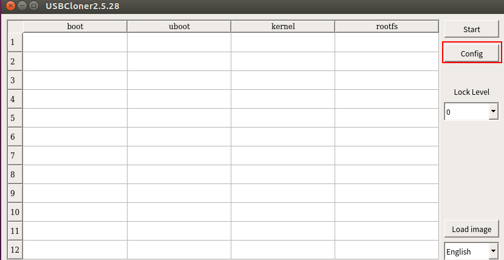

图4-1

基本信息的配置，点击INFO，进入基本配置信息，平台选择x1600,板级选择x1600_sfc_nand_lpddr2_linux.cfg，具体可参图4-2。

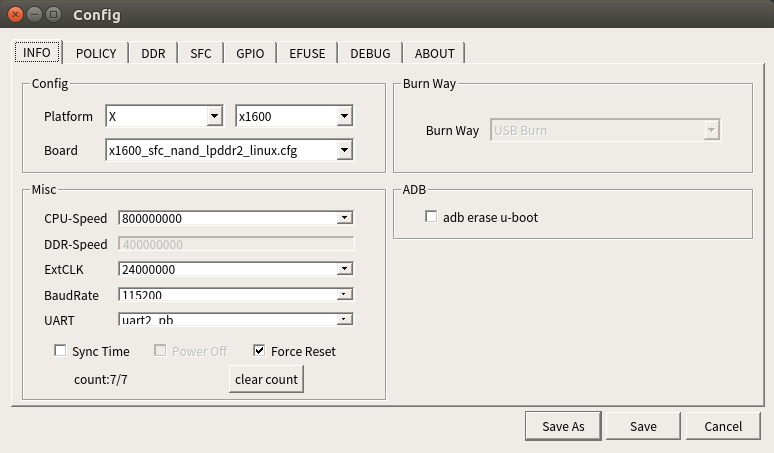

图4-2

3. 配置镜像文件路径，点击POLICY进行相应的配置。顺序设置uboot、kernel和rootfs镜像文件的相应路径（文件名分别是uboot、kernel、system.ubifs），点击其对应的setting即可进行文件选择。配置可参考图4-3。

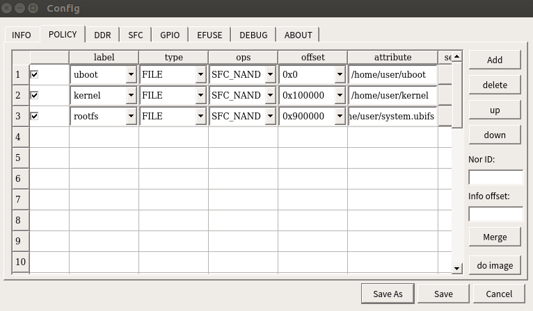

图4-3

4. 设置完成后点击“保存”按钮，准备烧写。
5. 点击烧录工具主界面的“开始”按钮。
6. 开发板进入烧写状态，先按下开发板的BOOT_SEL1按键，然后按下RST_N按键，待蓝色指示灯亮起后，再分别松开RST_N和BOOTL_SEL1按键。

等待烧录工具各项烧录完成到100%，如图4-4所示

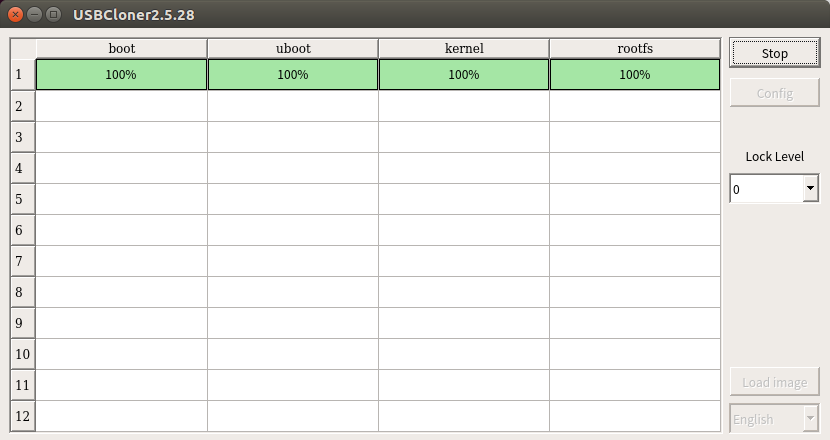

图4-4

## 烧录SFC Nor

烧录SFC Nor和SFC Nand的烧写差异在于配置的不同，具体的 配置方法为：

1. 基本信息的配置，点击INFO，进入基本配置信息，平台选择x1600,板级选择x1600_sfc_nor_lpddr2_linux.cfg，具体可参图4-5。

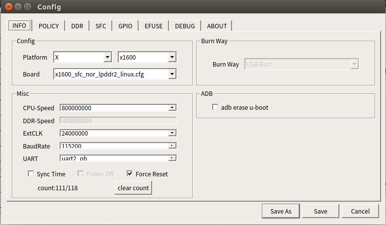

图4-5

配置镜像文件路径，点击POLICY进行相应的配置。顺序设置uboot、kernel和rootfs镜像文件的相应路径，点击其对应的setting即可进行文件选择。配置可参考图4-6。

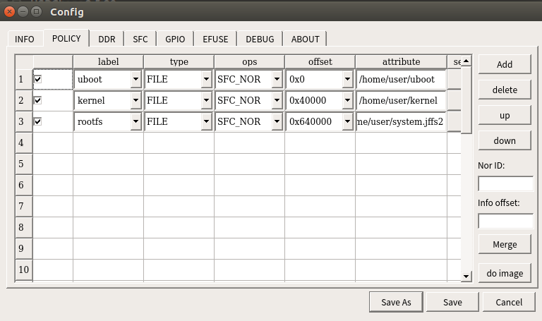

图4-6

2. SFC配置，由于烧录工具支持的flash种类较多，在进行烧写前需要根据板载的nor flash的型号解决ID冲突的问题。点击norinfo，根据name查找到对应板载nor flash的ID并浏览是否有标红冲突的，如果有冲突择将其他的删除。配置界面参考图4-7。

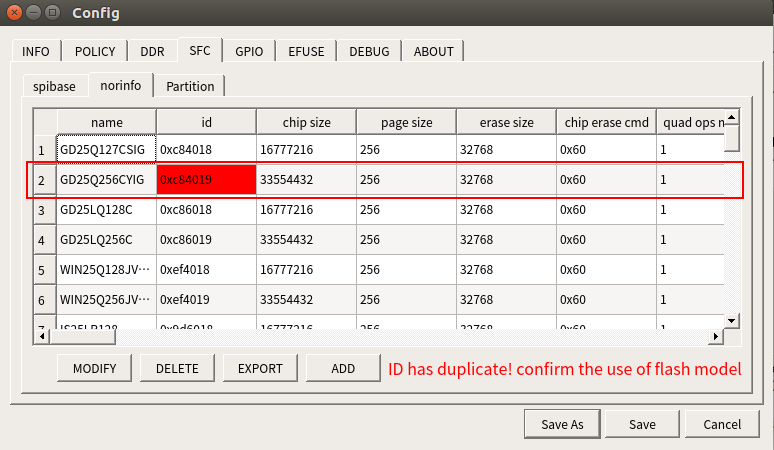

图4-7

3. 设置完成后点击“保存”按钮，准备烧写。

4. 点击烧录工具主界面的开始按钮。

5. 开发板进入烧写状态，先按下开发板的BOOT_SEL1按键，然后按下RST_N按键，待蓝色指示灯亮起后，再分别松开RST_N和BOOTL_SEL1按键。

6. 等待烧录工具各项烧录到100%，如图4-4所示。

## 烧录SD卡

本小节主要讲述如何通过USB烧录工具将镜像文件烧录到SD卡，以及如何从SD卡启动。烧录SD卡和烧录Nand的区别主要在于配置的差异，具体的 配置为：

1. 基本信息的配置，点击INFO，进入基本配置信息，平台选择x1600,板级选择x1600_mmc_lpddr2_linux.cfg，具体可参图4-8。

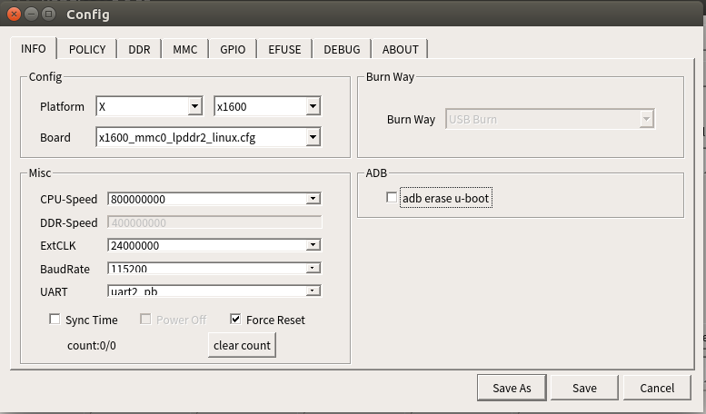

图4-8

2. 配置镜像文件路径，点击POLICY进行相应的配置。顺序设置uboot、kernel和rootfs镜像文件的相应路径（文件名分别是uboot、kernel、system.ext2），点击其对应的setting即可进行文件选择。配置可参考图4-9。需要注意的是，不同的存储介质使用的文件系统格式是不同的，均需要再编译之前重新进行lunch配置再编译。

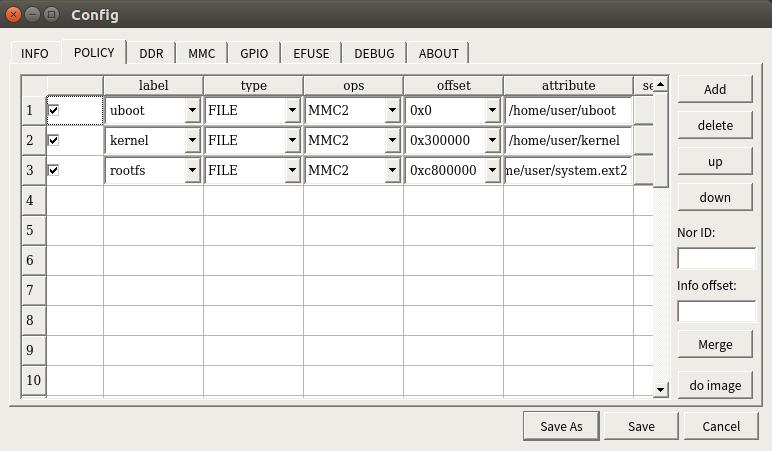

图4-9

3. MMC选项配置，如图4-10所示

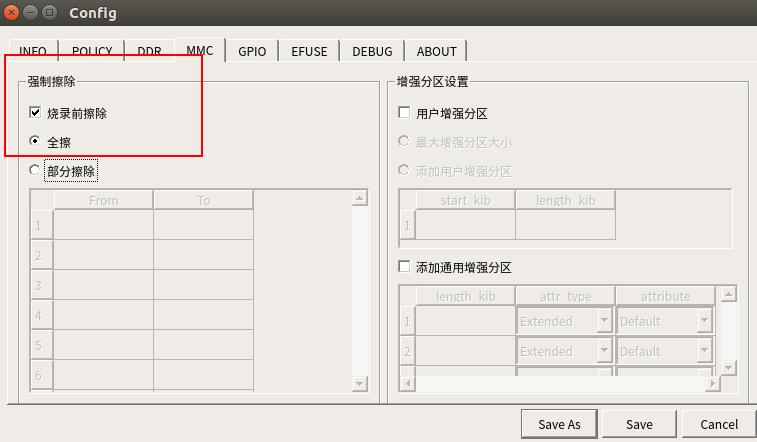

图4-10

4. 设置完成后点击保存按钮，准备烧写。

5. 点击烧录工具主界面的“开始”按钮。

6. 开发板进入烧写状态，先按下开发板的BOOT_SEL1按键，然后按下RST_N按键，待蓝色指示灯亮起后，再分别松开RST_N和BOOTL_SEL1按键。

7. 等待烧录工具各项烧录到100%，如图4-4所示。

8. 烧录完成后从SD卡启动：先按下开发板的BOOT_SEL1按键，然后按下RST_N按键，待蓝色指示灯亮起后，再分别松开RST_N和BOOTL_SEL1按键。

## 烧录eMMC

本小节主要讲述如何通过USB烧录工具将镜像文件烧录到eMMC，以及如何启动。s烧录eMMC和烧录Nand的区别主要在于配置的差异，具体的配置为：

1.基本信息的配置，点击INFO，进入基本配置信息，平台选择x1600,板级选择x1600_mmc1_lpddr2_linux.cfg。
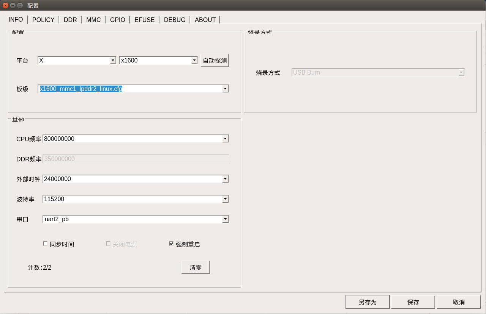


2. 配置镜像文件路径，点击POLICY进行相应的配置。顺序设置uboot、kernel和rootfs镜像文件的相应路径（文件名分别是uboot、kernel、system.ext2），点击其对应的setting即可进行文件选择。需要注意的是，不同的存储介质使用的文件系统格式是不同的，均需要再编译之前重新进行lunch配置再编译。

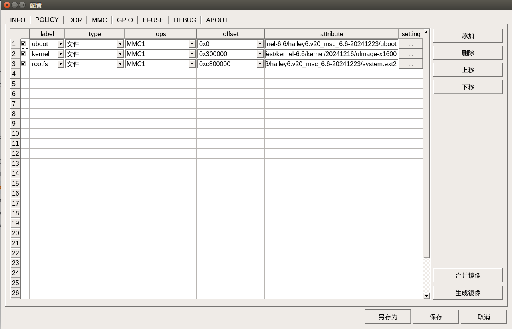


3. MMC选项配置，如图所示

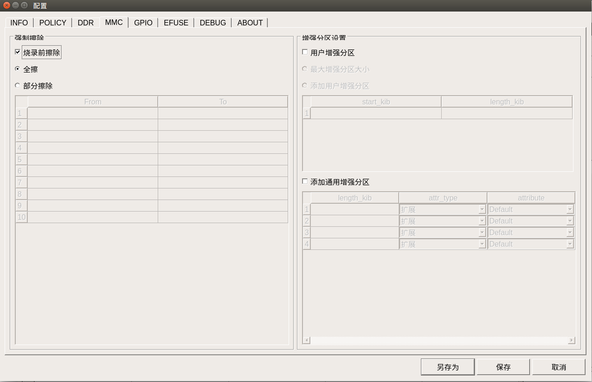


4. 设置完成后点击保存按钮，准备烧写。

5. 点击烧录工具主界面的“开始”按钮。

6. 开发板进入烧写状态，先按下开发板的BOOT_SEL1按键，然后按下RST_N按键，待蓝色指示灯亮起后，再分别松开RST_N和BOOTL_SEL1按键。

7. 等待烧录工具各项烧录到100%，如图4-4所示。

## 烧录工具的擦除选项

本烧录工具擦除选项有整体擦除和非整体擦除，在第一次烧写时需要选择整体擦除，如果后续只想烧录某一个文件则可以将该选项去掉。相关配置界面如图4-11所示。


图4-11

## 其他配置

### 配置串口

串口是开发过程中最为重要的工具之一，在使用串口调试之前需要进行串口环境的配置：

1. 在ubuntu安装串口工具，执行命令:
```bash
$ sudo apt-get install minicom
```

1. 串口工具配置

minicom配置，再PC终端输入命令：
```bash
$ sudo minicom -s
```

命令执行后会进入如下界面：


选择Serial port setup，回车进入串口配置，通过输入字母选择需要修改配置的选项，如下图所示：

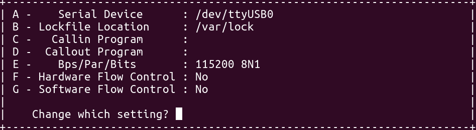

关于配置选项的一些说明：
a. Serial Device需要根据实际设备名称来选择，通常是ttyUSBx。
b. 选项E，配置具体意义为波特率 115200,8个数据位，无校验位以及一个停止位。
c. 选项F和G，硬件和软件流控选项必须是No。配置结束后回车进入1中的界面，选择Save setup as dfl保存配置，然后选择Exit from minicom退出。

4. 串口工具使用

在终端下输入命令：
```bash
$ sudo minicom
```

### 安全烧录

 参考USBCloner烧录工具说明文档.pdf

### SN烧录

 参考USBCloner烧录工具说明文档.pdf

# FAQ

## 如何将编译好的可执行程序模块导入至开发板？

A:导入程序的方式有adb、tftp等方式，具体方法可参考<<halley6 平台应用开发手册>>。

## 编译kernel出现问题
```
/home/xxx/x1600/kernel/kernel-4.4.94 is not clean, please run 'make mrproper'

in the '/home/xxx/x1600/kernel/kernel-4.4.94' directory.

/home/xxx/x1600/kernel/kernel-4.4.94/Makefile:1003: recipe for target 'prepare3' failed

make[2]: *** [prepare3] Error 1

make[2]: Leaving directory '/home/xxx/x1600/out/product/x1600halley6.v10_nand_4.4.94-eng/obj/kernel-intermediate'

Makefile:150: recipe for target 'sub-make' failed

make[1]: *** [sub-make] Error 2
```

出现上述现象通常是因为在kernel目录下执行了`make menuconfig`进行了配置，然后到工程目录下执行编译命令造成的。这个时候的解决办法:

1. 到kernel目录下执行命令
```bash
$　make distclean
```

2. 回到工程顶层目录执行lunch选择板级后，并执行命令编译内核
```bash
$　make kernel -j8
```

提示：本SDK所有的编译配置都可以在工程顶层目录进行编译配置，具体参考本文档相关内容，不建议进入到某个目录下单独进行配置。

## 程序无法执行或者编译时链接失败

确保编译器使用 gcc version 7.2.0 (Ingenic Linux-Release5.1.0-Default(xburst1(fp32)+glibc2.29),执行 mips-linux-gnu-gcc -v可以查看:
```
Using built-in specs.

COLLECT_GCC=mips-linux-gnu-gcc

COLLECT_LTO_WRAPPER=/home_bak/jyli/x1600-pure/prebuilts/toolchains/mips-gcc720-glibc229/bin/../libexec/gcc/mips-linux-gnu/7.2.0/lto-wrapper

Target: mips-linux-gnu

Configured with: /home/users/ylli/ingenic_toolchain/project/src/gcc-7-2017.11/configure --build=i686-pc-linux-gnu --host=i686-pc-linux-gnu --target=mips-linux-gnu --enable-threads --disable-libmudflap --disable-libssp --disable-libstdcxx-pch --with-arch-32=mips32r2 --with-arch-64=mips64r2 --with-float=hard --with-mips-plt --enable-extra-sgxxlite-multilibs --with-gnu-as --with-gnu-ld

....................................

urcery/mips-linux-gnu/bin --with-private=default_option_mglibc_mfp32 SED=sed

Thread model: posix

gcc version 7.2.0 (Ingenic Linux-Release5.1.0-Default(xburst1(fp32)+glibc2.29) 2021.12-22 13:09:44)
```
如果没有上述现象，尝试进行编译环境变量设置和lunch板级选择，参考本文档的SDK编译部分的内容
