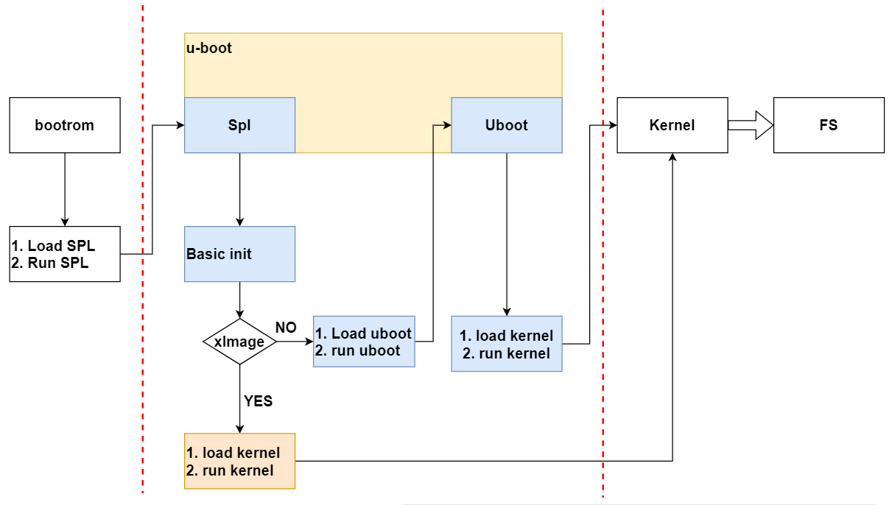
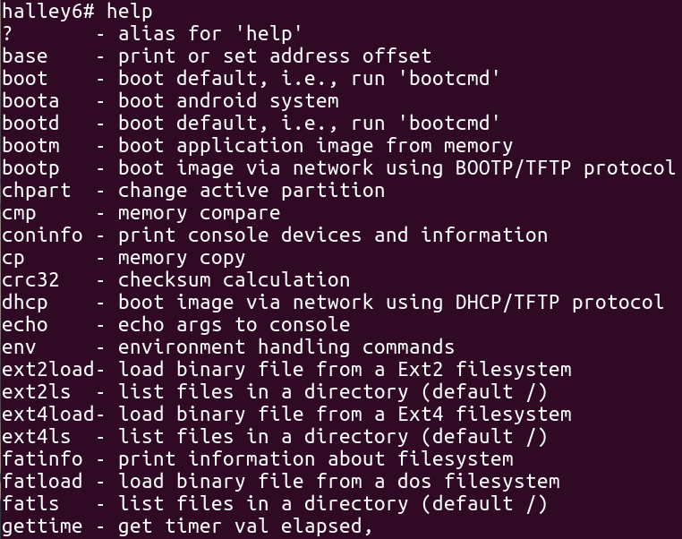
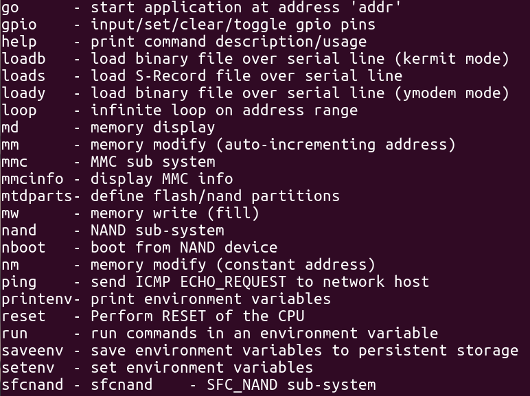
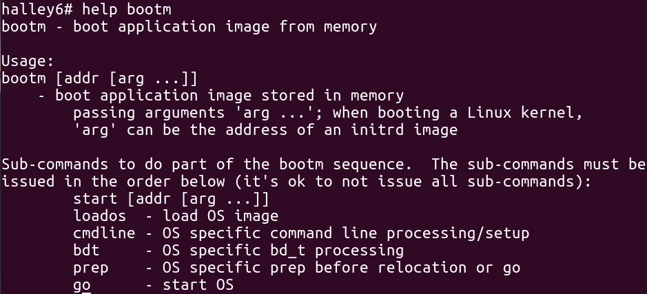
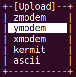

****

**君正®**

Copyright © Ingenic Semiconductor Co. Ltd 2023. All rights reserved.

**Release history**

| Date       | Revision | Change        |
| ---------- | -------- | ------------- |
| 2021.10.15 | 1.0      | First release |
| 2022.12.20 | 2.0      |               |


# u-boot简介

##  u-boot功能

U-Boot 是为嵌入式平台提供的开放源代码的引导程序，可引导包括linux内核在内的多种嵌入式操作系统，支持诸如mips、arm、powerpc等多种处理器架构，它提供串行口、以太网等多种下载方式，提供 NOR 和 NAND 闪存和环境变量管理等功能，支持网络协议栈、JFFS2/EXT2/FAT文件系统，同时还支持多种设备驱动如MMC/SD 卡、USB 设备、LCD 驱动等。

注意:文中所提的Nor没有特殊说明，均指SPI Nor Flash

 Nand 没有特殊说明，均指SPI Nand Flash

##  u-boot引导流程

Halley6平台u-boot引导流程如下图所示：



从上图可看到，分为两种引导方式：

1. bootrom ---> spl ---> u-boot ---> kernel ---> rootfs，该方式需要u-boot引导kernel
2. bootrom ---> spl ---> kernel ---> rootfs，该方式不需要u-boot，由spl直接引导kernel

##  u-boot源码目录介绍

| 目录     | 说明                                   |
| -------- | -------------------------------------- |
| api      | 存放uboot提供的接口函数                |
| arch     | 体系结构相关文件                       |
| board    | 板级相关文件                           |
| common   | 通用的代码，以各种命令为主             |
| disk     | 磁盘分区相关代码                       |
| doc      | 介绍文档                               |
| drivers  | 驱动程序相关代码                       |
| examples | 示例程序                               |
| fs       | 文件系统代码，支持常见的嵌入式文件系统 |
| include  | 头文件                                 |
| lib      | 通用库文件                             |
| nand_spl | nand flash启动相关代码                 |
| net      | 网络相关代码                           |
| post     | Power On Self Test，上电自检程序       |
| spl      | spl相关代码                            |
| test     | 测试代码                               |
| tools    | 辅助工具，用于编译和检查uboot目标文件  |

# u-boot配置

当前halley6平台，决定u-boot配置的文件主要有：

1. **u-boot/boards.cfg**
2. **u-boot/include/configs/x1600_halley6.h**

两个文件共同作用决定最终生成的烧录镜像的配置。

## boards.cfg文件说明

boards.cfg是u-boot中最基础的配置文件，用于区分不同厂家的不同板级的配置。该文件中每一行表示一个具体的板级配置，格式均相同，具体如下表所示：

| Target   | ARCH     | CPU        | Board name | Vendor   | SoC     | Options  |
| -------- | -------- | ---------- | ---------- | -------- | ------- | -------- |
| 目标名称 | 架构名称 | 处理器名称 | 板级名称   | 厂商名称 | Soc名称 | 附加选项 |

其中每一个配置项说明如下：

1. Target：作为该种配置的一个标志；
2. ARCH、CPU、Board name、Vendor、SoC：主要用于Makefile编译时选择代码目录，比如u-boot/include/configs目录下有许多配置文件，选择x1600_halley6.h便是通过Board name确定的；
3. Options：每一种配置之间的主要区别，u-boot会为附加选项中的每个字段前面加上“CONFIG_”前缀并导出为全局可用的宏定义，这些宏定义会进一步决定其他的配置，目前主要是x1600_halley6.h中的配置。

### 默认配置

halley6 共支持六种默认编译配置，如下表所示:

| x1600_halley6_uImage_sfc_nand | **该配置支持从nand flash启动linux内核镜像uImage**CONFIG_SPL_SFC_NAND：sfc nand flash相关配置CONFIG_MTD_SFCNAND：sfc nand flash驱动编译配置CONFIG_SPL_PARAMS_FIXER: 改变CPM频率                                                                                                  |
| x1600_halley6_uImage_sfc_nor  | **该配置支持从nor flash启动linux内核镜像uImage**CONFIG_SPL_SFC_NOR：sfc nor flash相关配置CONFIG_ENV_IS_IN_SFC：环境变量存储相关配置CONFIG_MTD_SFCNOR：sfc nor flash驱动编译相关配置CONFIG_SPL_PARAMS_FIXER: 改变CPM频率                                                         |
| x1600_halley6_uImage_msc1     | **该配置支持从emmc启动linux内核镜像uImage**CONFIG_SPL_JZMMC_SUPPORT：spl中的mmc相关配置CONFIG_ENV_IS_IN_MMC：环境变量存储相关配置CONFIG_GPT_CREATOR：分区相关配置CONFIG_JZ_MMC_MSC1：msc控制器相关配置CONFIG_SPL_PARAMS_FIXER: 改变CPM频率                                      |
| x1600_halley6_xImage_sfc_nand | **该配置支持从nand flash启动linux内核镜像xImage**CONFIG_SPL_SFC_NAND：sfc nand flash相关配置CONFIG_MTD_SFCNAND：sfc nand flash驱动编译相关配置CONFIG_SPL_OS_BOOT：spl直接启动linux内核镜像相关配置CONFIG_SPL_PARAMS_FIXER: 改变CPM频率                                          |
| x1600_halley6_xImage_sfc_nor  | **该配置支持从nor flash启动linux内核镜像xImage**CONFIG_SPL_SFC_NOR：sfc nor flash相关配置CONFIG_MTD_SFCNOR：sfc nor flash驱动编译相关配置CONFIG_SPL_OS_BOOT：spl直接启动linux内核镜像相关配置CONFIG_ENV_IS_IN_SFC：环境变量存储相关配置CONFIG_SPL_PARAMS_FIXER:改变CPM频率      |
| x1600_halley6_xImage_msc1_ota | **该配置支持从emmc启动linux内核镜像xImage**CONFIG_SPL_JZMMC_SUPPORT：spl中的mmc相关配置CONFIG_ENV_IS_IN_MMC：环境变量存储相关配置CONFIG_GPT_CREATOR：分区相关配置CONFIG_JZ_MMC_MSC1：msc控制器相关配置CONFIG_OTA_VERSION30：ota升级相关配置CONFIG_SPL_PARAMS_FIXER: 改变CPM频率 |

### 自定义配置

可根据实际需要，在每种板级配置中增删相应的字段或者新添加一个新的板级配置。

下面以添加一个新的板级配置**x1600_halley6_uImage_msc0**为例进行介绍：

1. 在boards.cfg文件中新起一行，按照该文件的格式要求，先确定第一个配置项为x1600_halley6_uImage_msc0，第二到第六个配置项可参考现存的板级配置，一般都是比较固定的；
2. 主要是附加选项的配置，如果对Halley6平台的u-boot整体配置不是很了解的话，可以先参考现存配置，比如这里可以参考x1600_halley6_uImage_msc1，将JZ_MMC_MSC1改为JZ_MMC_MSC0，这样会选择MSC0相关的配置，其他的保持一致即可；
3. 如果想更加细致的修改附加选项，建议先整体阅读一遍该文档，尤其是第二章关于配置的介绍，在了解了Halley6平台的u-boot整体配置后，再进行修改会更加游刃有余。

## x1600_halley6.h配置文件说明

x1600_halley6.h为u-boot中针对halley6平台核心的配置文件，该配置文件主要包含以下内容：

* 系统时钟配置
* Cache大小配置
* DDR 配置
* SFC/MSC/GMAC/LCD等驱动相关配置
* u-boot built-in 命令

### 系统时钟配置

#### 默认配置

当前系统时钟配置如下：
```c
#define CONFIG_SYS_APLL_FREQ 1200000000

#define CONFIG_SYS_MPLL_FREQ 1200000000

#define CONFIG_SYS_EPLL_FREQ 200000000 

#define CONFIG_CPU_SEL_PLL APLL

#define CONFIG_DDR_SEL_PLL MPLL

#define CONFIG_SYS_CPU_FREQ 1200000000

#define CONFIG_SYS_MEM_FREQ 400000000

#define CONFIG_SYS_EXTAL 24000000 

#define CONFIG_SYS_HZ 1000 
```
#### 自定义配置

1. PLL锁相环频率配置，可根据需要进行配置
```c
#define CONFIG_SYS_APLL_FREQ 1200000000 /*If APLL not use mast be set 0*/

#define CONFIG_SYS_MPLL_FREQ 1200000000 /*If MPLL not use mast be set 0*/

#define CONFIG_SYS_EPLL_FREQ 200000000 /*If EPLL not use mast be set 0*/
```
2. CPU、DDR的PLL选择，建议使用默认配置
```c
#define CONFIG_CPU_SEL_PLL APLL

#define CONFIG_DDR_SEL_PLL MPLL
```
3. CPU、DDR频率配置，其中CPU的频率需要与选择的PLL频率成倍数关系，并且最高支持 1.3GHz, 同时DDR的频率也需要与选择的PLL频率成倍数关系
```c
#define CONFIG_SYS_CPU_FREQ 1200000000

#define CONFIG_SYS_MEM_FREQ 400000000
```
### *[DDR 配置](DDR配置.md)*

### SFC 驱动配置

#### spl阶段驱动

驱动文件位置：common/spl
```
├── spl_sfc_nand.c
├── spl_sfc_nand_v2.c
├── spl_sfc_nor.c
├── spl_sfc_nor_v2.c
```
#### uboot阶段驱动文件

**位置： drivers/mtd/devices/jz_sfc_v2**
```
├── jz_sfc_common.c 
├── jz_sfc_common.h 
├── jz_sfc_nand.c
├── jz_sfc_nor.c
├── jz_sfc_ops.c
├── Makefile
└── nand_device
 ├── ato_nand.c
 ├── dosilicon_nand.c
 ├── foresee_nand.c
 ├── gd_nand.c
 ├── mxic_nand.c
 ├── nand_common.c
 ├── nand_common.h
 ├── xtx_mid0b_nand.c
 ├── xtx_nand.c
 └── zetta_nand.c
```
#### 配置说明

1. sfc控制器gpio引脚功能配置
```c
/* sfc gpio */

CONFIG_SPL_SFC_SUPPORT
```
2. sfc nand flash配置，如果定义**CONFIG_SPL_SFC_NAND**，则nand相关的配置会被打开：
```c
/* sfc nand config */

#ifdef CONFIG_SPL_SFC_NAND

#define CONFIG_SFC_NAND_RATE 100000000 /* value <= 400000000(sfc 100Mhz)*/

#define CONFIG_SFC_QUAD

#define CONFIG_SPI_SPL_CHECK

#define CONFIG_SPIFLASH_PART_OFFSET 0x5800

#define CONFIG_SPI_NAND_BPP (2048 +64) /*Bytes Per Page*/

#define CONFIG_SPI_NAND_PPB (64) /*Page Per Block*/

#define CONFIG_JZ_SFC

#define CONFIG_CMD_SFCNAND

#define CONFIG_CMD_NAND

#define CONFIG_SYS_MAX_NAND_DEVICE 1

#define CONFIG_SYS_NAND_BASE 0xb3441000

#define CONFIG_SYS_MAXARGS 16

/*#define CONFIG_NAND_BUILTIN_PARAMS*/

/* sfc nand env config */

#define CONFIG_MTD_DEVICE

#define CONFIG_CMD_SAVEENV /* saveenv */

#define CONFIG_CMD_UBI

#define CONFIG_CMD_UBIFS

#define CONFIG_CMD_MTDPARTS

#define CONFIG_MTD_PARTITIONS

#define MTDIDS_DEFAULT "nand0:nand"

#define MTDPARTS_DEFAULT "mtdparts=nand:1M(boot),8M(kernel),40M(rootfs),-(data)"

#define CONFIG_SYS_NAND_BLOCK_SIZE (128 * 1024)

#endif
```
3. sfc nor flash配置，如果定义**CONFIG_SPL_SFC_NOR**，则nor相关的配置会被打开：
```c
/* sfc nor config */

#ifdef CONFIG_SPL_SFC_NOR

#define CONFIG_JZ_SFC

#define CONFIG_CMD_SFC_NOR

#define CONFIG_JZ_SFC_NOR

#define CONFIG_SPI_SPL_CHECK

#define CONFIG_SFC_NOR_RATE 100000000 /* value <= 400000000(sfc 100Mhz)*/

#define CONFIG_SFC_QUAD

#define CONFIG_SPIFLASH_PART_OFFSET 0x5800

#define CONFIG_SPI_NORFLASH_PART_OFFSET 0x5874

#define CONFIG_NOR_MAJOR_VERSION_NUMBER 1

#define CONFIG_NOR_MINOR_VERSION_NUMBER 0

#define CONFIG_NOR_REVERSION_NUMBER 0

#define CONFIG_NOR_VERSION (CONFIG_NOR_MAJOR_VERSION_NUMBER | (CONFIG_NOR_MINOR_VERSION_NUMBER << 8) | (CONFIG_NOR_REVERSION_NUMBER <<16))

/*#define CONFIG_NOR_BUILTIN_PARAMS*/

#endif
```
#### 默认配置

1. 使用nand flash启动，在boards.cfg文件的**x1600_halley6_uImage_sfc_nand**配置和**x1600_halley6_xImage_sfc_nand**配置中导出了**CONFIG_SPL_SFC_NAND。**
2. 使用nor flash启动，在boards.cfg文件的**x1600_halley6_uImage_sfc_nor**配置中导出了**CONFIG_SPL_SFC_NOR。**

#### 自定义配置

1. sfc控制器gpio引脚，可根据硬件连接情况进行选择
```c
/* sfc gpio */

CONFIG_SPL_SFC_SUPPORT
```
2. nand flash配置

a. sfc控制器速率，注意最终的速率为该宏定义4分频之后的结果
```c
#define CONFIG_SFC_NAND_RATE 100000000 /* value <= 400000000(sfc 100Mhz)*/
```
b. 数据传输线宽，定义该宏定义为4线，否则为1线
```c
#define CONFIG_SFC_QUAD
```
c. nand flash分区参数存储在nand flash中的偏移
```c
#define CONFIG_SPIFLASH_PART_OFFSET 0x5800
```
d. nand flash页大小和块大小，根据具体的nand flash型号确定
```c
#define CONFIG_SPI_NAND_BPP (2048 +64) /*Bytes Per Page*/

#define CONFIG_SPI_NAND_PPB (64) /*Page Per Block*/
```
e. 是否使用内置分区参数，定义则使用，否则不使用
```c
/*#define CONFIG_NAND_BUILTIN_PARAMS*/
```
3. nor flash配置

a. SFC控制器时钟速率，注意最终的速率为该宏定义4分频之后的结果
```c
#define CONFIG_SFC_NOR_RATE 100000000 /* value <= 400000000(sfc 100Mhz)*/
```
b. 数据传输线宽，定义该宏定义为4线，否则为1线
```c
#define CONFIG_SFC_QUAD
```
c. nor flash分区参数存储在nor flash中的偏移
```c
#define CONFIG_SPIFLASH_PART_OFFSET 0x5800
```
d. nor flash硬件参数存储在nor flash中的偏移
```c
#define CONFIG_SPI_NORFLASH_PART_OFFSET 0x5874
```
e. 是否使用内置分区参数，定义则使用，否则不使用
```c
/*#define CONFIG_NOR_BUILTIN_PARAMS*/
```
### MSC 驱动配置

#### spl阶段驱动文件

**驱动文件位置：common/spl**
```
├── spl_mmc.c
```
#### uboot阶段驱动文件

**位置： drivers/mmc**
```
└── jz_mmc.c
```
#### 配置说明

1. MSC0配置，如果定义**CONFIG_JZ_MMC_MSC0**，则MSC0相关的配置会被打开：
```c
#define CONFIG_GENERIC_MMC 1

#define CONFIG_MMC 1

#define CONFIG_JZ_MMC 1

#ifdef CONFIG_JZ_MMC_MSC0

#define CONFIG_JZ_MMC_SPLMSC 0

#define CONFIG_JZ_MMC_MSC0_PC_4BIT 1

#endif

#ifdef CONFIG_ENV_IS_IN_MMC

#define CONFIG_SYS_MMC_ENV_DEV 0

#define CONFIG_ENV_SIZE (32 << 10)

#define CONFIG_ENV_OFFSET (CONFIG_SYS_MONITOR_LEN + CONFIG_SYS_MMCSD_RAW_MODE_U_BOOT_SECTOR * 512)

#endif

#ifdef CONFIG_SPL_MMC_SUPPORT

#define CONFIG_SPL_SERIAL_SUPPORT

#define CONFIG_MMC_SPL_PARAMS

/*#define CONFIG_SPL_PARAMS_FIXER*/

#endif /* CONFIG_SPL_MMC_SUPPORT */
```
2. MSC1配置，如果定义**CONFIG_JZ_MMC_MSC1**，则MSC1相关的配置会被打开：
```c
#define CONFIG_GENERIC_MMC 1

#define CONFIG_MMC 1

#define CONFIG_JZ_MMC 1

#ifdef CONFIG_JZ_MMC_MSC1

#define CONFIG_JZ_MMC_SPLMSC 1

#define CONFIG_JZ_MMC_MSC1_PD 1

#endif

#ifdef CONFIG_ENV_IS_IN_MMC

#define CONFIG_SYS_MMC_ENV_DEV 0

#define CONFIG_ENV_SIZE (32 << 10)

#define CONFIG_ENV_OFFSET (CONFIG_SYS_MONITOR_LEN + CONFIG_SYS_MMCSD_RAW_MODE_U_BOOT_SECTOR * 512)

#endif

#ifdef CONFIG_SPL_MMC_SUPPORT

#define CONFIG_SPL_SERIAL_SUPPORT

#define CONFIG_MMC_SPL_PARAMS

/*#define CONFIG_SPL_PARAMS_FIXER*/

#endif /* CONFIG_SPL_MMC_SUPPORT */
```
#### 默认配置

使用sd卡启动，在boards.cfg文件的**x1600_halley6_uImage_msc1**配置中导出了**CONFIG_JZ_MMC_MSC1**，即当前默认使用MSC1配置。

#### 自定义配置

MSC0、MSC1每种配置中，均可以自定义如下配置：

1. 数据传输位数，MSC0和MSC1最多支持4位
```c
#define CONFIG_SPL_JZ_MSC_BUS_4BIT
```
2. 是否打开DEBUG 信息
```c
/*#define CONFIG_MMC_TRACE // only for DEBUG*/
```
#### 分区表介绍

sd卡启动的u-boot镜像中包含有分区表的信息，在编译u-boot镜像的最后，有如下输出信息：
```bash
$ cat tools/ingenic-tools/mbr-gpt.bin u-boot-with-spl.bin > u-boot-with-spl-mbr-gpt.bin
```
可以看到，在最终生成的u-boot镜像前面加入了mbr-gpt.bin，该文件为按照GPT分区标准生成的分区数据，用于将u-boot镜像烧录到sd卡后，可直接在PC端识别出分区信息，而不必再利用分区工具对sd卡进行分区操作。

该分区数据mbr-gpt.bin中包括了具体的分区信息，下面介绍分区信息，关于MBR与GPT分区标准相关内容，可参考[5.2MBR/GPT分区表](#_MBR/GPT分区表)。

在u-boot/board/ingenic/x1600_halley6/partitions.tab中存放有具体的分区信息：
```c
property:

 disk_size = 4096m

 gpt_header_lba = 512

 custom_signature = 0

partition:

 #name = start, size, fstype

 xboot = 0m, 3m,

 boot = 3m, 8m, EMPTY

 recovery = 12m, 16m, EMPTY

 pretest = 28m, 16m, EMPTY

 reserved = 44m, 52m, EMPTY

 misc = 96m, 4m, EMPTY

 cache = 100m, 100m, LINUX_FS

 system = 200m, 1800m, LINUX_FS

 data = 2000m, 2048m, LINUX_FS

#fstype could be: LINUX_FS, FAT_FS, EMPTY
```
当我们把镜像烧录到sd卡后，在PC端使用fdisk命令可看到如下分区信息：

设备 Start 末尾 扇区 Size 类型
```
/dev/sdc1 6144 22527 16384 8M Microsoft basic data

/dev/sdc2 24576 57343 32768 16M Microsoft basic data

/dev/sdc3 57344 90111 32768 16M Microsoft basic data

/dev/sdc4 90112 196607 106496 52M Microsoft basic data

/dev/sdc5 196608 204799 8192 4M Microsoft basic data

/dev/sdc6 204800 409599 204800 100M Microsoft basic data

/dev/sdc7 409600 4095999 3686400 1.8G Microsoft basic data

/dev/sdc8 4096000 8290303 4194304 2G Microsoft basic data
```
该分区信息与上述partitions.tab文件中的内容完全一致。

### GMAC 网络驱动配置

#### 驱动文件

**位置： drivers/net**
```
├── jz_gmac_v12.c
├── SynopGMAC_Dev.c
└── SynopGMAC_Dev.h
```
#### 配置说明

1. ip地址相关
```c
/* DEBUG ETHERNET */

#define CONFIG_SERVERIP 192.168.4.13

#define CONFIG_IPADDR 192.168.4.145

#define CONFIG_GATEWAYIP 192.168.4.1

#define CONFIG_NETMASK 255.255.255.0

#define CONFIG_ETHADDR 00:11:22:33:44:55
```
2. 网口工作模式
```c
#define GMAC_PHY_RMII 4

#define CONFIG_NET_GMAC_PHY_MODE GMAC_PHY_RMII
```
3. gmac控制器
```c
#ifdef CONFIG_GMAC0

#define CONFIG_HALLEY6_MAC_POWER_EN

#define CONFIG_GAMAC_MODE_CTRL_ADDR 0xb00000e4

#define JZ_GMAC_BASE 0xb34b0000

#define CONFIG_GMAC_CRLT_PORT GPIO_PORT_B

#define CONFIG_GMAC_CRLT_PORT_PINS (0x3ff << 19)

#define CONFIG_GMAC_CRTL_PORT_INIT_FUNC GPIO_FUNC_1

#define CONFIG_GMAC_PHY_RESET GPIO_PB(31) 

#define CONFIG_GMAC_TX_CLK_DELAY 0x3f

#define CONFIG_GMAC_RX_CLK_DELAY 0

#endif

#define CONFIG_GMAC_CRTL_PORT_SET_FUNC GPIO_INPUT

#define CONFIG_GMAC_PHY_RESET_ENLEVEL 0
```
#### 默认配置

1. 当前默认选择gmac0控制器：
```c
#define CONFIG_GMAC0
```
#### 自定义配置

1. 当前u-boot只同时支持一个gmac控制器工作，根据实际硬件配置，控制器可选择gmac0或者gmac1。

2. 根据实际速度需要，工作模式可选择RMII，RMII支持10兆和100兆的总线接口速度。

### LCD驱动配置

#### 驱动文件

**位置： drivers/video/jz_lcd**
```
├── jz_lcd_v14.c
├── jz_mipi_dsi
├── lcd_panel
```
#### 配置说明

**如需要在uboot阶段显示log则需要在include/configs/x1600_halley6.h打开**

**#define CONFIG_LCD 这个宏**
```c
#ifdef CONFIG_LCD

#define LCD_BPP 5 /* 4: 16BPP, 5: 24BPP. */

#define CONFIG_LCD_LOGO

#define CONFIG_LCD_ENABLE_RDMA_FB 
```
#### 自定义配置说明

如果客户想要在uboot阶段显示自己的log：

1. 需要在/tools/logos目录下添加显示的log图片。
2. 修改/tools/Makefile
```c
 ifneq ($(wildcard logos/$(VENDOR).bmp),)

LOGO_BMP ?= logos/$(VENDOR).bmp #将此..bmp文件改成自己需要显示的log图片名称。
```
### u-boot built-in命令配置

#### 默认配置

当前默认支持如下命令：
```c
/**
* Command configuration.
*/

#define CONFIG_CMD_BOOTD /* bootd */

#define CONFIG_CMD_CONSOLE /* coninfo */

#define CONFIG_CMD_DHCP /* DHCP support */

#define CONFIG_CMD_ECHO /* echo arguments */

#define CONFIG_CMD_EXT4 /* ext4 support */

#define CONFIG_CMD_FAT /* FAT support */

#define CONFIG_USE_XYZMODEM /* xyzModem */

#define CONFIG_CMD_LOAD /* serial load support */

#define CONFIG_CMD_LOADB /* loadb */

#define CONFIG_CMD_LOADS /* loads */

#define CONFIG_CMD_MEMORY /* md mm nm mw cp cmp crc base loop mtest */

#define CONFIG_CMD_MISC /* Misc functions like sleep etc*/

#define CONFIG_CMD_NET /* networking support */

#define CONFIG_CMD_PING

#define CONFIG_CMD_RUN /* run command in env variable */

#define CONFIG_CMD_SETGETDCR /* DCR support on 4xx */

#define CONFIG_CMD_SOURCE /* "source" command support */

#define CONFIG_CMD_GETTIME

#define CONFIG_CMD_GPIO

#define CONFIG_CMD_EXT2

#define CONFIG_CMD_EXT4

#define CONFIG_CMD_FAT

#define CONFIG_EFI_PARTITION

#define CONFIG_SOFT_BURNER

#define CONFIG_CMD_DDR_TEST /* DDR Test Command */
```
#### 自定义配置

下面以新建一个简单的hello命令为例介绍如何在u-boot中自定义命令。

1. 在common目录下，新建一个文件cmd_hello.c，输入如下代码：
```c
#include<command.h>

#include<common.h>

static int do_hello(cmd_tbl_t *cmdtp, int flag, int argc, char * const argv[])

{

printf(“hello world!\n”);

return 0;

}

U_BOOT_CMD(
hello, 1, 0, do_hello,
"short description. This is a string.\n",
"long description. This is a string.\n"

);
```
上述代码中，U_BOOT_CMD为u-boot新建命令使用的宏定义，一共有6个参数，具体介绍如下：

a.第一个参数：该命令的名称

b.第二个参数：该命令的参数的个数

c.第三个参数：按下enter键后是否重复执行该命令

d.第四个参数：该命令对应的回调函数

e.第五个参数：该命令的短帮助信息

f.第六个参数：该命令的长帮助信息

2. 在common/Makefile中添加编译选项：

COBJS-y += cmd_hello.o

3. 重新编译u-boot即可

### 内核传参说明

 参考[u-boot内核传参说明](#_u-boot内核传参说明)

# **u-boot编译**

 u-boot的编译分为两种，两种的特点如下:

| **编译方式**           | **特点**                                                                              |
| ---------------------- | ------------------------------------------------------------------------------------- |
| **工程顶层目录编译**   | 依赖配合君正SDK 板级配置。适合基于君正SDK的开发方式                                   |
| **u-boot源码目录编译** | 直接按照u-boot的标准编译方式进行，适合需要自定义u-boot的配置，脱离君正SDK的开发方式。 |

## 工程顶层目录编译

### 编译SFC Nand启动镜像

该启动镜像对应**x1600_halley6_uImage_sfc_nand**配置。

1. 在工程顶层目录下执行如下命令，导入编译halley6平台所需的环境变量：
```bash
$ source build/envsetup.sh
```

2. 执行lunch命令选择需要编译镜像的类型：
```bash
$ lunch
```

**a.如果是halley6 v10开发板，根据需要在以下配置中进行选择：**

 10.x1600halley6.v10_nand_4.4.94-eng

 11.x1600halley6.v10_nand_4.4.94-user

 12.x1600halley6.v10_nand_4.4.94-userdebug

3. 执行make uboot-clean清除上次编译产生的中间产物：
```bash
$ make uboot-clean
```

4. 执行make uboot进行编译：
```bash
$ make uboot
```

5. 等待编译完成，在`工程/out/product/x1600halley6.v10_nand_4.4.94-eng/image`目录下便会生成uboot镜像文件，该镜像即可直接进行烧录。

### 编译SFC Nor启动镜像

该启动镜像对应**x1600_halley6_uImage_sfc_nor**配置。

1. 在工程顶层目录下执行如下命令，导入编译halley6平台所需的环境变量：
```bash
$ source build/envsetup.sh
```

2. 执行lunch命令选择需要编译镜像的类型：
```bash
$ lunch
```

**a.如果是halley6 v10开发板，根据需要在以下配置中进行选择：**

 13.x1600halley6.v10_nor_4.4.94-eng

 14.x1600halley6.v10_nor_4.4.94-user

 15.x1600halley6.v10_nor_4.4.94-userdebug

3. 执行make uboot-clean清除上次编译产生的中间产物：
```bash
$ make uboot-clean
```

4. 执行make uboot进行编译：
```bash
$ make uboot
```

5. 等待编译完成，在`工程/out/produc/x1600halley6.v10_nor_4.4.94-eng/image`目录下便会生成uboot镜像文件，该镜像即可直接进行烧录。

### 编译SD卡启动镜像

Halley6硬件暂未支持SD卡接口。

##  u-boot源码目录编译

1. 在工程顶层目录下执行如下命令，导入编译halley6平台所需的环境变量：
```bash
$ source build/envsetup.sh
```

2. 执行lunch命令选择需要编译镜像的类型，这里只是为了导入交叉编译工具环境，如果只编译 u-boot可以随意选择：
```bash
$ lunch

```
3. 之后进入u-boot目录，执行make distclean清除上次编译产生的中间产物：
```bash
$ make distclean
```

执行make xxxxxx -jN命令进行编译，xxxxxx为具体的板级配置名称，需要根据编译的启动 镜像来决定，详细介绍请参考[2.1 boards.cfg文件说明](#_boards.cfg文件说明)。当前共支持3种板级配置，具体如下表所示：

|                               |                                               |
| ----------------------------- | --------------------------------------------- |
| x1600_halley6_uImage_sfc_nand | 该配置支持从nand flash启动linux内核镜像uImage |
| x1600_halley6_uImage_sfc_nor  | 该配置支持从nor flash启动linux内核镜像uImage  |
| x1600_halley6_xImage_sfc_nand | 该配置支持从nand flash启动linux内核镜像xImage |

比如，编译从nand flash启动uImage的启动镜像，执行如下命令：
```bash
$ make x1600_halley6_uImage_sfc_nand -jN
```

其中-jN为使用多线程编译，可以加快编译速度，具体的N值需要根据使用的PC决定。

1. 编译好之后，会在u-boot工程顶层目录下生成u-boot-with-spl-mbr-gpt.bin，该文件便是最终生成的镜像文件，可以直接进行烧录。

# u-boot应用与内核接口

##  u-boot常用命令

进入 uboot 的命令行模式以后输入“help”或者“？”，然后按下回车即可查看当前 uboot 所支持的命令。

现以sfc nand flash启动为例，支持的命令如下图所示：





对于每一个命令，还可以执行“help 命令名称”获取该命令具体的使用说明，如下图所示：



**下面介绍一些常用的命令：**


| printenv   | 打印当前环境变量                                                                                                                                    |
| ---------- | --------------------------------------------------------------------------------------------------------------------------------------------------- |
| setenv     | 设置环境变量，格式：setenv name value …，表示将name 变量设置成value 值；如果没有这个参数，表示删除该变量                                            |
| saveenv    | 保存环境变量到存储设备中                                                                                                                            |
| sleep      | 延迟执行，格式：sleep N，可以延迟N秒钟执行                                                                                                          |
| bootm      | 从内存的指定地址处启动内核镜像。格式：bootm addr，参数是镜像在内存中的地址                                                                          |
| md         | 读内存数据，格式：md [.b, .w, .l] address [# of objects]，第一个参数表示一次读取的数据单位（b:8位，w:16位，l:32位），第二个参数address表示要读取的内存起始地址，第三个参数表示从address开始读取的数据个数 |
| nand erase | 擦除nand flash，格式：nand erase addr1 count，第一个参数是offset，第二个参数是擦除字节数                                                            |
| nand write | 将内存数据写入nand flash，格式：nand write addr offset count，第一个参数是写入基地址，第二个参数是偏移地址，第三个参数是写入字节数                  |
| nand read  | 将nand flash的数据读取到内存，格式：nand read addr offset count，第一个参数是读取的nand flash地址，第二个参数是内存位置偏移，第三个参数是读取字节数 |
| cp         | 在内存中复制数据，格式：cp source target count，第一个参数是源地址，第二个参数是目的地址，第三个参数是复制数目                                      |
| cmp        | 比较内存中的数据，格式：cmp addr1 addr2 count，第一个参数是内存地址一，第二个参数是内存地址二，第三个是比较长度（单位是字节数除以4，以WORDS为单位） |
| crc32      | 计算校验值，格式：crc32 address count [addr]，第一个参数是需校验的起始地址，第二个参数是校验的数据字节数，第三个参数是保存校验值的地址              |

##  u-boot内核传参说明

linux内核在启动之前，需要知道当前硬件的一些必要的参数，比如可使用的内存大小、使用的串口设备、根文件系统所在的设备及分区等。关于以上的启动参数，linux内核已经定义好了一系列规则，负责启动它的bootloader需要遵守这些规则来传递启动参数。方便的是，u-boot已经帮我们做好了大部分工作，它提供了一个环境变量bootargs，我们只需要按照规定的格式将必要的启动参数设置给bootargs即可。

具体的，可以通过在x1600_halley6.h中将启动参数设置给宏定义CONFIG_BOOTARGS。

在x1600_halley6.h中，根据加载内核时挂载的文件系统的不同均有对应的启动参数，它们有一些共有的内容，在x1600_halley6.h中定义如下：
```c
#define BOOTARGS_COMMON "console=ttyS2,115200n8 mem=64M@0x0”
```
具体说明如下：

1. console=ttyS2,115200表示串口使用/dev/ttyS2这个设备，波特率为115200
2. mem=64M@0x0表示可使用的内存总大小为64MB，起始地址为0x0

**启动参数中特有的部分请见下文。**

### u-boot加载内核挂载网络文件系统

网络文件系统一般用于开发时调试使用，当前在x1600_halley6.h中的参考启动参数如下：
```c
#define CONFIG_BOOTARGS 

BOOTARGS_COMMON "ip=192.168.10.207:192.168.10.1:192.168.10.1:255.255.255.0 \ nfsroot=192.168.4.13:/home/nfsroot/fpga/user/pzqi/rootfs-tst rw"
```

具体说明如下：

1. ip=192.168.10.207:192.168.10.1:192.168.10.1:255.255.255.0表示客户端（开发板）ip地址为192.168.10.207，服务端ip地址为192.168.10.1，网关ip地址为 192.168.10.1，子网掩码ip地址为255.255.255.0
2. nfsroot=192.168.4.13:/home/nfsroot/fpga/user/pzqi/rootfs-tst表示服务端ip地址为 192.168.4.13，挂载到的服务端目录为/home/nfsroot/fpga/user/pzqi/rootfs-tst
3. rw表示挂载的文件系统可读写

**注意**：如果kernel配置了双网络控制器，需要在ip项中指定启动网络文件系统的设备：
```c
ip=192.168.10.207:192.168.10.1:192.168.10.1:255.255.255.0::eth0:off /*根据选择的网口，修改eth0:off或eth1:off*/
```

### u-boot加载内核挂载jffs2文件系统

该启动参数对应**x1600_halley6_uImage_sfc_nor**配置**，**当前在x1600_halley6.h中的启动参数如下：
```c
#define CONFIG_BOOTARGS 

BOOTARGS_COMMON "ip=off init=/linuxrc rootfstype=jffs2 root=/dev/mtdblock2 rw flashtype=nor"
```

具体说明如下：

1. ip=off表示不使用网络文件系统
2. init=/linuxrc表示init进程使用的是根目录下的linuxrc
3. rootfstype=jffs2表示根文件系统格式为jffs2
4. root=/dev/mtdblock2表示存放根文件系统的设备为/dev/mtdblock2，对应着nor flash编号为2的分区
5. rw表示挂载的文件系统可读写

### u-boot加载内核挂载ubifs文件系统

该启动参数对应**x1600_halley6_uImage_sfc_nand**配置**，**当前在x1600_halley6.h中的启动参数如下：
```c
#define CONFIG_BOOTARGS 

BOOTARGS_COMMON "ip=off init=/linuxrc ubi.mtd=2 root=ubi0:rootfs ubi.mtd=3 rootfstype=ubifs rw flashtype=nand"
```

具体说明如下：

1. ip=off表示不使用网络文件系统启动
2. init=/linuxrc表示init进程使用的是根目录下的linuxrc
3. ubi.mtd=2 root=ubi0:rootfs ubi.mtd=3 rootfstype=ubifs rw表示当前nand flash编号为2和3的分区使用的是ubifs文件系统，并且根文件系统以可读写的方式挂载在了编号为2的分区上。

##  u-boot加载内核镜像

u-boot通过tftp或者fastboot方式加载内核镜像可省去烧录kernel镜像的过程，直接将内核镜像加载到内存，使用该方式在开发过程中非常便于调试使用。

### uboot通过tftp加载内核镜像

tftp方式可通过网络将kernel镜像直接下载到内存，所以注意使用该方式需要u-boot支持网络。

1. uboot只支持一个gmac控制器工作，需要在x1600_halley6.h中配置选择的控制器和对应控制器的接口模式：
```c
/* Select GMAC Controller */

#define CONFIG_GMAC0 /*根据实际测试，配置对应的GMAC1、GMAC0*/
```
2. PC服务器端配置
```bash
$ sudo apt-get install tftpd-hpa #安装服务端程序

$ sudo service tftpd-hpa start #启动服务端

$ sudo apt-get install tftp-hpa #安装客户端程序

$ tftp 127.0.0.1 #测试服务端是否设置成功

tftp> get test.txt
```

3. 开发板端配置

a. 进入uboot命令行模式，根据网络情况设置ip地址：
```bash
x1600_halley6# set ipaddr 192.168.4.145

x1600_halley6# set serverip 192.168.4.146
```
b. 将需要的uImage放入PC服务器文件夹下，执行以下命令将uImage下载到内存 0x80800000位置处：
```bash
x1600_halley6# tftp 0x80800000 uImage
```
c. 启动uImage：
```bash
x1600_halley6# bootm 0x80800000
```

### uboot通过fastboot命令加载内核镜像

fastboot方式是使用usb端口把kernel镜像下载到内存并启动的命令，只用于调试使用,不支持android fastboot 其他功能。

1. PC端使用以下命令安装fastboot应用程序：
```bash
$ sudo apt-get install android-tools-fastboot
```

2. 进入uboot命令行模式，输入fastboot命令：
```bash
x1600_halley6# fastboot
```

3. 在PC端存放kernel镜像的路径下执行以下命令：
```bash
$ sudo fastboot boot uImage
```
4. 命令执行成功后，即可将kernel镜像下载到内存并启动。

### u-boot通过串口加载内核镜像

串口方式是通过串口将kernel镜像直接下载到内存，注意该方式传输速度会较慢，请根据实际情况选择。

1. 进入u-boot命令行模式，执行如下命令：
```bash
x1600_halley6# loady 0x80800000 115200
## Ready for binary (ymodem) download to 0x80800000 at 115200 bps...
```

2. 先按住ctrl键不放，接着按住a键，再同时放开两个按键，最后按一下s键，可以看到如下图所示画面：



这里按↓键选择ymodem协议，然后回车；

3. 然后会出现如下图所示画面，这里可以选择需要传输的文件，↑↓键进行移动，双敲空格键进入目录，单敲空格键选择文件，回车键确认选择。

我们选择需要传输的kernel镜像：


4. 选择完毕并回车确认后，会出现如下进行文件的传输的画面：


5. 等待传输完毕，便可以通过bootm命令启动写到内存0x80800000位置处的kernel镜像:
```bash
$ bootm 0x80800000
```

# Ingenic tools介绍

Ingenic tools是君正厂商添加在u-boot内的工具集合。

## DDR参数相关

**源码位置：u-boot/tools/ingenic-tools/**
```
├── ddr_creator_x1600
│   ├── add_chip_info.c
│   ├── ddr3_params.c
│   ├── ddr_params_creator.c
│   ├── ddr_params_creator.h
│   ├── lpddr2_params.c
│   ├── lpddr3_params.c
│   ├── Makefile
│   ├── supported_ddr_chips.c
```
这里主要用于生成相应的DDR参数，然后写到u-boot镜像的指定位置，以此进行区分。

## MBR/GPT分区表

**源码位置：u-boot/tools/ingenic-tools/**
```
├── gpt.bin
├── gpt_creator.c
├── gpt_tab_to_c.sh
├── mbr_creator.c
├── mbr-of-gpt.bin
├── mk-gpt-xboot.sh
```
GPT和MBR均是关于硬盘分区的标准。

MBR：Master Boot Record，主分区引导记录，记录着硬盘本身的相关信息以及硬盘各个分区的大小及位置信息。

GPT：Globally Unique Identifier Partition Table，GUID分区表，是源自UEFI标准的一种较新的磁盘分区表结构的标准。与MBR分区方案相比，GPT提供了更加灵活的磁盘分区机制。

这里文件的作用是按照GPT和MBR的标准生成对应的分区数据。

## nand/nor flash相关

**源码位置：u-boot/tools/ingenic-tools/**

1. 保存有各种nand flash的硬件参数，用于spl中的sfc驱动使用
```
├── nand_device
```
2. 保存nand flash和nor flash的分区参数，区别于由烧录工具写入分区参数，最终会由kernel中的sfc驱动读取并生成对应的mtd分区，如有需要可自行更改
```
├── sfc_builtin_params
│   ├── nand_device.c
│   ├── nand_device.h
│   ├── nor_device.c
│   └── nor_device.h
```
3. 用于写入nand flash和nor flash的分区参数到u-boot镜像中的指定位置
```
├── sfc_nand_builtin_params.c
├── sfc_nor_builtin_params.c
```
##  其他

**源码位置：u-boot/tools/ingenic-tools/**

1. 用于生成sfc控制器的硬件timing参数
```
├── sfc_timing_params.c
```
2. 用于sfc boot时生成spl前面的头部数据，为bootom加载spl作校验用
```
└── spi_checksum.c
```
# 参考文档

1. **u-boot/README**
2. **kernel-4.4.94/Documentation/kernel-parameters.txt**
