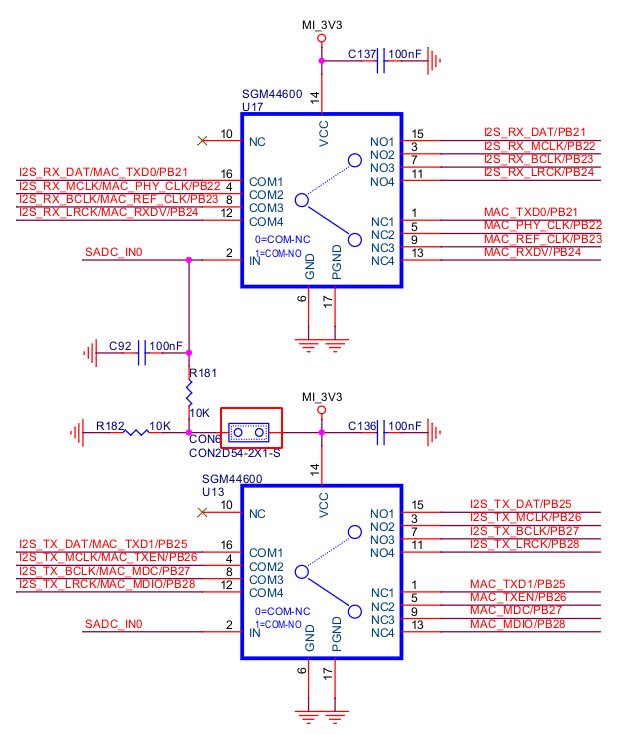

# Audio音频子系统

## 模块功能介绍

AIC支持I2S或IIS协议,用于在处理器的系统内存（外部I2S编解码器）之间传输数字化音频。

* 支持独立时钟、共享时钟
* 支持i2s, left justified协议
* 支持主、从模式

## 硬件说明



由于x1600的i2s和mac共用一组GPIO，所以在使用时只能选择使用录放音功能还是以太网功能，在硬件设计上也需要通过短接CON6来选择使用哪个功能，如果使用录放音功能需要短接CON6，如果使用以太网功能不需要短接CON6。

## 驱动源码位置

audio控制器源码位置：

***module_drivers/sound/soc/ingenic/as-v1***

板级源码位置：

***module_drivers/sound/soc/ingenic/boards***

外部codec源码位置：

***module_drivers/sound/soc/ingenic/ecodec/***

## 设备树配置

设备树所在位置

内核dts文件路径：

kernel内核(version <= 5.10)dts文件路径：

***module_drivers/dts/x1600.dtsi***

kernel内核(version > 5.10)dts文件路径：

***module_driver/dts/x1600/x1600.dtsi***

Audio控制器描述：

```c
aic: aic@0x10079000 {

	compatible = "ingenic,x1600-aic";

	reg = <0x10079000 0x100>;

	interrupt-parent = <&core_intc>;

	interrupts = <IRQ_AUDIO>;

	dmas = <&pdma INGENIC_DMA_TYPE(INGENIC_DMA_REQ_ASOC_AIC_TX)>,

	<&pdma INGENIC_DMA_TYPE(INGENIC_DMA_REQ_ASOC_AIC_RX)>;

	dma-names = "tx", "rx";

	i2s: i2s {

		compatible = "ingenic,x1600-i2s";

		status = "ok";

	};

	i2s_tloop: i2s_tloop {

		compatible = "ingenic,i2s-tloop";

		dmas=<&pdma INGENIC_DMA_TYPE(INGENIC_DMA_REQ_ASOC_AIC_LOOP)>;

		dma-names = "rx";

		status = "ok";

	};

 };
```

### 设备树默认配置

设备树默认编译不会产生audio设备，并在module_drivers/dts/halley6_v20.dts或module_drivers/dts/x1600/halley6_v20.dts下配置：

```c
&aic {

	status = "disable"; 

	pinctrl-names = "default";

	pinctrl-0 = <&aic_pb>;

};

dump_pcm_codec:dump_pcm_codec{

	compatible = "ingenic,pcm-dump-codec";

	status = "disable";

};

sound_halley6_ecdc {

	status = "disable";

	compatible = "ingenic,x1600-sound";

	ingenic,model = "halley6";

	ingenic,dai-link = "i2s-ecodec", "i2s-tloop";

	ingenic,stream = "i2s-ecodec", "i2s-tloop";

	ingenic,cpu-dai = <&i2s>, <&i2s_tloop>;

	ingenic,platform = <&aic>, <&i2s_tloop>;

	ingenic,codec = <&dump_pcm_codec>, <&dump_pcm_codec>;

	ingenic,codec-dai = "pcm-dump", "pcm-dump";

	ingenic,en3v3-gpios = <&gpb 30 GPIO_ACTIVE_HIGH INGENIC_GPIO_NOBIAS>;

};
```

### 设备树自定义配置

用户可根据实际需求开启audio设备。

## 内核编译配置

内核配置SND_ASOC_INGENIC，配置说明如下：

```
Symbol: SND_ASOC_INGENIC [=y]

Type : tristate

Prompt: [AUDIO] ASoC support for Ingenic

 Location: 

 -> Ingenic device-drivers Configurations

Defined at module_drivers/sound/soc/ingenic/Kconfig:1

Depends on: MACH_XBURST [=y] || MACH_XBURST2 [=n]

Selects: SND_SOC [=y] && SND [=y] && SOUND [=y] 
```

### 内核默认编译配置

内核默认配置audio驱动，配置界面如下：

```
Ingenic device-drivers Configurations --->

<*> [AUDIO] ASoC support for Ingenic ---> 

[ ] enable ingenic debug message 

[ ] enable ingenic verbose debug message 

[ ] enable dmic and amic sync 

 Audio Version: (AudioSystem Version 1 For Ingenic SOCs) ---> 

 select aic clock mode (aic use independent clock mode) ---> 

 select audio mono channel (select audio mono channel right) --->

 select aic clock direction (aic as master mode) ---> 

 select aic protocol mode (aic use i2s protocol) ---> 

 Ingenic Board Type Select ---> 

 ingenic external codec Type select ---> 
```

### 内核自定义编译配置

用户可根据实际需求去掉该驱动的配置。

## 设备节点生成

驱动加载成功后生成以下节点：

***/dev/snd/controlC0***

***/dev/snd/pcmC0D0p***

***/dev/snd/pcmC0D0c***

***/dev/snd/pcmC0D1c***

***/dev/snd/timer***

 ***pcmC0D0p表示放音设备，pcmC0D*c表示录音设备。***

## **添加新的codec驱动**

在需要添加新的codec驱动时，用户可以参考“module_drivers/sound/soc/ingenic/ecodec”下的驱动来编写自己的驱动代码，在使用的新的codec驱动代码时，需要修改dts的以下内容：

```c
sound_halley6_ecdc {

	status = "disable";

	compatible = "ingenic,x1600-sound";

	ingenic,model = "halley6";

	ingenic,dai-link = "i2s-ecodec", "i2s-tloop";

	ingenic,stream = "i2s-ecodec", "i2s-tloop";

	ingenic,cpu-dai = <&i2s>, <&i2s_tloop>;

	ingenic,platform = <&aic>, <&i2s_tloop>;

	ingenic,codec = <&dump_pcm_codec>, <&dump_pcm_codec>;

	ingenic,codec-dai = "pcm-dump", "pcm-dump";

	ingenic,en3v3-gpios = <&gpb 30 GPIO_ACTIVE_HIGH INGENIC_GPIO_NOBIAS>;

};
```

***用户需要将“ingenic，codec”和“ingenic，codec-dai”中的内容进行修改。***

## **应用程序使用说明**

### 录放音方法

arecord命令录音,aplay命令放音
```bash
# arecord -D hw:0,0 -c 2 -f S16_LE -r 16000 -d 5 baic0_16000-32-1.wav

# aplay -D hw:0,0 baic0_16000-32-1.wav
```

### asound.conf介绍

asound.conf配置文件，是alsa-lib的默认配置文件，路径在 /etc/，可以用来配置alsa库的一些附加功能。这个文件不是alsa库运行时所必须的，没有它alsa库也可以正常运行。asound.conf允许对声卡或者设备进行更高级的控制，提供访问alsa-lib中的pcm插件方法，允许你做更多的复杂的控制，比如可以把声卡组合成一个或者多声卡访问多个I/O。

在ALSA中，PCM插件扩展了PCM设备的功能和特性。插件可以自动处理诸如：命名设备、采样率转换、通道间的采样复制、写入文件、为多个输入/输出连接声卡/设备（不同步采样）、使用多通道声卡/设备等工作。

* 1. **hw插件**

**此插件直接与ALSA内核驱动程序通信，它是一种没有任何转换的原始通信。**

通过此插件可以对pcm设备进行重命名操作。

例如：
```bash
# arecord -l

**** List of CAPTURE Hardware Devices ****

card 0: halley6 [halley6], device 0: i2s-ecodec dump_pcm_codec-0 []

 Subdevices: 1/1

 Subdevice #0: subdevice #0

card 0: halley6 [halley6], device 1: i2s-tloop dump_pcm_codec-1 []

 Subdevices: 1/1

 Subdevice #0: subdevice #0

# aplay -l

**** List of PLAYBACK Hardware Devices ****

card 0: halley6 [halley6], device 0: i2s-ecodec dump_pcm_codec-0 []

 Subdevices: 1/1

 Subdevice #0: subdevice #0
```

在使用arecord或者aplay进行录放音时，在指定设备时一般使用“hw：0，0”这种方法指定录放音所使用的设备，使用起来不够直观，可以通过hw插件对设备定义别名。例如：
```c
pcm.amic {

 type hw

 card 0

 device 0

}
```

此例子中将“hw：0，0”进行了重命名操作，在录放音时可以使用以下方式：
```bash
# arecord -D amic-c 2 -f S16_LE -r 16000 -d 5 baic0_16000-32-1.wav

# aplay -D amic baic0_16000-32-1.wav
```

* 2. **slave插件**

从属插件可以直接用字符串指定，也可以在一个复合配置节点内输入定义。还可以指定一些限制（如静态速率或通道数）。

例如：
```c
pcm_slave.slave_rate48000Hz {

 pcm "hw:0,0"

 rate 48000

}

pcm.rate48000Hz {

 type plug

 slave slave_rate48000Hz

}
```

或者
```c
pcm.rate48000Hz {

 type plug

 slave {

 pcm "hw:0,0"

 rate 48000

 }

}
```

上述例子可以理解为：定义了一个虚拟的pcm设备命名为rate48000Hz，该设备实际使用“hw：0,0”pcm设备且设定只支持48000Hz采样率。在使用rate48000Hz该pcm设备录放音时，硬件上仅支持48000采样率，也可以设置固定的格式位、宽通道数等。

* 3. **rate插件**

该插件转换速率。输入和输出格式必须是线性的，常用于播放硬件不支持采样率数据位宽的音频文件。

例如：
```c
pcm.rate_16000 {

 type rate

 slave {

pcm "hw:0,0"

 rate 16000

 format S8

 }

}
```

该插件支持采样率和采样格式位宽的转换，不支持通道的转换。

* 4. **plug插件**

该插件可根据要求转换通道，速率和格式，比rate插件多了通道转换的功能。

例如：
```c
pcm.rate_48000 {

 type plug

 slave {

 pcm "hw:0,0"

 rate 16000

 format S8

 channels 1 

 }

}
```

* 5. **Soft Volume**

此插件应用于软件音量的调整。

例如：
```c
pcm.amic_record {

 type softvol

 slave {

 pcm "hw:0,0"

 }

 control {

 name "amic volume"

 }

 min_dB -51.0

 max_dB 30.0

}
```

在第一次使用 softvol 插件进行播放时才会生成对应的控件，即调音时需要先执行一次“arecord -D amic_record”（以上述定义为例），才可以通过amixer设置调整音量。

### tloop用法

tloop即放音回采功能，该功能是将放音的数据直接进行回采，具体操作为：

首先需要正常的放音和录音，然后对放音的数据进行回采:
```bash
# aplay -D i2s_play 16000-16-1.wav &

# arecord -D i2s_record -f S16_LE -r 16000 - c 1 xxxxx.wav &

# arecord -D i2s_tloop -f S16_LE -r 16000 -c 1 xxxxx.wav &
```

注意事项：

1.正常录音和回采录音必须使用单声道

2.正常录音和回采录音必须采用相同的采样率和采样位数

### 常见问题

####  i2s的rx所有的clk都有，tx所有的clk都没有

调试思路：

​ 检查所有的aic时钟寄存器是否都设置对了？

####  录音的时候发现录出的左声道声音音量很小，而右声道声音正常

调试思路：

1.检查软件的问题，单独录取左右声道音频数据。

2.检查了硬件问题，测量从麦克风或拾音器拾取的音频信号。

####  播放速度变快或者变慢的问题

1. 当lrclk的时钟频率 > 播放音频文件的采样率时，会出现声音变快的现象

2. 当lrclk的时钟频率 < 播放音频文件的采样率时，会出现声音变慢的现象

####  underrun/overrun问题

underrun：一般出现在放音时，当上层的数据没有及时的送到驱动的buffer中时，导致驱动出现无数据可读的情况，即会出现underrun错误

overrun：一般出现在录音时，当上层没有及时取走驱动buffer中的数据时，导致驱动buffer出现无空间可写的情况，即会出现overrun错误

####  pcm_read:2145: read error: Input/output error

导致这个问题的根本原因是aplay写到环形buffer中的数据未被拿走，或者arecord从buffer中拿取数据时拿不到数据，调试思路：

1.查看对应的gpio function对不对

2.查看是否有相关时钟

3.查看dma相关操作是否存在问题

####  Unable to install hw params

 硬件支持该音频参数，但在驱动配置音频参数时缺少该参数的判断导致报错返回。

