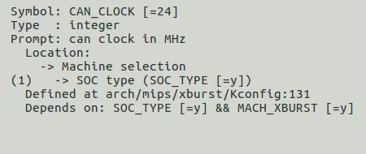

# CAN 控制器接口

## 模块功能介绍

X1600芯片内集成2组独立的CAN控制器；每组CAN控制器支持的功能如下：

1. 支持CAN 2.0A和CAN 2.0B协议

2. 支持最高1Mbps位速率

3. 具有4个硬件接收滤波器

4. 支持监听模式

5. 支持self-loop自测模式

## 驱动源码位置

驱动源码所在位置：

***module_drivers/drivers/net/can/ingenic/ingenic_can.c***

## 设备树配置

设备树所在位置

kernel内核(version <= 5.10)dts文件路径：

***module_drivers/dts/x1600.dtsi***

kernel内核(version > 5.10)dts文件路径：

***module_drivers/dts/x1600/x1600.dtsi***

CAN控制器描述
```c
can0: can@0x13560000 { 

 compatible = "ingenic,x1600-can"; 

 reg = <0x13560000 0x10000>; 

 status = "okay"; 

 interrupt-parent = <&core_intc>; 

 interrupts = <IRQ_CAN0>;

 dmas = <&pdma INGENIC_DMA_TYPE(INGENIC_DMA_REQ_CAN0_TX)>,

 <&pdma INGENIC_DMA_TYPE(INGENIC_DMA_REQ_CAN0_RX)>;

 dma-names = "tx", "rx";

 #address-cells = <1>;

 #size-cells = <0>;

};

can1: can@0x13570000 {

 compatible = "ingenic,x1600-can";

 reg = <0x13570000 0x10000>;

 status = "okay";

 interrupt-parent = <&core_intc>;

 interrupts = <IRQ_CAN1>;

 dmas = <&pdma INGENIC_DMA_TYPE(INGENIC_DMA_REQ_CAN1_TX)>,

 <&pdma INGENIC_DMA_TYPE(INGENIC_DMA_REQ_CAN1_RX)>;

 dma-names = "tx", "rx";

 #address-cells = <1>;

 #size-cells = <0>;

};
```

### 设备树默认配置

设备树默认关闭CAN控制器设备。

### 设备树自定义配置

用户可根据实际需求关闭CAN控制器设备，例如：
```c
&can0 {

 status = "disable";

 pinctrl-names = "default";

 pinctrl-0 = <&can0_pd>;

 ingenic,clk-freq = <24000000>;

};

&can1 {

 status = "disable";

 pinctrl-names = "default";

 pinctrl-0 = <&can1_pd>;

 ingenic,clk-freq = <24000000>;

};
```

## 内核编译配置

内核配置INGENIC_CAN，配置说明如下： 
```
Symbol: INGENIC_CAN [=y] 

Type : tristate 

Prompt: ingenic on-chip CAN support 

 Location: 

 -> Ingenic device-drivers Configurations 

 -> [CAN] (ethernet) Drivers 

 -> INGENIC CAN support 

Defined at module_drivers/drivers/net/can/ingenic/Kconfig
```

### 内核默认编译配置

内核默认配置,配置界面如下：


在内核配置波特率时需配置CAN_CLOCK、CAN_CLOCK应与设备树CAN总线时钟保持一致：



### 内核自定义编译配置

用户可根据实际需求，去掉该驱动的配置。

## 模块内核差异

无

## 设备节点生成

驱动加载成功后，执行ifconfig -a会出现can0或者can1.
```bash
\# ifconfig -a

can0 Link encap:UNSPEC HWaddr 00-00-00-00-00-00-00-00-00-00-00-00-00-00-00-00 

 NOARP MTU:16 Metric:1

 RX packets:0 errors:0 dropped:0 overruns:0 frame:0

 TX packets:0 errors:0 dropped:0 overruns:0 carrier:0

 collisions:0 txqueuelen:10 

 RX bytes:0 (0.0 B) TX bytes:0 (0.0 B)

 Interrupt:48 

can1 Link encap:UNSPEC HWaddr 00-00-00-00-00-00-00-00-00-00-00-00-00-00-00-00 

 NOARP MTU:16 Metric:1

 RX packets:0 errors:0 dropped:0 overruns:0 frame:0

 TX packets:0 errors:0 dropped:0 overruns:0 carrier:0

 collisions:0 txqueuelen:10 

 RX bytes:0 (0.0 B) TX bytes:0 (0.0 B)

 Interrupt:49 

lo Link encap:Local Loopback 

 inet addr:127.0.0.1 Mask:255.0.0.0

 UP LOOPBACK RUNNING MTU:65536 Metric:1

 RX packets:0 errors:0 dropped:0 overruns:0 frame:0

 TX packets:0 errors:0 dropped:0 overruns:0 carrier:0

 collisions:0 txqueuelen:1 

 RX bytes:0 (0.0 B) TX bytes:0 (0.0 B) 
```

## 应用程序使用说明

1. can连接方式

芯片内集成CAN控制器，但还不能进行通讯。CAN控制器需要连接转发器，然后发送给另一个CAN设备的转发器；

转发器连接时。CAN_H连接CAN_H,CAN_L连接CAN_L。当连线出现问题时，会报can bus error错误。

1. 正常模式测试
	1. 设置位速率

设置位速率需要在CAN设备使能之前进行；

设置1Mbps位速率
```bash
# ip link set can0 type can bitrate 1000000

# ip link set can1 type can bitrate 1000000
```
该方法内核会自动计算要设置的位速率，目前内核驱动支持的波特率为1M、500K、250K、100K、50K。用户也可添加自己需要的波特率，详情参考x1600 PM手册。

注意事项：用户如需配置20K、10K等波特率时，时钟源需选择外部24M时钟。

* 1. 使能can设备

使能can0 和 can1 设备
```bash
# ifconfig can0 up

# ifconfig can0 up
```

* 1. 设置can1接收数据
```bash
# candump can1 &
```

* 1. 设置can0发送数据

分别发送标准帧，扩展帧和远程帧
```bash
# cansend can0 -i 0x123 0x11 0x22 0x33 0x44 0x55 0x66 0x77 0x88

# cansend can0 -i 0x12345 -e 0x11 0x22 0x33 0x44 0x55 0x66 0x77 0x88

# cansend can0 -i 0x123 -r 0x11 0x22 0x33 0x44 0x55 0x66 0x77 0x88
```

* 1. 关闭can设备

关闭can0 和 can1 设备
```bash
# ifconfig can0 down

# ifconfig can1 down 
```

1. 查看can状态

查询 can0 设备的参数设置
```bash
# ip -details link show can0
```

在设备工作中，查询can0的工作状态
```bash
# ip -details -statistics link show can0
```

1. 使用self-loop方式测试

该测试会在控制器内部将tx和rx进行短接，将tx的数据直接送到rx上。

测试不需要连接can设备。

* 1. 设置can位速率并启动loop模式
```bash
# ip link set can0 type can bitrate 1000000 loopback on
```

* 1. 启动can
```bash
# ifconfig can0 up
```

* 1. 设置can接收
```bash
# candump can0 &
```

* 1. can发送数据
```bash
# cansend can0 -i 0x123 0x11 0x22 0x33 0x44 0x55 0x66 0x77 0x88
```

* 1. 关闭can设备
```bash
# ifconfig can0 down
```

