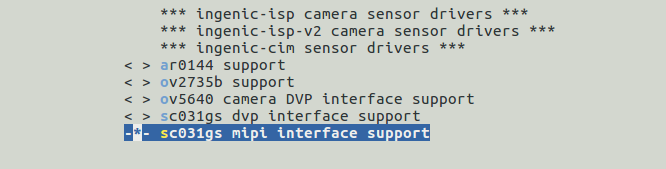

图表 1‑7

# CIM 摄像头接口模块

## 模块功能介绍

CIM（camera interface module）模块实现接收前端camera sensor发送的图像信号，支持8bit DVP，MIPI，BT656数据输入，支持YUV422，RGB888，RGB565，MONO(8)等格式输出，支持snapshot功能。

## 驱动源码位置

驱动源码位于：

***module_drivers/drivers/media/platform/ingenic-cim***
```
├──ingenic_camera.c
├──ingenic_camera.h
├──Kconfig
├──Makefile
├──mipi_csi.c
└──mipi_csi.h
```

## 设备树配置

设备树所在位置：

kernel内核(version <= 5.10)dts文件路径：

***module_drivers/dts/x1600.dtsi***

kernel内核(version > 5.10)dts文件路径：

***module_drivers/dts/x1600/x1600.dtsi***

CIM控制器描述：
```c
cim: cim@0x13060000 {

 compatible = "ingenic,x1600-cim"; 

 reg = <0x13060000 0x10000>;

 interrupt-parent = <&core_intc>;

 interrupts = <IRQ_CIM>;

 clocks = <&clock CLK_DIV_CIM>, <&clock CLK_GATE_CIM>, <&clock CLK_GATE_MIPI_CSI>;

 clock-names = "div_cim", "gate_cim", "gate_mipi";

 status = "disable";

};
```

### 设备树默认配置
```c
reserved-memory { 

 reserved_memory: reserved_mem@0x2000000{

 compatible = "shared-dma-pool";

 reg = <0x02000000 0x2000000>;

 };

 };

&cim{ 

 status = "okay";

 memory-region=<&reserved_memory>;

};
```

### 设备树自定义配置
```c
&cim{ 

 status = "disable";

 memory-region=<&reserved_memory>;

};
```

在halley6_v10.dts中，对reseved_memory进行如下自定义配置：
```c
reserved-memory { 

 reserved_memory: reserved_mem@0x1800000{

 compatible = "shared-dma-pool";

 reg = <0x01800000 0x800000>; 

 };

};
```

注：x1600 总内存为32M，x1600e 总内存为64M，reseved_memory可设为8M，也可根据camera sensor自定义reseved_memory大小。计算方法如下：

位宽×输出图像宽度×输出图像高度×描述符个数。

#### CIM控制器配置

在halley6_cameras/RD_X1600_HALLEY6_MIPI_CAMERA.dtsi中，对cim控制器进行如下自定义配置：其中，data-lanes字段根据接入的mipi sensor的data lane数量填充，例如：接入2 lane mipi sensor，data-lanes需填充两个参数，data-lanes = <0 1>，接入4 lane mipi sensor，data-lanes需填充四个参数，data-lanes = <0 1 3 4>；clk-lanes字段根据接入的mipi sensor的clock lane数量填充，例如：mipi sensor 连接一根clk lane，clk-lanes需填充一个参数，clk-lanes = <2>。
```c
&cim {

 status = "okay";

 port { 

 cim_0: endpoint@0 {

 remote-endpoint = <&sc031gs_ep0>;

 data-lanes = <0 1>;

 clk-lanes = <2>;

 };

 };

};
```

在halley6_cameras/RD_X1600_HALLEY6_DVP_CAMERA.dtsi中，对cim控制器进行如下自定义配置
```c
&cim { 

 status = "okay";

 port {

 cim_0: endpoint@0 {

 remote-endpoint = <&sc031gs_ep0>;

 bus-width = <8>;

 data-shift = <0>; 

 bus-type = <5>;

 hsync-active = <1>; 

 vsync-active = <0>; 

 data-active = <1>; 

 pclk-sample = <1>; 

 };

 };

};
```

#### camera sensor配置

在halley6_cameras/RD_X1600_HALLEY6_MIPI_CAMERA.dtsi中，对camera sensor进行如下自定义配置：
```c
&i2c0 {

 status = "okay";

 clock-frequency = <100000>;

 timeout = <1000>;

 pinctrl-names = "default";

 pinctrl-0 = <&i2c0_pa>;

 sc031gs_0:sc031gs@0x30 {

 status = "okay";

 compatible = "sc031gs";

 reg = <0x30>;

 pinctrl-names = "default";

 pinctrl-0 = <&cim_mipi_mclk_pc>;

 resetb-gpios = <&gpa 30 GPIO_ACTIVE_LOW INGENIC_GPIO_NOBIAS>;

 vcc-en-gpios = <&gpb 12 GPIO_ACTIVE_HIGH INGENIC_GPIO_NOBIAS>;

 port {

 sc031gs_ep0:endpoint {

 remote-endpoint = <&cim_0>;

 };

 };

 };

};
```

在halley6_cameras/RD_X1600_HALLEY6_DVP_CAMERA.dtsi中，对camera sensor进行如下自定义配置：
```c
&i2c0 { 

 status = "okay";

 clock-frequency = <100000>;

 timeout = <1000>;

 pinctrl-names = "default";

 pinctrl-0 = <&i2c0_pa>;

 sc031gs_0:sc031gs@0x30 {

 status = "okay";

 compatible = "sc031gs";

 reg = <0x30>;

 pinctrl-names = "default";

 pinctrl-0 = <&cim_mipi_mclk_pc>, <&cim_pa>;

 resetb-gpios = <&gpa 30 GPIO_ACTIVE_HIGH INGENIC_GPIO_NOBIAS>;

 vcc-en-gpios = <&gpb 12 GPIO_ACTIVE_LOW INGENIC_GPIO_NOBIAS>;

 port {

 sc031gs_ep0:endpoint {

 remote-endpoint = <&cim_0>;

 };

 };

 };

};
```

## 内核编译配置

内核配置,配置说明如下： 
```
Symbol: VIDEO_INGENIC_CIM [=y] 

Type : tristate 

Prompt: Ingenic Soc Camera Driver for X2000 && M300 && X1600 

 Location: 

 -> Ingenic device-drivers Configurations 

 -> [CIM] Drivers 

Defined at module_drivers/drivers/media/platform/ingenic-cim/Kconfig 
```

### 内核默认编译配置

设备树默认编译会产生CIM控制器设备。

### 内核自定义编译配置

#### CIM控制器配置

打开CIM控制器驱动，配置界面如下：
```
Ingenic device-drivers Configurations --->

[CIM] Drivers ---> 

<*> Ingenic Soc Camera Driver for X2000 && M300 && X1600

[ ] Sensor support snapshot function 

[ ] panda_camera_board ---- 

[*] halley6_camera_board ---> 

[ ] halley6 camera driver for RD_X1600_HALLEY6_MIPI_CAMERA

[*] halley6 camera driver for RD_X1600_HALLEY6_DVP_CAMERA 

[Sensors] Camera Sensors --->

 *** ingenic-isp camera sensor drivers *** 

 *** ingenic-isp-v2 camera sensor drivers ***

 *** ingenic-cim sensor drivers *** 

< > ar0144 support 

< > ov2735b support 

< > ov5640 camera DVP interface support 

-*- sc031gs dvp interface support 

< > sc031gs mipi interface support 
```

使用snapshot功能时打开Sensor support snapshot function，并配置脉冲宽度和delay时间。

#### camera sensor配置

控制器中选择相应的halley6_camera_board配置，sensor配置会默认选中，以sc031gs MIPI为例：
```
Ingenic device-drivers Configurations --->

[Sensors] Camera Sensors --->

 *** ingenic-isp camera sensor drivers *** 

 *** ingenic-isp-v2 camera sensor drivers ***

 *** soc_camera sensor drivers *** 

< > ar0144 support 

< > ov2735b support 

< > ov5640 camera DVP interface support

< > sc031gs dvp interface support 

-*- sc031gs mipi interface support 


```

使用snapshot功能时，在sensor驱动中将sensor配置为sanpshot模式。

## 内核差异

## 设备节点生成

驱动加载成功后生成以下节点：

***/dev/video11***


cim的输出节点。

## 应用程序使用说明

### cimutils

#### 源码位置

***packages/example/cimutils/***

#### 命令行及参数示意
```bash
# cimutils -C -I dev/video11 -x 640 -y 480 -t grey -f test.raw
```

* -x 指定图像宽度；
* -y 指定图像高度；
* -v 指定cim控制器；
* -t 指定图像格式；
* -f 指定图像文件名。

### v4l2-ctl

#### 源码位置

***buildroot/dl/libv4l/v4l-utils-1.24.1.tar.bz2***

#### 命令行及参数示意
```bash
# v4l2-ctl –v width=640,height=480,pixelformat="GREY" --stream-mmap=3 --stream-to="cim-test.yuv" –d /dev/video11
```

* width指定输出图像宽度；
* heigh 指定输出图像高度；
* pixelformat指定输出图像格式；
* --stream-mmap指定轮转buffer数量；
* --stream-to指定储存图像文件名；
* -d指定图像输出的video节点
