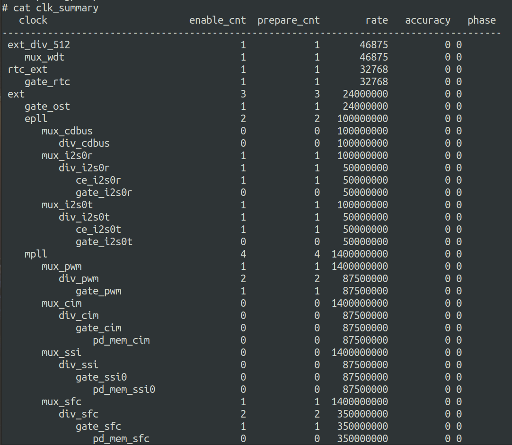
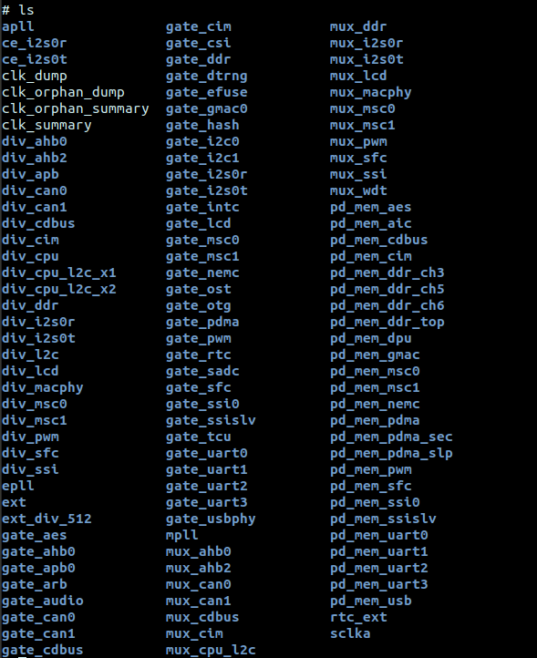
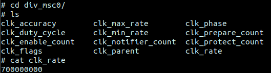

# CPM 时钟电源复位接口

## 模块功能介绍

CPM模块用于管理时钟和电源。包括：时钟控制，pll控制，电源控制，复位控制。

CPM驱动主要负责系统和模块的时钟电源管理，包括倍频，分频，时钟开关,　时钟源选择。

## 驱动位置

驱动源码所在位置：

***module_drivers/drivers/clk/ingenic-v2***
```
├── clk-bus.c
├── clk-bus.h
├── clk.c
├── clk-div.c
├── clk-div.h
├── clk.h
├── clk-m300.c
├── clk-pll.c（kernel4.4.94没有该文件）
├── clk-pll.h
├── clk-pll-v1.c
├── clk-pll-v1.h
├── clk-pll-v2.c
├── clk-pll-v2.h
├── clk-x1600.c
├── clk-x2000.c
├── clk-x2500.c
├── Kconfig
├── Makefile
├── power-gate.c
└── power-gate.h
```

## 设备树配置

设备树所在位置：

kernel内核(version <= 5.10)dts文件路径：

***module_drivers/dts/x1600.dtsi***

kernel内核(version > 5.10)dts文件路径：

***module_driver/dts/x1600/x1600.dtsi***


设备树描述：
```c
clock: clock-controller@0x10000000 {

 compatible = "ingenic,x1600-clocks";

 reg = <0x10000000 0x100>;

 clocks = <&extclk>, <&rtcclk>;

 clock-names = "ext", "rtc_ext";

 #clock-cells = <1>;

 little-endian;

};

extclk: extclk {

 compatible = "ingenic,fixed-clock";

 clock-output-names ="ext";

 #clock-cells = <0>;

 clock-frequency = <24000000>;

};

rtcclk: rtcclk {

 compatible = "ingenic,fixed-clock";

 clock-output-names ="rtc_ext";

 #clock-cells = <0>;

 clock-frequency = <32768>;

};
```

### 设备树默认配置

设备树默认编译会产生clock，extclk，rtcclk设备，配置extclk频率为24Mhz：
```c
extclk: extclk {

 clock-frequency = <24000000>;

};
```

## 内核编译配置

### 内核默认编译配置

使用cpm驱动内核不需要添加特殊配置，只依赖soc的配置选项CONFIG_SOC_X1600，相关代码在：module_drivers/drivers/clk/ingenic-v2/

### 内核自定义编译配置

## 设备节点生成

1. 生成的设备节点在

***/sys/devices/platform/apb/10000000.clock-controller***

2. 挂载debugfs到/mnt，/mnt/clk下面的节点可以查看各个时钟的频率和状态

cat clk_summary可以查看所以时钟的父子关系，使能状态，频率等:



3. /mnt/clk下,每个文件夹代表一个时钟，其中mux_xxx控制时钟源选择，div_xxx控制时钟分频，　gate_xxx控制时钟的开关。pd_mem_xxx控制每个模块memory的电源开关状态。power_xxx控制模块的电源开关状态。



4. 进入到某一个时钟的文件夹内，cat clk_rate可以查看时钟频率



## 应用程序使用说明

### 时钟的使用

在SDK的“module_drivers/drivers/clk/ingenic-v2”路径下已经定义好了时钟的信息，在内核启动后，会将时钟信息以树的形式进行关联，用户在使用时可以通过以下方式（以cim为例）。

1. 在"module_drivers/dts/x1600.dtsi"或"module_drivers/dts/x1600/x1600.dtsi"中cim节点的描述为：
```c
cim: cim@0x13060000 {

 compatible = "ingenic,x1600-cim";

 reg = <0x13060000 0x10000>;

 interrupt-parent = <&core_intc>;

 interrupts = <IRQ_CIM>;

 clocks = <&clock CLK_DIV_CIM>, <&clock CLK_GATE_CIM>, <&clock CLK_GATE_MIPI_CSI>;

 clock-names = "div_cim", "gate_cim", "gate_mipi";

 status = "disable";

 };
```

其中“clocks”和“clock-name”为内核关键字，用于获取时钟信息使用。

cim的probe函数会获取cim的时钟信息，用于控制cim设备时钟的开关。
```c
/*get cim clk*/

pcdev->clk = of_clk_get(pdev->dev.of_node, 1);

if (pcdev->clk == NULL) {

 err = PTR_ERR(pcdev->clk);

 dev_err(&pdev->dev, "%s:can't get clk %s\n", __func__, "cim");

 goto err_clk_get_cim;

}
```

如需修改cim的设备时钟频率需进行以下操作：

1. 获取div_cim的时钟信息
```c
clk = clk_get(dev, “div_cim”)；
```

2. 设置cim频率为24MHz(需要先关闭cim的gate时钟)
```c
clk_set_rate(clk, 24000000);
```
