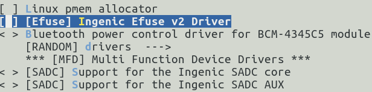
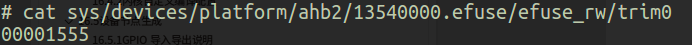

# EFUSE 接口

## 模块功能介绍

EFUSE模块提供了查看efuse各个寄存器值的接口。可以查看efuse中保存的cpu相关信息或者用户自定义的信息。

## 驱动位置

驱动源码所在位置

***module_drivers/drivers/misc/jz_efuse_x2000.c***

## 设备树配置

设备树所在位置：

kernel内核(version <= 5.10)dts文件路径：

***module_drivers/dts/x1600.dtsi***

kernel内核(version > 5.10)dts文件路径：

***module_drivers/dts/x1600/x1600.dtsi***

efuse控制器描述：
```c

efuse: efuse@0x13540000 {

 compatible = "ingenic,x1600-efuse";

 reg = <0x13540000 0x10000>;

 status = "okay";

 };
```

### 设备树默认配置

设备树默认未编译EFUSE设备。

### 设备树自定义配置

用户可根据实际需求开启EFUSE设备，在板级.dts中将该节点配置为disabled。
```c

&efuse { 

 status = "disable";

}; 
```

## 内核编译配置

内核配置INGENIC_EFUSE_v2，配置说明如下：
```
Symbol: INGENIC_EFUSE_V2 [=n] 

Type : boolean 

Prompt: [Efuse] Ingenic Efuse v2 Driver 

 Location: 

(1) -> Ingenic device-drivers Configurations 

 Defined at module_drivers/drivers/misc/Kconfig:19

 Depends on: SOC_X1600 [=y] 
```

### 内核默认编译配置

内核默认未配置EFUSE驱动，配置界面如下：



### 内核自定义编译配置

用户可根据实际需求开启该驱动的配置。

## 内核版本差异

## 设备节点生成

驱动加载成功后生成以下节点：
```bash
# ls /sys/devices/platform/ahb2/13540000.efuse/efuse_rw/

chipid cutid nku socinfo trim1 trim3

chipkey hideblk prt trim0 trim2 userkey
```

## 应用程序使用说明

### 读取efuse中的数据

以trim0为例，介绍efuse数据读取的方法。

执行指令
```bash
# cat sys/devices/platform/ahb2/13540000.efuse/efuse_rw/trim0
```

读出的数据如下图所示。



## 注意事项

 efuse只能写入一次，重复写入可能会造成芯片产生不可预知的错误，写入时需谨慎。

