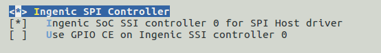
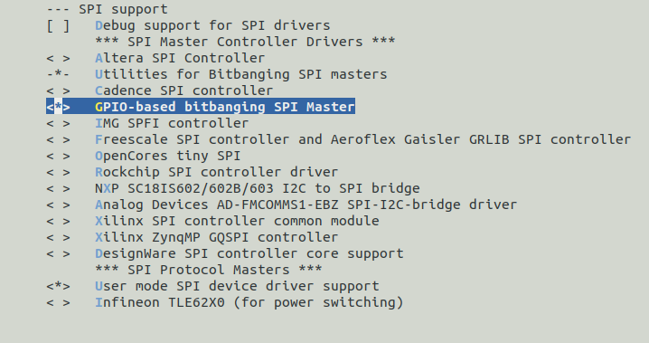
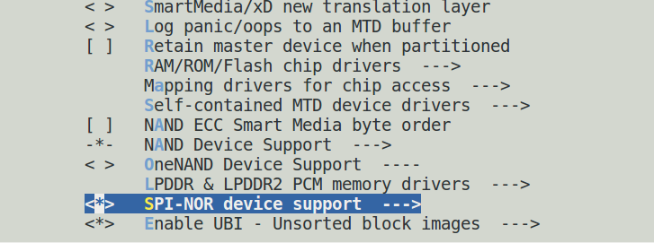
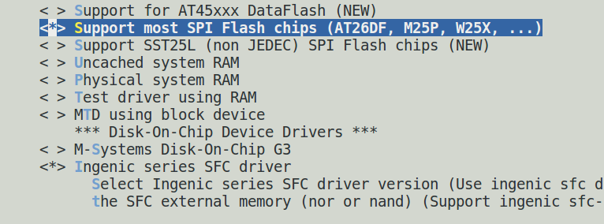
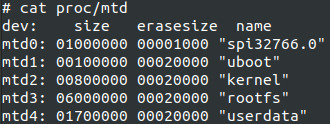
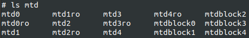
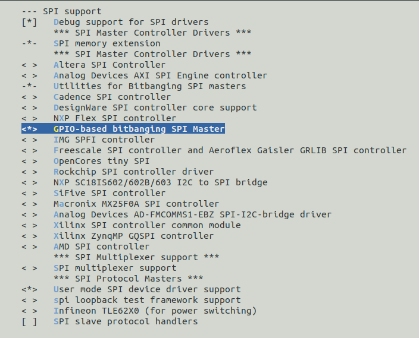
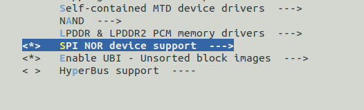
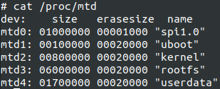
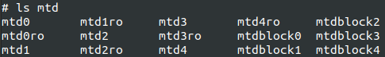

# SSI SPI接口

## 模块功能介绍

SSI是一个全双工同步串行接口，可以连接到多种外部模拟-数字（A/D）转换器、音频和电信编解码器以及其他使用串行传输数据的协议。X1600支持SSI摩托罗拉的串行外设接口（SPI）协议。

* GPIO功能描述

|         |        |                             |
| ------- | ------ | --------------------------- |
| Name    | I/O    | Description                 |
| SSI_CLK | Output | Serialbit-rateclock         |
| SSI_CE0 | Output | Firstslaveselectenable      |
| SSI_DT  | Output | Transmitdata(serialdataout) |
| SSI_DR  | Input  | Receivedata(serialdatain)   |

* GPIO接口
```
SSI0 PA28-31 FUNCTION0

SSI0 PB02 FUNCTION2  
SSI0 PB12-14 PB16-17 FUNCTION1
```
## 驱动源码位置

驱动源码所在位置：

***module_drivers/drivers/spi***

```
├── ingenic_spi.c  
├── ingenic_spi.h  
├── ingenic_slv.c  
├── ingenic_slv.h
```

## 设备树配置

设备树所在位置：

kernel内核(version <= 5.10)dts文件路径：

***module_drivers/dts/x1600.dtsi***

kernel内核(version > 5.10)dts文件路径：

***module_drivers/dts/x1600/x1600.dtsi***

SPI控制器描述：
```c
spi0: spi0@0x10043000 { 

 compatible = "ingenic,x1600- spi";

 reg = <0x10043000 0x1000>;

 interrupt-parent = <&core_intc>;

 interrupts = <IRQ_SSI0>;

 dmas = <&pdma INGENIC_DMA_TYPE(INGENIC_DMA_REQ_SSI0_TX)>,

 <&pdma INGENIC_DMA_TYPE(INGENIC_DMA_REQ_SSI0_RX)>;

 dma-names = "tx", "rx";

 #address-cells = <1>;

 #size-cells = <0>;

 status = "disabled";

 }; 
```

### 设备树默认配置

设备树默认关闭SPI控制器设备。 

### 设备树自定义配置

用户可根据实际需求打开SPI控制器设备，例如：
```c
&spi0 {

 status = "disable";

 pinctrl-names = "default";

 pinctrl-0 = <&spi0_pb>;

 spi-max-frequency = <54000000>;

 num-cs = <2>;

 /* cs-gpios = <0>, <0>; */

 /* cs-gpios = <&gpb 17 GPIO_ACTIVE_HIGH INGENIC_GPIO_NOBIAS>, <&gpb 16 GPIO_ACTIVE_HIGH INGENIC_GPIO_NOBIAS>; */

 ingenic,chnl = <0>;

 ingenic,allow_cs_same = <1>;

 ingenic,bus_num = <0>;

 ingenic,has_dma_support = <0>;

 ingenic,spi-src-clk = <1>;/*0.ext; 1.ssi*/

 /* Add SPI interface device */

 spidev: spidev@0 {

 compatible = "rohm,dh2228fv";

 reg = <0>;

 spi-max-frequency = <10000000>;

 }; 

};
```

其中部分属性含义如下：

|                         |                  |
| ----------------------- | ---------------- |
| spi-max-frequency       | spi控制器最大工作频率     |
| ingenic,chnl            | spi编号            |
| ingenic,has_dma_support | 是否使用dma，1表示使用dma |
| ingenic,spi-src-clk     | 设备时钟源的选择         |
| num-cs                  | 控制器有几根片选pin      |

### 用gpio模拟spi协议

为满足一些特殊的协议要求，也可以采用基于bitbang的gpio模拟spi功能．

将如下spi-gpio节点，添加设备树根节点下：

在kernel4.4.94中设备树添加方法如下：
```c
/ {

 spi_gpio {

 status = "okay";

 compatible = "spi-gpio";

 #address-cells = <1>;

 #size-cells = <0>;

 gpio-sck = <&gpd 2 GPIO_ACTIVE_LOW INGENIC_GPIO_NOBIAS>;

 gpio-miso = <&gpd 4 GPIO_ACTIVE_LOW INGENIC_GPIO_NOBIAS>;

 gpio-mosi = <&gpd 5 GPIO_ACTIVE_LOW INGENIC_GPIO_NOBIAS>;

 cs-gpios = <&gpd 3 GPIO_ACTIVE_LOW INGENIC_GPIO_NOBIAS>;

 num-chipselects = <1>;

 /* clients */

 spidev1: spidev1@0 {

 status = "disable";

 compatible = "rohm,dh2228fv";

 reg = <0>;

 spi-max-frequency = <500000>;

 };

 };

}
```

在kernel5.10中设备树添加方法如下：
```c
/ {

 spi_gpio {

 status = "okay";

 compatible = "spi-gpio";

 #address-cells = <1>;

 #size-cells = <0>;

 sck-gpios = <&gpd 2 GPIO_ACTIVE_HIGH INGENIC_GPIO_NOBIAS>;

 miso-gpios = <&gpd 4 GPIO_ACTIVE_HIGH INGENIC_GPIO_NOBIAS>;

 mosi-gpios = <&gpd 5 GPIO_ACTIVE_HIGH INGENIC_GPIO_NOBIAS>;

 cs-gpios = <&gpd 3 GPIO_ACTIVE_HIGH INGENIC_GPIO_NOBIAS>;

 num-chipselects = <1>;

 /* clients */

 spidev1: spidev1@0 {

 status = "disable";

 compatible = "rohm,dh2228fv";

 reg = <0>;

 spi-max-frequency = <500000>;

 };

 };

}
```

根据“Documentation/devicetree/bindings/spi/spi-gpio.yaml”文件中的描述，kernel5.10中已经废弃原有的属性“gpio-sck”、“gpio-miso”和“gpio-mosi”，但实际kernel5.10内核依然保留了对原有属性的解析，建议采用新的devicetree属性。

## 内核编译配置

内核配置INGENIC_SPI，配置说明如下：
```
Symbol: INGENIC_SPI [=n] 

Type : tristate 

Prompt: Ingenic SPI Controller 

 Location: 

 -> Ingenic device-drivers Configurations 

(1) -> [SPI] Master/Slave Drivers 

 Defined at module_drivers/drivers/spi/Kconfig:1 

 Depends on: MACH_XBURST [=y] || MACH_XBURST2 [=n]

 Selects: SPI_BITBANG [=n] 
```

### 内核默认编译配置

内核默认关闭SPI控制器驱动

### 内核自定义编译配置

用户可根据实际需求打开SPI控制器编译，配置界面如下：



### 用gpio模拟spi协议

为满足一些特殊的协议要求，也可以采用基于bitbang的gpio模拟spi功能．
```
Device Drivers --->

 [*] SPI support --->

 -*- Utilities for Bitbanging SPI masters

 <*> GPIO-based bitbanging SPI Master

 <*> User mode SPI device driver support /*向用户提供设备设备节点*/

 -> Ingenic device-drivers Configurations 

 -> [SPI] Master/Slave Drivers 

< > Ingenic SPI Controller /*去掉ingenic ssi控制器配置*/
```

## 设备节点生成

驱动加载成功log
```bash
[ 0.298196] INGENIC SSI Controller for SPI channel 0 driver register
```

生成设备节点:

***/dev/spidev0.0***

当使用gpio模拟spi协议时，产生设备节点spidev%d.%d*，例如：

***/dev/spidev32766.0***

## 应用程序使用说明

内核的 spi 驱动程序是基于 spi 子系统架构编写的

应用程序可以使用spi_demo进行测试

1. 可以在内核空间通过spi驱动操作 spi 接口
2. 可以在用户空间通过 spi_ioc_transfer 操作 spi 接口

### 测试spi读写

#### 源码位置

kernel4.4.94应用程序在如下位置：

***Documentation/spi/spidev_test.c***

kernel5.10程序在如下位置：

***tools/spi/spidev_test.c***

#### 测试方法

1.将SSI0_DT和SSI0_DR引脚短接
```bash
\# ./spi_test --help

./spi_test: unrecognized option '--help'

Usage: ./spi_test [-DsbdlHOLC3]

 -D --device device to use (default /dev/spidev1.1)

 -s --speed max speed (Hz)

 -d --delay delay (usec)

 -b --bpw bits per word

 -l --loop loopback

 -H --cpha clock phase

 -O --cpol clock polarity

 -L --lsb least significant bit first

 -C --cs-high chip select active high

 -3 --3wire SI/SO signals shared

 -v --verbose Verbose (show tx buffer)

 -p Send data (e.g. "1234\xde\xad")

 -N --no-cs no chip select

 -R --ready slave pulls low to pause

 -2 --dual dual transfer

 -4 --quad quad transfer
```

2. spidev_test -D /dev/spidev0.0

#### 测试结果
```bash
\# ./spi_test -D /dev/spidev0.0

spi mode: 0x0

bits per word: 8

max speed: 500000 Hz (500 KHz)

RX | FF FF FF FF FF FF 40 00 00 00 00 95 FF FF FF FF FF FF FF FF FF FF FF FF FF FF FF FF FF FF F0 0D | ......@......................�.
```

### 测试spi nor flash

针对spi接口的nor flash，内核已经有对应驱动支持，如果想使用只需要正确配置即可。

#### kernel4.4.94版本操作

##### 设备树配置

设备树位置：

***module_drivers/dts/halley6_v10.dts***

需要在spi_gpio节点内添加nor flash的节点：
```c
spi_gpio {

 status = "okay";

 compatible = "spi-gpio";

 #address-cells = <1>;

 #size-cells = <0>;

 gpio-sck = <&gpd 2 GPIO_ACTIVE_LOW INGENIC_GPIO_NOBIAS>;

 gpio-miso = <&gpd 4 GPIO_ACTIVE_LOW INGENIC_GPIO_NOBIAS>;

 gpio-mosi = <&gpd 5 GPIO_ACTIVE_LOW INGENIC_GPIO_NOBIAS>;

 cs-gpios = <&gpd 3 GPIO_ACTIVE_LOW INGENIC_GPIO_NOBIAS>;

 num-chipselects = <1>;

 /* clients */

 m25p80 {

 compatible = "m25p80";

 reg = <0>;

 spi-max-frequency = <1000000>;

 }; 

 }; 
```

##### 内核编译配置

1. 编译 drivers/spi/spi-gpio.c

位置:Device Drivers > SPI support

 选中GPIO-based bitbanging SPI Master，如下图所示：



2. 编译drivers/mtd/spi-nor/spi-nor.c

位置：Device Drivers > Memory Technology Device (MTD) support

选中SPI-NOR device support，如下图所示：



3. 编译drivers/mtd/devices/m25p80.c

位置：Device Drivers > Memory Technology Device (MTD) support > Self-contained MTD device module_drivers/drivers

选中Support most SPI Flash chips (AT26DF, M25P, W25X, ...)，如下图所示：



##### 测试

1. 确保nor flash硬件已经连接好；
2. 在drivers/mtd/spi-nor/spi-nor.c中根据nor flash的型号，查找下表看是否有对应的型号支持，如果没有需要配置对应的参数：
```c
static const struct flash_info spi_nor_ids[] = {

/* Atmel -- some are (confusingly) marketed as "DataFlash" */

{ "at25fs010", INFO(0x1f6601, 0, 32 * 1024, 4, SECT_4K) },

{ "at25fs040", INFO(0x1f6604, 0, 64 * 1024, 8, SECT_4K) },

...........

{ "xm25qh128c", INFO(0x204018, 0, 4 * 1024, 4096, SECT_4K)},

...........

/* GigaDevice */

{ "gd25q32", INFO(0xc84016, 0, 64 * 1024, 64, SECT_4K) },

{ "gd25q64", INFO(0xc84017, 0, 64 * 1024, 128, SECT_4K) },

{ "gd25q128", INFO(0xc84018, 0, 64 * 1024, 256, SECT_4K) },

...........

{ },

};
```

3. 重新编译kernel并烧录；
4. 看到如下信息则表示添加成功：
```bash
[ 1.571673] m25p80 spi32766.0: xm25qh128c (16384 Kbytes)
```
这里示范的nor flash型号为xm25qh128c，大小为16MB，具体打印信息与spi-nor.c文件中struct flash_info spi_nor_ids[] 结构体中配置的参数相同；

5. 进入到根文件系统后，可执行如下命令进一步确认，如果增加了一个新的mtd分区，则表示添加成功，这里mtd0为新添加的nor flash对应的分区



同时，在/dev目录下也会生成对应的设备节点，这里示范的为mtd0、mtd0ro、mtdblock0三个设备节点，其中mtd0和mtd0ro为字符设备节点，差别在于mtd0为可读写，mtd0ro只读，mtdblock0为块设备节点，可读写，如下图所示：



6. 接下来可以使用诸如flash_erase、mtd_debug等命令对nor flash生成的字符设备节点mtd0进行读写，同时也可以对块设备节点mtdblock0进行格式化、挂载、文件系统读写等一系列操作，这里不再进行示范。

#### kernel5.10版本操作

##### 设备树配置

设备树位置：

***module_drivers/dts/halley6_v10.dts***

需要在spi_gpio节点内添加nor flash的节点：
```c
spi_gpio {

 status = "okay";

 compatible = "spi-gpio";

 #address-cells = <1>;

 #size-cells = <0>;

 sck-gpios = <&gpd 2 GPIO_ACTIVE_HIGH INGENIC_GPIO_NOBIAS>;

 miso-gpios = <&gpd 4 GPIO_ACTIVE_HIGH INGENIC_GPIO_NOBIAS>;

 mosi-gpios = <&gpd 5 GPIO_ACTIVE_HIGH INGENIC_GPIO_NOBIAS>;

 cs-gpios = <&gpd 3 GPIO_ACTIVE_HIGH INGENIC_GPIO_NOBIAS>;

 num-chipselects = <1>;

 /* clients */

 m25p80 {

 compatible = "m25p80";

 reg = <0>;

 spi-max-frequency = <1000>;

 #address-cells = <1>;

 #size-cells = <1>;

 };

 };
```

建议gpio引用中的gpio极性采用“GPIO_ACTIVE_HIGH”，不然会无法识别nor flash,导致无法注册mtd设备。

##### 内核编译配置

1. 编译 drivers/spi/spi-gpio.c

位置:Device Drivers > SPI support

 选中GPIO-based bitbanging SPI Master，如下图所示：



2. 编译drivers/mtd/spi-nor/core.c

位置：Device Drivers > Memory Technology Device (MTD) support

选中SPI-NOR device support，如下图所示：



由于kernel5.10将kernel4.4.94中的spi-nor.c和m25p80.c文件合并成了core.c，所以kernel5.10中只用选择SPI-NOR device support即可。

##### 测试

1. 确保nor flash硬件已经连接好；
2. 在drivers/mtd/spi-nor/路径下已经定义了大部分nor flash厂商的芯片信息，用户可根据实际所使用的nor flash类型，确认相应的nor flash信息中是否含有对应的芯片，目前包含的厂商信息有：
```
atmel.c esmt.c fujitsu.c intel.c 

spansion.c winbond.c xmc.c catalyst.c 

eon.c everspin.c gigadevice.c ssi.c 

macronix.c micron-st.c sst.c xilinx.c
```

3. 重新编译kernel并烧录；
4. 看到如下信息则表示添加成功：
```
spi-nor spi1.0: found XM25QH128C, expected m25p80

spi-nor spi1.0: XM25QH128C (16384 Kbytes)
```
这里示范的nor flash型号为xm25qh128c，大小为16MB，具体打印信息与xmc.c文件中struct flash_info xmc_parts[] 结构体中配置的参数相同；

5. 进入到根文件系统后，可执行如下命令进一步确认，如果增加了一个新的mtd分区，则表示添加成功，这里mtd0为新添加的nor flash对应的分区



同时，在/dev目录下也会生成对应的设备节点，这里示范的为mtd0、mtd0ro、mtdblock0三个设备节点，其中mtd0和mtd0ro为字符设备节点，差别在于mtd0为可读写，mtd0ro只读，mtdblock0为块设备节点，可读写，如下图所示：



6. 接下来可以使用诸如flash_erase、mtd_debug等命令对nor flash生成的字符设备节点mtd0进行读写，同时也可以对块设备节点mtdblock0进行格式化、挂载、文件系统读写等一系列操作，这里不再进行示范。
