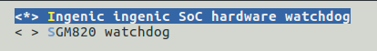

# WDT看门狗

## 模块功能介绍

看门狗定时器用于在处理器受噪声和系统错误等故障干扰时恢复处理器，看门狗定时器可以产生复位信号。看门狗使用的是rtc提供的时钟源，通过软件可以分频为1，4，16，64，256和1024，并且拥有16bit的计数寄存器，除此之外还支持半中断处理。

## 驱动源码位置

驱动源码所在位置：

***module_drivers/drivers/watchdog/ingenic_wtd.c***

## 设备树配置

设备树所在位置

kernel内核(version <= 5.10)dts文件路径：

***module_drivers/dts/x1600.dtsi***

kernel内核(version > 5.10)dts文件路径：

***module_drivers/dts/x1600/x1600.dtsi***

WDT控制器描述
```c
watchdog: watchdog@0x10002000 {

compatible = "ingenic,watchdog";

reg = <0x10002000 0x40>;

interrupt-parent = <&core_intc>;

interrupts = <IRQ_TCU0>;

status = "ok"; 

}
```

### 设备树默认配置

默认编译会产生WDT设备。

### 设备树自定义配置

用户可根据需求关闭WDT设备，将该节点配置为disable：
```c
&watchdog {

 status = "disable";

};
```

## 内核编译配置

内核配置INGENIC_WDT，配置说明如下： 
```
 Symbol: INGENIC_WDT [=y] 

 Type : tristate 

 Defined at module_drivers/drivers/watchdog/Kconfig 

 Prompt: Ingenic ingenic SoC hardware watchdog 
```

### 内核默认编译配置

内核默认配置WDT看门狗，配置界面如下：

### 内核自定义编译配置

用户可根据实际需求，去掉该驱动的配置。

## 模块内核差异

无

## 设备节点生成

驱动注册成功后生成设备节点

***/dev/watchdog***

## 应用程序使用说明

发布的SDK中busybox会默认配置watchdog测试应用，以下为测试应用的说明：
```
watchdog [-t N[ms]] [-T N[ms]] [-F] DEV

Periodically write to watchdog device DEV

Options:

-T N Reboot after N seconds if not reset (default 60)

-t N Reset every N seconds (default 30)

-F Run in foreground

Use 500ms to specify period in milliseconds
```

执行以下命令测试watchdog：

1、设置喂狗的周期
```bash
# watchdog -t 3 /dev/watchdog0 /*每隔3s执行一次喂狗操作ping*/
```

2、设置超时重启
```bash
# watchdog -t 5 -T 3 /dev/watchdog0 /*3s后复位（每隔5s执行一次喂狗，3s没喂狗则reset）*/
```

3. reboot重启
```bash
# reboot （命令行执行reboot后系统将立刻重启）
```
