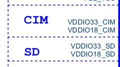
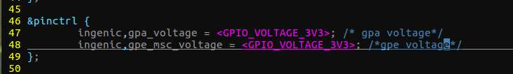
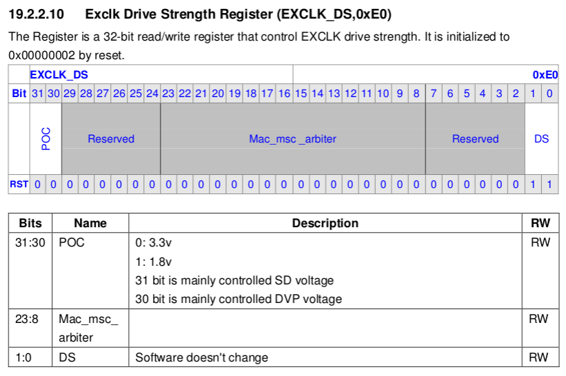

# X2000 和 M300 使用特别注意

## 硬件

X2000、M300 的 PA00~PA17 的供电管脚 VDDIO33_CIM 可接 3.3V 或 1.8V。

X2000、M300 的 PE00~PE05 的供电管脚 VDDIO33_SD 可接 3.3V 或 1.8V,如下图所示。




## 软件

<span style="color:red;"> **特别注意：** </span>硬件在接相对应的电压的时候,软件必须根据具体的硬件设计进行寄存器的配置,下面是软件配置说明。


 **代码路径:** 
```
kernel-4.4.94/arch/mips/boot/dts/ingenic/<board_version>.dts
kernel-5.10/module_drivers/dts/<board_version>.dts
kernel-6.6/module_drivers/dts/SOC/<board_version>.dts
```




<span style="color:red;"> **文件<board_version>.dts 特别说明：** </span>

1.board :Ingenic 板级名称或芯片名称与板级名称组合名。

2.version :Ingenic 板级硬件版本号(通常指底板版本号)。

 **示例:** 
x2000 halley5 开发套件(RD_X2000_HALLEY5_BASEBOARD_V3.0)对应设备树名称为: <span style="color:green;">halley5_v30.dts</span>

 **配置依据：** 





例如: 如果 VDDIO33_CIM 和 VDDIO33_SD 外接供电 3.3V,则上述代码必须设置 3.3V。反之亦然。
