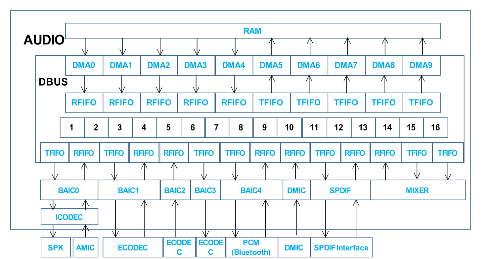
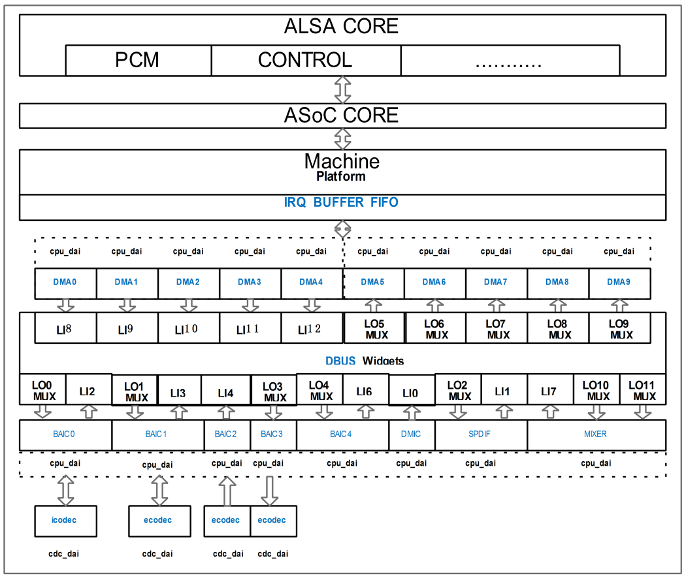
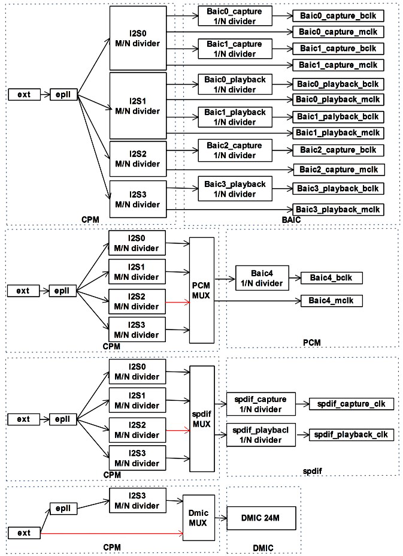
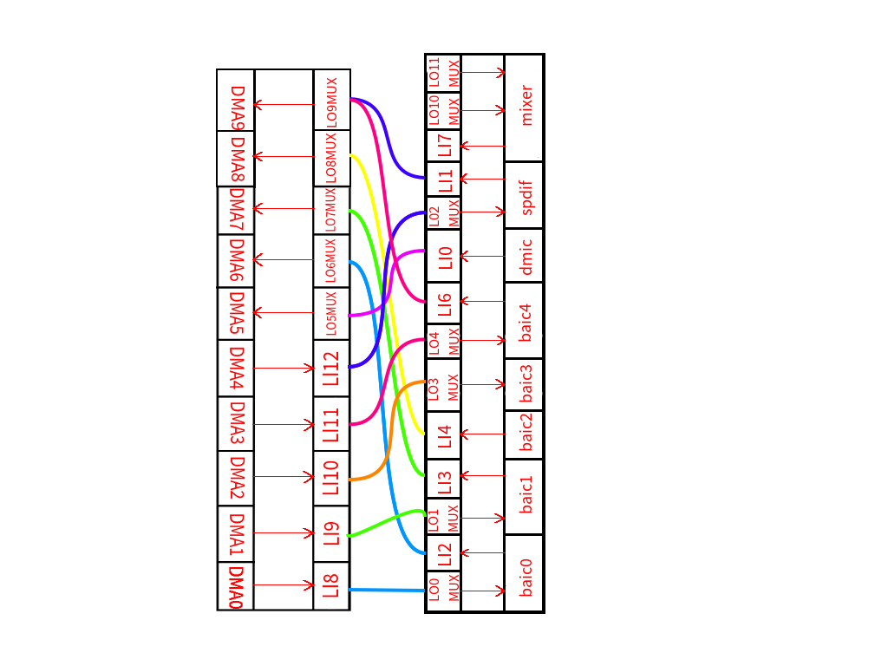
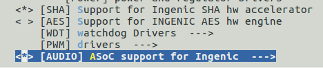
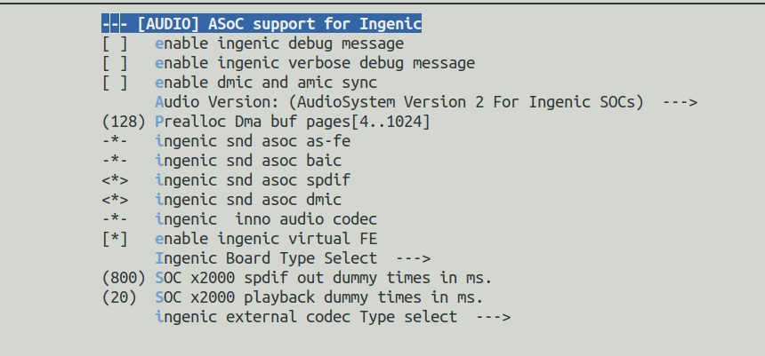

# Audio音频子系统

## 模块功能介绍



**图表 8‑1 音频子系统硬件模块**

1. audio有10个DMA模块, 其中DMA0-DMA4功能是从RAM搬移数据到fifo，DMA5-DMA9功能是从fifo搬数据到RAM中，每个DMA固定连接到DBUS中的一个FIFO上。

2. 5个BAIC（Basic Audio Interface Controller），BAIC0和ICODEC(Internal CODEC)相连支持单通道录放音。

3. dmic最大支持8通道，支持语音唤醒。

4. spdif（Sony Philips Digital Interconnect Format）。

5. DBUS可以把RFIFO和TFIFO动态连接在一起形成通路，所以通过DBUS的配置可以把DMA和其他子模块连接成数据流通路。


|  |  |  |  |
| --- | --- | --- | --- |
| **模块名** | **支持协议** | **支持通道数** | **功能** |
| **BAIC0+ICODEC** |  | 1通道(限制于ICODEC) | 录音/放音 |
| **BAIC1** | I2S/LEFT/RIGHT/PCMA/PCMB/DSPA/DSPB | 1/2通道 | 录音/放音 |
| **BAIC2** | TDM1A/TDM1B/TDM2A/TDM2B/I2S7+1/LEFT7+1/RIGHT7+1 | 2/4/8通道 | 录音 |
| **BAIC3** | TDM1A/TDM1B/TDM2A/TDM2B/I2S7+1/LEFT7+1/RIGHT7+1 | 2/4/8通道 | 放音 |
| **BAIC4** | I2S/LEFT/RIGHT/PCMA/PCMB/DSPA/DSPB | 1/2通道 | 录音/放音 |
| **DMIC** | PulseDensityModulation | 1/2/4/6/8通道 | 录音 |
| **SPDIF** | BMC(BiphaseMarkCode) | 2通道 | 录音/放音 |

## 软硬件模块对应关系



图表 8-2 音频子系统软硬件模块对应关系

数据通路输出端软硬件对应关系：


|  |  |
| --- | --- |
| **硬件名称** | **软件名称** |
| **BAIC0_PLAYBACK** | LO0_MUX |
| **BAIC1_PLAYBACK** | LO1_MUX |
| **BAIC2_PLAYBACK** | LO2_MUX |
| **BAIC3_PLAYBACK** | LO3_MUX |
| **BAIC4_PLAYBACK** | LO4_MUX |
| **DMA5** | LO5_MUX |
| **DMA6** | LO6_MUX |
| **DMA7** | LO7_MUX |
| **DMA8** | LO8_MUX |
| **DMA9** | LO9_MUX |
| **MIX_IN0** | LO10_MUX |
| **MIX_IN1** | LO11_MUX |

数据通路输⼊端软硬件对应关系：


|  |  |
| --- | --- |
| **硬件名称** | **软件名称** |
| **DMIC_CAPTURE** | LI0 |
| **SPDIF_CAPTURE** | LI1 |
| **BAIC0_CAPTURE** | LI2 |
| **BAIC1_CAPTURE** | LI3 |
| **BAIC2_CAPTURE** | LI4 |
| **BAIC3_CAPTURE** | LI5 |
| **BAIC4_CAPTURE** | LI6 |
| **MIX0_OUT** | LI7 |
| **DMA0** | LI8 |
| **DMA1** | LI9 |
| **DMA2** | LI10 |
| **DMA3** | LI11 |
| **DMA4** | L12 |

## 驱动源码位置

audio控制器源码位置：

***module_drivers/sound/soc/ingenic/as-v2/***

板级源码位置：

***module_drivers/sound/soc/ingenic/board/***

内部codec源码位置：

***module_drivers/sound/soc/ingenic/icodec/***

外部codec源码位置：

***module_drivers/sound/soc/ingenic/ecodec/***

## 设备树配置

设备树所在位置

内核dts文件路径：

kernel内核(version <= 5.10)dts文件路径：

***module_drivers/dts/x2000.dtsi***

kernel内核(version > 5.10)dts文件路径：

***module_driver/dts/x2000/x2000.dtsi***

Audio控制器描述：

```c
as:as {

compatible = "simple-bus";

 #address-cells = <1>;

 #size-cells = <1>;

 ranges = <>;

 as_platform: as-platform {

 compatible = "ingenic,as-platform";

 reg = <0x134d0000 0x114>, <0x134d1000 0x100>;

 reg-names = "dma", "fifo";

 ingenic,fifo-size = <4096>;

 interrupt-parent = <&core_intc>;

 interrupts = <IRQ_AUDIO>;

 ingenic,fth_quirk;

 };

 as_virtual_fe: as-virtual-fe {

 compatible = "ingenic,as-vir-fe";

 reg = <0x00000000 0x0>;

 ingenic,cap-dai-bm = <0xc>;

 ingenic,num-dais = <4>;

 };

 as_fmtcov: as-fmtcov {

 compatible = "ingenic,as-fmtcov";

 reg = <0x134d2000 0x28>;

 };

 as_fe_dsp: as-dsp {

 compatible = "ingenic,as-dsp";

 reg = <0x134d4000 0x30>;

 ingenic,li-port = <0 1 2 3 4 6 7 8 9 10 11 12>;

 ingenic,lo-port = <0 1 2 3 4 5 6 7 8 9 10 11>;

 ingenic,cap-dai-bm = <0x3e0>;

 ingenic,num-dais = <10>;

 };

 as_be_baic: as-baic {

 compatible = "ingenic,as-baic";

 reg = <0x134d5000 0x5000>;

 ingenic,num-dais = <5>;

 /* using dai-array to determine which BAIC to use */

 ingenic,dai-array = <0>, <1>, <2>, <3>, <4>;

 ingenic,dai-mode = <BAIC_3AND(BAIC_PCM_MODE, BAIC_DSP_MODE, BAIC_I2S_MODE)>,

 <BAIC_3AND(BAIC_PCM_MODE, BAIC_DSP_MODE, BAIC_I2S_MODE)>,

 <BAIC_4AND(BAIC_I2S_MODE, BAIC_TDM1_MODE, BAIC_TDM2_MODE, BAIC_NO_REPLAY)>,

 <BAIC_4AND(BAIC_I2S_MODE, BAIC_TDM1_MODE, BAIC_TDM2_MODE, BAIC_NO_RECORD)>,

 <BAIC_3AND(BAIC_PCM_MODE, BAIC_DSP_MODE, BAIC_I2S_MODE)>;

 ingenic,data-pin-num = <1>, <1>, <4>, <4>, <1>;

 ingenic,clk-split = <1>, <1>, <1>, <1>, <0>;

 ingenic,clk-rname = "div_i2s0","div_i2s0","div_i2s2","no_clk","mux_pcm";

 ingenic,clk-tname = "div_i2s1","div_i2s1","no_clk","div_i2s3","mux_pcm";

 ingenic,pcm-clk-parent = "div_i2s2";

 };

as_dmic: as-dmic {

 compatible = "ingenic,as-dmic";

 reg = <0x134da000 0x10>;

 ingenic,clk-name = "mux_dmic"

 ingenic,clk-parent = "ext";

 };

 as_aux_mixer: as-mixer {

 compatible = "ingenic,as-mixer";

 reg = <0x134dc000 0x8>;

 ingenic,num-mixers = <1>;

 };

 as_spdif: as-spdif {

 compatible = "ingenic,as-spdif";

 reg = <0x134db000 0x14>, <0x134db100 0x14>;

 reg-names = "out", "in";***

 ingenic,clk-name = "mux_spdif";

 ingenic,clk-parent = "div_i2s2";

 };

};
```

### 设备树默认配置

设备树默认编译会产生audio设备，并在module_drivers/dts/halley5_v30.dts或module_drivers/dts/x2000/halley5_v30.dts下配置：

```c
&as_be_baic {

 pinctrl-names = "default";

 pinctrl-0 = <&baic4_pd>;

};

&as_dmic {

 pinctrl-names = "default";

 pinctrl-0 = <&dmic_pc_4ch>;

};

&icodec {

 ingenic,spken-gpio = <&gpb 2 GPIO_ACTIVE_HIGH INGENIC_GPIO_NOBIAS>;

};

sound {

 compatible = "ingenic,x2000-sound";

 ingenic,model = "halley5_v30";

};
```

### 设备树自定义配置

用户可根据实际需求关闭audio设备,或配置ingenic，spken-gpio属性。

### 时钟树配置



时钟树配置注意事项：

1.当baic0和baic1同时录音或同时放音时，两设备必须配置相同的采样率，位宽，通道数。原因是因为baic0和baic1的录音使用同一个分频器，所以需要保持采样率的一致，baic0连接的icodec要求供应的工作时钟必须是采样率的256倍，所以baic1只能跟着baic0.

2.spdif选择父时钟尽量选择一个空闲时钟，如果和其他设备共享父时钟需要设置一个都能满足的频率（上图标红的箭头表示SDK中默认的父级时钟）。

### 频率的设置

由于除baic0外的其他baic1、baic2、baic3可以外接其他codec，不同的外部codec需要的Mclk和LRclk的比值不同，用户可以修改内核以下地方从而得到精准的采样率（以zebra板级文件为例）。

***module_drivers/sound/soc/ingenic/boards/zebra.c***

```c
 bclk = params_rate(params) * sync_div;

 if (id == 0 || id == 1 || id == 2 ||id == 3)

 {

 /*for baic0: sysclk = 256 * sample_rate */

 sysclk = 256 * params_rate(params);

 }

 bclk_div = (sysclk + bclk - 1) / bclk;

 /* bclk div value must be even */

 if(bclk_div%2) {

 sysclk = (bclk_div+1)*bclk;

 bclk_div += 1;

 }
```

因为zebra板子使用的外部codec都支持Mclk/LRclk=256，所以使用同一条判断语句，用户可根据自己使用的外部codec支持的比例关系，进行单独的判断。

### 数据通路的设置

由于x2000的Audio是采用的模块化设计，有5个rxfifo和5个txfifo，以baic0为例，在使用时需要指定要使用哪个rxfifo以及txfifo，用户可在内核以下位置修改（以halley5为例）：

***module_drivers/sound/soc/ingenic/boards/halley5_v20.c***

```c
static const struct snd_soc_dapm_route audio_map[] = {

 /* Target control Source*/

 { "BAIC0 playback", NULL, "LO0_MUX" },

 { "BAIC4 playback", NULL, "LO4_MUX" },


 { "LI0", NULL, "DMIC capture" },

 { "LI2", NULL, "BAIC0 capture" },

 { "LI6", NULL, "BAIC4 capture" },

 #if 1

 { "LO0_MUX", NULL, "LI8"}, /* Speaker Playback: DMA0->LI8->BAIC0 Speaker*/

 { "LO5_MUX", NULL, "LI0"}, /* DMIC-> DMIC capture->LI0->LO6_MUX->DMA6*/

 { "LO6_MUX", NULL, "LI2"}, /* AMIC Capture: BAIC0 Capture->LI2->LO5_MUX->DMA5*/

 { "LO9_MUX", NULL, "LI6"}, /* PCMIN -> BAIC4 Capture -> LI6->LO9_MUX->DMA9*/

 { "LO4_MUX", NULL, "LI12"}, /* PCMOUT -> BAIC4 playback -> LO4_MUX->LI12->DMA4*/

 #endif

 { "LI8", NULL, "DMA0" },

 { "LI9", NULL, "DMA1" },

 { "LI10", NULL, "DMA2" },

 { "LI11", NULL, "DMA3" },

 { "LI12", NULL, "DMA4" },


 { "DMA5", NULL, "LO5_MUX"},

 { "DMA6", NULL, "LO6_MUX"},

 { "DMA7", NULL, "LO7_MUX"},

 { "DMA8", NULL, "LO8_MUX"},

 { "DMA9", NULL, "LO9_MUX"},


 { "MIX0", NULL, "LO10_MUX"},

 { "MIX0", NULL, "LO11_MUX"},

 { "LI7", NULL, "MIX0"},


 {"DMIC capture", NULL, "DMIC"},

 {"BAIC4 capture", NULL, "PCMIN"},

 {"PCMOUT", NULL, "BAIC4 playback"},

 };
```

用户可以仿照“#if...#endif”中的写法，连通自己使用的数据通路，建议使用下图中的数据通路。



## 内核编译配置

内核配置SND_ASOC_INGENIC，配置说明如下：

```
Symbol: SND_ASOC_INGENIC [=y]

Type : tristate

 Prompt: [AUDIO] ASoC support for Ingenic

 Location:

 -> Ingenic device-drivers Configurations

Defined at module_drivers/sound/soc/ingenic/Kconfig:1

Depends on: MACH_XBURST [=n] || MACH_XBURST2 [=y]

Selects: SND_SOC [=y] && SND [=y] && SOUND [=y]

Defined at module_drivers/sound/soc/ingenic/Kconfig:21 Prompt: Audio Version:

Depends on: SND_ASOC_INGENIC [=y]

Location:

-> Ingenic device-drivers Configurations

 -> [AUDIO] ASoC support for Ingenic (SND_ASOC_INGENIC [=y])

Selected by [m]:

- SND_ASOC_INGENIC [=y] && m
```

选择板级文件

```
Symbol: SND_ASOC_INGENIC_HALLEY5_V20 [=y]

Type : tristate

Defined at module_drivers/sound/soc/ingenic/Kconfig:222

Prompt: Audio support for x2000 halley5_v20 board

Depends on: <choice>

Location:

-> Ingenic device-drivers Configurations

-> [AUDIO] ASoC support for Ingenic (SND_ASOC_INGENIC [=y])

-> Ingenic Board Type Select

 -> SOC x2000 codec Type select (<choice> [=y])

Selects: SND_ASOC_INGENIC_AS_FE [=y] && SND_ASOC_INGENIC_AS_BAIC [=y] && SND_ASOC_INGENIC_ICDC_INNO [=y]
```

### 内核默认编译配置

内核默认配置audio驱动，配置界面如下：





### 内核自定义编译配置

用户可根据实际需求去掉该驱动的配置。

## 设备节点生成

驱动加载成功后生成以下节点：

***/dev/snd/controlC0***

***/dev/snd/pcmC0D0p***

***/dev/snd/pcmC0D1p***

***/dev/snd/pcmC0D2p***

***/dev/snd/pcmC0D3p***

***/dev/snd/pcmC0D4p***

***/dev/snd/pcmC0D5c***

***/dev/snd/pcmC0D6c***

***/dev/snd/pcmC0D7c***

***/dev/snd/pcmC0D8c***

***/dev/snd/pcmC0D9c***

***/dev/snd/timer***

10个pcmC0D*设备对应硬件的10个DMA设备

## 添加新的codec驱动

在需要添加新的codec驱动时，用户可以参考“module_drivers/sound/soc/ingenic/ecodec”下的驱动来编写自己的驱动代码，在使用的新的codec驱动代码时，需要在设备树中对应的控制下注册从属设备，例如
```c
&i2c2 {

 status = "okay";

 clock-frequency = <100000>;

 timeout = <1000>;

 pinctrl-names = "default";

 pinctrl-0 = <&i2c2_pb>;

 ak4458: dac@0x10 {

 compatible = "asahi-kasei,ak4458";

 status = "okay";

 reg = <0x10>;

 reset-gpios = <&gpb 13 GPIO_ACTIVE_HIGH INGENIC_GPIO_NOBIAS>;

 mute-gpios = <&gpb 15 GPIO_ACTIVE_HIGH INGENIC_GPIO_NOBIAS>;

 };

 wm8594: adc@0x1a {

 compatible = "wlf,wm8594";

 status = "okay";

 reg = <0x1a>;

 reset-gpios = <&gpb 9 GPIO_ACTIVE_HIGH INGENIC_GPIO_NOBIAS>;

 mute-gpios = <&gpb 10 GPIO_ACTIVE_HIGH INGENIC_GPIO_NOBIAS>;

 pwdn-gpios = <&gpb 11 GPIO_ACTIVE_HIGH INGENIC_GPIO_NOBIAS>;

 };

 };
```

其中上述例子中的ak4458和wm8594就是所需要注册的外部codec。

需要在module_drivers/sound/soc/ingenic/boards/halley5_v20.c文件中添加新的codec相关内容，例如“module_drivers/sound/soc/ingenic/ecodec/wm8594.c”的如下内容：
```c
static struct snd_soc_dai_driver wm8594_dai[] = {

 {

 .name = "wm8594-hifi",

 .id = 0,

 .playback = {

 .stream_name = "Playback",

 .channels_min = 1,

 .channels_max = 2,

 .rates = WM8594_RATES,

 .formats = WM8594_FORMATS,

 },

 .capture = {

 .stream_name = "Capture",

 .channels_min = 1,

 .channels_max = 2,

 .rates = WM8594_RATES,

 .formats = WM8594_FORMATS,

 },

 .ops = &wm8594_dai_ops,

 },

};
```

在kernel4.4.94版本关联新codec驱动的操作如下：
```c
static struct snd_soc_dai_link x2000_dais[] = {

....................................................

[11] = {

 .name = "BAIC1",

 .stream_name = "BAIC1",

 .cpu_dai_name = "BAIC1",

 .codec_dai_name = "wm8594-hifi",

 .codec_name = "wm8594.2-001a",

 .ops = &baic_ops,

 .be_hw_params_fixup = NULL,

 .no_pcm = 1,

 .dpcm_capture = 1,

 .dpcm_playback = 1,

 },

......................................................

}
```

其中需要确保“.codec_dai_name”的内容和codec驱动中的“.name”字段内容保持一致。

而“codec_name”字段中的内容含义是“wm8594”为dts中定义的从设备的别名，“2”表示是i2c2控制器上的设备，“001a”表示的从设备地址。

在kernel5.10版本关联新codec驱动的操作如下：
```c
SND_SOC_DAILINK_DEFS(baic1_bt,

 DAILINK_COMP_ARRAY(COMP_CPU("BAIC1")),

 DAILINK_COMP_ARRAY(COMP_CODEC(“wm8594.2-001a”, “wm8594-hifi”)));

static struct snd_soc_dai_link x2000_dais[] = {

....................................................

[13] = {

 .name = "BAIC1",

 .stream_name = "BAIC1",

 .ops = &baic_ops,

 .be_hw_params_fixup = NULL,

 .no_pcm = 1,

 .dpcm_capture = 1,

 .dpcm_playback = 1,

 SND_SOC_DAILINK_REG(baic1_bt),

 },

......................................................

}
```

在kernel5.10版本中新添加了许多定义dai_link相关内容的宏，用法可以参考上述例子。

另外需要注意外部codec的驱动代码中是否含有“struct snd_soc_dapm_widget”用于电源管理的widget组件，因为x2000的Audio音频子系统有10个DMA通道，这些DMA通道和baic控制器的数据连通是通过alsa的电源管理实现的，所以要保证整个电源管理的通路是完整的。

如果所使用的codec不需要电源管理，除正确执行1.4.5内容外请执行以下操作：

请配置以下文件

***module_drivers/sound/soc/ingenic/boards/halley5_v20.c***

以baic1为例，codec采用虚拟codec。
```c
static const struct snd_soc_dapm_route audio_map[] = {

 /* Target control Source*/

 { "BAIC0 playback", NULL, "LO0_MUX" },

 { "BAIC1 playback", NULL, "LO1_MUX" },

 { "BAIC4 playback", NULL, "LO4_MUX" },


 { "LI0", NULL, "DMIC capture" },

 { "LI2", NULL, "BAIC0 capture" },

 { "LI6", NULL, "BAIC4 capture" },

 #if 1

 { "LO0_MUX", NULL, "LI8"}, /* Speaker Playback: DMA0->LI8->BAIC0 Speaker*/

 { "LO5_MUX", NULL, "LI0"}, /* DMIC-> DMIC capture->LI0->LO6_MUX->DMA6*/

 { "LO6_MUX", NULL, "LI2"}, /* AMIC Capture: BAIC0 Capture->LI2->LO5_MUX->DMA5*/

 { "LO9_MUX", NULL, "LI6"}, /* PCMIN -> BAIC4 Capture -> LI6->LO9_MUX->DMA9*/

 { "LO4_MUX", NULL, "LI12"}, /* PCMOUT -> BAIC4 playback -> LO4_MUX->LI12->DMA4*/

 { "LO1_MUX", NULL, "LI9"}, /* BAIC1 playback -> LO1_MUX->LI9->DMA1*/

 #endif

 { "LI8", NULL, "DMA0" },

 { "LI9", NULL, "DMA1" },

 { "LI10", NULL, "DMA2" },

 { "LI11", NULL, "DMA3" },

 { "LI12", NULL, "DMA4" },


 { "DMA5", NULL, "LO5_MUX"},

 { "DMA6", NULL, "LO6_MUX"},

 { "DMA7", NULL, "LO7_MUX"},

 { "DMA8", NULL, "LO8_MUX"},

 { "DMA9", NULL, "LO9_MUX"},


 { "MIX0", NULL, "LO10_MUX"},

 { "MIX0", NULL, "LO11_MUX"},

 { "LI7", NULL, "MIX0"},


 {"DMIC capture", NULL, "DMIC"},

 {"BAIC4 capture", NULL, "PCMIN"},

 {"PCMOUT", NULL, "BAIC4 playback"},

 {"i2s1", NULL, "BAIC1 playback"},

 };

 static const struct snd_soc_dapm_widget dapm_widgets[] = {

 SND_SOC_DAPM_INPUT("DMIC"),

 SND_SOC_DAPM_INPUT("PCMIN"),

 SND_SOC_DAPM_OUTPUT("PCMOUT"),

 SND_SOC_DAPM_OUTPUT("i2s1"),

 };
```

因为虚拟codec不存在电源管理使用的widget，在正确设置完数据通路后，尝试aplay放音会出现i/o错误的提示，原因时电源管理的链路不完整，导致数据无法从DMA传输到baic控制器，用户可以增加定义红色字体标注的内容，可以解决i/o错误的问题。

## 应用程序使用说明

### asound.conf介绍

asound.conf配置文件，是alsa-lib的默认配置文件，路径在 /etc/，可以用来配置alsa库的一些附加功能。这个文件不是alsa库运行时所必须的，没有它alsa库也可以正常运行。asound.conf允许对声卡或者设备进行更高级的控制，提供访问alsa-lib中的pcm插件方法，允许你做更多的复杂的控制，比如可以把声卡组合成一个或者多声卡访问多个I/O。

在ALSA中，PCM插件扩展了PCM设备的功能和特性。插件可以自动处理诸如：命名设备、采样率转换、通道间的采样复制、写入文件、为多个输入/输出连接声卡/设备（不同步采样）、使用多通道声卡/设备等工作。

* 1. **hw插件**

**此插件直接与ALSA内核驱动程序通信，它是一种没有任何转换的原始通信。**

通过此插件可以对pcm设备进行重命名操作。

例如：
```bash
# arecord -l

**** List of CAPTURE Hardware Devices ****

card 0: halley6 [halley6], device 0: i2s-ecodec dump_pcm_codec-0 []

 Subdevices: 1/1

 Subdevice #0: subdevice #0

card 0: halley6 [halley6], device 1: i2s-tloop dump_pcm_codec-1 []

 Subdevices: 1/1

 Subdevice #0: subdevice #0

# aplay -l

**** List of PLAYBACK Hardware Devices ****

card 0: halley6 [halley6], device 0: i2s-ecodec dump_pcm_codec-0 []

 Subdevices: 1/1

 Subdevice #0: subdevice #0
```

在使用arecord或者aplay进行录放音时，在指定设备时一般使用“hw：0，0”这种方法指定录放音所使用的设备，使用起来不够直观，可以通过hw插件对设备定义别名。例如：
```c
pcm.amic {

 type hw

 card 0

 device 0

}
```

此例子中将“hw：0，0”进行了重命名操作，在录放音时可以使用以下方式：
```bash
# arecord -D amic-c 2 -f S16_LE -r 16000 -d 5 baic0_16000-32-1.wav

# aplay -D amic baic0_16000-32-1.wav
```

* 2. **slave插件**

从属插件可以直接用字符串指定，也可以在一个复合配置节点内输入定义。还可以指定一些限制（如静态速率或通道数）。

例如：
```c
pcm_slave.slave_rate48000Hz {

 pcm "hw:0,0"

 rate 48000

}

pcm.rate48000Hz {

 type plug

 slave slave_rate48000Hz

}
```

或者
```c
pcm.rate48000Hz {

 type plug

 slave {

 pcm "hw:0,0"

 rate 48000

 }

}
```

上述例子可以理解为：定义了一个虚拟的pcm设备命名为rate48000Hz，该设备实际使用“hw：0,0”pcm设备且设定只支持48000Hz采样率。在使用rate48000Hz该pcm设备录放音时，硬件上仅支持48000采样率，也可以设置固定的格式位、宽通道数等。

* 3. **rate插件**

该插件转换速率。输入和输出格式必须是线性的，常用于播放硬件不支持采样率数据位宽的音频文件。

例如：
```c
pcm.rate_16000 {

 type rate

 slave {

pcm "hw:0,0"

 rate 16000

 format S8

 }

 }
```

该插件支持采样率和采样格式位宽的转换，不支持通道的转换。

* 4. **plug插件**

该插件可根据要求转换通道，速率和格式，比rate插件多了通道转换的功能。

例如：
```c
pcm.rate_48000 {

 type plug

 slave {

 pcm "hw:0,0"

 rate 16000

 format S8

 channels 1

 }

 }
```

* 5. **Soft Volume**

此插件应用于软件音量的调整。

例如：
```c
pcm.amic_record {

 type softvol

 slave {

 pcm "hw:0,0"

 }

 control {

 name "amic volume"

 }

 min_dB -51.0

 max_dB 30.0

}
```

在第一次使用 softvol 插件进行播放时才会生成对应的控件，即调音时需要先执行一次“arecord -D amic_record”（以上述定义为例），才可以通过amixer设置调整音量。

### baic0+icodec录放音

* 1. **baic0+icodec录音**

arecord命令录音（需要提前在驱动中设置数据通路可以参考8.4.5）
```bash
# arecord -D hw:0,6 -c 1 -f S32_LE -r 16000 -d 5 baic0_16000-32-1.wav

# arecord -D hw:0,6 -c 1 -f S16_LE -r 48000 -d 5 baic0_48000-16-1.wav
```

* 2. **baic0+icodec放音**

aplay命令放音（需要提前在驱动中设置数据通路可以参考8.4.5）
```bash
# aplay -D hw:0,0 16000-32-1.wav
```

* 3. **调整icodec录放音增益**
```bash
# amixer cset name='ICODEC MICL GAIN' 31

# amixer cset name='ICODEC HPOUTL GAIN' 31
```

### baic1录放音

* 1. **baic1录音**

arecord命令录音（需要提前在驱动中设置数据通路可以参考8.4.5）
```bash
# arecord -D hw:0,7 -c 2 -f S32_LE -r 48000 -d 10 baic1_48000-32-2.wav

# arecord -D hw:0,7 -c 2 -f S16_LE -r 16000 -d 10 baic1_16000-16-2.wav
```

* 2. **baic1放音**

aplay命令放音（需要提前在驱动中设置数据通路可以参考8.4.5）
```bash
# aplay -D hw:0,1 48000-16-2.wav
```

### baic2录音

arecord命令录音（需要提前在驱动中设置数据通路可以参考8.4.5）
```bash
# arecord -D hw:0,8 -r 48000 -f S32_LE -c 8 -d 8 baic2_48000-32-8.wav
```

### baic3放音

aplay命令放音（需要提前在驱动中设置数据通路可以参考8.4.5）
```bash
# aplay -D hw:0,2 48000-32-8.wav
```

### baic4录放音

略

### dmic录音

* 1. **dmic录音**

**dmic只能和DMA5连接成数据通路**，arecord命令录音（需要提前在驱动中设置数据通路可以参考8.4.5）
```bash
# arecord -D hw:0,5 -c 2 -f S16_LE -r 16000 -d 10 dmic_16000-16-2.wav

# arecord -D hw:0,5 -c 4 -f S16_LE -r 48000 -d 10 dmic_48000-16-4.wav

# arecord -D hw:0,5 -c 6 -f S16_LE -r 16000 -d 10 dmic_16000-16-6.wav

# arecord -D hw:0,5 -c 8 -f S16_LE -r 16000 -d 10 dmic_16000-16-8.wav
```

* 2. **调整dmic录音增益**
```bash
# amixer cset name='DMIC Volume' 31
```
### spdif录放音

* 3. **spdif放音**

aplay命令放音（需要提前在驱动中设置数据通路可以参考8.4.5）
```bash
# aplay -D hw:0,4 48000-16-2.wav
```

* 4. **spdif录音**

arecord命令录音（需要提前在驱动中设置数据通路可以参考8.4.5）
```bash
# arecord -D hw:0,9 -c 2 -f S16_LE -r 48000 -d 10 spdif_48000-16-2.wav
```

### 使用注意事项

1. 录音位宽为24bit时，录音数据在内存用32bit存放，有效数据存放在低24bit，使用上位机播放时需要预处理，如果使用x2000设备播放不需要预处理。

2. spdif 录音数据由音频数据和音频信息组成，播放前需要预处理，spdif具体格式请阅读PM手册。

