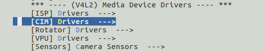
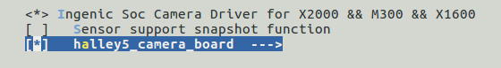
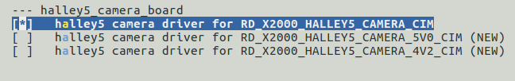

# CIM 摄像头接口模块

## 模块功能介绍

介绍模块的基本功能，驱动实现的功能，驱动实现的架构和框架图。默认配置的功能，需要自己配置的功能等内容。

CIM (camera interface module) 模块实现接收前端camera sensor发送的图像信号，支持8bit DVP，MIPI，BT656数据输入，支持YUV422，RGB888，RGB565，MONO(8)等格式输出，支持snapshot功能。

## 驱动源码位置

驱动源码位于：

***module_drivers/drivers/media/platform/ingenic-cim***
```
├──ingenic_camera.c
├──ingenic_camera.h
├──Kconfig
├──Makefile
├──mipi_csi.c
└──mipi_csi.h
```

## 设备树配置

设备树所在位置：

kernel内核(version <= 5.10)dts文件路径：

***module_driver/dts/x2000.dtsi***

kernel内核(version > 5.10)dts文件路径：

***module_driver/dts/x2000/x2000.dtsi***

CIM控制器描述：
```c
cim: cim@0x13060000 { 

 compatible = "ingenic,x2000-cim";

 reg = <0x13060000 0x10000>;

 interrupt-parent = <&core_intc>;

 interrupts = <IRQ_CIM>;

 clocks = <&clock CLK_DIV_CIM>, <&clock CLK_GATE_CIM>, <&clock CLK_GATE_MIPI_CSI>;

 clock-names = "div_cim", "gate_cim", "gate_mipi";

 status = "disable";

};
```

### 设备树默认配置

设备树默认编译不会产生CIM设备。

### 设备树自定义配置

以CIM连接AR0144 mipi sensor和ov2735B dvp sensor为例进行自定义配置。

#### CIM控制器配置

在`halley5_cameras/RD_X2000_HALLEY5_CAMERA_cim.dtsi`中，对cim控制器进行如下自定义配置：

其中，data-lanes字段根据接入的mipi sensor的data lane数量填充，例如：接入2 lane mipi sensor，data-lanes需填充两个参数，data-lanes = <0 1>，接入4 lane mipi sensor，data-lanes需填充四个参数，data-lanes = <0 1 3 4>；clk-lanes字段根据接入的mipi sensor的clock lane数量填充，例如：mipi sensor 连接一根clk lane，clk-lanes需填充一个参数，clk-lanes = <2>。
```c
&cim {

 status = "okay";

 port {

 cim_0: endpoint@0 {

 remote-endpoint = <&ov2735_ep0>;

 bus-width = <8>;

 data-shift = <0>;

 bus-type = <5>;

 hsync-active = <1>;

 vsync-active = <0>;

 data-active = <1>;

 pclk-sample = <0>;

 };

 cim_1: endpoint@1 {

 remote-endpoint = <&AR0144_0>;

 data-lanes = <0 1>;

 clk-lanes = <2>;

 };

 };

};
```

#### camera sensor配置

在`halley5_cameras/RD_X2000_HALLEY5_CAMERA_cim.dtsi`中，对camera sensor进行如下自定义配置：
```c
&i2c3 {

 status = "okay";

 clock-frequency = <100000>;

 timeout = <1000>;

 pinctrl-names = "default";

 pinctrl-0 = <&i2c3_pa>;

 /*HALLEY5_CAMERA_V4.2*/

 ov2735_0:ov2735b@0x3d {

 status = "ok";

 compatible = "ovti,ov2735b";

 reg = <0x3d>;

 pinctrl-names = "default","default";

 pinctrl-0 = <&vic_pa_low_10bit>;

 pinctrl-1 = <&cim_vic_mclk_pe>;

 ingenic,rst-gpio = <&gpa 10 GPIO_ACTIVE_LOW INGENIC_GPIO_NOBIAS>;

 ingenic,ircutp-gpio = <&gpb 3 GPIO_ACTIVE_HEIGHT INGENIC_GPIO_NOBIAS>;

 ingenic,ircutn-gpio = <&gpb 0 GPIO_ACTIVE_LOW INGENIC_GPIO_NOBIAS>;

 port {

 ov2735_ep0:endpoint {

 remote-endpoint = <&cim_0>;

 };

 };

 };
```

 /*HALLEY5_CAMRERA_V5.0*/
```c
 AR0144:AR0144@0x18 {

 status = "ok";

 compatible = "onsemi,ar0144"; 

 reg = <0x18>;

 pinctrl-names = "default","cim";

 pinctrl-0 = <&cim_vic_mclk_pe>, <&cim_pa>;

 resetb-gpios = <&gpa 11 GPIO_ACTIVE_LOW INGENIC_GPIO_NOBIAS>;

 pwdn-gpios = <&gpa 10 GPIO_ACTIVE_HIGH INGENIC_GPIO_NOBIAS>;

 port {

 AR0144_0:endpoint {

 remote-endpoint = <&cim_1>;

 };

 }; 

 };

};
```

## 内核编译配置

内核配置VIDEO_INGENIC_CIM,配置说明如下： 
```
Symbol: VIDEO_INGENIC_CIM [=y] 

Type : tristate 

Prompt: Ingenic Soc Camera Driver for X2000 && M300 && X1600 

Location: 

 -> Ingenic device-drivers Configurations 

 -> [CIM] Drivers 

Defined at module_drivers/drivers/media/platform/ingenic-cim/Kconfig
```

### 内核默认编译配置

内核默认未编译CIM驱动。

### 内核自定义编译配置

#### CIM控制器配置

打开CIM控制器驱动，配置界面如下：







#### camera sensor配置

选择相应sensor驱动, 配置界面如下：


## 内核差异

## 设备节点生成

驱动加载成功后生成以下节点：

***/dev/video11***

cim的输出节点。

***/dev/video14***

cim的输出节点。

## 应用程序使用说明

### cimutils

#### 源码位置

***packages/example/cimutils/***

#### 命令行及参数示意
```bash
# cimutils -C -I /dev/video11 -x 1920 -y 720 -t grey -f test.raw
```

* -x 指定图像宽度；
* -y 指定图像高度；
* -v 指定cim控制器；
* -t 指定图像格式；
* -f 指定图像文件名。

### v4l2-ctl

#### 源码位置

***buildroot/dl/libv4l/v4l-utils-1.24.1.tar.bz2***

#### 命令行及参数示意
```bash
# v4l2-ctl –v width=640, height=480, pixelformat="GREY" --stream-mmap=3 --stream-to="cim-test.yuv" –d /dev/video11
```

* width指定输出图像宽度；
* heigh 指定输出图像高度；
* pixelformat指定输出图像格式；
* --stream-mmap指定轮转buffer数量；
* --stream-to指定储存图像文件名；
* -d指定图像输出的video
