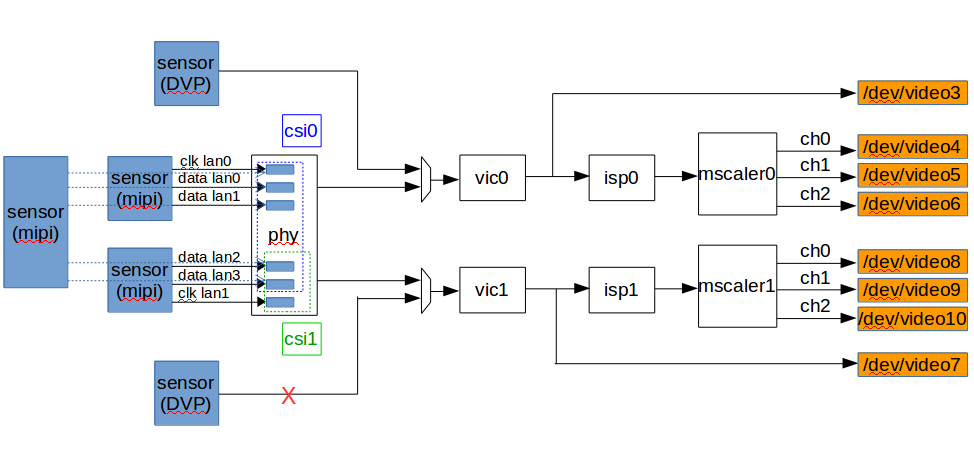
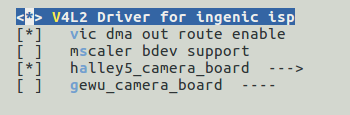
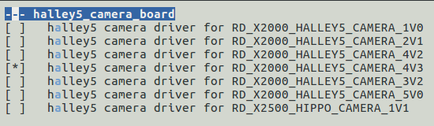
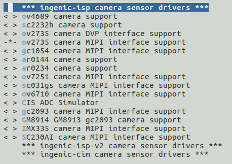

# ISP 图像处理单元

## 模块功能介绍

X2000芯片包含两个独立的ISP（ImageSignalProcessing）模块，每个ISP模块包含CSI，VIC，ISP-CORE，MSCALER四个子模块（以下用编号0，1区分），主要功能是对前端传感器输出的图像信号进行处理。硬件拓扑如下图所示。

图表 2‑1 ISP模块硬件拓扑图

支持DVP，MIPI，BT656输入，VIC支持RAW，YUV422格式输出，MSCALER支持NV12，NV21格式缩放输出。ISP-CORE能对图像信号进行黑电平矫正，坏点矫正，镜头阴影矫正,自动白平衡，自动曝光，自动增益,GAMMA曲线矫正，CCM矫正，2D降噪等处理。

## 驱动源码位置

驱动源码所在位置:

***module_drivers/drivers/media/platform/ingenic-isp***
```
├── csi.c
├── csi-regs.h
├── isp.c
├── isp-core
│   ├── inc
│   │   ├── system_sensor_drv.h
│   │   ├── tiziano_core.h
│   │   ├── tiziano_core_tuning.h
│   │   ├── tiziano_isp.h
│   │   ├── tiziano_netlink.h
│   │   ├── tiziano_priv.h
│   │   └── tiziano_sys.h
│   ├── Makefile
│   ├── src
│   │   ├── isp-core.a_shipped
│   │   └── Makefile
│   ├── tiziano_netlink.c
│   └── tiziano_priv.c
├── isp-core-tuning.c
├── isp-drv.c
├── isp-drv.h
├── isp-regs.h
├── isp-sensor.h
├── isp-video.c
├── isp-video-mplane.c
├── Kconfig
├── Makefile
├── mscaler-bdev.c
├── mscaler.c
├── mscaler-regs.h
├── sensor.c
├── vic.c
└── vic-regs.h
```

## 设备树配置

设备树所在位置：

kernel内核(version <= 5.10)dts文件路径：

***module_driver/dts/x2000.dtsi***

kernel内核(version > 5.10)dts文件路径：

***module_driver/dts/x2000/x2000.dtsi***

ISP控制器描述：
```c
ispcam0:

 isp-camera@0 {

 compatible = "ingenic,x2000-isp-camera";

 ……

 };

 csi0: csi@0x10074000 {

 compatible = "ingenic,x2000-csi";

 ……

 };

 vic0: vic@0x13710000 {

 compatible = "ingenic,x2000-vic";

 ……

 };

 isp0: isp@0x13700000 {

 compatible = "ingenic,x2000-isp";

 ……

 };

 mscaler0: mscaler@0x13702300 {

 compatible = "ingenic,x2000-mscaler";

 ……;

 };

ispcam1: isp-camera@1 {

 ……

 };
```

### 设备树默认配置

设备树默认配置产生ISP设备，支持外接双摄摄像头子板RD_X2000_HALLEY5_CAMERA_V4.3。

#### isp控制器配置

在板级设备树halley5_v30.dts中，对isp-ep进行如下默认配置：
```c
&isp0_ep {

 remote-endpoint = <&ov2735_ep0>;

 data-lanes = <0 1>;

 clk-lanes = <2>;

 bus-type = <4>;

};

&isp1_ep {

 remote-endpoint = <&ov2735_ep1>;

 data-lanes = < 3 4 >;

 clk-lanes = <5>;

 bus-type = <4>;

};
```

#### camera sensor配置

在halley5_cameras/RD_X2000_HALLEY5_CAMERA_4V3.dtsi中，对camera sensor进行如下默认配置：
```c
&i2c3 {

 status = "okay";

 clock-frequency = <100000>;

 timeout = <1000>;

 pinctrl-names = "default";

 pinctrl-0 = <&i2c3_pa>, <&cim_vic_mclk_pe>;

 /*RD_X2000_HALLEY5_CAMERA_V4.2 DVP interface*/

 ov2735_0:ov2735@3d {

 status = "ok";

 compatible = "ovti,ov2735a";

 reg = <0x3d>;

 avdd-supply = <&cam_avdd>;

 dvdd-supply = <&cam_dvdd>;

 dovdd-supply = <&cam_dovdd>;

 ingenic,rst-gpio = <&gpa 10 GPIO_ACTIVE_LOW INGENIC_GPIO_NOBIAS>;

 ingenic,ircutp-gpio = <&gpb 3 GPIO_ACTIVE_HIGH INGENIC_GPIO_NOBIAS>;

 ingenic,ircutn-gpio = <&gpb 0 GPIO_ACTIVE_LOW INGENIC_GPIO_NOBIAS>;

 port {

 ov2735_ep0:endpoint {

 remote-endpoint = <&isp0_ep>;

 };

 };

 };

 /*RD_X2000_HALLEY5_CAMERA_V4.2 MIPI interface*/

 ov2735_1:ov2735@3c {

 status = "ok";

 compatible = "ovti,ov2735a";

 reg = <0x3c>;

 avdd-supply = <&cam_avdd>;

 dvdd-supply = <&cam_dvdd>;

 dovdd-supply = <&cam_dovdd>;

 ingenic,rst-gpio = <&gpa 11 GPIO_ACTIVE_LOW INGENIC_GPIO_NOBIAS>;

 ingenic,ircutp-gpio = <&gpb 7 GPIO_ACTIVE_HIGH INGENIC_GPIO_NOBIAS>;

 ingenic,ircutn-gpio = <&gpb 1 GPIO_ACTIVE_LOW INGENIC_GPIO_NOBIAS>;

 port {

 ov2735_ep1:endpoint {

 remote-endpoint = <&isp1_ep>;

 };

 }; 

 };

};
```

### 设备树自定义配置

1.设备树可选配halley5适配的其他camera小板，选配halley5适配的其他camera小板时，在板级.dts中inclulde module_drivers/dts/halley5_cameras目录中相应的dtsi即可，该配置可通过menuconfig完成。 

2.设备树可选配用户自定义的camera sensor，选配用户自定义的camera sensor时，仿照默认配置，根据接口类型进行camera sensor及isp end point的配置。

## 内核编译配置

内核配置VIDEO_INGENIC_ISP，配置说明如下：
```
Symbol: VIDEO_INGENIC_ISP [=y] 

Type : tristate 

Prompt: V4L2 Driver for ingenic isp 

 Location: 

 -> Ingenic device-drivers Configurations 

 -> [ISP] Drivers 

 Defined at module_drivers/drivers/media/platform/Kconfig 
```

### 内核默认编译配置

内核默认配置ISP驱动，并支持RD_X2000_HALLEY5_CAMERA_V4.3，配置界面如下：



### 内核自定义编译配置

#### Camera子板编译配置

选配halley5适配的其他camera小板，修改默认配置中的halley5_camera_board选项。

#### 配置debug调试接口

用于打开VIC_DEBUG功能。
```
Symbol: VIC_DMA_ROUTE [=y] 

Type : boolean 

Prompt: vic dma out route enable 

 Location: 

 -> Ingenic device-drivers Configurations 

 -> [ISP] Drivers 

 -> V4L2 Driver for ingenic isp (VIDEO_INGENIC_ISP [=y]) 

 Defined at module_drivers/drivers/media/platform/ingenic-isp/Kconfig 
```

#### 配置自定义camera sensor

当ISP连接用户自定义的camera sensor时，可仿照已有sensor型号配置sensor drivers，代码所在位置：

***module_drivers/drives/meida/i2c/ingenic-isp/***

配置界面如下：



## 内核差异

## 设备节点生成

驱动加载成功后生成以下节点：

### Debug节点

***/sys/devices/platform/ahb0/ahb0:isp-camera@0/10074000.csi/debug/dump_csi***

csi0 debug节点，用于打印 csi0相关寄存器状态

***/sys/devices/platform/ahb0/ahb0:isp-camera@0/13710000.vic/debug/dump_vic***

vic0 debug点，用于打印 vic0相关寄存器状态

***/sys/devices/platform/ahb0/ahb0:isp-camera@0/13710000.vic/debug/vic_dma_debug***

Vic0 debug节点，配置VIC_DMA_DEBUG时生成，用于在通过mscaler0 video节点收图时，获取一帧未经isp处理的raw图。

***/sys/devices/platform/ahb0/ahb0:isp-camera@0/13700000.isp/debug/dump_isp***

isp0 debug节点，用于打印 isp-core0相关寄存器状态

***/sys/devices/platform/ahb0/ahb0:isp-camera@0/13702300.mscaler/debug/dump_mscaler***

mscaler0 debug节点，用于打印 mscaler0相关寄存器状态

***/sys/devices/platform/ahb0/ahb0:isp-camera@1/10073000.csi/debug/dump_csi***

csi1 debug节点，用于打印 csi1相关寄存器状态

***/sys/devices/platform/ahb0/ahb0:isp-camera@1/13810000.vic/debug/dump_vic***

vic1 debug节点，用于打印 vic1相关寄存器状态

***/sys/devices/platform/ahb0/ahb0:isp-camera@1/13810000.vic/debug/vic_dma_debug***

vic1 debug节点，配置VIC_DMA_DEBUG时生成，用于在通过mscaler1 video节点收图时，获取一帧未经isp处理的raw图。

***/sys/devices/platform/ahb0/ahb0:isp-camera@1/13800000.isp/debug/dump_isp***

isp1 debug节点，用于打印 isp-core1相关寄存器状态

***/sys/devices/platform/ahb0/ahb0:isp-camera@1/13802300.mscaler/debug/dump_mscaler***

mscaler1 debug节点，用于打印 mscaler1相关寄存器状态

### Video节点

***/dev/video3***

vic0设备节点，vic0输出节点的实例化，用于输出未经isp处理的raw数据或yuv422数据

***/dev/video4***

mscaler0-ch0设备节点，mscaler0-ch0输出节点的实例化，用于输出经isp处理并经mscaler channel0缩放的NV12或NV21数据

***/dev/video5***

mscaler0-ch1设备节点 （默认不生成，修改驱动中MSCALER_MAX_CH = 2 or 3时生成），mscaler0-ch1输出节点，用于输出经isp处理并经mscaler channel1缩放的NV12或NV21数据

***/dev/video6***

mscaler0-ch2设备节点 （默认不生成，修改驱动中MSCALER_MAX_CH = 3时生成），mscaler0-ch2输出节点，用于输出经isp处理并经mscaler channel2缩放的NV12或NV21数据

***/dev/video7***

vic1设备节点，vic1的输出节点，用于输出未经isp处理的raw数据或yuv422数据

***/dev/video8***

mscaler1-ch0设备节点，mscaler1-ch0的输出节点，用于输出经isp处理并经mscaler channel0缩放的NV12或NV21数据

***/dev/video9***

mscaler1-ch1设备节点 （默认不生成，修改驱动中MSCALER_MAX_CH = 2 or 3时生成），mscaler1-ch1的输出节点，用于输出经isp处理并经mscaler channel1缩放的NV12或NV21数据

***/dev/video10***

mscaler1-ch2设备节点 （默认不生成，修改驱动中MSCALER_MAX_CH = 3时生成），mscaler1-ch2的输出节点，用于输出经isp处理并经mscaler channel2缩放的NV12或NV21数据

## 应用程序使用说明

### v4l2-ctl

v4l2-ctl可测试isp通路（vic节点输出或mscaler节点输出）并保存图像数据到文件。

#### 源码位置

***buildroot/dl/libv4l/v4l-utils-1.24.1.tar.bz2***

#### 命令行及参数示意
```bash
# v4l2-ctl -v width=1920,height=1080,pixelformat="NV12" --stream-mmap=3 --stream-to="test-ch0.yuv" -d /dev/video4
```

* width指定输出图像宽度；
* heigh 指定输出图像高度；
* pixelformat指定输出图像格式；
* --stream-mmap指定轮转buffer数量；
* --stream-to指定储存图像文件名；
* -d指定图像输出的video节点

注意，当使用vic的video节点输出图像时（即video3，video7），width，height须指定为图像的原始宽高，pixelformat需根据sensor输出格式指定为执行`v4l2-ctl –list-format –d /dev/video3`命令后输出的格式；

当使用mscaler的video节点输出图像时（即video4，video5，video6，video8，video9，video10），width，height可指定图像缩放的宽高，pixelformat支持NV12，NV21。

### ffmpeg

ffmpeg可测试isp通路（mscaler节点输出）并在LCD屏上预览。

#### 源码位置

***buildroot/dl/ffmpeg/ffmpeg-4.4.4.tar.xz***

#### 命令行及参数示意
```bash
# echo 6 > /sys/devices/platform/ahb0/13050000.dpu/layer0/src_fmt

# echo 1 > /sys/devices/platform/ahb0/13050000.dpu/comp_update
```

设置layer0层的显示格式为NV12
```bash
# ffmpeg -pix_fmt nv12 –s 640*480 -i /dev/video4 -f fbdev /dev/fb0
```

* + -pix_fmt指定输出格式，支持nv12或nv21；
	+ -s指定输出图像大小，可缩放
	+ -i指定输出节点，支持mscaler video节点（即video4，video5，video6，video8，video9，video10）
	+ -f指定输出设备节点

### cimutils

测试isp通路（mscaler节点输出）并对图像进行硬件编码

#### 源码位置

***packages/example/cimutils/***

#### 命令行及参数示意
```bash
# cimutils -v isp - E helix -C -f 50.jpg -t nv12 -x 320 -y 240
```

或
```bash
# cimutils -I 1 -I 4 -C -f 40.jpg -t nv12 -x 320 -y 240
```

* -x 指定图像宽度；
* -y指定图像高度；
* -t指定图像格式；
* -f指定文件名；
* -v指定isp控制器
* -E指定helix硬件编码
* -I指定helix对应的video节点号（video1）和mscaler对应的video节点号（video4，video5，video6，video8，video9，video10）

### v4l2-isp-tuning

isp-core提供亮度，对比度，饱和度，锐度的调节接口，可通过v4l2-isp-tuning操作mscaler的某一节点对以上参数进行调节，并通过mscaler的另一节点观察调节效果。或参考源码中API的使用方法合并到用户代码中。

#### 源码位置

***development/ingenic-isp-tuning/***

#### 命令行及参数示意
```bash
# v4l2-isp-tuning -w 640 -h 480 -i 4 -s 128 -c 128 -S 128 -b 128
```

* -w指定图像宽度；
* -h指定图像高度；
* -i指定用于调节效果参数的mscaler节点号（video4，video5，video6，video8，video9，video10）；
* -s指定锐度，最小值0，最大值255，默认值128；
* -c指定对比度，最小值0，最大值255，默认值128；
* -S指定饱和度，最小值0，最大值255，默认值128；
* -b指定亮度，最小值0，最大值255，默认值128；
