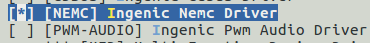

# NEMC外部存储控制器接口

## 模块功能介绍

是对片外存储器空间进行划分，输出符合各类静态存储器和总线接口规格的控制信号。可以使静态存储器（如NOR flash等设备）连接到该处理器。

## 驱动源码位置

内核驱动代码位置:

***module_drivers/drivers/char/ingenic_nemc.c***

## 设备树配置

设备树所在位置：

kernel内核(version <= 5.10)dts文件路径：

***module_driver/dts/x2000.dtsi***

kernel内核(version > 5.10)dts文件路径：

***module_driver/dts/x2000/x2000.dtsi***

NEMC控制器描述：
```c
 nemc: nemc@0x13410000{

 compatible = "ingenic,x2000-nemc";

 reg = <0x13410000 0x1000>;

 status = "disable";

 ranges = <1 0 0x1b000000 0x1000000

 2 0 0x1a000000 0x1000000>;

 nand: nand@1{

 reg =<1 0 0x1000000>;

 ingenic,nemc-bus-width = <16>;

 ingenic,nemc-tAH = <10>;

 ingenic,nemc-tAW = <5>; 

 ingenic,nemc-tBP = <10>;

 ingenic,nemc-tAS = <15>;

 ingenic,nemc-tSTRV = <100>;

 };

 };
```

### 设备树默认配置

默认编译不会产生nemc设备

### 设备树自定义配置

用户可根据需求在板级设备树中添加nemc，并使能
```c
 &nemc {

 status = "disable";

 pinctrl-names = "default";

 pinctrl-0 =<&nemc_pb>, <&nemc_pc>;

};
```

## 内核编译配置

### 内核默认编译配置
```
Symbol: INGENIC_NEMC [=n] 

Type : boolean 

Prompt: [NEMC] Ingenic Nemc Driver 

 Location: 

 -> Ingenic device-drivers Configurations 

 Defined at module_drivers/drivers/char/Kconfig
```

### 内核自定义编译配置

NEMC配置界面如下：



## 模块内核差异

无

## 设备节点生成

设备加载成功后会在/dev目录下生成如下节点：
```bash
# ls /dev/nemc

/dev/nemc
```

注意事项：目前nemc驱动只模拟出nemc timing 时序，具体读写需根据外存设备时序进行。驱动也应进行相对应的改动。