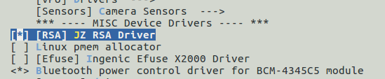

# RSA加解密驱动接口

## 模块功能介绍

RSA公开密钥密码体制是一种使用不同的加密密钥与解密密钥, 支持1024/2048 密钥长度加解密。

## 驱动位置

驱动源码所在位置：

***module_drivers/drivers/misc/ingenic_rsa.c***

## 设备树配置

设备树所在位置：

kernel内核dts文件路径：

kernel内核(version <= 5.10)dts文件路径：

***module_driver/dts/x2000.dtsi***

kernel内核(version > 5.10)dts文件路径：

***module_driver/dts/x2000/x2000.dtsi***

RSA控制器定义：
```c
rsa: rsa@0x13480000 {

       compatible = "ingenic,rsa";

       reg = <0x13480000 0x10000>;

       interrupt-parent = <&core_intc>;

       interrupts = <IRQ_RSA>;

       status = "ok";

 };  
```

### 设备树默认配置

设备树默认编译会产生rsa设备。

### 设备树自定义配置

用户可根据实际需求关闭rsa设备，在板级.dts中将该节点配置为disabled。
```c
&rsa {

    status = "disabled";

 };  
```

## 内核编译配置

内核配置选项INGENIC_RSA，配置说明如下：
```
 Symbol: INGENIC_RSA [=n] 

 Type : boolean 

 Prompt: [RSA] JZ RSA Driver 

 Location: 

 -> Ingenic device-drivers Configurations 

 Defined at module_drivers/drivers/misc/Kconfig:1 

 Depends on: SOC_X2000_V12 [=y] || SOC_X2000 [=n] || SOC_X2100 [=n] || SOC_M300 [=n] 
```

### 内核默认编译配置

内核默认未配置RSA驱动。

### 内核自定义编译配置

用户可根据实际需求可配置RSA驱动，配置界面如下：



## 设备节点生成

驱动加载成功后生成以下节点：

***/sys/bus/platform/drivers/rsa***

## 应用程序使用说明

测试程序路径:

***packages/example/security_utils/rsa/***
```
├── CMakeLists.txt
├── gen_key_base.c
├── include
│   ├── bignum.h
│   ├── gen_key_base.h
│   ├── jz_rsa.h
│   ├── keys.h
│   └── rsa.h
├── main.c
├── make.sh
├── rsa.c
├── sec_test.c
├── sec_test.h
```

测试方法：
```bash
# rsa_test in_file out_file rsa_key
```

其中：in_file为需要运算的数据

 out_file 为运算完成生成的结果数据

rsa_key为key数据文件

相关测试数据文件位置：

***packages/example/security_utils/test_data/rsa_test/***
```
├── rsa_key
├── rsa_result.txt
└── rsa_test_data.txt
```
* rsa_key:为rsa密钥
* rsa_result.txt：该数据为结果数据
* rsa_test_data.txt：该数据为待测试数据

执行测试
```bash
# rsa_test rsa_test_data.txt rsa_result.txt rsa_key
```
