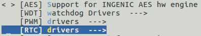
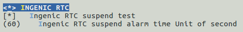
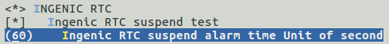

# RTC控制器

## 模块功能介绍

实时时钟（RTC）单元可以在芯片主电源打开或主电源关闭但RTC电源仍然打开的情况下运行。在这种情况下，RTC电源域仅消耗几微瓦的功率。RTC包含实时，定时告警逻辑以及断电和唤醒控制逻辑。

## 驱动位置

驱动源码所在位置

***module_drivers/drivers/rtc/rtc-ingenic.c***

## 设备树配置

设备树所在位置：

kernel内核(version <= 5.10)dts文件路径：

***module_driver/dts/x2000.dtsi***

kernel内核(version > 5.10)dts文件路径：

***module_driver/dts/x2000/x2000.dtsi***

RTC控制器描述：
```c
rtc: rtc@0x10003000 {

compatible = "ingenic,rtc";

reg = <0x10003000 0x4c>;

interrupt-parent = <&core_intc>;

interrupts = <IRQ_RTC>;

system-power-controller;

power-on-press-ms = <1000>;

status = "ok";

};
```

### 设备树默认配置

设备树默认编译会产生RTC设备。

### 设备树自定义配置

用户可根据实际需求关闭RTC设备，在板级.dts中将该节点配置为disabled。
```c
&rtc {

status = "disabled";

};
```

## 内核编译配置

内核配置RTC_DRV_INGENIC，配置说明如下：
```
CONFIG_RTC_DRV_INGENIC: 

 Symbol: RTC_DRV_INGENIC [=y] 

 Type : tristate 

 Defined at module_drivers/drivers/rtc/Kconfig 
```

### 内核默认编译配置

内核默认配置RTC驱动，配置界面如下：



### 内核自定义编译配置

1.用户可根据实际需求去掉该驱动的配置。

2.RTC测试时配置SUSPEND_TEST和SUSPEND_ALARM_TIME，配置说明如下：
```
CONFIG_SUSPEND_TEST: 

 If you say yes here the Ingenic rtc will support suspend test. 

 Symbol: SUSPEND_TEST [=y] 

 Type : bool 

 Defined at arch/mips/xburst/Kconfig 

 Prompt: auto suspend test 

 Depends on: SOC_TYPE [=n] 

 Location: 

 -> Machine selection 

 -> SOC type (SOC_TYPE [=n]) 

 Defined at module_drivers/drivers/rtc/Kconfig 

 Prompt: Ingenic RTC suspend test 

 Depends on: RTC_DRV_INGENIC [=y] 
```
```
CONFIG_SUSPEND_ALARM_TIME: 

 If you say yes here Automatically wake up after a set time of sleep. 

 Symbol: SUSPEND_ALARM_TIME [=60] 

 Type : integer 

 Defined at arch/mips/xburst/Kconfig 

 Prompt: suspend alarm time(second) 

 Depends on: SOC_TYPE [=n] && SUSPEND_TEST [=y] 

 Location: 

 -> Machine selection 

 -> SOC type (SOC_TYPE [=n]) 

 -> auto suspend test (SUSPEND_TEST [=y]) 

 Defined at module_drivers/drivers/rtc/Kconfig 

 Prompt: Ingenic RTC suspend alarm time Unit of second 

 Depends on: SUSPEND_TEST [=y] 

 Location: 

 -> Ingenic device-drivers Configurations 

 -> [RTC] drivers 

 -> INGENIC RTC (RTC_DRV_INGENIC [=y]) 

 -> Ingenic RTC suspend test (SUSPEND_TEST [=y])
```

配置界面如下：



## 内核模块差异

无

## 设备节点生成

驱动加载成功后生成以下节点：

***/dev/rtc0***

## 应用程序使用说明

### rtc定时唤醒测试
```bash
# echo +5 > /sys/class/rtc/rtc0/wakealarm
```

rtc计算到指定时间后，自动唤醒系统。
