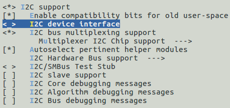
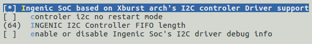
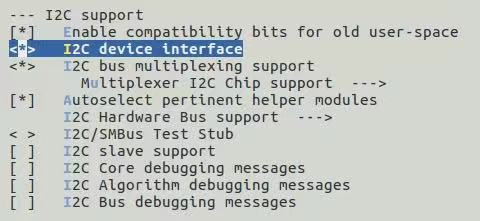
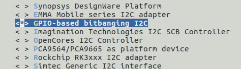

# SMB I2C接口

## 模块功能介绍

SMB总线是两线串行接口，由串行数据线（SDA）和串行时钟（SCL）组成，这些电线在连接到总线的设备之间传送信息。每个设备都有一个唯一的地址，并且可以根据设备的功能充当“发送器”或“接收器”，在执行数据传输时，设备也可以视为主机或从机。主设备是初始化/终止总线上的数据传输并生成时钟信号以允许该传输的设备。在这段时间内，任何寻址的设备都被视为从设备，SMB控制器是软件控制的，它充当主机或从机，但是，不支持同时作为主机和从机运行。

i2c控制器为SMB，SMB支持的接口有i2c,支持100 Kb/s和400 Kb/s，I2C接口可连接至pmu, camera，通过i2c接口进行配置。

## 驱动位置

驱动源码位于

***module_drivers/drivers/i2c/busses/i2c-ingenic.c***

## 设备树配置

设备树所在位置：

kernel内核(version <= 5.10)dts文件路径：

***module_driver/dts/x2000.dtsi***

kernel内核(version > 5.10)dts文件路径：

***module_driver/dts/x2000/x2000.dtsi***

I2C控制器描述：
```c
i2c0: i2c@0x10050000 {

 compatible = "ingenic,x2000-i2c";

 reg = <0x10050000 0x1000>;

 interrupt-parent = <&core_intc>;

 interrupts = <IRQ_I2C0>;

 #address-cells = <1>;

 #size-cells = <0>;

 status = "okay";

};

i2c1: i2c@0x10051000 {

 ……

};

i2c2: i2c@0x10052000 {

 ……;

};

i2c3: i2c@0x10053000 {

 ……

};

i2c4: i2c@0x10054000 {

 ……

};

i2c5: i2c@0x10055000 {

 ……

};
```

### 设备树默认配置

设备树默认编译会产生i2c-adapter0设备和i2c-adapter3设备

### 设备树自定义配置

用户可根据实际需求打开或关闭某个i2c adapter设备，并在设备树的i2c-adapter节点下挂接相应的i2c-client设备。例如：
```c
 &i2c3 {

 status = "okay";

 clock-frequency = <100000>;

 timeout = <1000>;

 pinctrl-names = "default";

 pinctrl-0 = <&i2c3_pa>;

 ov2735_0:ov2735@0x3d {

 status = "ok";

 compatible = "ovti,ov2735b";

 reg = <0x3d>;

 pinctrl-names = "default", "default";

 pinctrl-0 = <&vic_pa_low_10bit>;

 pinctrl-1 = <&cim_vic_mclk_pe>;

 ingenic,rst-gpio = <&gpa 10 GPIO_ACTIVE_LOW INGENIC_GPIO_NOBIAS>;

 ingenic,ircutp-gpio = <&gpb 3 GPIO_ACTIVE_HIGH INGENIC_GPIO_NOBIAS>;

 ingenic,ircutn-gpio = <&gpb 0 GPIO_ACTIVE_LOW INGENIC_GPIO_NOBIAS>;

 port {

 ov2735_ep0:endpoint {

 remote-endpoint = <&isp0_ep>;

 bus-width = <10>; /* Used data lines */

 data-shift = <0>; /* Lines 9:0 are used */

 /* If hsync-active/vsync-active are missing,

 embedded BT.656 sync is used */

 hsync-active = <1>; /* Active high */

 vsync-active = <1>; /* Active high */

 data-active = <1>; /* Active high */

 pclk-sample = <1>; /* Rising */

 };

 };

 };

};
```

## 内核配置

内核配置I2C_INGENIC，配置说明如下：
```
Symbol: I2C_INGENIC [=y] 

Type : boolean 

Prompt: Ingenic SoC based on Xburst arch's I2C controler Driver support 

 Location: 

 -> Device Drivers 

 -> I2C support 

 -> I2C support (I2C [=y]) 

 -> I2C Hardware Bus support 

 Prompt: Ingenic SoC based on Xburst arch's I2C controler Driver support 

 Location: 

 -> Ingenic device-drivers Configurations 

 -> [I2C] Master Drivers 

 Defined at drivers/i2c/busses/Kconfig 
```

### 内核默认编译配置

内核默认配置I2C控制器驱动，配置界面如下：



### 内核自定义编译配置

1.用户可根据实际需求去掉I2C控制器的驱动。

2.可将设备节点导出到用户空间的/dev下，配置I2C_CHARDEV，配置说明如下：
```
Symbol: I2C_CHARDEV [=y] 

Type : tristate 

Prompt: I2C device interface 

 Location: 

 -> Device Drivers 

 -> I2C support 

 -> I2C support (I2C [=y]) 

 Defined at module_drivers/drivers/i2c/Kconfig

 Depends on: I2C [=y]
```

配置界面如下：



## 模块内核差异

无

## GPIO模拟i2c

1. 首先需要选取两组未使用的GPIO用来模拟sda、scl。
2. 设备树中自定义配置

```c
i2c@0 {

 compatible = "i2c-gpio";

 gpios = <&gpc 31 GPIO_ACTIVE_LOW INGENIC_GPIO_NOBIAS>,/* sda */

 <&gpc 30 GPIO_ACTIVE_LOW INGENIC_GPIO_NOBIAS>;/* scl */

 //i2c-gpio,sda-open-drain;

 //i2c-gpio,scl-open-drain;

 i2c-gpio,delay-us = <2>; /* ~100 kHz */

 #address-cells = <1>;

 #size-cells = <0>;

};
```

3.在内核自定义编译配置中选择



配置说明：
```
Symbol: I2C_GPIO [=y] 

Type : tristate 

Prompt: GPIO-based bitbanging I2C 

 Location: 

 -> Device Drivers 

 -> I2C support 

 -> I2C support (I2C [=y]) 

 -> I2C Hardware Bus support 

 Defined at drivers/i2c/busses/Kconfig
```

## 设备节点生成

打开I2C_CHARDEV选项后将在/dev下生成相应的节点：
```bash
# ls /dev/i2c-  
i2c-0 i2c-2 i2c-3 i2c-4
```

### 常见i2c通信内核提示：

|  |  |
| --- | --- |
| **错误提示** |  **说明** |
| I2C_TXABRT_ABRT_7B_ADDR_NOACK | 7bit寻址下，slave未回ACK |
| I2C_TXABRT_ABRT_10ADDR1_NOACK | 10bit寻址下，发送第一字节后未应答 |
| I2C_TXABRT_ABRT_10ADDR2_NOACK | 10bit寻址下，发送第二字节后未应答 |
| I2C_TXABRT_ABRT_XDATA_NOACK | 地址确定后，但后续数据slave未应答 |
| I2C_TXABRT_ABRT_GCALL_NOACK | i2c广播寻址，slave未应答 |
| I2C_TXABRT_ABRT_GCALL_READ | i2c广播寻址后，进行读操作 |
| I2C_TXABRT_ABRT_HS_ACKD | 主设备处于高速模式下并被确认 |
| I2C_TXABRT_SBYTE_ACKDET | 主设备已经发送一个字节，并且开始字节被确认 |
| I2C_TXABRT_ABRT_HS_NORSTRT | 重启不可用，但用户想要 在高速模式下发送数据 |
| I2C_TXABRT_SBYTE_NORSTRT | 重启不可用，但用户发送了一个开始字节 |
| I2C_TXABRT_ABRT_10B_RD_NORSTRT | 重启不可用，但主设备在10bit寻址下发送读命令 |
| I2C_TXABRT_ABRT_MASTER_DIS | 当前主设备不可用，用户对主设备进行操作 |
| I2C_TXABRT_ARB_LOST | 失去仲裁 |
| I2C_TXABRT_SLVFLUSH_TXFIFO | 当从设备要接收数据时，fifo里已经有一些数据了 |
| I2C_TXABRT_SLV_ARBLOST | 当发送数据时，从设备丧失总线 |
| I2C_TXABRT_SLVRD_INTX | 当主设备需要发送数据时，却进入了读数据状态 |
