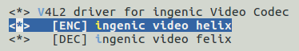

# VPU Helix视频编码处理单元

## 模块功能介绍

helix是h264编码、JPEG压缩和解压缩。

## 驱动源码位置

驱动源码所在位置：

***module_drivers/drivers/media/platform/ingenic-vcodec/helix/***
```
├── api
├── default_sliceinfo.c
├── h264e.c
├── h264e.h
├── h264enc
├── h264e_rc.c
├── h264e_rc.h
├── h264e_rc_nl.c
├── h264e_rc_nl.h
├── h264e_rc_proto.h
├── helix_buf.h
├── helix_drv.c
├── helix_drv.h
├── helix_ops.c
├── helix_ops.h
├── jpgd.c
├── jpgd.h
├── jpge
├── jpge.c
├── jpge.h
├── Makefile
└── README
```

## 设备树配置

设备树所在位置：

kernel内核(version <= 5.10)dts文件路径：

***module_driver/dts/x2000.dtsi***

kernel内核(version > 5.10)dts文件路径：

***module_driver/dts/x2000/x2000.dtsi***

helix控制器描述：
```c
helix: helix@0x13200000 { 

 compatible = "ingenic,x2000-helix";

 reg = <0x13200000 0x100000>;

 interrupt-parent = <&core_intc>;

 interrupts = <IRQ_HELIX>;

 status = "disabled";

 };
```

### 设备树默认配置

设备树默认编译会产生helix设备：
```c
&helix {

status = "okay";

};
```

### 设备树自定义配置

用户可根据实际需求关闭helix设备，将该节点设置为disabled：
```c
&helix {

status = "disaled";

};
```

## 内核编译配置

内核配置 VIDEO_INGENIC_VCODEC，配置说明如下：

编译Kernelx.x.x内核配置如下：
```
There is no help available for this option.

 Symbol: VIDEO_INGENIC_VCODEC [=y]

 Type : tristate

 Defined at module_drivers/drivers/media/platform/ingenic-vcodec/Kconfig:1

 Prompt: V4L2 driver for ingenic Video Codec

 Depends on: (SOC_X2000_V12 || SOC_X2000 [=y] || SOC_M300 [=n] || SOC_X2100 [=n]) && VIDEO_DEV [=y] && VIDEO_V4L2 [=y]

 Location:

 -> Ingenic device-drivers Configurations

 -> [VPU] Drivers

 Selects: V4L2_MEM2MEM_DEV [=y] && VIDEOBUF2_DMA_CONTIG_INGENIC [=y] && VIDEOBUF2_DMA_CONTIG [=y]
```
```
There is no help available for this option.

 Symbol: INGENIC_HELIX [=y]

 Type : tristate

 Defined at module_drivers/drivers/media/platform/ingenic-vcodec/Kconfig:8

 Prompt: [ENC] ingenic video helix

 Depends on: (SOC_X2000_V12 || SOC_X2000 [=y] || SOC_M300 [=n] || SOC_X2100 [=n]) && VIDEO_INGENIC_VCODEC [=y]

 Location:

 -> Ingenic device-drivers Configurations

 -> [VPU] Drivers

 -> V4L2 driver for ingenic Video Codec (VIDEO_INGENIC_VCODEC [=y])
```

### 内核默认编译配置

内核默认打开Helix驱动，配置界面如下：



### 内核自定义编译配置

用户可根据实际需求去掉该驱动的配置。

## 设备节点生成

驱动加载成功后生成以下节点：

***/dev/video1***

helix的设备节点

## 应用程序使用说明

### 测试h264编码

参考IMPP库中的h264解码测试示例

