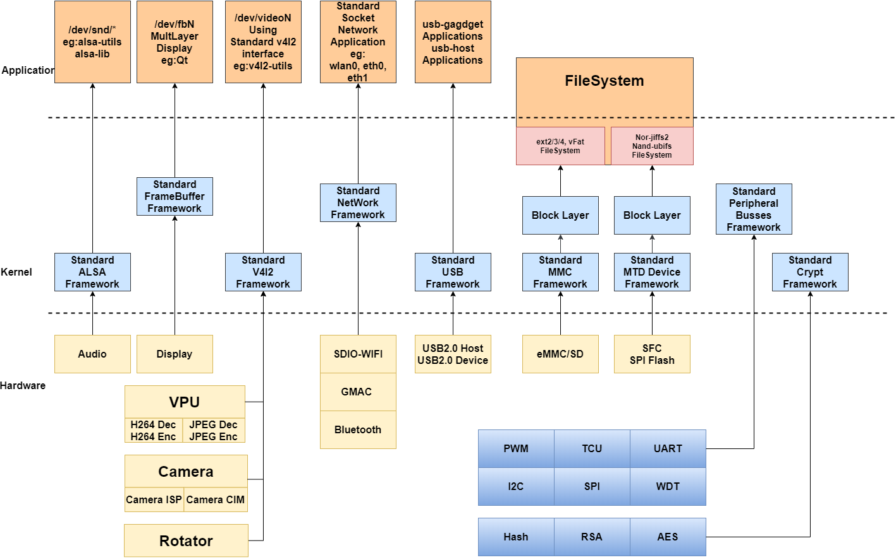
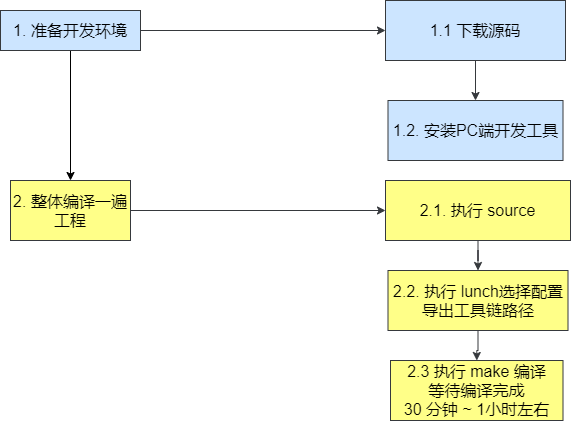
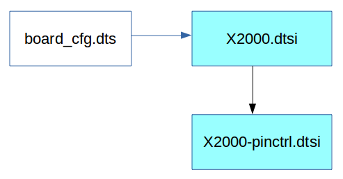
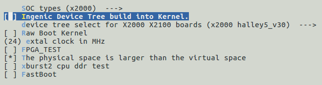
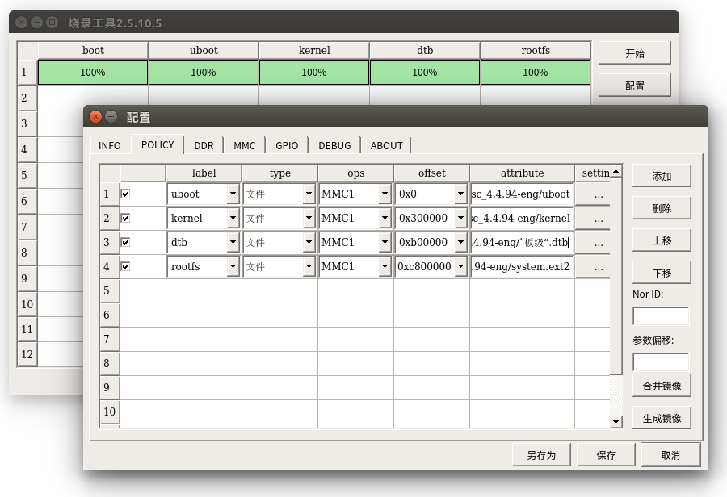

# 内核开发简介

该文档针对君正系列芯片，Kernelx.x标准内核平台进行研发，主要针对内核的基本结构，内核的编译，设备树和驱动的配置和裁剪进行说明。

## 内核基本结构

君正系列芯片的控制器在Kernelx.x进行了驱动层的适配，所使用的驱动接口也都是用了内核的标准驱动接口，用户可以基于标准应用接口进行二次开发，而不用关心底层的具体实现。

内核基本适配结构图如下图:



图表 1‑1 内核驱动适配结构图

## 内核开发流程

内核的开发可以分为两种类型的开发，一种基于君正提供的SDK开发环境进行开发，另外一种类型的是基于源码目录开发流程。

### 基于君正SDK内核开发流程（推荐使用）

通常情况下，会下载完整的SDK包，首先按照进行基础开发环境的搭建，整体编译一次**（注:这点很重要）**。此过程会对内核进行基础的配置。流程图如下:



图表 1‑2 内核开发流程图

在保证以上工作都执行完成之后，在需要重新配置内核，或者修改了内核需要重新编译的情况下，可以在**SDK顶层**执行以下命令进行配置
```bash
$ make kernel-menuconfig # 配置内核

$ make kernel # 编译内核
```
执行该命令后，会生成文件out/product/**productName**/image/kernel， 该文件就是最终需要烧录的内核镜像。

基于君正SDK的开发流程，源码和编译生成的中间文件是分离开的，中间文件会生成在out/product/**productName**/obj/kernel-intermediate目录下，包括内核的.config文件。

**注意事项：**

1. 使用君正SDK的开发流程，需要保证源码目录没有被污染，即不能在源码目录下使用传统的make xx_defconfig进行内核配置和编译，否则会报错误。此时可以在kernel源码目录下执行
```bash
$ make distclean

$ make mrproper
```
1. 所有使用make kernel-xxx 的命令，实质执行的是:
```bash
$ make -C out/product/productName/obj/kernel-intermediate xxx
```
在实际开发过程中，可以尝试将make kernel-xxx中xxx替换为内核支持的make命令

### 基于内核源码开发流程

基于内核源码的开发流程则是修改和编译的目标文件都生成在kernel目录下。该开发流程所有命令的执行都在kernel目录下。
```bash
$ cd kernel

$ make board_cfg_defconfig

$ make uImage
```
当需要修改内核重新配置时，使用
```bash
$ make menuconfig

$ make uImage

$ ls arch/mips/boot/uImage 即为生成的目标文件
```
执行以上命令后会在内核源码目录下生成`arch/mips/boot/uImage`文件，该文件即为最终烧录的镜像。其中board_cfg 可以在`arch/mips/configs/`目录下找到。

## 内核默认配置

所有针对开发板的内核配置默认配置文件都存储在`arch/mips/configs/`目录下。

Halley5 所包含的配置文件说明如下:


|  |  |
| --- | --- |
| **配置文件** | **说明** |
| **x2000_halley5_v20_linux_msc_defconfig** | 用于主存储为SD卡/eMMC启动的配置 |
| **x2000_halley5_v20_linux_sfc_nand_defconfig** | 用于主存储为SPI-Nand的启动配置 |
| **x2000_halley5_v20_linux_sfc_nor_defconfig** | 用于主存储为SPI-Nor的启动配置 |
| **x2000_halley5_v20_linux_sfc_nand_recovery_defconfig** | 用于OTA 升级的recovery配置 |
| **x2000_halley5_v20_linux_msc_burn_defconfig** | 用于SD卡烧工具的制作，开发请忽略  |
| **x2000_halley5_v20_linux_msc_ltp_defconfig** | 内部使用，开发请忽略 |
| **x2000_halley5_v30_linux_defconfig** | 用于x2000halley5_v30板级配置 |
| **x2000_halley5_v30_linux_mmc_recovery_defconfig** | 用于x2000halley5_v30板级mmc-ota的recovery配置 |

表 1 Halley5 kernel4.4.94内核配置表


|  |  |
| --- | --- |
| **配置文件** | **说明** |
| **x2000_halley5_v20_linux_defconfig** | 用于x2000halley5_v20板级配置 |
| **x2000_halley5_v30_linux_defconfig** | 用于x2000halley5_v30板级配置 |
| **x2000_halley5_v20_linux_minimal_system_defconfig** | 内部使用，开发请忽略 |

表 2 Halley5 kernel5.10内核配置表

## 设备树配置

devicetree用于描述芯片和开发板板级资源，主要有两种使用方式，一种方式直接和内核编译在一起，另外一种方式单独编译，单独存储，由uboot传参告知dtb存储的位置。

默认使用直接编译内核的方式，具体区别可以参考下文。

### 设备树文件介绍

关于设备树的配置文件，主要存放路径为`module_drivers/dts`目录, dts的组成一般是soc级定义和board级的定义。



图 1 Halley5 dts结构示意图


|  |  |
| --- | --- |
| **dts文件** | **文件说明** |
| **halley5_v10.dts** | 针对halley5 V1.x系列的开发板板级配置。自定义开发板配置时，需要修改此文件 |
| **halley5_v20.dts** | 针对halley5 V2.x系列的开发板板级配置。自定义开发板配置时，需要修改此文件 |
| **halley5_v30.dts** | 针对halley5 V3.x系列的开发板板级配置。自定义开发板配置时，需要修改此文件 |
| **halley5_cameras****├── RD_X2000_HALLEY5_CAMERA_1V0.dtsi****├── RD_X2000_HALLEY5_CAMERA_2V0.dtsi****├── RD_X2000_HALLEY5_CAMERA_2V1_cim.dtsi****├── RD_X2000_HALLEY5_CAMERA_2V1.dtsi****├── RD_X2000_HALLEY5_CAMERA_3V2_4LANE.dtsi****├── RD_X2000_HALLEY5_CAMERA_3V2.dtsi****├── RD_X2000_HALLEY5_CAMERA_4V2.dtsi****├── RD_X2000_HALLEY5_CAMERA_4V3.dtsi****├── RD_X2000_HALLEY5_CAMERA_5V0_cim.dtsi****├── RD_X2000_HALLEY5_CAMERA_5V0.dtsi****└── RD_X2000_HALLEY5_CAMERA_CIM_BT656.dtsi****|------RD_X2000_HALLEY5_CAMERA_cim.dtsi****├── RD_X2000_HALLEY5_CAMERA_imx335.dtsi** | 此文件夹下的内容针对的是HALLEY5支持的Camera子板配置，如果需要添加新的camera配置，可以参考里面的内容进行添加。如果完全使用官方的配置，不需要修改内容 |
| **x2000.dtsi** | X2000 SOC 芯片基础配置，客户一般不需要修改。 |
| **x2000-pinctrl.dtsi** | X2000 GPIO function配置，客户一般不需要修改。 |

表 3 Halley5 dts文件

### 内核Builtin设备树（默认使用方式）

参考平台默认使用的方式。

### 单独编译设备树

单独编译和使用设备树需要多方面的支持

1. 修改u-boot, 使其支持加载devicetree。
2. 修改内核配置，使其支持单独编译出devicetree二进制文件。
3. 修改烧录工具，使其支持烧录devicetree二进制文件。

#### 修改uboot配置

1. 需要修改配置⽂件，如：`u-boot/include/configs/x2000_halley5.h`,添加devicetree支持

```c
/* Device Tree Configuration*/

#define CONFIG_OF_LIBFDT 1

#define IMAGE_ENABLE_OF_LIBFDT 1

#define CONFIG_LMB
```

2. 修改内核启动参数和启动命令
* **Nand启动:**
```c
#define CONFIG_BOOTARGS BOOTARGS_COMMON "ip=off init=/linuxrc ubi.mtd=3 root=ubi0:rootfs ubi.mtd=4 rootfstype=ubifs rw

#define CONFIG_BOOTCOMMAND "set uImage 0x80600000; set dtb 0x83000000; sfcnand read 0x100000 0x400000 $(uImage); sfcnand read 0x900000 0x20000 $(dtb); bootm $(uImage) - ${dtb}"
```

* **Emmc/SD卡启动**:
```c
#define CONFIG_BOOTARGS BOOTARGS_COMMON " rootfstype=ext4 root=/dev/mmcblk0p7 rootdelay=3 rw"

#define CONFIG_BOOTCOMMAND "set dtb 0x83000000; set uImage 0x80f00000; mmc dev 0;mmc read ${uImage} 0x1800 0x2000; mmc read ${dtb} 0x5800 0x100; bootm ${uImage} - ${dtb}"
 ```
 **注意:** 需要根据实际分区情况进⾏修改

3. 修改内核配置

 在SDK顶层，执行make kernel-menuconfig，去掉**INGNEIC_BUILTIN_DTB**配置。

Kernelx.x.x配置说明如下:
```
There is no help available for this option.

Symbol: INGENIC_BUILTIN_DTB [=y]

Type : bool

Defined at arch/mips/xburst/Kconfig:37

Prompt: Ingenic Device Tree build into Kernel.

Depends on: SOC_TYPE [=n] && MACH_XBURST [=n]

Location:

 -> Machine selection

 -> SOC type (SOC_TYPE [=n])

 Defined at arch/mips/xburst2/Kconfig:62

 Prompt: Ingenic Device Tree build into Kernel.

 Depends on: MACH_XBURST2 [=y]

 Location:

 -> Machine selection

 -> SOC Type Selection

 Selects: BUILTIN_DTB [=y] && BUILTIN_DTB [=y]
```
去掉选项之后界面如下:

 

图 2 Halley5 去除 INGENIC_BUILTIN_DTB

#### 编译dtb文件

在SDK顶层执行
```bash
$ make kernel-dtbs
```

会在`out/product/x2000halley5/obj/kernel-intermediate/`下生成文件

`module_drivers/dts/halley5_v30.dtb`

该文件即为最终需要烧写devicetree二进制文件。

#### 烧录dtb文件

针对Nand主存储和eMMC/SD 主存储不同，烧录工具的配置有区别。

1. **烧录Nand DTB文件**

注意: 将dtb⽂件烧录到设备树预留的分区上， 要和bootcmd和bootargs配置的保持⼀致


图表 1‑3 Nand DTB烧录

2. **烧录eMMC/SD DTB 文件**
	1. dtb存放位置：推荐使用默认地址0xb00000（11MB），无需做其他修改，直接烧录即可。
	2. 如果需要自己指定dtb分区，需要做如下修改：
		1. 以halley5为例，需要参考文件`u-boot/board/ingenic/"板级"/partitiongs.tab`
		2. 内核需要修改分区个数，与上面partitions.tab配置相同
		3. 修改烧录工具dtb位置

 修改`u-boot/board/ingenic/"板级"/partitions.tab`

property:

 disk_size = 4096m

 gpt_header_lba = 512

 custom_signature = 0

partition:

 #name = start, size, fstype

 xboot = 0m, 3m,

 boot = 3m, 8m, EMPTY

 recovery = 12m, 16m, EMPTY

 pretest = 28m, 16m, EMPTY

 reserved = 44m, 52m, EMPTY

 misc = 96m, 4m, EMPTY

 cache = 100m, 100m, LINUX_FS

 system = 200m, 1800m, LINUX_FS

 data = 2000m, 2048m, LINUX_FS

#fstype could be: LINUX_FS, FAT_FS, EMPTY

注： dtb推荐使⽤地址0xb00000， 为MMC的11MB位置



图表 1‑4 eMMC/SD DTB烧录

### 通过设备树传递内核参数

内核bootargs的传递有多种方式，这里只介绍如何使用dts文件传递内核参数。

#### 修改设备树

定义chosen节点，节点中的bootargs作为向内核传递的cmdline。

例： Halley5 kernelx.x.x ：module_drivers/dts/halley5_v30.dts

/ {

 compatible = "ingenic,halley5", "ingenic,x2000";

 chosen {

 bootargs = "console=ttyS1,115200 mem=128M@0x0ip=off init=/linuxrc ubi.mtd=3 root=ubi0:rootfs ubi.mtd=4 rootfstype=ubifs rw";

 };

};

#### 修改内核配置

内核选择 MIPS_CMDLINE_FROM_DTB 配置后，会解析dts文件中的bootargs而忽略从uboot中传递的bootargs。

注: 启动过程中， uboot解析dtb中的chosen节点， 如果没有定义， 则uboot会创建默认的chosen节点．
```
Symbol: MIPS_CMDLINE_FROM_DTB [=y]

Type : boolean

Prompt: Dtb kernel arguments if available

Location:

-> Kernel type

-> Kernel command line type (<choice> [=y])

Defined at arch/mips/Kconfig

Depends on: <choice> && USE_OF [=y]
```
选中后的图像参考下图


图 3 Halley5 配置 MIPS_CMDLINE_FROM_DTB

