**君正®**

**ISP-TUNING说明文档**

Date: Feb. 2023

**君正®**

ISP-TUNING说明文档

Copyright © Ingenic Semiconductor Co. Ltd 2023. All rights reserved.

**Release history**

|  |  |  |
| --- | --- | --- |
| Date | Revision | Change |
| Feb.2023 | 1.00 | First release |

**Disclaimer**

This documentation is provided for use with Ingenic products. No license to Ingenic property rights is granted. Ingenic assumes no liability, provides no warranty either expressed or implied relating to the usage, or intellectual property right infringement except as provided for by Ingenic Terms and Conditions of Sale.

Ingenic products are not designed for and should not be used in any medical or life sustaining or supporting equipment.

All information in this document should be treated as preliminary. Ingenic may make changes to this document without notice. Anyone relying on this documentation should contact Ingenic for the current documentation and errata.

**Ingenic Semiconductor Co., Ltd.**

**Ingenic Headquarters, East Bldg. 14, Courtyard #10**

**Xibeiwang East Road, Haidian District, Beijing, China,**

**Tel: 86-10-56345000**

**Fax:86-10-56345001**

**Http: //www.ingenic.com**

**北京君正集成电路股份有限公司**

**地址:北京市海淀区东北西路中关村软件园二期君正总部大楼**

**电话: 86-10-56345000**

**传真: 86-10-56345001**

**http: //www.ingenic.com**

**目 录**

1 ISP-TUNING简介 2

2 v4l2-isp-tuning参数说明 2

2.1 v4l2-isp-tuning --help 2

2.2 设置水平翻转 3

2.3 设置垂直翻转 4

2.4 设置锐度 5

2.5 设置对比度 6

2.6 获取饱和度 8

2.7 设置亮度 9

2.8 设置antiflicker 10

2.9 切换day or night 11

2.10 设置bypass模块 12

2.11 获取luma值 13

2.12 设置曝光值 13

2.13 设置增益值 15

2.14 设置强光抑制 16

2.15 提升局部亮度 17

2.16 设置awb模式 18

2.17 设置自动白平衡模式 20

|  |  |
| --- | --- |
| 关 键 词 |  |
| 摘 要 |  |
| 缩 略 语 |  |
| 参考资料 |  |

 

# ISP-TUNING简介

ISP-TUNING的主要功能是提供调节图像的亮度，锐度，饱和度，对比度，增益，曝光，宽动态等功能的API接口，便于用户自定义图像效果。

# v4l2-isp-tuning参数说明

## v4l2-isp-tuning --help

-w --width [image width]

-h --height [image height]

-i --video-id [/dev/videox]

-n --count [out put frame_count]

-H --hflip [0:disable 1:enable]

-V --vflip [0:disable 1:enable]

-s --sharpness range[0-255]

-c --contrast range[0-255]

-S --saturation range[0-255]

-b --brightness range[0-255]

-e --exposure [0:auto, others manual exposure]

-g --gain [0:auto, others manual gain]

-f --antiflicker [0:disable 1:50Hz 2:60Hz]

-m --module isp module bypass control

-d --day-or-night [0:day_mode 1:night_mode]

-l --luma [get image luma]

--roi_ae enable=<enable>,top=<top>,bottom=<bottom>,left=<left>,right=<right>

--preset-wb ten preset wb mode

 [0:manual 1:auto 2:incandescent 3:fluorescent 4:fluorescent_h 5:horizon 6:daylight 7:flash 8:cloudy9:shade]

when preset_wb = 0 or 9, red and blue chroma balance should be set

--auto-wb wb mode

 [0:manual 1:auto]when auto_wb = 0, red and blue chroma balance should be set

-R --red red chroma balance

-B --blue blue chroma balance

-D --hilightdepress

## 设置水平翻转

【功能描述】

将图像水平翻转。

【命令参数说明】

 v4l2-isp-tuning -H

（0 dibable 1 enable）

【效果展示】

v4l2-isp-tuning -i 5 -H 0

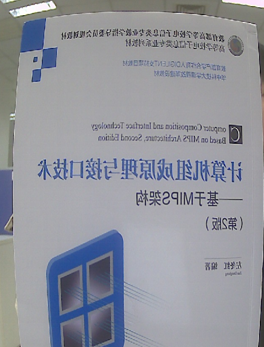

v4l2-isp-tuning -i 5 -H 1

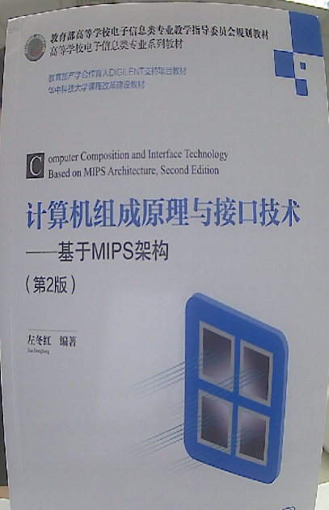

【注意事项】

该函数必须在Camera开流之后进行调用。

## 设置垂直翻转

【功能描述】

 将图像垂直翻转。

【命令参数说明】

 v4l2-isp-tuning -V

0 dibable 1 enable

【效果展示】

v4l2-isp-tuning -i 5 -V 0

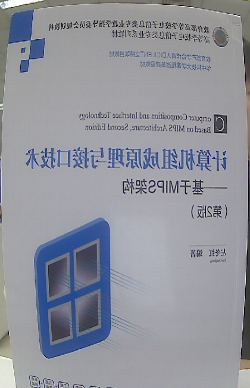

v4l2-isp-tuning -i 5 -V 1

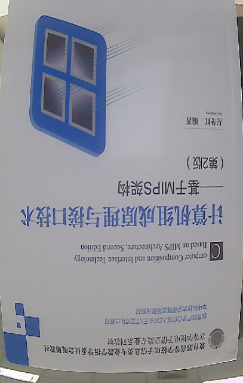

【注意事项】

该函数必须在Camera开流之后进行调用。

##  设置锐度

【功能描述】

 自定义锐度。

【参数说明】

v4l2-isp-tuning -s

range[0-255]

【效果展示】

v4l2-isp-tuning -i 5 -s 0

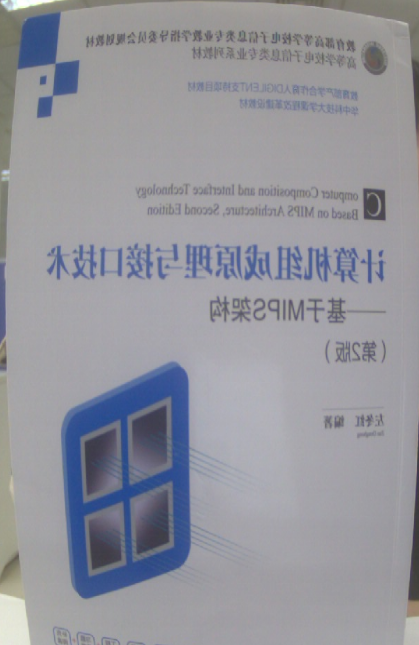

v4l2-isp-tuning -i 5 -s 255

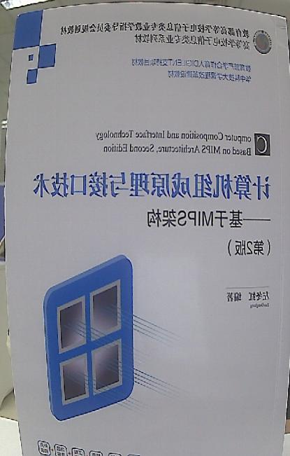

v4l2-isp-tuning -i 5 -s 140

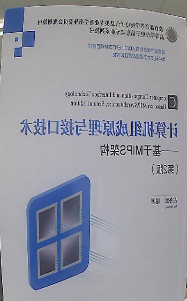

【注意事项】

该函数必须在Camera开流之后进行调用。用户可根据效果需求调节该参数。

## 设置对比度

【功能描述】

 自定义对比度。

【参数说明】

 v4l2-isp-tuning -c

range[0-255]

【效果展示】

v4l2-isp-tuning -i 5 -c 0

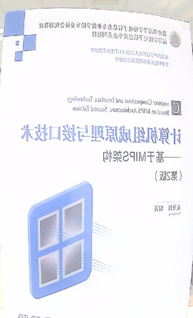

v4l2-isp-tuning -i 5 -c 255

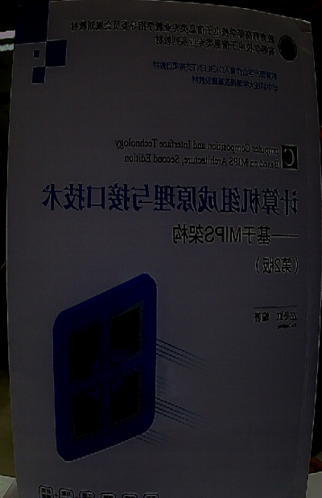

v4l2-isp-tuning -i 5 -c 140

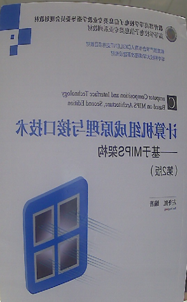

【注意事项】

该函数必须在Camera开流之后进行调用。用户可根据效果需求调节该参数。

## 获取饱和度

【功能描述】

 自定义饱和度。

【参数说明】

 v4l2-isp-tuning -S

range[0-255]

【效果展示】

v4l2-isp-tuning -i 5 -S 0

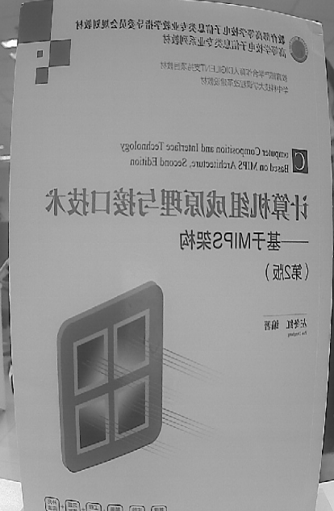

v4l2-isp-tuning -i 5 -S 255

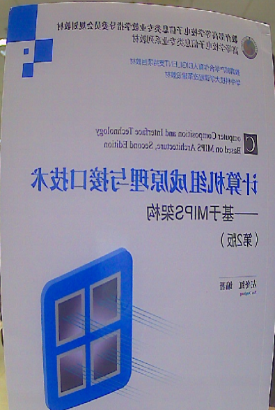

v4l2-isp-tuning -i 5 -S 140

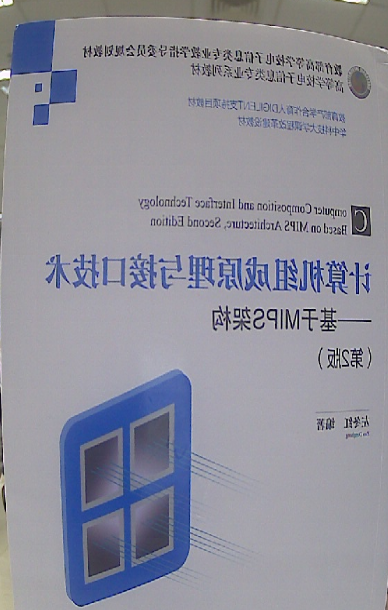

【注意事项】

该函数必须在Camera开流之后进行调用。用户可根据效果需求调节该参数。

## 设置亮度

【功能描述】

 自定义亮度值。

【参数说明】

v4l2-isp-tuning -b

range[0-255]

【效果展示】

v4l2-isp-tuning -i 5 -b 0

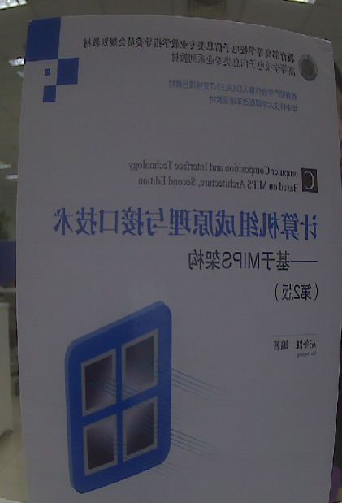

v4l2-isp-tuning -i 5 -b 255

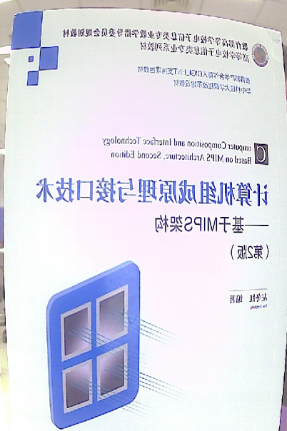

v4l2-isp-tuning -i 5 -b 140

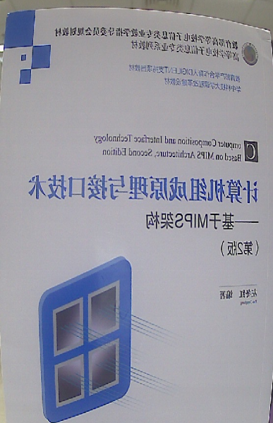

【注意事项】

该函数必须在Camera开流之后进行调用。用户可根据效果需求调节该参数。

## 设置antiflicker

【功能描述】

 消除灯光频闪。

【参数说明】

v4l2-isp-tuning -i 5 -f

0:disable 1:50Hz 2:60Hz

【注意事项】

该函数必须在Camera开流之后进行调用。用户可根据效果需求调节该参数。

## 切换day or night

【功能描述】

设置Camera为day mode或者night mode。

【参数说明】

v4l2-isp-tuning -d

0:day_mode 1:night_mode

【效果展示】

v4l2-isp-tuning -i 5 -d 0

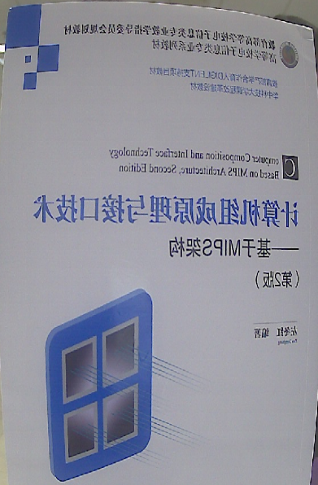

v4l2-isp-tuning -i 5 -d 1

## 设置bypass模块

【功能描述】

通过改写寄存器的值自定义对图像效果进行处理的模块。

【register说明】

|  |  |  |
| --- | --- | --- |
| Bits | Module Name | Description |
| 31:16 | Reserved | Writing has no effect. |
| 15 | FONT | 0: enable 1: disable |
| 14 | TP | 0: enable 1: disable |
| 13 | HLDC | 0: enable 1: disable |
| 12 | SDNS | 0: enable 1: disable |
| 11 | MDNS | 0: enable 1: disable |
| 10 | Y_SHARPEN | 0: enable 1: disable |
| 9 | CLM | 0: enable 1: disable |
| 8 | DEFOG | 0: enable 1: disable |
| 7 | GAMMA | 0: enable 1: disable |
| 6 | CCM | 0: enable 1: disable |
| 5 | DMS | 0: enable 1: disable |
| 4 | ADR | 0: enable 1: disable |
| 3 | AWB | 0: enable 1: disable |
| 2 | LSC | 0: enable 1: disable |
| 1 | GIB | 0: enable 1: disable |
| 0 | DPC | 0: enable 1: disable |

【参数说明】

v4l2-isp-tuning -m 

【注意事项】

该函数必须在Camera开流之后进行调用。用户可根据效果需求bypass某些模块。

## 获取luma值

【功能描述】

获取当前Camera 的luma值。

【参数说明】

v4l2-isp-tuning -l

串口打印 ：luma: 79

【注意事项】

该函数必须在Camera开流之后进行调用。

## 设置曝光值

【功能描述】

自定义Camera曝光。

【参数说明】

v4l2-isp-tuning -e

0:auto, others manual exposure

【效果展示】

v4l2-isp-tuning -i 5 -e 0

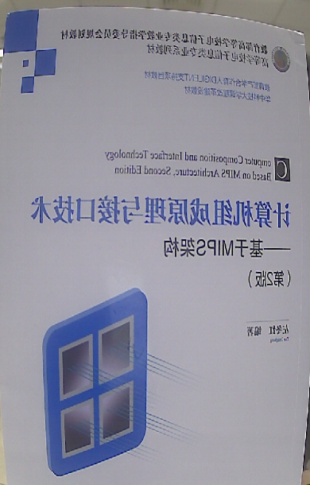

v4l2-isp-tuning -i 5 -e 1

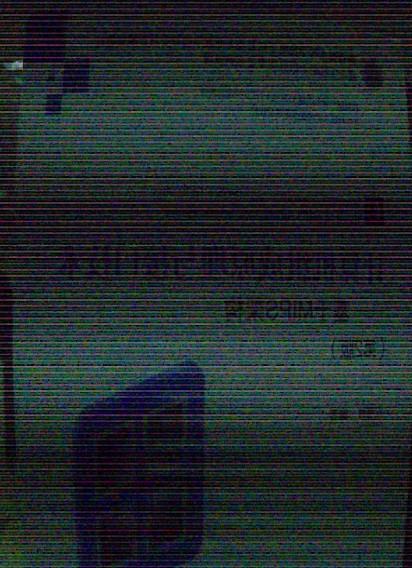

v4l2-isp-tuning -i 5 -e 500

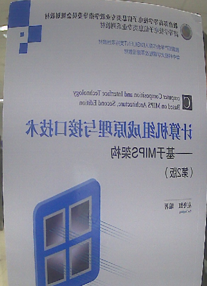

【注意事项】

该函数必须在Camera开流之后进行调用。用户可根据效果需求调节该参数。

## 设置增益值

【功能描述】

自定义Camera增益。

【参数说明】

v4l2-isp-tuning -g

0: auto other: 手动设置增益值(1024=1x,2048=2x……) 

【效果展示】

v4l2-isp-tuning -i 5 -g 0

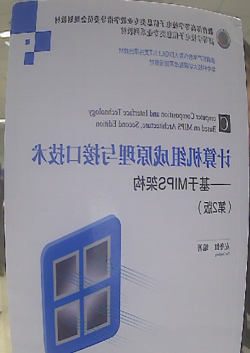

v4l2-isp-tuning -i 5 -g 100

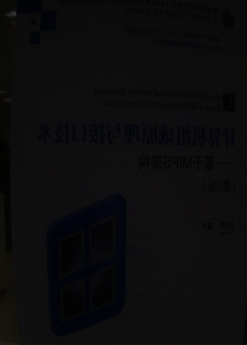

v4l2-isp-tuning -i 5 -g 8192

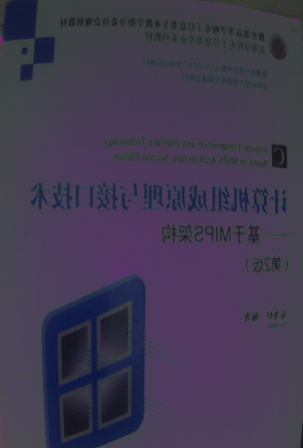

【注意事项】

该函数必须在Camera开流之后进行调用。用户可根据效果需求调节该参数。

## 设置强光抑制

【功能描述】

对全局画面进行强光抑制。

【参数说明】

v4l2-isp-tuning -D

0 dibable 1 enable

【效果展示】

v4l2-isp-tuning -i 5 -D 0

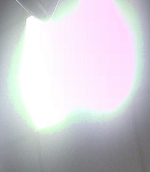

v4l2-isp-tuning -i 5 -D 1

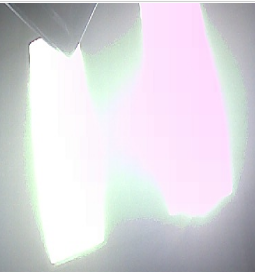

【注意事项】

该函数必须在Camera开流之后进行调用。用户可根据效果需求调节该参数。

## 提升局部亮度

【功能描述】

对指定区域提亮。

【参数说明】

v4l2-isp-tuning --roi_ae

enable=<enable>,top=<top>,bottom=<bottom>,left=<left>,right=<right>

|  |  |
| --- | --- |
| top | 指定区域的上边界（大于0） |
| bottom | 指定区域的下边界（小于图像高度） |
| left | 指定区域的左边界（大于0） |
| right | 指定区域的右边界（小于图像宽度） |

【注意事项】

该函数必须在Camera开流之后进行调用。用户可根据效果需求调节该参数。

## 设置awb模式

【功能描述】

自定义Camera 白平衡模式。共有10种模式，选择模式0和模式9时必须设置红绿分量权重。

【awb mode说明】

|  |  |
| --- | --- |
| mode | Description |
| 0 | 手动白平衡 |
| 1 | 自动白平衡 |
| 2 | 白炽（钨丝）灯的白平衡设置。该模式通常会冷却颜色，并对应于大约2500-3500 K的色温范围。 |
| 3 | 荧光灯的白平衡预设。该模式大约对应于4000-5000 K色温。 |
| 4 | 使用此模式，相机将补偿荧光H照明。 |
| 5 | 地平线日光的白平衡设置。该模式大约对应于5000 K色温。 |
| 6 | 日光（晴空）预设白平衡。该模式大约对应于5000-6500 K色温。 |
| 7 | 使用此模式，相机将补偿闪光灯。该模式稍微增加了暖色，大致对应于5000-5500 K的色温。 |
| 8 | 多云的天空预设白平衡。该模式大约对应于6500-8000 K色温范围。 |
| 9 | 阴影或阴天预设的白平衡。该模式大约对应9000-10000 K色温。 |

【效果展示】

v4l2-isp-tuning -i 5 -R 100 -B 100 --preset-wb 0

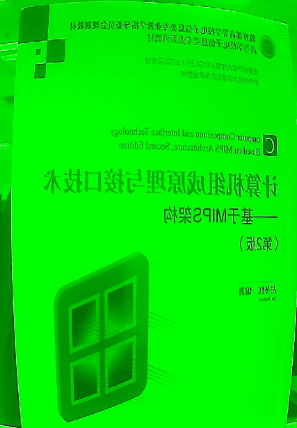

v4l2-isp-tuning -i 5 -R 1000 -B 1000 --preset-wb 0

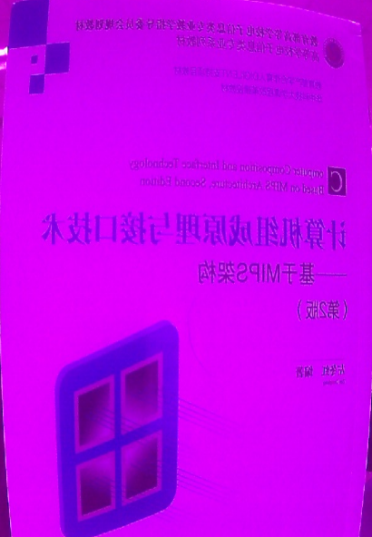

v4l2-isp-tuning -i 5 --preset-wb 1

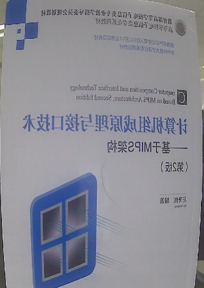

【注意事项】

该函数必须在Camera开流之后进行调用。用户可根据效果需求调节该参数。

## 设置自动白平衡模式

【功能描述】

自定义Camera 自动白平衡模式。

【参数说明】

v4l2-isp-tuning --auto-wb 

共有2种模式，选择模式0时，自动调节白平衡使用的是用户自定义的红蓝分量，选择模式1时，自动白平衡使用的是bin文件中预设的参数分量。

【效果展示】

v4l2-isp-tuning -i 5 -B 1000 -R 0 --auto-wb 0

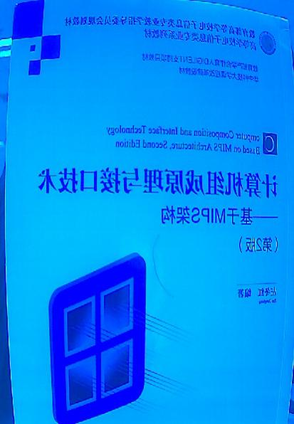

v4l2-isp-tuning -i 5 -B 0 -R 1000 --auto-wb 0

v4l2-isp-tuning -i 5 --auto-wb 1

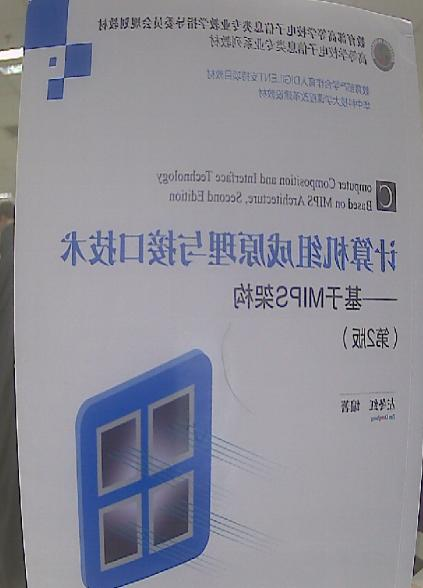

【注意事项】

该函数必须在Camera开流之后进行调用。用户可根据效果需求调节该参数。

