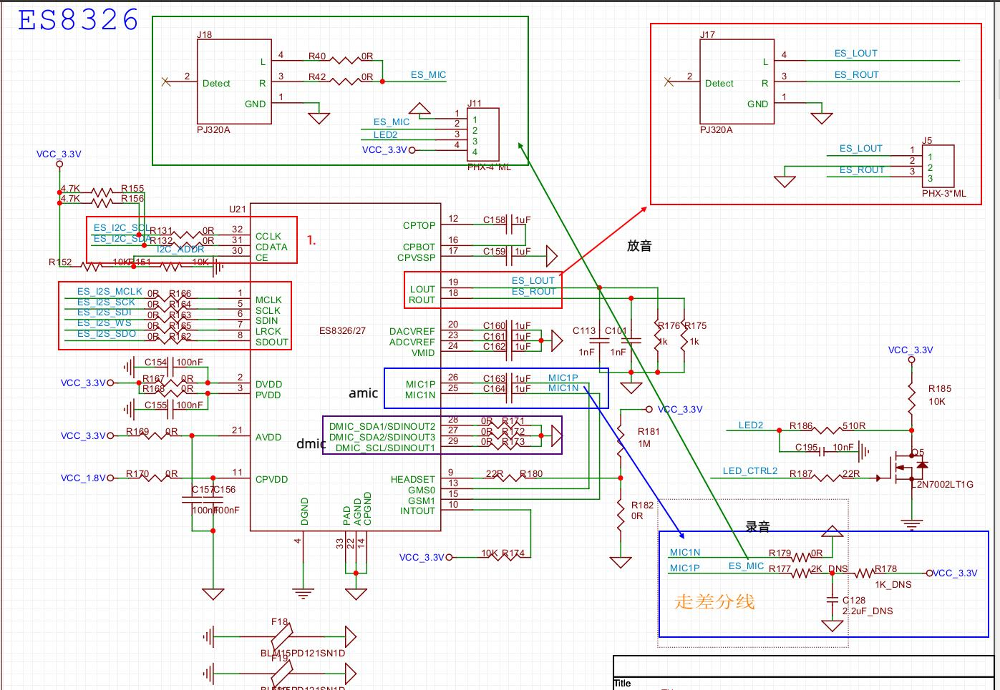
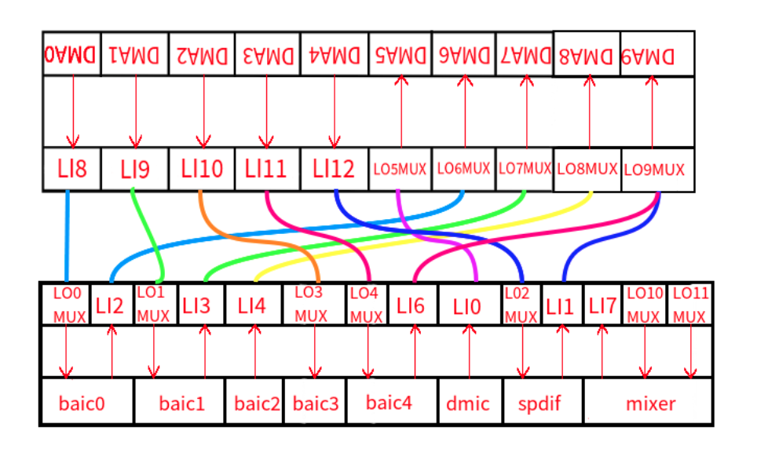
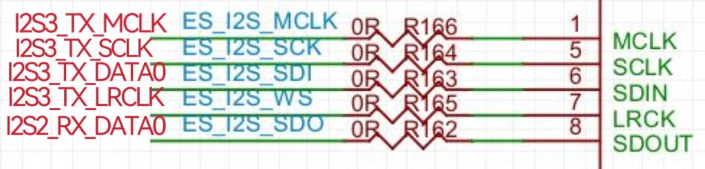
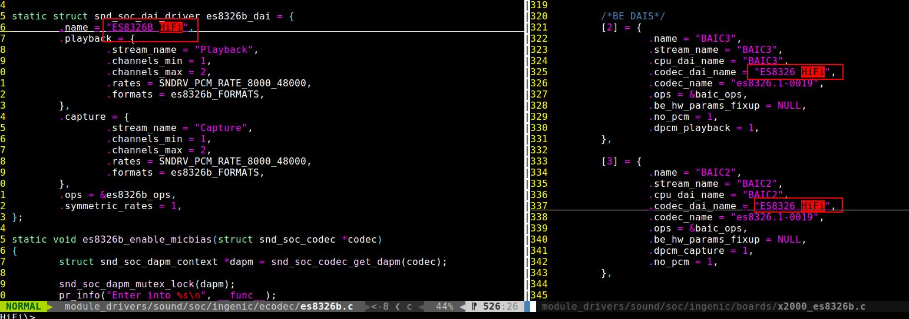
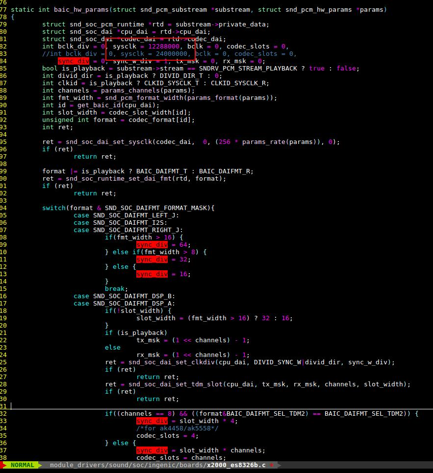
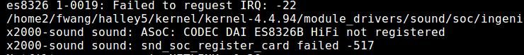
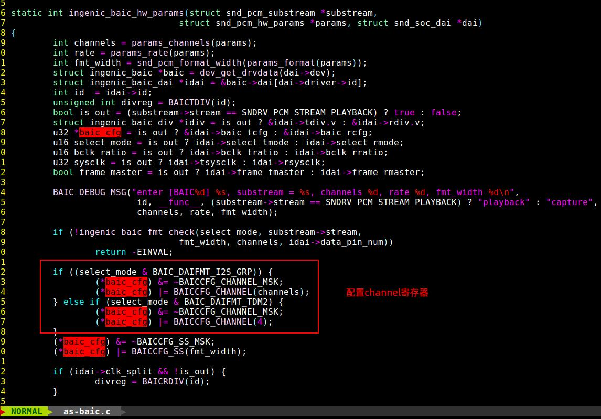
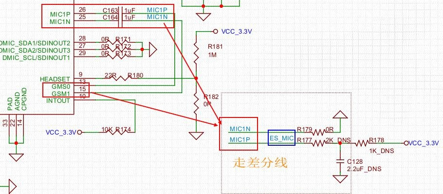
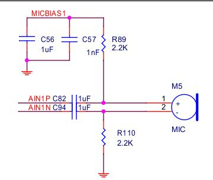

# x2000_Audio

## 模块功能介绍：

* audio有10个DMA模块, 其中DMA0-DMA4功能是从RAM搬移数据到fifo，DMA5-DMA9功能是从fifo搬数据到RAM中，每个DMA固定连接到DBUS中的一个FIFO上。
* 5个BAIC（Basic Audio Interface Controller），BAIC0和ICODEC(Internal CODEC)相连支持单通道录放音。
* dmic最大支持8通道，支持语音唤醒。
* spdif（Sony Philips Digital Interconnect Format）。

# 添加ecodec(以添加es8326b驱动为例)

## 驱动源码位置：

halley5/kernel/kernel-4.4.94/module_drivers/sound/soc/ingenic/ecodec/es8326b.c

halley5/kernel/kernel-4.4.94/module_drivers/sound/soc/ingenic/ecodec/es8326b.h

## 设备树位置：

halley5/kernel/kernel-4.4.94/module_drivers/dts/halley5_v30.dts

## 板级驱动位置：

halley5/kernel/kernel-4.4.94/module_drivers/sound/soc/ingenic/boards/x2000-es8326b.c

> 其中es8326b.c es8326b.h 由驱动厂家提供，x2000-es8326b.c　参考zebra.c 添加；

## 编译配置

1. module_drivers/sound/soc/ingenic/boards/Makefile

```
snd_board_external_source-y := x2000_es8326b.o
obj-$(CONFIG_SND_ASOC_INGENIC_BOARD_EXTERNAL_SOURCE) += snd_board_external_source.o

```

2. module_drivers/sound/soc/ingenic/ecodec/Kconfig

```
config SND_SOC_ES8326B
       depends on I2C
        tristate "ES8326B ADC/DAC"
```

3. module_drivers/sound/soc/ingenic/ecodec/Makefile

```
obj-$(CONFIG_SND_SOC_ES8326B)  += es8326b.o

```

## 内核编译配置选择：

```
Symbol: SND_ASOC_INGENIC_BOARD_EXTERNAL_SOURCE [=y]  
Type  : tristate                                   
Prompt: Audio support for external source board    
  Location:                                        
    -> Ingenic device-drivers Configurations       
      -> [AUDIO] ASoC support for Ingenic (SND_ASOC_INGENIC [=y])
        -> Ingenic Board Type Select               
          -> SOC x2000 v12 codec Type select (<choice> [=y])   
  Defined at module_drivers/sound/soc/ingenic/Kconfig:264  

```

```
 Symbol: SND_SOC_ES8326B [=y]                                    
 Type  : tristate                                                
 Prompt: ES8326B ADC/DAC                                         
   Location:                                                     
     -> Ingenic device-drivers Configurations                    
       -> [AUDIO] ASoC support for Ingenic (SND_ASOC_INGENIC [=y])   
         -> ingenic external codec Type select                   
   Defined at module_drivers/sound/soc/ingenic/ecodec/Kconfig:42   
   Depends on: SND_ASOC_INGENIC [=y] && SND_ASOC_INGENIC_AS_V2 [=y] && I2C [=y]

```

## 分析原理图确定录音放音通路：



1. 根据外部codec spec 手册确定i2c 地址，根据硬件原理图连接方式确定设备树dts需要配置的i2c总线，用来识别es8326 芯片；
2. 根据原理图确定i2s 用到的mclk、sclk、lrclk、sdin、sdout (时钟和收发数据线)，配置设备树dts 的aic 控制器节点：　&as_be_baic　到对应的gpio function 。用来提供录音放音的时钟和传输数据；
3. 确定设备用的dmic (as_dmic) /amic (as_be_baic),这里用到的是amic ;
4. 确定codec 是否上电，供电是硬件提供软件不需要匹配，软件接到gpio，对应设备树需要配置对应gpio 管脚，本例由硬件控制上电；
5. 确定有无HEADSET等需要配置的gpio;

## 设备树配置

```

&i2c1 {
       status = "okay";
       clock-frequency = <100000>;
       timeout = <1000>;
       pinctrl-names = "default";
       pinctrl-0 = <&i2c1_pc>;

     　es8326b: codec@19{
               status = "okay";
               compatible = "everest,es8326b";
               reg = <0x19>;   //i2c地址
                }; 
};

&as_be_baic {
       	status = "okay";
       	pinctrl-names = "default";
　     	pinctrl-0 = <&baic3_mclk_pa>, <&baic3_pa_tdm2>;  /*放音*/
	pinctrl-0 =<&baic2_mclk_pa>,<&baic2_pa>;　/*录音*/
};

/* &as_dmic {  
    pinctrl-names = "default";
    pinctrl-0 = <&dmic_pc>;
};  */


sound {
        compatible = "ingenic,x2000-sound";
        ingenic,model = "x2000_es8326b";  /*板级驱动名字*/
};
```

## 板级驱动配置

１．数据通路配置：（参考zebra.c格式)

由下图可知 baic0 、baic1 支持录音和放音；baic2 只支持录音，baic3只支持放音...

更详细的图示请看内核开发手册－[Audio音频子系统.md章节](zh-cn/X2000/X2000-halley5/kernel/Audio音频子系统.md)

对应关系：i2s0 <----->baic0 、i2s1 <-----> baic1、i2s2 <-----> baic2...



```
static const struct snd_soc_dapm_route audio_map[] = {
    /*  Target    control   Source*/
    { "BAIC3 playback", NULL, "LO3_MUX" },
    { "LI4", NULL, "BAIC2 capture" },

    {"LO8_MUX", NULL, "LI4"},   /*I2S2 Capture: BAIC2 capture->LI4->LO8_MUX->DMA8*/
    {"LO3_MUX", NULL, "LI10"},  /*I2S3 Playback: DMA2->LI10->LO3_MUX->BAIC3 playback*/

    { "LI10", NULL, "DMA2" },
    { "DMA8", NULL, "LO8_MUX"},

    {"BAIC2 capture", NULL, "I2S2 IN"},
    {"I2S3 OUT", NULL, "BAIC3 playback"},
};

static const struct snd_soc_dapm_widget dapm_widgets[] = {
        SND_SOC_DAPM_INPUT("I2S2 IN"),
        SND_SOC_DAPM_OUTPUT("I2S3 OUT"),
};
```

例如：（原理图连接是i2s3 sclk.i2s3 mclk. i2s3 lrclk .i2s3 sdin . i2s2 sdout)  所以配置i2s3通路放音，i2s2通路录音；



```
  static struct snd_soc_dai_link x2000_dais[] = {
        /*FE DAIS*/
        [0] = {
                .name = "DMA2 playback",		//放音
                .stream_name = "DMA2 playback",
                .platform_name = "134d0000.as-platform",
                .cpu_dai_name = "DMA2",
                .codec_dai_name = "snd-soc-dummy-dai",
                .codec_name = "snd-soc-dummy",
                .trigger =  {SND_SOC_DPCM_TRIGGER_PRE, SND_SOC_DPCM_TRIGGER_PRE},
                .dynamic = 1,
                .dpcm_playback = 1,
        },

        [1] = {
                .name = "DMA8 capture",			//录音
                .stream_name = "DMA8 capture",
                .platform_name = "134d0000.as-platform",
                .cpu_dai_name = "DMA8",
                .codec_dai_name = "snd-soc-dummy-dai",
                .codec_name = "snd-soc-dummy",
                .trigger =  {SND_SOC_DPCM_TRIGGER_PRE, SND_SOC_DPCM_TRIGGER_PRE},
                .dynamic = 1,
                .dpcm_capture = 1,
        },

        /*BE DAIS*/
        [2] = {
                .name = "BAIC3",
                .stream_name = "BAIC3",
                .cpu_dai_name = "BAIC3",
                .codec_dai_name = "ES8326B HiFi",     	//名字与驱动(es8326b.c)中要一致
                .codec_name = "es8326b.1-0019",		//es8326b.i2c<1>-<i2c地址> 
                .ops = &baic_ops,
                .be_hw_params_fixup = NULL,
                .no_pcm = 1,
                .dpcm_playback = 1,
        },   

        [3] = {
                .name = "BAIC2",
                .stream_name = "BAIC2",
                .cpu_dai_name = "BAIC2",
                .codec_dai_name = "ES8326B HiFi",	　//名字与驱动(es8326b.c)中要一致
                .codec_name = "es8326b.1-0019",		　//es8326b.i2c<1>-<i2c地址>
                .ops = &baic_ops,
                .be_hw_params_fixup = NULL,
                .dpcm_capture = 1,
                .no_pcm = 1,
        },


};

```



## 时钟配置与计算

板级驱动中　baic_hw_params（)　配置了mclk和计算lrclk；

采样率lrclk :8K|44.1K|48K|192K|384K|...

采样位数：８位｜16位｜24位｜32位

sclk(BCLK)=立体声双声道２x 采样率48K x 采样位数

mclk 一般是采样率的256 倍或384 倍；

本例采样率是48khz ,采样位数32位（根据codec spec 确认）



## 放音命令：

```
# aplay -l
**** List of PLAYBACK Hardware Devices ****
card 0: x2000es8326b [x2000_es8326b], device 0: DMA2 playback (*) []
  Subdevices: 1/1
  Subdevice #0: subdevice #0
```

```
aplay -D hw:0,0　baic2_48000-32-2.wav
```

## 录音命令：

```
# arecord -l
**** List of CAPTURE Hardware Devices ****
card 0: x2000es8326b [x2000_es8326b], device 1: DMA8 capture (*) []
  Subdevices: 1/1
  Subdevice #0: subdevice #0

```

```
arecord  -D hw:0,1 -r 48000 -f S32_LE  -c ２ -d 5 baic2_48000-32-2.wav 

```

# 注意事项

1. Q: 注册失败，识别不到声卡？

    A: 检查板级驱动与ecodec驱动　.codec_dai_name = "ES8326B HiFi",   .codec_name = "es8326b.1-0019",名字是否匹配；



2. ecodec 和x2000 主从关系。
3. Q: 播放没有声音或录音失败?

　	A: 量mclk、sclk、lrclk、数据线有没有波形；检查数据线连接：

    放音：(CODEC)I2S_SDIN <------------->I2S3_TX_DATA0(X2000)

    录音：(CODEC)I2S_SDOUT<------------->I2S2_RX_DATA0(X2000)

4. Q: 时钟波形正常，有数据波形，但是放不出声音或录不到声音？

    A: 检查硬件连接通道数，2/4/8 通道连接方式，数据都会默认先输出到DATA0，如果硬件连接到DATA1上用４channel或者８channel 采集数据，示波器量DATA0 ,看看是否有数据确认问题;



5. Q: 如果是压电MIC: 有录音数据文件有大小，但音频播放软件实际看没有数据波形?

    A: 量录音ES_MIC是否有偏置电压MicBias,例如下面原理图没有电压是被GMS0 拉低了，割断后有电压；



> 正常例子：