**君正®**
Copyright © Ingenic Semiconductor Co. Ltd 2023. All rights reserved.

**Release history**
|           |          |                |
| --------- | -------- | -------------- |
| Date      | Revision | Change         |
| 2022.6.2  | 1.0      | First release  |
| 2022.12.5 | 2.0      | Second release |
|           |          |                |

# 简介

Hippo-SDK,是适配君正X2500芯片的软件开发支持包。平台通过Build.mk文件进行指导性编译。支持如下功能。

* 支持编译c文件，cpp文件
* 支持动态库，静态库的编译
* 支持可执行bin文件的编译
* 支持添加第三方应用和库
* 支持模块的单独编译

## 目录结构介绍

平台的目录文件结构如下图所示。

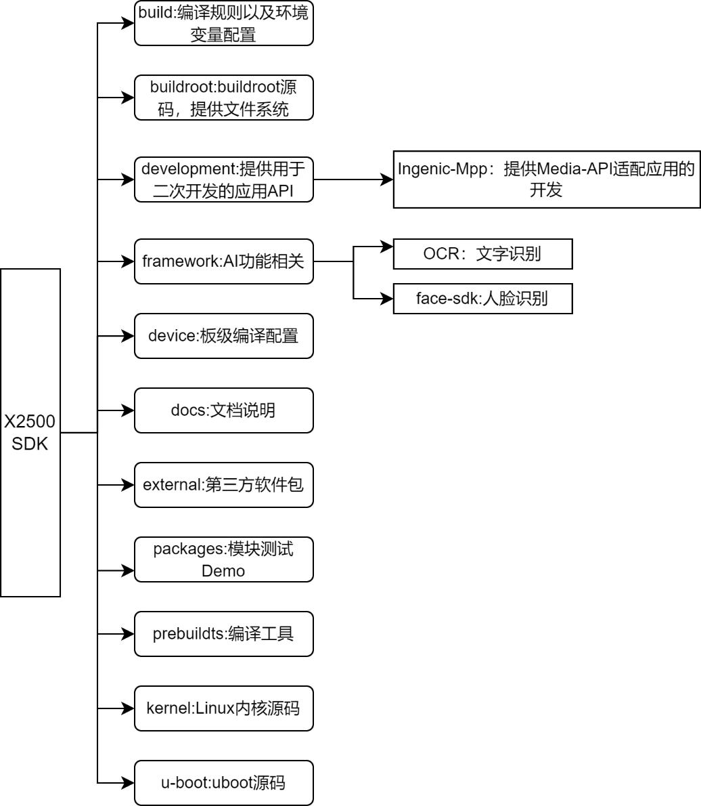

图 1-1 hippo-SDK目录结构

# 君正平台编译配置和命令介绍

平台的编译配置主要以buildroot中的配置为例进行说明。

## 君正平台默认配置

### buildroot中的默认配置

Hippo-SDK针对使用不同的存储介质，提供了几个默认配置，默认配置存放在buildroot/configs/文件夹下。支持X2500芯片的开发板如下：

hippo_msc_defconfig

hippo_nand_defconfig

hippo_nor_defconfig

hippo_v12_msc_defconfig

### buildroot中的自定义配置

buildroot中的默认配置提供了一些常用的工具和设置，并不能满足所有用户的需求，用户可以根据自己的需求就行自定义的配置。

例如要在buildroot中添加一个ffmpeg的工具。操作如下。

1. 进入hippo工程目录
2. 执行make buildroot-menuconfig
3. 按”/“键进入搜索模式，在搜索框中输入ffmpeg。搜索出来的结果如下图所示。


1. 根据搜索结果上Location的提示，进入Target packages/Audio and video applications/配置项下（或按1），然后勾选并进入ffmpeg，根据自己的需求选择想要添加的功能。
2. 保存退出

## buildroot中的君正软件配置

buildroot中君正软件包配置是在buildroot配置中Ingenic packages下的一些配置，可配置的内容如下图所示。

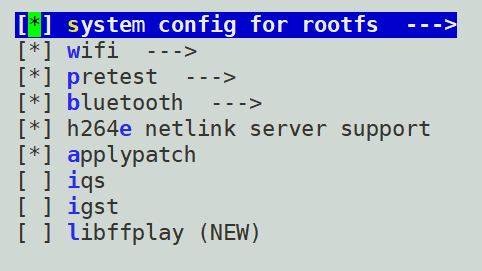

图 2-1 君正软件配置

### system config for rootfs的配置

在hippo平台中，可以对system config for rootfs进行一些系统的配置。主要包括如下几项配置

表 2-1 rootfs可配置项


|                                                    |                      |
| -------------------------------------------------- | -------------------- |
| **可配置项**                                       | **说明**             |
| enable adb service                                 | 打开adb服务          |
| set dns server                                     | 打开dns服务          |
| cache dns                                          |                      |
| mount usr data: mount_ubifs.sh userdata /usr/data/ | 开机挂载用户数据分区 |
| mount usr data: mount mmcblk0p7 to /usr/data/      |                      |
| mount storage: mount mmcblk0p9 to /storage/        |                      |
| enable sd burn                                     | 打开sd卡烧录功能     |
| enable rootlogin when using open ssh               | 以管理员身份登录系统 |
| enable usb composite gadgets                       |                      |

如下图所示。

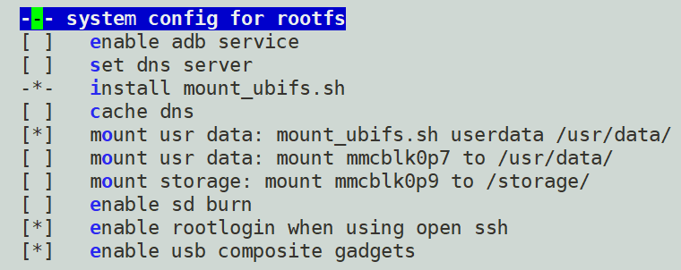

图 2-2 rootfs可选配置内容

具体的配置方法如下。

1. 进入hippo工程
2. 执行make buildroot-menuconfig
3. 配置Ingenic packages/system config for rootfs/
4. 选择需要配置的内容
5. 保存退出

### wifi配置

hippo平台中，可以对WIFI进行配置，以下为WIFI可配置的几个内容。

表 2-2 君正厂商WIFI的可配置项


|                               |                                 |
| ----------------------------- | ------------------------------- |
| **可配置项**                  | **说明**                        |
| common wifi device            | 选择常见的WIFI                  |
| select wifi chip              | 选择WIFI芯片的型号              |
| wpa_supplicant.conf file path | 设置wpa_supplicant.conf文件路径 |
| hostapd.conf file path        | 设置hostapd.conf文件路径        |
| hostap interface              | 设置hostap 接口名称             |
| wifi auto startup             | 配置WIFI是否自动启动            |
| wifi use ap mode              | 配置WIFI是否使用热点模式        |
| wifi mac address              | 设置WIFI的mac地址               |
| wifi mac address path         | 配置mac地址文件路径             |

如下图所示。

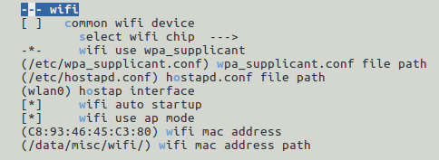

图 2-3 wifi可选配置项

WIFI配置的方法如下。

1. 进入hippo工程
2. 执行make buildroot-menuconfig
3. 配置Ingenic packages/ wifi/
4. 选择想要配置的项
5. 保存退出

### bluetooth配置

hippo平台中，可以配置蓝牙是否支持BSA server，以及选择使用的蓝牙芯片。具体的配置方法如下。

1. 进入hippo工程
2. 执行make buildroot-menuconfig
3. 配置Ingenic packages/bluetooth，配置选项的路径如下图所示。

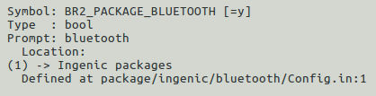

图 2-5 bluetooth的配置路径

### applypatch配置

hippo平台中，可以配置是否使用applypatch，具体的配置方法如下。

1. 进入hippo工程
2. 执行make buildroot-menuconfig
3. 配置Ingenic packages/applypatch，配置选项的路径如下图所示。

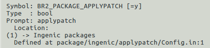

图 2-7 君正厂商配置中applypatch的配置路径

##  编译命令

### 编译规则

在编译之前，首先要完成编译工具链和编译配置的初始化。执行如下指令初始化编译工具链。

source build/envsetup.sh 

然后执行如下指令加载编译的配置。

lunch 

执行完成后会列出一些可供选择的配置，如下图所示。

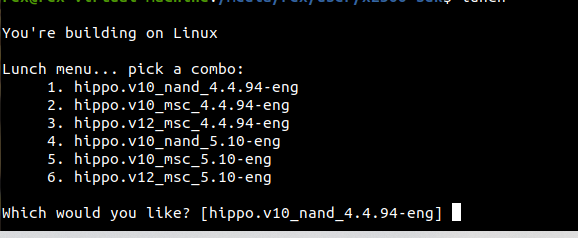

配置的选择请参考《HIPPO软件平台快速开发指南》

如下为平台编译的一些常用命令。进入hippo软件平台根目录，执行下列指令编译相应的内容。

表 2-4 hippo平台编译命令


|                           |                                               |
| ------------------------- | --------------------------------------------- |
| **编译命令**              | **说明**                                      |
| make                      | 整体编译工程                                  |
| make buildroot            | 单独编译buildroot                             |
| make buildroot-menuconfig | 配置buildroot                                 |
| make buildroot-clean      | 清除buildroot编译产生的一些文件               |
| make buildroot-distclean  | 彻底清除buildroot编译产生的文件，包括下载的库 |
| make buildroot-<packname> | 编译buildroot内的软件包                       |
| make kernel               | 单独编译kernel                                |
| make kernel-menuconfig    | 配置kernel                                    |
| make kernel-clean         | 清除kernel编译产生的一些文件                  |
| make kernel-distclean     | 彻底清除kernel编译产生的文件                  |
| make uboot                | 单独编译uboot                                 |
| make uboot-menuconfig     | 配置uboot                                     |
| make uboot-clean          | 清除uboot编译产生的一些文件                   |
| make uboot-distclean      | 彻底清除uboot编译产生的文件                   |
| make (module naem)        | 单独编译模块                                  |

### 编译生成的文件

编译完成后，生成out目录,结构如下：
```c
 product 
 └── hippo_xxx // 板级
 ├── image // 生成的目标文件（uboot、kernel、文件系统）
 ├── obj //模块编译过程中生成的中间文件及目标文件（strip前）
 ├── sysroot //文件系统（strip前）
 └── system //文件系统（包含strip后的模块）
```

单独编译buildroot后，生成的rootfs会存放在obj/buildroot-intermediate/images/目录下，当执行 ”make“ 指令整体编译后，会将生成的rootfs搬运到image目录下。

### 单独编译模块的方法

单个模块编译规则如下，在工程的顶层目录下执行：

```c
make $(LOCAL_MODULE)
``` 

即make “模块名” 就可单独编译单个模块，以packages/example/App/cimutils 下的cimutils测试模块为例，此模块LOCAL_MODULE（Build.mk中）赋值为：cimutils，执行如下命令即可单独编译cimutils模块：

```c
make cimutils
```

### 单独编译buildroot包的方法

在hippo工程的buildroot/packages/目录下，有一些可供选择的软件包。当需要使用这些软件包时，可以通过如下方式进行编译。

```c
make buildroot-<packname> 
```

如要编译buildroot/packages/下的ffmpeg，执行如下指令编译。

```c
make buildroot-ffmpeg
```

# 君正平台应用介绍

君正平台应用指的是君正自己开发的一些应用。如下表所示。

表 3-1 君正平台应用


|                  |                                                                            |
| ---------------- | -------------------------------------------------------------------------- |
| **平台应用**     | **说明**                                                                   |
| IMPP             | 可进行音视频采集播放、音视频编解码以及图像的2D处理(旋转/透明叠加/格式转换) |
| cimutils         | 图片预览和拍照接口                                                         |
| v4l2-isp-tunning | 亮度，对比度，饱和度，锐度的调节接口                                       |
| webcam_gadget    | Uvc功能                                                                    |
| mjpg-streamer    | 双目摄像头应用                                                             |

## Ingenic-Media-Process-Platform

IMPP(Ingenic-Media-Process-Platform)，可进行音视频采集播放、音视频编解码以及图像的2D处理(旋转/透明叠加/格式转换)，此软件包以库的形式进行发布；提供丰富的API便于开发者进行应用的开发。IMPP的结构组成如下：

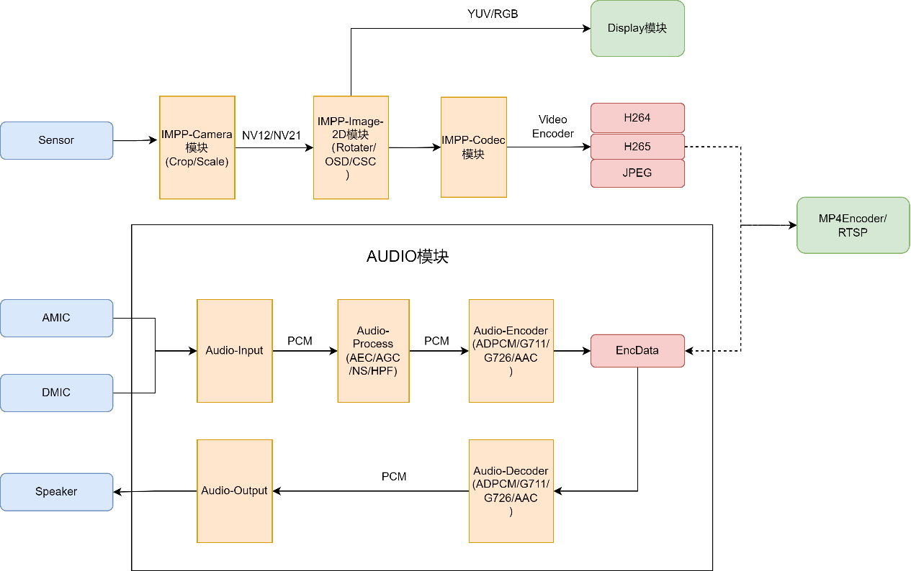

IMPP的详细使用说明可参考<IMPP开发指南>。

## cimutils

### 功能简介

cimutils测试cim/isp camera图像预览和拍照，支持图片JPEG、raw和bmp格式输出

* 源码路径：packages/example/App/cimutils
* 软件流程图如下：

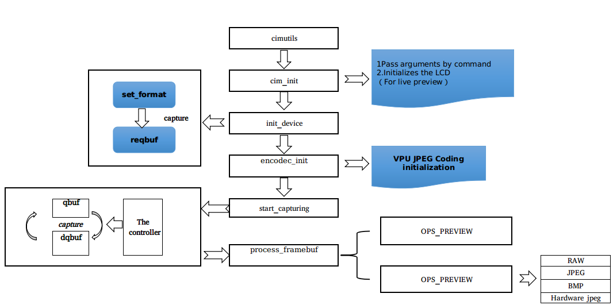

图 3-5君正平台应用Cimutils 软件流程图

### 使用方法

#### 模块编译

进入hippo工程的根目录，执行如下指令进行模块编译。
```c

make cimutils

make
```

 模块编译完成后,生成可执行文件cimutils，存放在out/product/hippo_xxx/system/usr/bin/目录下。

#### 模块使用

在hippo开发板上执行如下指令运行模块。

```c
cimutils -v cim -E helix -C -f filename.jpg -t nv12 -x 320 -y 240
```

参数：

-v 指定isp/cim节点

-E 指定helix硬件编码

-f 指定输出文件类型

-t 指定输入格式

-x指定图片宽度

-y 指定图片高度

测试结果：

查看filename.jpg文件是否显示正常

##  webcam_gadget

### 功能简介

webcam_gadget用于UVC功能

* 源码路径：packages/example/App/usb-gadget/webcam
* 软件流程图如下：

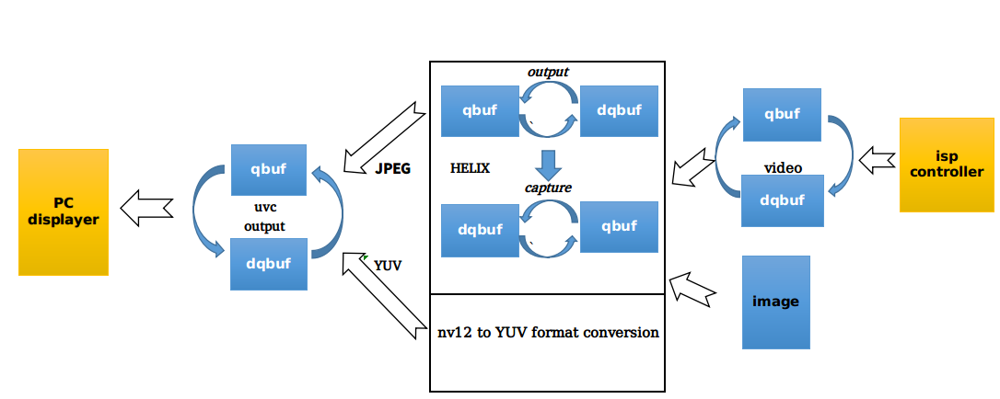

图 3-6君正平台应用webcam_gadget 软件流程图

### 使用方法

#### 模块编译

hippo工程的根目录，执行如下指令进行模块编译。
```c
make webcam_gadget
make
```

 模块编译完成后,生成webcam_gadget，存放在out/product/hippo_xxx/system/usr/sbin/目录下。

#### 模块使用

* 静态图片测试命令：

```c
webcam_gadget -u /dev/video7 -v /dev/video4 -e /dev/video0 -d -i /1280x720.yuv
```

* Camera采集测试命令：

```c
webcam_gadget -u /dev/video7 -v /dev/video4 -e /dev/video0
```

参数：

-b Use bulk mode

-d Do not use any real V4L2 capture device

-h Print this help screen and exit

-i images dir for [uvc-WxH.jpg uvc-WxH.yuv]

-m Streaming mult for ISOC (b/w 0 and 2)

-n Number of Video buffers (b/w 2 and 32)

-o <IO method> Select UVC IO method:

 0 = MMAP

 1 = USER_PTR

-s <speed> Select USB bus speed (b/w 0 and 2)

 0 = Full Speed (FS)

 1 = High Speed (HS)

 2 = Super Speed (SS)

-t Streaming burst (b/w 0 and 15)

-u device UVC Video Output device

-v device V4L2 Video Capture device

-e device HELIX Video Capture device

测试结果：

查看pc端是否显示正常

##  v4l2-isp-tunning

### 功能介绍

v4l2-isp-tuning的主要功能是操作mscaler某通道的节点，调节图像的亮度，锐度，饱和度和对比度，并通过同一msclaer的另一通道节点观察调节效果。

* 源码路径：packages/example/App/v4l2-isp-tuning
* 软件流程图如下：

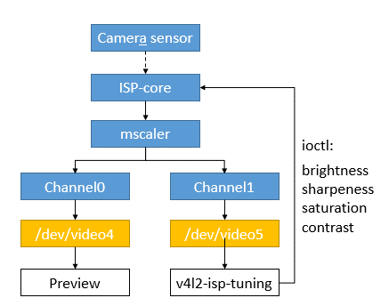

图 3-7君正平台应用v4l2-isp-tunning 软件流程图

### 使用方法

#### 模块编译

hippo工程的根目录，执行如下指令进行模块编译。

```c
make v4l2-isp-tunning

make
```

 模块编译完成后,生成v4l2-isp-tuning，存放在out/product/hippo_xxx/system/usr/bin/目录下。

#### 模块使用

1）配置内核驱动 drivers/media/platform/ingenic-isp/isp-drv.h 文件中宏定义 MSCALER_MAX_CH的值为2，打开msclaer的两个通道，重新编译并启动；

2） 驱动加载成功后会生成mscaler对应的两个通道节点（mscaler0： /dev/video4 /dev/video5 mscaler1：/dev/video8 /dev/video9）；

3） 通过mscaler两个通道节点中的一个（例如/dev/video4）预览图像效果，可使用ffmpeg，mjpeg-streamer等平台工具，或使用用户自定义的预览直播工具；

4) 执行v4l2-isp-tuning操作mscaler两个通道节点中的另一个（例如/dev/video5），调整效果参数，并观察预览图像效果的变化，直至获得满意的效果，命令行及参数示意如下：

```c
v4l2-isp-tuning -w 640 -h 480 -i 5 -s 128 -c 128 -S 128 -b 128
```

参数：

-w 指定图像宽度；

-h 指定图像高度；

-i 指定操作的video节点号；

-s指定锐度，最小值0，最大值255，默认值128；

-c指定对比度，最小值0，最大值255，默认值128；

-S指定饱和度，最小值0，最大值255，默认值128；

-b指定亮度，最小值0，最大值255，默认值128；

1. 用户可仿照v4l2-isp-tuning源码中效果参数配置的方法（标准ioctl），在自定义的应用中将效果参数配置为想要的值。

##  mjpg-streamer

### 功能简介

mjpeg-streamer是一个展示君正双目摄像头的应用

* 源码路径：packages/example/App/mjpg-streamer/mjpg-streamer-experimental

### 使用方法

####  模块编译

hippo工程的根目录，执行如下指令进行编译。

```c
make mjpg-streamer

make
```

 模块编译完成后,生成mjpg-streamer，存放在out/product/hippo_xxx/system/usr/bin/目录下。同时，会生成一些库文件，存放在out/product/hippo_xxx/system/usr/lib/mjpg-streamer目录下。

#### 模块使用

1. 执行如下指令给板子配置网络

```c
ifconfig eth0 192.168.4.49
```

IP需根据自己的情况进行配置，要确保其他设备可以ping通板子

1. 在hippo开发板上执行如下指令开启摄像头的图像采集

```c
mjpg_streamer -i "/usr/lib/mjpg-streamer/input_syncframes.so -r 1280x720" -o "/usr/lib/mjpg-streamer/output_http.so -w /usr/share/mjpg-streamer/www"
```

参数说明：

-i input

-o output

-r 指定图像缩放后的大小

-w 网页输出

1. 使用手机或电脑等设备连接目标板查看图像

启动设备端的浏览器,在网址栏中输入目标板的ip和端口号（8080）

http://192.168.4.49:8080

能够在设备端看到双目摄像头采集的图像，如下图所示。

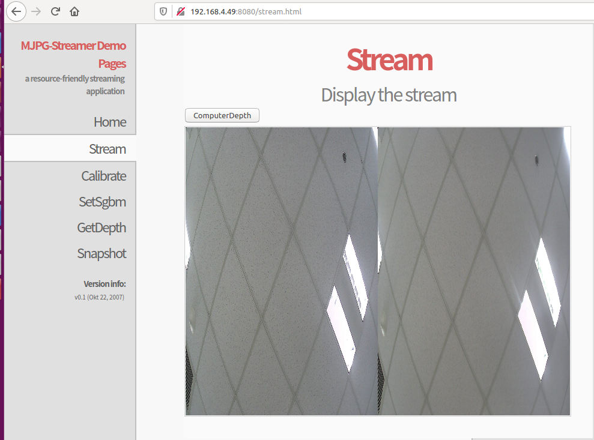

# 向目标文件系统添加和删除应用程序

##  device base.mk 介绍

device_base.mk用于配置工程编译的模块。位于device/hippo（板级）/目录下。其中的宏PRODUCT_MODULES用于添加或删减通用工程编译的模块。在该文件中还有针对不同文件系统和存储介质的默认配置。这些都可以根据自己的需求进行个性化配置。

##  rootfs-overlay文件夹介绍

rootfs-overlay文件夹在device/hippo（板级）/目录下，该文件夹下的文件在编译生成文件系统时，会替换文件系统中的同名文件。从而可以个性化的配置自己的文件系统。

# 向开发板导入和运行应用程序

## 使用adb工具导入应用程序

### 配置adb工具

hippo工程中可以直接配置安装adb工具，方法如下：

1. 进入工程根目录
2. 执行make buildroot-menuconfig
3. 配置Ingenic packages/system config for rootfs/enable adb service,如下图所示。

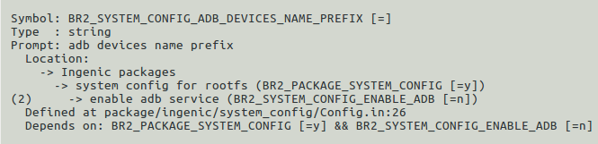

图 5-1 buildroot中配置adb工具的路径

PC端安装adb工具（以Ubuntu16.04为例）：

安装命令为：

sudo apt-get install adb

安装完成后执行adb version 查看adb版本，如果正常显示版本信息说明安装成功。

### adb工具使用

1. 传输文件到板子

adb push 本地路径（pc端要传输到板子上文件的路径） 目标路径（文件存放在板子上的路径）

1. 从板子上下载文件到pc

adb pull 目标路径（文件在板子上的路径） 本地路径（pc端要保存文件的路径）

1. adb常用指令：

表 5-1 adb常用命令


|                            |                    |
| -------------------------- | ------------------ |
| **adb常用命令**            | **说明**           |
| adb help                   | 查看adb的命令帮助  |
| adb devices                | 查看设备           |
| adb shell                  | 进终端             |
| adb kill-server            | 停止服务           |
| adb start-server           | 打开服务           |
| adb push 本地路径 目标路径 | 上传文件到设备     |
| adb pull 目标路径 本地路径 | 从设备下载文件到PC |

## 使用sshd导入应用程序

### 配置sshd工具

1. 进入工程根目录
2. 执行make buildroot-menuconfig
3. 配置Target packages/Networking applications/openssh，如下图所示。

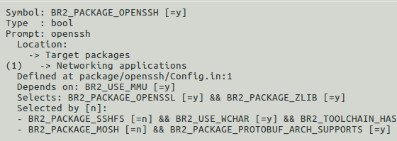

图 5-2 buildroot中配置sshd工具的路径

### sshd工具的使用

使用sshd工具之前，请先确保板子和要通讯的主机是能够相互ping通的。

sshd（secure shell）服务使用ssh协议远程开启其他主机shell的服务。使用时，通过pc打开板子的一个shell服务。登录板子的指令如下。

ssh -X 远程主机用户@远程主机ip

如板子上登录的用户名为root，ip为192.168.4.49，登录的方法为：

```c
ssh -X root@192.168.4.49 
```

登录的密码默认是123456，可以在buildroot中进行设置，方法如下。

1. 进入工程根目录
2. 执行make buildroot-menuconfig
3. 配置System configuration/Enable root login with password/Root password

如下图为成功登录的指令操作。

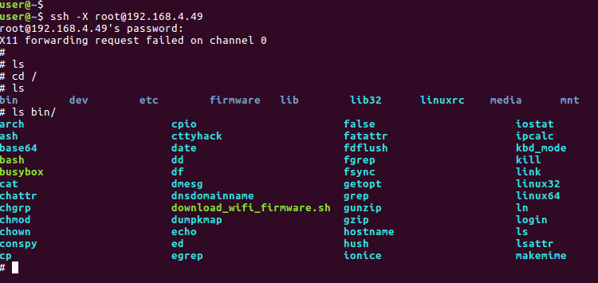

图 5-3使用ssh工具成功登录板子截图

## 使用telnetd导入应用程序

telnetd服务在配置文件中已经进行了添加，无需再进行配置

### telnetd使用方法

使用telnet工具之前，请先确保板子和要通讯的主机是能够相互ping通的。

telnet命令通常用来远程登录。使用的方法如下。

telnet [参数] [主机]

其中可选的参数如下所示。

-8 允许使用8位字符资料，包括输入与输出。

-a 尝试自动登入远端系统。

-b <主机别名>使用别名指定远端主机名称。

-d 启动排错模式。

-E 滤除脱离字符。

-f 此参数的效果和指定“-F”参数相同。

-F 使用Kerberos V5认证时，加上此参数可把本地主机的认证数据上传到远端主机。

-k <域名>使用Kerberos认证时，加上此参数让远端主机采用指定的领域名，而非该主机的域名。

-K 不自动登入远端主机。

-l <用户名称> 指定要登入远端主机的用户名称。

-L 允许输出8位字符资料。

-n <记录文件>指定文件记录相关信息。

-r 使用类似rlogin指令的用户界面。

-x 假设主机有支持数据加密的功能，就使用它。

如登录用户名为root，ip为192.168.4.49的主机时执行如下操作

telnet 192.168.4.49

然后按照提示输入用户名和密码即可。

## 使用tftp导入应用程序

### 配置tftp工具

1. 进入工程根目录
2. 执行make buildroot-menuconfig
3. 然后配置Target package/Networking applications/dnsmasq/tftp support，配置如下图：


图 5-5 buildroot中配置tftp工具的路径

###  tftp工具使用

使用tftp工具之前，请先确保板子和要通讯的主机是能够相互ping通的。

**1. 下载文件**

板子作为client端，使用下面的命令下载文件到板子中

tftp –g –l 目标文件名 –r 源文件名 服务器地址

如想要把服务器端的一个文件名为A.txt的文件下载到板子端，并将新下载的文件重命名为B.txt，使用如下指令。

```c
tftp –g –l B.txt –r A.txt 192.168.4.50
```

**2. 上传文件**

从板子（clinet）上传文件到Server时，使用下面的命令

tftp –p –r 目标文件名 -l 源文件名 服务器地址

如从板子上传文件C.txt到Server的tftp根目标下，并更名为D.txt使用如下指令

tftp –p –r D.txt –l C.txt 192.168.4.50

1. 参数说明

-l local的缩写，后跟存在于Client的源文件名，或下载Client后重命名的文件名；

-r remote的缩写，后跟Server即PC机tftp服务器根目录中的源文件名，或上传Server后重命名后的文件名；

-g get的缩写，下载文件时用；

-p put的缩写，上传文件时用。

## 使用lrzsz导入应用程序

### 配置lrzsz工具

1. 进入工程根目录
2. 执行make buildroot-menuconfig
3. 然后配置Target package/Networking applications/lrzsz，配置如下图：


图 5-6 buildroot中配置lrzsz工具的路径

### 使用lrzsz工具（minicom）

1. sz命令（发送文件）

eg：sz filename(传输的文件默认再打开minicom的路径下面)


图 5-7 使用lrzsz工具发送文件截图

1. rz命令（接收文件）
* 首先输入rz：


图 5-8 lrzsz工具的rz命令

* 按ctrl+A+Z，再按下S（Send file）

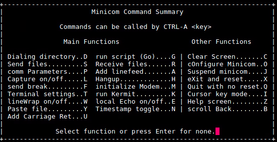

图 5-9使用lrzsz工具时minicom的配置截图

* 选择zmodem,进入文件选择界面


图 5-10使用lrzsz工具时文件选择页面截图 

* 上下键或者PageUp/PageDown移动，空格选择文件

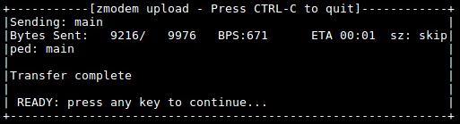

图 5-11使用lrzsz工具时选择文件截图

注：更详细的操作参数，请使用 （--help）查看。

# 平台编译规则介绍（通用）

平台编译不同的模块需要包含不同的核心宏，类似于要使用printf函数，需要包含stdio.h头文件。添加不同的模块要使用的核心宏不同，下面介绍了几种不同类型模块的编译方法。

## 创建平台应用程序

### 编译核心宏

表 6-1 平台应用核心编译宏


|                      |                       |
| -------------------- | --------------------- |
| **编译核心宏**       | **说明**              |
| BUILD_EXECUTABLE     | 编译生成可执行bin文件 |
| BUILD_SHARED_LIBRARY | 编译生成动态库        |
| BUILD_STATIC_LIBRARY | 编译生成静态库        |

### 常用的编译接口宏

接口宏用于配置编译的参数，常用的接口宏如下表所示。

表 6-2 平台应用接口宏


|                        |                                                                                |
| ---------------------- | ------------------------------------------------------------------------------ |
| **接口宏**             | **说明**                                                                       |
| LOCAL_MODULE           | 模块名                                                                         |
| LOCAL_MODULE_TAGS      | 模块所属开发模式                                                               |
| LOCAL_SRC_FILES        | 源文件                                                                         |
| LOCAL_LDLIBS           | 链接参数                                                                       |
| LOCAL_CFLAGS           | C编译参数                                                                      |
| LOCAL_CPPFLAGS         | CPP编译参数                                                                    |
| LOCAL_C_INCLUDES       | 编译所需头文件                                                                 |
| LOCAL_MODULE_PATH      | 指定目标文件的copy路径，不定义此宏目标文件copy到默认路径下                     |
| LOCAL_SHARED_LIBRARIES | 本模块编译所依赖的其他动态库，此动态库为工程中其他模块产生。                   |
| LOCAL_STATIC_LIBRARIES | 本模块编译所依赖的其他静态库，此静态库为工程中其他模块产生                     |
| LOCAL_DEPANNER_MODULES | 本模块的编译依赖的其他模块（生成的库，头文件等），此处为所依赖模块的module名。 |

### 编译示例

1. 可执行bin文件
2. 本示例为工程packages/example/App/cimutils/Build.mk
```c
LOCAL_PATH := $(my-dir)

# build cimutils

include $(CLEAR_VARS)

LOCAL_MODULE=cimutils

LOCAL_MODULE_TAGS:= optional

 

LOCAL_SRC_FILES:= main.c \

 convert_soft.c \

 process_picture/saveraw.c \

 process_picture/savebmp.c \

 process_picture/savejpeg.c \

 lcd/framebuffer.c \

 v4l2/v4l2.c \

 v4l2enc/v4l2_jpegenc.c \

 cim/cim_fmt.c \

 cim/video.c \

 cim/process.c \

 cim/convert.c

 

LOCAL_LDLIBS := -lc -lstdc++ -ljpeg

LOCAL_C_INCLUDES:= include

LOCAL_DEPANNER_MODULES := CameraDemo.sh

include $(BUILD_EXECUTABLE)
```

1. 2）生成动态库
2. 本示例为工程external/tinyalsa/Build.mk
```c
LOCAL_PATH := $(my-dir)

include $(CLEAR_VARS)

 

LOCAL_MODULE := libtinyalsa

LOCAL_MODULE_TAGS :=optional

LOCAL_SRC_FILES := pcm.c \

 mixer.c LOCAL_EXPORT_C_INCLUDE_FILES:=include/tinyalsa/asoundlib.h

LOCAL_CFLAGS := -Wa,-mips32r2 -O2 -G 0 -Wall -fPIC -shared

 

include $(BUILD_SHARED_LIBRARY)
```

1. 注：➀静态库和动态库的路径默认存放在system的usr/lib下（system中的静态库是从sysroot目录下的静态库生成的，sysroot中的静态库未经过strip），可执行程序默认存放在system的usr/bin 下。
2. 其他的参见工程下build/core/envsetup.mk文件或者上述的out目录介绍。

## 导入第三方应用程序

在添加第三方模块时，首先要确保模块能够正常编译通过，再添加到platform上，在添加放置第三方功能模块时，建议放置到external目录下，并参照external目录下各个的Build.mk文件编写所添模块的Build.mk文件，对所添模块进行指导性编译。

### 第三方应用程序核心宏

表 6-3 第三方应用核心宏


|                 |                |
| --------------- | -------------- |
| **编译核心宏**  | **说明**       |
| BUILD_THIRDPART | 编译第三方模块 |

### 第三方应用常用接口宏

接口宏用于配置编译的参数，常用的接口宏如下表所示。

表 6-4 第三方应用接口宏


|                                |                                                                              |
| ------------------------------ | ---------------------------------------------------------------------------- |
| **接口宏**                     | **说明**                                                                     |
| LOCAL_MODULE                   | 模块名                                                                       |
| LOCAL_MODULE_TAGS              | 模块所属开发模式                                                             |
| LOCAL_MODULE_GEN_BINRARY_FILES | 模块产生的可执行程序（需含路径）                                             |
| LOCAL_MODULE_GEN_STATIC_FILES  | 模块产生的静态库文件 （含路径）                                              |
| LOCAL_MODULE_GEN_SHARED_FILES  | 模块产生的动态库文件 （含路径）                                              |
| LOCAL_MODULE_PATH              | 指定目标文件的copy路径，不定义此宏目标文件将copy到默认路径下                 |
| LOCAL_MODULE_CONFIG_FILES      | 模块配置后生成的文件                                                         |
| LOCAL_MODULE_CONFIG            | 模块的配置方法                                                               |
| LOCAL_MODULE_COMPILE           | 模块的编译方法                                                               |
| LOCAL_MODULE_COMPILE_CLEAN     | 模块的clean方法                                                              |
| LOCAL_EXPORT_C_INCLUDE_FILES   | 模块对外导出的文件，所导出文件被其他模块使用                                 |
| LOCAL_EXPORT_C_INCLUDE_DIRS    | 模块对外导出的目录，所导出目录下的文件被其他模块使用                         |
| LOCAL_DEPANNER_MODULES         | 本模块的编译依赖的其他模块（生成的库，头文件等），此处为所依赖模块的module名 |

### 编译示例

1. 本示例为工程packages/example/App/linphone-desktop/Build.mk
```c
LOCAL_PATH := $(my-dir)

include $(CLEAR_VARS)

 

LOCAL_MODULE=linphone-desktop

LOCAL_DEPANNER_MODULES:=isp

LOCAL_MODULE_TAGS:=optional

LOCAL_MODULE_GEN_BINRARY_FILES=OUTPUT/no-ui/bin/linphonec

LOCAL_MODULE_GEN_SHARED_FILES=OUTPUT/no-ui/lib/libavcodec.so 

 OUTPUT/no-ui/lib/libavcodec.so.53 \

 ......

 OUTPUT/no-ui/lib/libxml2.so.2

LOCAL_MODULE_CONFIG_FILES:= Makefile

LOCAL_MODULE_CONFIG:=./prepare.py \

 -L -dv \ 

......

 -DENABLE_INGENIC_VIDEOOUT=ON 

LOCAL_MODULE_COMPILE=make -j$(MAKE_JLEVEL); mkdir -p $(TOP_DIR)/$(LOCAL_PATH)/OUTPUT/no-ui/data/linphone

LOCAL_MODULE_COMPILE_CLEAN=./prepare.py -c

include $(BUILD_THIRDPART)
```
## 添加用于拷贝文件的模块

在开发过程中经常需要将一些库和头文件不加任何修改的从一个路径下copy到另外一个目标路径下，为此平台编译系统添加了prebuild机制。

### 编译核心宏

表 6-5 拷贝模块核心宏


|                  |                  |
| ---------------- | ---------------- |
| **编译核心宏**   | **说明**         |
| BUILD_PREBUILT   | 一次copy一个文件 |
| BUILD_MULTI_COPY | 一次copy多个文件 |

### 常用接口宏

接口宏用于配置编译的参数，常用的接口宏如下表所示。

表 6-6 拷贝模块接口宏


|                    |                                   |
| ------------------ | --------------------------------- |
| **接口宏**         | **说明**                          |
| LOCAL_MODULE       | 模块名                            |
| LOCAL_MODULE_TAGS  | 模块所属开发模式                  |
| LOCAL_MODULE_CLASS | 模块所属哪种prebuild模式DIR/FILES |
| LOCAL_MODULE_PATH  | 文件（夹）copy的目标路径          |
| LOCAL_COPY_FILES   | 源文件                            |
| LOCAL_MODULE_DIR   | 源文件夹                          |

### 编译示例

1. 复制单个文件

本示例为工程packages/example/App/cimutils/Build.mk
```c
# copy the LOCAL_SRC_FILES

include $(CLEAR_VARS)

LOCAL_MODULE := CameraDemo.sh

LOCAL_MODULE_TAGS := optional

LOCAL_MODULE_PATH := $(TARGET_FS_BUILD)/$(TARGET_TESTSUIT_DIR)/CameraDemo 

LOCAL_COPY_FILES := CameraDemo.sh:CameraDemo.sh

include $(BUILD_PREBUILT)
```
 其中宏LOCAL_COPY_FILES := CameraDemo.sh:CameraDemo.sh,使用“:”分割，前面为拷贝后的名字（可包含路径，且必须有目标文件名），后面为本地的文件名（包含路径）

1. 复制多个文件

本示例为工程external/android/include/Build.mk
```c
LOCAL_PATH := $(my-dir)

# copy include

include $(CLEAR_VARS)

LOCAL_MODULE := android-include

LOCAL_MODULE_TAGS :=optional

LOCAL_MODULE_PATH :=$(OUT_DEVICE_INCLUDE_DIR)

LOCAL_MODULE_CLASS := DIR

LOCAL_MODULE_DIR := android-include 

 

include $(BUILD_MULTI_COPY)
```
## 通过命令自动生成模块

创建好模块目录以后，在该目录下运行autotouchmk，然后选择所要添加的模块类型（包括可执行模块、第三方模块、复制模块、静态库模块、动态库模块）。

运行autotouchmk命令以后，会有以下提示：
```c
This command is used to generate the commonly used template, specific content need to edit

***************************************************

Please select device target type you want to build

A:execute 

B:thirdpart 

C:static library 

D:shared library 

E:prebuilt 

F:multi copy 
```
可执行模块：输入A；第三方模块：输入B；静态库模块：输入C；动态库模块：输入D；复制模块：输入E；多项复制模块：输入F；

然后会在当前目录下生成一个Build.mk文件，自动生成的Build.mk会将基本会用的宏都列出来，根据需要对其中的宏进行赋值，不需要的可以不进行修改。自动生成的Build.mk文件对于大多数宏都是没有赋值的，需要用户根据自己的需要进行赋值。

### 生成复制模块示例

在需要创建编译模块的目录下执行autotouchmk，然后会有如下的提示信息。
```c
This command is used to generate the commonly used template, specific content need to edit

***************************************************

Please select device target type you want to build

 A:execute 

 B:thirdpart 

 C:static library 

 D:shared library 

 E:prebuilt 

 F:multi copy 

Input module :E
```
我们选择E选项，创建复制模块，生成的内容如下。
```c
LOCAL_PATH := $(my-dir)

include $(CLEAR_VARS) 

LOCAL_MODULE = #name of the module:

LOCAL_MODULE_TAGS := optional #Development mode of module ,userdebug,eng,optional

LOCAL_MODULE_PATH := $(TARGET_FS_BUILD)/ #which directory the target file copy 

LOCAL_MODULE_CLASS:=

LOCAL_MODULE_DIR := #src module dir

LOCAL_COPY_FILES :=

include $(BUILD_PREBUILT)
```
## 文件系统覆盖rootfs-overlay

hippo平台提供一个rootfs-overlay机制用于修改生成文件系统中的内容。rootfs-overlay是一个文件夹，该文件夹位于device/（hippo）板级/目录下。当该文件夹下存在与文件系统中相同文件名的文件时，会用当前目录下的文件替换文件系统中的文件。

## 制作根文件系统

hippo平台支持多种类型文件系统的制作，可以通过配置文件系统的参数，制作不同的文件系统，下面是几个具体的文件系统制作方法。

### jffs2 文件系统制作

1. 进入hippo工程
2. 执行make buildroot-menuconfig
3. 配置Filesystem images/jffs2 root filesystem/

如下图所示为jffs2文件系统的参考配置。


图 6-1 jffs2文件系统的参考配置

配置完成后，在工程目录中执行make指令进行编译，编译生成的文件会存放在out/product/hippo_xxx/image/目录下。

### ubifs 文件系统制作

1. 进入hippo工程
2. 执行make buildroot-menuconfig
3. 配置Filesystem images/ubifs root filesystem/

如下图所示为ubifs 文件系统的参考配置。


图 6-2 ubifs 文件系统的参考配置

配置完成后，在工程目录中执行make指令进行编译，编译生成的文件会存放在out/product/hippo_xxx/image/目录下。

### ext4文件系统制作

1. 进入hippo工程
2. 执行make buildroot-menuconfig
3. 配置Filesystem images/ext2/3/4 root filesystem/

如下为ext4文件系统的参考配置。

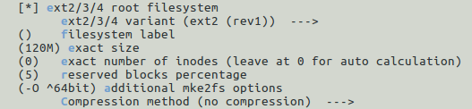

图 6-3 ext4文件系统的参考配置

配置完成后，在工程目录中执行make指令进行编译，编译生成的文件会存放在out/product/hippo_xxx/image/目录下。

# 应用程序debug

##  使用gdb 命令行工具进行debug

### gdb工具配置

1. 进入hippo工程
2. 执行make buildroot-menuconfig
3. 配置Target packages/Debugging, profiling and benchmark/gdb，如下图所示。

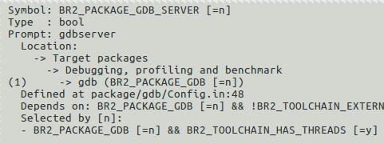

图 7-1 buildroot中gdb配置路径

### gdb本地调试

使用gdb调试，在可执行程序编译时，需要加-g选项。然后执行下面的指令进入gdb调试模式。

gdb 可执行文件名。

调试的界面如下图所示。


图 7-2 gdb本地调试界面

###  gdbserver + gdb远程调试

在很多情况下，需要对一个应用程序进行反复调试，特别是复杂的程序。采用GDB方法调试，由于嵌入式系统资源有限性，一般不能直接在目标系统上进行调试，通常采用gdb+gdbserver的方式进行调试。gdbserver在目标系统中运行，gdb则在宿主机上运行。

#### gdbserver的安装

gdbserver可以使用源码编译产生，hippo中提供了gdb的源码。在buildroot/dl/gdb/目录下。

hippo中也提供了编译完成了gdbserver，用户只需将该gdbserver文件拷贝到板子中即可，其路径如下：

prebuilts/toolchains/mips-gcc720-glibc226/mips-linux-gnu/libc/mfp64/usr/bin/gdbserver

####  gdbserver + gdb调试方法

在目标板上执行如下指令：

gdbserver 宿主机IP:端口号 要调试的可执行程序

其中端口号可自由设置。

在宿主机上执行如下指令：

mips-linux-gnu-gdb 要调试的可执行程序

然后会进入gdb调试界面，接着执行指令

target remote 目标板IP:端口号

其中的可执行程序需和目标板上运行的相同，端口号也必须相同。

如下图为使用gdbserver + gdb方式调试的调试过程截图


图 7-3 目标板执行指令后等待连接

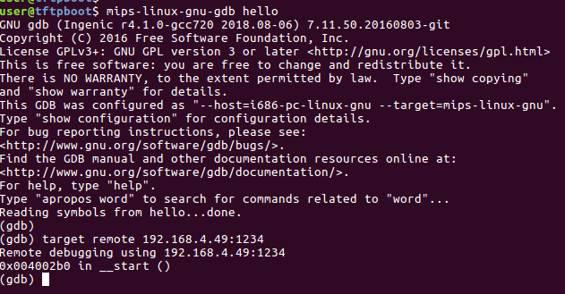

图 7-4 宿主机进入gdb调试界面并连接目标板


图 7-5 目标板与宿主机成功建立连接


图 7-6 宿主机进行调试

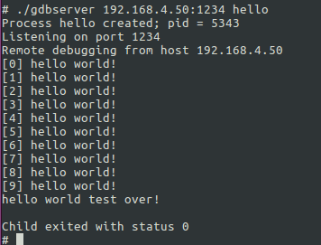

图 7-7 目标板打印调试信息

### gdb调试使用命令

1. 运行命令

run：简记为 r ，其作用是运行程序，当遇到断点后，程序会在断点处停止运行，等待用户输入下一步的命令。

continue （简写c ）：继续执行，到下一个断点处（或运行结束）

next：（简写 n），单步跟踪程序，当遇到函数调用时，也不进入此函数体；此命令同 step 的主要区别是，step 遇到用户自定义的函数，将步进到函数中去运行，而 next 则直接调用函数，不会进入到函数体内。

step （简写s）：单步调试如果有函数调用，则进入函数；与命令n不同，n是不进入调用的函数的

until：当你厌倦了在一个循环体内单步跟踪时，这个命令可以运行程序直到退出循环体。

until+行号： 运行至某行，不仅仅用来跳出循环

finish： 运行程序，直到当前函数完成返回，并打印函数返回时的堆栈地址和返回值及参数值等信息。

call 函数(参数)：调用程序中可见的函数，并传递“参数”，如：call gdb_test(55)

quit：简记为 q ，退出gdb

1. 设置断点

break n （简写b n）:在第n行处设置断点

b fn1 if a＞b：条件断点设置

break func（break缩写为b）：在函数func()的入口处设置断点

delete 断点号n：删除第n个断点

disable 断点号n：暂停第n个断点

enable 断点号n：开启第n个断点

clear 行号n：清除第n行的断点

info b （info breakpoints） ：显示当前程序的断点设置情况

delete breakpoints：清除所有断点

1. 查看源码

list ：简记为l，其作用是列出程序的源代码，默认每次显示10行。

list 行号：将显示当前文件以“行号”为中心的前后10行代码

list 函数名：将显示“函数名”所在函数的源代码，如：list main

list ：不带参数，将接着上一次 list 命令的，输出下边的内容。

1. 打印表达式

print 表达式：简记为p，其中“表达式”可以是任何当前正在被测试程序的有效表达式，比如当前正在调试C语言的程序，那么“表达式”可以是任何C语言的有效表达式，包括数字，变量甚至是函数调用。

print a：将显示整数 a 的值

print ++a：将把 a 中的值加1,并显示出来

print name：将显示字符串 name 的值

print gdb_test(22)：将以整数22作为参数调用 gdb_test() 函数

print gdb_test(a)：将以变量 a 作为参数调用 gdb_test() 函数

display 表达式：在单步运行时将非常有用，使用display命令设置一个表达式后，它将在每次单步进行指令后，紧接着输出被设置的表达式及值。如： display a

watch 表达式：设置一个监视点，一旦被监视的“表达式”的值改变，gdb将强行终止正在被调试的程序。如： watch a

whatis ：查询变量或函数

info function： 查询函数

扩展info locals： 显示当前堆栈页的所有变量

1. 查看运行信息

where/bt ：当前运行的堆栈列表；

bt backtrace 显示当前调用堆栈

up/down 改变堆栈显示的深度

set args 参数:指定运行时的参数

show args：查看设置好的参数

info program：查看程序的是否在运行，进程号，被暂停的原因。

1. 分割窗口

layout：用于分割窗口，可以一边查看代码，一边测试

layout src：显示源代码窗口

layout asm：显示反汇编窗口

layout regs：显示源代码/反汇编和CPU寄存器窗口

layout split：显示源代码和反汇编窗口

Ctrl + L：刷新窗口

##  使用vscode集成开发环境进行debug

### vccode安装及使用

VScode官方安装包下载: [https://code.visualstudio.com/Download]

VScode官方安装参考文档:[https://code.visualstudio.com/docs/setup/linux]

VScode官方调试使用参考文档:[https://code.visualstudio.com/docs/cpp/cpp-debug]

VScode官方调试配置参考文档： [https://code.visualstudio.com/docs/cpp/launch-json-reference]

### 调试环境搭建及工程编译

在hippo工程顶层目录下，可通过以下命令进行工程交叉调试配置

make <ProjectName>-vscode PRO=<ProjectName>

其中的<ProjectName>可以是任意名字，为了方便记忆一般以板级名字作为ProjectName

命令执行完成后会在当前目录先生成一个<ProjectName>.code-workspace。

进入工程目录后执行以下命令进入工作区（执行命令前请确认已经成功安装了vscode）

code <ProjectName>.code-workspace

命令执行完毕将会进入vscode可视化调试阶段。

在需要编译的源文件界面上，点击左上方绿色“△”图案，或点击菜单栏的Run选择其中的StartDebugging可进行文件的编译并调试。如下图所示。

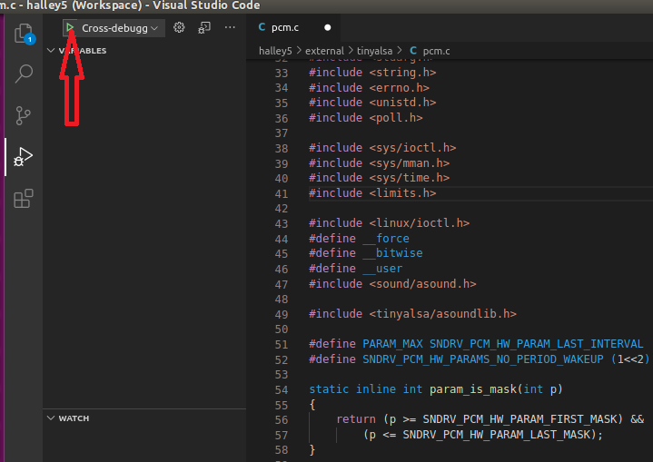

图 7-8 vscode界面截图

在hippo软件工程顶层目录下，可通过以下命令进行工程配置信息清除

make <ProjectName>-clean PRO=<ProjectName>

### 开始调试

F5启动调试，可以通过F9设断点，F11单步等来调试程序。

