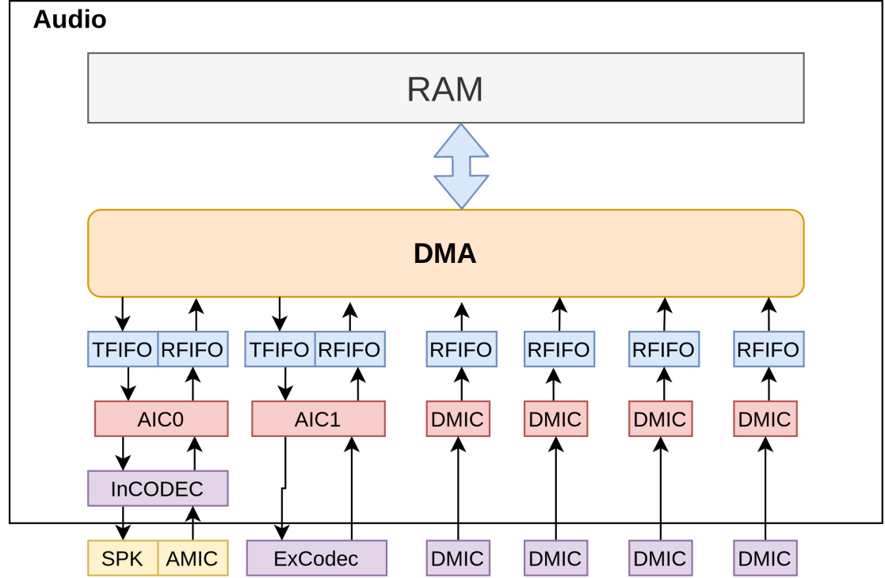
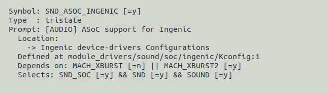
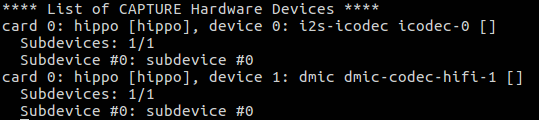

# Audio 音频子系统

## 模块功能介绍

图 5‑1 音频子系统硬件模块

## 驱动源码位置

audio控制器源码位置：

***module_drivers/sound/soc/ingenic/as-v1***

板级源码位置：

***module_drivers/sound/soc/ingenic/board/***

内部codec源码位置：

***module_drivers/sound/soc/ingenic/icodec/***

## 设备树配置

设备树所在位置

module_drivers/dts/x2500.dtsi

设备树描述：

***aic: aic@0x10020000 {***

 ***compatible = "ingenic,x2500-aic";***

 ***reg = <0x10020000 0x100>;***

 ***interrupt-parent = <&core_intc>;***

 ***interrupts = <IRQ_AIC0>;***

 ***dmas = <&pdma INGENIC_DMA_TYPE(INGENIC_DMA_REQ_I2S_TX)>,***

 ***<&pdma INGENIC_DMA_TYPE(INGENIC_DMA_REQ_I2S_RX)>;***

 ***dma-names = "tx", "rx";***

 ***i2s: i2s {***

 ***compatible = "ingenic,x2500-i2s";***

 ***status = "ok";***

 ***};***

***i2s_tloop: i2s_tloop {***

 ***compatible = "ingenic,i2s-tloop";***

 ***dmas = <&pdma INGENIC_DMA_TYPE(INGENIC_DMA_REQ_AIC_LOOP_RX)>;***

 ***dma-names = "rx";***

 ***status = "ok";***

 ***};***

 ***};***

 ***dmic: dmic@0x10034000 {***

 ***compatible = "ingenic,dmic";***

 ***reg = <0x10034000 0x100>;***

 ***interrupt-parent = <&core_intc>;***

 ***interrupts = <IRQ_DMIC>;***

 ***dmas = <&pdma INGENIC_DMA_TYPE(INGENIC_DMA_REQ_DMIC_RX)>;***

 ***dma-names = "rx";***

 ***pinctrl-0 = <&dmic0_pc>;***

 ***pinctrl-names = "default";***

 ***status = "ok";***

 ***};***

 ***icodec: icodec@0x10020000 {***

 ***compatible = "ingenic,icodec";***

 ***reg = <0x10021000 0x140>;***

 ***status = "okay";***

 ***};***

 ***};***

### 设备树默认配置

设备树默认编译会产生audio设备，并在module_drivers/dts/hippo_v12.dts下配置：

***sound_hippo_icdc {***

 ***status = "ok";***

 ***compatible = "ingenic,x2500-sound";***

 ***ingenic,model = "hippo";***

 ***ingenic,dai-link = "i2s-icodec", "dmic", "i2s-tloop";***

 ***ingenic,stream = "i2s-icodec", "dmic", "i2s-tloop";***

 ***ingenic,cpu-dai = <&i2s>, <&dmic>, <&i2s_tloop>;***

 ***ingenic,platform = <&aic>, <&dmic>, <&i2s_tloop>;***

 ***ingenic,codec = <&icodec>, <&dmic>, <&dump_pcm_codec>;***

 ***ingenic,codec-dai = "icodec", "dmic-codec-hifi", "pcm-dump";***

 ***ingenic,audio-routing = "Speaker", "HPOUTL", "DACL", "MICBIAS" ,***

 ***"ADCL", "MICL",***

 ***"ADCR", "MICR";***

 ***ingenic,spken-gpio = <&gpb 22 GPIO_ACTIVE_HIGH INGENIC_GPIO_NOBIAS>;***

 ***};***

### 设备树自定义配置

用户可根据实际需求关闭audio设备,或配置ingenic，spken-gpio属性。

## 内核编译配置

内核配置SND_ASOC_INGENIC_AIC，配置如下：

## 设备节点生成

驱动加载成功后生成以下节点：

***/dev/snd/controlC0***

***/dev/snd/pcmC0D0c***

***/dev/snd/pcmC0D0p***

***/dev/snd/pcmC0D1c***

***/dev/snd/pcmC0D2c***

***/dev/snd/timer***

默认驱动加载了内部codec、DMIC和i2s-tloop。

## 添加新的codec驱动

在需要添加新的codec驱动时，用户可以参考“module_drivers/sound/soc/ingenic/ecodec”下的驱动来编写自己的驱动代码，在使用的新的codec驱动代码时，需要修改dts的以下内容：

 ***sound_hippo_icdc {***

 ***status = "ok";***

 ***compatible = "ingenic,x2500-sound";***

 ***ingenic,model = "hippo_v12";***

 ***ingenic,dai-link = "i2s-icodec", "dmic", "i2s-tloop";***

 ***ingenic,stream = "i2s-icodec", "dmic", "i2s-tloop";***

 ***ingenic,cpu-dai = <&i2s>, <&dmic>, <&i2s_tloop>;***

 ***ingenic,platform = <&aic>, <&dmic>, <&i2s_tloop>;***

 ***ingenic,codec = <&icodec>, <&dmic>, <&dump_pcm_codec>;***

 ***ingenic,codec-dai = "icodec", "dmic-codec-hifi", "pcm-dump";***

 ***ingenic,audio-routing = "Speaker", "HPOUTL", "DACL", "MICBIAS" ,***

 ***"ADCL", "MICL",***

 ***"ADCR", "MICR";***

 ***ingenic,spken-gpio = <&gpb 22 GPIO_ACTIVE_HIGH INGENIC_GPIO_NOBIAS>;***

 ***};***

用户需要将“ingenic，codec”和“ingenic，codec-dai”中的内容进行修改。

## 应用程序使用说明

X2500音频驱动是在Linux内核标准音频框架ALSA下开发的，应用程序可直接使用alsa-lib完成开发；下面示例以alsa-utils工具来进行录放音功能测试。

### asound.conf介绍

asound.conf配置文件，是alsa-lib的默认配置文件，路径在 /etc/，可以用来配置alsa库的一些附加功能。这个文件不是alsa库运行时所必须的，没有它alsa库也可以正常运行。asound.conf允许对声卡或者设备进行更高级的控制，提供访问alsa-lib中的pcm插件方法，允许你做更多的复杂的控制，比如可以把声卡组合成一个或者多声卡访问多个I/O。

在ALSA中，PCM插件扩展了PCM设备的功能和特性。插件可以自动处理诸如：命名设备、采样率转换、通道间的采样复制、写入文件、为多个输入/输出连接声卡/设备（不同步采样）、使用多通道声卡/设备等工作。

#### hw插件

此插件直接与ALSA内核驱动程序通信，它是一种没有任何转换的原始通信。

通过此插件可以对pcm设备进行重命名操作。

例如：

***arecord -l***

******* List of CAPTURE Hardware Devices *******

***card 0: halley6 [halley6], device 0: i2s-ecodec dump_pcm_codec-0 []***

 ***Subdevices: 1/1***

 ***Subdevice #0: subdevice #0***

***card 0: halley6 [halley6], device 1: i2s-tloop dump_pcm_codec-1 []***

 ***Subdevices: 1/1***

 ***Subdevice #0: subdevice #0***

***# aplay -l***

******* List of PLAYBACK Hardware Devices *******

***card 0: halley6 [halley6], device 0: i2s-ecodec dump_pcm_codec-0 []***

 ***Subdevices: 1/1***

 ***Subdevice #0: subdevice #0***

在使用arecord或者aplay进行录放音时，在指定设备时一般使用“hw：0，0”这种方法指定录放音所使用的设备，使用起来不够直观，可以通过hw插件对设备定义别名。例如：

***pcm.amic {***

 ***type hw***

 ***card 0***

 ***device 0***

***}***

此例子中将“hw：0，0”进行了重命名操作，在录放音时可以使用以下方式：

***arecord -D amic-c 2 -f S16_LE -r 16000 -d 5 baic0_16000-32-1.wav***

***aplay -D amic baic0_16000-32-1.wav***

####  slave插件

从属插件可以直接用字符串指定，也可以在一个复合配置节点内输入定义。还可以指定一些限制（如静态速率或通道数）。

例如：

***pcm_slave.slave_rate48000Hz {***

 ***pcm "hw:0,0"***

 ***rate 48000***

***}***

***pcm.rate48000Hz {***

 ***type plug***

 ***slave slave_rate48000Hz***

***}***

或者

***pcm.rate48000Hz {***

 ***type plug***

 ***slave {***

 ***pcm "hw:0,0"***

 ***rate 48000***

 ***}***

***}***

上述例子可以理解为：定义了一个虚拟的pcm设备命名为rate48000Hz，该设备实际使用“hw：0,0”pcm设备且设定只支持48000Hz采样率。在使用rate48000Hz该pcm设备录放音时，硬件上仅支持48000采样率，也可以设置固定的格式位、宽通道数等。

####  rate插件

该插件转换速率。输入和输出格式必须是线性的，常用于播放硬件不支持采样率数据位宽的音频文件。

例如：

***pcm.rate_16000 {*** 

 ***type rate*** 

 ***slave {*** 

 ***pcm "hw:0,0"*** 

 ***rate 16000*** 

 ***format S8*** 

 ***}*** 

 ***}*** 

该插件支持采样率和采样格式位宽的转换，不支持通道的转换。

####  plug插件

该插件可根据要求转换通道，速率和格式，比rate插件多了通道转换的功能。

例如：

***pcm.rate_48000 {*** 

 ***type plug*** 

 ***slave {*** 

 ***pcm "hw:0,0"*** 

 ***rate 16000*** 

 ***format S8*** 

 ***channels 1*** 

 ***}*** 

 ***}*** 

####  Soft Volume

此插件应用于软件音量的调整。

例如：

***pcm.amic_record {*** 

 ***type softvol*** 

 ***slave {*** 

 ***pcm "hw:0,0"*** 

 ***}*** 

 ***control {*** 

 ***name "amic volume"***

 ***}*** 

 ***min_dB -51.0*** 

 ***max_dB 30.0*** 

***}*** 

在第一次使用 softvol 插件进行播放时才会生成对应的控件，即调音时需要先执行一次“arecord -D amic_record”（以上述定义为例），才可以通过amixer设置调整音量。

### tloop用法

tloop即放音回采功能，该功能是将放音的数据直接进行回采，具体操作为：

首先需要正常的放音和录音，然后对放音的数据进行回采:

***aplay -D i2s_play 16000-16-1.wav &***

***arecord -D i2s_record -f S16_LE -r 16000 - c 1 xxxxx.wav &***

***arecord -D i2s_tloop -f S16_LE -r 16000 -c 1 xxxxx.wav &***

注意事项：

1.正常录音和回采录音必须使用单声道

2.正常录音和回采录音必须采用相同的采样率和采样位数

### 录音

#### dmic录音

录音前确认dmic的设备号：

arecord -l

dmic录音命令：

arecord -D hw:0,1 -d 15 -f cd -r 44100 -c 2 -t wav record.wav

#### 调整dmic录音增益

增益范围：0~31

***amixer cset name='DMIC GAIN' 12*** 

####  amic录音

录音前确认amic的设备号：

arecord -l

这里的amic是直接和内部codec相连的

amic录音命令：

arecord -D hw:0,0 -d 15 -f cd -r 44100 -c 2 -t wav record.wav

#### 调整amic录音增益

高通滤波器打开：

amixer cset name='MIC HPF SWITCH' on

高通滤波器关闭：

amixer cset name='MIC HPF SWITCH' off

左声道录音增益调整：

amixer cset name='ALCL GAIN' x (x= 0--31)

右声道录音增益调整：

amixer cset name='ALCR GAIN' x (x= 0--31)

### 内部Codec放音

放音直接使用aplay即可放音，示例：

aplay test.wav

调整放音增益：

amixer cset name='HPOUTL AGAIN' x （x= 0--31）

