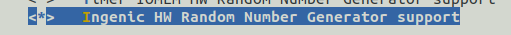

# DTRNG模块驱动接口

## 模块功能介绍

真随机数发生器，用于在加解密场景提供真随机数的功能

## 驱动源码位置

驱动源码所在位置：

module_drivers/drivers/char/hw_random/ingenic-rng.c

## 设备树配置

设备树所在位置：

module_drivers/dts/x2500.dtsi

设备树描述：

dtrng: dtrng@0x10072000 {

 compatible = "ingenic,dtrng";

 reg = <0x10072000 0x100>;

 interrupt-parent = <&core_intc>;

 interrupts = <IRQ_DTRNG>;

 status = "disabled";

};

### 设备树默认配置

默认编译会产生dtrng设备，用户可在hippo_v12板级设备树中进行修改。

&dtrng {

 status = "okay";

};

## 内核编译配置

内核配置HW_RANDOM_INGENIC，配置说明如下：

Symbol: HW_RANDOM_INGENIC [=y] 

Type : tristate 

Prompt: Ingenic HW Random Number Generator support 

 Location: 

 -> Device Drivers 

 -> Character devices 

(1) -> Hardware Random Number Generator Core support (HW_RANDOM [=y])

Prompt: [RANDOM] Ingenic HW Random Number Generator support 

 Location: 

 -> Ingenic device-drivers Configurations 

(2) -> [RANDOM] drivers 

 Defined at drivers/char/hw_random/Kconfig:384 

 Depends on: HW_RANDOM [=y] && MIPS [=y] 

###  内核默认编译配置

内核默认未配置DTRNG驱动。

###  内核自定义编译配置

用户可根据实际需求配置DTRNG驱动，配置界面如下：

## 设备节点生成

当驱动加载成功后，会生成/dev/hwrng, 用户可以根据此节点判断驱动是否成功加载。

## 应用程序使用说明

可以通过以下应用程序，测试随机数。
```c

#include<stdio.h>

#include<stdlib.h>

#include<linux/watchdog.h>

#include<sys/ioctl.h>

#include<sys/types.h>

#include<fcntl.h>

#include<unistd.h>

#include<errno.h>

int main(int argc, char *argv[])

{

        int fd ,retval;

        char buf[64] = {0};

        int cmd = 0;

        if (!argv[1])

        {

                printf("argv[1] is NULL \n");

                exit(errno);

        }

        fd = open(argv[1],O_RDONLY);

        if(fd < 0)

        {

                printf("open %s false\n",argv[1]);

                exit(errno);

        }

        if(read(fd,buf,32) < 0)

                printf(" read false\n");

        else

                printf("random_num register value %d\n",*(unsigned int *)buf);

        close(fd);

        return retval;

}
```
测试结果

\# ./hwrng /dev/hwrng 

random_num register value 9363246

\# ./hwrng /dev/hwrng 

random_num register value 1329736129

\# ./hwrng /dev/hwrng 

random_num register value 567871915

\# ./hwrng /dev/hwrng 

random_num register value 96676823

