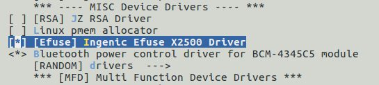

# EFUSE 接口

## 模块功能介绍

EFUSE模块提供了读写efuse各个数据段的接口。可以查看efuse中保存的cpu相关信息或者写入用户自定义的信息。

## 驱动位置

驱动源码所在位置

module_drivers/drivers/misc/jz_efuse_x2500.c

## 设备树配置

设备树所在位置：

module_drivers/dts/x2500.dtsi

RTC控制器描述：

 efuse: efuse@0x13540000 {

 compatible = "ingenic,x2500-efuse";

 reg = <0x13540000 0x10000>;

 status = "okay";

 }; 

### 设备树默认配置

设备树默认编译会产生EFUSE设备。

### 设备树自定义配置

&efuse {

 status = "okay";

 ingenic,efuse-en-gpio = <&gpa 26 GPIO_ACTIVE_HIGH INGENIC_GPIO_NOBIAS>;

};

## 内核编译配置

内核配置JZ_EFUSE_X2500，配置说明如下：

 Symbol: JZ_EFUSE_X2500 [=y] 

 Type : bool 

 Defined at module_drivers/drivers/misc/Kconfig:35 

 Prompt: [Efuse] Ingenic Efuse X2500 Driver 

 Depends on: SOC_X2500 [=y] 

 Location: 

 -> Ingenic device-drivers Configurations 

### 内核默认编译配置

配置界面如下：

### 内核自定义编译配置

用户可根据实际需求添加该模块。该模块默认不配置。

## 驱动加载成功打印信息

[ 2.014779] jz-efuse 13540000.efuse: setup vddq_protect_timer!

[ 2.020975] jz-efuse 13540000.efuse: rd_adj = 7 | rd_strobe = 0 | wr_adj = 5 | wr_strobe = 1076

[ 2.029754] jz-efuse 13540000.efuse: ingenic efuse interface module registered success.

## 设备节点生成

驱动加载成功后会生成以下文件：

/dev/jz-efuse

## 应用程序使用说明

### 应用程序存放目录：

~/x2500/packages/example/efuse-x2500$ tree

.

├── Build.mk

├── efuse.c

├── efuse_rw.c

├── include

│   └── efuse.h

└── Makefile

1 directory, 5 files

### 应用使用说明

\# ./testsuite/efuserw/efuserw 

./efuse <rwflag> <segment> <offset> <type> <[data string] / len >

 rwflag:

 -r : read

 -w : write

 segment:

 chip_id(12), user_id(4), adc_calib(2), trim_data(1), protect_id(1), cpu_id(2), special_use(2), user_data(40)

 type:

 -h: data string turn to hex; exp: if '-h 0011', write as 0x0011, len = 2 Bytes; if '-s 0011', len = 4 Bytes

 -s: data string as string;

 offset:

 r/w offset must < seg_size

 len:

 read length

 exp:

 ./efuse -r chip_id 0 -h 4

 ./efuse -w user_data 0 -h "00112233445566"

 ./efuse -r chip_id 0 -s 4

 ./efuse -w user_data 0 -s "hello ingenic"

### 读取efuse数据

示例：读取chip_id

./testsuite/efuserw/efuserw -r chip_id 0 -h 4

[ 1829.840413] jz-efuse 13540000.efuse: gpio error

EFUSE_DATA: [2805414e]

###  写数据到efuse

\#define EFUSE_WRITE_EN 0 

修改为 

\#define EFUSE_WRITE_EN 1

注：若使用写功能，需要编译前在内核驱动代码中修改上述写使能宏定义

 示例：写user_data

./efuse -w user_data 0 -h "00112233445566"

## 注意事项

 efuse只能写入一次，重复写入可能会造成芯片产生不可预知的错误，写入时需谨慎。

