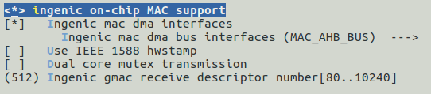

# GMAC 百兆以太网控制器接口

## 模块功能介绍

RMII Reduced Media Independent Interface 简化媒体独立接口,是IEEE 802.3u标准中除MII接口之外的另一种实现。RMII支持10兆和100兆的总线接口速度。

## 驱动源码位置

内核驱动代码位置:

module_drivers/drivers/net/ethernet/ingenic

├── ethtool.c

├── ingenic_mac.c

├── ingenic_mac.h

├── Kconfig

├── Makefile

├── readme

├── synopGMAC_Dev.c

├── synopGMAC_Dev.h

├── synopGMAC_plat.c

└── synopGMAC_plat.h

## 设备树配置

设备树所在位置：

module_drivers/dts/x2500.dtsi

网卡控制器定义：

RMII 配置参考如下:

&mac0 { 

 pinctrl-names = "default", "reset";

 pinctrl-0 = <&mac0_rmii_p0_normal>, <&mac0_rmii_p1_normal>;

 pinctrl-1 = <&mac0_rmii_p0_rst>, <&mac0_rmii_p1_normal>;

 status = "okay";

 ingenic,rst-gpio = <&gpb 21 GPIO_ACTIVE_LOW INGENIC_GPIO_NOBIAS>;

 ingenic,rst-ms = <10>;

 ingenic,mac-mode = <RMII>;

 ingenic,mode-reg = <0xb00000e8>;

 ingenic,phy-clk-freq = <50000000>;

};

### 设备树默认配置

Hippo_V1.x 开发板支持单网卡 MAC0。

设备树属性说明如下:

|  |  |
| --- | --- |
| **属性名称** | **说明** |
| **ingenic,rst-gpio**| 定义复位GPIO |
| **ingenic,rst-ms**| 定义复位时间 |
| **ingenic,rst-delay-ms**| 复位后延时时间，延时期间不对phy进行任何操作 |
| **ingenic,mac-mode**| RMII |
| **ingenic,mode-reg**|  |
| **ingenic,phy-clk-freq**| 如果使用芯片供给phy的工作时钟, 需要配置phy芯片工作时钟频率 |

注意：

1.依据开发板设计更改mac设备对应phy的复位gpio,复位有效电平,复位需要的保持的时间

## 内核编译配置

内核配置INGENIC_MAC，配置说明如下：

 Symbol: INGENIC_MAC [=y] 

 Type : tristate 

 Defined at module_drivers/drivers/net/ethernet/ingenic/Kconfig 

 Prompt: ingenic on-chip MAC support 

### 内核默认编译配置

内核默认配置GMAC驱动，配置界面如下：

### 内核自定义编译配置

|  |  |
| --- | --- |
| **可配置选项** |  **配置说明** |
| **Ingenic gmac receive descriptor number[80..10240]** | gmac 控制器接收数据包的缓存数量，缓存越大可以减少满载时的丢包率，经过测试设置8192可以避免控制器层出现丢包, 这种情况运行时一个网卡的动态内存会使用16M-32M |

## 模块内核差异

无

## 设备节点生成

驱动加载成功后，执行ifconfig -a会出现eth0或者eth1.

## 应用程序使用说明

执行ifconfig -a 命令查看支持的网络设备，如果出现eth0 或者eth1则说明网卡加载成功

\# ifconfig -a

eth0      Link encap:Ethernet  HWaddr 1E:01:7F:E6:D3:26 

          BROADCAST MULTICAST  MTU:1500  Metric:1

          RX packets:0 errors:0 dropped:0 overruns:0 frame:0

          TX packets:0 errors:0 dropped:0 overruns:0 carrier:0

          collisions:0 txqueuelen:1000

          RX bytes:0 (0.0 B)  TX bytes:0 (0.0 B)

lo        Link encap:Local Loopback

          LOOPBACK  MTU:65536  Metric:1

          RX packets:0 errors:0 dropped:0 overruns:0 frame:0

          TX packets:0 errors:0 dropped:0 overruns:0 carrier:0

          collisions:0 txqueuelen:1

          RX bytes:0 (0.0 B)  TX bytes:0 (0.0 B)

配置网络IP

ifconfig eth0 IP                /*根据实际选择的网口配置eth0或eth1*/

 

使用ping命令查看网络连接情况

ping IP -I eth0                /*通过-I 选项可以指定ping 命令使用的网口*/

### 网络性能测试

找一台有百兆以太网功能的电脑，使用网线直连，使用iperf3命令测试，电脑当做服务端，开发板做客户端

* 电脑端执行命令

iperf3  -s

* 测试单向发送性能

iperf3  -c 192.168.4.105 -u -b 1000M -l 65507 -t 10

* 测试单向接收性能

iperf3  -c 192.168.4.105 -u -b 1000M -l 65507 -t 10 -R

* 应用层提高网络性能的方法

 以下方法根据具体应用场景使用，设置不合理反而会影响测试结果

sysctl -w net.core.rmem_default=10485760  

* 增加网络核心层接收的缓存, 此设置会使用10M内存， 双网口桥接不使用

sysctl -w net.core.rmem_max=10485760 

* 增加网络核心层接收的缓存

指定内核处理接收网络协议栈使用的cpu核，指定后可以避免内核动态切换过程造成双核使用不均衡造成的性能不稳定：

echo 0 > /proc/irq/61/smp_affinity_list   

* 指定cpu0处理gmac1接收的数据

echo 1 > /proc/irq/63/smp_affinity_list   

* 指定cpu1处理gmac0接收的数据， gmac0中断号63  gmac1中断号61

sysctl -w net.core.netdev_max_backlog=4000 

* 增加转接过程中数据包缓存长度，可以减少数据抖动但消耗内存越大

echo 2 > /sys/class/net/eth0/queues/rx-0/rps_cpus 

* 指定cpu1处理eth0接收到数据包，输入1指定cpu0，2指定cpu1, 3指定cpu0-1。
