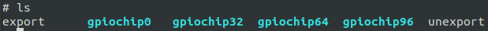
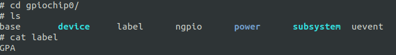
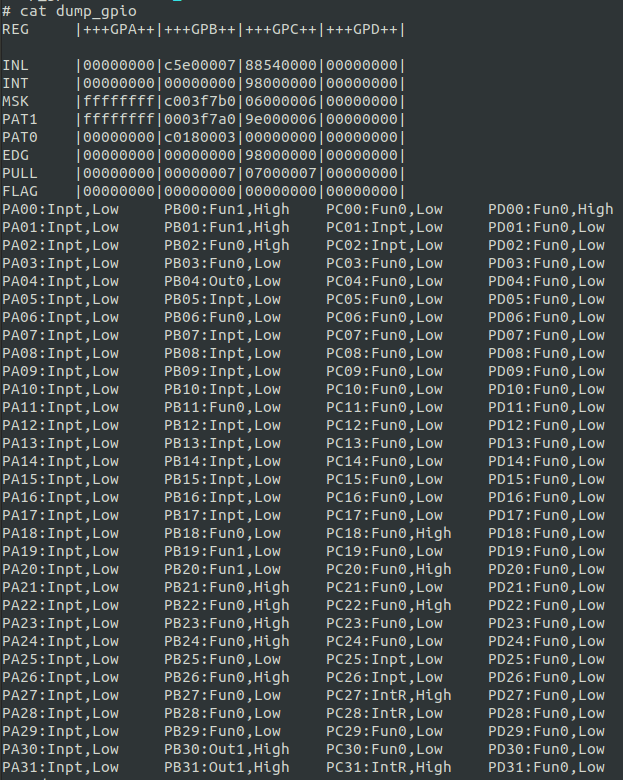

# GPIO 通用IO接口

## 模块功能介绍

gpio 一般在进行开发板设计的时候就已经固定好了， 有的 gpio 只能作为设备复用功能管脚，有的 gpio 作为普通的输入输出和中断检测功能， 对于固定设备复用的功能管脚在以下文件中定义：

module_drivers/dts/x2500-pinctrl.dtsi

在 module_drivers/dts/"板级".dts 会根据驱动配置， 选中相应的设备功能管脚。内核的 gpio 驱动基于 gpio 子系统实现，很方便的进行 gpio 控制。

## 驱动位置

驱动源码所在位置

module_drivers/drivers/pinctrl


## 设备树配置

设备树所在位置：

module_drivers/dts/x2500-pinctrl.dtsi

部分GPIO配置如下：

&pinctrl {  
 uart0_pin: uart0-pin {  
 uart0_pc: uart0-pc {  
 ingenic,pinmux = <&gpc 2 5>;  
 ingenic,pinmux-funcsel = <PINCTL_FUNCTION2>;  
 };  
 };  
 uart1_pin: uart1-pin {  
 ……  
 };  
  
 uart2_pin: uart2-pin {  
 ……  
 };  
  
 uart3_pin: uart3-pin {  
 ……  
}

### 设备树默认配置

### 设备树自定义配置

#### 配置pincfg属性

当gpio作为设备功能复用时，可以通过"ingenic,pincfg" 指定某个pin脚的附加属性,

* 上拉
* 下拉
* 高阻
* 驱动能力
* SCHMITT
* SLEW_RATE。


|  |  |
| --- | --- |
| PINCTL_CFG_BIAS_DISABLE  | 关闭偏振电压 |
| PINCTL_CFG_BIAS_HIGH_IMPEDANCE | 设置高阻态 |
| PINCTL_CFG_BIAS_PULL_DOWN | 设置下拉 |
| PINCTL_CFG_BIAS_PULL_PIN_DEFAULT | 设置默认上拉 |
| PINCTL_CFG_BIAS_PULL_UP | 设置上拉 |
| PINCTL_CFG_DRIVE_STRENGTH | 设置驱动能力 |
| PINCTL_CFG_FILTER | 设置滤波功能 |
| PINCTL_CFG_INPUT_SCHMITT_ENABLE | 使能施密特输入 |
| PINCTL_CFG_SLEW_RATE | 设置转换速率 |

其中pincfgs可以是以下形式:
```c
#define PINCTL_CFG_BIAS_DISABLE 1

#define PINCTL_CFG_BIAS_HIGH_IMPEDANCE 2

#define PINCTL_CFG_BIAS_PULL_DOWN 3

#define PINCTL_CFG_BIAS_PULL_PIN_DEFAULT 4

#define PINCTL_CFG_BIAS_PULL_UP 5

#define PINCTL_CFG_DRIVE_STRENGTH 9

#define PINCTL_CFG_FILTER 10

#define PINCTL_CFG_INPUT_SCHMITT_ENABLE 11

#define PINCTL_CFG_SLEW_RATE 17

* PINCFG_PACK(PINCTL_CFG_DRIVE_STRENGTH, 7) # value: 0 ～ 7

* PINCFG_PACK(PINCTL_CFG_BIAS_DISABLE,1)

* PINCFG_PACK(PINCTL_CFG_PULL_DOWN, 1) # 使能下拉

* PINCFG_PACK(PINCTL_CFG_PULL_UP, 1) # 使能上拉

* PINCFG_PACK(PINCTL_CFG_INPUT_SCHMITT_ENABLE, 1)

* PINCFG_PACK(PINCTL_CFG_SLEW_RATE, 1)
```
 

具体语法：

ingenic,pincfg = <gpio_group start_pin end_pin pincfgs>

例如：

mac0_rgmii_p1_normal: mac0-rgmii-p1-normal {

 ingenic,pinmux = <&gpc 2 5>, <&gpc 10 10>, <&gpc 12 15>;

 ingenic,pinmux-funcsel = <PINCTL_FUNCTION1>;

 ingenic,pincfg = <&gpc 2 5 PINCFG_PACK(PINCTL_CFG_DRIVE_STRENGTH, 4)>, \ 

 <&gpc 10 10 PINCFG_PACK(PINCTL_CFG_DRIVE_STRENGTH, 4))>,\

 <&gpc 12 15 PINCFG_PACK(PINCTL_CFG_DRIVE_STRENGTH, 4)>;

};

#### 配置gpio属性


|  |  |
| --- | --- |
| INGENIC_GPIO_NOBIAS | 关闭偏振电压 |
| INGENIC_GPIO_PULLEN | 使能上拉 |
| INGENIC_GPIO_PULLUP | 上拉 |
| INGENIC_GPIO_PULLDOWN | 下拉 |
| INGENIC_GPIO_HIZ | 高阻 |
| INGENIC_GPIO_DS_* | 驱动能力 |
| INGENIC_GPIO_SLEW_RATE | 转换速率 |
| INGENIC_GPIO_SCHMITT | 施密特性 |

当定义一个普通GPIO时，也可以配置GPIO的属性。具体如下:
```c
#define INGENIC_GPIO_BIAS_MASK 0x7

#define INGENIC_GPIO_BIAS_SFT 0

#define INGENIC_GPIO_NOBIAS (0 << INGENIC_GPIO_BIAS_SFT)

#define INGENIC_GPIO_PULLEN (1 << INGENIC_GPIO_BIAS_SFT)

#define INGENIC_GPIO_PULLUP (2 << INGENIC_GPIO_BIAS_SFT)

#define INGENIC_GPIO_PULLDOWN (3 << INGENIC_GPIO_BIAS_SFT)

#define INGENIC_GPIO_HIZ (4 << INGENIC_GPIO_BIAS_SFT)

#define INGENIC_GPIO_DS_SFT 3

#define INGENIC_GPIO_DS_MSK 0x7

#define INGENIC_GPIO_DS_0 (0 << INGENIC_GPIO_DS_SFT)

#define INGENIC_GPIO_DS_1 (1 << INGENIC_GPIO_DS_SFT)

#define INGENIC_GPIO_DS_2 (2 << INGENIC_GPIO_DS_SFT)

#define INGENIC_GPIO_DS_3 (3 << INGENIC_GPIO_DS_SFT)

#define INGENIC_GPIO_DS_4 (4 << INGENIC_GPIO_DS_SFT)

#define INGENIC_GPIO_DS_5 (5 << INGENIC_GPIO_DS_SFT)

#define INGENIC_GPIO_DS_6 (6 << INGENIC_GPIO_DS_SFT)

#define INGENIC_GPIO_DS_7 (7 << INGENIC_GPIO_DS_SFT)

#define INGENIC_GPIO_SLEW_RATE_SFT 6

#define INGENIC_GPIO_SLEW_RATE (1 << INGENIC_GPIO_SLEW_RATE_SFT)

#define INGENIC_GPIO_SCHMITT_SFT 7

#define INGENIC_GPIO_SCHMITT (1 << INGENIC_GPIO_SCHMITT_SFT)
```
具体语法：

xxxx,xx-gpio = <gpio_group pin polarity gpiocfs>

其中“gpio”和“gpios”为内核关键字，在定义gpio时需要在结尾添加“-gpio”或“-gpios”,在使用内核api获取gpio号时，会用的这些后缀。

当需要应用多个属性到某一个GPIO时，使用值或即可，例如，将GPIO配置为上拉、SCHMITT、驱动能力6

ingenic,lcd-pwm-gpio = <&gpc 1 GPIO_ACTIVE_LOW (INGENIC_GPIO_PULLUP | INGENIC_GPIO_SCHMITT | INGENIC_GPIO_DS_6 )>;

定义通用GPIO示例：

bt_power {

 compatible = "ingenic,bt_power";

 ingenic,reg-on-gpio = <&gpd 20 GPIO_ACTIVE_LOW INGENIC_GPIO_NOBIAS>;

 ingenic,wake-gpio = <&gpd 21 GPIO_ACTIVE_LOW INGENIC_GPIO_NOBIAS>;

};

#### 系统休眠GPIO配置

在系统休眠时，针对每个开发板的GPIO配置不一样，想降低系统休眠功耗，需要对GPIO进行输入上下拉或者输出高地等配置。

在板极.dts文件中，可以通过配置以下的gpio各组gpio属性，让系统在休眠时，处于相应的状态.例如：配置PA组(0 - 10)的pin为上拉状态, (11 - 15)为输出高

&gpa {

 ingenic,gpio-sleep-pullup = <0 1 2 3 4 5 6 7 8 9 10>;

 ingenic,gpio-sleep-pulldown = <>;

 ingenic,gpio-sleep-hiz = <>;

 ingenic,gpio-sleep-low = <>;

 ingenic,gpio-sleep-high = <11 12 13 14 15>;

 };

按照实际情况配置以下属性:

 /* Board Sleep GPIO configuration. */

 /* <0 1 2 3 .... 31>, set one of the pin to state.*/

 &gpa {

 ingenic,gpio-sleep-pullup = <>;

 ingenic,gpio-sleep-pulldown = <>;

 ingenic,gpio-sleep-hiz = <>;

 ingenic,gpio-sleep-low = <>;

 ingenic,gpio-sleep-high = <>;

 };

 

 &gpb {

 ingenic,gpio-sleep-pullup = <>;

 ingenic,gpio-sleep-pulldown = <>;

 ingenic,gpio-sleep-hiz = <>;

 ingenic,gpio-sleep-low = <>;

 ingenic,gpio-sleep-high = <>;

 };

 

 &gpc {

 ingenic,gpio-sleep-pullup = <>;

 ingenic,gpio-sleep-pulldown = <>;

 ingenic,gpio-sleep-hiz = <>;

 ingenic,gpio-sleep-low = <>;

 ingenic,gpio-sleep-high = <>;

 };

 

 &gpd {

 ingenic,gpio-sleep-pullup = <>;

 ingenic,gpio-sleep-pulldown = <>;

 ingenic,gpio-sleep-hiz = <>;

 ingenic,gpio-sleep-low = <>;

 ingenic,gpio-sleep-high = <>;

 };

## 内核编译配置

内核配置GPIOLIB，kernel4.4.94配置说明如下：

Symbol: GPIOLIB [=y] 

Type : boolean

Prompt: GPIO Support 

 Location:

 -> Device Drivers 

 Defined at drivers/gpio/Kconfig:34

 Depends on: ARCH_WANT_OPTIONAL_GPIOLIB [=n] || ARCH_REQUIRE_GPIOLIB [=y]

 Selected by: BCM47XX [=n] && <choice> || ARCH_REQUIRE_GPIOLIB [=y] || PINCTRL_AT91 [=n] && PINCTRL [=y] && OF [=y] && ARCH_AT91 || PINCTRL_AT91PIO4 [=n] && PINCTRL [=y] && OF [=y] && ARCH_AT91

Symbol: ARCH_REQUIRE_GPIOLIB [=y] 

Type : boolean

Defined at drivers/gpio/Kconfig:23

Selects: GPIOLIB [=y]

Selected by: GPIO_TXX9 [=n] || MIPS_ALCHEMY [=n] && <choice> || AR7 [=n] && <choice> || ATH79 [=n] && <choice> || BCM63XX [=n] && <choice> || MACH_INGENIC [=n] && <choice> || MACH_XBURST [=n] &

Symbol: ARCH_WANT_OPTIONAL_GPIOLIB [=n] 

Type : boolean 

Defined at drivers/gpio/Kconfig:13 

Selected by: BCM47XX [=n] && <choice> 

Symbol: GPIOLIB_IRQCHIP [=n] 

Type : boolean

Defined at drivers/gpio/Kconfig:59 

Depends on: GPIOLIB [=y]

Selects: IRQ_DOMAIN [=y] 

Selected by: PINCTRL_AT91 [=n] && PINCTRL [=y] && OF [=y] && ARCH_AT91 || PINCTRL_AT91PIO4 [=n] && PINCTRL [=y] && OF [=y] && ARCH_AT91 || PINCTRL_AMD [=n] && PINCTRL [=y] && GPIOLIB [=y] || PI

内核配置GPIOLIB，kernel5.10配置说明如下：

Symbol: GPIOLIB [=y] 

 Type : bool 

 Defined at drivers/gpio/Kconfig:14 

 Prompt: GPIO Support 

 Location: 

 (1) -> Device Drivers 

 Selected by [y]: 

 - PINCTRL_INGENIC_V2 [=y] && OF [=y] && (MIPS [=y] || COMPILE_TEST [=n]) 

 Selected by [n]: 

 - MACH_INGENIC [=n] 

 ……

Symbol: ARCH_REQUIRE_GPIOLIB [=ARCH_REQUIRE_GPIOLIB] 

 Type : unknown 

 Selected by [y]: 

 - MACH_XBURST2 [=y] && <choice> 

 Selected by [n]: 

 - MACH_XBURST [=n] && <choice> 

Symbol: GPIOLIB_FASTPATH_LIMIT [=512] 

 Type : integer 

 Range : [32 512] 

 Defined at drivers/gpio/Kconfig:25 

 Prompt: Maximum number of GPIOs for fast path 

 Depends on: GPIOLIB [=y] 

 Location: 

 -> Device Drivers 

 (2) -> GPIO Support (GPIOLIB [=y])

Symbol: GPIOLIB_IRQCHIP [=y] 

 Type : bool 

 Defined at drivers/gpio/Kconfig:46 

 Depends on: GPIOLIB [=y] 

 Selects: IRQ_DOMAIN [=y] 

 Selected by [y]: 

 - PINCTRL_INGENIC_V2 [=y] && OF [=y] && (MIPS [=y] || COMPILE_TEST [=n]) 

 Selected by [n]: 

 - PINCTRL_AT91 [=n] && PINCTRL [=y] && OF [=y] && ARCH_AT91 

 ……

### 内核默认编译配置

kernel4.4.94内核默认配置GPIO驱动，配置界面如下：


kernel5.10内核默认配置GPIO驱动，配置界面如下：


## 版本差异

kernel4.4.94和kernel5.10的差异主要体现在**错误!未找到引用源。**章节，kernel5.10不再提供通过menuconfig关闭gpio组中断的功能了。

## 设备节点生成

在内核导出 gpio 节点的前提下， 可以操作/sys/class/gpio 节点， 控制 gpio 输入输出，节点路径：

/sys/class/gpio/

### GPIO号计算说明

在开发板系统的 /sys/class/gpio的目录下，找到gpiochipXX 目录，如下图：



进入gpiochip0文件夹查看label文件内容，如下图所示：



查看ngpio中的内容，如下图：


由此可以确定gpioa这组引脚的基准脚就是0，其他gpio组同样道理。

如果想要操作gpioc组10号引脚，那么对应的gpio号就为64+10=74。

### GPIO导入导出说明

 "export"：用户空间可以通过写其编号到这个文件， 要求内核导出，一个 GPIO 的控制到用户空间。例如: 如果内核代码没有申请 GPIO 19,

echo 19 > export

将会为 GPIO \#19 创建一个 "gpio19" 节点。

"unexport"：导出到用户空间的逆操作。例如

echo 19 > unexport

将会移除使用"export"文件导出的"gpio19" 节点。

### GPIO属性

GPIO信号的路径（以GPIO 42为例）：

/sys/class/gpio/gpio42

并有如下的读/写属性：

/sys/class/gpio/gpio42/direction

/sys/class/gpio/gpio42/value

/sys/class/gpio/gpio42/edge

/sys/class/gpio/gpio42/active_low

* direction：

读取得到 "in" 或 "out"。 这个值通常运行写入。

写入"out" 时,其引脚的默认输出为低电平。 为了确保无故障运行，"low" 或 "high" 的电平值应该写入 GPIO 的配置， 作为初始输出值。

注意:如果内核不支持改变 GPIO 的方向， 或者在导出时内核代码没有明确允许用户空间可以重新配置 GPIO 方向， 那么这个属性将不存在。

* value：

读取得到 0 (低电平) 或 1 (高电平)。 如果 GPIO 配置为输出，这个值允许写操作。任何非零值都以高电平看待。

如果引脚可以配置为中断信号， 且如果已经配置了产生中断的模式（见"edge"的描述）， 你可以对这个文件使用轮询操作(poll(2))，且轮询操作会在任何中断触发时返回。 如果你使用轮询操作(poll(2))，请在 events 中设置 POLLPRI 和 POLLERR。 如果你使用轮询操作(select(2))， 请在 exceptfds 设置你期望的文件描述符。 在轮询操作(poll(2))返回之后， 既可以通过 lseek(2)操作读取sysfs 文件的开始部分， 也可以关闭这个文件并重新打开它来读取数据。

* edge：

读取得到“none”、“rising”、“falling” 或者“both”，将这些字符串写入这个文件可以选择沿触发模式， 会使得轮询操作(select(2))在"value"文件中返回。这个文件仅有在这个引脚可以配置为可产生中断输入引脚时，才存在。

* active_low：

读取得到 0 (假) 或 1 (真)。 写入任何非零值可以翻转这个属性的\(读写\)值。 已存在或之后通过"edge"属性设置了"rising"。

## 应用程序使用说明

### dump_gpio文件

在/sys/devices/platform/apb/10010000.pinctrl路径下提供了一个快速查看gpio function的文件，用户可以cat dump_gpio文件，查看对应gpio function功能是否为期望功能，以达到快递debug的目的，如下图所示：



