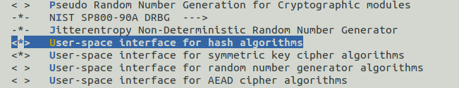
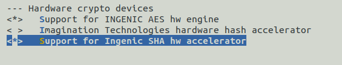

# Hash模块驱动接口

## 模块功能介绍

支持hash算法加速，支持SHA1 RFC-3174标准和MD5 RFC-1321标准。

支持SHA 160/224/256/384/512

支持MD5 128bit

## 驱动源码位置

驱动源码所在位置：

 module_drivers/drivers/crypto/ingenic-hash.c

## 设备树配置

设备树所在位置：

module_drivers/dts/x2500.dtsi

Hash控制器定义

 hash: hash@0x13480000 {

                 compatible = "ingenic,hash";

                 reg = <0x13480000 0x10000>;

                 interrupt-parent = <&core_intc>;

                 interrupts = <IRQ_HASH>;

                 status = "okay";

};

### 设备树默认配置

设备树默认编译会产生hash设备。

### 设备树自定义配置

用户可根据实际需求关闭hash设备，将该节点配置为disabled。

## 内核编译配置

内核驱动编译选项CRYPTO_DEV_INGENIC_SHA

Symbol: CRYPTO_USER_API_HASH [=y]                                        

Type  : tristate                                                      

Prompt: User-space interface for hash algorithms

 Location：

-> Cryptographic API (CRYPTO [=y])                                  

Defined at crypto/Kconfig:1607                                        

Depends on: CRYPTO [=y] && NET [=y]                                    

Selects: CRYPTO_HASH [=y] && CRYPTO_USER_API [=y]  

Symbol: CRYPTO_DEV_INGENIC_SHA [=y]                                    

Type  : tristate                                                      

Prompt: Support for Ingenic SHA hw accelerator

Location:

-> Cryptographic API (CRYPTO [=y])                                

  -> Hardware crypto devices (CRYPTO_HW [=y])

Defined at drivers/crypto/Kconfig:493

Depends on: CRYPTO [=y] && CRYPTO_HW [=y] && (MARCH_XBURST1 || MACH_XBURST2 [=y])

Selects: CRYPTO_ALGAPI [=y] 

### 内核默认编译配置

内核默认编译会产生Hash控制器设备。配置界面如下：

### 内核自定义编译配置

用户可根据实际需求关闭该设备。

## 设备节点生成

## 应用程序使用说明

参考应用测试程序路径：

packages/example/security_utils/hash/

├── CMakeLists.txt

├── hash.c

├── hash_openssl.c

├── include

│   ├── bignum.h

│   ├── hash.h

│   └── hash_openssl.h

└── main.c

测试方法：

hash_test in_file out_file

in_file为待加密数据文件名，加密成功数据将存于out_file文件

相关测试数据：

packages/example/security_utils/test_data/hash_test/

├── hash_result.txt

└── hash_test_data.txt

* hash_result.txt：该数据为结果数据
* hash_test_data.txt：该数据为待测试数据

 # hash_test hash_test_data.txt hash_result.txt

加密成功后打印：

 hash crypt success!!

