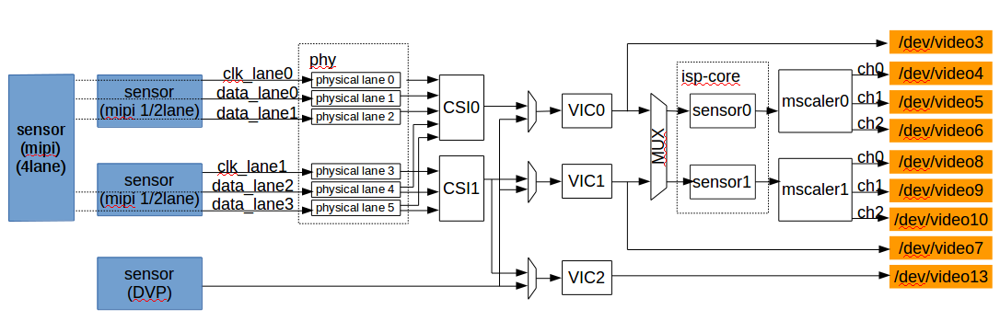
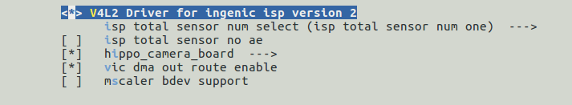
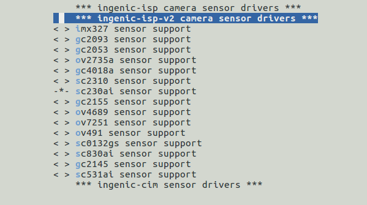

# ISP 图像处理单元

## 模块功能介绍

X2500芯片的ISP（ImageSignalProcessing）模块包含三个VIC控制器、一个两路输入两路输出的ISP-CORE控制器以及两个MSCALER控制器，其硬件拓扑如下图所示。

图 1‑1 ISP模块硬件拓扑图

CSI-0为4lane控制器，可控physical lane 0/1/2/4/5，即

clk_lane0/data_lane0/data_lane1/data_lane2/data_lane3，可接1/2/4 lane mipi sensor。

CSI-1为2lane控制器，可控physical lane 3/4/5，即clk_lane1/data_lane2/data_lane3，可接1/2 lane mipi sensor。

VIC-0接收CSI0 mipi信号输入或DVP信号输入，数据输出可bypass到DDR或输入ISP-CORE。

VIC-1接收CSI1 mipi信号输入或DVP信号输入，数据输出可bypass到DDR或输入ISP-CORE。

VIC-2接收CSI1 mipi信号输入或DVP信号输入，数据输出可bypass到DDR。

ISP-CORE可以并行处理两路图像数据，抽象为sensor0和sensor1，sensor0数据处理后输出到MSCALER0，sensor1数据处理后输出到MSCALER1；两个MSCALER控制器分别经由3个独立的通道将图像数据缩放输出到DDR。

ISP支持WDR，能对图像信号进行黑电平矫正、坏点矫正、镜头阴影矫正、自动白平衡、自动曝光、自动增益、GAMMA曲线矫正、CCM矫正、2D降噪以及3D降噪等处理。支持DVP，MIPI(1/2/4 lane)，BT656接口输入。支持RAW8/10/12，YUV422，GREY格式输入。输入格式为RAW8/10/12时，bypass输出支持RAW16格式，经ISP-CORE输出支持NV12、NV21格式；输入格式为YUV422时，bypass输出支持YUV422、NV12、NV21格式，不支持经ISP-CORE输出；输入格式为GREY时，bypass输出支持GREY格式，不支持经ISP-CORE输出。

ISP—CORE可支持的最大输入分辨率为3840*2160。

## 驱动源码位置

控制器驱动源码所在位置:

module_drivers/media/platform/ingenic-isp-v2

sensor驱动源码所在位置：

modle_drivers/media/i2c/ingenic-isp-v2

## 设备树配置

控制器设备树所在位置：

module_drivers/dts/x2500.dtsi

ISP控制器描述：

ispcam0:

 isp-camera@0{

 compatible = "ingenic,x2500-isp-camera";

 ……

 };

 csi0: csi@0x10023000 {

 compatible = "ingenic,x2500-csi";

 ……

 };

 vic0: vic@0x13380000{

 compatible = "ingenic,x2500-vic";

 ……

 };

 isp0: isp@0x13300000 {

 compatible = "ingenic,x2500-isp";

 ……

 };

 mscaler0: mscaler@0x13316000 {

 compatible = "ingenic,x2500-mscaler";

 ……;

 };

 };

ispcam1: isp-camera@1 {

 ……

 };

ispcam2: isp-camera@1 {

 ……

 };

sensor设备树所在位置:

module_drivers/dts/hippo_cameras

### 设备树默认配置

设备树默认配置产生ISP设备，支持外接三摄摄像头子板RD_X2500_HIPPO_CAMERA_V1.0，硬件sensor型号为sc230ai和gc2155。

在hippo_cameras/RD_X2500_HIPPO_CAMERA_1V0.dtsi中，对camera sensor及控制接口进行如下默认配置：

&i2c3 {

 status = "okay";

 clock-frequency = <100000>;

 timeout = <1000>;

 pinctrl-names = "default";

 pinctrl-0 = <&i2c3_pa>;

 sc230ai_0:sc230ai@0x30 {

 status = "ok";

 compatible = "smartsens,sc230ai";

 reg = <0x30>;

 pinctrl-names = "default";

 pinctrl-0 = <&cim0_vic_mclk_pc>;

 ingenic,mclk = <0>;

 ……

 port {

 sc230ai_ep0:endpoint {

 remote-endpoint = <&isp0_ep>;

 };

 };

 };

sc230ai_1:sc230ai@0x32 {

 status = "ok";

 compatible = "smartsens,sc230ai";

 reg = <0x32>;

 pinctrl-names = "default";

 pinctrl-0 = <&cim2_vic_mclk_pc>;

 ingenic,mclk = <2>;

 ……

 port {

 sc230ai_ep1:endpoint {

 remote-endpoint = <&isp1_ep>;

 };

 };

 };

};

&i2c0 {

 status = "okay";

 clock-frequency = <100000>;

 timeout = <1000>;

 pinctrl-names = "default";

 pinctrl-0 = <&i2c0_pa>;

gc2155:gc2155@0x3c {

 status = "ok";

 compatible = "GalaxyCore,gc2155";

 reg = <0x3c>;

 pinctrl-names = "default";

 pinctrl-0 = <&cim1_vic_mclk_pc>;

 ingenic,mclk = <1>;

 ……

 port {

 gc2155_0:endpoint {

 remote-endpoint = <&vic2_ep>;

 };

 };

 };

};

&isp0_ep {

 remote-endpoint = <&sc230ai_ep0>;

 data-lanes = <0 1>;

 clk-lanes = <2>;

};

&isp1_ep {

 remote-endpoint = <&sc230ai_ep1>;

 data-lanes = < 3 4 >;

 clk-lanes = <5>;

};

&vic2_ep {

 remote-endpoint = <&gc2155_0>;

 bus-width = <8>;

 data-shift = <0>;

 hsync-active = <1>;

 vsync-active = <0>;

 data-active = <1>;

 pclk-sample = <1>;

};

### 设备树自定义配置

1.设备树可选配hippo开发板适配的其他camera小板，选配hippo开发板适配的其他camera小板时，在板级.dts中inclulde module_drivers/dts/hippo_cameras目录中相应的dtsi即可，该配置可通过menuconfig完成。 

2.设备树可选配用户自定义的camera sensor，选配用户自定义的camera sensor时，仿照默认配置，根据接口类型进行camera sensor及isp endpoint的配置。其中，ingenic-mclk字段对应mclk的编号（0/1/2），data-lanes字段根据接入的mipi sensor的data lane数量填充，例如：接入2 lane mipi sensor，data-lanes需填充两个参数，data-lanes = <0 1>，接入4 lane mipi sensor，data-lanes需填充四个参数，data-lanes = <0 1 3 4>；clk-lanes字段根据接入的mipi sensor的clock lane数量填充，例如：mipi sensor 连接一根clk lane，clk-lanes需填充一个参数，clk-lanes = <2>。

## 内核编译配置

内核配置VIDEO_INGENIC_ISP_V2，配置说明如下：

Symbol: VIDEO_INGENIC_ISP_V2 [=y] 

Type : tristate 

Prompt: V4L2 Driver for ingenic isp version 2 

 Location: 

 -> Ingenic device-drivers Configurations 

 -> [ISP] Drivers 

Defined at module_drivers/drivers/media/platform/Kconfig 

内核sensor配置，配置说明如下(以sc230ai为例)：

CONFIG_INGENIC_ISP_V2_CAMERA_SC230AI: 

 

This is a ingenic-isp-v2 camera driver for sc230ai 

 

 Symbol: INGENIC_ISP_V2_CAMERA_SC230AI [=y] 

 Type : tristate 

 Prompt: sc230ai sensor support 

 Location: 

 -> Ingenic device-drivers Configurations 

 -> [Sensors] Camera Sensors 

Defined at module_drivers/drivers/media/i2c/ingenic-isp-v2/Kconfig 

### 内核默认编译配置

内核默认配置ISP驱动，配置界面如下：

内核默认配置sc230ai sensor驱动，配置界面如下：

### 内核自定义编译配置

1.内核可选配hippo开发板适配的其他camera小板，选配hippo开发板适配的其他camera小板时，通过 menuconfig配置即可。 

2.内核可选配用户自定义的camera sensor，选配用户自定义的camera sensor时，可仿照已有sensor型号配置sensor drivers，代码所在位置：

module_drives/drivers/meida/i2c/ingenic-isp-v2/

自定义配置修改内容：a).detect函数中sensor CHIP_ID寄存器和值；b).win_sizes中的相关信息；c).v4l2_ctrl_new_std参数列表中，增益曝光的最大最小值；d).s_again，g_again，s_exp函数中读写曝光增益值的寄存器；e).again_lut表，不同sensor的again_lut形式略有不用，通常最后一列为增益倍数的换算值，前一列或几列为该增益倍数对应的寄存器值，增益倍数的换算公式为y=65535*log2(x),其中x为增益倍数，y为增益倍数的换算值。

1. ISP自动增益驱动实现方法
2. 基本原理
3. 君正平台增益值与增益倍数的对应关系：

y=65536*log2x

其中x为增益倍数,y为君正平台增益值。

1. 增益倍数与sensor增益寄存器值的对应关系：

由sensor厂家fae提供。

1. 由a和b得到君正平台增益值与sensor增益寄存器值的对应关系，得到增益表。
2. 增益表示例

根据sensor配置模拟增益所需的寄存器构建again_lut结构体， 例如：

struct again_lut {

 unsigned int reg_value; 

 unsigned int reg1_val; 

 unsigned int reg2_val; 

 unsigned int reg3_val; 

 ．．．．．．

 unsigned int gain;

}; 

其中 gain 变量为君正平台增益值; reg_value变量为sensor模拟增益的寄存器值;reg_val变量为sensor增益配置的其他辅助寄存器值。

根据基本原理计算得到君正平台增益值与sensor增益寄存器值的对应关系，例如：

struct again_lut gc2375_again_lut[] = {

 {0x40, 0x0b, 0x0c, 0x0e, ..., 0}, 

 //增益倍数为１时，君正平台增益值为０，sensor增益寄存器的值为0x40, 辅助增益寄存器１的值为0x0b,辅助增益寄存器2的值为0x0c…增益倍数１在表中不体现

 {0x44, 0x0b, 0x0c, 0x0e, ..., 5731},

 //增益倍数为１.06时，君正平台增益值为5731，sensor增益寄存器的值为0x44, 辅助增益寄存器１的值为0x0b,辅助增益寄存器2的值为0x0c…增益倍数１.06在表中不体现

 {0x48, 0x0b, 0x0c, 0x0e, ..., 11136},

 //增益倍数为１.24时，君正平台增益值为11126，sensor增益寄存器的值为0x48, 辅助增益寄存器１的值为0x0b,辅助增益寄存器2的值为0x0c…增益倍数１.24在表中不体现

 ... 

};

1. s_again函数

ISP驱动框架sensor的驱动中，xxx_s_again函数的功能为设置增益值到sensor。该函数的第二个参数为君正平台增益值，s_again函数需实现，通过参数传入的君正平台增益值查询增益表，得到对应的sensor增益寄存器值，并通过i2c将该值写入相应的寄存器。

1. g_again函数

ISP驱动框架sensor的驱动中，xxx_g_again函数的功能为获取sensor增益值到驱动,该函数需实现通过i2c读取sensor增益寄存器的值，反向查表获得君正平台增益值，并将该值回填到函数的第二个参数中。

## 内核差异

## 设备节点生成

驱动加载成功后生成以下节点：

### Debug节点

/sys/devices/platform/ahb0/ahb0:isp-camera@0/10054000.csi/debug/dump_csi

csi0 debug节点，用于打印 csi0相关寄存器状态

/sys/devices/platform/ahb0/ahb0:isp-camera@0/13380000.vic/debug/dump_vic

vic0 debug点，用于打印 vic0相关寄存器状态

/sys/devices/platform/ahb0/ahb0:isp-camera@0/13380000.vic/debug/vic_dma_debug

vic0 debug节点,模块参数dma_debug_en为1时有效，用于在通过mscaler0 video节点收图时，获取一帧未经isp处理的raw图。

/sys/devices/platform/ahb0/ahb0:isp-camera@0/ahb0:isp-camera@0:isp@0x13300000/debug/dump_isp

isp0 debug节点，用于打印 isp-core0相关寄存器状态

/sys/devices/platform/ahb0/ahb0:isp-camera@0/13316000.mscaler/debug/dump_mscaler 

mscaler0 debug节点，用于打印 mscaler0相关寄存器状态

/sys/devices/platform/ahb0/ahb0:isp-camera@1/10023000.csi/debug/dump_csi

csi1 debug节点，用于打印 csi1相关寄存器状态

/sys/devices/platform/ahb0/ahb0:isp-camera@1/13390000.vic/debug/dump_vic

vic1 debug节点，用于打印 vic1相关寄存器状态

/sys/devices/platform/ahb0/ahb0:isp-camera@1/13390000.vic/debug/vic_dma_debug

vic1 debug节点，模块参数dma_debug_en为1时有效，用于在通过mscaler1 video节点收图时，获取一帧未经isp处理的raw图。

/sys/devices/platform/ahb0/ahb0:isp-camera@1/ahb0:isp-camera@1:isp@0x13300000/debug/dump_isp

isp1 debug节点，用于打印 isp-core1相关寄存器状态

/sys/devices/platform/ahb0/ahb0:isp-camera@1/13317000.mscaler/debug/dump_mscaler 

mscaler1 debug节点，用于打印 mscaler1相关寄存器状态

### Video节点

/dev/video3 

vic0设备节点，vic0输出节点的实例化，用于输出未经isp处理的raw数据或yuv数据

/dev/video4 

mscaler0-ch0设备节点，mscaler0-ch0输出节点，用于输出经isp处理并经mscaler channel0缩放的NV12或NV21数据

/dev/video5

mscaler0-ch1设备节点，mscaler0-ch1输出节点，用于输出经isp处理并经mscaler channel1缩放的NV12或NV21数据

/dev/video6 

mscaler0-ch2设备节点，mscaler0-ch2输出节点，用于输出经isp处理并经mscaler channel2缩放的NV12或NV21数据

/dev/video7 

vic1设备节点，vic1的输出节点，用于输出未经isp处理的raw数据或yuv数据

/dev/video8 

mscaler1-ch0设备节点，mscaler1-ch0的输出节点，用于输出经isp处理并经mscaler channel0缩放的NV12或NV21数据

/dev/video9 

mscaler1-ch1设备节点，mscaler1-ch1的输出节点，用于输出经isp处理并经mscaler channel1缩放的NV12或NV21数据

/dev/video10 

mscaler1-ch2设备节点，mscaler1-ch2的输出节点，用于输出经isp处理并经mscaler channel2缩放的NV12或NV21数据

/dev/video13 

vic2设备节点，vic2的输出节点，用于输出未经isp处理的raw数据或yuv数据

## 应用程序使用说明

###  v4l2-ctl

v4l2-ctl可测试isp通路（vic节点输出或mscaler节点输出）并保存图像数据到文件。

#### 源码位置

buildroot/dl/libv4l/v4l-utils-1.24.1.tar.bz2

#### 命令行及参数示意

v4l2-ctl　-v width=640,height=480,pixelformat="NV12" --stream-mmap=3　--stream-to="test-ch0.yuv" -d /dev/video4

* width指定输出图像宽度；
* heigh 指定输出图像高度；
* pixelformat指定输出图像格式；
* --stream-mmap指定轮转buffer数量；
* --stream-to指定储存图像文件名；
* -d指定图像输出的video节点

注意，当使用vic的video节点输出图像时（即video3，video7），width，height须指定为图像的原始宽高，pixelformat需根据sensor输出格式指定为执行v4l2-ctl –list-format –d /dev/video3命令后输出的格式；

当使用mscaler的video节点输出图像时（即video4，video5，video6，video8，video9，video10），width，height可指定图像缩放的宽高，pixelformat支持NV12，NV21。

###  ffmpeg

ffmpeg可测试isp通路（mscaler节点输出）并在LCD屏上预览。

#### 源码位置

buildroot/dl/ffmpeg/ffmpeg-4.4.4.tar.xz

#### 命令行及参数示意

echo 6 > /sys/devices/platform/ahb0/13050000.dpu/layer0/src_fmt

echo 1 > /sys/devices/platform/ahb0/13050000.dpu/comp_update

设置显示格式为NV12

ffmpeg -pix_fmt nv12 –s 640*480 -i /dev/video4 -f fbdev /dev/fb0

* + -pix_fmt指定输出格式，支持nv12或nv21；
	+ -s指定输出图像大小，可缩放
	+ -i指定输出节点，支持mscaler video节点（即video4，video5，video6，video8，video9，video10）；
	+ -f指定输出设备节点。

###  cimutils

cimutils可测试isp通路（mscaler节点输出）并在LCD屏上预览。

#### 源码位置

packages/example/cimutils/

#### 命令行及参数示意

echo 6 > /sys/devices/platform/ahb0/13050000.dpu/layer0/src_fmt

echo 1 > /sys/devices/platform/ahb0/13050000.dpu/comp_update

设置显示格式为NV12

cimutils -P -x 720 -y 640 -t nv12 -I /dev/video4 -D /dev/fb0

* + -x指定图像宽度；
	+ -y指定图像高度；
	+ -d指定输出图像格式；
	+ -I指定输出节点，支持mscaler video节点（即video4，video5，video6，video8，video9，video10）；
	+ -D指定输出设备节点。

###  mjpg-streamer

mjpg-streamer可测试isp通路并通过PC预览图像。

#### 源码位置

development/mjpg-streamer/

#### 命令行及参数示意

mjpg_streamer -i "/usr/lib/mjpg-streamer/input_syncframes.so -r 1280x720 -m -camera_device0 /dev/video4" -o "/usr/lib/mjpg-streamer/output_http.so -w /usr/share/mjpg-streamer/www"

* + -camera_device0指定mscaler对应的设备节点；
	+ -r指定输出图像大小，可缩放。

预览方法：

1. 开发板连接网络，确保开发板pc互ping成功，启动pc浏览器，浏览网址http://＂开发板IP＂：8080，例如http：//192.168.4.68：8080/stream.html。
2. 开发板未连接网络，通过adb 建立联系，执行adb forward tcp:8080 tcp:8080，启动pc浏览器，浏览网址http：//127.0.0.1：8080/stream.html。

###  v4l2-isp-tuning

isp-core提供亮度，对比度，饱和度，锐度的调节接口，可通过v4l2-isp-tuning操作mscaler的某一节点对以上参数进行调节，并通过mscaler的另一节点观察调节效果。或参考源码中API的使用方法合并到用户代码中。

#### 源码位置

development/ingenic-isp-tuning/

#### 命令行及参数示意

v4l2-isp-tuning -w 640 -h 480 -i 4 -s 128 -c 128 -S 128 -b 128

* -w指定图像宽度；
* -h指定图像高度；
* -i指定用于调节效果参数的mscaler节点号（video4，video5，video6，video8，video9，video10）；
* -s指定锐度，最小值0，最大值255，默认值128；
* -c指定对比度，最小值0，最大值255，默认值128；
* -S指定饱和度，最小值0，最大值255，默认值128；
* -b指定亮度，最小值0，最大值255，默认值128。
