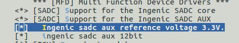

# SADC控制器

## 模块功能介绍

X2500芯片的A/D转换模块是12位的高精度模数转换器，专门用于控制A/D在两种不同的模式下工作:正常操作模式和重复采样。采样数据可以通过CPU传输到内存中。

## 内核源码路径

module_drivers/drivers/mfd/ingenic_adc_v13.c

module_drivers/drivers/mfd/ingenic_adc_aux.c

## 设备树配置

设备树所在位置：

module_drivers/dts/x2500.dtsi

ADC模块设备树：

sadc: sadc@10070000 { 

 compatible = "ingenic,sadc";

 reg = <0x10070000 0x32>;

 interrupt-parent = <&core_intc>; 

 interrupts = <IRQ_SADC>;

 status = "disabled";

 }; 

 

### 设备树默认配置

默认编译会产生sadc设备

### 设备树自定义配置

用户可根据需求在板级设备树中添加sadc，并使能

&sadc { 

 status = "okay"; 

}; 

## 内核编译配置

### 内核默认编译配置

配置内核并编译sadc驱动： 

 Symbol: MFD_INGENIC_SADC_V13 [=y] 

 Type : tristate 

 Defined at module_drivers/drivers/mfd/Kconfig 

 Prompt: [SADC] Support for the Ingenic SADC core 

 

 

 Symbol: MFD_INGENIC_SADC_AUX [=y] 

 Type : tristate 

 Defined at module_drivers/drivers/mfd/Kconfig 

 Prompt: [SADC] Support for the Ingenic SADC AUX 

 

### 内核自定义编译配置

SADC配置界面如下：

## 模块内核差异

无

## 设备节点生成

设备加载成功后会在/dev目录下生成如下节点：

\# cd /dev/

\# ls

/dev/ingenic_adc_aux_0

/dev/ingenic_adc_aux_1

/dev/ingenic_adc_aux_2

/dev/ingenic_adc_aux_3

## 应用程序使用说明

###  应用程序源码位置

packages/example/sadc/

#### 命令行及参数示意

应用程序默认存放在/testsuite/sadc_sample

cd /testsuite/sadc_sample

./sadc_sample adc_num

其中的adc_num指/dev下adc设备节点号；在x2500芯片中，adc_num可取的值为：0,1,2,3.

