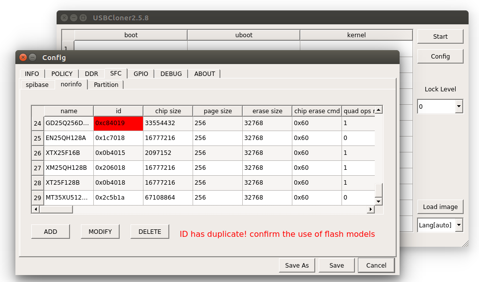

#  SFC控制器

##  模块功能介绍

SFC 是spi master设备，用来控制spi flash。支持CPU模式和DMA模式传输。

* 支持CDT命令传输模式。
* 支持DMA descriptor chain数据传输模式。
* 支持硬件polling flash的状态。
* 支持Standard, Dual, Quad, Octal SPI等多种传输协议。

##  驱动源码位置

驱动源码所在位置：

module_drivers/drivers/mtd/devices/ingenic_sfc_v2/

##  设备树配置

设备树所在位置：

module_drivers/dts/x2500.dtsi

设备树描述：

sfc:sfc@0x13440000 {

compatible = “ingenic,x2500-sfc”;

reg = <0x13440000 0x10000>;

interrupt-parent = <&core_intc>;

interrupts = <IRQ_SFC>;

pinctrl-names = "default";

pinctrl-0 = <&sfc_pa>;

status = "disabled";

};

###  设备树默认配置

设备树默认编译会产生sfc设备

&sfc {

 status = "okay";

 pinctrl-names = "default";

 pinctrl-0 = <&sfc_pa>;

 ingenic,sfc-init-frequency = <20000000>;

 ingenic,sfc-max-frequency = <50000000>;

 ingenic,use_ofpart_info = /bits/ 8 <0>;

 ingenic,spiflash_param_offset = <0>;

};

###  设备树自定义配置

用户可根据实际需求关闭该节点，或进行以下配置：


|  |  |
| --- | --- |
| **属性名称** | **说明** |
| **ingenic,sfc-init-frequency** | sfc控制器在初始化阶段设置的时钟频率，因为未经过时序参数的配置，所以频率较低。 |
| **ingenic,sfc-max-frequency** | 配置sfc最大频率,需要经过4分频,实际线上时钟为(sfc-max-frequency/4)MHz。 |
| **ingenic,use_ofpart_info** | 默认情况下，MTD分区由烧录工具传入，当配置该节点为1时，则使用设备树分区信息。 |
| **ingenic,spiflash_param_offset** | 当使用spi flash存放flash参数和分区信息时, 用于修改spi flash中存放参数的偏移地址。当值为0时,默认偏移为0x5800。 |

##  内核编译配置

内核配置INGENIC_SFC，配置说明如下：

CONFIG_INGENIC_SFC: 

 

 SFC driver for Ingenic series SoCs 

 

 Symbol: INGENIC_SFC [=y] 

 Type : tristate 

 Defined at module_drivers/drivers/mtd/devices/Kconfig:1 

 Prompt: Ingenic series SFC driver 

 Depends on: MACH_XBURST [=n] || MACH_XBURST2 [=y] 

 Location: 

 -> Ingenic device-drivers Configurations 

 -> [SFC] (SPI Nand/Nor Flash) Drivers 

###  内核默认编译配置

默认情况下，内核会配置SFC驱动，如下

Ingenic device-drivers Configurations  --->

[SFC] (SPI Nand/Nor Flash) Drivers  ---> 

NAND:

<*> Ingenic series SFC driver 

Select Ingenic series SFC driver version (Use ingenic sfc driver version 2) ---> 

the SFC external memory (nor or nand) (Support ingenic sfc-nand) ---> 

[ ] ingenic SN and MAC read write support.

NOR:

<*> Ingenic series SFC driver 

 Select Ingenic series SFC driver version (Use ingenic sfc driver version 2) ---> 

 the SFC external memory (nor or nand) (Support ingenic sfc-nor) ---> 

[ ] Use SPI Nor Flash params built in kernel (NEW) ---> 

##  设备节点生成

驱动加载成功后生成以下节点：

/dev/mtd*

mtd字符设备节点

/dev/mtdblock*

mtd块设备节点

##  应用程序使用说明

###  flash读写测试

1. 执行脚本: StorageMedia-Test.sh

#./StorageMedia-Test.sh 

**********************************************

* * Please input which module you want test .

**********************************************

* Enter 1 : Read/Write test in the nand/nor .

* Enter 2 : Read/Write test in the sdcard .

* Enter 3 : Read/Write test in the ddr .

* Enter 4 : Read/Write test between nand/nor and sdcard .

* Enter 5 : Read/Write test between nand/nor and ddr .

* Enter 6 : Read/Write test between ddr and sdcard .

2. 输入1

You select 1, nand/nor <-> nand/nor

***************************************************

* * Please choice which Size you want copy .

***************************************************

* Enter 1 : auto random Size

* Enter 2 : setting a fix Size

3. 输入1或输入2

选择1:测试随机大小的数据(根据flash剩余空间,自己计算大小)

选择2:测试指定大小的数据(Kbyte)

4. flash读写测试开始,连续测试一段时间,如果无错误打印、异常退出，则正常。

##  添加新的flash参数

###  添加 NOR flash参数

一、通过cloner烧录工具添加spi nor flash参数（推荐）

1.打开cloner中的Config，在INFO菜单下，选择Board为“x2500_sfc_nor_ddr3_linux.cfg”。

2.在SFC菜单下，选择二级菜单norinfo，选择ADD。

3.在弹出的对话框中按照spi nor flash的参数填上保存即可。

注: 烧录工具中id号为红色时，表示存在多个相同ID的flash参数，需要手动删除冲突的flash参数



二、在内核中添加NOR flash参数

如果需要添加自定义型号的flash，添加流程如下：

1. 根据flash型号， 添加base params、cdt params、private params参数。参考如下：

module_drivers/drivers/mtd/devices/ingenic_sfc_v2/nor_device/nor_device.c*

1. 添加config配置，参考如下:

module_drivers/drivers/mtd/devices/Kconfig

###  添加 NAND flash参数

一、添加NAND flash厂商支持

各厂商NAND flash参数配置文件位置

***module_drivers/drivers/mtd/devices/ingenic_sfc_v2/nand_device/***

若存在该厂商的配置文件，则跳过此步骤；

若不存在，则需要参照其他厂商的参数配置文件，编写自己的配置文件。例如:

 ***cp gd_nand.c myflash_nand.c && vi myflash_nand.c***

flash参数配置文件主要构成（例如gd_nand.c）

***/* 1. flash支持型号的个数　*/***

***define GD_DEVICES_NUM 7***

***/* 2． flash的基础参数　*/***

***static struct ingenic_sfcnand_base_param gd_param[GD_DEVICES_NUM] = {***

***[0] = { ...},***

***}***

***/* 3. flash的id和参数建立关联 */***

***static struct device_id_struct device_id[GD_DEVICES_NUM] = {***

***DEVICE_ID_STRUCT(0xD1, "GD5F1GQ4UB",&gd_param[0]),***

***...***

***}***

***/* 4. flash获取默认的cdt参数，并根据id更新参数*/***

***static cdt_params_t *gd_get_cdt_params(struct sfc_flash *flash, uint8_t device_id){***

***...***

***}***

***/* 5. 使用通用的get feature接口，需要定义处理ecc的接口　*/***

***static inline int deal_ecc_status(struct sfc_flash *flash, uint8_t device_id, uint8_t ecc_status){***

***...***

***}***

***/* 6.注册flash参数　*/***

***static int __init gd_nand_init(void) {***

***...***

***}***

二、添加nand flash型号支持

 需要对照flash手册，完成以下步骤

1. 添加flash基础参数．

 ***[6] = {.pagesize = 2 * 1024, ... },***

2. 建立flash与参数的关联

***DEVICE_ID_STRUCT(0xA1, "GD5F1GQ4RF",&gd_param[6]),***

3. 根据id,更新默认参数

***case 0xA1:***

***gd_nand->cdt_params.standard_r.addr_nbyte = 3;***

***gd_nand->cdt_params.quad_r.addr_nbyte = 3;***

***break;***

4. 在处理ecc的接口中添加对应型号的处理

***switch(device_id) {***

***case 0xA1:***

***．．．***

***}***

5. 将支持flash总数＋１

***#define GD_DEVICES_NUM 7***

三、对照flash手册比较默认参数，更新参数

默认command参数文件:

***module_drivers/drivers/mtd/devices/ingenic_sfc_v2/nand_device/nand_common.h***

制作参数接口说明:

控制flash相关:

***/*CMD_INFO(_CMD, flash命令, dummy bits, 地址长度, 传输协议)*/***

***读flash状态的参数***

***/*ST_INFO(_ST, flash命令, status偏移bit, status状态位的mask, status状态位的期望值, 传输长度, dummy bits)*/***

例如:


|  |  |  |  |  |  |  |
| --- | --- | --- | --- | --- | --- | --- |
| **Command Name** | **Byte 1** | **Byte 2** | **Byte 3** | **Byte 4** | **Byte 5** | **Byte N** |
| **Read From Cache x 4** | 6BH | dummy (2) | A15-A8 | A7-A0 | dummy (2) | (D7-D0)x4 |

***/*dummy 8bit, 地址长度３，传输协议对应sfc手册:TM_QI_QO_SPI*/***

***CMD_INFO(cdt_params.quad_r, SPINAND_CMD_RDCH_X4, 8, 2, TM_QI_QO_SPI);***


|  |  |  |  |  |  |  |  |  |  |
| --- | --- | --- | --- | --- | --- | --- | --- | --- | --- |
| **Register** | **Addr** | **7** | **6** | **5** | **4** | **3** | **2** | **1** | **0** |
| **Status** | C0H | Reserved | ECCS2 | ECCS1 | ECCS0 | P_FAIL | E_FAIL | WEL | OIP |

***/*OIP偏移 bit是０, status状态位mask是0x1, 期望值0x0，传输长度１byte, get feature dummy 0bit*/***

***ST_INFO(cdt_params.oip, SPINAND_CMD_GET_FEATURE, 0, 0x1, 0x0, 1, 0);***

默认command参数如下
```c
/*

* cdt params

*/

#define CDT_PARAMS_INIT(cdt_params) { \

/* read to cache */ \

CMD_INFO(cdt_params.r_to_cache, SPINAND_CMD_PARD, 0, 3, TM_STD_SPI); \

/* standard read from cache */ \

CMD_INFO(cdt_params.standard_r, SPINAND_CMD_FRCH, 8, 2, TM_STD_SPI); \

/* quad read from cache*/ \

CMD_INFO(cdt_params.quad_r, SPINAND_CMD_RDCH_X4, 8, 2, TM_QI_QO_SPI); \

/* standard write to cache*/ \

CMD_INFO(cdt_params.standard_w_cache, SPINAND_CMD_PRO_LOAD, 0, 2, TM_STD_SPI); \

/* quad write to cache*/ \

CMD_INFO(cdt_params.quad_w_cache, SPINAND_CMD_PRO_LOAD_X4, 0, 2, TM_QI_QO_SPI); \

/* write exec */ \

CMD_INFO(cdt_params.w_exec, SPINAND_CMD_PRO_EN, 0, 3, TM_STD_SPI); \

/* block erase */ \

CMD_INFO(cdt_params.b_erase, SPINAND_CMD_ERASE_128K, 0, 3, TM_STD_SPI); \

/* write enable */ \

CMD_INFO(cdt_params.w_en, SPINAND_CMD_WREN, 0, 0, TM_STD_SPI); \

\

/* get frature wait oip not busy */ \

ST_INFO(cdt_params.oip, SPINAND_CMD_GET_FEATURE, 0, 0x1, 0x0, 1, 0); \

}
```
参数更新(例如gd_nand.c)

static cdt_params_t *gd_get_cdt_params(struct sfc_flash *flash, uint8_t device_id) {

switch(device_id) {

...

case 0xA1:

gd_nand->cdt_params.standard_r.addr_nbyte = 3; /*地址长度更新为3byte*/

gd_nand->cdt_params.quad_r.addr_nbyte = 3;/*地址长度更新为3byte*/

break;

...

}

四、配置get_feature接口

默认get_feature接口位置:

module_drivers/drivers/mtd/devices/ingenic_sfc_v2/nand_device/nand_common.c

可以使用默认的get_feature接口，特殊情况下需要自定义ECC的处理接口

static inline int deal_ecc_status(struct sfc_flash *flash, uint8_t device_id, uint8_t ecc_status) { 

switch(device_id) {

case 0xA1:

case 0xB1 ... 0xB4:

switch((ecc_status >> 4) & 0x7) {

case 0x7:

ret = -EBADMSG;

break;

case 0x6:

ret = 0x8;

break;

case 0x5:

ret = 0x7;

break;

default:

ret = 0;

}

...

break;

}

自定义get_feature接口：

1. 在flash参数的配置文件中定义自己的get＿feature接口

2. 将自己定义的接口注册到参数中

int32_t my_get_feature(struct sfc_flash *flash, uint8_t flag) {

...

}

static int __init gd_nand_init(void) {

...

/* use private get feature interface, please define it in this document */

//gd_nand->ops.get_feature = NULL;

gd_nand->ops.get_feature = my_get_feature();

...

}

##  注意事项

1.Nand Flash ECC方案

使用nand flash自带的硬件ECC, 基于MTD框架，在内存中建立BBT。

2.当前支持的参数位置

NAND: 目录module_drivers/drivers/mtd/devices/ingenic_sfc_v2/nand_device/下

NOR: 见烧录工具norinfo 界面

3.Kernel可以使用u-boot内置参数，详细参考uboot文档。

需要依赖u-boot，kernel使用默认配置即可。

4.支持多Die的SPI NOR Flash

spl: 暂不支持多Die切换。

参数: 当flash参数使用烧录方式时，必须存放于Die0。

启动: 支持重启异常时reset flash切换Die0。

5.使用SFC的PD组GPIO时，要确保PE组GPIO配置成其它function

注：

1. 当PD组和PE组同时配置为sfc function时，优先级PE>PD

2. boot select 选择usb启动或者sfc 1.8v启动

3. 选择sfc pD GPIO，修改设备树如下：

例：module_drivers/dts/hippo_v12.dts

&sfc {

．．．

pinctrl-0 = <&sfc_pd_4bit>; 

．．．

