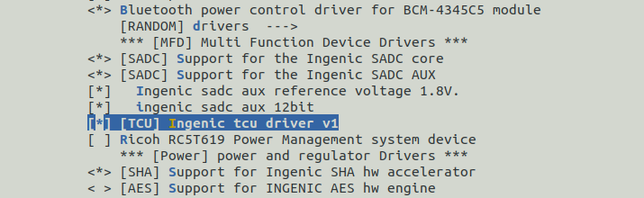

# TCU定时器单元

## **模块功能介绍**

定时计数单元(TCU)芯片设计包含８个tcu通道分别是0~7标号，每个通道可以有三个时钟输入源PCLK、EXTAL、RTCCLK。

按照spec描述可以分为2种功能模式分别是：

tcu计数模式：常规的TCU计数模式。

pwm模式：因为pwm和tcu共用一个模块，所以有pwm模式。

## **驱动位置**

驱动源码所在位置

***module_drivers/drivers/mfd/ingenic-tcu_v1.c***

## **设备树配置**

设备树所在位置：

module_drivers/dts/x2500.dtsi

TCU控制器述：

tcu: tcu@0x10002000 {

 compatible = "ingenic,x2500-tcu";

 reg = <0x10002000 0x140>;

 interrupt-parent = <&core_intc>;

 interrupt-names = "tcu_int0", "tcu_int1", "tcu_int2";

 interrupts = <IRQ_TCU0 IRQ_TCU1 IRQ_TCU2>;

 interrupt-controller;

 status = "ok";

 channel0: channel0 {

 compatible = "ingenic,tcu_chn0";

 ingenic,channel-info = <CHANNEL_INFO(0, TCU_MODE1, PWM_FUNC, \

 NO_PWM_IN,NOWORK_SLEEP)>;

 };

 channel1: channel1 {

 compatible = "ingenic,tcu_chn1";

 ingenic,channel-info = <CHANNEL_INFO(1, TCU_MODE2, PWM_FUNC, \

 NO_PWM_IN,NOWORK_SLEEP)>;

 };

... ...

};

### **设备树默认配置**

设备树默认编译会产生tcu设备

## **内核编译配置**

内核配置MFD_INGENIC_TCU_V1，配置如下：

## **设备节点生成**

驱动加载成功后生成以下节点：

cd sys/devices/platform/apb/10002000.tcu/

disable enable power

driver modalias subsystem

driver_override of_node uevent

